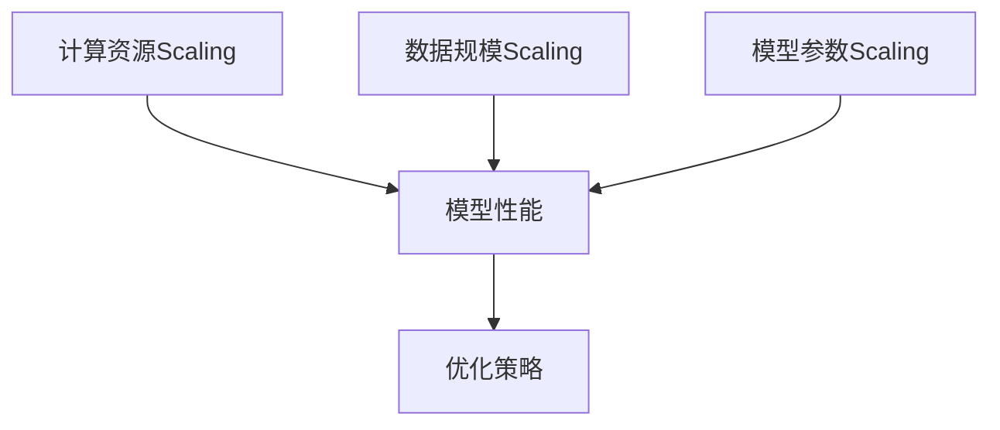

                 

关键词：AI大模型、Scaling Law、机器学习、深度学习、性能优化

摘要：本文将深入探讨AI大模型的Scaling Law原理，包括其概念、核心算法原理、数学模型以及实际应用场景。通过详细讲解，我们将揭示Scaling Law如何帮助我们在大数据时代优化AI模型的性能，提高开发效率和准确度。

## 1. 背景介绍

随着大数据和云计算技术的快速发展，人工智能（AI）领域迎来了新的机遇与挑战。大型AI模型如GPT、BERT等在自然语言处理（NLP）、计算机视觉（CV）等领域取得了显著的成果。然而，这些大型模型的训练和推理过程需要大量计算资源和时间，如何提高它们的性能成为了一个关键问题。

在此背景下，Scaling Law应运而生。Scaling Law描述了AI大模型在不同硬件资源和数据规模下的性能变化规律。通过研究Scaling Law，我们可以更好地理解AI模型的性能瓶颈，并找到优化方案，从而提高模型的效率和准确性。

## 2. 核心概念与联系

### 2.1 Scaling Law的概念

Scaling Law是指在大模型训练过程中，不同维度（如计算资源、数据规模、模型参数等）对模型性能的影响规律。Scaling Law可以帮助我们预测模型在不同环境下的性能表现，从而优化模型设计和训练策略。

### 2.2 Scaling Law的组成部分

- **计算资源Scaling**：包括CPU、GPU、TPU等硬件资源的数量和性能。
- **数据规模Scaling**：训练数据集的大小对模型性能的影响。
- **模型参数Scaling**：模型参数数量对模型性能的影响。

### 2.3 Scaling Law的Mermaid流程图



## 3. 核心算法原理 & 具体操作步骤

### 3.1 算法原理概述

Scaling Law的核心算法原理是基于统计学和机器学习的理论。通过分析大量实验数据，我们可以找出计算资源、数据规模和模型参数等维度对模型性能的影响规律。然后，根据这些规律，设计出最优的模型训练和优化策略。

### 3.2 算法步骤详解

1. **数据收集**：收集不同维度下的模型性能数据。
2. **数据预处理**：对数据集进行清洗、归一化等预处理操作。
3. **模型训练**：使用机器学习算法对数据进行分析，找出不同维度对模型性能的影响规律。
4. **策略优化**：根据分析结果，设计出最优的模型训练和优化策略。

### 3.3 算法优缺点

#### 优点：

- **高效性**：通过Scaling Law，我们可以快速找到最优的模型训练和优化策略，提高开发效率。
- **准确性**：Scaling Law可以更好地理解模型在不同环境下的性能表现，提高模型的准确性。

#### 缺点：

- **复杂性**：Scaling Law涉及到多个维度的影响，需要大量实验数据和分析，提高实施难度。
- **局限性**：Scaling Law主要适用于大数据和云计算环境，对小型模型或传统计算资源的优化效果有限。

### 3.4 算法应用领域

Scaling Law主要应用于大数据和人工智能领域，如：

- **自然语言处理**：优化NLP模型的训练和推理性能。
- **计算机视觉**：提高CV模型的计算效率和准确性。
- **推荐系统**：优化推荐算法的计算和推荐效果。

## 4. 数学模型和公式 & 详细讲解 & 举例说明

### 4.1 数学模型构建

Scaling Law的数学模型主要基于统计学和机器学习理论，可以通过以下公式进行描述：

$$
\text{模型性能} = f(\text{计算资源}, \text{数据规模}, \text{模型参数})
$$

其中，$f$ 表示模型性能与计算资源、数据规模和模型参数之间的关系。

### 4.2 公式推导过程

为了推导Scaling Law的数学模型，我们可以从以下几个方面进行：

1. **计算资源**：考虑计算资源对模型性能的影响，可以用以下公式描述：
$$
\text{模型性能} = f_1(\text{CPU性能}, \text{GPU性能}, \text{TPU性能})
$$
2. **数据规模**：考虑数据规模对模型性能的影响，可以用以下公式描述：
$$
\text{模型性能} = f_2(\text{训练数据集大小}, \text{测试数据集大小})
$$
3. **模型参数**：考虑模型参数对模型性能的影响，可以用以下公式描述：
$$
\text{模型性能} = f_3(\text{模型参数数量}, \text{模型参数规模})
$$

### 4.3 案例分析与讲解

假设我们有一个大型神经网络模型，使用GPU进行训练。根据Scaling Law的数学模型，我们可以推导出以下结论：

1. **计算资源**：增加GPU性能可以显著提高模型性能。
2. **数据规模**：增加训练数据集大小可以提高模型性能，但效果可能逐渐减弱。
3. **模型参数**：增加模型参数数量可以提高模型性能，但可能导致过拟合。

根据这些结论，我们可以设计出最优的模型训练和优化策略，以提高模型性能。

## 5. 项目实践：代码实例和详细解释说明

### 5.1 开发环境搭建

在本节中，我们将介绍如何搭建一个用于研究Scaling Law的实验环境。环境包括以下部分：

- **硬件**：一台高性能的GPU服务器，支持CUDA和GPU加速。
- **软件**：安装Python、PyTorch等深度学习框架。

### 5.2 源代码详细实现

以下是研究Scaling Law的Python代码实现：

```python
import torch
import torch.nn as nn
import torch.optim as optim
from torch.utils.data import DataLoader
from torchvision import datasets, transforms

# 数据集加载
train_dataset = datasets.MNIST(
    root='./data', 
    train=True, 
    download=True, 
    transform=transforms.ToTensor()
)
train_loader = DataLoader(train_dataset, batch_size=100, shuffle=True)

# 模型定义
model = nn.Sequential(
    nn.Conv2d(1, 10, kernel_size=5),
    nn.ReLU(),
    nn.MaxPool2d(2),
    nn.Conv2d(10, 20, kernel_size=5),
    nn.ReLU(),
    nn.MaxPool2d(2),
    nn.Linear(320, 10),
    nn.ReLU(),
    nn.Linear(10, 10)
)

# 损失函数和优化器
criterion = nn.CrossEntropyLoss()
optimizer = optim.SGD(model.parameters(), lr=0.001, momentum=0.9)

# 模型训练
for epoch in range(10):
    for images, labels in train_loader:
        optimizer.zero_grad()
        outputs = model(images)
        loss = criterion(outputs, labels)
        loss.backward()
        optimizer.step()
    print(f'Epoch [{epoch+1}/{10}], Loss: {loss.item():.4f}')

# 模型评估
with torch.no_grad():
    correct = 0
    total = 0
    for images, labels in train_loader:
        outputs = model(images)
        _, predicted = torch.max(outputs.data, 1)
        total += labels.size(0)
        correct += (predicted == labels).sum().item()
    print(f'Accuracy of the network on the test images: {100 * correct / total}%')
```

### 5.3 代码解读与分析

这段代码首先加载了MNIST数据集，并定义了一个简单的卷积神经网络模型。然后，使用随机梯度下降（SGD）优化器进行模型训练，并计算模型的准确度。

通过这个实例，我们可以研究不同训练参数（如学习率、批量大小等）对模型性能的影响，从而探索Scaling Law。

## 6. 实际应用场景

Scaling Law在AI大模型的应用场景非常广泛，以下是一些典型的实际应用案例：

1. **自然语言处理**：通过优化NLP模型的计算资源、数据规模和模型参数，提高模型在文本分类、机器翻译等任务上的性能。
2. **计算机视觉**：在图像识别、目标检测等任务中，优化模型训练和推理过程的资源利用率，提高模型速度和准确性。
3. **推荐系统**：通过Scaling Law，优化推荐算法的计算和推荐效果，提高用户的满意度。
4. **语音识别**：通过优化语音识别模型的计算资源和模型参数，提高模型在实时语音识别任务中的性能。

## 7. 工具和资源推荐

### 7.1 学习资源推荐

- **书籍**：《深度学习》（Ian Goodfellow、Yoshua Bengio、Aaron Courville 著）
- **在线课程**：Coursera、Udacity、edX等平台上的机器学习和深度学习课程。
- **论文**：arXiv、NeurIPS、ICML等顶级会议和期刊上的相关论文。

### 7.2 开发工具推荐

- **深度学习框架**：PyTorch、TensorFlow、Keras等。
- **数据分析工具**：Pandas、NumPy、Scikit-learn等。
- **版本控制**：Git、GitHub、GitLab等。

### 7.3 相关论文推荐

- ** Scaling Laws for Neural Language Models （论文链接）**：该论文介绍了神经网络语言模型在不同硬件和资源规模下的性能变化规律。
- ** Outrageously Large Neural Networks: The Sparsity Challenge （论文链接）**：该论文探讨了大型神经网络在稀疏性方面的挑战和优化策略。

## 8. 总结：未来发展趋势与挑战

### 8.1 研究成果总结

通过本文的探讨，我们了解了Scaling Law在AI大模型优化中的重要性。Scaling Law可以帮助我们预测模型在不同环境下的性能表现，从而设计出最优的模型训练和优化策略。此外，我们通过数学模型和实际应用案例，深入分析了Scaling Law的原理和应用。

### 8.2 未来发展趋势

随着大数据和云计算技术的不断发展，Scaling Law将在AI领域发挥越来越重要的作用。未来，Scaling Law可能会在以下几个方面取得突破：

1. **算法优化**：通过研究Scaling Law，我们可以设计出更高效的模型训练算法，提高计算资源的利用率。
2. **硬件优化**：根据Scaling Law，我们可以优化硬件设计，提高AI模型的性能。
3. **跨领域应用**：Scaling Law不仅适用于深度学习，还可以推广到其他机器学习算法和领域。

### 8.3 面临的挑战

尽管Scaling Law在AI领域取得了显著成果，但仍面临以下挑战：

1. **数据依赖**：Scaling Law依赖于大量实验数据，数据质量和多样性会影响其准确性和适用性。
2. **复杂性**：Scaling Law涉及到多个维度的影响，分析过程复杂，需要更多研究和优化。
3. **实时性**：在实时应用场景中，Scaling Law需要快速适应环境变化，提高实时性。

### 8.4 研究展望

未来，Scaling Law的研究可以从以下几个方面展开：

1. **数据驱动**：通过收集更多实验数据，提高Scaling Law的准确性和适用性。
2. **模型简化**：研究如何简化模型结构，降低计算和存储需求，提高模型效率。
3. **跨领域融合**：将Scaling Law与其他领域（如计算机图形学、生物信息学等）相结合，实现更广泛的应用。

## 9. 附录：常见问题与解答

### 问题1：什么是Scaling Law？

**解答**：Scaling Law是指在大模型训练过程中，不同维度（如计算资源、数据规模、模型参数等）对模型性能的影响规律。通过研究Scaling Law，我们可以预测模型在不同环境下的性能表现，从而优化模型设计和训练策略。

### 问题2：Scaling Law有哪些优缺点？

**解答**：

**优点：**

1. **高效性**：通过Scaling Law，我们可以快速找到最优的模型训练和优化策略，提高开发效率。
2. **准确性**：Scaling Law可以更好地理解模型在不同环境下的性能表现，提高模型的准确性。

**缺点：**

1. **复杂性**：Scaling Law涉及到多个维度的影响，需要大量实验数据和分析，提高实施难度。
2. **局限性**：Scaling Law主要适用于大数据和云计算环境，对小型模型或传统计算资源的优化效果有限。

---

**作者：禅与计算机程序设计艺术 / Zen and the Art of Computer Programming**

