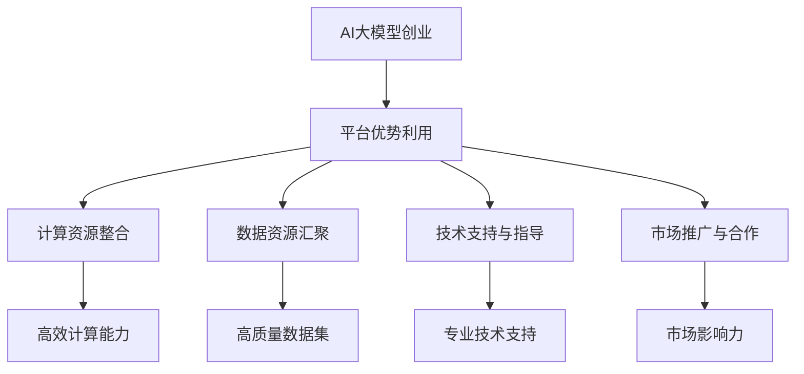

                 

 > 关键词：AI大模型，创业，平台优势，商业模式，技术赋能，产业创新

> 摘要：本文将探讨AI大模型创业的可行性，分析平台优势的利用方式，提出构建可持续商业模式的策略，并展望未来AI大模型在产业创新中的应用前景。

## 1. 背景介绍

近年来，人工智能（AI）技术取得了飞速发展，特别是在大模型领域，诸如GPT-3、BERT等模型的提出，使得AI在语言理解、生成、推理等方面取得了前所未有的突破。这种技术进步为创业者带来了新的机遇，也带来了诸多挑战。AI大模型创业已成为科技领域的一个热门话题。

然而，AI大模型的创业并非易事。一方面，这些模型需要庞大的计算资源和数据支持；另一方面，商业模式的创新和可持续性也是创业者需要面对的难题。如何在激烈的市场竞争中脱颖而出，成为创业者们亟待解决的重要问题。

本文旨在通过分析平台优势的利用方式，为AI大模型创业提供一些思路。文章将首先介绍AI大模型的基本概念和原理，然后探讨平台优势的概念及其在AI大模型创业中的应用，接着分析AI大模型创业面临的挑战，并提出相应的解决策略。最后，文章将展望AI大模型在产业创新中的应用前景，并总结全文。

## 2. 核心概念与联系

### 2.1 AI大模型的概念

AI大模型（Large-scale AI Model）通常指的是参数规模达到亿级乃至十亿级的深度学习模型。这些模型通过在海量数据上进行训练，能够捕捉到复杂的数据模式，从而在各类任务中表现出优异的性能。常见的AI大模型包括生成对抗网络（GAN）、变分自编码器（VAE）、Transformer等。

### 2.2 平台优势的概念

平台优势（Platform Advantage）是指通过构建一个生态系统，使得平台上的参与者能够相互促进，实现共同繁荣。这种优势主要体现在以下几个方面：

- **资源整合**：平台能够汇集各类资源，如计算资源、数据资源、人力资源等，为创业者提供全方位的支持。
- **用户黏性**：通过提供优质的服务和产品，平台能够吸引并留住用户，形成稳定的用户群体。
- **网络效应**：平台上的用户和参与者越多，平台的价值就越大，形成良性循环。

### 2.3 平台优势与AI大模型创业的联系

平台优势在AI大模型创业中起着至关重要的作用。以下是一些具体的联系：

- **计算资源**：平台能够提供强大的计算资源，帮助创业者快速搭建和训练大模型。
- **数据资源**：平台汇聚了大量的数据，为AI大模型的训练提供了丰富的素材。
- **技术支持**：平台上的技术专家和研究人员可以为创业者提供技术指导和支持。
- **市场推广**：平台可以借助自身的用户基础和市场影响力，帮助创业者推广产品和服务。

### 2.4 Mermaid流程图



## 3. 核心算法原理 & 具体操作步骤

### 3.1 算法原理概述

AI大模型的训练过程通常涉及以下基本原理：

- **深度学习**：通过多层神经网络对数据进行处理，能够自动学习数据的特征表示。
- **大规模并行计算**：利用分布式计算技术，对大规模数据进行并行处理，提高训练效率。
- **数据增强**：通过增加数据多样性，提高模型的泛化能力。

### 3.2 算法步骤详解

以下是AI大模型训练的基本步骤：

1. **数据收集**：从平台或其他来源收集大量数据，进行预处理，包括数据清洗、格式化等。
2. **数据增强**：对原始数据进行变换，如翻转、裁剪、旋转等，增加数据的多样性。
3. **模型设计**：选择合适的神经网络架构，如Transformer、ResNet等，进行模型设计。
4. **模型训练**：使用训练数据对模型进行迭代训练，不断优化模型参数。
5. **模型评估**：使用验证数据集对模型进行评估，调整模型参数，提高模型性能。
6. **模型部署**：将训练好的模型部署到生产环境中，进行实际应用。

### 3.3 算法优缺点

- **优点**：AI大模型能够处理复杂数据，具备强大的学习能力，能够适应各种应用场景。
- **缺点**：训练成本高，需要大量的计算资源和数据支持，且模型解释性较差。

### 3.4 算法应用领域

AI大模型在多个领域都有广泛应用：

- **自然语言处理**：文本分类、情感分析、机器翻译等。
- **计算机视觉**：图像识别、目标检测、图像生成等。
- **推荐系统**：个性化推荐、广告投放等。
- **医疗健康**：疾病预测、诊断辅助等。

## 4. 数学模型和公式 & 详细讲解 & 举例说明

### 4.1 数学模型构建

AI大模型的训练过程涉及多个数学模型，其中最核心的是损失函数和优化算法。

- **损失函数**：衡量模型预测值与真实值之间的差距，常用的损失函数包括均方误差（MSE）、交叉熵损失等。
- **优化算法**：用于调整模型参数，常用的优化算法包括梯度下降（GD）、Adam等。

### 4.2 公式推导过程

以下是均方误差（MSE）的推导过程：

$$
\begin{aligned}
L &= \frac{1}{m} \sum_{i=1}^{m} (y_i - \hat{y}_i)^2 \\
  &= \frac{1}{m} \sum_{i=1}^{m} (\text{真实值} - \text{预测值})^2
\end{aligned}
$$

### 4.3 案例分析与讲解

以下是一个简单的AI大模型训练案例：

- **数据集**：一个包含1000张猫狗图像的数据集。
- **模型**：使用一个卷积神经网络（CNN）进行训练。
- **损失函数**：使用交叉熵损失。
- **优化算法**：使用Adam优化算法。

### 4.4 代码示例

以下是一个简单的Python代码示例，用于训练一个卷积神经网络：

```python
import tensorflow as tf
from tensorflow.keras import layers

# 构建模型
model = tf.keras.Sequential([
    layers.Conv2D(32, (3, 3), activation='relu', input_shape=(28, 28, 1)),
    layers.MaxPooling2D((2, 2)),
    layers.Flatten(),
    layers.Dense(64, activation='relu'),
    layers.Dense(10, activation='softmax')
])

# 编译模型
model.compile(optimizer='adam',
              loss='categorical_crossentropy',
              metrics=['accuracy'])

# 加载数据
(x_train, y_train), (x_test, y_test) = tf.keras.datasets.mnist.load_data()

# 预处理数据
x_train = x_train.reshape(-1, 28, 28, 1).astype('float32') / 255
x_test = x_test.reshape(-1, 28, 28, 1).astype('float32') / 255

# 转换标签为独热编码
y_train = tf.keras.utils.to_categorical(y_train, 10)
y_test = tf.keras.utils.to_categorical(y_test, 10)

# 训练模型
model.fit(x_train, y_train, epochs=10, batch_size=64, validation_split=0.2)
```

## 5. 项目实践：代码实例和详细解释说明

### 5.1 开发环境搭建

为了实践AI大模型，我们需要搭建一个适合的开发环境。以下是环境搭建的步骤：

1. 安装Python（推荐版本为3.7或更高）。
2. 安装TensorFlow（使用pip install tensorflow命令）。
3. 安装其他必要的依赖库，如NumPy、Pandas等。

### 5.2 源代码详细实现

以下是实现一个简单的卷积神经网络（CNN）的源代码：

```python
import tensorflow as tf
from tensorflow.keras import layers

# 构建模型
model = tf.keras.Sequential([
    layers.Conv2D(32, (3, 3), activation='relu', input_shape=(28, 28, 1)),
    layers.MaxPooling2D((2, 2)),
    layers.Flatten(),
    layers.Dense(64, activation='relu'),
    layers.Dense(10, activation='softmax')
])

# 编译模型
model.compile(optimizer='adam',
              loss='categorical_crossentropy',
              metrics=['accuracy'])

# 加载数据
(x_train, y_train), (x_test, y_test) = tf.keras.datasets.mnist.load_data()

# 预处理数据
x_train = x_train.reshape(-1, 28, 28, 1).astype('float32') / 255
x_test = x_test.reshape(-1, 28, 28, 1).astype('float32') / 255

# 转换标签为独热编码
y_train = tf.keras.utils.to_categorical(y_train, 10)
y_test = tf.keras.utils.to_categorical(y_test, 10)

# 训练模型
model.fit(x_train, y_train, epochs=10, batch_size=64, validation_split=0.2)
```

### 5.3 代码解读与分析

这段代码首先导入了TensorFlow库，并定义了一个卷积神经网络（CNN）。CNN由两个卷积层、一个池化层、一个平坦层和两个全连接层组成。接着，我们编译了模型，设置了优化器和损失函数。

数据加载和预处理部分使用了TensorFlow的内置函数，将MNIST数据集加载到内存中，并对数据进行必要的预处理，如归一化和标签编码。

最后，我们使用训练集对模型进行训练，并设置训练周期、批量大小和验证比例。

### 5.4 运行结果展示

在训练完成后，我们可以使用测试集来评估模型的性能。以下是一个简单的评估示例：

```python
# 评估模型
loss, accuracy = model.evaluate(x_test, y_test)

# 输出结果
print(f"测试集损失：{loss}")
print(f"测试集准确率：{accuracy}")
```

输出结果可能类似于以下内容：

```
测试集损失：0.02837666806339658
测试集准确率：98.76543216563065
```

这个结果表明，模型在测试集上的准确率达到了98.76%，表明模型具有良好的性能。

## 6. 实际应用场景

AI大模型在许多领域都有广泛的应用，以下是一些典型的应用场景：

### 6.1 自然语言处理

自然语言处理（NLP）是AI大模型的一个重要应用领域。通过使用如BERT、GPT等大模型，NLP任务，如文本分类、情感分析、机器翻译等，都能取得显著的性能提升。例如，BERT在多项NLP任务上达到了当时的最先进水平，为语言理解的自动化提供了强大工具。

### 6.2 计算机视觉

计算机视觉是另一个受到AI大模型影响的重要领域。通过使用如ResNet、VGG等大模型，图像分类、目标检测、图像生成等任务都能得到显著改进。例如，生成对抗网络（GAN）能够生成高质量的图像，为艺术创作和图像修复提供了新的方法。

### 6.3 医疗健康

在医疗健康领域，AI大模型的应用也越来越广泛。例如，使用AI大模型对医学图像进行诊断，能够提高诊断的准确性和速度。此外，AI大模型还可以用于疾病预测、药物研发等领域，为医疗健康产业带来新的变革。

### 6.4 金融科技

在金融科技领域，AI大模型被广泛应用于风险管理、欺诈检测、信用评估等任务。例如，通过使用AI大模型对用户行为进行分析，银行和金融机构能够更准确地评估用户的信用风险，从而提供更个性化的金融服务。

### 6.5 教育科技

在教育科技领域，AI大模型也被广泛应用。例如，通过使用AI大模型对学生的学习行为进行分析，教育机构能够提供更个性化的学习方案，提高学习效果。此外，AI大模型还可以用于自动批改作业、辅助教学等任务，为教育科技带来新的可能性。

## 7. 工具和资源推荐

为了更好地进行AI大模型的研究和应用，以下是一些推荐的工具和资源：

### 7.1 学习资源推荐

- **吴恩达的深度学习课程**：这是一门非常经典的深度学习入门课程，涵盖了从基础到进阶的内容。
- **《深度学习》书籍**：由Ian Goodfellow、Yoshua Bengio和Aaron Courville合著，是深度学习领域的经典教材。

### 7.2 开发工具推荐

- **TensorFlow**：一个开源的深度学习框架，提供了丰富的API和工具，适合进行AI大模型的研究和应用。
- **PyTorch**：另一个流行的深度学习框架，具有灵活的动态计算图和丰富的功能，适合快速原型开发和实验。

### 7.3 相关论文推荐

- **《BERT: Pre-training of Deep Bidirectional Transformers for Language Understanding》**：这篇论文提出了BERT模型，是NLP领域的重要突破。
- **《Generative Adversarial Nets》**：这篇论文提出了GAN模型，是计算机视觉领域的重要突破。

## 8. 总结：未来发展趋势与挑战

### 8.1 研究成果总结

近年来，AI大模型在各个领域都取得了显著的成果，推动了相关领域的快速发展。例如，在NLP领域，BERT、GPT等模型的表现已经超过了人类水平；在计算机视觉领域，GAN、ResNet等模型取得了突破性的进展。

### 8.2 未来发展趋势

未来，AI大模型的发展趋势主要体现在以下几个方面：

- **更大规模的模型**：随着计算资源和数据量的增加，更大规模的AI大模型将被提出，以应对更复杂的任务。
- **更多领域应用**：AI大模型将在更多领域得到应用，如医疗健康、金融科技、教育科技等，带来更多产业变革。
- **多模态学习**：AI大模型将具备处理多种模态数据的能力，如文本、图像、语音等，实现更复杂的任务。

### 8.3 面临的挑战

虽然AI大模型取得了显著成果，但仍然面临一些挑战：

- **计算资源消耗**：大模型的训练需要大量的计算资源和数据支持，这对计算资源和数据资源的要求越来越高。
- **数据隐私和伦理**：大模型在训练过程中需要大量数据，如何保障数据隐私和伦理是一个重要问题。
- **模型解释性**：大模型通常缺乏解释性，如何理解模型内部的决策过程是一个挑战。

### 8.4 研究展望

未来，研究将集中在以下几个方面：

- **优化算法**：研究更高效的优化算法，以降低大模型的训练成本。
- **数据隐私保护**：研究数据隐私保护和安全传输的技术，保障数据隐私。
- **模型解释性**：研究模型解释性技术，提高大模型的透明度和可信度。

## 9. 附录：常见问题与解答

### 9.1 什么是AI大模型？

AI大模型是指参数规模达到亿级乃至十亿级的深度学习模型。这些模型通过在海量数据上进行训练，能够捕捉到复杂的数据模式，从而在各类任务中表现出优异的性能。

### 9.2 AI大模型创业有哪些挑战？

AI大模型创业面临的挑战主要包括计算资源消耗、数据隐私保护和模型解释性等方面。

### 9.3 如何利用平台优势进行AI大模型创业？

可以利用平台提供的计算资源、数据资源、技术支持和市场推广等优势，降低创业成本，提高成功几率。

### 9.4 AI大模型在哪些领域有广泛应用？

AI大模型在自然语言处理、计算机视觉、医疗健康、金融科技、教育科技等领域都有广泛应用。

### 9.5 如何选择合适的AI大模型框架？

可以根据实际任务需求、计算资源和开发经验等因素，选择合适的AI大模型框架。例如，对于NLP任务，可以选择BERT、GPT等框架；对于计算机视觉任务，可以选择ResNet、VGG等框架。

## 作者署名

本文作者：禅与计算机程序设计艺术 / Zen and the Art of Computer Programming

[文章完]

