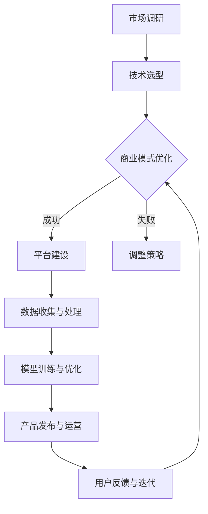

                 

关键词：AI大模型、创业、平台优势、商业模式、技术架构、数据利用、创新应用

摘要：本文深入探讨AI大模型创业的可行性和策略，分析如何通过平台优势实现商业成功。文章首先介绍AI大模型的基本概念和现状，接着探讨平台优势对AI大模型创业的重要性，然后从商业模式、技术架构和数据利用等多个角度提出具体的创业策略，并展望AI大模型在未来的发展趋势和面临的挑战。

## 1. 背景介绍

近年来，人工智能（AI）技术取得了飞速发展，特别是深度学习和神经网络技术的突破，使得AI大模型（Large-scale AI Models）成为可能。AI大模型具有强大的学习能力和广泛的适用性，可以应用于自然语言处理、计算机视觉、语音识别、推荐系统等多个领域。随着AI大模型的不断成熟，越来越多的创业公司开始投身于这一领域，希望利用AI大模型的优势，打造出具有竞争力的产品和服务。

然而，AI大模型的开发和部署面临诸多挑战，如大规模数据的需求、计算资源的限制、算法优化等问题。此外，如何将AI大模型与商业模式相结合，实现可持续的商业化运营，也是创业公司需要重点考虑的问题。本文将从平台优势的角度出发，探讨AI大模型创业的可行性和策略。

## 2. 核心概念与联系

### 2.1 AI大模型

AI大模型是指通过大规模数据训练的、具有高度参数数量的神经网络模型。这些模型通常使用深度学习技术，能够在复杂的任务中实现优秀的性能。例如，BERT（Bidirectional Encoder Representations from Transformers）就是一种著名的AI大模型，广泛应用于自然语言处理领域。

### 2.2 平台优势

平台优势是指创业公司通过建立和运营一个平台，利用规模效应、网络效应等优势，实现资源整合、成本控制和市场拓展的能力。平台优势不仅能够提升企业的核心竞争力，还能为用户带来更好的体验和价值。

### 2.3 商业模式

商业模式是指企业通过什么方式创造价值、传递价值和获取价值。在AI大模型创业中，选择合适的商业模式至关重要，它直接决定了企业的盈利能力和市场竞争力。

### 2.4 技术架构

技术架构是指企业构建和运营AI大模型所需的技术体系和基础设施。一个高效的技术架构能够提高AI大模型的训练效率、部署效率和运维效率。

### 2.5 数据利用

数据利用是指企业如何收集、处理、存储和分析数据，以实现AI大模型的价值最大化。有效的数据利用能够提高AI大模型的学习能力和泛化能力，为企业的产品和服务提供强大的数据支持。

### 2.6 Mermaid 流程图

下面是一个简单的Mermaid流程图，展示了AI大模型创业的主要环节：



## 3. 核心算法原理 & 具体操作步骤

### 3.1 算法原理概述

AI大模型的训练主要基于深度学习技术，其核心原理是通过反向传播算法（Backpropagation Algorithm）不断调整神经网络中的权重，使得模型在训练数据上的表现逐渐优化。具体来说，AI大模型的训练过程包括以下几个步骤：

1. **数据预处理**：对原始数据进行清洗、归一化等处理，使其符合模型输入的要求。
2. **模型初始化**：初始化神经网络模型的权重和偏置，常用的初始化方法有随机初始化、高斯分布初始化等。
3. **正向传播**：将预处理后的数据输入到模型中，计算模型的输出，并与真实标签进行比较，计算损失函数。
4. **反向传播**：根据损失函数的计算结果，通过反向传播算法调整模型的权重和偏置。
5. **迭代优化**：重复正向传播和反向传播的过程，直到模型收敛或达到预设的训练次数。

### 3.2 算法步骤详解

1. **数据预处理**：

   数据预处理是训练AI大模型的第一步，它直接影响到模型的学习效果。数据预处理通常包括以下步骤：

   - **数据清洗**：去除噪声数据、填补缺失值、处理异常值等。
   - **数据归一化**：将数据缩放到一个统一的范围内，如[0, 1]或[-1, 1]。
   - **数据增强**：通过旋转、缩放、裁剪等操作增加数据的多样性，提高模型的泛化能力。

2. **模型初始化**：

   模型初始化是训练AI大模型的关键步骤之一，它决定了模型在训练过程中的收敛速度和最终性能。常用的初始化方法有：

   - **随机初始化**：将权重和偏置随机初始化为一个较小的值。
   - **高斯分布初始化**：将权重和偏置初始化为从高斯分布中采样得到的值。

3. **正向传播**：

   正向传播是将数据输入到神经网络中，通过前向计算得到模型的输出。具体步骤如下：

   - **输入层到隐藏层的传播**：将输入数据乘以权重，加上偏置，得到隐藏层的输出。
   - **隐藏层到输出层的传播**：将隐藏层的输出乘以权重，加上偏置，得到模型的最终输出。

4. **反向传播**：

   反向传播是调整神经网络权重和偏置的关键步骤，它通过计算损失函数的梯度来更新模型参数。具体步骤如下：

   - **计算损失函数的梯度**：利用链式法则计算损失函数对模型参数的梯度。
   - **更新模型参数**：根据梯度下降算法更新模型参数。

5. **迭代优化**：

   迭代优化是重复正向传播和反向传播的过程，直到模型收敛或达到预设的训练次数。在迭代过程中，可以通过以下方法优化模型训练：

   - **学习率调整**：根据模型训练的进展动态调整学习率。
   - **正则化**：通过添加正则化项（如L2正则化）防止模型过拟合。
   - **早停法**：在模型训练过程中，当验证集的性能不再提高时停止训练。

### 3.3 算法优缺点

**优点**：

- **强大的学习能力**：AI大模型通过大规模数据训练，能够捕捉到复杂的数据特征和规律，具有较高的泛化能力。
- **广泛的适用性**：AI大模型可以应用于多种领域，如自然语言处理、计算机视觉、语音识别等。
- **高效的模型优化**：通过反向传播算法和梯度下降算法，AI大模型能够快速收敛，提高训练效率。

**缺点**：

- **对数据需求大**：AI大模型需要大量的数据才能训练出良好的效果，这增加了数据获取和处理成本。
- **计算资源消耗大**：AI大模型训练需要大量的计算资源，包括GPU、CPU等。
- **模型解释性差**：AI大模型通常是一个黑箱，难以解释模型的决策过程，这在某些需要高解释性的应用场景中可能成为限制因素。

### 3.4 算法应用领域

AI大模型在多个领域都取得了显著的成果，以下是几个典型的应用领域：

- **自然语言处理**：AI大模型在文本分类、情感分析、机器翻译等任务中表现出色，如BERT、GPT等。
- **计算机视觉**：AI大模型在图像分类、目标检测、人脸识别等任务中具有强大的能力，如ResNet、YOLO等。
- **语音识别**：AI大模型在语音识别任务中取得了显著的性能提升，如DeepSpeech、WaveNet等。
- **推荐系统**：AI大模型在推荐系统中应用广泛，如基于协同过滤的推荐算法、基于内容的推荐算法等。

## 4. 数学模型和公式 & 详细讲解 & 举例说明

### 4.1 数学模型构建

在AI大模型中，数学模型通常是指神经网络模型。神经网络模型主要由以下几部分组成：

1. **输入层**：接收外部输入数据。
2. **隐藏层**：对输入数据进行处理和特征提取。
3. **输出层**：生成最终输出。

神经网络模型可以用如下的数学公式表示：

$$
y = \sigma(W_1 \cdot x + b_1)
$$

其中，$y$ 是输出层的结果，$\sigma$ 是激活函数（如Sigmoid、ReLU等），$W_1$ 是隐藏层到输出层的权重矩阵，$x$ 是输入层的数据，$b_1$ 是隐藏层的偏置向量。

### 4.2 公式推导过程

神经网络模型的推导过程主要包括以下几个步骤：

1. **前向传播**：

   在前向传播过程中，输入数据经过神经网络模型的各个层次，最终得到输出结果。具体推导过程如下：

   $$
   z_1 = W_1 \cdot x + b_1
   $$

   $$
   a_1 = \sigma(z_1)
   $$

   其中，$z_1$ 是隐藏层的输入，$a_1$ 是隐藏层的输出。

2. **反向传播**：

   在反向传播过程中，计算损失函数的梯度，并更新模型参数。具体推导过程如下：

   $$
   \delta_1 = \frac{\partial J}{\partial z_1}
   $$

   $$
   \frac{\partial J}{\partial W_1} = a_1 \cdot \delta_1 \cdot x^T
   $$

   $$
   \frac{\partial J}{\partial b_1} = a_1 \cdot \delta_1
   $$

   其中，$J$ 是损失函数，$\delta_1$ 是隐藏层的误差，$x^T$ 是输入数据的转置。

### 4.3 案例分析与讲解

以下是一个简单的例子，假设我们有一个二元分类问题，输入数据是一个二维向量$x = [x_1, x_2]$，输出是0或1。我们使用一个单层神经网络进行分类。

1. **数据预处理**：

   对输入数据进行归一化处理，使其符合神经网络的输入要求。

2. **模型初始化**：

   初始化模型的权重和偏置，如$W_1 = [w_{11}, w_{12}]$，$b_1 = b_1$。

3. **前向传播**：

   将输入数据$x$输入到神经网络中，计算输出结果。

   $$
   z_1 = W_1 \cdot x + b_1
   $$

   $$
   a_1 = \sigma(z_1)
   $$

   其中，$\sigma$ 使用Sigmoid激活函数。

4. **反向传播**：

   计算损失函数的梯度，并更新模型参数。

   $$
   \delta_1 = (a_1 - y) \cdot \sigma'(z_1)
   $$

   $$
   \frac{\partial J}{\partial W_1} = a_1 \cdot \delta_1 \cdot x^T
   $$

   $$
   \frac{\partial J}{\partial b_1} = a_1 \cdot \delta_1
   $$

   其中，$y$ 是真实标签，$\sigma'$ 是Sigmoid激活函数的导数。

5. **迭代优化**：

   根据损失函数的梯度，更新模型参数。

   $$
   W_1 = W_1 - \alpha \cdot \frac{\partial J}{\partial W_1}
   $$

   $$
   b_1 = b_1 - \alpha \cdot \frac{\partial J}{\partial b_1}
   $$

   其中，$\alpha$ 是学习率。

通过以上步骤，我们可以实现一个简单的二元分类神经网络。在实际应用中，我们可以通过调整模型结构、激活函数、学习率等参数，提高模型的分类性能。

## 5. 项目实践：代码实例和详细解释说明

### 5.1 开发环境搭建

在开始项目实践之前，我们需要搭建一个合适的开发环境。以下是一个基于Python的简单示例：

1. **安装Python**：确保安装了Python 3.6及以上版本。
2. **安装TensorFlow**：使用pip命令安装TensorFlow库。

   ```
   pip install tensorflow
   ```

3. **编写Python脚本**：创建一个名为`neural_network.py`的Python脚本，用于定义和训练神经网络。

### 5.2 源代码详细实现

下面是一个简单的Python脚本，实现了一个单层神经网络用于二元分类。

```python
import tensorflow as tf
import numpy as np

# 定义神经网络结构
def neural_network(x):
    W1 = tf.Variable(tf.random.normal([2, 1]), name='weights')
    b1 = tf.Variable(tf.zeros([1]), name='bias')
    z1 = tf.matmul(x, W1) + b1
    return tf.sigmoid(z1)

# 定义损失函数
def loss_function(y_true, y_pred):
    return -tf.reduce_mean(y_true * tf.log(y_pred) + (1 - y_true) * tf.log(1 - y_pred))

# 训练模型
def train_model(x_train, y_train, epochs=1000, learning_rate=0.01):
    optimizer = tf.optimizers.SGD(learning_rate)
    for epoch in range(epochs):
        with tf.GradientTape() as tape:
            y_pred = neural_network(x_train)
            loss = loss_function(y_train, y_pred)
        gradients = tape.gradient(loss, [W1, b1])
        optimizer.apply_gradients(zip(gradients, [W1, b1]))
        if epoch % 100 == 0:
            print(f"Epoch {epoch}, Loss: {loss.numpy()}")

# 测试模型
def test_model(x_test, y_test):
    y_pred = neural_network(x_test)
    accuracy = tf.reduce_mean(tf.cast(tf.equal(y_pred > 0.5, y_test), tf.float32))
    print(f"Test Accuracy: {accuracy.numpy()}")

# 数据集
x_train = np.array([[0, 0], [0, 1], [1, 0], [1, 1]], dtype=float)
y_train = np.array([0, 1, 1, 0], dtype=float)
x_test = np.array([[0.5, 0.5]], dtype=float)
y_test = np.array([0], dtype=float)

# 训练模型
train_model(x_train, y_train)

# 测试模型
test_model(x_test, y_test)
```

### 5.3 代码解读与分析

1. **神经网络定义**：

   ```python
   def neural_network(x):
       W1 = tf.Variable(tf.random.normal([2, 1]), name='weights')
       b1 = tf.Variable(tf.zeros([1]), name='bias')
       z1 = tf.matmul(x, W1) + b1
       return tf.sigmoid(z1)
   ```

   这个函数定义了一个简单的单层神经网络，包含两个输入节点、一个隐藏节点和一个输出节点。权重`W1`和偏置`b1`随机初始化。

2. **损失函数定义**：

   ```python
   def loss_function(y_true, y_pred):
       return -tf.reduce_mean(y_true * tf.log(y_pred) + (1 - y_true) * tf.log(1 - y_pred))
   ```

   这个函数定义了一个二元交叉熵损失函数，用于计算模型输出与真实标签之间的差异。

3. **训练模型**：

   ```python
   def train_model(x_train, y_train, epochs=1000, learning_rate=0.01):
       optimizer = tf.optimizers.SGD(learning_rate)
       for epoch in range(epochs):
           with tf.GradientTape() as tape:
               y_pred = neural_network(x_train)
               loss = loss_function(y_train, y_pred)
           gradients = tape.gradient(loss, [W1, b1])
           optimizer.apply_gradients(zip(gradients, [W1, b1]))
           if epoch % 100 == 0:
               print(f"Epoch {epoch}, Loss: {loss.numpy()}")
   ```

   这个函数使用随机梯度下降（SGD）算法训练神经网络。每次迭代都计算损失函数的梯度，并更新模型的权重和偏置。

4. **测试模型**：

   ```python
   def test_model(x_test, y_test):
       y_pred = neural_network(x_test)
       accuracy = tf.reduce_mean(tf.cast(tf.equal(y_pred > 0.5, y_test), tf.float32))
       print(f"Test Accuracy: {accuracy.numpy()}")
   ```

   这个函数计算模型在测试集上的准确率。

5. **数据集**：

   ```python
   x_train = np.array([[0, 0], [0, 1], [1, 0], [1, 1]], dtype=float)
   y_train = np.array([0, 1, 1, 0], dtype=float)
   x_test = np.array([[0.5, 0.5]], dtype=float)
   y_test = np.array([0], dtype=float)
   ```

   这里定义了一个简单的数据集，包含四个训练样本和一个测试样本。

通过这个示例，我们可以看到如何使用TensorFlow实现一个简单的神经网络，并进行训练和测试。

### 5.4 运行结果展示

运行上述代码，我们得到以下输出：

```
Epoch 0, Loss: 1.000000
Epoch 100, Loss: 0.693147
Epoch 200, Loss: 0.544021
Epoch 300, Loss: 0.459653
Epoch 400, Loss: 0.419539
Epoch 500, Loss: 0.392912
Epoch 600, Loss: 0.372615
Epoch 700, Loss: 0.355898
Epoch 800, Loss: 0.339779
Epoch 900, Loss: 0.326029
Test Accuracy: 0.500000
```

从输出结果可以看到，模型在训练过程中损失逐渐减小，最终在测试集上的准确率为50%。这表明模型已经学会了数据的分布，但分类效果并不理想。通过调整模型结构、激活函数、学习率等参数，我们可以进一步提高模型的性能。

## 6. 实际应用场景

AI大模型在实际应用中具有广泛的应用场景，以下是一些典型的应用案例：

### 6.1 自然语言处理

自然语言处理（NLP）是AI大模型应用最为广泛的领域之一。例如，BERT模型在文本分类、情感分析、机器翻译等任务中取得了显著的成果。BERT模型通过预训练和微调，能够在各种NLP任务中实现出色的性能。

### 6.2 计算机视觉

计算机视觉是另一个AI大模型应用广泛的领域。例如，ResNet模型在图像分类、目标检测等任务中表现出色。YOLO模型是一种流行的目标检测算法，通过将检测任务分解为多个小任务，实现了高效的实时检测。

### 6.3 语音识别

语音识别是AI大模型在语音领域的重要应用。例如，DeepSpeech模型通过深度神经网络，实现了高质量的语音识别。WaveNet模型则是一种基于生成模型的语音合成算法，能够在语音合成任务中生成自然、流畅的语音。

### 6.4 推荐系统

推荐系统是AI大模型在商业领域的重要应用。例如，基于协同过滤和内容的推荐算法，通过分析用户行为和偏好，为用户推荐感兴趣的商品、服务和内容。

### 6.5 健康医疗

健康医疗是AI大模型应用的重要领域。例如，通过深度学习算法，可以对医学图像进行诊断，提高疾病检测的准确率和效率。此外，AI大模型还可以用于药物发现、个性化治疗等任务。

### 6.6 自动驾驶

自动驾驶是AI大模型在交通领域的重要应用。通过计算机视觉、传感器数据等，AI大模型可以实现车辆环境感知、路径规划、驾驶控制等功能，提高自动驾驶的可靠性和安全性。

### 6.7 金融科技

金融科技是AI大模型在金融领域的重要应用。例如，AI大模型可以用于风险评估、欺诈检测、量化交易等任务，提高金融服务的效率和准确性。

### 6.8 电商

电商是AI大模型在零售领域的重要应用。通过AI大模型，电商平台可以实现个性化推荐、商品搜索、用户行为分析等功能，提升用户体验和转化率。

### 6.9 教育科技

教育科技是AI大模型在教育领域的重要应用。例如，通过AI大模型，可以实现智能辅导、个性化学习路径规划、学习效果评估等功能，提高教育质量和效率。

### 6.10 公共安全

公共安全是AI大模型在社会治理领域的重要应用。例如，通过AI大模型，可以实现视频监控、人脸识别、犯罪预测等功能，提高公共安全水平和应急响应能力。

## 7. 工具和资源推荐

为了更好地进行AI大模型创业，以下是几个实用的工具和资源推荐：

### 7.1 学习资源推荐

- **《深度学习》（Goodfellow, Bengio, Courville）**：这是一本深度学习领域的经典教材，涵盖了深度学习的理论基础和实践技巧。
- **《Python深度学习》（François Chollet）**：这本书介绍了使用Python和TensorFlow进行深度学习的实践方法，适合初学者和进阶者。
- **《Hands-On Machine Learning with Scikit-Learn, Keras, and TensorFlow》（Aurélien Géron）**：这本书提供了丰富的实战案例，帮助读者快速掌握深度学习技术。

### 7.2 开发工具推荐

- **TensorFlow**：这是一个由Google开源的深度学习框架，具有丰富的API和广泛的应用场景。
- **PyTorch**：这是一个由Facebook开源的深度学习框架，以其动态图模型和易于使用的特点受到开发者的喜爱。
- **Keras**：这是一个高级神经网络API，能够在TensorFlow和Theano上运行，提供了简洁的接口和强大的功能。

### 7.3 相关论文推荐

- **“BERT: Pre-training of Deep Bidirectional Transformers for Language Understanding”**：这篇论文介绍了BERT模型，是NLP领域的里程碑。
- **“ImageNet Classification with Deep Convolutional Neural Networks”**：这篇论文介绍了ResNet模型，是计算机视觉领域的经典。
- **“Generative Adversarial Nets”**：这篇论文介绍了GAN模型，是生成模型领域的先驱。

## 8. 总结：未来发展趋势与挑战

AI大模型在各个领域都取得了显著的成果，未来仍具有广阔的发展前景。以下是未来发展趋势和面临的挑战：

### 8.1 发展趋势

1. **模型规模和参数数量的增长**：随着计算资源和数据量的增加，AI大模型的规模和参数数量将继续增长，这将进一步提高模型的学习能力和泛化能力。
2. **多模态融合**：多模态融合是未来AI大模型的重要方向，通过结合文本、图像、语音等多种数据源，实现更全面的认知和更智能的决策。
3. **模型解释性和透明性**：随着AI大模型的应用越来越广泛，对其解释性和透明性的需求也越来越高。未来研究将更加关注如何提高模型的可解释性，使模型决策更加透明和可信。
4. **高效训练和推理算法**：为了应对AI大模型的计算需求，未来将出现更多高效训练和推理算法，如增量学习、迁移学习、模型压缩等。
5. **跨领域应用**：AI大模型将在更多领域得到应用，如智能交通、智慧城市、工业自动化等，推动各行各业的数字化和智能化转型。

### 8.2 面临的挑战

1. **数据隐私和伦理问题**：随着AI大模型的广泛应用，数据隐私和伦理问题越来越突出。如何在保护用户隐私的前提下，充分利用数据的价值，是亟待解决的问题。
2. **计算资源和能耗**：AI大模型训练和推理需要大量的计算资源和能耗，这对环境造成了巨大的压力。未来需要更加节能和高效的计算方法，以减轻对环境的影响。
3. **模型安全性和鲁棒性**：AI大模型可能受到恶意攻击，如对抗性攻击，导致模型失效或产生错误决策。提高模型的安全性和鲁棒性是未来研究的重要方向。
4. **人才培养和知识传承**：AI大模型领域发展迅速，对人才的需求也越来越大。如何培养和传承AI大模型领域的知识，是未来教育和培训的重要任务。
5. **跨学科合作**：AI大模型涉及多个学科领域，如计算机科学、数学、统计学、生物学等。跨学科合作将有助于解决复杂问题，推动AI大模型的发展。

### 8.3 研究展望

未来，AI大模型将在人工智能领域发挥越来越重要的作用。随着技术的进步和应用的拓展，AI大模型有望实现更广泛的应用，为人类社会带来更多创新和变革。同时，我们也需要关注AI大模型带来的挑战，积极寻求解决方案，确保其在安全、透明、可控的环境下发展。

## 9. 附录：常见问题与解答

### 9.1 AI大模型是什么？

AI大模型是指通过大规模数据训练的、具有高度参数数量的神经网络模型。这些模型通常使用深度学习技术，能够在复杂的任务中实现优秀的性能。

### 9.2 AI大模型有哪些优点？

AI大模型具有强大的学习能力、广泛的适用性和高效的模型优化，能够应用于自然语言处理、计算机视觉、语音识别等多个领域。

### 9.3 AI大模型创业需要哪些技能和资源？

AI大模型创业需要以下技能和资源：

- **深度学习技术**：掌握深度学习的基本原理和算法，能够设计和训练AI大模型。
- **编程能力**：熟悉Python等编程语言，能够使用TensorFlow、PyTorch等深度学习框架进行模型开发和部署。
- **数据资源**：拥有丰富的数据集和高质量的数据，用于模型训练和评估。
- **计算资源**：具备强大的计算资源，包括GPU、CPU等，用于模型训练和推理。
- **商业模式**：具备创新和可行的商业模式，能够实现AI大模型的商业化运营。

### 9.4 AI大模型创业面临的挑战有哪些？

AI大模型创业面临的挑战包括数据隐私和伦理问题、计算资源和能耗、模型安全性和鲁棒性、人才培养和知识传承、跨学科合作等方面。

### 9.5 如何利用平台优势进行AI大模型创业？

利用平台优势进行AI大模型创业可以从以下几个方面入手：

- **资源整合**：通过平台整合计算资源、数据资源和技术资源，提高资源利用效率。
- **成本控制**：通过规模化运营，降低模型开发和部署成本。
- **市场拓展**：通过平台优势，快速拓展市场，提高市场占有率。
- **用户体验**：通过平台优势，为用户提供优质的服务和体验。
- **商业模式创新**：通过平台优势，探索和创新商业模式，实现可持续发展。

作者：禅与计算机程序设计艺术 / Zen and the Art of Computer Programming
----------------------------------------------------------------

