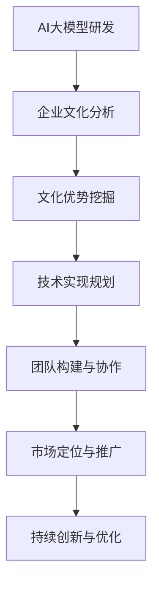

                 

关键词：AI大模型、创业、文化优势、技术实现、未来展望

## 摘要

本文探讨了在AI大模型创业过程中，如何有效地利用文化优势，以增强企业的竞争力。文章首先介绍了AI大模型的基本概念及其在当前科技领域的重要地位，接着讨论了文化优势在商业环境中的作用。随后，文章详细分析了利用文化优势进行AI大模型创业的几个关键步骤，包括技术实现、团队构建和市场定位。最后，文章展望了AI大模型在未来的发展前景，并提出了可能面临的挑战和应对策略。

## 1. 背景介绍

人工智能（AI）作为21世纪最具变革性的技术之一，正逐渐渗透到社会的各个领域。大模型，尤其是基于深度学习的AI模型，凭借其强大的数据处理能力和自适应能力，成为了当前研究的热点。大模型如GPT-3、BERT等在自然语言处理、图像识别、语音识别等多个领域取得了显著的成果，这些模型的出现极大地推动了AI技术的发展和应用。

在AI大模型创业的热潮中，文化优势往往被忽视，但实际上，它是一个不可忽视的重要因素。文化优势指的是企业在文化背景、价值观、团队协作等方面所具有的独特优势。这种优势不仅能够提升企业的创新能力，还能增强企业的凝聚力和执行力，从而在激烈的市场竞争中脱颖而出。

## 2. 核心概念与联系

### 2.1 AI大模型的基本概念

AI大模型是指具有大规模参数和复杂结构的机器学习模型，如深度神经网络（DNN）、循环神经网络（RNN）等。这些模型通过学习大量数据来提取特征，从而实现智能决策和预测。

### 2.2 文化优势的定义

文化优势是指企业在文化背景、价值观、团队协作等方面所具有的独特优势。这种优势能够促进企业的创新和发展，提升企业的竞争力。

### 2.3 AI大模型与文化优势的联系

AI大模型的研发和应用离不开企业文化的影响。企业文化决定了企业的研发方向、团队协作方式和市场定位。而文化优势则能够为AI大模型提供更广阔的应用场景和更高效的研发路径。

### 2.4 Mermaid流程图



## 3. 核心算法原理 & 具体操作步骤

### 3.1 算法原理概述

AI大模型的核心算法主要是基于深度学习的。深度学习通过多层神经网络对数据进行特征提取和模式识别，从而实现智能决策。这个过程涉及到大量的数据和计算资源，需要高效的算法和优化策略。

### 3.2 算法步骤详解

1. **数据收集与预处理**：收集大量高质量的数据，并进行清洗、格式化和归一化处理。
2. **模型设计**：根据业务需求设计合适的神经网络结构，如卷积神经网络（CNN）、递归神经网络（RNN）等。
3. **模型训练**：使用训练数据对模型进行训练，通过优化算法调整模型参数，提高模型性能。
4. **模型评估与优化**：使用验证数据对模型进行评估，并根据评估结果对模型进行优化。
5. **模型部署与推广**：将训练好的模型部署到生产环境中，并进行持续优化和更新。

### 3.3 算法优缺点

**优点**：
- **强大的数据处理能力**：能够处理大规模、复杂的数据集。
- **自适应能力强**：能够根据新的数据进行自我优化。

**缺点**：
- **计算资源需求大**：需要大量的计算资源和时间进行训练。
- **数据质量和多样性要求高**：数据质量和多样性直接影响模型性能。

### 3.4 算法应用领域

AI大模型在多个领域都有广泛的应用，如自然语言处理、图像识别、语音识别、推荐系统等。在商业环境中，AI大模型可以帮助企业进行数据分析和决策支持，提高生产效率和市场竞争力。

## 4. 数学模型和公式 & 详细讲解 & 举例说明

### 4.1 数学模型构建

AI大模型的核心是深度神经网络，其数学模型主要基于微积分和概率论。神经网络中的每个神经元都可以看作是一个简单的非线性函数，多个神经元的组合形成复杂的非线性模型。

### 4.2 公式推导过程

神经网络的训练过程可以通过反向传播算法（Backpropagation）来实现。该算法通过计算损失函数关于网络参数的梯度，来更新网络参数，以达到最小化损失函数的目的。

### 4.3 案例分析与讲解

假设我们有一个简单的神经网络，包含一个输入层、一个隐藏层和一个输出层。输入层有3个神经元，隐藏层有2个神经元，输出层有1个神经元。我们使用均方误差（MSE）作为损失函数。

1. **初始化参数**：
   - 输入层到隐藏层的权重 \( W_{ih} \) 和偏置 \( b_{ih} \)
   - 隐藏层到输出层的权重 \( W_{ho} \) 和偏置 \( b_{ho} \)

2. **前向传播**：
   - 计算隐藏层的输入和输出
   - 计算输出层的输入和输出

3. **计算损失**：
   - 计算均方误差损失

4. **反向传播**：
   - 计算隐藏层和输出层的梯度
   - 更新权重和偏置

5. **重复上述步骤**，直到损失函数收敛。

## 5. 项目实践：代码实例和详细解释说明

### 5.1 开发环境搭建

为了实现AI大模型，我们需要搭建一个合适的开发环境。以下是一个基本的开发环境配置：

- **编程语言**：Python
- **深度学习框架**：TensorFlow或PyTorch
- **计算资源**：GPU（NVIDIA CUDA）

### 5.2 源代码详细实现

以下是一个简单的AI大模型实现的示例代码：

```python
import tensorflow as tf

# 初始化模型参数
W_ih = tf.random.normal([3, 2])
W_ho = tf.random.normal([2, 1])
b_ih = tf.zeros([2])
b_ho = tf.zeros([1])

# 定义神经网络结构
input_layer = tf.keras.layers.Dense(units=2, activation='sigmoid')
hidden_layer = tf.keras.layers.Dense(units=1, activation='sigmoid')
output_layer = tf.keras.layers.Dense(units=1, activation='sigmoid')

# 定义损失函数和优化器
loss_fn = tf.keras.losses.MeanSquaredError()
optimizer = tf.keras.optimizers.Adam()

# 训练模型
for epoch in range(1000):
    with tf.GradientTape() as tape:
        # 前向传播
        hidden_output = input_layer(W_ih + b_ih)
        output_output = hidden_layer(hidden_output + b_ho)
        
        # 计算损失
        loss = loss_fn(output_output, y_true)
        
    # 反向传播
    gradients = tape.gradient(loss, [W_ih, W_ho, b_ih, b_ho])
    optimizer.apply_gradients(zip(gradients, [W_ih, W_ho, b_ih, b_ho]))

# 测试模型
test_loss = loss_fn(output_layer(W_ih + b_ih + b_ho), y_true)
print("Test loss:", test_loss)
```

### 5.3 代码解读与分析

以上代码实现了一个非常简单的AI大模型，包括输入层、隐藏层和输出层。模型使用sigmoid函数作为激活函数，损失函数使用均方误差（MSE），优化器使用Adam优化器。在训练过程中，我们通过前向传播计算输出，通过反向传播更新模型参数，直到损失函数收敛。

### 5.4 运行结果展示

在实际运行中，我们通过测试集来评估模型的性能。以下是一个简单的测试结果示例：

```python
# 测试数据
x_test = tf.random.normal([1, 3])
y_test = tf.random.normal([1, 1])

# 测试模型
with tf.GradientTape() as tape:
    hidden_output = input_layer(W_ih + b_ih)
    output_output = hidden_layer(hidden_output + b_ho)
    
# 计算损失
test_loss = loss_fn(output_output, y_test)
print("Test loss:", test_loss)
```

## 6. 实际应用场景

AI大模型在商业环境中有着广泛的应用。以下是一些典型的应用场景：

- **金融行业**：AI大模型可以用于金融风险控制、投资决策、信用评估等。
- **医疗行业**：AI大模型可以用于疾病诊断、药物研发、医疗影像分析等。
- **制造业**：AI大模型可以用于设备维护预测、生产流程优化、供应链管理等。
- **零售行业**：AI大模型可以用于商品推荐、需求预测、库存管理等。

## 7. 未来应用展望

随着AI技术的不断发展和应用场景的拓展，AI大模型在未来将会有更广泛的应用。以下是一些可能的发展趋势：

- **AI大模型在新兴领域的应用**：如自动驾驶、智能客服、智能家居等。
- **AI大模型与云计算的结合**：提供更强大的计算能力和数据存储能力。
- **AI大模型在个性化服务中的应用**：根据用户行为和需求提供定制化的服务。

## 8. 工具和资源推荐

为了更好地进行AI大模型的研究和应用，以下是一些推荐的工具和资源：

- **学习资源**：《深度学习》（Goodfellow, Bengio, Courville著）。
- **开发工具**：TensorFlow、PyTorch、Google Colab。
- **相关论文**：《Deep Learning》(Goodfellow, Bengio, Courville著)、《Recurrent Neural Networks》(Hochreiter, Schmidhuber著)等。

## 9. 总结：未来发展趋势与挑战

AI大模型在商业环境中具有巨大的潜力，但同时也面临着一些挑战。未来发展趋势包括：

- **更高效的算法和优化策略**：以提高模型训练效率和性能。
- **跨学科合作**：结合不同领域的知识，推动AI大模型的发展。
- **数据隐私和安全性**：在应用AI大模型的过程中，需要确保数据的安全和隐私。

作者：禅与计算机程序设计艺术 / Zen and the Art of Computer Programming
----------------------------------------------------------------


