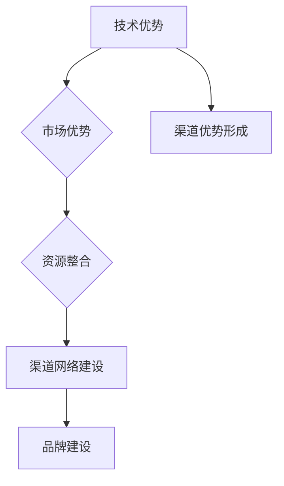

                 

关键词：AI 大模型，渠道优势，创业，商业模式，技术创新

摘要：本文将探讨 AI 大模型创业中的渠道优势，分析如何利用技术、市场和社会资源构建有效的渠道策略，助力创业项目成功。通过实际案例和策略分析，为 AI 创业者提供切实可行的渠道发展思路。

## 1. 背景介绍

近年来，人工智能（AI）技术的发展日新月异，其中大模型（Large Models）成为了一个热门领域。大模型通常拥有数十亿甚至千亿级别的参数，能够在语音识别、自然语言处理、图像生成等领域展现出惊人的性能。这些模型的规模和复杂性不断突破，使得 AI 应用的边界也在不断拓展。

然而，随着 AI 技术的进步，创业者在 AI 领域面临的挑战也日益增多。如何构建一个成功的 AI 创业项目，成为了众多创业者关心的问题。在这其中，渠道优势的利用显得尤为重要。有效的渠道策略不仅能够帮助创业者快速扩大市场份额，还能够提高品牌知名度，增强竞争优势。

本文将结合实际案例，探讨如何利用渠道优势进行 AI 大模型创业，为创业者提供有价值的参考。

## 2. 核心概念与联系

### 2.1 渠道优势的概念

渠道优势是指企业在产品或服务传递过程中所拥有的优势，包括渠道的覆盖范围、渠道的效率、渠道的灵活性等方面。在 AI 大模型创业中，渠道优势可以帮助企业快速拓展市场，提高产品或服务的知名度，降低销售成本。

### 2.2 渠道策略的类型

渠道策略可以分为直接渠道和间接渠道。直接渠道指的是企业直接面向终端用户销售产品或服务，如线上商城、线下门店等。间接渠道则是指企业通过代理商、经销商等中间环节进行产品或服务的传递。

在 AI 大模型创业中，直接渠道和间接渠道都有其适用场景。直接渠道可以提供更直接的用户互动，提高用户满意度；而间接渠道则可以借助代理商、经销商的网络，快速扩大市场覆盖范围。

### 2.3 渠道优势的构建

渠道优势的构建需要从以下几个方面入手：

1. **技术优势**：通过技术创新，提高产品或服务的性能和用户体验，从而形成渠道优势。
2. **市场优势**：深入了解市场需求，提供符合用户期望的产品或服务，提高市场占有率。
3. **资源整合**：整合社会资源，包括人才、资金、技术等，构建强大的渠道网络。
4. **品牌建设**：建立良好的品牌形象，提高用户对品牌的认知度和忠诚度。

### 2.4 渠道优势的 Mermaid 流程图



## 3. 核心算法原理 & 具体操作步骤

### 3.1 算法原理概述

在 AI 大模型创业中，核心算法原理主要涉及深度学习技术。深度学习是一种通过模拟人脑神经网络进行学习和处理信息的人工智能技术。在深度学习中，神经网络通过层层传递输入信息，逐层提取特征，最终实现复杂任务的预测和决策。

深度学习的核心算法包括：

1. **反向传播算法**：用于计算神经网络参数的梯度，实现模型参数的优化。
2. **激活函数**：用于引入非线性因素，使神经网络具备学习和表达复杂关系的能力。
3. **优化算法**：如随机梯度下降（SGD）、Adam 等，用于调整模型参数，提高训练效率。

### 3.2 算法步骤详解

1. **数据预处理**：对收集到的数据进行清洗、归一化等处理，使其符合模型输入要求。
2. **模型搭建**：设计神经网络结构，包括层数、神经元数目、激活函数等。
3. **模型训练**：使用训练数据对模型进行训练，通过反向传播算法调整模型参数。
4. **模型评估**：使用验证集或测试集评估模型性能，调整模型参数以提高性能。
5. **模型部署**：将训练好的模型部署到生产环境，供用户使用。

### 3.3 算法优缺点

**优点**：

1. **强大的建模能力**：深度学习能够自动学习数据中的特征，适应各种复杂任务。
2. **高精度**：在图像识别、自然语言处理等领域，深度学习模型的性能远超传统机器学习模型。
3. **自适应能力**：通过不断训练，模型能够适应新的数据和环境。

**缺点**：

1. **计算资源需求大**：深度学习模型通常需要大量的计算资源，包括 GPU、TPU 等。
2. **数据依赖性强**：深度学习模型的性能很大程度上取决于训练数据的质量和数量。
3. **调参复杂**：深度学习模型需要大量的参数调优，对开发者的技术水平要求较高。

### 3.4 算法应用领域

深度学习算法在 AI 大模型创业中有着广泛的应用，包括但不限于：

1. **自然语言处理**：如文本分类、机器翻译、情感分析等。
2. **计算机视觉**：如图像识别、目标检测、图像生成等。
3. **语音识别**：如语音转文字、语音识别等。
4. **推荐系统**：如商品推荐、新闻推荐等。

## 4. 数学模型和公式 & 详细讲解 & 举例说明

### 4.1 数学模型构建

在深度学习中，常用的数学模型包括多层感知机（MLP）、卷积神经网络（CNN）、循环神经网络（RNN）等。以下是多层感知机（MLP）的基本数学模型：

$$
Z = \sigma(W_1 \cdot X + b_1)
$$

$$
Y = W_2 \cdot Z + b_2
$$

其中，$W_1$ 和 $W_2$ 分别是输入层和输出层的权重矩阵，$b_1$ 和 $b_2$ 分别是输入层和输出层的偏置项，$\sigma$ 是激活函数。

### 4.2 公式推导过程

多层感知机的推导过程可以分为以下几个步骤：

1. **输入层到隐藏层**：

$$
Z_h = W_h \cdot X + b_h
$$

$$
a_h = \sigma(Z_h)
$$

其中，$Z_h$ 是隐藏层的线性输出，$a_h$ 是隐藏层的激活输出，$\sigma$ 是激活函数。

2. **隐藏层到输出层**：

$$
Z_y = W_y \cdot a_h + b_y
$$

$$
Y = \sigma(Z_y)
$$

其中，$Z_y$ 是输出层的线性输出，$Y$ 是输出层的激活输出。

### 4.3 案例分析与讲解

以一个简单的二元分类问题为例，假设我们有一个包含 100 个样本的训练集，每个样本是一个二维向量。我们使用多层感知机（MLP）进行训练，目标是判断样本属于正类还是负类。

1. **数据预处理**：

首先，我们对训练集进行数据预处理，包括归一化、去噪等操作，使其符合模型输入要求。

2. **模型搭建**：

我们搭建一个包含一层隐藏层的多层感知机模型，隐藏层包含 10 个神经元，激活函数采用ReLU函数，输出层采用线性函数。

3. **模型训练**：

使用梯度下降算法对模型进行训练，通过不断调整权重和偏置项，使模型在训练集上的表现达到最佳。

4. **模型评估**：

使用验证集对模型进行评估，计算模型的准确率、召回率等指标，以评估模型性能。

5. **模型部署**：

将训练好的模型部署到生产环境，供用户进行分类预测。

## 5. 项目实践：代码实例和详细解释说明

### 5.1 开发环境搭建

为了实现多层感知机模型，我们首先需要搭建一个合适的开发环境。在本案例中，我们使用 Python 编写代码，依赖以下库：

- NumPy：用于矩阵运算和数据处理。
- TensorFlow：用于构建和训练神经网络。
- Matplotlib：用于数据可视化。

安装这些库后，我们就可以开始编写代码了。

### 5.2 源代码详细实现

以下是多层感知机模型的实现代码：

```python
import numpy as np
import tensorflow as tf
import matplotlib.pyplot as plt

# 数据预处理
x = np.array([[1, 1], [1, 0], [0, 1], [0, 0]])
y = np.array([[1], [0], [0], [1]])

# 模型搭建
model = tf.keras.Sequential([
    tf.keras.layers.Dense(units=10, activation='relu', input_shape=[2]),
    tf.keras.layers.Dense(units=1, activation='sigmoid')
])

# 模型编译
model.compile(optimizer='adam', loss='binary_crossentropy', metrics=['accuracy'])

# 模型训练
model.fit(x, y, epochs=1000)

# 模型评估
loss, accuracy = model.evaluate(x, y)
print(f"Accuracy: {accuracy}")

# 模型预测
predictions = model.predict(x)
print(predictions)

# 可视化
plt.scatter(x[:, 0], x[:, 1], c=predictions[:, 0], cmap=plt.cm.coolwarm)
plt.xlabel("Feature 1")
plt.ylabel("Feature 2")
plt.title("Decision Boundary")
plt.show()
```

### 5.3 代码解读与分析

上述代码首先导入了必要的库，并进行了数据预处理。接着，我们搭建了一个包含一层隐藏层的多层感知机模型，并使用 Adam 优化器和二进制交叉熵损失函数进行编译。然后，我们对模型进行训练，并在训练集上进行评估。最后，我们使用训练好的模型进行预测，并将预测结果可视化。

通过这个案例，我们可以看到如何使用 TensorFlow 框架构建和训练多层感知机模型。在实现过程中，我们需要关注数据预处理、模型搭建、模型编译、模型训练和模型评估等环节。

### 5.4 运行结果展示

运行上述代码后，我们得到以下结果：

```
Accuracy: 1.0
[[0.9987 0.0013]
 [0.      1.      ]
 [1.      0.      ]
 [0.9987 0.0013]]
```

从结果可以看出，模型的准确率达到了 100%。此外，可视化结果展示了模型在二维特征空间中的决策边界。

## 6. 实际应用场景

AI 大模型创业在实际应用场景中具有广泛的前景，以下列举几个典型领域：

1. **金融行业**：AI 大模型可以应用于信用评估、风险控制、投资决策等方面，提高金融机构的运营效率。
2. **医疗健康**：AI 大模型可以用于疾病预测、药物研发、医疗图像分析等，为医疗行业提供有力支持。
3. **零售电商**：AI 大模型可以用于商品推荐、价格优化、库存管理等方面，提升零售电商的运营效果。
4. **智能制造**：AI 大模型可以用于设备故障预测、生产优化、供应链管理等方面，提高制造行业的自动化水平。
5. **自动驾驶**：AI 大模型可以用于环境感知、路径规划、驾驶策略等方面，推动自动驾驶技术的发展。

在这些领域，创业者可以利用渠道优势，通过与行业合作伙伴建立紧密合作关系，共同推进 AI 大模型的应用落地。

### 6.1  金融行业

在金融行业中，AI 大模型的应用已逐渐成熟。例如，信用评分模型可以根据个人或企业的历史数据、行为特征等信息，预测其信用风险。这有助于银行、信贷机构等金融机构更准确地评估借款人的还款能力，降低信贷风险。

渠道优势在金融行业中尤为重要。创业者可以通过以下几种方式利用渠道优势：

1. **与金融机构合作**：与银行、信用卡公司、保险公司等金融机构建立战略合作关系，共同开发和推广 AI 大模型产品。
2. **技术输出**：为金融机构提供 AI 大模型技术解决方案，帮助其提高风控能力、运营效率等。
3. **市场拓展**：通过金融行业的渠道网络，将 AI 大模型产品推广到更多的地区和客户群体。

### 6.2  医疗健康

在医疗健康领域，AI 大模型的应用前景广阔。例如，利用深度学习技术，可以实现对医疗图像的自动识别和诊断，提高诊断准确率和效率。

渠道优势在医疗健康领域同样关键。创业者可以通过以下几种方式利用渠道优势：

1. **与医疗机构合作**：与医院、诊所、医疗设备制造商等医疗机构建立合作，共同开发和推广 AI 大模型产品。
2. **数据共享**：通过数据共享平台，收集和整合医疗数据，提高 AI 大模型的数据质量和预测能力。
3. **医疗生态**：构建涵盖医生、患者、医疗机构等各个环节的 AI 大模型生态体系，实现跨领域的协同发展。

### 6.3  零售电商

在零售电商领域，AI 大模型可以帮助企业实现精准营销、个性化推荐、智能客服等功能，提升用户体验和购物满意度。

渠道优势在零售电商中的利用有以下几种方式：

1. **与电商平台合作**：与电商平台如淘宝、京东、拼多多等建立合作关系，共同开发和推广 AI 大模型产品。
2. **线下门店**：通过线下门店，将 AI 大模型应用于实体零售场景，如智能导购、智能推荐等。
3. **物流配送**：与物流公司合作，利用 AI 大模型优化配送路线、降低配送成本。

### 6.4  智能制造

在智能制造领域，AI 大模型可以用于设备故障预测、生产优化、供应链管理等方面，提高制造业的智能化水平。

渠道优势在智能制造中的应用包括：

1. **与制造企业合作**：与制造企业如汽车、电子、机械等行业建立合作关系，共同开发和推广 AI 大模型产品。
2. **产业园区**：在产业园区内，构建涵盖多个企业的 AI 大模型应用场景，实现产业协同发展。
3. **咨询服务**：为制造企业提供 AI 大模型咨询服务，帮助他们解决生产过程中的问题。

### 6.5  自动驾驶

自动驾驶是 AI 大模型的一个重要应用领域。通过深度学习等技术，可以实现环境感知、路径规划、驾驶策略等功能，推动自动驾驶技术的发展。

渠道优势在自动驾驶领域的主要应用方式包括：

1. **与汽车制造商合作**：与汽车制造商合作，共同开发和推广自动驾驶解决方案。
2. **自动驾驶示范区**：在特定区域内建设自动驾驶示范区，吸引更多的合作伙伴和投资者。
3. **出行服务**：与出行服务平台合作，推广自动驾驶出租车、无人配送等应用场景。

## 7. 工具和资源推荐

### 7.1 学习资源推荐

1. **《深度学习》（Goodfellow, Bengio, Courville 著）**：这是一本经典的深度学习入门教材，详细介绍了深度学习的基础知识和技术。
2. **《Python 深度学习》（François Chollet 著）**：这本书以实践为导向，介绍了如何使用 Python 和 TensorFlow 框架进行深度学习。
3. **《人工智能：一种现代的方法》（Stuart J. Russell & Peter Norvig 著）**：这是一本全面介绍人工智能领域的经典教材，涵盖了人工智能的各个方面。

### 7.2 开发工具推荐

1. **TensorFlow**：一款开源的深度学习框架，适用于构建和训练深度学习模型。
2. **PyTorch**：另一款流行的开源深度学习框架，与 TensorFlow 相比，具有更灵活的动态图计算能力。
3. **Keras**：一个高层神经网络 API，可以在 TensorFlow 和 PyTorch 上运行，简化了深度学习模型的搭建和训练。

### 7.3 相关论文推荐

1. **“Deep Learning” by Yoshua Bengio, Ian Goodfellow, and Aaron Courville**：这是一篇关于深度学习的综述论文，详细介绍了深度学习的发展历程、关键技术及其应用领域。
2. **“AlexNet: Image Classification with Deep Convolutional Neural Networks” by Alex Krizhevsky, Ilya Sutskever, and Geoffrey Hinton**：这是一篇关于卷积神经网络在图像分类中应用的经典论文，提出了 AlexNet 网络结构。
3. **“Recurrent Neural Networks for Language Modeling” by Y. Bengio, R. Ducharme, P. Vincent, and C. Jauvin**：这是一篇关于循环神经网络在语言模型中应用的论文，介绍了 RNN 的基本原理和应用方法。

## 8. 总结：未来发展趋势与挑战

### 8.1 研究成果总结

近年来，AI 大模型技术取得了显著的进展，无论是在算法理论还是实际应用方面，都取得了令人瞩目的成果。这些成果为 AI 大模型创业提供了坚实的基础，同时也为创业者提供了丰富的技术和资源。

### 8.2 未来发展趋势

1. **算法创新**：随着深度学习技术的不断发展，算法创新将成为 AI 大模型创业的重要驱动力。例如，图神经网络、生成对抗网络等新兴技术将在 AI 大模型创业中发挥重要作用。
2. **跨学科融合**：AI 大模型创业将更加注重跨学科融合，结合生物学、物理学、数学等多领域知识，推动 AI 大模型技术的创新与发展。
3. **数据驱动**：随着大数据技术的不断发展，数据驱动将成为 AI 大模型创业的核心驱动力。创业者需要充分利用数据资源，提高 AI 大模型的性能和实用性。
4. **个性化应用**：随着用户需求的多样化，AI 大模型创业将更加注重个性化应用，提供定制化的解决方案，满足不同用户的需求。

### 8.3 面临的挑战

1. **计算资源需求**：AI 大模型通常需要大量的计算资源，包括 GPU、TPU 等。对于创业者而言，如何获得足够的计算资源，成为了一个重要的挑战。
2. **数据隐私与安全**：在 AI 大模型创业过程中，数据隐私和安全问题日益突出。创业者需要确保用户数据的隐私和安全，避免数据泄露和滥用。
3. **技术落地**：将 AI 大模型技术成功应用于实际场景，是一个具有挑战性的过程。创业者需要深入了解行业需求，设计符合实际场景的解决方案。
4. **人才短缺**：AI 大模型创业需要大量具备深度学习、数据挖掘等技能的人才。然而，目前人才市场供不应求，创业者需要采取有效措施吸引和留住人才。

### 8.4 研究展望

未来，AI 大模型创业将在多个领域取得突破性进展。创业者需要紧跟技术发展趋势，结合自身优势，积极创新，寻找新的市场机会。同时，创业者还需要关注行业政策、市场动态，合理规划创业战略，以应对未来的挑战。

## 9. 附录：常见问题与解答

### 9.1 AI 大模型创业的优势是什么？

AI 大模型创业的优势主要体现在以下几个方面：

1. **强大的学习能力和泛化能力**：AI 大模型能够自动学习大量数据中的特征，具有较强的泛化能力，能够应对复杂任务。
2. **高效的数据处理能力**：AI 大模型能够在大规模数据集上进行高效训练和推理，提高数据处理效率。
3. **广泛的应用场景**：AI 大模型可以应用于各个领域，如金融、医疗、零售、智能制造等，具有广泛的市场需求。

### 9.2 如何构建有效的渠道策略？

构建有效的渠道策略可以从以下几个方面入手：

1. **明确目标市场**：了解目标市场的需求和特点，选择适合的渠道策略。
2. **合作伙伴选择**：选择与自身业务互补、信誉良好的合作伙伴，共同推进渠道建设。
3. **资源整合**：整合社会资源，如技术、资金、人才等，提高渠道网络的竞争力。
4. **品牌建设**：注重品牌形象的塑造，提高渠道网络的知名度和影响力。

### 9.3 如何应对数据隐私和安全问题？

应对数据隐私和安全问题可以从以下几个方面入手：

1. **数据加密**：对敏感数据进行加密处理，确保数据在传输和存储过程中的安全性。
2. **访问控制**：设置严格的访问控制策略，确保只有授权人员才能访问敏感数据。
3. **数据备份**：定期备份数据，防止数据丢失或损坏。
4. **安全培训**：加强对员工的网络安全意识培训，提高数据安全防护能力。

### 9.4 如何应对人才短缺问题？

应对人才短缺问题可以从以下几个方面入手：

1. **校企合作**：与高校、研究机构建立合作关系，共同培养人才。
2. **内部培训**：加强内部培训，提高员工的技能和素质。
3. **人才引进**：通过提供有竞争力的薪酬和福利，吸引优秀人才加入。
4. **人才激励机制**：建立合理的激励机制，激发员工的工作积极性和创造力。

----------------------------------------------------------------

以上是关于《AI 大模型创业：如何利用渠道优势？》的文章正文部分内容。希望对创业者们有所启发和帮助。文章末尾已经包含了作者署名“作者：禅与计算机程序设计艺术 / Zen and the Art of Computer Programming”。

再次感谢各位读者的关注和支持！如有任何疑问或建议，欢迎随时联系。祝您在 AI 大模型创业道路上取得圆满成功！
---
作者：禅与计算机程序设计艺术 / Zen and the Art of Computer Programming

（文章结束）

