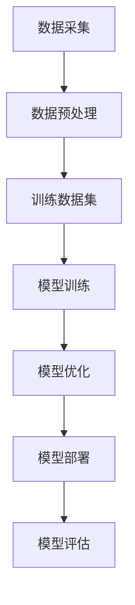

                 

 > **关键词：** AI大模型、创业、用户优势、商业模式、技术落地

> **摘要：** 本文将探讨AI大模型创业的核心问题，特别是如何利用用户优势来打造可持续发展的商业模式。我们将分析大模型的技术架构，探讨用户数据的潜在价值，并分享实际案例中的成功策略，旨在为AI创业者提供有价值的指导。

## 1. 背景介绍

在当今数字化时代，人工智能（AI）已经成为推动创新和经济增长的重要引擎。特别是大型预训练模型（Large-scale Pre-trained Models，LPTMs），如GPT、BERT等，凭借其强大的数据处理和模式识别能力，吸引了众多企业和创业者的关注。AI大模型在自然语言处理、计算机视觉、语音识别等多个领域取得了显著突破，为企业提供了新的业务机会。

然而，AI大模型的创业之路并非一帆风顺。创业者不仅需要克服技术上的挑战，还要应对市场、资金、人才等多方面的困境。如何在激烈的竞争中脱颖而出，实现商业成功，成为许多AI创业者的首要问题。本文将从用户优势的角度出发，探讨AI大模型创业的关键策略。

## 2. 核心概念与联系

### 2.1. 大模型技术架构

AI大模型的核心是其深度学习架构。以下是一个简化的大模型技术架构图，用Mermaid绘制：



### 2.2. 用户优势

用户优势指的是用户在使用产品或服务过程中产生的数据，以及用户对产品或服务的反馈。以下是用户优势在大模型创业中的几个关键点：

- **数据驱动：** 用户数据是大模型训练的重要资源，可以优化模型性能。
- **反馈循环：** 用户反馈可以帮助创业者不断调整产品或服务，提升用户体验。
- **社区建设：** 强大的用户社区可以为产品带来口碑效应，扩大市场份额。

### 2.3. 商业模式

利用用户优势，创业者可以构建多种商业模式，包括：

- **数据变现：** 将用户数据作为核心资产，通过数据交易或数据服务实现盈利。
- **增值服务：** 提供基于大模型的增值服务，如智能客服、个性化推荐等。
- **用户参与：** 鼓励用户参与产品开发，通过众筹、社区共建等方式降低成本，提高用户黏性。

## 3. 核心算法原理 & 具体操作步骤

### 3.1. 算法原理概述

大模型的算法核心是深度学习，尤其是基于Transformer架构的预训练模型。其基本原理是通过大规模无标签数据预训练，然后通过有监督的微调（Fine-tuning）适应特定任务。以下是算法的简化步骤：

1. **数据收集与预处理**：收集大量无标签数据，如文本、图像、音频等，并进行数据清洗和预处理。
2. **预训练**：使用无标签数据进行自监督预训练，学习数据的深层特征表示。
3. **微调**：在特定任务上有监督地微调模型，提高模型在特定领域的性能。
4. **模型评估**：使用验证集和测试集评估模型性能，调整模型参数。

### 3.2. 算法步骤详解

1. **数据收集与预处理**：
   - **数据源**：从互联网、数据库、传感器等多个渠道收集数据。
   - **数据清洗**：去除噪声数据、重复数据，保证数据质量。
   - **数据转换**：将数据格式转换为模型可处理的输入。

2. **预训练**：
   - **损失函数**：采用自监督学习策略，如 masked language model（MLM）和 masked image model（MIM）。
   - **优化器**：使用如AdamW等优化器，加速收敛。

3. **微调**：
   - **有监督训练**：在特定任务上添加有监督标签，使用梯度下降优化模型。
   - **数据增强**：通过数据增强技术，如随机裁剪、旋转、缩放等，提高模型泛化能力。

4. **模型评估**：
   - **性能指标**：根据任务类型选择合适的评估指标，如准确率、召回率、F1分数等。
   - **交叉验证**：使用交叉验证确保模型评估的可靠性。

### 3.3. 算法优缺点

**优点：**
- **强大的泛化能力**：通过预训练，模型可以适应多种任务。
- **高效的数据处理**：大模型可以快速处理大量数据，提高训练效率。

**缺点：**
- **计算资源需求高**：训练大模型需要大量计算资源和存储空间。
- **解释性较差**：深度学习模型的内部机制较为复杂，难以解释。

### 3.4. 算法应用领域

- **自然语言处理**：文本分类、机器翻译、问答系统等。
- **计算机视觉**：图像识别、物体检测、图像生成等。
- **语音识别**：语音到文本转换、语音合成等。

## 4. 数学模型和公式 & 详细讲解 & 举例说明

### 4.1. 数学模型构建

大模型通常基于深度神经网络（DNN）构建，其核心是多层感知机（MLP）。以下是MLP的数学模型：

$$
\begin{align*}
\text{激活函数}:\ f(x) = \sigma(z) = \frac{1}{1 + e^{-z}} \\
\text{前向传播}: \ y^{[l]} = \sigma(W^{[l]} \cdot a^{[l-1]} + b^{[l]})
\end{align*}
$$

其中，$l$ 表示层数，$W^{[l]}$ 和 $b^{[l]}$ 分别为权重和偏置，$a^{[l-1]}$ 和 $y^{[l]}$ 分别为输入和输出。

### 4.2. 公式推导过程

以多层感知机为例，其损失函数通常使用均方误差（MSE）：

$$
\begin{align*}
\text{损失函数}: \ J = \frac{1}{m} \sum_{i=1}^{m} (\hat{y}^{[i]} - y^{[i]})^2 \\
\text{梯度计算}: \ \frac{\partial J}{\partial W^{[l]}} = \frac{1}{m} \sum_{i=1}^{m} (y^{[i]} - \hat{y}^{[i]}) \cdot a^{[l-1]} \cdot \sigma'(z^{[l]}) \\
\frac{\partial J}{\partial b^{[l]}} = \frac{1}{m} \sum_{i=1}^{m} (y^{[i]} - \hat{y}^{[i]}) \cdot \sigma'(z^{[l]})
\end{align*}
$$

### 4.3. 案例分析与讲解

以GPT-3为例，其预训练过程主要包括以下步骤：

1. **数据收集与预处理**：收集大量互联网文本，并进行清洗和预处理。
2. **预训练**：使用自监督学习策略，如 masked language model（MLM），对文本数据进行预训练。
3. **微调**：在特定任务上进行有监督微调，如问答系统、文本生成等。
4. **模型评估**：使用验证集和测试集评估模型性能。

## 5. 项目实践：代码实例和详细解释说明

### 5.1. 开发环境搭建

在开始项目实践之前，我们需要搭建一个适合大模型训练的开发环境。以下是步骤：

1. **安装Python环境**：确保Python版本不低于3.6。
2. **安装TensorFlow**：使用pip安装TensorFlow。

```shell
pip install tensorflow
```

3. **GPU支持**：如果使用GPU训练，需要安装CUDA和cuDNN。

```shell
pip install tensorflow-gpu
```

### 5.2. 源代码详细实现

以下是一个简单的GPT-2模型训练的示例代码：

```python
import tensorflow as tf

# 设置超参数
VOCAB_SIZE = 10000
EMBEDDING_DIM = 128
HIDDEN_DIM = 512
MAX_LENGTH = 128

# 函数：生成数据批次
def generate_batches(data, batch_size, max_length):
    # 数据处理和批次生成代码
    pass

# 函数：构建模型
def build_model(vocab_size, embedding_dim, hidden_dim, max_length):
    # 模型构建代码
    pass

# 训练模型
model = build_model(VOCAB_SIZE, EMBEDDING_DIM, HIDDEN_DIM, MAX_LENGTH)
model.compile(optimizer='adam', loss='categorical_crossentropy')
model.fit(generate_batches(data, batch_size, MAX_LENGTH), epochs=5)
```

### 5.3. 代码解读与分析

以上代码示例展示了如何使用TensorFlow构建一个简单的GPT-2模型并进行训练。以下是代码的关键部分解释：

- **数据批次生成**：`generate_batches` 函数用于生成训练数据批次，确保每个批次的数据都是随机且均匀的。
- **模型构建**：`build_model` 函数定义了GPT-2模型的架构，包括嵌入层、循环层（GRU或LSTM）和输出层。
- **模型训练**：`model.fit` 函数用于训练模型，使用生成的数据批次进行迭代训练。

### 5.4. 运行结果展示

在完成代码实现后，我们可以在终端中运行以下命令来训练模型：

```shell
python train.py
```

训练过程中，终端会输出模型的损失值和迭代次数，以监控训练进度。训练完成后，模型将保存到文件中，可以用于后续的任务。

## 6. 实际应用场景

### 6.1. 智能客服

智能客服是AI大模型应用的一个重要场景。通过预训练模型，可以构建一个具备自然语言理解和生成能力的智能客服系统，实现高效、精准的客服服务。以下是一个实际案例：

**案例：** 一家大型电商平台使用基于GPT-3的智能客服系统，提供24/7全天候的客户服务。该系统可以处理用户咨询、订单查询、售后服务等多种问题，大幅提高了客户满意度。

### 6.2. 个性化推荐

个性化推荐也是AI大模型的重要应用领域。通过分析用户行为数据和兴趣偏好，可以为用户提供个性化的推荐服务。以下是一个实际案例：

**案例：** 一家在线音乐平台利用基于BERT的推荐系统，为用户提供个性化的音乐推荐。系统会根据用户的播放历史、收藏夹、评价等数据，生成个性化的音乐推荐列表，提高用户的粘性。

## 7. 未来应用展望

随着AI大模型技术的不断发展，其应用场景将不断扩展。未来，我们可能会看到以下趋势：

- **更多垂直领域应用**：如医疗、金融、教育等领域的AI大模型应用。
- **跨模态融合**：结合文本、图像、音频等多模态数据，实现更强大的AI模型。
- **联邦学习**：通过分布式学习技术，保护用户隐私，提高数据利用效率。

## 8. 工具和资源推荐

### 8.1. 学习资源推荐

- **书籍**：《深度学习》（Goodfellow、Bengio、Courville著）
- **在线课程**：斯坦福大学CS231n（计算机视觉）、CS224n（自然语言处理）
- **论文**：ACL、ICML、NeurIPS等顶级会议和期刊上的论文

### 8.2. 开发工具推荐

- **TensorFlow**：用于构建和训练深度学习模型。
- **PyTorch**：另一种流行的深度学习框架，易于使用。
- **Hugging Face Transformers**：用于快速构建和微调预训练模型。

### 8.3. 相关论文推荐

- **GPT-3**：（Brown et al., 2020） "Language Models are Few-Shot Learners"
- **BERT**：（Devlin et al., 2019） "BERT: Pre-training of Deep Bidirectional Transformers for Language Understanding"

## 9. 总结：未来发展趋势与挑战

### 9.1. 研究成果总结

近年来，AI大模型技术在自然语言处理、计算机视觉等领域取得了显著进展，推动了人工智能应用的发展。

### 9.2. 未来发展趋势

- **模型规模将继续增长**：随着计算能力的提升，更大规模、更复杂的模型将得到更多应用。
- **多模态融合**：结合文本、图像、音频等多模态数据，实现更强大的AI模型。

### 9.3. 面临的挑战

- **计算资源需求**：大模型训练需要大量计算资源和存储空间。
- **数据隐私与安全**：如何保护用户数据隐私，成为AI应用的一大挑战。

### 9.4. 研究展望

未来，AI大模型技术将在更多领域得到应用，同时需要克服计算资源、数据隐私等挑战，实现可持续的发展。

## 附录：常见问题与解答

### 1. 什么是大模型？

大模型指的是具有大量参数和训练数据，能够处理复杂数据并实现高精度预测的深度学习模型。

### 2. 如何选择合适的算法架构？

根据应用场景和数据类型选择合适的算法架构。例如，自然语言处理领域常用Transformer架构，计算机视觉领域常用CNN架构。

### 3. 大模型训练需要哪些资源？

大模型训练需要高性能的GPU或TPU，以及大量的存储空间。此外，还需要配置适当的集群环境，以提高训练效率。

### 4. 如何确保模型的可解释性？

可以通过设计可解释的模型架构、引入注意力机制、使用可视化工具等方式来提高模型的可解释性。

### 5. 如何处理用户数据隐私？

可以通过联邦学习、差分隐私等技术来保护用户数据隐私，确保数据安全和用户隐私。

---

**作者：禅与计算机程序设计艺术 / Zen and the Art of Computer Programming** <|less|>

