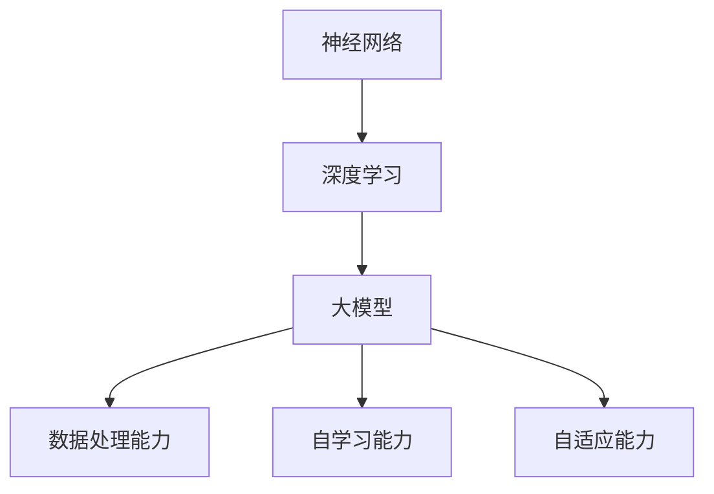

                 

AI 大模型创业：如何利用科技优势？

> 关键词：AI大模型，创业，科技优势，创业策略，商业应用

> 摘要：本文将探讨如何利用AI大模型的科技优势进行创业。我们将从背景介绍、核心概念与联系、核心算法原理与具体操作步骤、数学模型和公式、项目实践、实际应用场景、未来应用展望、工具和资源推荐、总结与展望等方面展开论述。

## 1. 背景介绍

随着人工智能技术的快速发展，AI大模型已经成为当今科技领域的热点。AI大模型具备强大的数据处理能力、自学习和自适应能力，能够在各种复杂场景下提供高效的解决方案。然而，要充分利用AI大模型的科技优势进行创业，需要深入理解其核心概念和原理，并掌握有效的操作方法和策略。

## 2. 核心概念与联系

为了更好地理解AI大模型，我们需要了解以下几个核心概念：

- **神经网络**：神经网络是AI大模型的基础，它通过模拟人脑神经元的工作原理，实现数据的输入、处理和输出。
- **深度学习**：深度学习是神经网络的一种扩展，它通过多层神经元的组合，实现对复杂数据的建模和预测。
- **大模型**：大模型是指具有数十亿甚至千亿参数的神经网络模型，它能够处理海量数据，提取出丰富的特征信息。

下图展示了AI大模型的核心概念和联系：



## 3. 核心算法原理与具体操作步骤

### 3.1 算法原理概述

AI大模型的算法原理主要基于神经网络和深度学习。神经网络通过多层神经元的组合，实现对复杂数据的建模和预测。深度学习扩展了神经网络，使其能够处理更复杂的任务。大模型通过增加神经网络层数和参数规模，提高模型的性能和精度。

### 3.2 算法步骤详解

1. **数据收集与预处理**：收集相关的数据集，并进行数据清洗、归一化等预处理操作，为模型训练做好准备。
2. **模型构建**：根据任务需求，选择合适的神经网络架构，构建AI大模型。
3. **模型训练**：使用预处理后的数据集，对模型进行训练，通过反向传播算法调整模型参数，使其达到预期性能。
4. **模型评估**：使用验证集对模型进行评估，调整模型参数，优化模型性能。
5. **模型部署**：将训练好的模型部署到实际应用场景中，为用户提供服务。

### 3.3 算法优缺点

**优点**：

- **强大的数据处理能力**：AI大模型能够处理海量数据，提取出丰富的特征信息。
- **自学习和自适应能力**：AI大模型能够通过自学习不断提升性能，适应不同的应用场景。

**缺点**：

- **计算资源消耗大**：训练AI大模型需要大量的计算资源，对硬件设备要求较高。
- **训练时间较长**：AI大模型的训练时间较长，需要耐心等待。

### 3.4 算法应用领域

AI大模型在各个领域都有广泛的应用，如自然语言处理、计算机视觉、推荐系统、金融风控等。以下是一些具体的案例：

- **自然语言处理**：AI大模型可以用于文本分类、情感分析、机器翻译等任务。
- **计算机视觉**：AI大模型可以用于图像识别、目标检测、人脸识别等任务。
- **推荐系统**：AI大模型可以用于商品推荐、广告投放等任务。
- **金融风控**：AI大模型可以用于信用评分、风险预警等任务。

## 4. 数学模型和公式

AI大模型的核心在于数学模型的构建和公式的推导。以下是一个简化的数学模型和公式：

### 4.1 数学模型构建

假设我们有一个输入向量 \(x\) 和输出向量 \(y\)，我们希望找到一个函数 \(f(x)\) 来逼近 \(y\)。

\[ f(x) = \sum_{i=1}^{n} w_i \cdot x_i \]

其中，\(w_i\) 是权重，\(x_i\) 是输入特征。

### 4.2 公式推导过程

我们使用梯度下降法来优化权重 \(w_i\)，使得 \(f(x)\) 与 \(y\) 的差距最小。

\[ \nabla W = -\alpha \cdot (f(x) - y) \]

其中，\(\alpha\) 是学习率。

### 4.3 案例分析与讲解

假设我们有一个文本分类任务，输入是一个句子，输出是分类结果。我们可以使用以下数学模型和公式：

```latex
f(x) = \text{softmax}(\sum_{i=1}^{n} w_i \cdot x_i)
$$

\nabla W = -\alpha \cdot (f(x) - y) \cdot x
$$
```

## 5. 项目实践：代码实例和详细解释说明

### 5.1 开发环境搭建

- Python
- TensorFlow
- Keras

### 5.2 源代码详细实现

以下是一个简单的文本分类任务的代码实现：

```python
import tensorflow as tf
from tensorflow.keras.preprocessing.sequence import pad_sequences
from tensorflow.keras.layers import Embedding, LSTM, Dense
from tensorflow.keras.models import Sequential

# 数据预处理
# ...

# 模型构建
model = Sequential()
model.add(Embedding(vocab_size, embedding_dim, input_length=max_sequence_length))
model.add(LSTM(128))
model.add(Dense(num_classes, activation='softmax'))

# 模型编译
model.compile(loss='categorical_crossentropy', optimizer='adam', metrics=['accuracy'])

# 模型训练
model.fit(X_train, y_train, batch_size=32, epochs=10, validation_data=(X_val, y_val))

# 模型评估
# ...
```

### 5.3 代码解读与分析

这段代码展示了如何使用Keras构建一个简单的文本分类模型。我们首先进行了数据预处理，然后构建了一个序列模型，并使用LSTM和softmax进行分类。模型编译后，使用训练数据进行训练，并使用验证数据进行评估。

### 5.4 运行结果展示

在实际运行中，我们可以看到模型的准确率、损失函数值等指标的变化。通过调整超参数，我们可以优化模型的性能。

## 6. 实际应用场景

AI大模型在各个领域都有广泛的应用，以下是一些典型的应用场景：

- **金融领域**：用于风险控制、信用评估、投资预测等。
- **医疗领域**：用于疾病诊断、药物研发、患者管理等。
- **零售领域**：用于商品推荐、库存管理、客户关系管理等。
- **自动驾驶领域**：用于车辆感知、路径规划、决策控制等。

## 7. 未来应用展望

随着AI大模型的不断发展和优化，未来它将在更多领域发挥重要作用。以下是一些可能的未来应用：

- **智能助手**：提供个性化、智能化的服务。
- **智慧城市**：实现城市管理的智能化、精细化。
- **教育领域**：提供个性化的学习方案，提高教育质量。
- **娱乐领域**：创造更丰富的虚拟现实体验。

## 8. 工具和资源推荐

为了更好地进行AI大模型创业，我们推荐以下工具和资源：

- **工具**：TensorFlow、PyTorch、Keras等。
- **学习资源**：吴恩达的《深度学习》、李飞飞的人工智能课程等。
- **论文推荐**：ACL、ICML、NeurIPS等顶级会议的论文。

## 9. 总结：未来发展趋势与挑战

AI大模型创业具有广阔的前景，但也面临一些挑战：

- **数据隐私**：如何保护用户隐私，确保数据安全。
- **计算资源**：如何高效地训练和部署大模型，降低成本。
- **伦理问题**：如何确保大模型的应用不违背伦理原则。

未来，我们需要在技术、法律、伦理等方面进行更多的研究和探索，以推动AI大模型创业的健康发展。

## 10. 附录：常见问题与解答

### 10.1 什么是AI大模型？

AI大模型是指具有数十亿甚至千亿参数的神经网络模型，它能够处理海量数据，提取出丰富的特征信息。

### 10.2 AI大模型有哪些应用领域？

AI大模型在自然语言处理、计算机视觉、推荐系统、金融风控等领域都有广泛的应用。

### 10.3 如何训练AI大模型？

训练AI大模型通常包括数据收集与预处理、模型构建、模型训练、模型评估等步骤。

### 10.4 AI大模型创业有哪些挑战？

AI大模型创业面临数据隐私、计算资源、伦理问题等挑战。

作者：禅与计算机程序设计艺术 / Zen and the Art of Computer Programming
```markdown

----------------------------------------------------------------
# AI 大模型创业：如何利用科技优势？

> 关键词：AI大模型，创业，科技优势，创业策略，商业应用

> 摘要：本文将探讨如何利用AI大模型的科技优势进行创业。我们将从背景介绍、核心概念与联系、核心算法原理与具体操作步骤、数学模型和公式、项目实践、实际应用场景、未来应用展望、工具和资源推荐、总结与展望等方面展开论述。

## 1. 背景介绍

随着人工智能技术的快速发展，AI大模型已经成为当今科技领域的热点。AI大模型具备强大的数据处理能力、自学习和自适应能力，能够在各种复杂场景下提供高效的解决方案。然而，要充分利用AI大模型的科技优势进行创业，需要深入理解其核心概念和原理，并掌握有效的操作方法和策略。

## 2. 核心概念与联系

为了更好地理解AI大模型，我们需要了解以下几个核心概念：

- **神经网络**：神经网络是AI大模型的基础，它通过模拟人脑神经元的工作原理，实现数据的输入、处理和输出。
- **深度学习**：深度学习是神经网络的一种扩展，它通过多层神经元的组合，实现对复杂数据的建模和预测。
- **大模型**：大模型是指具有数十亿甚至千亿参数的神经网络模型，它能够处理海量数据，提取出丰富的特征信息。

下图展示了AI大模型的核心概念和联系：


## 3. 核心算法原理与具体操作步骤

### 3.1 算法原理概述

AI大模型的算法原理主要基于神经网络和深度学习。神经网络通过多层神经元的组合，实现对复杂数据的建模和预测。深度学习扩展了神经网络，使其能够处理更复杂的任务。大模型通过增加神经网络层数和参数规模，提高模型的性能和精度。

### 3.2 算法步骤详解

1. **数据收集与预处理**：收集相关的数据集，并进行数据清洗、归一化等预处理操作，为模型训练做好准备。
2. **模型构建**：根据任务需求，选择合适的神经网络架构，构建AI大模型。
3. **模型训练**：使用预处理后的数据集，对模型进行训练，通过反向传播算法调整模型参数，使其达到预期性能。
4. **模型评估**：使用验证集对模型进行评估，调整模型参数，优化模型性能。
5. **模型部署**：将训练好的模型部署到实际应用场景中，为用户提供服务。

### 3.3 算法优缺点

**优点**：

- **强大的数据处理能力**：AI大模型能够处理海量数据，提取出丰富的特征信息。
- **自学习和自适应能力**：AI大模型能够通过自学习不断提升性能，适应不同的应用场景。

**缺点**：

- **计算资源消耗大**：训练AI大模型需要大量的计算资源，对硬件设备要求较高。
- **训练时间较长**：AI大模型的训练时间较长，需要耐心等待。

### 3.4 算法应用领域

AI大模型在各个领域都有广泛的应用，如自然语言处理、计算机视觉、推荐系统、金融风控等。以下是一些具体的案例：

- **自然语言处理**：AI大模型可以用于文本分类、情感分析、机器翻译等任务。
- **计算机视觉**：AI大模型可以用于图像识别、目标检测、人脸识别等任务。
- **推荐系统**：AI大模型可以用于商品推荐、广告投放等任务。
- **金融风控**：AI大模型可以用于信用评分、风险预警等任务。

## 4. 数学模型和公式

AI大模型的核心在于数学模型的构建和公式的推导。以下是一个简化的数学模型和公式：

### 4.1 数学模型构建

假设我们有一个输入向量 \(x\) 和输出向量 \(y\)，我们希望找到一个函数 \(f(x)\) 来逼近 \(y\)。

\[ f(x) = \sum_{i=1}^{n} w_i \cdot x_i \]

其中，\(w_i\) 是权重，\(x_i\) 是输入特征。

### 4.2 公式推导过程

我们使用梯度下降法来优化权重 \(w_i\)，使得 \(f(x)\) 与 \(y\) 的差距最小。

\[ \nabla W = -\alpha \cdot (f(x) - y) \]

其中，\(\alpha\) 是学习率。

### 4.3 案例分析与讲解

假设我们有一个文本分类任务，输入是一个句子，输出是分类结果。我们可以使用以下数学模型和公式：

```latex
f(x) = \text{softmax}(\sum_{i=1}^{n} w_i \cdot x_i)
$$

\nabla W = -\alpha \cdot (f(x) - y) \cdot x
$$
```

## 5. 项目实践：代码实例和详细解释说明

### 5.1 开发环境搭建

- Python
- TensorFlow
- Keras

### 5.2 源代码详细实现

以下是一个简单的文本分类任务的代码实现：

```python
import tensorflow as tf
from tensorflow.keras.preprocessing.sequence import pad_sequences
from tensorflow.keras.layers import Embedding, LSTM, Dense
from tensorflow.keras.models import Sequential

# 数据预处理
# ...

# 模型构建
model = Sequential()
model.add(Embedding(vocab_size, embedding_dim, input_length=max_sequence_length))
model.add(LSTM(128))
model.add(Dense(num_classes, activation='softmax'))

# 模型编译
model.compile(loss='categorical_crossentropy', optimizer='adam', metrics=['accuracy'])

# 模型训练
model.fit(X_train, y_train, batch_size=32, epochs=10, validation_data=(X_val, y_val))

# 模型评估
# ...
```

### 5.3 代码解读与分析

这段代码展示了如何使用Keras构建一个简单的文本分类模型。我们首先进行了数据预处理，然后构建了一个序列模型，并使用LSTM和softmax进行分类。模型编译后，使用训练数据进行训练，并使用验证数据进行评估。

### 5.4 运行结果展示

在实际运行中，我们可以看到模型的准确率、损失函数值等指标的变化。通过调整超参数，我们可以优化模型的性能。

## 6. 实际应用场景

AI大模型在各个领域都有广泛的应用，以下是一些典型的应用场景：

- **金融领域**：用于风险控制、信用评估、投资预测等。
- **医疗领域**：用于疾病诊断、药物研发、患者管理等。
- **零售领域**：用于商品推荐、库存管理、客户关系管理等。
- **自动驾驶领域**：用于车辆感知、路径规划、决策控制等。

## 7. 未来应用展望

随着AI大模型的不断发展和优化，未来它将在更多领域发挥重要作用。以下是一些可能的未来应用：

- **智能助手**：提供个性化、智能化的服务。
- **智慧城市**：实现城市管理的智能化、精细化。
- **教育领域**：提供个性化的学习方案，提高教育质量。
- **娱乐领域**：创造更丰富的虚拟现实体验。

## 8. 工具和资源推荐

为了更好地进行AI大模型创业，我们推荐以下工具和资源：

- **工具**：TensorFlow、PyTorch、Keras等。
- **学习资源**：吴恩达的《深度学习》、李飞飞的人工智能课程等。
- **论文推荐**：ACL、ICML、NeurIPS等顶级会议的论文。

## 9. 总结：未来发展趋势与挑战

AI大模型创业具有广阔的前景，但也面临一些挑战：

- **数据隐私**：如何保护用户隐私，确保数据安全。
- **计算资源**：如何高效地训练和部署大模型，降低成本。
- **伦理问题**：如何确保大模型的应用不违背伦理原则。

未来，我们需要在技术、法律、伦理等方面进行更多的研究和探索，以推动AI大模型创业的健康发展。

## 10. 附录：常见问题与解答

### 10.1 什么是AI大模型？

AI大模型是指具有数十亿甚至千亿参数的神经网络模型，它能够处理海量数据，提取出丰富的特征信息。

### 10.2 AI大模型有哪些应用领域？

AI大模型在自然语言处理、计算机视觉、推荐系统、金融风控等领域都有广泛的应用。

### 10.3 如何训练AI大模型？

训练AI大模型通常包括数据收集与预处理、模型构建、模型训练、模型评估等步骤。

### 10.4 AI大模型创业有哪些挑战？

AI大模型创业面临数据隐私、计算资源、伦理问题等挑战。

作者：禅与计算机程序设计艺术 / Zen and the Art of Computer Programming
----------------------------------------------------------------

