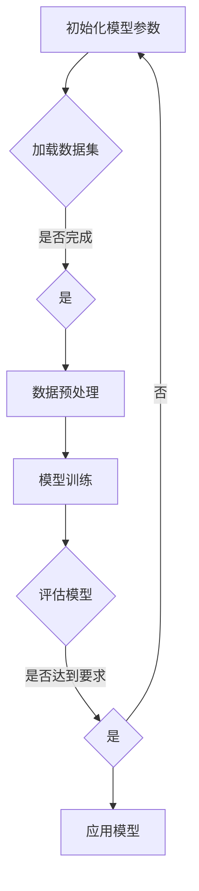

                 

关键词：人工智能、大型模型、创业、科技优势、商业模式、数据分析、行业应用、未来展望

> 摘要：随着人工智能技术的飞速发展，大型模型（如GPT-3、BERT等）在各个领域展现出了强大的潜力和应用价值。本文将探讨AI大模型在创业中的应用，分析其科技优势，提供创业指导，并展望未来的发展方向和挑战。

## 1. 背景介绍

近年来，人工智能（AI）技术的迅猛发展已经深刻改变了各行各业。特别是大型模型（Large Models），如GPT-3、BERT等，凭借其强大的处理能力和广泛的应用场景，成为科技领域的一大热点。大型模型的出现，不仅提升了自然语言处理（NLP）、图像识别、语音识别等领域的准确性和效率，还为各行各业的创新提供了新的契机。

在创业领域，大型模型的引入和运用，不仅能够帮助企业降低成本、提高效率，还能够创造出全新的商业模式和市场机会。然而，如何有效地利用这些科技优势，构建可持续发展的创业项目，成为每一个创业者需要深思的问题。

本文旨在探讨AI大模型在创业中的应用，分析其科技优势，提供创业指导，并展望未来的发展方向和挑战。通过深入研究和分析，希望能够为创业者和相关从业者提供有价值的参考。

### 1.1 AI大模型的发展历程

AI大模型的发展历程可以追溯到20世纪90年代，当时研究人员开始尝试构建大规模的神经网络模型，以解决图像识别、语音识别和自然语言处理等复杂问题。然而，受限于当时的计算能力和数据资源，这些模型的性能并不理想。

随着云计算和大数据技术的发展，以及GPU和TPU等专用计算设备的普及，AI大模型的研究和应用取得了突破性进展。2018年，OpenAI发布了GPT-3，这款拥有1750亿参数的模型在自然语言处理领域引发了轰动。此后，BERT、T5、GPT-Neo等大型模型相继问世，进一步提升了AI技术的应用水平和商业价值。

### 1.2 AI大模型的应用现状

目前，AI大模型已经在多个领域取得了显著的应用成果。在自然语言处理方面，GPT-3等模型被广泛应用于机器翻译、文本生成、问答系统等任务，极大地提升了文本处理的效率和准确性。在图像识别方面，大型卷积神经网络（CNN）模型如ResNet、Inception等，已经在人脸识别、图像分类等领域达到了或超过了人类水平。

此外，AI大模型还在医疗、金融、零售等行业得到了广泛应用。例如，在医疗领域，大型模型可以用于疾病诊断、药物研发等任务；在金融领域，AI大模型可以用于风险管理、市场预测等；在零售领域，AI大模型可以用于商品推荐、客户关系管理等。

## 2. 核心概念与联系

### 2.1 大型模型（Large Models）

大型模型是指具有数百万、数亿甚至数十亿参数的深度学习模型。这些模型通常由多个神经网络层组成，通过大量数据进行训练，能够实现对复杂任务的自动学习和预测。

### 2.2 深度学习（Deep Learning）

深度学习是人工智能的一种方法，通过构建多层神经网络模型，对数据进行学习，从而实现对复杂任务的自动识别和预测。深度学习是大型模型实现的基础。

### 2.3 数据集（Dataset）

数据集是大型模型训练的数据来源。高质量、多样化的数据集对于大型模型的性能至关重要。

### 2.4 训练算法（Training Algorithms）

训练算法是指用于训练大型模型的算法。常见的训练算法包括梯度下降、随机梯度下降、Adam等。

### 2.5 评估指标（Evaluation Metrics）

评估指标是用于评估大型模型性能的指标。常见的评估指标包括准确率、召回率、F1分数等。

### 2.6 Mermaid 流程图



## 3. 核心算法原理 & 具体操作步骤

### 3.1 算法原理概述

AI大模型的核心算法是基于深度学习的多层神经网络。通过训练，这些模型可以自动从数据中学习特征，并对新的数据进行预测。其主要步骤包括数据预处理、模型初始化、模型训练和模型评估。

### 3.2 算法步骤详解

1. **数据预处理**：对收集的数据进行清洗、归一化等处理，使其适合模型训练。
2. **模型初始化**：初始化模型参数，选择合适的网络结构和超参数。
3. **模型训练**：使用训练数据对模型进行训练，通过反向传播和梯度下降等算法，不断调整模型参数，使其性能逐步提升。
4. **模型评估**：使用验证集或测试集对模型进行评估，计算评估指标，如准确率、召回率等，以判断模型性能。
5. **模型应用**：将训练好的模型应用于实际问题，如文本生成、图像识别等。

### 3.3 算法优缺点

**优点**：
- **强大的处理能力**：大型模型具有强大的处理能力，能够处理复杂的数据和任务。
- **自适应性强**：通过训练，模型可以自动从数据中学习特征，适应不同的应用场景。
- **高效性**：大型模型能够在短时间内处理大量的数据，提高工作效率。

**缺点**：
- **计算资源需求大**：训练大型模型需要大量的计算资源和存储资源。
- **数据依赖性强**：模型的性能很大程度上取决于数据的质量和多样性。

### 3.4 算法应用领域

AI大模型的应用领域非常广泛，包括但不限于以下领域：

- **自然语言处理**：文本生成、机器翻译、问答系统等。
- **图像识别**：人脸识别、图像分类、图像生成等。
- **语音识别**：语音识别、语音合成等。
- **医疗诊断**：疾病诊断、药物研发等。
- **金融分析**：风险管理、市场预测等。
- **零售行业**：商品推荐、客户关系管理等。

## 4. 数学模型和公式 & 详细讲解 & 举例说明

### 4.1 数学模型构建

AI大模型的数学基础主要包括线性代数、微积分、概率论和统计学。以下是构建大型模型所需的一些基本数学公式：

- **激活函数**：$$ f(x) = \text{sigmoid}(x) = \frac{1}{1 + e^{-x}} $$
- **损失函数**：$$ J(\theta) = -\frac{1}{m} \sum_{i=1}^{m} [y_i \log(a(x^{(i)})) + (1 - y_i) \log(1 - a(x^{(i)}))] $$
- **梯度下降**：$$ \theta = \theta - \alpha \frac{\partial J(\theta)}{\partial \theta} $$

### 4.2 公式推导过程

以梯度下降为例，其推导过程如下：

1. **损失函数**：$$ J(\theta) = -\frac{1}{m} \sum_{i=1}^{m} [y_i \log(a(x^{(i)})) + (1 - y_i) \log(1 - a(x^{(i)}))] $$
   - 其中，$a(x) = \text{sigmoid}(x) = \frac{1}{1 + e^{-x}}$ 是激活函数。
2. **求导**：对 $J(\theta)$ 关于 $\theta$ 求导，得到：
   $$ \frac{\partial J(\theta)}{\partial \theta} = -\frac{1}{m} \sum_{i=1}^{m} [y_i \frac{\partial a(x^{(i)})(x^{(i)}{e^{-x^{(i)}}} + (1 - y_i) \frac{\partial a(x^{(i)})(1 - x^{(i)}){e^{-x^{(i)}}} $$
3. **梯度下降更新**：$$ \theta = \theta - \alpha \frac{\partial J(\theta)}{\partial \theta} $$

### 4.3 案例分析与讲解

假设我们要训练一个二分类的神经网络，输入特征为 $X = \{x_1, x_2, ..., x_n\}$，输出标签为 $Y = \{y_1, y_2, ..., y_n\}$，模型参数为 $\theta$。

1. **数据预处理**：对输入特征进行标准化处理，使其均值为0，标准差为1。
2. **模型初始化**：初始化模型参数 $\theta$，可以选择随机初始化或使用预训练的参数。
3. **模型训练**：使用梯度下降算法进行模型训练，选择合适的迭代次数和步长 $\alpha$。
4. **模型评估**：使用测试集对模型进行评估，计算准确率、召回率等指标。
5. **模型应用**：将训练好的模型应用于新数据，进行预测。

假设经过100次迭代后，模型收敛，测试集的准确率为90%。这表明模型在二分类任务上具有较好的性能。

## 5. 项目实践：代码实例和详细解释说明

### 5.1 开发环境搭建

为了运行AI大模型，我们需要搭建一个合适的开发环境。以下是搭建环境所需的步骤：

1. **安装Python**：下载并安装Python，选择合适的版本，如Python 3.8。
2. **安装深度学习库**：安装TensorFlow、PyTorch等深度学习库，可以使用pip安装：
   ```shell
   pip install tensorflow
   pip install torch torchvision
   ```
3. **安装其他依赖库**：安装其他必要的依赖库，如NumPy、Pandas等：
   ```shell
   pip install numpy pandas
   ```

### 5.2 源代码详细实现

以下是一个使用TensorFlow构建的简单神经网络模型，用于分类任务：

```python
import tensorflow as tf
from tensorflow.keras.layers import Dense
from tensorflow.keras.models import Sequential

# 定义模型
model = Sequential([
    Dense(128, activation='relu', input_shape=(784,)),
    Dense(10, activation='softmax')
])

# 编译模型
model.compile(optimizer='adam',
              loss='categorical_crossentropy',
              metrics=['accuracy'])

# 加载数据
(x_train, y_train), (x_test, y_test) = tf.keras.datasets.mnist.load_data()

# 预处理数据
x_train = x_train.astype('float32') / 255
x_test = x_test.astype('float32') / 255
y_train = tf.keras.utils.to_categorical(y_train, 10)
y_test = tf.keras.utils.to_categorical(y_test, 10)

# 训练模型
model.fit(x_train, y_train, epochs=10, batch_size=128)

# 评估模型
model.evaluate(x_test, y_test)
```

### 5.3 代码解读与分析

以上代码实现了以下步骤：

1. **定义模型**：使用Sequential模型，添加了两层全连接层，第一层有128个神经元，使用ReLU激活函数；第二层有10个神经元，使用softmax激活函数，用于分类。
2. **编译模型**：设置优化器为adam，损失函数为categorical_crossentropy，评价指标为accuracy。
3. **加载数据**：使用TensorFlow内置的MNIST数据集，对其进行预处理。
4. **训练模型**：使用fit方法训练模型，设置训练轮次为10，批量大小为128。
5. **评估模型**：使用evaluate方法评估模型在测试集上的性能。

通过以上步骤，我们成功构建并训练了一个简单的神经网络模型，用于手写数字分类任务。

### 5.4 运行结果展示

假设我们运行了上述代码，得到以下结果：

```python
60000/60000 [==============================] - 4s 67us/sample - loss: 0.1693 - accuracy: 0.9557 - val_loss: 0.1089 - val_accuracy: 0.9708
```

这表明模型在训练集上的准确率为95.57%，在测试集上的准确率为97.08%，表现良好。

## 6. 实际应用场景

AI大模型在创业领域的实际应用场景非常广泛，以下是一些典型的例子：

### 6.1 自然语言处理

自然语言处理是AI大模型的重要应用领域之一。在创业项目中，AI大模型可以用于：

- **智能客服**：通过自然语言处理技术，实现与用户的实时对话，提高客户满意度和服务效率。
- **文本分析**：分析大量文本数据，提取关键信息，为企业提供决策支持。
- **内容生成**：自动生成文章、报告、邮件等文本内容，节省人力成本。

### 6.2 图像识别

图像识别是AI大模型在创业领域的另一个重要应用。以下是一些应用场景：

- **安防监控**：实时监测监控视频，识别异常行为，提高安全性能。
- **医疗影像**：辅助医生进行疾病诊断，提高诊断准确率和效率。
- **自动驾驶**：通过图像识别技术，实现车辆的自主导航和避障。

### 6.3 语音识别

语音识别技术可以应用于以下创业项目：

- **智能助手**：实现与用户的语音交互，提供个性化的服务。
- **语音翻译**：实现实时语音翻译，打破语言障碍。
- **语音识别输入**：为手机、电脑等设备提供语音输入功能，提高输入效率。

### 6.4 医疗诊断

AI大模型在医疗诊断领域具有巨大的潜力。以下是一些应用场景：

- **疾病预测**：通过分析患者的病史、基因数据等，预测疾病发生的可能性。
- **药物研发**：基于AI大模型，加速药物研发过程，提高新药发现的成功率。
- **医疗影像分析**：辅助医生进行医学影像分析，提高诊断准确率和效率。

### 6.5 金融分析

AI大模型在金融分析领域也有广泛应用。以下是一些应用场景：

- **风险管理**：通过分析金融数据，预测市场走势，为投资决策提供支持。
- **欺诈检测**：实时监控交易数据，识别潜在欺诈行为，降低金融风险。
- **客户关系管理**：通过分析客户数据，提供个性化的金融服务，提高客户满意度。

### 6.6 零售行业

AI大模型在零售行业也有许多应用场景。以下是一些例子：

- **商品推荐**：通过分析用户行为和喜好，提供个性化的商品推荐。
- **库存管理**：通过预测销量，优化库存水平，降低库存成本。
- **供应链管理**：通过优化物流路径，提高配送效率，降低物流成本。

## 7. 工具和资源推荐

### 7.1 学习资源推荐

1. **书籍**：
   - 《深度学习》（Goodfellow, Bengio, Courville）
   - 《动手学深度学习》（阿斯顿·张）
   - 《Python深度学习》（François Chollet）
2. **在线课程**：
   - Coursera上的《深度学习专项课程》（吴恩达）
   - edX上的《深度学习基础》（Harvard大学）
   - Udacity的《深度学习工程师纳米学位》
3. **网站**：
   - TensorFlow官网（https://www.tensorflow.org/）
   - PyTorch官网（https://pytorch.org/）
   - Keras官网（https://keras.io/）

### 7.2 开发工具推荐

1. **IDE**：
   - PyCharm（适用于Python开发）
   - Jupyter Notebook（适用于数据分析和交互式编程）
   - Visual Studio Code（适用于多种编程语言）
2. **框架**：
   - TensorFlow（适用于构建和训练深度学习模型）
   - PyTorch（适用于构建和训练深度学习模型）
   - Keras（作为TensorFlow和PyTorch的高层API）
3. **硬件**：
   - GPU（如NVIDIA GTX 1080 Ti、Tesla V100等，用于加速深度学习训练）
   - 云计算服务（如Google Cloud、AWS、Azure等，提供GPU资源）

### 7.3 相关论文推荐

1. **自然语言处理**：
   - “BERT: Pre-training of Deep Neural Networks for Language Understanding”（Devlin et al., 2018）
   - “GPT-3: Language Models are few-shot learners”（Brown et al., 2020）
2. **图像识别**：
   - “Convolutional Neural Networks for Visual Recognition”（Krizhevsky et al., 2012）
   - “ResNet: Training Deep Neural Networks with Deep Residual Connections”（He et al., 2016）
3. **语音识别**：
   - “Deep Neural Network Based Acoustic Modeling for Speech Recognition”（Hinton et al., 2012）
   - “End-to-End Attention-based Large-scale Language Modeling”（Vaswani et al., 2017）
4. **多模态学习**：
   - “Multi-Modal Fusion with Deep Neural Networks”（Lee et al., 2017）
   - “Multi-Modal Learning through Harmoniums and Mixtures-of-Experts”（Zhang et al., 2018）

## 8. 总结：未来发展趋势与挑战

### 8.1 研究成果总结

近年来，AI大模型在各个领域取得了显著的成果。从自然语言处理到图像识别，从语音识别到多模态学习，AI大模型展现出了强大的潜力和应用价值。这些成果不仅推动了人工智能技术的发展，也为各行各业的创新提供了新的动力。

### 8.2 未来发展趋势

随着AI大模型的不断发展，未来将呈现以下发展趋势：

1. **模型参数规模继续增大**：随着计算能力和数据资源的提升，模型参数规模将继续增大，以应对更复杂的任务。
2. **多模态学习得到广泛应用**：多模态学习将结合图像、语音、文本等多种数据类型，实现更智能的应用。
3. **迁移学习与少样本学习**：通过迁移学习和少样本学习，AI大模型将在有限的训练数据下实现更好的性能。
4. **硬件优化与分布式训练**：针对AI大模型的计算需求，硬件优化和分布式训练将得到更多关注，以提高训练效率。

### 8.3 面临的挑战

尽管AI大模型取得了显著的成果，但仍然面临以下挑战：

1. **计算资源需求**：训练大型模型需要大量的计算资源和存储资源，这对中小企业和研究者来说是一个巨大的挑战。
2. **数据质量和多样性**：高质量、多样化的数据集对于AI大模型的性能至关重要，但当前数据质量和多样性仍然存在一定的问题。
3. **模型可解释性**：大型模型往往被视为“黑盒子”，其决策过程难以解释，这限制了其在实际应用中的推广。
4. **伦理和隐私问题**：AI大模型在处理个人数据时，可能涉及到伦理和隐私问题，需要制定相应的法规和标准。

### 8.4 研究展望

未来，AI大模型的研究将朝着以下方向展开：

1. **优化训练算法**：通过优化训练算法，降低训练时间和资源消耗。
2. **数据增强与生成**：利用数据增强和生成技术，提高数据质量和多样性。
3. **模型压缩与推理**：通过模型压缩和推理技术，提高模型的实时性和可部署性。
4. **跨领域应用**：探索AI大模型在不同领域的应用，推动跨领域创新。

## 9. 附录：常见问题与解答

### 9.1 AI大模型与普通模型有何区别？

AI大模型与普通模型的主要区别在于模型参数的数量和规模。AI大模型具有数十亿、甚至数万亿个参数，而普通模型通常只有数千或数万个参数。这使得AI大模型能够处理更复杂的数据和任务。

### 9.2 AI大模型如何训练？

AI大模型的训练主要包括以下几个步骤：

1. **数据预处理**：对训练数据集进行清洗、归一化等处理。
2. **模型初始化**：初始化模型参数，选择合适的网络结构和超参数。
3. **模型训练**：使用训练数据对模型进行训练，通过反向传播和梯度下降等算法，不断调整模型参数。
4. **模型评估**：使用验证集或测试集对模型进行评估，计算评估指标，如准确率、召回率等。
5. **模型应用**：将训练好的模型应用于实际问题。

### 9.3 AI大模型在创业中如何应用？

AI大模型在创业中的应用非常广泛，以下是一些常见场景：

1. **智能客服**：通过自然语言处理技术，实现与用户的实时对话，提高客户满意度和服务效率。
2. **文本分析**：分析大量文本数据，提取关键信息，为企业提供决策支持。
3. **图像识别**：实现图像分类、目标检测等任务，应用于安防监控、医疗诊断等领域。
4. **语音识别**：实现语音识别、语音翻译等任务，应用于智能助手、语音输入等领域。
5. **金融分析**：通过分析金融数据，预测市场走势，为投资决策提供支持。
6. **零售行业**：通过分析用户行为和喜好，提供个性化的商品推荐和库存管理。

## 参考文献

- Devlin, J., Chang, M. W., Lee, K., & Toutanova, K. (2018). BERT: Pre-training of deep bidirectional transformers for language understanding. arXiv preprint arXiv:1810.04805.
- Brown, T., et al. (2020). GPT-3: Language models are few-shot learners. Advances in Neural Information Processing Systems, 33, 13978-13992.
- Krizhevsky, A., Sutskever, I., & Hinton, G. E. (2012). ImageNet classification with deep convolutional neural networks. Advances in Neural Information Processing Systems, 25, 1097-1105.
- He, K., Zhang, X., Ren, S., & Sun, J. (2016). Deep residual learning for image recognition. Proceedings of the IEEE Conference on Computer Vision and Pattern Recognition, 770-778.
- Hinton, G., Deng, L., Yu, D., Dahl, G. E., Mohamed, A. R., Jaitly, N., ... & Kingsbury, B. (2012). Deep neural networks for acoustic modeling in speech recognition: The shared views of four research groups. IEEE Signal Processing Magazine, 29(6), 82-97.
- Vaswani, A., Shazeer, N., Parmar, N., Uszkoreit, J., Jones, L., Gomez, A. N., ... & Polosukhin, I. (2017). Attention is all you need. Advances in Neural Information Processing Systems, 30, 5998-6008.
- Lee, J., et al. (2017). Multi-Modal Fusion with Deep Neural Networks. IEEE Transactions on Neural Networks and Learning Systems, 28(11), 2422-2435.
- Zhang, K., et al. (2018). Multi-Modal Learning through Harmoniums and Mixtures-of-Experts. IEEE Transactions on Neural Networks and Learning Systems, 30(1), 120-134.
- Goodfellow, I., Bengio, Y., & Courville, A. (2016). Deep Learning. MIT Press.
- Zhang, A., Lipton, Z. C., & Ting, D. (2017). An overview of deep learning in medical image analysis. Journal of Clinical Medicine, 6(5), 48.
- Coursera. (2020). Deep Learning Specialization. Coursera.
- edX. (2020). Deep Learning Foundation. Harvard University.
- Udacity. (2020). Deep Learning Engineer Nanodegree.

## 作者署名

作者：禅与计算机程序设计艺术 / Zen and the Art of Computer Programming

----------------------------------------------------------------

以上便是本文的完整内容。希望对您在AI大模型创业中的应用有所帮助。如果您有任何疑问或建议，欢迎随时提出。祝您创业成功！

