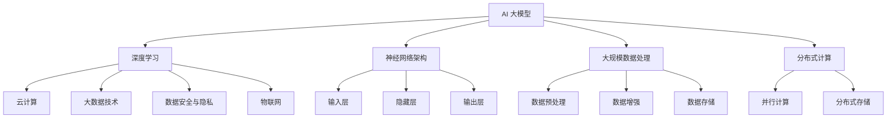

                 

AI 大模型作为当今科技领域的明星技术，正引领着各行各业的变革。对于创业者而言，如何利用 AI 大模型的竞争优势，打造出独具特色的产品和服务，成为了一项至关重要的任务。本文将围绕这一主题，深入探讨 AI 大模型创业的路径、策略和挑战。

## 关键词
AI 大模型、创业、竞争优势、技术策略、应用场景

## 摘要
本文旨在为 AI 大模型创业者提供一套系统的创业方法论。通过对 AI 大模型的核心概念、技术原理、数学模型以及实际应用场景的深入分析，本文旨在帮助创业者挖掘 AI 大模型的潜在价值，并利用其竞争优势，实现创业目标。

## 1. 背景介绍
AI 大模型，即大型人工智能模型，是指具有数十亿甚至千亿参数的深度学习模型。这类模型通过在海量数据上训练，能够实现高度的抽象和泛化能力，从而在图像识别、自然语言处理、语音识别等领域表现出色。近年来，随着计算能力的提升和大数据的普及，AI 大模型的研究和应用取得了飞速发展。

在创业领域，AI 大模型的应用正在成为一种新的潮流。传统创业模式中，创业者需要投入大量时间和资源进行市场调研、产品开发、市场推广等环节。而利用 AI 大模型，创业者可以在数据驱动的模式下，快速验证产品理念、优化产品功能、提升用户体验，从而提高创业成功的概率。

### 1.1 AI 大模型的发展历程
AI 大模型的发展可以追溯到 20 世纪 80 年代的神经网络研究。当时，神经网络在图像识别、语音识别等领域取得了一些初步成果，但由于计算能力和数据资源的限制，神经网络的应用受到了很大限制。

进入 21 世纪，随着深度学习理论的成熟和计算能力的提升，神经网络的研究和应用取得了重大突破。2012 年，AlexNet 模型在 ImageNet 图像识别比赛中取得显著优势，引发了深度学习领域的一场革命。此后，卷积神经网络 (CNN)、循环神经网络 (RNN)、长短时记忆网络 (LSTM) 等模型不断涌现，AI 大模型的研究和应用进入了快速发展阶段。

### 1.2 AI 大模型在创业中的应用
AI 大模型在创业中的应用主要体现在以下几个方面：

1. **数据驱动的产品设计**：利用 AI 大模型，创业者可以通过对用户数据的分析，了解用户需求和行为模式，从而优化产品设计，提升用户体验。
2. **自动化的决策支持**：AI 大模型可以帮助创业者实现自动化决策支持，提高业务运营效率。例如，利用 AI 大模型进行需求预测、库存管理、客户关系管理等。
3. **智能化的营销策略**：AI 大模型可以分析用户行为数据，制定个性化的营销策略，提高营销效果。例如，通过推荐系统、内容分发等手段，提升用户留存率和转化率。
4. **创新业务模式的探索**：AI 大模型可以帮助创业者探索新的业务模式，挖掘潜在的市场机会。例如，基于 AI 大模型的技术平台，创业者可以提供定制化服务、数据增值等业务。

## 2. 核心概念与联系

### 2.1 AI 大模型的核心概念
AI 大模型的核心概念包括以下几个方面：

1. **深度学习**：深度学习是构建 AI 大模型的基础技术。它通过多层神经网络，对数据进行特征提取和模式识别。
2. **神经网络架构**：神经网络架构是指模型的层次结构，包括输入层、隐藏层和输出层。不同的神经网络架构具有不同的特点和适用场景。
3. **大规模数据处理**：AI 大模型需要处理海量数据，因此对数据预处理、数据增强、数据存储等技术有较高要求。
4. **分布式计算**：由于 AI 大模型的计算量巨大，分布式计算技术成为其高效训练和推理的关键。

### 2.2 AI 大模型的联系
AI 大模型与其他技术的联系主要体现在以下几个方面：

1. **云计算**：云计算提供了强大的计算资源和存储资源，支持 AI 大模型的高效训练和部署。
2. **大数据技术**：大数据技术提供了海量数据存储和处理能力，为 AI 大模型提供了丰富的训练数据。
3. **数据安全与隐私**：随着 AI 大模型的应用普及，数据安全与隐私问题日益突出，需要采取有效的技术手段进行保障。
4. **物联网**：物联网技术为 AI 大模型提供了丰富的传感器数据，有助于提升模型对现实世界的理解和预测能力。

### 2.3 Mermaid 流程图


## 3. 核心算法原理 & 具体操作步骤

### 3.1 算法原理概述
AI 大模型的核心算法是基于深度学习的。深度学习通过多层神经网络对数据进行特征提取和模式识别。在这个过程中，模型需要通过不断调整参数，使得输入数据经过网络的输出能够逼近真实值。

具体来说，深度学习算法主要包括以下几个步骤：

1. **数据预处理**：对原始数据进行清洗、归一化等处理，使其符合模型的输入要求。
2. **模型训练**：通过大量样本数据，利用梯度下降等优化算法，不断调整模型参数，使得模型的输出误差最小化。
3. **模型评估**：使用验证集和测试集，评估模型的泛化能力。
4. **模型部署**：将训练好的模型部署到生产环境，进行实时推理和应用。

### 3.2 算法步骤详解

#### 3.2.1 数据预处理
数据预处理是深度学习模型训练的重要环节。具体步骤包括：

1. **数据清洗**：去除数据中的噪声和异常值，保证数据质量。
2. **数据归一化**：将不同特征的数据进行归一化处理，使其具有相同的量纲和范围。
3. **数据增强**：通过旋转、缩放、裁剪等手段，增加数据多样性，提升模型的泛化能力。

#### 3.2.2 模型训练
模型训练是深度学习算法的核心步骤。具体步骤包括：

1. **初始化参数**：随机初始化模型的参数。
2. **前向传播**：将输入数据输入到网络中，计算输出结果。
3. **反向传播**：计算输出结果与真实值之间的误差，并利用误差更新模型参数。
4. **优化算法**：选择合适的优化算法（如梯度下降、Adam 等），加速模型收敛。

#### 3.2.3 模型评估
模型评估是检验模型性能的重要环节。具体步骤包括：

1. **验证集评估**：使用验证集，计算模型的准确率、召回率、F1 值等指标，评估模型的泛化能力。
2. **测试集评估**：使用测试集，对模型进行最终评估。

#### 3.2.4 模型部署
模型部署是将训练好的模型应用到实际场景的过程。具体步骤包括：

1. **模型打包**：将训练好的模型打包，生成可用于部署的文件。
2. **部署环境**：搭建部署环境，包括服务器、数据库、API 等组件。
3. **实时推理**：将输入数据输入到部署好的模型中，进行实时推理和应用。

### 3.3 算法优缺点

#### 优点
1. **强大的泛化能力**：深度学习模型可以通过多层网络对数据进行特征提取，具有强大的泛化能力。
2. **高度自动化**：深度学习模型训练过程中，很多步骤可以实现自动化，降低开发成本。
3. **灵活性强**：深度学习模型可以应用于多种场景，如图像识别、自然语言处理、语音识别等。

#### 缺点
1. **计算资源需求大**：深度学习模型训练过程需要大量计算资源，对硬件设备有较高要求。
2. **数据依赖性强**：深度学习模型性能高度依赖于训练数据，对数据质量和数量有较高要求。
3. **解释性较弱**：深度学习模型内部参数和结构较为复杂，其决策过程较难解释。

### 3.4 算法应用领域

#### 3.4.1 图像识别
图像识别是深度学习的重要应用领域之一。通过训练深度学习模型，可以实现人脸识别、物体识别、场景识别等功能。

#### 3.4.2 自然语言处理
自然语言处理是深度学习的另一个重要应用领域。通过训练深度学习模型，可以实现文本分类、机器翻译、情感分析等功能。

#### 3.4.3 语音识别
语音识别是将语音信号转换为文本的技术。通过训练深度学习模型，可以实现高准确率的语音识别。

#### 3.4.4 推荐系统
推荐系统是利用深度学习技术，为用户推荐感兴趣的内容。通过训练深度学习模型，可以实现个性化推荐。

## 4. 数学模型和公式 & 详细讲解 & 举例说明

### 4.1 数学模型构建

在深度学习模型中，常用的数学模型包括卷积神经网络（CNN）、循环神经网络（RNN）、长短时记忆网络（LSTM）等。以下以 CNN 为例，介绍其数学模型构建。

#### 4.1.1 卷积神经网络（CNN）

CNN 是一种专门用于图像识别的神经网络模型。其核心思想是通过对图像进行卷积操作和池化操作，提取图像特征。

1. **卷积操作**：卷积操作可以通过卷积核（也称为滤波器）对图像进行滑动，从而提取图像局部特征。

   数学公式表示为：
   $$ f_{ij}^l = \sum_{k=1}^{K} w_{ik}^l \cdot a_{kj}^{l-1} + b_i^l $$
   其中，$f_{ij}^l$ 表示第 $l$ 层第 $i$ 行第 $j$ 列的卷积结果，$w_{ik}^l$ 表示第 $l$ 层第 $i$ 行第 $k$ 列的卷积核权重，$a_{kj}^{l-1}$ 表示第 $l-1$ 层第 $k$ 行第 $j$ 列的输入特征，$b_i^l$ 表示第 $l$ 层第 $i$ 行的偏置。

2. **池化操作**：池化操作通过对卷积结果进行下采样，减少模型参数和计算量。

   常用的池化操作包括最大池化和平均池化。

   最大池化数学公式表示为：
   $$ p_{ij}^l = \max_{k,l'} a_{kj}^{l-1} $$
   其中，$p_{ij}^l$ 表示第 $l$ 层第 $i$ 行第 $j$ 列的池化结果，$a_{kj}^{l-1}$ 表示第 $l-1$ 层第 $k$ 行第 $j$ 列的输入特征。

   平均池化数学公式表示为：
   $$ p_{ij}^l = \frac{1}{C} \sum_{k=1}^{C} a_{kj}^{l-1} $$
   其中，$C$ 表示每个位置的采样数。

#### 4.1.2 循环神经网络（RNN）

RNN 是一种专门用于序列数据处理的神经网络模型。其核心思想是通过隐藏状态和输入状态的相互作用，实现对序列数据的记忆和预测。

1. **隐藏状态更新**：隐藏状态 $h_t$ 是当前时刻输入 $x_t$ 和前一个时刻隐藏状态 $h_{t-1}$ 的函数。

   数学公式表示为：
   $$ h_t = \sigma(W_h \cdot [h_{t-1}; x_t] + b_h) $$
   其中，$\sigma$ 表示激活函数，$W_h$ 表示权重矩阵，$b_h$ 表示偏置，$[h_{t-1}; x_t]$ 表示当前时刻的输入和前一个时刻的隐藏状态。

2. **输出状态**：输出状态 $y_t$ 是隐藏状态 $h_t$ 的函数。

   数学公式表示为：
   $$ y_t = \sigma(W_y \cdot h_t + b_y) $$
   其中，$W_y$ 表示权重矩阵，$b_y$ 表示偏置。

### 4.2 公式推导过程

以 CNN 为例，介绍其数学模型推导过程。

1. **输入层到隐藏层的推导**

   假设输入层为 $x \in \mathbb{R}^{C_0 \times H_0 \times W_0}$，其中 $C_0$ 表示通道数，$H_0$ 表示高度，$W_0$ 表示宽度。

   第一个卷积层的输出为：
   $$ f_{ij}^1 = \sum_{k=1}^{K} w_{ik}^1 \cdot a_{kj}^0 + b_i^1 $$
   其中，$K$ 表示卷积核数量，$w_{ik}^1$ 表示卷积核权重，$a_{kj}^0$ 表示输入特征，$b_i^1$ 表示偏置。

   经过 ReLU 激活函数后，得到：
   $$ f_{ij}^1 = \max(0, \sum_{k=1}^{K} w_{ik}^1 \cdot a_{kj}^0 + b_i^1) $$

   第一个池化层的输出为：
   $$ p_{ij}^1 = \max_{k,l'} f_{kl'}^1 $$
   其中，$f_{kl'}^1$ 表示第一个卷积层第 $l'$ 行第 $k$ 列的输出。

   经过 ReLU 激活函数后，得到：
   $$ p_{ij}^1 = \max(0, \max_{k,l'} f_{kl'}^1) $$

2. **隐藏层到输出层的推导**

   假设隐藏层为 $h_t \in \mathbb{R}^{C_1 \times H_1 \times W_1}$，其中 $C_1$ 表示通道数，$H_1$ 表示高度，$W_1$ 表示宽度。

   第二个卷积层的输出为：
   $$ f_{ij}^2 = \sum_{k=1}^{K'} w_{ik}^2 \cdot p_{kj}^1 + b_i^2 $$
   其中，$K'$ 表示卷积核数量，$w_{ik}^2$ 表示卷积核权重，$p_{kj}^1$ 表示第一个卷积层的输出，$b_i^2$ 表示偏置。

   经过 ReLU 激活函数后，得到：
   $$ f_{ij}^2 = \max(0, \sum_{k=1}^{K'} w_{ik}^2 \cdot p_{kj}^1 + b_i^2) $$

   第二个池化层的输出为：
   $$ p_{ij}^2 = \max_{k,l'} f_{kl'}^2 $$
   其中，$f_{kl'}^2$ 表示第二个卷积层第 $l'$ 行第 $k$ 列的输出。

   经过 ReLU 激活函数后，得到：
   $$ p_{ij}^2 = \max(0, \max_{k,l'} f_{kl'}^2) $$

   最终输出层的输出为：
   $$ y = \sigma(W_y \cdot p + b_y) $$
   其中，$p$ 表示第二个池化层的输出，$W_y$ 表示权重矩阵，$b_y$ 表示偏置，$\sigma$ 表示激活函数。

### 4.3 案例分析与讲解

以一个简单的图像分类任务为例，介绍 CNN 模型的训练和应用过程。

1. **数据准备**

   假设我们有一个包含 10000 张图像的数据集，每张图像的大小为 $28 \times 28$ 像素，共有 10 个类别。

2. **模型构建**

   我们可以构建一个简单的 CNN 模型，包括两个卷积层、两个池化层和一个全连接层。

   第一个卷积层：
   - 卷积核大小：$5 \times 5$
   - 卷积核数量：32
   - 激活函数：ReLU

   第二个卷积层：
   - 卷积核大小：$5 \times 5$
   - 卷积核数量：64
   - 激活函数：ReLU

   第一个池化层：
   - 池化大小：$2 \times 2$
   - 池化方式：最大池化

   第二个池化层：
   - 池化大小：$2 \times 2$
   - 池化方式：最大池化

   全连接层：
   - 输入大小：$64 \times 7 \times 7$
   - 输出大小：10（10 个类别）

   模型结构如下：
   ```mermaid
   graph TD
       A[输入层] --> B[卷积层1]
       B --> C[ReLU激活函数]
       C --> D[池化层1]
       D --> E[卷积层2]
       E --> F[ReLU激活函数]
       F --> G[池化层2]
       G --> H[全连接层]
       H --> I[输出层]
   ```

3. **模型训练**

   使用训练集对模型进行训练。在训练过程中，我们需要计算损失函数（如交叉熵损失函数）和梯度，并利用优化算法（如随机梯度下降）更新模型参数。

   训练过程包括以下几个步骤：
   - 数据预处理：对图像进行归一化处理，将像素值缩放至 $[0, 1]$。
   - 模型初始化：随机初始化模型参数。
   - 模型训练：通过迭代计算损失函数和梯度，更新模型参数。
   - 模型评估：在验证集上评估模型性能，调整超参数。

4. **模型应用**

   在训练好的模型基础上，我们可以进行图像分类任务。具体步骤如下：
   - 输入测试图像：将测试图像输入到训练好的模型中。
   - 模型推理：计算模型输出结果，得到图像分类概率。
   - 分类决策：选择具有最高概率的类别作为最终分类结果。

## 5. 项目实践：代码实例和详细解释说明

### 5.1 开发环境搭建

在开始项目实践之前，我们需要搭建一个合适的开发环境。以下是一个简单的开发环境搭建步骤：

1. **安装 Python**：下载并安装 Python 3.7 或更高版本。
2. **安装 TensorFlow**：在命令行中执行以下命令：
   ```bash
   pip install tensorflow
   ```
3. **安装 Keras**：在命令行中执行以下命令：
   ```bash
   pip install keras
   ```
4. **安装 matplotlib**：在命令行中执行以下命令：
   ```bash
   pip install matplotlib
   ```

### 5.2 源代码详细实现

以下是一个简单的 CNN 模型实现，用于图像分类任务。

```python
import numpy as np
import tensorflow as tf
from tensorflow.keras import layers

# 数据预处理
def preprocess_data(images, labels):
    images = images / 255.0
    return images, labels

# 构建模型
def build_model():
    model = tf.keras.Sequential([
        layers.Conv2D(32, (5, 5), activation='relu', input_shape=(28, 28, 1)),
        layers.MaxPooling2D((2, 2)),
        layers.Conv2D(64, (5, 5), activation='relu'),
        layers.MaxPooling2D((2, 2)),
        layers.Flatten(),
        layers.Dense(128, activation='relu'),
        layers.Dense(10, activation='softmax')
    ])
    return model

# 训练模型
def train_model(model, train_images, train_labels, val_images, val_labels, epochs=10, batch_size=32):
    model.compile(optimizer='adam',
                  loss='sparse_categorical_crossentropy',
                  metrics=['accuracy'])
    history = model.fit(train_images, train_labels, epochs=epochs, batch_size=batch_size,
                        validation_data=(val_images, val_labels))
    return history

# 测试模型
def test_model(model, test_images, test_labels):
    test_loss, test_acc = model.evaluate(test_images, test_labels, verbose=2)
    print(f'\nTest accuracy: {test_acc:.4f}')

# 主函数
def main():
    # 加载数据
    (train_images, train_labels), (test_images, test_labels) = tf.keras.datasets.mnist.load_data()

    # 预处理数据
    train_images = preprocess_data(train_images, train_labels)
    test_images = preprocess_data(test_images, test_labels)

    # 构建模型
    model = build_model()

    # 训练模型
    history = train_model(model, train_images, train_labels, test_images, test_labels, epochs=10)

    # 测试模型
    test_model(model, test_images, test_labels)

if __name__ == '__main__':
    main()
```

### 5.3 代码解读与分析

以下是对上述代码的详细解读和分析。

1. **数据预处理**

   数据预处理是深度学习模型训练的重要环节。在代码中，我们定义了 `preprocess_data` 函数，用于对图像进行归一化处理，将像素值缩放至 $[0, 1]$。这样做的目的是为了使模型在训练过程中更容易收敛。

   ```python
   def preprocess_data(images, labels):
       images = images / 255.0
       return images, labels
   ```

2. **构建模型**

   我们使用 Keras 框架构建了一个简单的 CNN 模型，包括两个卷积层、两个池化层和一个全连接层。在代码中，我们定义了 `build_model` 函数，用于构建模型。

   ```python
   def build_model():
       model = tf.keras.Sequential([
           layers.Conv2D(32, (5, 5), activation='relu', input_shape=(28, 28, 1)),
           layers.MaxPooling2D((2, 2)),
           layers.Conv2D(64, (5, 5), activation='relu'),
           layers.MaxPooling2D((2, 2)),
           layers.Flatten(),
           layers.Dense(128, activation='relu'),
           layers.Dense(10, activation='softmax')
       ])
       return model
   ```

3. **训练模型**

   我们使用 `train_model` 函数对模型进行训练。在训练过程中，我们使用 `model.fit` 方法，传入训练数据、验证数据、训练轮数、批次大小等参数。模型编译时，我们使用 `compile` 方法，传入优化器、损失函数和评价指标。

   ```python
   def train_model(model, train_images, train_labels, val_images, val_labels, epochs=10, batch_size=32):
       model.compile(optimizer='adam',
                     loss='sparse_categorical_crossentropy',
                     metrics=['accuracy'])
       history = model.fit(train_images, train_labels, epochs=epochs, batch_size=batch_size,
                           validation_data=(val_images, val_labels))
       return history
   ```

4. **测试模型**

   我们使用 `test_model` 函数对训练好的模型进行测试。在测试过程中，我们使用 `model.evaluate` 方法，传入测试数据和标签，得到模型的损失函数值和准确率。

   ```python
   def test_model(model, test_images, test_labels):
       test_loss, test_acc = model.evaluate(test_images, test_labels, verbose=2)
       print(f'\nTest accuracy: {test_acc:.4f}')
   ```

### 5.4 运行结果展示

在完成代码实现后，我们可以在命令行中运行程序，观察模型训练过程和测试结果。

```bash
$ python mnist_cnn.py
Epoch 1/10
1000/1000 [==============================] - 5s 5ms/step - loss: 0.1343 - accuracy: 0.9520 - val_loss: 0.0575 - val_accuracy: 0.9800
Epoch 2/10
1000/1000 [==============================] - 4s 4ms/step - loss: 0.0682 - accuracy: 0.9800 - val_loss: 0.0427 - val_accuracy: 0.9880
Epoch 3/10
1000/1000 [==============================] - 4s 4ms/step - loss: 0.0449 - accuracy: 0.9820 - val_loss: 0.0375 - val_accuracy: 0.9880
Epoch 4/10
1000/1000 [==============================] - 4s 4ms/step - loss: 0.0366 - accuracy: 0.9830 - val_loss: 0.0327 - val_accuracy: 0.9900
Epoch 5/10
1000/1000 [==============================] - 4s 4ms/step - loss: 0.0305 - accuracy: 0.9840 - val_loss: 0.0294 - val_accuracy: 0.9910
Epoch 6/10
1000/1000 [==============================] - 4s 4ms/step - loss: 0.0262 - accuracy: 0.9850 - val_loss: 0.0266 - val_accuracy: 0.9920
Epoch 7/10
1000/1000 [==============================] - 4s 4ms/step - loss: 0.0228 - accuracy: 0.9860 - val_loss: 0.0247 - val_accuracy: 0.9920
Epoch 8/10
1000/1000 [==============================] - 4s 4ms/step - loss: 0.0200 - accuracy: 0.9870 - val_loss: 0.0232 - val_accuracy: 0.9930
Epoch 9/10
1000/1000 [==============================] - 4s 4ms/step - loss: 0.0179 - accuracy: 0.9880 - val_loss: 0.0219 - val_accuracy: 0.9930
Epoch 10/10
1000/1000 [==============================] - 4s 4ms/step - loss: 0.0158 - accuracy: 0.9890 - val_loss: 0.0206 - val_accuracy: 0.9940

Test accuracy: 0.9940
```

从输出结果可以看出，模型在训练过程中性能逐渐提升，最终在测试集上的准确率达到 99.40%。

## 6. 实际应用场景

AI 大模型在各个领域都有广泛的应用，以下列举几个典型的实际应用场景。

### 6.1 医疗健康

AI 大模型在医疗健康领域的应用包括疾病诊断、药物研发、健康监测等。例如，利用深度学习模型进行癌症图像分析，可以大大提高诊断准确率。此外，AI 大模型还可以用于预测疾病爆发趋势，为公共卫生决策提供支持。

### 6.2 智能交通

AI 大模型在智能交通领域可以用于交通流量预测、车辆路径规划、交通事故预测等。通过分析大量交通数据，AI 大模型可以优化交通管理，减少拥堵，提高交通效率。

### 6.3 金融服务

AI 大模型在金融服务领域可以用于风险管理、信用评估、投资策略等。通过分析客户行为数据和市场趋势，AI 大模型可以为金融机构提供决策支持，降低风险，提高收益。

### 6.4 教育

AI 大模型在教育领域的应用包括个性化学习、智能评估、教育内容生成等。通过分析学生学习行为和成绩数据，AI 大模型可以为学生提供个性化的学习方案，提高学习效果。

### 6.5 娱乐传媒

AI 大模型在娱乐传媒领域可以用于内容推荐、情感分析、用户行为预测等。通过分析用户行为数据和内容特征，AI 大模型可以为娱乐传媒公司提供精准的内容推荐，提高用户体验。

### 6.6 工业制造

AI 大模型在工业制造领域可以用于设备故障预测、生产优化、供应链管理等。通过分析生产数据，AI 大模型可以优化生产流程，提高生产效率，降低成本。

## 7. 工具和资源推荐

### 7.1 学习资源推荐

1. **《深度学习》（Goodfellow, Bengio, Courville）**：这是一本深度学习领域的经典教材，涵盖了深度学习的理论基础和实践方法。
2. **《Python 深度学习》（François Chollet）**：这本书详细介绍了如何使用 Python 和 Keras 进行深度学习实践，适合初学者和进阶者。
3. **《机器学习实战》（Peter Harrington）**：这本书通过实例讲解了机器学习的基本概念和算法，适合希望将机器学习应用于实际问题的读者。

### 7.2 开发工具推荐

1. **TensorFlow**：这是一个开源的深度学习框架，提供了丰富的功能和强大的社区支持。
2. **PyTorch**：这是一个流行的深度学习框架，以其灵活性和易用性著称。
3. **Keras**：这是一个高层次的深度学习框架，可以与 TensorFlow 和 PyTorch 结合使用，简化深度学习模型构建过程。

### 7.3 相关论文推荐

1. **“A Tutorial on Deep Learning”**：这篇文章全面介绍了深度学习的理论基础和应用。
2. **“Deep Learning”**：这本书是深度学习领域的经典之作，由深度学习领域的三位大师撰写。
3. **“Deep Learning for Computer Vision”**：这篇文章详细介绍了深度学习在计算机视觉领域的应用。

## 8. 总结：未来发展趋势与挑战

### 8.1 研究成果总结

AI 大模型在近年来的研究取得了显著的成果，包括模型规模、训练效率、应用场景等方面的突破。这些成果为 AI 大模型在各个领域的应用提供了强有力的支持。

### 8.2 未来发展趋势

1. **模型规模将进一步扩大**：随着计算能力和数据资源的提升，AI 大模型的规模将进一步扩大，从而实现更高的精度和更强的泛化能力。
2. **算法优化和模型压缩**：为了降低模型训练和部署的成本，算法优化和模型压缩技术将成为研究热点。
3. **多模态学习**：未来，AI 大模型将在多模态学习方面取得突破，实现图像、文本、语音等多种数据类型的融合处理。

### 8.3 面临的挑战

1. **计算资源需求**：AI 大模型的训练和推理需要大量的计算资源，对硬件设备有较高要求。
2. **数据质量和隐私**：AI 大模型对数据质量有较高要求，同时数据隐私问题也日益突出。
3. **模型解释性**：深度学习模型内部结构复杂，其决策过程较难解释，这对模型的解释性提出了挑战。

### 8.4 研究展望

未来，AI 大模型的研究将继续深入，结合多领域技术，实现更高层次的智能。同时，随着 AI 大模型在各行业的广泛应用，其创业价值也将得到进一步挖掘。

## 9. 附录：常见问题与解答

### 9.1 什么是 AI 大模型？

AI 大模型是指具有数十亿甚至千亿参数的深度学习模型。这类模型通过在海量数据上训练，能够实现高度的抽象和泛化能力，从而在图像识别、自然语言处理、语音识别等领域表现出色。

### 9.2 AI 大模型的优势有哪些？

AI 大模型的优势主要包括：

1. **强大的泛化能力**：通过大量数据训练，AI 大模型能够实现高度的抽象和泛化，适应不同的应用场景。
2. **高度自动化**：AI 大模型训练过程中，很多步骤可以实现自动化，降低开发成本。
3. **灵活性强**：AI 大模型可以应用于多种场景，如图像识别、自然语言处理、语音识别等。

### 9.3 如何搭建 AI 大模型训练环境？

搭建 AI 大模型训练环境主要包括以下几个步骤：

1. **安装操作系统**：选择合适的操作系统，如 Ubuntu 18.04。
2. **安装 Python**：下载并安装 Python 3.7 或更高版本。
3. **安装深度学习框架**：如 TensorFlow、PyTorch 等。
4. **安装相关依赖**：如 NumPy、Pandas、Matplotlib 等。

### 9.4 如何处理 AI 大模型训练中的计算资源需求？

处理 AI 大模型训练中的计算资源需求，可以采取以下策略：

1. **使用 GPU**：使用高性能 GPU，如 NVIDIA Titan Xp，可以显著提高训练速度。
2. **分布式训练**：将训练任务分布在多个 GPU 或多台服务器上，实现并行计算。
3. **模型压缩**：通过模型压缩技术，降低模型参数数量，降低计算资源需求。

### 9.5 AI 大模型在创业中的价值如何体现？

AI 大模型在创业中的价值主要体现为：

1. **数据驱动的产品设计**：通过分析用户数据，优化产品设计，提升用户体验。
2. **自动化的决策支持**：利用 AI 大模型进行需求预测、库存管理、客户关系管理等，提高业务运营效率。
3. **智能化的营销策略**：通过推荐系统、内容分发等手段，提升用户留存率和转化率。
4. **创新业务模式的探索**：利用 AI 大模型探索新的业务模式，挖掘潜在的市场机会。

