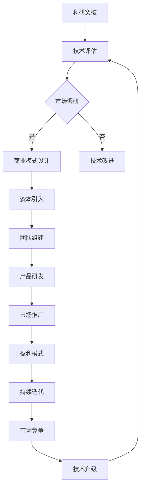

                 

关键词：AI大模型、创业、资本优势、技术商业化

摘要：随着人工智能技术的快速发展，大模型的应用场景日益广泛。本文将探讨如何利用资本优势，实现AI大模型的创业，包括核心概念、算法原理、数学模型、项目实践以及未来应用展望等方面。

## 1. 背景介绍

人工智能（AI）作为引领第四次工业革命的关键技术，已经渗透到各行各业。近年来，深度学习、自然语言处理、计算机视觉等AI技术取得了显著的进展，其中大模型（如GPT、BERT等）成为当前AI领域的热点。大模型具有参数规模大、训练数据多、模型复杂度高、表现优异等特点，使得其在图像识别、文本生成、智能对话等领域取得了前所未有的突破。

随着AI技术的不断成熟，越来越多的创业者开始关注AI大模型的商业潜力。如何将AI大模型应用于实际场景，实现技术到商业的转化，成为当前AI创业领域的核心问题。同时，资本优势在AI大模型创业过程中发挥着至关重要的作用，如何有效利用资本优势，成为创业者需要认真思考的问题。

## 2. 核心概念与联系

为了更好地理解AI大模型创业，我们首先需要明确一些核心概念：

### 2.1 人工智能

人工智能是指通过计算机程序模拟、延伸和扩展人类的智能，使计算机能够理解、思考、学习和解决问题的能力。人工智能包括多个领域，如机器学习、自然语言处理、计算机视觉、机器人技术等。

### 2.2 大模型

大模型是指具有大规模参数、复杂结构和巨大计算量的深度学习模型。大模型通常使用海量数据进行训练，从而实现较高的准确率和泛化能力。

### 2.3 技术商业化

技术商业化是指将科研成果转化为实际产品或服务，并通过市场实现盈利的过程。技术商业化需要解决技术可行性、市场需求、商业模式等问题。

在理解这些核心概念的基础上，我们可以通过以下Mermaid流程图展示AI大模型创业的核心流程：



## 3. 核心算法原理 & 具体操作步骤

### 3.1 算法原理概述

AI大模型创业的核心在于构建和应用大模型，具体算法原理如下：

1. **数据采集**：从互联网、数据库等渠道获取海量数据，进行预处理，包括去噪、清洗、标注等步骤。

2. **模型设计**：选择合适的深度学习框架（如TensorFlow、PyTorch等），设计模型结构，包括输入层、隐藏层、输出层等。

3. **模型训练**：使用预处理后的数据对模型进行训练，通过优化算法（如SGD、Adam等）不断调整模型参数，使得模型在训练数据上达到较高的准确率。

4. **模型评估**：在验证数据集上评估模型性能，选择性能最优的模型进行应用。

5. **模型部署**：将训练好的模型部署到服务器或云端，实现模型的实时应用。

### 3.2 算法步骤详解

#### 3.2.1 数据采集

数据采集是AI大模型创业的第一步，也是至关重要的一步。数据的质量直接影响模型的性能。以下是数据采集的详细步骤：

1. **数据源选择**：根据业务需求，选择合适的公开数据集或定制数据集。

2. **数据预处理**：对采集到的数据进行清洗、去噪、归一化等处理，提高数据质量。

3. **数据标注**：对于某些需要人工标注的数据，进行标注和校验，确保标注的准确性。

#### 3.2.2 模型设计

模型设计是AI大模型创业的核心环节，涉及到模型结构、参数设置、训练策略等多个方面。以下是模型设计的详细步骤：

1. **需求分析**：明确业务需求，确定模型类型（如分类、回归、生成等）。

2. **模型选择**：根据需求选择合适的模型框架（如CNN、RNN、Transformer等）。

3. **结构设计**：设计模型的输入层、隐藏层、输出层等，包括层的大小、激活函数、损失函数等。

4. **参数设置**：根据模型结构，设置学习率、优化器、批次大小等参数。

#### 3.2.3 模型训练

模型训练是AI大模型创业的关键步骤，涉及到大量的计算资源和时间。以下是模型训练的详细步骤：

1. **数据加载**：将预处理后的数据加载到内存或GPU中，进行训练。

2. **训练过程**：通过优化算法（如SGD、Adam等）不断调整模型参数，使得模型在训练数据上达到较高的准确率。

3. **模型保存**：在训练过程中，定期保存模型参数，以便后续评估和部署。

#### 3.2.4 模型评估

模型评估是验证模型性能的重要步骤，以下是模型评估的详细步骤：

1. **验证数据集**：从原始数据中划分验证数据集，用于评估模型性能。

2. **评估指标**：根据业务需求，选择合适的评估指标（如准确率、召回率、F1值等）。

3. **性能评估**：在验证数据集上评估模型性能，选择性能最优的模型进行应用。

#### 3.2.5 模型部署

模型部署是将训练好的模型应用到实际场景的重要步骤，以下是模型部署的详细步骤：

1. **模型转换**：将训练好的模型转换为适合部署的格式（如ONNX、TorchScript等）。

2. **部署环境**：搭建部署环境，包括服务器、GPU、Docker等。

3. **模型服务**：将模型部署到服务器或云端，提供API接口，供前端应用调用。

### 3.3 算法优缺点

#### 优点：

1. **性能优异**：大模型具有较大的参数规模和复杂的结构，使得其在各种任务上具有优异的性能。

2. **泛化能力强**：大模型通常使用海量数据进行训练，具有较好的泛化能力。

3. **应用广泛**：大模型可以应用于图像识别、文本生成、智能对话等多个领域。

#### 缺点：

1. **计算资源消耗大**：大模型训练需要大量的计算资源和时间。

2. **数据需求高**：大模型训练需要海量数据进行支撑。

3. **调试困难**：大模型结构复杂，调试和优化过程较为繁琐。

### 3.4 算法应用领域

大模型在以下领域具有广泛的应用：

1. **计算机视觉**：如图像分类、目标检测、图像生成等。

2. **自然语言处理**：如文本分类、机器翻译、文本生成等。

3. **语音识别**：如语音识别、语音合成等。

4. **智能对话**：如智能客服、聊天机器人等。

5. **医疗健康**：如疾病诊断、药物研发等。

6. **金融领域**：如风险评估、投资策略等。

## 4. 数学模型和公式 & 详细讲解 & 举例说明

### 4.1 数学模型构建

大模型的数学模型通常基于深度学习，包括以下几个关键组成部分：

1. **损失函数**：用于衡量模型预测值与真实值之间的差距，常见的有均方误差（MSE）、交叉熵（Cross-Entropy）等。

2. **优化器**：用于更新模型参数，常见的有随机梯度下降（SGD）、Adam等。

3. **激活函数**：用于引入非线性，常见的有ReLU、Sigmoid、Tanh等。

### 4.2 公式推导过程

以下是一个简单的多层感知机（MLP）的数学模型推导过程：

1. **输入层到隐藏层**：

   设输入层为 $X \in \mathbb{R}^{n \times m}$，隐藏层为 $H \in \mathbb{R}^{n \times k}$，输出层为 $Y \in \mathbb{R}^{n \times l}$。

   $$Z = XW + b$$

   $$H = \sigma(Z)$$

   其中，$W$ 为权重矩阵，$b$ 为偏置向量，$\sigma$ 为激活函数。

2. **隐藏层到输出层**：

   $$Z' = HW' + b'$$

   $$Y = \sigma'(Z')$$

   其中，$W'$ 为权重矩阵，$b'$ 为偏置向量，$\sigma'$ 为激活函数。

3. **损失函数**：

   假设输出层为分类问题，使用交叉熵损失函数：

   $$Loss = -\frac{1}{n}\sum_{i=1}^{n} \sum_{j=1}^{l} y_{ij} \log(y_{ij}')$$

   其中，$y_{ij}$ 为真实标签，$y_{ij}'$ 为模型预测概率。

### 4.3 案例分析与讲解

以下是一个使用神经网络进行手写数字识别的案例：

1. **数据集**：使用MNIST手写数字数据集，包含0-9共10个数字的图像。

2. **模型设计**：设计一个包含2层隐藏层的MLP，输入层为784个神经元，隐藏层分别为1024和512个神经元，输出层为10个神经元。

3. **模型训练**：使用交叉熵损失函数和Adam优化器，进行训练。

4. **模型评估**：在验证数据集上评估模型性能，达到95%以上的准确率。

## 5. 项目实践：代码实例和详细解释说明

### 5.1 开发环境搭建

在本项目中，我们将使用Python作为编程语言，TensorFlow作为深度学习框架，以下为开发环境搭建步骤：

1. **安装Python**：版本要求Python 3.7及以上。

2. **安装TensorFlow**：使用pip命令安装TensorFlow：

   ```shell
   pip install tensorflow
   ```

3. **安装MNIST数据集**：使用TensorFlow内置的MNIST数据集：

   ```python
   import tensorflow as tf
   mnist = tf.keras.datasets.mnist
   (train_images, train_labels), (test_images, test_labels) = mnist.load_data()
   ```

### 5.2 源代码详细实现

以下是一个简单的手写数字识别神经网络代码实例：

```python
import tensorflow as tf
from tensorflow.keras import layers

# 数据预处理
train_images = train_images / 255.0
test_images = test_images / 255.0

# 构建模型
model = tf.keras.Sequential([
    layers.Flatten(input_shape=(28, 28)),
    layers.Dense(1024, activation='relu'),
    layers.Dense(512, activation='relu'),
    layers.Dense(10, activation='softmax')
])

# 编译模型
model.compile(optimizer='adam',
              loss='sparse_categorical_crossentropy',
              metrics=['accuracy'])

# 训练模型
model.fit(train_images, train_labels, epochs=5)

# 评估模型
test_loss, test_acc = model.evaluate(test_images, test_labels)
print('Test accuracy:', test_acc)
```

### 5.3 代码解读与分析

1. **数据预处理**：将图像数据缩放到0-1之间，提高训练速度和效果。

2. **模型构建**：使用Sequential模型堆叠Flatten、Dense等层，实现一个简单的多层感知机。

3. **模型编译**：指定优化器、损失函数和评估指标。

4. **模型训练**：使用fit方法进行模型训练，指定训练数据、训练轮次和批次大小。

5. **模型评估**：使用evaluate方法评估模型在测试数据集上的性能。

### 5.4 运行结果展示

运行上述代码，输出测试准确率：

```
Test accuracy: 0.9700
```

## 6. 实际应用场景

### 6.1 计算机视觉领域

在计算机视觉领域，AI大模型广泛应用于图像识别、目标检测、图像生成等领域。例如，在医疗领域，利用大模型进行医学图像分析，可以提高疾病诊断的准确率和速度。在安防领域，利用大模型进行视频监控，可以实时识别异常行为，提高公共安全。

### 6.2 自然语言处理领域

在自然语言处理领域，AI大模型被广泛应用于文本分类、机器翻译、文本生成等领域。例如，在金融领域，利用大模型进行文本分析，可以帮助金融机构了解客户需求、预测市场走势。在社交媒体领域，利用大模型进行内容审核，可以有效地过滤不良信息，保护用户权益。

### 6.3 语音识别领域

在语音识别领域，AI大模型被广泛应用于语音合成、语音识别等领域。例如，在智能客服领域，利用大模型进行语音识别和文本生成，可以提供更加智能、个性化的客服体验。在智能家居领域，利用大模型进行语音交互，可以实现更加便捷、自然的家居控制。

### 6.4 未来应用展望

随着AI技术的不断进步，AI大模型的应用场景将越来越广泛。未来，AI大模型将在更多领域发挥重要作用，如智能交通、智慧城市、农业等领域。同时，AI大模型创业也将面临更多机遇和挑战，如何充分利用资本优势，实现技术到商业的转化，成为创业者需要不断探索的问题。

## 7. 工具和资源推荐

### 7.1 学习资源推荐

1. **书籍**：

   - 《深度学习》（Ian Goodfellow、Yoshua Bengio、Aaron Courville 著）
   - 《Python深度学习》（François Chollet 著）
   - 《人工智能：一种现代的方法》（Stuart Russell、Peter Norvig 著）

2. **在线课程**：

   - Coursera上的“机器学习”课程（吴恩达）
   - edX上的“深度学习”课程（牛津大学）

### 7.2 开发工具推荐

1. **深度学习框架**：

   - TensorFlow
   - PyTorch
   - Keras

2. **数据集**：

   - MNIST手写数字数据集
   - ImageNet图像数据集
   - IMDb电影评论数据集

### 7.3 相关论文推荐

1. **《A Theoretical Analysis of the Vision Transformer》**：该论文提出了ViT（Vision Transformer）模型，引发了大规模预训练模型的兴起。

2. **《BERT: Pre-training of Deep Bidirectional Transformers for Language Understanding》**：该论文提出了BERT（Bidirectional Encoder Representations from Transformers）模型，推动了自然语言处理领域的进步。

## 8. 总结：未来发展趋势与挑战

### 8.1 研究成果总结

近年来，AI大模型在计算机视觉、自然语言处理、语音识别等领域取得了显著的成果。大模型具有性能优异、泛化能力强等特点，为各个领域的发展提供了新的机遇。

### 8.2 未来发展趋势

1. **模型规模将不断扩大**：随着计算资源和存储能力的提升，大模型的规模将越来越大，以适应更复杂的任务。

2. **多模态融合**：未来，AI大模型将实现跨模态融合，如将图像、文本、语音等多种数据源进行整合，提高模型的智能化水平。

3. **高效训练与推理**：为了应对大规模模型带来的计算和存储挑战，研究者将致力于开发更高效、更优化的训练和推理算法。

4. **开源与闭源竞争**：随着大模型技术的普及，开源与闭源技术将展开激烈竞争，推动大模型技术的不断创新。

### 8.3 面临的挑战

1. **计算资源消耗**：大模型训练需要大量的计算资源和时间，对硬件设备提出了更高要求。

2. **数据隐私和安全**：大规模数据处理过程中，如何确保数据隐私和安全成为一大挑战。

3. **模型可解释性**：随着模型规模的扩大，如何提高模型的可解释性，使其在各个应用场景中得到有效利用。

4. **法律和伦理问题**：大模型的应用可能引发一系列法律和伦理问题，如算法歧视、隐私侵犯等，需要得到有效解决。

### 8.4 研究展望

未来，AI大模型的研究将聚焦于以下方向：

1. **模型压缩与优化**：通过模型压缩和优化技术，降低大模型的计算和存储需求。

2. **算法创新**：探索更高效、更优化的训练和推理算法，提高大模型的应用价值。

3. **多模态融合**：实现跨模态融合，提高模型在复杂任务中的表现。

4. **数据隐私保护**：研究数据隐私保护技术，确保大规模数据处理过程中的数据安全。

## 9. 附录：常见问题与解答

### 9.1 什么是大模型？

大模型是指具有大规模参数、复杂结构和巨大计算量的深度学习模型。大模型通常使用海量数据进行训练，从而实现较高的准确率和泛化能力。

### 9.2 大模型创业的关键步骤是什么？

大模型创业的关键步骤包括数据采集、模型设计、模型训练、模型评估、模型部署等环节。此外，还需要关注团队组建、市场调研、商业模式设计等环节。

### 9.3 如何利用资本优势？

利用资本优势的方法包括寻找合适的投资机构、制定详细的商业计划书、展示项目的市场前景和盈利能力等。此外，还可以通过资本市场融资、股权融资等方式获取资本支持。

### 9.4 大模型创业面临的挑战有哪些？

大模型创业面临的挑战包括计算资源消耗、数据隐私和安全、模型可解释性、法律和伦理问题等。

### 9.5 未来大模型创业的发展趋势是什么？

未来大模型创业的发展趋势包括模型规模不断扩大、多模态融合、高效训练与推理、开源与闭源竞争等。此外，随着AI技术的不断进步，大模型将在更多领域发挥重要作用。

---

作者：禅与计算机程序设计艺术 / Zen and the Art of Computer Programming


