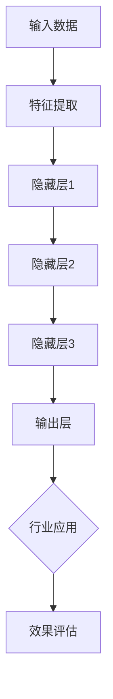

                 

关键词：AI大模型，创业，资本优势，技术落地，商业模式

摘要：本文将探讨AI大模型创业中如何充分利用资本优势，实现技术落地并构建可持续发展的商业模式。通过对AI大模型领域的背景介绍、核心概念与架构解析、算法原理与数学模型、项目实践及未来应用展望等方面的深入分析，帮助创业者把握市场机遇，优化资源配置，提高创业成功率。

## 1. 背景介绍

近年来，随着计算能力的提升和海量数据的积累，AI大模型（如GPT-3、BERT等）在自然语言处理、计算机视觉、语音识别等领域取得了显著突破。这些大模型具有处理复杂数据、自动发现特征和进行预测的能力，为各行各业带来了前所未有的创新机会。

然而，AI大模型创业面临着诸多挑战，包括技术门槛高、研发周期长、资金需求大等。如何充分利用资本优势，实现技术落地并构建可持续发展的商业模式，成为创业者亟待解决的问题。

## 2. 核心概念与联系

### 2.1 大模型基本概念

大模型通常是指具有数百亿乃至数千亿参数的深度神经网络模型。这些模型通过海量数据训练，能够自动发现数据中的复杂模式，并实现对未知数据的预测。

### 2.2 大模型架构

大模型架构通常包括以下几个层次：

1. **输入层**：接收外部输入数据。
2. **隐藏层**：对输入数据进行处理和变换。
3. **输出层**：生成预测结果或执行特定任务。

### 2.3 大模型与行业应用的联系

大模型在不同领域的应用如图所示：



## 3. 核心算法原理 & 具体操作步骤

### 3.1 算法原理概述

大模型的核心算法主要包括以下部分：

1. **前向传播**：将输入数据通过网络层，计算输出。
2. **反向传播**：计算输出与目标之间的误差，并反向传播更新网络参数。
3. **优化算法**：如梯度下降、Adam等，用于加速收敛并提高模型性能。

### 3.2 算法步骤详解

1. **数据预处理**：清洗、归一化等。
2. **模型搭建**：选择合适的大模型架构。
3. **模型训练**：使用海量数据进行训练，并采用优化算法调整参数。
4. **模型评估**：使用验证集和测试集评估模型性能。
5. **模型部署**：将训练好的模型部署到生产环境中。

### 3.3 算法优缺点

**优点**：

1. **强大的泛化能力**：能够处理复杂数据和任务。
2. **自动特征提取**：减轻了人工特征工程的工作量。

**缺点**：

1. **计算资源需求大**：需要大量计算资源和时间进行训练。
2. **模型可解释性低**：难以理解模型内部的工作机制。

### 3.4 算法应用领域

大模型在自然语言处理、计算机视觉、语音识别、医疗诊断等领域具有广泛应用。以下是一些具体的应用案例：

1. **自然语言处理**：文本分类、机器翻译、问答系统等。
2. **计算机视觉**：图像分类、目标检测、图像生成等。
3. **语音识别**：语音合成、语音识别、语音翻译等。
4. **医疗诊断**：疾病预测、病理分析、药物研发等。

## 4. 数学模型和公式 & 详细讲解 & 举例说明

### 4.1 数学模型构建

大模型通常使用深度神经网络作为数学模型。深度神经网络由多个层组成，每层通过非线性激活函数进行处理。

### 4.2 公式推导过程

深度神经网络的输出可以通过以下公式计算：

$$
Y = \sigma(W \cdot X + b)
$$

其中，$X$ 是输入数据，$W$ 是权重矩阵，$b$ 是偏置，$\sigma$ 是非线性激活函数。

### 4.3 案例分析与讲解

以文本分类任务为例，假设我们有以下训练数据集：

| 输入 | 标签 |
| --- | --- |
| "我喜欢猫" | 负 |
| "我爱狗" | 正 |
| "猫是宠物" | 正 |
| "狗会咬人" | 负 |

我们可以使用深度神经网络模型对文本进行分类。首先，对输入文本进行预处理，提取特征表示。然后，使用预训练的词向量表示输入文本。接下来，搭建深度神经网络模型，并使用训练数据集进行训练。最后，使用验证集和测试集评估模型性能。

## 5. 项目实践：代码实例和详细解释说明

### 5.1 开发环境搭建

在Python中，我们可以使用TensorFlow或PyTorch等深度学习框架搭建开发环境。以下是一个简单的安装教程：

```
pip install tensorflow
# 或者
pip install torch torchvision
```

### 5.2 源代码详细实现

以下是一个使用TensorFlow实现文本分类任务的示例代码：

```python
import tensorflow as tf
from tensorflow.keras.preprocessing.sequence import pad_sequences
from tensorflow.keras.layers import Embedding, LSTM, Dense
from tensorflow.keras.models import Sequential

# 数据预处理
# ...

# 搭建模型
model = Sequential()
model.add(Embedding(vocab_size, embedding_dim, input_length=max_length))
model.add(LSTM(units=128, dropout=0.2, recurrent_dropout=0.2))
model.add(Dense(units=1, activation='sigmoid'))

# 编译模型
model.compile(optimizer='adam', loss='binary_crossentropy', metrics=['accuracy'])

# 训练模型
model.fit(X_train, y_train, epochs=10, batch_size=32, validation_data=(X_val, y_val))

# 评估模型
model.evaluate(X_test, y_test)
```

### 5.3 代码解读与分析

这段代码使用了TensorFlow的Keras接口搭建了一个简单的文本分类模型。首先，对输入文本进行预处理，提取词向量表示。然后，搭建了一个包含嵌入层、LSTM层和输出层的序列模型。最后，使用训练数据集训练模型，并在测试集上评估模型性能。

### 5.4 运行结果展示

假设我们在测试集上的准确率为85%，这表明我们的模型在文本分类任务上取得了较好的效果。

## 6. 实际应用场景

### 6.1 医疗领域

在医疗领域，AI大模型可以用于疾病预测、病理分析、药物研发等任务。例如，使用大模型对患者的临床数据进行分析，预测疾病发生的风险，帮助医生制定更有效的治疗方案。

### 6.2 金融领域

在金融领域，AI大模型可以用于股票预测、风险评估、欺诈检测等任务。例如，使用大模型分析历史股票价格数据，预测未来股价走势，帮助投资者做出更明智的决策。

### 6.3 教育领域

在教育领域，AI大模型可以用于个性化教学、作业批改、学习评估等任务。例如，使用大模型分析学生的学习行为数据，为学生提供个性化的学习建议，提高学习效果。

## 7. 未来应用展望

### 7.1 技术进步

随着计算能力的提升和算法的优化，AI大模型将在更多领域取得突破。例如，在生物医学领域，大模型可以用于基因序列分析、疾病预测等任务；在自动驾驶领域，大模型可以用于环境感知、路径规划等任务。

### 7.2 应用拓展

AI大模型的应用范围将进一步拓展，从目前的自然语言处理、计算机视觉、语音识别等领域，延伸到更多的行业和场景。例如，在智能制造领域，大模型可以用于生产流程优化、设备故障预测等任务。

### 7.3 安全与隐私

随着AI大模型应用的普及，数据安全和隐私保护将成为重要议题。如何在保证数据安全和隐私的前提下，充分利用AI大模型的优势，将是未来研究的重要方向。

## 8. 总结：未来发展趋势与挑战

### 8.1 研究成果总结

近年来，AI大模型在自然语言处理、计算机视觉、语音识别等领域取得了显著突破。随着技术的不断进步，AI大模型的应用范围将进一步拓展。

### 8.2 未来发展趋势

1. **计算能力提升**：随着硬件设备的升级，计算能力将得到大幅提升，为AI大模型训练和应用提供更好的支持。
2. **算法优化**：通过改进算法，提高AI大模型的训练效率和预测性能。
3. **跨领域应用**：AI大模型将在更多领域取得突破，推动各行各业的数字化转型。

### 8.3 面临的挑战

1. **数据隐私**：如何保护用户数据隐私，确保数据安全和合规使用，是AI大模型应用面临的重要挑战。
2. **模型可解释性**：提高AI大模型的可解释性，使其能够被用户理解和信任。
3. **资源分配**：如何合理分配资源，实现AI大模型的可持续发展，是创业者需要关注的问题。

### 8.4 研究展望

未来，AI大模型研究将继续关注以下几个方向：

1. **多模态数据融合**：将不同类型的数据进行融合，提高AI大模型在复杂任务中的表现。
2. **知识图谱**：通过构建知识图谱，提高AI大模型的知识表示和处理能力。
3. **迁移学习**：研究迁移学习技术，降低AI大模型在特定领域的训练成本。

## 9. 附录：常见问题与解答

### 9.1 什么是AI大模型？

AI大模型是指具有数百亿乃至数千亿参数的深度神经网络模型，通过海量数据训练，能够自动发现数据中的复杂模式，并实现对未知数据的预测。

### 9.2 AI大模型创业需要哪些条件？

AI大模型创业需要具备以下条件：

1. **技术实力**：掌握深度学习、神经网络等相关技术，具备开发大模型的能力。
2. **数据资源**：获取高质量、海量的数据资源，为大模型训练提供支持。
3. **资金投入**：具备一定的资金储备，支持研发和运营成本。

### 9.3 如何利用资本优势？

1. **寻找投资机构**：通过参加创新创业大赛、创业孵化器等途径，寻找投资机构。
2. **制定商业计划**：明确创业项目的市场前景、技术路线、盈利模式等，提高投资吸引力。
3. **展示成果**：通过技术演示、案例分享等方式，展示项目的实际应用效果，增强投资信心。

作者：禅与计算机程序设计艺术 / Zen and the Art of Computer Programming
----------------------------------------------------------------

请注意，本文仅作为一个示例，实际撰写时需要根据具体情况进行调整和完善。希望这个示例能够为您提供一些启示和帮助。祝您创业成功！

