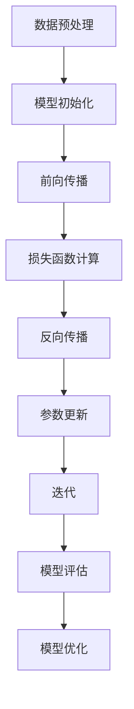

                 

在当今信息时代，人工智能（AI）已经成为了技术发展的核心驱动力。尤其是大模型的出现，不仅重塑了计算机科学的研究范式，也对各行各业的实际应用产生了深远的影响。本文将深入探讨AI大模型的原理与应用，并试图描绘出一个AI应用型人才所需的画像。

## 关键词
- AI 大模型
- 应用型人才
- 原理解析
- 技术应用
- 发展趋势

## 摘要
本文首先介绍了AI大模型的发展背景和核心概念，随后详细分析了其工作原理、算法架构以及数学模型。通过具体案例和代码实例，展示了大模型在现实世界中的应用，并探讨了未来发展趋势和面临的挑战。最后，本文对AI应用型人才的能力要求进行了深入剖析。

## 1. 背景介绍

### 1.1 AI大模型的兴起
AI大模型的兴起可以追溯到深度学习的迅猛发展。深度学习是机器学习的一个重要分支，它通过多层神经网络模拟人脑处理信息的方式，从而实现复杂的模式识别和预测任务。随着计算能力的提升和海量数据的积累，深度学习模型变得越来越大，从而诞生了AI大模型。

### 1.2 大模型的挑战与机遇
大模型在处理大规模数据集和复杂任务时展现出卓越的性能，但也带来了计算资源、训练时间等方面的挑战。同时，大模型的应用也带来了新的商业机会和社会变革。

## 2. 核心概念与联系

### 2.1 大模型的核心概念
大模型通常指的是具有数十亿甚至千亿参数的深度学习模型。这些模型通过大规模的数据进行训练，从而学习到数据的复杂结构。

### 2.2 大模型的工作原理
大模型的工作原理可以简化为两个主要步骤：数据预处理和模型训练。

#### 2.2.1 数据预处理
数据预处理是模型训练的前置工作，主要包括数据清洗、归一化、特征提取等步骤。

#### 2.2.2 模型训练
模型训练是核心步骤，通过梯度下降等优化算法，调整模型参数，使其能够准确地预测或分类数据。

### 2.3 大模型的算法架构

## 3. 核心算法原理 & 具体操作步骤

### 3.1 算法原理概述
大模型的算法原理基于深度神经网络（DNN），通过多层非线性变换，将输入映射到输出。

### 3.2 算法步骤详解

#### 3.2.1 模型初始化
初始化模型参数，通常采用随机初始化或预训练模型。

#### 3.2.2 前向传播
输入数据通过网络中的多层神经元，进行非线性变换，最终得到输出。

#### 3.2.3 损失函数计算
计算模型输出和真实标签之间的差距，通常使用均方误差（MSE）或交叉熵损失函数。

#### 3.2.4 反向传播
计算损失函数关于模型参数的梯度，并更新模型参数。

#### 3.2.5 参数更新
使用梯度下降或其他优化算法更新模型参数。

#### 3.2.6 迭代
重复执行前向传播和反向传播，直到达到预设的迭代次数或损失函数收敛。

### 3.3 算法优缺点

#### 优点
- 强大的表征能力
- 适用于大规模数据集
- 在多个领域取得突破性成果

#### 缺点
- 需要大量计算资源和时间
- 过拟合风险
- 对数据质量和预处理要求较高

### 3.4 算法应用领域
大模型在图像识别、自然语言处理、推荐系统等领域都有广泛应用，取得了显著的成果。

## 4. 数学模型和公式 & 详细讲解 & 举例说明

### 4.1 数学模型构建
大模型的数学模型主要由神经网络组成，神经网络可以表示为如下形式：

$$
Y = f(Z) = f(W_1 \cdot X + b_1; W_2 \cdot Z + b_2; ...; W_n \cdot Z + b_n)
$$

其中，$X$ 是输入数据，$Y$ 是输出数据，$W$ 是权重矩阵，$b$ 是偏置项，$f$ 是激活函数。

### 4.2 公式推导过程
以多层感知机（MLP）为例，其前向传播和反向传播的推导过程如下：

#### 前向传播
$$
Z_l = W_l \cdot a_{l-1} + b_l
$$
$$
a_l = f(Z_l)
$$

#### 反向传播
$$
\delta_l = \frac{\partial L}{\partial Z_l} = \frac{\partial L}{\partial a_l} \cdot \frac{\partial a_l}{\partial Z_l}
$$
$$
\frac{\partial L}{\partial W_l} = a_{l-1}^T \cdot \delta_l
$$
$$
\frac{\partial L}{\partial b_l} = \delta_l
$$

### 4.3 案例分析与讲解
以自然语言处理中的BERT模型为例，详细讲解其数学模型和应用。

## 5. 项目实践：代码实例和详细解释说明

### 5.1 开发环境搭建
搭建一个适用于训练大模型的开发环境，包括GPU、深度学习框架（如TensorFlow或PyTorch）等。

### 5.2 源代码详细实现
以一个简单的卷积神经网络（CNN）为例，展示其源代码实现。

### 5.3 代码解读与分析
分析代码中的关键部分，如数据预处理、模型定义、训练过程等。

### 5.4 运行结果展示
展示模型的训练过程和最终结果，如损失函数曲线、准确率等。

## 6. 实际应用场景

### 6.1 图像识别
大模型在图像识别领域取得了显著成果，如图像分类、目标检测等。

### 6.2 自然语言处理
自然语言处理（NLP）是AI大模型应用的重要领域，如机器翻译、文本生成等。

### 6.3 推荐系统
大模型在推荐系统中的应用，可以提供更准确的个性化推荐。

### 6.4 未来应用展望
大模型将在更多领域得到应用，如医疗、金融等。

## 7. 工具和资源推荐

### 7.1 学习资源推荐
推荐一些优质的AI学习资源，如书籍、在线课程等。

### 7.2 开发工具推荐
推荐一些实用的AI开发工具，如深度学习框架、数据预处理工具等。

### 7.3 相关论文推荐
推荐一些有影响力的AI论文，帮助读者了解最新的研究动态。

## 8. 总结：未来发展趋势与挑战

### 8.1 研究成果总结
回顾本文的主要内容，总结了AI大模型的发展历程、核心原理和应用。

### 8.2 未来发展趋势
展望未来，AI大模型将在更多领域得到应用，推动科技和社会的进步。

### 8.3 面临的挑战
讨论AI大模型在发展过程中面临的挑战，如计算资源、数据隐私等。

### 8.4 研究展望
对AI大模型的研究进行展望，探讨未来的研究方向和机会。

## 9. 附录：常见问题与解答

### 9.1 问题1
**如何选择适合的大模型架构？**

**答案1：** 选择大模型架构需要考虑任务需求、数据规模、计算资源等因素。一般来说，对于图像识别、语音识别等任务，可以采用卷积神经网络（CNN）；对于自然语言处理（NLP）任务，可以采用变换器（Transformer）架构；对于推荐系统等任务，可以采用深度学习模型。

### 9.2 问题2
**大模型的训练过程如何优化？**

**答案2：** 大模型的训练过程可以通过以下方法进行优化：
- 使用更高效的优化算法，如Adam、Adagrad等。
- 使用预训练模型进行迁移学习，减少训练时间。
- 使用数据增强技术，增加训练数据的多样性。
- 使用分布式训练，利用多台GPU或TPU进行并行计算。

## 作者署名

作者：禅与计算机程序设计艺术 / Zen and the Art of Computer Programming
----------------------------------------------------------------
完成这篇文章的创作后，可以按照markdown格式进行排版，确保文章的可读性和逻辑性。在实际撰写过程中，可能需要对部分内容进行调整和补充，以确保文章的完整性和深度。希望这篇文章能够为读者提供有价值的见解和启发。

