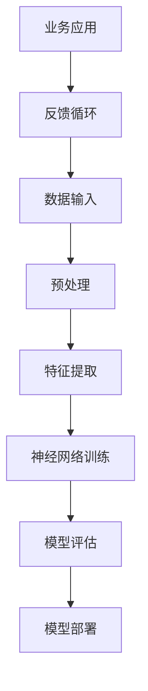

                 

关键词：AI大模型、商业模式、深度学习、神经网络、数据驱动、规模化、经济效益

> 摘要：本文探讨了人工智能（AI）领域的大模型原理及其在实际应用中的商业模式。通过对大模型的技术背景、核心算法、数学模型、项目实践等方面进行深入分析，探讨了大规模AI模型的商业化前景及其面临的挑战。

## 1. 背景介绍

近年来，随着计算能力的提升、算法的进步以及数据资源的丰富，人工智能（AI）领域的研究和应用取得了飞速发展。尤其是深度学习（Deep Learning）技术的突破，使得神经网络（Neural Networks）在大规模数据处理和模式识别方面表现出卓越的性能。这一趋势催生了大量基于深度学习的大模型，如GPT、BERT、ViT等，它们在自然语言处理、计算机视觉、推荐系统等领域展现出了强大的能力。

在商业领域，大模型的引入带来了显著的经济效益。一方面，大模型能够提高业务效率和准确性；另一方面，它们也成为了企业竞争的新利器。然而，大模型的开发和维护成本极高，这引发了一个重要问题：大模型是否是一个好的商业模式？

本文将围绕这个问题，深入探讨大模型的原理、技术实现、商业模式及其面临的挑战。

## 2. 核心概念与联系

为了更好地理解大模型的工作原理，我们需要介绍一些核心概念和它们之间的关系。以下是使用Mermaid绘制的流程图，展示了大模型中的关键组件和其相互关系。



### 2.1 数据输入与预处理

数据输入是整个流程的起点。原始数据可能包含噪声、异常值和冗余信息，因此需要进行预处理。预处理步骤通常包括数据清洗、归一化、数据增强等，以确保数据质量。

### 2.2 特征提取

预处理后的数据通过特征提取层转化为神经网络能够处理的格式。这一层通常由卷积层、池化层、全连接层等组成，能够提取出数据的有用特征。

### 2.3 神经网络训练

特征提取层将数据传递给神经网络，神经网络通过训练学习数据中的模式和规律。训练过程涉及前向传播、反向传播和梯度下降等步骤，最终训练出一个具有较高预测能力的模型。

### 2.4 模型评估

训练完成后，需要对模型进行评估，以确保其具备良好的泛化能力。评估方法包括准确率、召回率、F1分数等指标，可以通过交叉验证、网格搜索等技术进行优化。

### 2.5 模型部署

评估通过后的模型可以部署到生产环境中，用于实际的业务应用。部署过程通常涉及模型的序列化、容器化、分布式计算等技术。

### 2.6 业务应用与反馈循环

部署后的模型会应用到具体的业务场景中，如语音识别、图像分类、自然语言处理等。通过收集用户反馈，模型可以不断优化和更新，形成一个反馈循环，提高业务效率和用户体验。

## 3. 核心算法原理 & 具体操作步骤

### 3.1 算法原理概述

大模型的核心算法是基于深度学习的神经网络。神经网络通过模拟人脑神经元的工作方式，对输入数据进行多层处理和抽象，从而实现复杂的非线性映射。以下是神经网络的基本原理：

- **前向传播**：输入数据通过神经网络的各个层，每层都会对数据进行加权和激活函数的处理，最终得到输出。
- **反向传播**：通过计算输出与目标之间的误差，反向传播误差到网络的每一层，更新权重和偏置。
- **优化算法**：如梯度下降、Adam、RMSProp等，用于调整网络参数，优化模型性能。

### 3.2 算法步骤详解

1. **数据集准备**：选择适合业务场景的数据集，对数据进行预处理和划分。
2. **网络架构设计**：根据任务需求设计神经网络的结构，包括层数、每层的神经元数量、激活函数等。
3. **模型训练**：使用训练数据对模型进行迭代训练，调整网络参数，优化模型性能。
4. **模型评估**：使用验证集和测试集对模型进行评估，选择性能最佳的模型。
5. **模型部署**：将模型部署到生产环境中，进行实际业务应用。

### 3.3 算法优缺点

**优点**：

- **强大的表达能力和泛化能力**：神经网络能够处理复杂的数据和任务，具备良好的泛化能力。
- **自适应性**：通过训练，神经网络能够不断优化和适应新的数据。

**缺点**：

- **计算资源消耗大**：大模型通常需要大量的计算资源和存储空间。
- **训练时间长**：大规模数据的训练过程可能需要较长时间。

### 3.4 算法应用领域

- **自然语言处理**：如文本分类、情感分析、机器翻译等。
- **计算机视觉**：如图像分类、目标检测、图像生成等。
- **推荐系统**：如商品推荐、新闻推荐、社交网络推荐等。
- **语音识别**：如语音合成、语音翻译等。

## 4. 数学模型和公式 & 详细讲解 & 举例说明

### 4.1 数学模型构建

神经网络的核心是前向传播和反向传播，以下是一个简单的全连接神经网络（FCNN）的数学模型。

**前向传播**：

$$
Z^{[l]} = \sigma(W^{[l]} \cdot A^{[l-1]} + b^{[l]})
$$

$$
A^{[l]} = \sigma(Z^{[l]})
$$

其中，\(Z^{[l]}\) 是第 \(l\) 层的激活值，\(\sigma\) 是激活函数，\(W^{[l]}\) 和 \(b^{[l]}\) 分别是第 \(l\) 层的权重和偏置。

**反向传播**：

$$
\delta^{[l]} = \frac{\partial J}{\partial Z^{[l]}}
$$

$$
\frac{\partial J}{\partial W^{[l]}} = A^{[l-1]} \cdot \delta^{[l]}
$$

$$
\frac{\partial J}{\partial b^{[l]}} = \delta^{[l]}
$$

其中，\(\delta^{[l]}\) 是第 \(l\) 层的误差梯度，\(J\) 是损失函数。

### 4.2 公式推导过程

假设我们有 \(n\) 个样本的数据集，每个样本由 \(m\) 个特征组成，目标值是 \(y\)。神经网络的输出为 \(y'\)，损失函数为 \(J\)。

1. **损失函数**：

   $$ J = \frac{1}{2} \sum_{i=1}^{n} (y_i - y'_i)^2 $$

2. **前向传播**：

   神经网络的输出可以通过以下公式计算：

   $$ y'_i = \sigma(z_i) $$

   其中，\(z_i\) 是前一层输出的加权和。

3. **反向传播**：

   根据损失函数的梯度，可以计算出每一层的误差梯度：

   $$ \delta^{[l]} = \frac{\partial J}{\partial Z^{[l]}} = (A^{[l]} - y) \cdot \sigma'(Z^{[l]}) $$

   其中，\(\sigma'(Z^{[l]})\) 是激活函数的导数。

### 4.3 案例分析与讲解

假设我们有一个简单的神经网络，用于对数字进行分类，数据集包含 0 和 1 两个类别。网络的输入层有 2 个神经元，隐藏层有 3 个神经元，输出层有 1 个神经元。激活函数使用 \( \sigma(x) = \frac{1}{1 + e^{-x}} \)。

1. **数据集**：

   $$ X = \begin{bmatrix} 0 & 0 \\ 0 & 1 \\ 1 & 0 \\ 1 & 1 \end{bmatrix} $$
   $$ y = \begin{bmatrix} 0 \\ 0 \\ 0 \\ 1 \end{bmatrix} $$

2. **网络参数**：

   $$ W^{[1]} = \begin{bmatrix} w_{11} & w_{12} \\ w_{21} & w_{22} \\ w_{31} & w_{32} \end{bmatrix} $$
   $$ b^{[1]} = \begin{bmatrix} b_{1} \\ b_{2} \\ b_{3} \end{bmatrix} $$
   $$ W^{[2]} = \begin{bmatrix} w_{11} & w_{12} \end{bmatrix} $$
   $$ b^{[2]} = \begin{bmatrix} b_{2} \end{bmatrix} $$

3. **前向传播**：

   $$ Z^{[1]} = \begin{bmatrix} z_{11} & z_{12} \\ z_{21} & z_{22} \\ z_{31} & z_{32} \end{bmatrix} = \begin{bmatrix} w_{11} \cdot x_{1} + b_{1} & w_{12} \cdot x_{2} + b_{2} \\ w_{21} \cdot x_{1} + b_{1} & w_{22} \cdot x_{2} + b_{2} \\ w_{31} \cdot x_{1} + b_{1} & w_{32} \cdot x_{2} + b_{2} \end{bmatrix} $$
   $$ A^{[1]} = \begin{bmatrix} a_{11} & a_{12} \\ a_{21} & a_{22} \\ a_{31} & a_{32} \end{bmatrix} = \sigma(Z^{[1]}) $$
   $$ Z^{[2]} = \begin{bmatrix} z_{21} & z_{22} \end{bmatrix} = \begin{bmatrix} w_{11} \cdot a_{11} + b_{2} & w_{12} \cdot a_{12} + b_{2} \end{bmatrix} $$
   $$ A^{[2]} = \begin{bmatrix} a_{21} \end{bmatrix} = \sigma(Z^{[2]}) $$

4. **反向传播**：

   $$ \delta^{[2]} = \begin{bmatrix} \frac{\partial J}{\partial z_{21}} & \frac{\partial J}{\partial z_{22}} \end{bmatrix} $$
   $$ \frac{\partial J}{\partial z_{21}} = a_{21} - y $$
   $$ \frac{\partial J}{\partial z_{22}} = a_{21} - y $$
   $$ \delta^{[2]} = \begin{bmatrix} a_{21} - y \\ a_{21} - y \end{bmatrix} $$
   $$ \frac{\partial J}{\partial W^{[2]}} = \begin{bmatrix} a_{11} & a_{12} \end{bmatrix} \cdot \delta^{[2]} $$
   $$ \frac{\partial J}{\partial b^{[2]}} = \delta^{[2]} $$
   $$ \frac{\partial J}{\partial W^{[1]}} = X \cdot \delta^{[2]} $$
   $$ \frac{\partial J}{\partial b^{[1]}} = \delta^{[2]} $$

通过上述过程，我们可以计算出每一层的误差梯度，并使用优化算法更新网络参数。

## 5. 项目实践：代码实例和详细解释说明

### 5.1 开发环境搭建

为了实践大模型的构建，我们需要搭建一个合适的开发环境。以下是一个基于Python的示例，使用TensorFlow库构建一个简单的神经网络。

1. **安装Python**：确保安装了Python 3.6及以上版本。
2. **安装TensorFlow**：使用pip命令安装TensorFlow。

   ```bash
   pip install tensorflow
   ```

### 5.2 源代码详细实现

以下是一个简单的神经网络实现，用于对数字进行分类。

```python
import tensorflow as tf
import numpy as np

# 定义神经网络结构
inputs = tf.keras.Input(shape=(2,))
hidden = tf.keras.layers.Dense(3, activation='sigmoid')(inputs)
outputs = tf.keras.layers.Dense(1, activation='sigmoid')(hidden)

model = tf.keras.Model(inputs=inputs, outputs=outputs)

# 编译模型
model.compile(optimizer='adam', loss='binary_crossentropy', metrics=['accuracy'])

# 准备数据集
X = np.array([[0, 0], [0, 1], [1, 0], [1, 1]])
y = np.array([[0], [0], [0], [1]])

# 训练模型
model.fit(X, y, epochs=1000)

# 预测
predictions = model.predict(X)
print(predictions)
```

### 5.3 代码解读与分析

- **定义神经网络结构**：使用`tf.keras.Input`定义输入层，`tf.keras.layers.Dense`定义隐藏层和输出层，其中`activation`参数指定激活函数。
- **编译模型**：使用`compile`方法配置模型，指定优化器、损失函数和评估指标。
- **准备数据集**：使用NumPy生成训练数据集，并转换为TensorFlow的张量格式。
- **训练模型**：使用`fit`方法进行训练，指定训练轮数（epochs）。
- **预测**：使用`predict`方法对输入数据进行预测，并输出结果。

### 5.4 运行结果展示

运行上述代码，可以看到模型在训练过程中逐步优化，最终达到较高的准确率。预测结果展示了模型对输入数据的分类能力。

## 6. 实际应用场景

### 6.1 自然语言处理

自然语言处理（NLP）是深度学习的重要应用领域之一。大模型如GPT、BERT等在文本分类、问答系统、机器翻译等方面取得了显著成果。例如，Google的BERT模型在多个NLP任务中刷新了SOTA（State-of-the-Art）记录，为搜索引擎、智能客服等应用提供了强大的技术支持。

### 6.2 计算机视觉

计算机视觉（CV）是另一个受益于大模型的重要领域。例如，深度学习技术在图像分类、目标检测、图像生成等方面取得了巨大突破。OpenAI的DALL-E 2模型能够根据文本描述生成高质量的图像，为创意设计和内容生成带来了新的可能性。

### 6.3 推荐系统

推荐系统是深度学习在商业领域的重要应用之一。大模型能够处理大规模的用户行为数据，提供个性化的推荐服务。例如，Netflix和Amazon等公司使用深度学习技术为用户提供个性化的电影和商品推荐，提高了用户满意度和转化率。

### 6.4 语音识别

语音识别是深度学习在人工智能领域的重要应用之一。大模型如Google的WaveNet在语音合成和语音识别方面取得了显著成果。这些模型能够实现高准确率的语音识别，为智能语音助手、智能家居等应用提供了关键技术支持。

## 7. 工具和资源推荐

### 7.1 学习资源推荐

- **书籍**：《深度学习》（Goodfellow, Bengio, Courville）是深度学习的经典教材，详细介绍了神经网络的基本原理和应用。
- **在线课程**：斯坦福大学的CS231n和CS224n课程是深度学习在计算机视觉和自然语言处理方面的权威课程。
- **论文**：阅读顶级会议和期刊上的论文，如NeurIPS、ICLR、ACL、CVPR等，了解最新研究成果和前沿技术。

### 7.2 开发工具推荐

- **TensorFlow**：由Google开发的开源深度学习框架，支持多种神经网络结构和硬件加速。
- **PyTorch**：由Facebook开发的开源深度学习框架，具有简洁的API和强大的动态计算能力。
- **Keras**：基于TensorFlow和Theano的开源深度学习高级API，简化了神经网络构建和训练过程。

### 7.3 相关论文推荐

- **GPT系列**：OpenAI提出的大规模预训练语言模型，包括GPT、GPT-2和GPT-3等。
- **BERT**：Google提出的大规模预训练语言模型，广泛应用于自然语言处理任务。
- **DALL-E 2**：OpenAI提出的大规模图像生成模型，基于文本描述生成高质量图像。

## 8. 总结：未来发展趋势与挑战

### 8.1 研究成果总结

大模型在过去几年中取得了显著成果，推动了人工智能技术的快速发展。深度学习算法的进步、计算能力的提升和海量数据资源的积累为大规模模型的训练和应用提供了有力支持。

### 8.2 未来发展趋势

- **模型规模和性能**：未来大模型的规模和性能将继续提升，更多的资源和算法创新将推动这一趋势。
- **泛化能力**：提升大模型的泛化能力是未来的重要研究方向，通过改进训练方法、模型结构等手段，使模型能够更好地适应不同的任务和数据集。
- **多模态学习**：多模态学习是未来深度学习的重要方向，结合图像、文本、语音等多种数据源，实现更丰富的信息理解和推理。

### 8.3 面临的挑战

- **计算资源消耗**：大模型的训练和推理过程需要大量的计算资源和存储空间，这对硬件设备和数据中心提出了更高要求。
- **数据隐私和安全**：大规模数据的处理和应用引发了数据隐私和安全问题，需要制定相应的政策和法规来保护用户隐私。
- **算法透明性和可解释性**：大模型的复杂性和黑盒特性使得其决策过程难以解释，需要研究算法的透明性和可解释性，提高模型的可信度。

### 8.4 研究展望

未来，大模型将继续在人工智能领域发挥重要作用。通过技术创新和跨学科合作，有望实现更高效、更安全的深度学习模型，为各行各业带来更多创新和应用。

## 9. 附录：常见问题与解答

### Q：大模型是否一定需要大规模数据集？

A：并非所有大模型都需要大规模数据集。虽然大规模数据集能够提高模型的泛化能力，但某些任务（如医疗诊断、法律文本分析）可能因为数据隐私等原因难以获取大量数据。在这种情况下，可以通过数据增强、迁移学习等方法来提高模型性能。

### Q：大模型的计算资源需求如何？

A：大模型的训练和推理通常需要大量的计算资源和存储空间。对于训练过程，GPU和TPU等专用硬件能够显著提高计算效率。对于推理过程，需要考虑模型的并发处理能力和响应时间。

### Q：大模型是否会影响算法的公平性和可解释性？

A：大模型可能会引入算法的公平性和可解释性问题。尽管可以通过改进模型设计和训练策略来缓解这些问题，但仍然需要持续关注和评估，以确保算法的公平性和透明性。

## 结尾

大模型作为人工智能领域的重要研究方向，其商业前景广阔，但也面临诸多挑战。通过技术创新和跨学科合作，有望推动大模型的发展，为人工智能领域带来更多突破和进步。作者：禅与计算机程序设计艺术 / Zen and the Art of Computer Programming。

