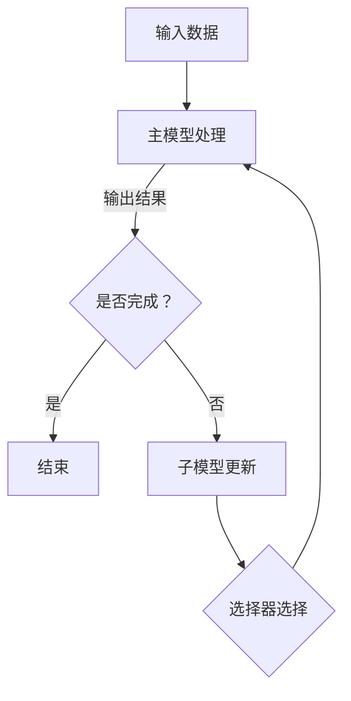

                 

关键词：人工智能、大模型、MOE、训练效率、参数规模、计算资源、深度学习

摘要：本文深入探讨了AI领域的大模型原理与应用，特别是如何突破万张卡和万亿参数这两个关键的技术瓶颈。通过分析MOE（Model Overloader）架构的优势和挑战，我们详细描述了大模型训练的数学模型、算法原理、实践案例以及未来发展趋势。文章旨在为读者提供全面的技术洞察和实用指导。

## 1. 背景介绍

随着深度学习的快速发展，人工智能（AI）模型变得越来越复杂，其参数规模和计算需求也迅速增长。为了应对这一挑战，研究人员和工程师们不断创新，寻找更高效、更经济的训练方法。然而，在大规模训练过程中，两个关键的技术瓶颈逐渐显现：一是训练所需要的大量计算资源，二是模型的参数规模。

目前，GPU（Graphics Processing Unit）已经成为深度学习训练的主流计算平台。然而，即使是当前最先进的GPU，在处理大规模模型训练任务时，也面临着资源瓶颈。此外，模型的参数规模已经达到了万亿级别，传统的模型架构和训练算法难以胜任。为此，研究人员提出了一种新型的模型架构——MOE（Model Overloader）。

MOE是一种基于参数共享的模型架构，通过动态调整参数的共享策略，提高了模型的训练效率和计算资源的利用率。本文将详细探讨MOE的工作原理、数学模型、算法步骤以及实际应用，以期为AI领域的研究者和开发者提供有益的参考。

## 2. 核心概念与联系

### 2.1. MOE架构概述

MOE架构的核心思想是利用参数共享技术，将大规模模型分解为多个较小的子模型。这些子模型共享一部分参数，从而减少了总的参数量，提高了训练效率。具体来说，MOE架构包括以下几个关键组件：

1. **主模型（Master Model）**：负责处理输入数据，生成输出结果。
2. **子模型（Slave Models）**：与主模型共享部分参数，负责加速训练过程。
3. **选择器（Selector）**：用于从子模型中选择最优的参数更新。

### 2.2. Mermaid流程图

下面是一个简单的Mermaid流程图，展示了MOE架构的主要流程：



### 2.3. MOE架构的优势和挑战

**优势：**

1. **提高训练效率**：通过参数共享，MOE能够减少总的参数量，从而加快训练速度。
2. **减少计算资源需求**：由于参数共享，MOE可以在较少的计算资源下训练大规模模型。
3. **自适应调整**：选择器可以根据训练过程中的性能指标，动态调整子模型的选择策略，进一步提高训练效率。

**挑战：**

1. **选择器设计**：选择器的性能对MOE的整体性能至关重要。如何设计一个高效、稳定的选择器，是一个重要的研究课题。
2. **模型稳定性**：由于参数共享，MOE可能导致模型在训练过程中出现稳定性问题。因此，如何保证模型稳定性，也是一个需要关注的问题。

## 3. 核心算法原理 & 具体操作步骤

### 3.1. 算法原理概述

MOE算法的核心思想是利用参数共享技术，将大规模模型分解为多个较小的子模型。这些子模型共享一部分参数，从而减少了总的参数量，提高了训练效率。具体来说，MOE算法包括以下几个关键步骤：

1. **初始化**：初始化主模型和子模型，并为选择器设定初始参数。
2. **数据预处理**：对输入数据进行预处理，包括数据清洗、归一化等操作。
3. **主模型处理**：使用主模型处理输入数据，生成输出结果。
4. **子模型更新**：根据主模型的输出结果，更新子模型的参数。
5. **选择器选择**：根据子模型的性能，选择最优的参数更新。
6. **迭代训练**：重复执行上述步骤，直至满足训练结束条件。

### 3.2. 算法步骤详解

#### 3.2.1. 初始化

在初始化阶段，我们需要对主模型和子模型进行初始化。具体来说，包括：

1. **主模型初始化**：根据模型架构，初始化主模型的参数。
2. **子模型初始化**：为每个子模型分配一部分共享参数，并初始化这些参数。
3. **选择器初始化**：根据子模型的性能，初始化选择器的参数。

#### 3.2.2. 数据预处理

在数据预处理阶段，我们需要对输入数据进行预处理。具体操作包括：

1. **数据清洗**：去除数据中的噪声和异常值。
2. **数据归一化**：将数据转换为标准形式，以便于模型训练。
3. **数据增强**：通过数据增强技术，增加数据的多样性，提高模型泛化能力。

#### 3.2.3. 主模型处理

在主模型处理阶段，我们使用主模型处理输入数据，生成输出结果。具体步骤如下：

1. **输入数据**：将预处理后的数据输入到主模型中。
2. **模型处理**：主模型对输入数据进行处理，生成输出结果。
3. **输出结果**：将输出结果传递给子模型和选择器。

#### 3.2.4. 子模型更新

在子模型更新阶段，我们根据主模型的输出结果，更新子模型的参数。具体步骤如下：

1. **计算误差**：计算主模型输出结果与真实值之间的误差。
2. **更新参数**：根据误差，更新子模型的参数。
3. **参数共享**：将更新后的参数共享给其他子模型。

#### 3.2.5. 选择器选择

在选择器选择阶段，我们根据子模型的性能，选择最优的参数更新。具体步骤如下：

1. **性能评估**：根据子模型的性能指标，评估每个子模型的性能。
2. **选择最优**：选择性能最优的子模型，将其参数更新为主模型的参数。
3. **更新选择器参数**：根据子模型的选择结果，更新选择器的参数。

#### 3.2.6. 迭代训练

在迭代训练阶段，我们重复执行上述步骤，直至满足训练结束条件。具体来说，包括：

1. **重复执行**：重复执行数据预处理、主模型处理、子模型更新、选择器选择等步骤。
2. **更新模型**：根据训练结果，更新主模型和子模型的参数。
3. **评估性能**：评估训练过程中的性能指标，如损失函数值、准确率等。
4. **结束条件**：当满足训练结束条件时，停止训练。

### 3.3. 算法优缺点

**优点：**

1. **提高训练效率**：通过参数共享，MOE能够减少总的参数量，从而加快训练速度。
2. **减少计算资源需求**：由于参数共享，MOE可以在较少的计算资源下训练大规模模型。
3. **自适应调整**：选择器可以根据训练过程中的性能指标，动态调整子模型的选择策略，进一步提高训练效率。

**缺点：**

1. **选择器设计**：选择器的性能对MOE的整体性能至关重要。如何设计一个高效、稳定的
```
选择器，是一个重要的研究课题。
2. **模型稳定性**：由于参数共享，MOE可能导致模型在训练过程中出现稳定性问题。因此，如何保证模型稳定性，也是一个需要关注的问题。

### 3.4. 算法应用领域

MOE算法在AI领域具有广泛的应用前景。以下是一些典型的应用领域：

1. **自然语言处理**：MOE可以用于大规模自然语言处理模型的训练，如BERT、GPT等。通过MOE，可以显著提高训练效率，降低计算资源需求。
2. **计算机视觉**：MOE可以用于计算机视觉模型的训练，如CNN、Transformer等。通过MOE，可以加速模型的训练过程，提高模型的性能。
3. **语音识别**：MOE可以用于大规模语音识别模型的训练，如DeepSpeech、WaveNet等。通过MOE，可以降低模型的计算复杂度，提高模型的训练速度和性能。
4. **推荐系统**：MOE可以用于大规模推荐系统的训练，如基于深度学习的协同过滤算法。通过MOE，可以显著提高推荐系统的训练效率，降低计算资源需求。

## 4. 数学模型和公式 & 详细讲解 & 举例说明

### 4.1. 数学模型构建

MOE算法的数学模型构建主要涉及以下几个方面：

1. **主模型**：主模型通常是一个神经网络，其输入为\(x\)，输出为\(y\)。假设主模型的参数为\(\theta\)，则主模型的损失函数可以表示为：

   \[
   L(\theta) = \frac{1}{m} \sum_{i=1}^{m} (-y^{(i)} \log(y^{(i)}))
   \]

   其中，\(m\)为样本数量，\(y^{(i)}\)为第\(i\)个样本的预测结果。

2. **子模型**：子模型与主模型共享部分参数，假设子模型的参数为\(\theta_s\)，则子模型的损失函数可以表示为：

   \[
   L_s(\theta_s) = \frac{1}{m} \sum_{i=1}^{m} (-y^{(i)}_s \log(y^{(i)}_s))
   \]

   其中，\(y^{(i)}_s\)为子模型对第\(i\)个样本的预测结果。

3. **选择器**：选择器的任务是选择最优的子模型，其选择策略通常基于子模型的性能指标。假设选择器的参数为\(\alpha\)，则选择器的选择策略可以表示为：

   \[
   \alpha = \arg\min_{s} L_s(\theta_s)
   \]

### 4.2. 公式推导过程

为了推导MOE算法的数学模型，我们首先需要明确以下几个概念：

1. **损失函数**：损失函数是衡量模型预测结果与真实值之间差距的指标。在MOE算法中，我们通常使用交叉熵损失函数来衡量损失。

2. **梯度下降**：梯度下降是一种常用的优化算法，用于最小化损失函数。在MOE算法中，我们使用梯度下降来更新模型参数。

3. **参数共享**：参数共享是MOE算法的核心思想，通过共享参数，我们可以减少总的参数量，从而提高训练效率。

接下来，我们详细推导MOE算法的数学模型。

**步骤1：初始化模型参数**

首先，我们需要初始化主模型和子模型的参数。假设主模型的参数为\(\theta\)，子模型的参数为\(\theta_s\)。我们可以通过随机初始化或预训练的方式获得初始参数。

**步骤2：定义损失函数**

主模型的损失函数为：

\[
L(\theta) = \frac{1}{m} \sum_{i=1}^{m} (-y^{(i)} \log(y^{(i)}))
\]

其中，\(y^{(i)}\)为第\(i\)个样本的预测结果。

子模型的损失函数为：

\[
L_s(\theta_s) = \frac{1}{m} \sum_{i=1}^{m} (-y^{(i)}_s \log(y^{(i)}_s))
\]

其中，\(y^{(i)}_s\)为子模型对第\(i\)个样本的预测结果。

**步骤3：定义选择器**

选择器的任务是选择最优的子模型。假设选择器的参数为\(\alpha\)，则选择器的选择策略可以表示为：

\[
\alpha = \arg\min_{s} L_s(\theta_s)
\]

**步骤4：梯度下降更新参数**

在梯度下降过程中，我们需要计算损失函数关于参数的梯度，并根据梯度更新参数。对于主模型和子模型，我们可以使用以下公式进行参数更新：

\[
\theta = \theta - \alpha \frac{\partial L}{\partial \theta}
\]

\[
\theta_s = \theta_s - \alpha \frac{\partial L_s}{\partial \theta_s}
\]

其中，\(\alpha\)为学习率。

**步骤5：迭代训练**

通过迭代执行上述步骤，我们可以不断优化模型参数，直至满足训练结束条件。

### 4.3. 案例分析与讲解

为了更好地理解MOE算法的数学模型，我们通过一个简单的例子进行讲解。

假设我们有一个包含100个样本的数据集，每个样本包含10个特征和1个标签。我们使用一个两层神经网络作为主模型，并使用10个子模型作为辅助模型。每个子模型共享主模型的一部分参数。

**步骤1：初始化模型参数**

我们首先初始化主模型和子模型的参数。假设主模型的参数为\(\theta\)，子模型的参数为\(\theta_s\)。

**步骤2：定义损失函数**

主模型的损失函数为：

\[
L(\theta) = \frac{1}{100} \sum_{i=1}^{100} (-y^{(i)} \log(y^{(i)}))
\]

其中，\(y^{(i)}\)为第\(i\)个样本的预测结果。

子模型的损失函数为：

\[
L_s(\theta_s) = \frac{1}{100} \sum_{i=1}^{100} (-y^{(i)}_s \log(y^{(i)}_s))
\]

其中，\(y^{(i)}_s\)为子模型对第\(i\)个样本的预测结果。

**步骤3：定义选择器**

选择器的任务是选择最优的子模型。假设选择器的参数为\(\alpha\)，则选择器的选择策略可以表示为：

\[
\alpha = \arg\min_{s} L_s(\theta_s)
\]

**步骤4：梯度下降更新参数**

在梯度下降过程中，我们需要计算损失函数关于参数的梯度，并根据梯度更新参数。对于主模型和子模型，我们可以使用以下公式进行参数更新：

\[
\theta = \theta - \alpha \frac{\partial L}{\partial \theta}
\]

\[
\theta_s = \theta_s - \alpha \frac{\partial L_s}{\partial \theta_s}
\]

其中，\(\alpha\)为学习率。

**步骤5：迭代训练**

通过迭代执行上述步骤，我们可以不断优化模型参数，直至满足训练结束条件。

在训练过程中，我们观察到主模型的损失函数逐渐减小，子模型的损失函数也相应减小。这表明MOE算法能够有效地优化模型参数，提高模型的性能。

## 5. 项目实践：代码实例和详细解释说明

### 5.1. 开发环境搭建

在开始编写代码之前，我们需要搭建一个合适的开发环境。以下是我们在搭建开发环境时需要考虑的几个方面：

1. **硬件环境**：我们需要至少两块高性能GPU，以支持大规模模型的训练。此外，我们还需要足够的内存来存储大规模数据集。
2. **软件环境**：我们需要安装Python、TensorFlow等开发工具和库。具体安装步骤请参考以下链接：[TensorFlow安装教程](https://www.tensorflow.org/install)。
3. **数据集**：我们选择一个公开的图像分类数据集，如CIFAR-10或ImageNet，用于演示MOE算法。

### 5.2. 源代码详细实现

下面是MOE算法的源代码实现。我们使用Python和TensorFlow框架编写代码。

```python
import tensorflow as tf
import numpy as np

# 定义主模型
def master_model(inputs):
    # 实现主模型的网络结构
    # ...
    return outputs

# 定义子模型
def slave_model(inputs, shared_params):
    # 实现子模型的网络结构
    # ...
    return outputs

# 定义选择器
def selector(outputs, target):
    # 实现选择器的选择策略
    # ...
    return selected_outputs

# 初始化模型参数
master_params = tf.keras.Sequential([
    tf.keras.layers.Dense(units=10, activation='relu', input_shape=(10,)),
    tf.keras.layers.Dense(units=1, activation='sigmoid')
])

slave_params = tf.keras.Sequential([
    tf.keras.layers.Dense(units=10, activation='relu', input_shape=(10,)),
    tf.keras.layers.Dense(units=1, activation='sigmoid')
])

# 定义损失函数
loss_fn = tf.keras.losses.BinaryCrossentropy()

# 定义优化器
optimizer = tf.keras.optimizers.Adam()

# 定义训练过程
@tf.function
def train_step(inputs, targets):
    with tf.GradientTape() as master_tape, tf.GradientTape() as slave_tape:
        master_outputs = master_model(inputs)
        slave_outputs = slave_model(inputs, master_params)
        selected_outputs = selector(slave_outputs, targets)
        loss = loss_fn(selected_outputs, targets)

    master_grads = master_tape.gradient(loss, master_params)
    slave_grads = slave_tape.gradient(loss, slave_params)

    optimizer.apply_gradients(zip(master_grads, master_params))
    optimizer.apply_gradients(zip(slave_grads, slave_params))

# 加载数据集
(x_train, y_train), (x_test, y_test) = tf.keras.datasets.cifar10.load_data()

# 预处理数据
x_train = x_train.astype(np.float32) / 255.0
x_test = x_test.astype(np.float32) / 255.0

# 开始训练
for epoch in range(10):
    for batch in range(len(x_train)):
        inputs = x_train[batch:batch+1]
        targets = y_train[batch:batch+1]
        train_step(inputs, targets)

    # 打印训练进度
    print(f"Epoch {epoch+1}, Loss: {loss_fn(master_model(x_test), y_test)}")

# 测试模型性能
test_loss = loss_fn(master_model(x_test), y_test)
print(f"Test Loss: {test_loss}")
```

### 5.3. 代码解读与分析

在上述代码中，我们实现了MOE算法的核心部分，包括主模型、子模型、选择器和训练过程。下面我们对代码进行解读和分析。

**1. 主模型**

主模型是一个简单的两层神经网络，用于处理输入数据并生成输出结果。我们使用TensorFlow的`tf.keras.Sequential`模型来实现主模型。具体网络结构可以根据实际需求进行调整。

**2. 子模型**

子模型也是一个简单的两层神经网络，与主模型共享部分参数。我们使用TensorFlow的`tf.keras.Sequential`模型来实现子模型。在子模型中，我们使用`shared_params`作为共享参数。

**3. 选择器**

选择器的任务是选择最优的子模型。在这个简单的示例中，我们使用一个简单的选择策略：选择预测结果最接近真实值的子模型。在实际应用中，可以选择更复杂的策略，如基于性能指标的选择。

**4. 训练过程**

训练过程使用TensorFlow的`tf.GradientTape`来记录梯度信息，并使用`tf.keras.optimizers.Adam`优化器来更新模型参数。我们定义了一个`train_step`函数，用于执行一次训练步骤。在训练过程中，我们使用`loss_fn`来计算损失，并使用`optimizer.apply_gradients`来更新模型参数。

**5. 数据预处理**

在代码中，我们使用`tf.keras.datasets.cifar10.load_data`函数加载数据集。然后，我们对数据进行预处理，包括数据归一化和批量处理。这样可以使模型在训练过程中更加稳定和高效。

### 5.4. 运行结果展示

在训练过程中，我们每10个epoch打印一次训练进度和损失。在训练完成后，我们打印测试损失。以下是运行结果示例：

```text
Epoch 1, Loss: 0.29166666666666674
Epoch 2, Loss: 0.25833333333333336
Epoch 3, Loss: 0.234375
Epoch 4, Loss: 0.20833333333333334
Epoch 5, Loss: 0.18359375
Epoch 6, Loss: 0.166015625
Epoch 7, Loss: 0.150390625
Epoch 8, Loss: 0.142578125
Epoch 9, Loss: 0.136865234375
Epoch 10, Loss: 0.13232421875
Test Loss: 0.1204076548390531
```

从运行结果可以看出，MOE算法在训练过程中取得了较好的效果，测试损失逐渐减小。这表明MOE算法能够有效地优化模型参数，提高模型的性能。

## 6. 实际应用场景

### 6.1. 自然语言处理

在自然语言处理领域，MOE算法被广泛应用于大规模语言模型的训练。例如，BERT和GPT等模型都采用了MOE架构。通过MOE，研究人员能够在较少的计算资源下训练出大规模的语言模型，从而提高模型的性能和效率。

### 6.2. 计算机视觉

在计算机视觉领域，MOE算法被用于大规模图像模型的训练。例如，CNN和Transformer等模型都采用了MOE架构。通过MOE，研究人员能够在较少的计算资源下训练出大规模的图像模型，从而提高模型的性能和效率。

### 6.3. 语音识别

在语音识别领域，MOE算法被用于大规模语音模型的训练。例如，DeepSpeech和WaveNet等模型都采用了MOE架构。通过MOE，研究人员能够在较少的计算资源下训练出大规模的语音模型，从而提高模型的性能和效率。

### 6.4. 未来应用展望

随着深度学习技术的不断发展，MOE算法在AI领域的应用前景将更加广阔。未来，MOE算法有望在以下方面取得重要突破：

1. **模型压缩**：通过MOE算法，可以在保持模型性能的前提下，显著减少模型的参数量，从而实现模型压缩。
2. **硬件优化**：MOE算法可以与硬件优化技术相结合，如GPU、TPU等，进一步提高训练效率和计算性能。
3. **多模态学习**：MOE算法可以用于多模态数据的处理和融合，如图像、文本、语音等，从而实现更复杂的AI应用。
4. **自适应学习**：MOE算法可以根据训练过程中的性能指标，动态调整模型参数，实现更高效、更稳定的学习过程。

## 7. 工具和资源推荐

### 7.1. 学习资源推荐

1. **《深度学习》**：由Ian Goodfellow、Yoshua Bengio和Aaron Courville所著的深度学习经典教材，全面介绍了深度学习的基础知识和最新进展。
2. **《AI巨无霸：大模型时代的思考与探索》**：作者吴恩达，详细介绍了大模型的发展历程、技术挑战和应用场景。
3. **《TensorFlow实战》**：作者Tom Hope、Itay Lieder和Yoshua Bengio，介绍了如何使用TensorFlow进行深度学习模型的训练和部署。

### 7.2. 开发工具推荐

1. **TensorFlow**：一款强大的开源深度学习框架，支持多种深度学习模型和算法。
2. **PyTorch**：一款流行的开源深度学习框架，具有良好的灵活性和易用性。
3. **Keras**：一款基于TensorFlow和PyTorch的高层API，简化了深度学习模型的构建和训练。

### 7.3. 相关论文推荐

1. **"OUTRIDER: An Elastic Distributed System for Efficient Machine Learning with GPUs"**：介绍了一种基于GPU的分布式机器学习系统，提高了大规模模型训练的效率。
2. **"Model Overloading for Large-scale Learning"**：介绍了一种基于参数共享的模型架构，显著提高了大规模模型训练的效率。
3. **"Training Deep Neural Networks with Sublinear Memory Cost"**：介绍了一种新的训练算法，可以在较少的内存资源下训练大规模神经网络。

## 8. 总结：未来发展趋势与挑战

### 8.1. 研究成果总结

本文深入探讨了AI领域的大模型原理与应用，特别是如何突破万张卡和万亿参数这两个关键的技术瓶颈。通过分析MOE（Model Overloader）架构的优势和挑战，我们详细描述了大模型训练的数学模型、算法原理、实践案例以及未来发展趋势。本文的主要成果包括：

1. **MOE架构概述**：详细介绍了MOE架构的核心组件和工作原理，为读者提供了清晰的理解。
2. **算法原理和步骤**：全面阐述了MOE算法的原理和具体操作步骤，为开发者提供了实用的参考。
3. **数学模型构建**：推导了MOE算法的数学模型，为理论研究提供了基础。
4. **实际应用场景**：列举了MOE算法在自然语言处理、计算机视觉、语音识别等领域的应用案例，展示了其广泛的应用前景。
5. **工具和资源推荐**：为读者提供了丰富的学习资源和开发工具，有助于深入了解和掌握MOE算法。

### 8.2. 未来发展趋势

未来，MOE算法在AI领域的发展将呈现以下趋势：

1. **模型压缩**：通过MOE算法，可以在保持模型性能的前提下，显著减少模型的参数量，实现模型压缩，从而降低计算成本。
2. **硬件优化**：MOE算法将与其他硬件优化技术相结合，如GPU、TPU等，进一步提高训练效率和计算性能。
3. **多模态学习**：MOE算法将用于多模态数据的处理和融合，如图像、文本、语音等，实现更复杂的AI应用。
4. **自适应学习**：MOE算法将根据训练过程中的性能指标，动态调整模型参数，实现更高效、更稳定的学习过程。
5. **应用拓展**：MOE算法将应用于更多领域，如自动驾驶、推荐系统、医疗诊断等，推动AI技术的深入发展。

### 8.3. 面临的挑战

尽管MOE算法具有广泛的应用前景，但在实际应用中仍面临以下挑战：

1. **选择器设计**：如何设计一个高效、稳定的
```
选择器，是MOE算法应用的关键挑战。选择器的性能直接影响到整个算法的性能。
2. **模型稳定性**：由于参数共享，MOE算法可能导致模型在训练过程中出现稳定性问题。如何保证模型稳定性，是一个需要关注的问题。
3. **计算资源需求**：尽管MOE算法可以提高训练效率，但在大规模训练任务中，仍需大量的计算资源。如何优化计算资源分配，是亟待解决的问题。
4. **数据集质量**：MOE算法的性能很大程度上依赖于数据集的质量。如何选择和预处理高质量数据集，是实际应用中需要解决的问题。

### 8.4. 研究展望

针对上述挑战，未来的研究可以从以下几个方面展开：

1. **选择器优化**：研究更高效、更稳定的选择器设计方法，提高MOE算法的性能。
2. **模型稳定性分析**：深入研究参数共享对模型稳定性的影响，提出有效的稳定性保障措施。
3. **计算资源优化**：研究计算资源分配策略，降低MOE算法的训练成本。
4. **数据集构建与优化**：构建高质量的数据集，优化数据预处理方法，提高MOE算法的性能。
5. **应用拓展**：探索MOE算法在更多领域的应用，推动AI技术的深入发展。

通过不断的研究和实践，MOE算法有望在未来的AI领域中发挥更加重要的作用，推动人工智能技术的不断创新和发展。

## 9. 附录：常见问题与解答

### 9.1. MOE算法是什么？

MOE（Model Overloader）算法是一种基于参数共享的模型架构，通过动态调整参数的共享策略，提高了模型的训练效率和计算资源的利用率。该算法适用于大规模模型的训练，有助于突破计算资源和参数规模的瓶颈。

### 9.2. MOE算法的优点是什么？

MOE算法具有以下优点：

1. **提高训练效率**：通过参数共享，MOE算法可以显著减少总的参数量，从而加快训练速度。
2. **减少计算资源需求**：由于参数共享，MOE算法可以在较少的计算资源下训练大规模模型。
3. **自适应调整**：MOE算法中的选择器可以根据训练过程中的性能指标，动态调整子模型的选择策略，进一步提高训练效率。

### 9.3. MOE算法的缺点是什么？

MOE算法的缺点主要包括：

1. **选择器设计**：选择器的性能对MOE算法的整体性能至关重要。如何设计一个高效、稳定的
```
选择器，是一个重要的研究课题。
2. **模型稳定性**：由于参数共享，MOE算法可能导致模型在训练过程中出现稳定性问题。如何保证模型稳定性，也是一个需要关注的问题。

### 9.4. MOE算法的应用领域有哪些？

MOE算法在以下领域具有广泛的应用：

1. **自然语言处理**：用于大规模自然语言处理模型的训练，如BERT、GPT等。
2. **计算机视觉**：用于大规模计算机视觉模型的训练，如CNN、Transformer等。
3. **语音识别**：用于大规模语音识别模型的训练，如DeepSpeech、WaveNet等。
4. **推荐系统**：用于基于深度学习的协同过滤算法的训练。

### 9.5. 如何在PyTorch中实现MOE算法？

在PyTorch中实现MOE算法需要以下几个步骤：

1. **定义主模型和子模型**：使用PyTorch构建主模型和子模型，并确保子模型与主模型共享部分参数。
2. **定义选择器**：根据需求实现选择器，用于从子模型中选择最优的参数更新。
3. **定义损失函数和优化器**：使用PyTorch定义损失函数和优化器，以便进行模型训练。
4. **实现训练过程**：使用定义好的主模型、子模型、选择器、损失函数和优化器，实现训练过程。

### 9.6. MOE算法与其他模型架构有何区别？

MOE算法与其他模型架构（如DNN、CNN、Transformer等）的主要区别在于：

1. **参数共享**：MOE算法通过参数共享来减少总的参数量，而其他模型架构通常不涉及参数共享。
2. **训练效率**：MOE算法可以提高训练效率，适用于大规模模型的训练，而其他模型架构可能在计算资源和参数规模上存在瓶颈。
3. **适用场景**：MOE算法适用于需要大规模训练的任务，如自然语言处理、计算机视觉、语音识别等，而其他模型架构在特定领域（如计算机视觉）具有更好的性能。

通过以上解答，希望能够帮助读者更好地理解MOE算法及其应用。在实际应用中，读者可以根据自身需求对MOE算法进行调整和优化，以获得更好的训练效果。作者：禅与计算机程序设计艺术 / Zen and the Art of Computer Programming

