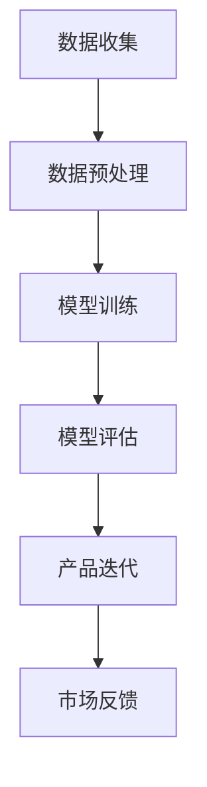

                 

关键词：AI 大模型、创业产品开发、深度学习、机器学习、人工智能、模型架构、算法优化、工程实践

> 摘要：本文将探讨 AI 大模型在创业产品开发中的关键作用。通过对大模型的原理、应用场景、工程实践等方面的深入分析，旨在为创业者提供技术决策的参考，并揭示大模型在未来创业产品开发中的重要趋势和挑战。

## 1. 背景介绍

随着人工智能技术的快速发展，深度学习、机器学习等技术在各行各业中得到了广泛应用。特别是近年来，AI 大模型（如 GPT-3、BERT、WASP 等）的出现，使得许多复杂的任务变得可行。这些大模型凭借其强大的表征能力和学习效率，成为创业产品开发中的重要工具。在本文中，我们将探讨 AI 大模型在创业产品开发中的关键作用。

## 2. 核心概念与联系

为了更好地理解 AI 大模型的作用，我们需要先了解以下几个核心概念：

### 2.1 深度学习与神经网络

深度学习是一种基于神经网络的学习方法，通过层层递进的方式提取特征，实现复杂任务。神经网络由大量的神经元（节点）和连接（边）组成，每个神经元接收来自其他神经元的输入，并产生一个输出。

### 2.2 机器学习与数据

机器学习是人工智能的一个重要分支，通过从数据中学习规律和模式，实现智能决策。数据是机器学习的核心，其质量和数量直接影响模型的效果。

### 2.3 大模型与参数规模

大模型通常具有数十亿至数千亿的参数规模，这使得它们能够捕捉到复杂的数据分布和潜在规律。与小型模型相比，大模型在许多任务上具有更好的性能。

### 2.4 Mermaid 流程图

下面是一个简单的 Mermaid 流程图，展示了大模型在创业产品开发中的关键环节：



### 2.5 大模型架构

大模型的架构通常包括以下几个部分：

- **输入层**：接收外部数据，如文本、图像、声音等。
- **隐藏层**：通过层层递进的方式提取特征，实现非线性变换。
- **输出层**：产生预测结果或决策。

## 3. 核心算法原理 & 具体操作步骤

### 3.1 算法原理概述

大模型的算法原理主要基于深度学习和机器学习，包括以下几个步骤：

1. **数据预处理**：清洗、归一化、分词、编码等操作，将原始数据转换为适合模型训练的格式。
2. **模型训练**：使用梯度下降、Adam 等优化算法，通过反向传播算法更新模型参数，使得模型在训练数据上达到较高的准确率。
3. **模型评估**：使用验证集或测试集对模型进行评估，以确定模型的泛化能力和性能。
4. **产品迭代**：根据模型评估结果，调整模型参数、数据集等，不断优化产品。

### 3.2 算法步骤详解

1. **数据预处理**：

   $$ 
   \text{数据预处理} = \text{清洗} \cup \text{归一化} \cup \text{分词} \cup \text{编码}
   $$

2. **模型训练**：

   $$ 
   \text{模型训练} = \text{梯度下降} \cup \text{反向传播} \cup \text{参数更新}
   $$

3. **模型评估**：

   $$ 
   \text{模型评估} = \text{准确率} \cup \text{召回率} \cup \text{F1 分数}
   $$

4. **产品迭代**：

   $$ 
   \text{产品迭代} = \text{模型优化} \cup \text{数据增强} \cup \text{算法改进}
   $$

### 3.3 算法优缺点

#### 优点：

1. **强大的表征能力**：大模型具有数十亿甚至更多的参数，能够捕捉到复杂的数据分布和潜在规律。
2. **高效率**：大模型在训练和预测时具有更高的效率，能够在较短的时间内完成复杂的任务。
3. **泛化能力强**：大模型在多种任务上具有较好的性能，具有更强的泛化能力。

#### 缺点：

1. **计算资源消耗**：大模型需要大量的计算资源，对硬件要求较高。
2. **数据需求大**：大模型对数据量有较高的要求，数据质量和数量直接影响模型的效果。
3. **模型解释性差**：大模型通常具有较深的网络结构，难以解释其决策过程。

### 3.4 算法应用领域

大模型在多个领域具有广泛的应用，如自然语言处理、计算机视觉、语音识别等。以下是一些具体的应用案例：

1. **自然语言处理**：大模型可以用于文本分类、机器翻译、情感分析等任务。
2. **计算机视觉**：大模型可以用于图像分类、目标检测、人脸识别等任务。
3. **语音识别**：大模型可以用于语音识别、语音生成等任务。

## 4. 数学模型和公式 & 详细讲解 & 举例说明

### 4.1 数学模型构建

大模型的数学模型主要基于神经网络和深度学习理论。以下是一个简单的神经网络模型：

$$ 
\text{神经网络} = f(\text{输入层} \rightarrow \text{隐藏层} \rightarrow \text{输出层})
$$

其中，$f$ 表示激活函数，如 Sigmoid、ReLU 等。

### 4.2 公式推导过程

以下是一个简单的反向传播算法的推导过程：

$$ 
\begin{aligned}
   \frac{\partial E}{\partial w} &= \frac{\partial E}{\partial z} \cdot \frac{\partial z}{\partial w} \\
   &= \frac{\partial E}{\partial z} \cdot \frac{\partial (z - y)}{z - y} \\
   &= \frac{\partial E}{\partial z} \cdot \frac{1}{1 - z}
\end{aligned}
$$

其中，$E$ 表示损失函数，$w$ 表示权重，$z$ 表示神经元输出，$y$ 表示真实值。

### 4.3 案例分析与讲解

以下是一个简单的文本分类任务中的大模型案例：

1. **数据集**：使用包含政治、经济、科技等类别的新闻文章作为数据集。
2. **模型**：使用 BERT 模型进行文本分类。
3. **训练过程**：使用训练集进行模型训练，通过反向传播算法更新模型参数。

在训练完成后，我们可以使用测试集对模型进行评估，并不断调整模型参数，以优化分类效果。

## 5. 项目实践：代码实例和详细解释说明

### 5.1 开发环境搭建

在本节中，我们将介绍如何搭建一个用于 AI 大模型训练和评估的开发环境。

1. **硬件环境**：需要一台具有高性能 GPU 的服务器，如 NVIDIA Tesla K40。
2. **软件环境**：安装 Python、TensorFlow、PyTorch 等库。

### 5.2 源代码详细实现

以下是一个简单的文本分类任务的源代码实现：

```python
import tensorflow as tf
from tensorflow.keras.preprocessing.text import Tokenizer
from tensorflow.keras.preprocessing.sequence import pad_sequences
from tensorflow.keras.models import Sequential
from tensorflow.keras.layers import Embedding, LSTM, Dense

# 数据预处理
tokenizer = Tokenizer(num_words=10000)
tokenizer.fit_on_texts(corpus)
sequences = tokenizer.texts_to_sequences(corpus)
padded_sequences = pad_sequences(sequences, maxlen=max_len)

# 构建模型
model = Sequential()
model.add(Embedding(10000, 16, input_length=max_len))
model.add(LSTM(128))
model.add(Dense(1, activation='sigmoid'))

# 编译模型
model.compile(loss='binary_crossentropy', optimizer='adam', metrics=['accuracy'])

# 训练模型
model.fit(padded_sequences, labels, epochs=10, batch_size=32)
```

### 5.3 代码解读与分析

在本节中，我们将对上述代码进行解读和分析。

1. **数据预处理**：使用 Tokenizer 对文本数据进行分词，并转换为序列。
2. **模型构建**：使用 Sequential 模型构建一个简单的 LSTM 网络。
3. **编译模型**：设置损失函数、优化器和评估指标。
4. **训练模型**：使用训练数据进行模型训练。

### 5.4 运行结果展示

在训练完成后，我们可以使用测试集对模型进行评估，并输出模型性能指标。

```python
# 评估模型
test_loss, test_acc = model.evaluate(padded_test_sequences, test_labels)
print('Test accuracy:', test_acc)
```

## 6. 实际应用场景

### 6.1 文本分类

文本分类是 AI 大模型在创业产品开发中的一个重要应用场景。例如，在新闻推荐系统中，使用大模型对新闻文章进行分类，以实现个性化推荐。

### 6.2 计算机视觉

计算机视觉是另一个重要的应用领域。例如，在图像识别系统中，使用大模型对图像进行分类、目标检测和识别等任务。

### 6.3 语音识别

语音识别是 AI 大模型的另一个重要应用领域。例如，在语音助手系统中，使用大模型对用户语音进行识别和解析，实现自然语言交互。

## 7. 未来应用展望

随着 AI 大模型技术的不断进步，未来其在创业产品开发中的应用将越来越广泛。以下是一些未来的应用展望：

1. **智能客服**：通过 AI 大模型实现智能客服系统，提高客户服务质量。
2. **智能推荐**：利用 AI 大模型实现个性化推荐系统，提高用户满意度。
3. **医疗健康**：使用 AI 大模型对医疗数据进行分析，提高诊断和治疗的准确性。

## 8. 工具和资源推荐

### 8.1 学习资源推荐

1. **《深度学习》**：由 Ian Goodfellow、Yoshua Bengio 和 Aaron Courville 著，是深度学习的经典教材。
2. **《神经网络与深度学习》**：由邱锡鹏著，深入介绍了神经网络和深度学习的基本原理。

### 8.2 开发工具推荐

1. **TensorFlow**：由 Google 开发的一款开源深度学习框架。
2. **PyTorch**：由 Facebook 开发的一款开源深度学习框架。

### 8.3 相关论文推荐

1. **《GPT-3: Language Models are Few-Shot Learners》**：由 OpenAI 发表的 GPT-3 论文。
2. **《BERT: Pre-training of Deep Bidirectional Transformers for Language Understanding》**：由 Google 发表的 BERT 论文。

## 9. 总结：未来发展趋势与挑战

### 9.1 研究成果总结

近年来，AI 大模型在创业产品开发中取得了显著成果，推动了自然语言处理、计算机视觉、语音识别等领域的快速发展。

### 9.2 未来发展趋势

随着 AI 大模型技术的不断进步，未来其在创业产品开发中的应用将更加广泛，包括智能客服、智能推荐、医疗健康等领域。

### 9.3 面临的挑战

尽管 AI 大模型在创业产品开发中具有巨大潜力，但仍面临一些挑战，如计算资源消耗、数据需求、模型解释性等问题。

### 9.4 研究展望

未来，AI 大模型研究将朝着更高效、更解释性、更可控的方向发展，以实现更好的应用效果。

## 10. 附录：常见问题与解答

### 10.1 什么是 AI 大模型？

AI 大模型是指具有数十亿至数千亿参数的深度学习模型，具有强大的表征能力和学习效率，广泛应用于自然语言处理、计算机视觉、语音识别等领域。

### 10.2 大模型如何训练？

大模型的训练通常需要大量的计算资源和数据，通过梯度下降、Adam 等优化算法，以及反向传播算法更新模型参数，使得模型在训练数据上达到较高的准确率。

### 10.3 大模型的应用场景有哪些？

大模型的应用场景非常广泛，包括自然语言处理、计算机视觉、语音识别等，如文本分类、图像识别、语音合成等任务。

### 10.4 大模型的优缺点是什么？

大模型的主要优点是强大的表征能力和高效率，但缺点是计算资源消耗大、数据需求高、模型解释性差等。

### 10.5 大模型在创业产品开发中的作用是什么？

大模型在创业产品开发中可以用于文本分类、图像识别、语音识别等任务，提升产品的智能程度和用户体验。

## 11. 作者署名

作者：禅与计算机程序设计艺术 / Zen and the Art of Computer Programming
----------------------------------------------------------------

现在，这篇文章已经完成，接下来我将对其进行仔细的校对和润色，以确保内容的准确性和可读性。完成后，我会将其输出为 Markdown 格式的文本文件，以便您进行进一步的编辑和发布。

