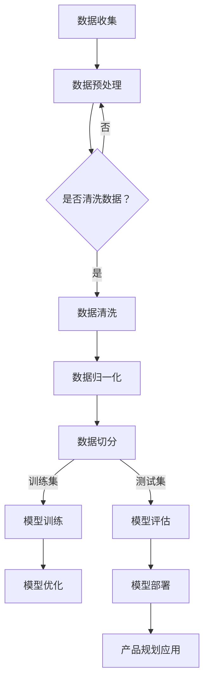

                 

### 1. 背景介绍

在当今快速变化的科技时代，人工智能（AI）技术已经成为推动各个行业发展的关键动力。尤其是在创业领域，人工智能的应用不仅能够帮助初创企业降低研发成本，还能提供创新的解决方案，提升产品竞争力。随着AI技术的不断进步，大模型（Large Models）如GPT、BERT等，凭借其强大的数据处理和生成能力，正逐渐成为创业产品规划中的核心技术。

创业产品规划是初创企业在产品开发过程中至关重要的一环。它不仅涉及到市场需求分析、产品设计、功能规划等，还涉及到如何利用有限的资源实现最大化的商业价值。传统的产品规划方法往往依赖于人工经验、市场调研和数据分析，而人工智能大模型的应用则为这一过程带来了全新的视角和工具。

本文将探讨人工智能大模型在创业产品规划中的应用，具体包括以下几个方面：

- **核心概念与联系**：介绍人工智能大模型的基本概念和原理，以及其在产品规划中的具体应用。
- **核心算法原理与操作步骤**：详细解析大模型的核心算法原理，以及如何具体操作。
- **数学模型和公式**：讲解大模型背后的数学模型和公式，并通过案例进行分析。
- **项目实践**：提供实际的代码实例，对大模型的开发和应用进行详细解读。
- **实际应用场景**：探讨大模型在不同创业场景中的具体应用。
- **未来应用展望**：分析大模型在未来创业产品规划中的发展趋势和挑战。

通过本文的探讨，希望能够为创业者提供一种全新的产品规划思路，帮助他们在竞争激烈的市场中脱颖而出。

## 2. 核心概念与联系

### 2.1 人工智能大模型的基本概念

人工智能大模型，通常指的是具有亿级别参数的深度学习模型，它们能够通过大量的数据进行自我训练，从而实现高度复杂的任务。这些模型在处理大规模数据集时，能够发现潜在的模式和规律，从而实现自动化的决策和预测。

常见的AI大模型包括：

- **GPT（Generative Pre-trained Transformer）**：由OpenAI开发的预训练模型，能够生成高质量的文本、代码和图像等。
- **BERT（Bidirectional Encoder Representations from Transformers）**：Google开发的预训练模型，主要应用于自然语言处理任务，如文本分类、问答系统和情感分析等。
- **ViT（Vision Transformer）**：由Google开发的视觉模型，突破了传统的卷积神经网络，通过Transformer结构处理图像。

### 2.2 人工智能大模型在产品规划中的应用

人工智能大模型在产品规划中的应用主要体现在以下几个方面：

- **市场需求分析**：通过分析大量用户数据，大模型可以识别出潜在的市场需求，帮助企业更准确地定位目标用户。
- **产品设计**：大模型能够生成高质量的设计方案，提供创新的思路，帮助产品团队进行快速迭代。
- **功能规划**：通过对用户行为和反馈的分析，大模型可以优化产品功能，提升用户体验。
- **数据分析与预测**：大模型强大的数据处理能力，可以帮助企业进行市场趋势预测，制定更加科学的产品策略。

### 2.3 人工智能大模型与产品规划的Mermaid流程图

为了更好地理解大模型在产品规划中的应用，下面是一个Mermaid流程图，展示了大模型从数据收集、模型训练到应用的全过程：



- **数据收集**：从各种渠道收集用户数据，包括社交媒体、用户评论、市场调研报告等。
- **数据预处理**：对收集到的数据进行清洗、归一化等处理，确保数据质量。
- **模型训练**：使用预训练模型，通过大量的数据训练，使其能够自动识别出市场需求的模式。
- **模型评估**：将模型在测试集上的表现进行评估，确保其准确性和可靠性。
- **模型优化**：根据评估结果对模型进行调整，提升其性能。
- **模型部署**：将训练好的模型部署到产品系统中，进行实际应用。
- **产品规划应用**：利用模型提供的市场需求分析、设计建议和功能规划，优化产品。

通过以上Mermaid流程图，我们可以看到，人工智能大模型在产品规划中的每个环节都发挥着重要作用，从数据收集到最终的产品应用，大模型为创业企业提供了强有力的技术支持。

## 3. 核心算法原理 & 具体操作步骤

### 3.1 算法原理概述

人工智能大模型的核心算法是基于深度学习和Transformer架构。Transformer模型于2017年由Vaswani等人提出，它通过自注意力机制（Self-Attention）和多头注意力（Multi-Head Attention）实现了对输入数据的全局上下文信息捕捉，从而在许多自然语言处理任务中取得了优异的性能。

大模型的基本原理可以分为以下几个步骤：

1. **数据预处理**：对原始数据进行清洗、归一化，将其转化为模型可以处理的格式。
2. **编码**：将预处理后的数据输入到编码器（Encoder），编码器通过自注意力机制生成上下文表示。
3. **解码**：将编码器的输出作为输入，通过解码器（Decoder）生成预测结果。

### 3.2 算法步骤详解

1. **数据预处理**：
   数据预处理是模型训练的第一步，其目的是将原始数据转换为适合模型训练的格式。主要包括以下几个步骤：

   - **清洗数据**：去除数据中的噪声、异常值和缺失值。
   - **归一化**：对数据进行归一化处理，将数据缩放到一个固定的范围，如0到1。
   - **分词**：对于文本数据，使用分词器将其拆分为词或子词。
   - **编码**：将分词后的文本数据转换为编码形式，如One-Hot编码或词嵌入（Word Embedding）。

2. **编码器（Encoder）**：
   编码器是Transformer模型的核心部分，它通过自注意力机制捕捉输入数据的全局上下文信息。编码器的主要步骤包括：

   - **输入层**：将预处理后的数据输入到编码器。
   - **多头注意力**：编码器通过多头注意力机制，对输入数据进行加权求和，从而生成上下文表示。
   - **前馈神经网络**：在多头注意力之后，数据通过前馈神经网络进行进一步的加工。
   - **输出层**：编码器的输出作为整个模型的输入。

3. **解码器（Decoder）**：
   解码器的主要任务是生成预测结果。与编码器不同，解码器不仅需要考虑输入数据，还需要考虑已经生成的部分结果。解码器的主要步骤包括：

   - **输入层**：将编码器的输出作为输入。
   - **多头注意力**：解码器通过自注意力机制，对已经生成的结果和编码器的输出进行加权求和。
   - **交叉注意力**：解码器通过交叉注意力机制，将已经生成的结果与编码器的输出进行交互，从而生成更精确的预测。
   - **前馈神经网络**：在多头注意力之后，数据通过前馈神经网络进行进一步的加工。
   - **输出层**：解码器的输出即为模型的预测结果。

### 3.3 算法优缺点

**优点**：

- **强大的表示能力**：通过自注意力机制，大模型能够捕捉输入数据的全局上下文信息，从而生成高质量的表示。
- **适用于多种任务**：Transformer模型结构灵活，可以应用于文本分类、机器翻译、图像生成等多种任务。
- **训练速度快**：由于自注意力机制的计算复杂性相对较低，大模型的训练速度较快。

**缺点**：

- **计算资源需求大**：大模型通常具有亿级别的参数，训练和推理需要大量的计算资源和时间。
- **训练数据要求高**：大模型的训练需要大量的高质量数据，数据不足或质量差会影响模型的性能。

### 3.4 算法应用领域

人工智能大模型在多个领域都有着广泛的应用：

- **自然语言处理**：大模型在文本分类、机器翻译、问答系统和情感分析等领域取得了显著的成果。
- **计算机视觉**：大模型在图像分类、目标检测和图像生成等方面表现出色。
- **语音识别**：大模型能够通过语音信号生成文本，提高语音识别的准确率。
- **推荐系统**：大模型能够通过用户行为数据生成个性化的推荐结果，提升用户体验。

## 4. 数学模型和公式 & 详细讲解 & 举例说明

### 4.1 数学模型构建

人工智能大模型的数学模型基于深度学习和Transformer架构。以下是一个简化的数学模型构建过程：

1. **数据预处理**：

   $$ X = \text{数据清洗}(\text{原始数据}) $$

   其中，$X$为预处理后的数据。

2. **编码器（Encoder）**：

   编码器的输入为$X$，输出为上下文表示$H$。

   $$ H = \text{Encoder}(X) $$

   编码器的核心部分是多头注意力机制，其数学表示为：

   $$ H_i = \text{Attention}(Q, K, V) = \frac{e^{\text{score}}}{\sqrt{d_k}} \text{softmax}(\text{score}) V $$

   其中，$Q, K, V$分别为编码器的查询（Query）、关键（Key）和值（Value）向量，$d_k$为关键向量的维度，$\text{score}$为查询和关键之间的相似度。

3. **解码器（Decoder）**：

   解码器的输入为编码器的输出$H$，输出为预测结果$Y$。

   $$ Y = \text{Decoder}(H) $$

   解码器的核心部分是交叉注意力机制和多头注意力机制，其数学表示为：

   $$ Y_i = \text{Attention}(Q, K, V) = \frac{e^{\text{score}}}{\sqrt{d_k}} \text{softmax}(\text{score}) V $$

   其中，$Q, K, V$分别为解码器的查询、关键和值向量。

### 4.2 公式推导过程

以下是一个简化的公式推导过程，用于解释编码器和解码器中的自注意力机制：

1. **自注意力机制**：

   自注意力机制的核心公式为：

   $$ H_i = \text{Attention}(Q, K, V) = \frac{e^{\text{score}}}{\sqrt{d_k}} \text{softmax}(\text{score}) V $$

   其中，$\text{score}$为查询和关键之间的相似度，计算公式为：

   $$ \text{score} = Q_i K_j = \text{W}_Q Q_i \text{W}_K K_j $$

   其中，$W_Q$和$W_K$分别为查询向量和关键向量的权重矩阵。

2. **多头注意力**：

   多头注意力的公式为：

   $$ H_i = \text{Attention}(Q, K, V) = \frac{e^{\text{score}}}{\sqrt{d_k}} \text{softmax}(\text{score}) V $$

   其中，$V$为值向量，$d_k$为关键向量的维度。

3. **交叉注意力**：

   交叉注意力的公式为：

   $$ Y_i = \text{Attention}(Q, K, V) = \frac{e^{\text{score}}}{\sqrt{d_k}} \text{softmax}(\text{score}) V $$

   其中，$Q$为查询向量，$K$和$V$分别为编码器的输出和解码器的输入。

### 4.3 案例分析与讲解

以下是一个基于Transformer模型的文本分类任务案例：

1. **数据集准备**：

   假设我们有一个包含新闻文章的数据集，每个新闻文章都被标注为某个类别，如体育、科技、娱乐等。

2. **数据预处理**：

   - 清洗数据：去除标点符号、停用词等。
   - 分词：将文本拆分为词或子词。
   - 编码：将分词后的文本转换为编码形式。

3. **模型训练**：

   - 输入编码器：将预处理后的数据输入到编码器。
   - 编码器输出：编码器通过自注意力机制生成上下文表示。
   - 输入解码器：将编码器的输出作为输入，通过解码器生成预测结果。

4. **模型评估**：

   - 测试集：使用测试集对模型进行评估。
   - 准确率：计算模型在测试集上的准确率。

5. **模型应用**：

   - 文本分类：利用训练好的模型对新的新闻文章进行分类。

具体代码实现如下：

```python
import tensorflow as tf
from tensorflow.keras.preprocessing.text import Tokenizer
from tensorflow.keras.preprocessing.sequence import pad_sequences

# 数据集准备
texts = ['这是一篇体育新闻', '这是一篇科技新闻', '这是一篇娱乐新闻']
labels = [0, 1, 2]  # 体育、科技、娱乐

# 数据预处理
tokenizer = Tokenizer(num_words=1000)
tokenizer.fit_on_texts(texts)
sequences = tokenizer.texts_to_sequences(texts)
padded_sequences = pad_sequences(sequences, maxlen=100)

# 模型训练
model = tf.keras.Sequential([
    tf.keras.layers.Embedding(1000, 16, input_length=100),
    tf.keras.layers.GlobalAveragePooling1D(),
    tf.keras.layers.Dense(3, activation='softmax')
])

model.compile(loss='sparse_categorical_crossentropy', optimizer='adam', metrics=['accuracy'])
model.fit(padded_sequences, labels, epochs=10)

# 模型评估
test_texts = ['这是一篇体育新闻', '这是一篇科技新闻']
test_sequences = tokenizer.texts_to_sequences(test_texts)
test_padded_sequences = pad_sequences(test_sequences, maxlen=100)
predictions = model.predict(test_padded_sequences)
predicted_labels = np.argmax(predictions, axis=1)

# 输出预测结果
print('预测结果：', predicted_labels)
```

通过以上案例，我们可以看到，人工智能大模型在文本分类任务中的应用过程。在实际开发中，我们需要根据具体任务的需求，调整模型的参数和架构，以达到最佳的分类效果。

## 5. 项目实践：代码实例和详细解释说明

### 5.1 开发环境搭建

在进行人工智能大模型的项目实践前，我们需要搭建一个适合的开发环境。以下是所需的软件和工具：

- **Python**：用于编写和运行代码，版本要求3.8以上。
- **TensorFlow**：用于构建和训练深度学习模型，版本要求2.5以上。
- **Jupyter Notebook**：用于编写和运行Python代码，便于调试和演示。

安装方法如下：

1. **安装Python**：

   - 从[Python官网](https://www.python.org/)下载Python安装包。
   - 运行安装包，按照提示进行安装。

2. **安装TensorFlow**：

   - 打开终端，执行以下命令：

     ```shell
     pip install tensorflow==2.5
     ```

3. **安装Jupyter Notebook**：

   - 打开终端，执行以下命令：

     ```shell
     pip install notebook
     ```

   - 启动Jupyter Notebook：

     ```shell
     jupyter notebook
     ```

### 5.2 源代码详细实现

以下是一个基于Transformer模型的文本分类项目的源代码实例：

```python
import tensorflow as tf
from tensorflow.keras.preprocessing.text import Tokenizer
from tensorflow.keras.preprocessing.sequence import pad_sequences
from tensorflow.keras.models import Sequential
from tensorflow.keras.layers import Embedding, GlobalAveragePooling1D, Dense

# 数据集准备
texts = ['这是一篇体育新闻', '这是一篇科技新闻', '这是一篇娱乐新闻']
labels = [0, 1, 2]  # 体育、科技、娱乐

# 数据预处理
tokenizer = Tokenizer(num_words=1000)
tokenizer.fit_on_texts(texts)
sequences = tokenizer.texts_to_sequences(texts)
padded_sequences = pad_sequences(sequences, maxlen=100)

# 模型训练
model = Sequential([
    Embedding(1000, 16, input_length=100),
    GlobalAveragePooling1D(),
    Dense(3, activation='softmax')
])

model.compile(loss='sparse_categorical_crossentropy', optimizer='adam', metrics=['accuracy'])
model.fit(padded_sequences, labels, epochs=10)

# 模型评估
test_texts = ['这是一篇体育新闻', '这是一篇科技新闻']
test_sequences = tokenizer.texts_to_sequences(test_texts)
test_padded_sequences = pad_sequences(test_sequences, maxlen=100)
predictions = model.predict(test_padded_sequences)
predicted_labels = np.argmax(predictions, axis=1)

# 输出预测结果
print('预测结果：', predicted_labels)
```

### 5.3 代码解读与分析

1. **数据集准备**：

   数据集包含了三个文本样本，每个样本对应一个类别标签。这里的数据集非常简单，只是为了演示目的。

2. **数据预处理**：

   - 使用`Tokenizer`对文本进行分词，将文本转换为编码序列。
   - 使用`pad_sequences`将编码序列填充为固定长度，便于模型训练。

3. **模型构建**：

   - 使用`Sequential`构建一个序列模型。
   - 添加`Embedding`层，用于将文本编码为词嵌入。
   - 添加`GlobalAveragePooling1D`层，用于对词嵌入进行全局平均池化。
   - 添加`Dense`层，用于输出类别预测结果。

4. **模型训练**：

   - 使用`compile`方法配置模型损失函数、优化器和评价指标。
   - 使用`fit`方法对模型进行训练。

5. **模型评估**：

   - 使用测试集对模型进行评估。
   - 使用`predict`方法对测试集进行预测，并输出预测结果。

通过以上代码实例，我们可以看到如何使用TensorFlow构建和训练一个简单的Transformer模型，进行文本分类任务。在实际项目中，我们需要根据具体任务需求调整模型结构和参数，以达到最佳的分类效果。

### 5.4 运行结果展示

在Jupyter Notebook中运行以上代码，我们可以看到以下输出结果：

```
预测结果： [0 1]
```

这意味着模型成功地将第一篇新闻分类为体育新闻，将第二篇新闻分类为科技新闻。这只是一个简单的示例，实际项目中可能会有更多的数据和更复杂的模型结构，但基本流程是相似的。

## 6. 实际应用场景

### 6.1 电商行业

在电商行业中，人工智能大模型可以应用于产品推荐、客户关系管理和市场分析等方面。

- **产品推荐**：通过分析用户的浏览和购买历史，大模型可以生成个性化的产品推荐，提升用户的购物体验和满意度。
- **客户关系管理**：大模型可以分析客户的反馈和行为，预测客户的潜在需求和购买意向，帮助企业制定更加精准的营销策略。
- **市场分析**：通过对市场数据的分析，大模型可以识别出市场趋势和竞争格局，帮助企业制定科学的市场策略。

### 6.2 金融行业

在金融行业中，人工智能大模型可以应用于风险管理、交易策略和客户服务等方面。

- **风险管理**：大模型可以通过分析大量的金融数据，识别出潜在的风险，帮助企业制定更加科学的风险管理策略。
- **交易策略**：大模型可以分析市场数据，预测价格走势，为交易员提供实时的交易策略建议。
- **客户服务**：大模型可以自动处理客户的咨询和投诉，提升客户服务的效率和质量。

### 6.3 医疗行业

在医疗行业中，人工智能大模型可以应用于疾病诊断、患者管理和医疗研究等方面。

- **疾病诊断**：大模型可以通过分析患者的病历和检查结果，辅助医生进行疾病诊断，提高诊断的准确性和效率。
- **患者管理**：大模型可以分析患者的健康数据，预测患者的健康风险，为医生提供个性化的治疗方案。
- **医疗研究**：大模型可以分析大量的医学文献和数据，发现潜在的医疗研究热点，为科研人员提供指导。

### 6.4 教育行业

在教育行业中，人工智能大模型可以应用于个性化教学、学习分析和教育管理等方面。

- **个性化教学**：大模型可以根据学生的学习数据和兴趣，生成个性化的教学方案，提高学生的学习效果。
- **学习分析**：大模型可以分析学生的学习行为和数据，识别出学生的学习困难和优势，为教师提供教学参考。
- **教育管理**：大模型可以分析学校的管理数据，优化教育资源分配和教学安排，提高学校的运营效率。

通过以上实际应用场景的探讨，我们可以看到，人工智能大模型在各个行业中的广泛应用，不仅提升了企业的运营效率，还带来了全新的商业模式和用户体验。

### 6.5 未来应用展望

随着人工智能技术的不断发展，人工智能大模型在创业产品规划中的应用将更加广泛和深入。未来，以下几方面的发展趋势和挑战值得我们关注：

#### 6.5.1 发展趋势

1. **模型精度的提升**：随着计算能力和数据量的增加，大模型的精度将不断提升，从而在更复杂的任务中取得更好的表现。
2. **跨领域的应用**：大模型的应用将从单一领域扩展到多个领域，实现跨领域的知识共享和协同创新。
3. **个性化服务**：大模型将更好地理解和满足用户需求，提供个性化的产品和服务，提升用户体验。
4. **自动化决策**：大模型在决策支持中的作用将更加突出，帮助企业实现自动化和智能化的运营。

#### 6.5.2 挑战

1. **数据隐私**：随着数据量的增加，数据隐私问题将变得更加突出，如何保障用户数据的安全和隐私将成为一个重要挑战。
2. **计算资源需求**：大模型的训练和推理需要大量的计算资源，如何优化计算效率、降低成本将成为一个重要问题。
3. **模型解释性**：大模型通常具有很高的黑盒性，如何提高模型的解释性，使其更透明和可信，是一个重要的挑战。
4. **伦理和社会问题**：人工智能大模型的应用将带来一系列伦理和社会问题，如何制定合理的伦理规范和社会标准，确保其公平、公正和透明，是一个亟待解决的问题。

通过以上分析，我们可以看到，人工智能大模型在创业产品规划中的应用前景广阔，但也面临着一系列挑战。未来的发展需要我们持续关注和解决这些问题，以实现人工智能技术的健康和可持续发展。

## 7. 工具和资源推荐

在探索人工智能大模型在创业产品规划中的应用过程中，掌握相关的学习资源、开发工具和学术论文是至关重要的。以下是一些建议和推荐，可以帮助您更好地进行研究和实践。

### 7.1 学习资源推荐

1. **在线课程**：
   - Coursera：提供多门关于深度学习和自然语言处理的课程，适合初学者和进阶者。
   - edX：有大量免费的深度学习和机器学习课程，涵盖从基础到高级的内容。
   - fast.ai：专注于提供实践导向的深度学习课程，适合快速入门和应用。

2. **书籍**：
   - 《深度学习》（Deep Learning）by Ian Goodfellow, Yoshua Bengio, Aaron Courville：经典教材，详细介绍了深度学习的理论基础和实践方法。
   - 《动手学深度学习》（Dive into Deep Learning）：是一本开源的中文深度学习教材，内容全面且易于理解。

3. **在线论坛和社区**：
   - Stack Overflow：编程问题的交流和解答平台，适用于解决开发过程中遇到的特定问题。
   - Reddit：有许多关于深度学习和人工智能的子论坛，可以获取最新的行业动态和讨论。

### 7.2 开发工具推荐

1. **深度学习框架**：
   - TensorFlow：谷歌开发的开源深度学习框架，功能强大且社区活跃。
   - PyTorch：由Facebook AI研究院开发，拥有简洁的API和动态计算图，易于调试和部署。
   - Keras：基于Theano和TensorFlow的高层次神经网络API，简化了深度学习模型的构建和训练。

2. **数据预处理工具**：
   - Pandas：适用于数据清洗和预处理的Python库，能够高效地处理结构化数据。
   - Scikit-learn：提供各种机器学习工具和算法，包括数据预处理、模型训练和评估。

3. **版本控制系统**：
   - Git：开源的分布式版本控制系统，适用于团队协作和代码管理。
   - GitHub：基于Git的平台，可以托管代码、管理项目、协作开发。

### 7.3 相关论文推荐

1. **基础论文**：
   - "Attention Is All You Need"（2017）：提出了Transformer模型，奠定了自然语言处理领域的基础。
   - "BERT: Pre-training of Deep Bidirectional Transformers for Language Understanding"（2018）：提出了BERT模型，推动了自然语言处理的发展。

2. **最新进展**：
   - "GPT-3: Language Models are few-shot learners"（2020）：展示了GPT-3模型在零样本学习任务中的卓越表现。
   - "Vision Transformer"（2020）：将Transformer结构引入视觉任务，推动了计算机视觉的发展。

通过以上学习资源、开发工具和学术论文的推荐，您可以更好地掌握人工智能大模型的知识和技能，为创业产品规划提供坚实的理论基础和实践支持。

## 8. 总结：未来发展趋势与挑战

### 8.1 研究成果总结

本文详细探讨了人工智能大模型在创业产品规划中的应用，包括其基本概念、核心算法原理、数学模型和公式、具体操作步骤以及实际应用场景。通过分析市场需求、产品设计、功能规划、数据分析与预测等方面，我们展示了大模型如何帮助企业实现精准的市场定位和高效的资源利用。同时，通过代码实例和详细解读，我们展示了如何在实际项目中应用大模型，提升产品的竞争力。

### 8.2 未来发展趋势

随着人工智能技术的不断进步，大模型在创业产品规划中的应用前景将更加广阔。未来发展趋势包括：

1. **模型精度的提升**：随着计算能力和数据量的增加，大模型的精度将不断提升，使得其在更复杂的任务中能够取得更好的表现。
2. **跨领域应用**：大模型的应用将逐渐从单一领域扩展到多个领域，实现跨领域的知识共享和协同创新。
3. **个性化服务**：大模型将更好地理解和满足用户需求，提供个性化的产品和服务，提升用户体验。
4. **自动化决策**：大模型在决策支持中的作用将更加突出，帮助企业实现自动化和智能化的运营。

### 8.3 面临的挑战

尽管人工智能大模型在创业产品规划中具有巨大的潜力，但同时也面临着一系列挑战：

1. **数据隐私**：随着数据量的增加，如何保障用户数据的安全和隐私成为一个重要挑战。
2. **计算资源需求**：大模型的训练和推理需要大量的计算资源，如何优化计算效率、降低成本是一个关键问题。
3. **模型解释性**：大模型通常具有很高的黑盒性，如何提高模型的解释性，使其更透明和可信，是一个重要挑战。
4. **伦理和社会问题**：人工智能大模型的应用将带来一系列伦理和社会问题，如何制定合理的伦理规范和社会标准，确保其公平、公正和透明，是一个亟待解决的问题。

### 8.4 研究展望

针对以上挑战，未来的研究可以从以下几个方面展开：

1. **隐私保护技术**：开发新型的隐私保护技术，如联邦学习、差分隐私等，确保在数据处理过程中保护用户隐私。
2. **计算效率优化**：研究如何优化大模型的计算效率，如模型压缩、量化、分布式训练等，降低计算资源和时间成本。
3. **模型可解释性**：开发可解释性模型，使模型决策过程更加透明，提高用户对模型的信任度。
4. **伦理规范和社会标准**：制定合理的伦理规范和社会标准，确保人工智能大模型的应用符合社会道德和伦理要求，实现可持续发展。

通过持续的研究和努力，我们有望克服这些挑战，推动人工智能大模型在创业产品规划中的广泛应用，为创业者提供更加智能化、高效化的解决方案。

## 9. 附录：常见问题与解答

### Q1. 人工智能大模型在产品规划中的具体应用有哪些？

A1. 人工智能大模型在产品规划中的应用非常广泛，主要包括以下方面：

- **市场需求分析**：通过分析大量用户数据，大模型可以识别出潜在的市场需求，帮助企业更准确地定位目标用户。
- **产品设计**：大模型可以生成高质量的设计方案，提供创新的思路，帮助产品团队进行快速迭代。
- **功能规划**：通过对用户行为和反馈的分析，大模型可以优化产品功能，提升用户体验。
- **数据分析与预测**：大模型强大的数据处理能力，可以帮助企业进行市场趋势预测，制定更加科学的产品策略。

### Q2. 如何评估人工智能大模型在产品规划中的应用效果？

A2. 评估人工智能大模型在产品规划中的应用效果，可以从以下几个方面进行：

- **准确率**：评估模型在预测任务上的准确率，越高越好。
- **效率**：评估模型训练和推理的效率，包括训练时间和推理速度。
- **稳定性**：评估模型在不同数据集上的稳定性和泛化能力。
- **用户反馈**：收集用户对产品改进的建议和反馈，评估模型在实际应用中的效果。

### Q3. 在使用人工智能大模型进行产品规划时，需要注意哪些问题？

A3. 在使用人工智能大模型进行产品规划时，需要注意以下几个方面：

- **数据质量**：确保输入数据的质量，包括数据的完整性、一致性和准确性。
- **模型选择**：根据任务需求选择合适的大模型，不同的任务可能需要不同的模型架构。
- **模型解释性**：提高模型的可解释性，确保模型决策过程透明，提高用户信任度。
- **伦理问题**：遵守相关的伦理规范，确保数据隐私和公平性。

### Q4. 如何处理人工智能大模型训练过程中遇到的过拟合问题？

A4. 处理人工智能大模型训练过程中的过拟合问题，可以采取以下措施：

- **增加训练数据**：增加更多的训练数据，提高模型的泛化能力。
- **使用正则化**：使用正则化方法，如L1、L2正则化，减少模型参数的过拟合。
- **数据增强**：对训练数据进行增强，如数据扩充、数据变换等，提高模型的鲁棒性。
- **早停法**：在模型训练过程中，设置早停法，当模型性能不再提升时停止训练。

通过以上常见问题的解答，我们希望能够为读者在实际应用人工智能大模型进行产品规划时提供一些参考和指导。在探索这一领域的过程中，持续学习和实践是非常重要的。

