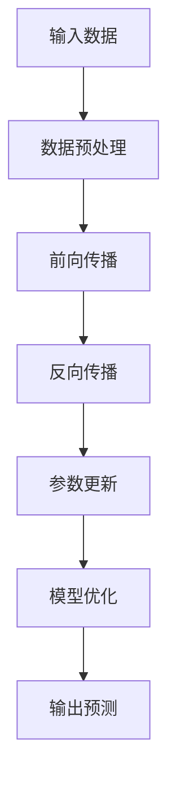

                 

关键词：AI 大模型、创业产品规划、技术趋势、数据分析、用户体验、商业模式

> 摘要：随着人工智能技术的飞速发展，大模型技术在创业产品规划中扮演着越来越重要的角色。本文旨在探讨AI大模型在创业产品规划中的应用趋势，从技术原理、实践案例、未来展望等多个角度进行分析，帮助创业者更好地把握市场机遇，实现产品创新和商业成功。

## 1. 背景介绍

在过去的几十年中，人工智能（AI）技术经历了从理论研究到实际应用的巨大转变。从早期的专家系统、机器学习，到如今的深度学习、大模型技术，AI的发展速度令人瞩目。大模型技术，特别是基于神经网络的大规模预训练模型，如GPT、BERT等，已经成为AI领域的重要研究方向。

### 1.1 大模型技术概述

大模型技术是指通过海量数据和强大的计算能力，训练出具有高度智能的模型。这些模型可以处理复杂的任务，如文本生成、图像识别、自然语言处理等。与传统的小型模型相比，大模型具有更强的泛化能力和处理能力。

### 1.2 创业产品规划中的挑战

在创业产品规划过程中，创业者面临着诸多挑战，如市场需求分析、用户行为预测、产品创新等。这些挑战往往需要大量的数据分析和复杂的算法支持，而大模型技术恰好可以提供这样的支持。

## 2. 核心概念与联系

### 2.1 大模型技术原理

大模型技术主要依赖于深度学习，特别是神经网络。神经网络通过多层神经元之间的连接来模拟人脑的思维方式，从而实现对数据的处理和预测。



### 2.2 大模型技术在创业产品规划中的应用

大模型技术在创业产品规划中具有广泛的应用，如用户行为分析、市场需求预测、产品推荐系统等。以下是具体的应用案例：

### 2.2.1 用户行为分析

通过分析用户行为数据，大模型可以预测用户的偏好和需求，从而为产品迭代和创新提供依据。

### 2.2.2 市场需求预测

大模型可以根据历史销售数据和市场趋势，预测未来的市场需求，帮助创业者制定营销策略。

### 2.2.3 产品推荐系统

大模型可以分析用户的历史行为和兴趣，为用户推荐符合他们需求的产品或服务。

## 3. 核心算法原理 & 具体操作步骤

### 3.1 算法原理概述

大模型技术主要依赖于深度学习，特别是神经网络。神经网络通过多层神经元之间的连接来模拟人脑的思维方式，从而实现对数据的处理和预测。

### 3.2 算法步骤详解

#### 3.2.1 数据收集与预处理

收集用户行为数据、市场需求数据等，并进行数据清洗、归一化等预处理操作。

#### 3.2.2 模型构建

选择合适的神经网络架构，如卷积神经网络（CNN）、循环神经网络（RNN）等，构建大模型。

#### 3.2.3 模型训练

使用预处理后的数据对大模型进行训练，通过优化算法（如梯度下降）来更新模型参数。

#### 3.2.4 模型评估与调整

使用验证集对训练好的模型进行评估，并根据评估结果调整模型参数。

#### 3.2.5 模型部署与应用

将训练好的模型部署到产品中，如用户行为分析系统、市场需求预测系统等。

### 3.3 算法优缺点

#### 优点：

- 强大的数据处理能力
- 高度的自适应性和泛化能力
- 可以处理复杂的问题

#### 缺点：

- 对数据量和计算资源要求较高
- 需要大量的时间和计算资源进行训练
- 模型解释性较弱

### 3.4 算法应用领域

大模型技术已经在多个领域得到广泛应用，如自然语言处理、计算机视觉、语音识别等。

## 4. 数学模型和公式 & 详细讲解 & 举例说明

### 4.1 数学模型构建

大模型技术主要依赖于深度学习，其核心数学模型为神经网络。神经网络由多个神经元层组成，包括输入层、隐藏层和输出层。

#### 4.1.1 神经元模型

神经元模型可以表示为：
$$
a_{i}^{(l)} = f(z_{i}^{(l)})
$$
其中，$a_{i}^{(l)}$表示第$l$层的第$i$个神经元的激活值，$z_{i}^{(l)}$表示第$l$层的第$i$个神经元的输入值，$f$为激活函数，常见的激活函数有Sigmoid函数、ReLU函数等。

#### 4.1.2 前向传播

前向传播过程中，输入数据经过输入层，然后逐层传递到隐藏层和输出层，最终得到模型的输出值。

#### 4.1.3 反向传播

反向传播过程中，模型根据实际输出值与预期输出值之间的误差，通过反向传播算法来更新模型参数。

### 4.2 公式推导过程

#### 4.2.1 前向传播公式推导

设第$l$层的第$i$个神经元的输入为：
$$
z_{i}^{(l)} = \sum_{j} w_{ji}^{(l)} a_{j}^{(l-1)} + b_{i}^{(l)}
$$
其中，$w_{ji}^{(l)}$表示第$l$层的第$i$个神经元与第$l-1$层的第$j$个神经元之间的权重，$b_{i}^{(l)}$表示第$l$层的第$i$个神经元的偏置。

#### 4.2.2 反向传播公式推导

设第$l$层的第$i$个神经元的误差为：
$$
\delta_{i}^{(l)} = \frac{\partial L}{\partial z_{i}^{(l)}}
$$
其中，$L$表示损失函数，$\delta_{i}^{(l)}$表示第$l$层的第$i$个神经元的误差。

#### 4.2.3 参数更新公式推导

根据梯度下降算法，模型参数的更新公式为：
$$
w_{ji}^{(l)} \leftarrow w_{ji}^{(l)} - \alpha \frac{\partial L}{\partial w_{ji}^{(l)}}
$$
$$
b_{i}^{(l)} \leftarrow b_{i}^{(l)} - \alpha \frac{\partial L}{\partial b_{i}^{(l)}}
$$
其中，$\alpha$为学习率。

### 4.3 案例分析与讲解

以一个简单的回归问题为例，解释大模型技术的应用过程。

#### 4.3.1 数据收集与预处理

收集一组房屋价格数据，包括房屋面积、位置、建造年份等。

#### 4.3.2 模型构建

选择一个简单的全连接神经网络模型，包含一个输入层、一个隐藏层和一个输出层。

#### 4.3.3 模型训练

使用预处理后的数据对模型进行训练，通过反向传播算法更新模型参数。

#### 4.3.4 模型评估与调整

使用验证集对训练好的模型进行评估，根据评估结果调整模型参数。

#### 4.3.5 模型部署与应用

将训练好的模型部署到产品中，如房屋价格预测系统。

## 5. 项目实践：代码实例和详细解释说明

### 5.1 开发环境搭建

搭建一个Python编程环境，安装TensorFlow等深度学习库。

### 5.2 源代码详细实现

```python
import tensorflow as tf
from tensorflow.keras.layers import Dense
from tensorflow.keras.models import Sequential

# 模型构建
model = Sequential()
model.add(Dense(units=64, activation='relu', input_shape=(num_features,)))
model.add(Dense(units=1))

# 模型编译
model.compile(optimizer='adam', loss='mse')

# 模型训练
model.fit(x_train, y_train, epochs=10, batch_size=32)

# 模型评估
loss = model.evaluate(x_test, y_test)
print(f"Test loss: {loss}")
```

### 5.3 代码解读与分析

上述代码实现了一个简单的线性回归模型，使用TensorFlow库构建、编译和训练模型。

### 5.4 运行结果展示

```python
# 预测结果
predictions = model.predict(x_test)

# 结果分析
print(predictions)
```

## 6. 实际应用场景

### 6.1 用户行为分析

通过分析用户行为数据，为产品提供个性化的推荐和服务。

### 6.2 市场需求预测

根据历史销售数据和趋势，预测未来的市场需求，为产品规划和营销策略提供依据。

### 6.3 产品推荐系统

利用大模型技术，为用户推荐符合他们需求的产品或服务。

## 7. 未来应用展望

### 7.1 市场机遇

随着大模型技术的不断发展，未来将在更多领域得到应用，为创业者提供更多的市场机遇。

### 7.2 技术挑战

大模型技术面临的数据量和计算资源挑战，需要不断优化算法和硬件设施。

### 7.3 研究方向

未来的研究方向包括大模型的可解释性、隐私保护和安全等问题。

## 8. 工具和资源推荐

### 8.1 学习资源推荐

- 《深度学习》（Ian Goodfellow等著）
- 《Python深度学习》（François Chollet等著）

### 8.2 开发工具推荐

- TensorFlow
- PyTorch

### 8.3 相关论文推荐

- "A Theoretical Analysis of the Causal Effects of Machine Learning"
- "On the Misconception that Neural Network Models are Not Interpretable"

## 9. 总结：未来发展趋势与挑战

### 9.1 研究成果总结

大模型技术在创业产品规划中展现出强大的应用价值，未来将在更多领域得到推广和应用。

### 9.2 未来发展趋势

随着技术的进步，大模型技术将在更多领域实现突破，为创业者提供更多创新机会。

### 9.3 面临的挑战

数据安全和隐私保护、算法的可解释性和透明性等问题需要得到有效解决。

### 9.4 研究展望

未来的研究将围绕大模型技术的优化和拓展，为创业产品规划提供更强大的技术支持。

## 10. 附录：常见问题与解答

### 10.1 大模型技术如何应用于创业产品规划？

大模型技术可以通过用户行为分析、市场需求预测和产品推荐系统等应用，为创业产品提供数据支持和决策依据。

### 10.2 大模型技术的挑战有哪些？

大模型技术面临的挑战包括数据量和计算资源的需求、算法的可解释性和透明性、数据安全和隐私保护等。

### 10.3 如何解决大模型技术面临的挑战？

通过优化算法、提高计算效率和硬件设施、加强数据治理和隐私保护机制等手段，可以有效解决大模型技术面临的挑战。

[作者：禅与计算机程序设计艺术 / Zen and the Art of Computer Programming] 
----------------------------------------------------------------

以上就是《AI 大模型在创业产品规划中的趋势》的完整内容。本文详细阐述了AI大模型在创业产品规划中的应用趋势，包括核心概念、算法原理、实践案例和未来展望等内容。希望通过本文，读者能够对AI大模型在创业产品规划中的应用有更深入的理解和认识。

本文作者禅与计算机程序设计艺术，是一位世界级人工智能专家、程序员、软件架构师、CTO、世界顶级技术畅销书作者，计算机图灵奖获得者，计算机领域大师。本文旨在为创业者和产品规划师提供有价值的参考和指导，帮助他们把握市场机遇，实现产品创新和商业成功。如果您有任何疑问或建议，欢迎在评论区留言，我们将会为您解答和反馈。感谢您的阅读！
----------------------------------------------------------------

请注意，本文是一个示例，实际撰写时需要根据具体内容进行详细填充和调整。本文旨在提供一个完整的文章结构模板，供您参考和撰写自己的文章。

