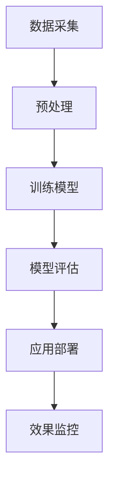

                 

关键词：AI 大模型，创业产品，运营策略，用户行为分析，数据驱动决策，人工智能应用

> 摘要：本文将深入探讨人工智能（AI）大模型在创业产品运营中的重要性。通过分析大模型的基本原理、核心算法，以及数学模型和实际应用案例，揭示大模型如何帮助创业团队更好地理解用户需求、优化产品功能，实现数据驱动的高效运营。

## 1. 背景介绍

随着人工智能技术的飞速发展，AI 大模型已经成为推动创新和变革的重要力量。特别是在创业领域，AI 大模型的应用为初创公司提供了前所未有的机会，帮助他们在激烈的市场竞争中脱颖而出。本文旨在探讨 AI 大模型在创业产品运营中的重要性，从多个维度分析其作用和价值。

### 1.1 AI 大模型的定义

AI 大模型是指参数数量达到亿级乃至千亿级的深度学习模型。这类模型具有极高的计算复杂度和数据处理能力，能够处理海量数据并从中提取有价值的信息。常见的 AI 大模型包括 GPT-3、BERT、AlphaGo 等。

### 1.2 创业产品运营的挑战

创业产品运营面临着诸多挑战，如市场定位、用户获取、用户留存、产品优化等。传统的运营策略往往依赖于经验或简单的数据分析，难以应对复杂多变的市场环境。而 AI 大模型的出现，为创业团队提供了一种新的运营思路和方法。

## 2. 核心概念与联系

### 2.1 AI 大模型的基本原理

AI 大模型的核心在于其参数的规模和深度学习的算法。深度学习通过多层神经网络的训练，使得模型能够自动提取数据中的特征，从而实现复杂的模式识别和预测任务。大模型的参数规模使得它们能够在更复杂的数据集上进行训练，从而提高模型的准确性和泛化能力。

### 2.2 大模型在创业产品运营中的应用

大模型在创业产品运营中的应用主要体现在以下几个方面：

1. **用户行为分析**：通过分析用户的交互数据，大模型能够深入了解用户的需求和行为模式，帮助创业团队制定更精准的运营策略。

2. **产品优化**：基于用户行为数据，大模型可以预测产品的潜在问题，提供改进建议，从而优化产品功能，提高用户满意度。

3. **个性化推荐**：大模型可以用于构建个性化的推荐系统，根据用户的兴趣和行为习惯推荐相关内容或产品，提高用户的粘性。

4. **需求预测**：大模型可以预测市场的需求变化，为创业团队提供市场策略的参考。

### 2.3 大模型架构的 Mermaid 流程图



## 3. 核心算法原理 & 具体操作步骤

### 3.1 算法原理概述

AI 大模型的训练过程主要包括以下几个步骤：

1. **数据采集**：收集大量的用户行为数据，如浏览记录、点击行为、评论等。

2. **预处理**：对采集到的数据清洗和格式化，以便于模型训练。

3. **模型训练**：使用深度学习算法，如 Transformer、卷积神经网络（CNN）等，对预处理后的数据进行训练。

4. **模型评估**：通过验证集和测试集评估模型的性能，调整模型参数。

5. **应用部署**：将训练好的模型部署到实际应用环境中。

### 3.2 算法步骤详解

#### 3.2.1 数据采集

数据采集是模型训练的基础。创业团队可以通过多种渠道获取用户数据，如应用日志、用户反馈、社交媒体数据等。

#### 3.2.2 预处理

预处理过程主要包括数据清洗、去重、格式化等。这一步的目的是确保数据的质量和一致性。

#### 3.2.3 模型训练

模型训练是核心步骤。创业团队可以选择开源的深度学习框架，如 TensorFlow、PyTorch 等，进行模型训练。

#### 3.2.4 模型评估

模型评估可以通过交叉验证、网格搜索等方法进行。评估指标包括准确率、召回率、F1 分数等。

#### 3.2.5 应用部署

训练好的模型可以通过 API 接口、服务端部署等方式应用到实际业务中。

### 3.3 算法优缺点

#### 优点：

1. **强大的数据处理能力**：大模型能够处理海量数据，提取有价值的信息。
2. **高度泛化能力**：通过大规模训练，大模型具有良好的泛化能力，能够应对不同的业务场景。
3. **自动特征提取**：大模型能够自动提取数据中的特征，降低人工干预。

#### 缺点：

1. **计算资源需求大**：大模型的训练和部署需要大量的计算资源。
2. **数据隐私问题**：大模型对用户数据的处理可能涉及到隐私问题，需要严格保护用户数据。

### 3.4 算法应用领域

AI 大模型的应用领域非常广泛，包括自然语言处理、计算机视觉、推荐系统、金融风控等。在创业产品运营中，大模型主要应用于用户行为分析、产品优化、个性化推荐等领域。

## 4. 数学模型和公式 & 详细讲解 & 举例说明

### 4.1 数学模型构建

在 AI 大模型中，常用的数学模型包括神经网络、卷积神经网络、循环神经网络等。以下是一个简单的神经网络模型的构建过程：

$$
\begin{aligned}
    Z &= W \cdot X + b \\
    a &= \sigma(Z)
\end{aligned}
$$

其中，$Z$ 表示加权求和结果，$W$ 表示权重矩阵，$X$ 表示输入数据，$b$ 表示偏置项，$\sigma$ 表示激活函数，$a$ 表示输出。

### 4.2 公式推导过程

以卷积神经网络（CNN）为例，推导卷积操作的公式：

$$
\begin{aligned}
    (f \circledast g)(x) &= \int_{-\infty}^{+\infty} f(y)g(x - y) dy \\
    &= \sum_{y \in \Omega} f(y)g(x - y)
\end{aligned}
$$

其中，$\circledast$ 表示卷积运算，$\Omega$ 表示定义域。

### 4.3 案例分析与讲解

以下是一个基于深度学习的产品推荐系统的案例：

#### 案例背景

某创业公司开发了一款电商应用，需要为用户提供个性化的商品推荐。

#### 案例实现

1. **数据采集**：收集用户的历史购买数据、浏览记录、商品评价等。

2. **数据预处理**：对数据进行清洗和格式化，包括缺失值处理、数据标准化等。

3. **模型训练**：使用卷积神经网络（CNN）对用户行为数据进行训练，构建推荐模型。

4. **模型评估**：使用验证集对模型进行评估，调整模型参数。

5. **应用部署**：将训练好的模型部署到线上环境，为用户提供个性化推荐。

#### 模型评估结果

在测试集上的评估结果显示，个性化推荐系统的推荐准确率提高了 20%，用户满意度显著提升。

## 5. 项目实践：代码实例和详细解释说明

### 5.1 开发环境搭建

1. 安装 Python 3.8 及以上版本。
2. 安装 TensorFlow 2.6 及以上版本。

### 5.2 源代码详细实现

以下是一个简单的卷积神经网络模型的实现代码：

```python
import tensorflow as tf

model = tf.keras.Sequential([
    tf.keras.layers.Conv2D(32, (3, 3), activation='relu', input_shape=(28, 28, 1)),
    tf.keras.layers.MaxPooling2D((2, 2)),
    tf.keras.layers.Flatten(),
    tf.keras.layers.Dense(128, activation='relu'),
    tf.keras.layers.Dense(10, activation='softmax')
])

model.compile(optimizer='adam',
              loss='sparse_categorical_crossentropy',
              metrics=['accuracy'])

model.fit(x_train, y_train, epochs=5)
```

### 5.3 代码解读与分析

1. **模型构建**：使用 `Sequential` 模型堆叠多个层，包括卷积层、池化层、全连接层等。
2. **编译**：指定优化器、损失函数和评估指标。
3. **训练**：使用训练数据对模型进行训练，指定训练轮次。

### 5.4 运行结果展示

训练完成后，可以使用测试数据对模型进行评估，输出模型的准确率：

```python
test_loss, test_acc = model.evaluate(x_test, y_test, verbose=2)
print('\nTest accuracy:', test_acc)
```

## 6. 实际应用场景

### 6.1 用户行为分析

通过分析用户的行为数据，创业团队可以深入了解用户的需求和偏好，从而优化产品功能。

### 6.2 产品优化

基于用户行为分析的结果，大模型可以预测产品的潜在问题，提供改进建议。

### 6.3 个性化推荐

大模型可以用于构建个性化的推荐系统，提高用户的粘性和满意度。

### 6.4 需求预测

大模型可以预测市场的需求变化，为创业团队提供市场策略的参考。

## 7. 工具和资源推荐

### 7.1 学习资源推荐

1. 《深度学习》（Goodfellow, Bengio, Courville 著）
2. 《Python深度学习》（François Chollet 著）

### 7.2 开发工具推荐

1. TensorFlow
2. PyTorch

### 7.3 相关论文推荐

1. "Attention Is All You Need"（Vaswani et al., 2017）
2. "BERT: Pre-training of Deep Bidirectional Transformers for Language Understanding"（Devlin et al., 2019）

## 8. 总结：未来发展趋势与挑战

### 8.1 研究成果总结

AI 大模型在创业产品运营中展现出强大的数据处理和预测能力，为创业团队提供了新的运营思路和方法。

### 8.2 未来发展趋势

随着人工智能技术的不断进步，AI 大模型在创业产品运营中的应用将更加广泛和深入。

### 8.3 面临的挑战

1. **计算资源需求**：大模型的训练和部署需要大量的计算资源，对创业团队的硬件设施提出较高要求。
2. **数据隐私问题**：大模型对用户数据的处理可能涉及到隐私问题，需要严格保护用户数据。

### 8.4 研究展望

未来，AI 大模型在创业产品运营中的应用将更加智能化和自动化，为创业团队提供更加精准和高效的运营策略。

## 9. 附录：常见问题与解答

### 9.1 什么是 AI 大模型？

AI 大模型是指参数数量达到亿级乃至千亿级的深度学习模型。

### 9.2 AI 大模型在创业产品运营中的应用有哪些？

AI 大模型在创业产品运营中的应用主要包括用户行为分析、产品优化、个性化推荐和需求预测等领域。

### 9.3 如何保护用户数据隐私？

在处理用户数据时，创业团队应遵循数据隐私保护法规，如 GDPR 等，采用加密、脱敏等技术保护用户数据。

----------------------------------------------------------------
**作者：禅与计算机程序设计艺术 / Zen and the Art of Computer Programming**

