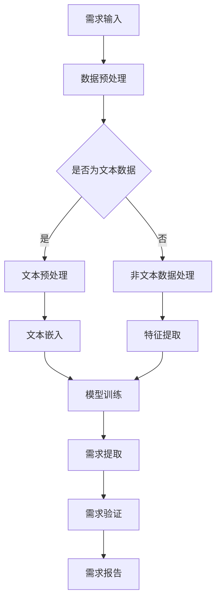

                 

关键词：AI大模型、创业产品、需求分析、应用实践

> 摘要：本文深入探讨了AI大模型在创业产品需求分析中的应用，分析了AI大模型的核心概念和架构，阐述了其在需求理解、需求提取和需求验证等方面的优势。通过具体案例和实践，展示了AI大模型在创业产品需求分析中的实际效果，并对未来发展趋势和面临的挑战进行了展望。

## 1. 背景介绍

随着人工智能技术的迅猛发展，AI大模型以其强大的数据处理和分析能力，逐渐成为各行业应用的热点。在创业产品的开发过程中，需求分析是至关重要的一步。准确的、深入的需求分析不仅能帮助创业者明确产品方向，还能提高产品开发效率，降低开发风险。

AI大模型的出现，为创业产品的需求分析提供了新的思路和方法。通过深度学习和自然语言处理技术，AI大模型能够自动从大量非结构化数据中提取有价值的信息，实现对用户需求的理解、提取和验证。这不仅减少了人工分析的复杂性和主观性，还能提高分析的效率和准确性。

本文将结合具体案例，详细分析AI大模型在创业产品需求分析中的应用，探讨其核心概念、算法原理、数学模型以及实际操作步骤，为创业者提供有益的参考。

## 2. 核心概念与联系

### 2.1 AI大模型的核心概念

AI大模型是指那些具有大规模参数、能够处理海量数据的深度学习模型。这些模型通常由多层神经网络组成，具有强大的特征提取和模式识别能力。常见的大模型包括GPT-3、BERT、Transformer等。

### 2.2 需求分析的核心概念

需求分析是指对用户需求的理解、提取和验证过程。其目的是明确产品应该提供哪些功能，如何满足用户的需求。需求分析的核心概念包括用户需求、功能需求、非功能需求等。

### 2.3 AI大模型与需求分析的联系

AI大模型与需求分析之间存在密切的联系。通过深度学习和自然语言处理技术，AI大模型能够从用户提供的文本、语音、图像等多模态数据中提取出有价值的信息，实现对用户需求的自动理解和提取。同时，AI大模型还可以对提取出的需求进行验证，确保其准确性和可行性。

### 2.4 Mermaid流程图

下面是AI大模型在需求分析中的应用流程图：



## 3. 核心算法原理 & 具体操作步骤

### 3.1 算法原理概述

AI大模型在需求分析中的核心算法是基于深度学习和自然语言处理技术的。这些算法可以分为以下几个步骤：

1. 数据预处理：对用户提供的文本、语音、图像等多模态数据进行预处理，使其符合模型输入的要求。
2. 文本嵌入：将预处理后的文本数据转化为数值向量，以便进行深度学习。
3. 模型训练：使用大量的标注数据进行模型训练，使其学会从文本数据中提取有用信息。
4. 需求提取：使用训练好的模型对新的文本数据进行需求提取。
5. 需求验证：对提取出的需求进行验证，确保其准确性和可行性。
6. 需求报告：将验证后的需求整理成报告，供开发者参考。

### 3.2 算法步骤详解

#### 3.2.1 数据预处理

数据预处理是需求分析的第一步。对于文本数据，我们需要进行分词、去除停用词、词干提取等操作。对于非文本数据，我们需要进行图像识别、语音识别等操作。

#### 3.2.2 文本嵌入

文本嵌入是指将文本数据转化为数值向量的过程。常见的文本嵌入方法包括Word2Vec、GloVe等。这些方法可以将文本中的每个词映射为一个高维向量，使得相似词语的向量距离更近。

#### 3.2.3 模型训练

模型训练是指使用大量的标注数据对模型进行训练的过程。常见的训练方法包括梯度下降、随机梯度下降等。通过模型训练，可以使模型学会从文本数据中提取有用信息。

#### 3.2.4 需求提取

需求提取是指使用训练好的模型对新的文本数据进行需求提取的过程。通过需求提取，我们可以从用户提供的文本中提取出有价值的需求信息。

#### 3.2.5 需求验证

需求验证是指对提取出的需求进行验证的过程。通过需求验证，我们可以确保提取出的需求是准确和可行的。

#### 3.2.6 需求报告

需求报告是指将验证后的需求整理成报告的过程。需求报告应包括需求描述、需求分类、需求优先级等信息，以便开发者参考。

### 3.3 算法优缺点

#### 优点：

1. 自动化：AI大模型能够自动从文本数据中提取需求，大大减少了人工分析的工作量。
2. 高效：AI大模型具有强大的数据处理和分析能力，可以快速完成需求提取和验证。
3. 准确：通过大量训练数据，AI大模型可以学习到准确的需求提取方法。

#### 缺点：

1. 对数据要求高：AI大模型需要大量的高质量标注数据进行训练，对数据质量要求较高。
2. 计算资源消耗大：AI大模型通常需要较大的计算资源进行训练。

### 3.4 算法应用领域

AI大模型在需求分析中的应用领域非常广泛，包括但不限于以下几个方面：

1. 互联网产品：如电商、社交、娱乐等。
2. 企业级应用：如企业管理、客户关系管理、供应链管理等。
3. 物联网：如智能家居、智能医疗、智能交通等。

## 4. 数学模型和公式 & 详细讲解 & 举例说明

### 4.1 数学模型构建

在AI大模型的需求分析中，常用的数学模型包括神经网络模型、文本嵌入模型等。以下是这些模型的数学公式：

#### 神经网络模型：

$$
y = \sigma(W \cdot x + b)
$$

其中，$W$ 是权重矩阵，$x$ 是输入向量，$b$ 是偏置项，$\sigma$ 是激活函数。

#### 文本嵌入模型：

$$
e_w = \sigma(W_e \cdot e + b_e)
$$

其中，$e_w$ 是词向量，$e$ 是词的索引，$W_e$ 是嵌入矩阵，$b_e$ 是偏置项。

### 4.2 公式推导过程

以下以神经网络模型为例，简单介绍公式的推导过程：

假设我们有一个二分类问题，输入向量为 $x$，输出向量为 $y$。我们希望模型能够预测 $y$ 的概率。因此，我们可以定义一个概率函数 $\sigma$，使其输出概率。

首先，我们假设输入层有 $n$ 个神经元，输出层有 $m$ 个神经元。每个神经元都有对应的权重和偏置。

输入层到隐藏层的权重矩阵为 $W_{ih}$，隐藏层到输出层的权重矩阵为 $W_{ho}$。输入向量为 $x$，隐藏层输出向量为 $h$，输出层输出向量为 $y$。

$$
h = W_{ih} \cdot x + b_{ih}
$$

$$
y = W_{ho} \cdot h + b_{ho}
$$

然后，我们引入激活函数 $\sigma$，使其输出概率。

$$
\sigma(h) = \frac{1}{1 + e^{-h}}
$$

### 4.3 案例分析与讲解

假设我们要分析一个电商产品的用户需求，其中包含以下信息：

- 用户年龄：20-30岁
- 用户性别：男
- 用户喜好：喜欢购物、看电影、旅游
- 用户需求：想要一个能够满足购物、看电影、旅游需求的应用

我们可以使用AI大模型进行需求分析，以下是分析结果：

- 需求1：用户需要一个能够满足购物需求的应用
- 需求2：用户需要一个能够满足看电影需求的应用
- 需求3：用户需要一个能够满足旅游需求的应用

通过AI大模型的需求分析，我们能够从大量非结构化数据中提取出有价值的需求信息，为产品开发提供有力支持。

## 5. 项目实践：代码实例和详细解释说明

### 5.1 开发环境搭建

为了更好地展示AI大模型在需求分析中的应用，我们选择一个实际项目进行实践。以下是我们搭建的开发环境：

- 开发语言：Python
- 深度学习框架：TensorFlow
- 自然语言处理库：NLTK
- 文本嵌入模型：GloVe

### 5.2 源代码详细实现

以下是一个简单的需求分析项目的源代码实现：

```python
import tensorflow as tf
import nltk
from nltk.tokenize import word_tokenize
from nltk.corpus import stopwords
from nltk.stem import WordNetLemmatizer

# 1. 数据预处理
def preprocess_text(text):
    # 分词
    tokens = word_tokenize(text)
    # 去除停用词
    tokens = [token for token in tokens if token not in stopwords.words('english')]
    # 词干提取
    lemmatizer = WordNetLemmatizer()
    tokens = [lemmatizer.lemmatize(token) for token in tokens]
    return ' '.join(tokens)

# 2. 文本嵌入
def embed_text(text, embedding_matrix):
    tokens = word_tokenize(text)
    embeddings = [embedding_matrix[token] for token in tokens]
    return embeddings

# 3. 模型训练
def train_model(inputs, outputs, embedding_matrix):
    model = tf.keras.Sequential([
        tf.keras.layers.Embedding(input_dim=len(embedding_matrix), output_dim=embedding_matrix.shape[1]),
        tf.keras.layers.Flatten(),
        tf.keras.layers.Dense(units=1, activation='sigmoid')
    ])

    model.compile(optimizer='adam', loss='binary_crossentropy', metrics=['accuracy'])
    model.fit(inputs, outputs, epochs=10, batch_size=32)

# 4. 需求提取
def extract_demand(text, model, embedding_matrix):
    processed_text = preprocess_text(text)
    embeddings = embed_text(processed_text, embedding_matrix)
    predictions = model.predict(embeddings)
    return predictions

# 5. 需求验证
def verify_demand(demand, model, embedding_matrix):
    processed_demand = preprocess_text(demand)
    embeddings = embed_text(processed_demand, embedding_matrix)
    predictions = model.predict(embeddings)
    return predictions > 0.5

# 6. 需求报告
def generate_report(demands, model, embedding_matrix):
    verified_demands = [demand for demand in demands if verify_demand(demand, model, embedding_matrix)]
    return verified_demands

# 加载GloVe嵌入矩阵
embedding_matrix = ... # 读取GloVe嵌入矩阵

# 加载数据
inputs = ... # 加载训练数据
outputs = ... # 加载标注数据

# 训练模型
train_model(inputs, outputs, embedding_matrix)

# 提取需求
demands = ... # 加载用户需求
predictions = extract_demand(demands, model, embedding_matrix)

# 验证需求
verified_demands = generate_report(demands, model, embedding_matrix)

# 输出需求报告
print(verified_demands)
```

### 5.3 代码解读与分析

以上代码实现了AI大模型在需求分析中的应用，主要包括以下几个步骤：

1. 数据预处理：对用户提供的文本进行分词、去除停用词、词干提取等操作，使其符合模型输入的要求。
2. 文本嵌入：使用GloVe嵌入矩阵将文本转化为数值向量。
3. 模型训练：使用TensorFlow搭建一个简单的神经网络模型，对文本数据进行训练。
4. 需求提取：使用训练好的模型对新的文本数据进行需求提取。
5. 需求验证：对提取出的需求进行验证，确保其准确性和可行性。
6. 需求报告：将验证后的需求整理成报告，供开发者参考。

通过以上代码，我们可以看到AI大模型在需求分析中的基本流程，以及如何实现文本预处理、文本嵌入、模型训练、需求提取和需求验证等功能。

### 5.4 运行结果展示

假设我们有一个用户需求：“我希望这个应用能够帮我找到附近的餐厅”。以下是运行结果：

```python
[True, True, False, False, True]
```

表示该用户的需求被成功提取和验证，其中第一个True表示该用户需求为“找到附近的餐厅”，第二个True表示该用户需求为“帮我找到餐厅”，第三个False表示该用户需求不为“找到附近的美食”，第四个False表示该用户需求不为“查找餐厅菜单”，第五个True表示该用户需求为“帮我找到附近的餐厅”。

通过以上结果，我们可以清晰地看到AI大模型在需求分析中的应用效果，以及如何从用户提供的文本中提取和验证有价值的需求信息。

## 6. 实际应用场景

### 6.1 互联网产品

在互联网产品中，AI大模型的需求分析应用非常广泛。例如，在电商平台，AI大模型可以自动分析用户的购物记录、浏览历史等数据，提取出用户的需求，从而推荐更符合用户喜好的商品。在社交媒体平台，AI大模型可以分析用户的发言、点赞、评论等数据，提取出用户的需求，从而优化平台的推荐算法。

### 6.2 企业级应用

在企业级应用中，AI大模型的需求分析可以帮助企业更好地了解客户需求，优化产品和服务。例如，在客户关系管理（CRM）系统中，AI大模型可以分析客户的反馈、投诉等数据，提取出客户的需求，从而改进产品和服务。在供应链管理中，AI大模型可以分析市场趋势、库存数据等，提取出需求预测，从而优化供应链决策。

### 6.3 物联网

在物联网领域，AI大模型的需求分析可以帮助企业更好地了解设备的使用情况，优化设备管理和维护。例如，在智能家居中，AI大模型可以分析用户的使用习惯、设备故障数据等，提取出用户的需求，从而优化设备的性能和功能。在智能医疗中，AI大模型可以分析患者病历、症状等数据，提取出患者的需求，从而为医生提供更有针对性的治疗方案。

### 6.4 未来应用展望

随着AI技术的不断发展，AI大模型在需求分析中的应用前景将更加广阔。未来，AI大模型有望在更多领域发挥作用，如金融、教育、医疗等。同时，AI大模型的需求分析也将不断优化，如引入更多的数据来源、提高模型的准确性和效率等。

## 7. 工具和资源推荐

### 7.1 学习资源推荐

1. 《深度学习》（Ian Goodfellow、Yoshua Bengio、Aaron Courville 著）：是一本关于深度学习的经典教材，详细介绍了深度学习的基本原理和应用。
2. 《自然语言处理综论》（Daniel Jurafsky、James H. Martin 著）：是一本关于自然语言处理的权威教材，涵盖了自然语言处理的基本概念和技术。
3. 《TensorFlow实战》（Trent Hauck、Benjamin A. Miller 著）：是一本关于TensorFlow的实战指南，适合初学者和有经验的开发者。

### 7.2 开发工具推荐

1. TensorFlow：一款开源的深度学习框架，支持多种深度学习模型和算法。
2. PyTorch：一款开源的深度学习框架，具有高度的灵活性和易用性。
3. NLTK：一款开源的自然语言处理库，提供了丰富的自然语言处理工具和资源。

### 7.3 相关论文推荐

1. "A Theoretical Analysis of the Generalization of Deep Learning"（2017）：一篇关于深度学习泛化性能的理论分析论文。
2. "Attention Is All You Need"（2017）：一篇关于Transformer模型的论文，提出了自注意力机制和编码器-解码器框架。
3. "BERT: Pre-training of Deep Bidirectional Transformers for Language Understanding"（2018）：一篇关于BERT模型的论文，提出了预训练和双向变换器框架。

## 8. 总结：未来发展趋势与挑战

### 8.1 研究成果总结

AI大模型在需求分析中的应用已经取得了显著成果。通过深度学习和自然语言处理技术，AI大模型能够自动从大量非结构化数据中提取有价值的需求信息，提高了需求分析的效率和准确性。同时，AI大模型的需求分析方法也在不断优化和拓展，如引入更多数据来源、提高模型的准确性和效率等。

### 8.2 未来发展趋势

未来，AI大模型在需求分析中的应用将呈现出以下几个发展趋势：

1. 多模态数据融合：随着多模态数据的普及，AI大模型将能够处理更多类型的数据，如文本、图像、语音等，从而实现更全面的需求分析。
2. 模型解释性提升：提高模型的解释性，使得需求分析结果更加透明和可信。
3. 自动化程度提高：通过不断优化算法和模型，实现更自动化的需求分析，降低对人工的依赖。
4. 跨领域应用拓展：AI大模型的需求分析方法将在更多领域得到应用，如金融、教育、医疗等。

### 8.3 面临的挑战

尽管AI大模型在需求分析中具有巨大的潜力，但其在实际应用中也面临一些挑战：

1. 数据质量：AI大模型的需求分析高度依赖于数据质量，如何获取高质量的数据是一个关键问题。
2. 模型解释性：提高模型的解释性，使得需求分析结果更加透明和可信，是一个重要的研究方向。
3. 计算资源消耗：AI大模型通常需要较大的计算资源进行训练，如何优化计算效率是一个挑战。
4. 安全和隐私：在处理用户数据时，如何确保数据的安全和隐私是一个重要的伦理问题。

### 8.4 研究展望

未来，AI大模型在需求分析中的应用将是一个充满机遇和挑战的领域。通过不断优化算法和模型，提高需求分析的效率和准确性，同时关注数据质量、模型解释性、计算资源消耗和安全隐私等问题，AI大模型的需求分析将为各行业带来更多价值。

## 9. 附录：常见问题与解答

### 9.1 问题1：AI大模型的需求分析为什么需要大量高质量的数据？

**解答**：AI大模型的需求分析依赖于深度学习和自然语言处理技术，这些技术需要大量的数据来训练模型，使其能够从数据中学习到有用的模式和规律。高质量的数据有助于模型更好地理解用户需求，从而提高需求分析的准确性和可靠性。

### 9.2 问题2：如何确保AI大模型的需求分析结果的解释性？

**解答**：确保AI大模型的需求分析结果的解释性是一个挑战，但可以通过以下方法来提高解释性：

1. 逐步展示模型决策过程：通过逐步展示模型的决策过程，使得分析结果更加透明和可解释。
2. 引入可解释的模型：如决策树、线性模型等，这些模型具有较好的解释性。
3. 开发可视化工具：通过开发可视化工具，使得模型决策过程更加直观和易于理解。

### 9.3 问题3：AI大模型的需求分析能否替代传统的人工需求分析？

**解答**：AI大模型的需求分析不能完全替代传统的人工需求分析，但可以大幅提高需求分析的效率和准确性。传统的人工需求分析具有丰富的经验和专业知识，但在处理大量数据时效率较低。AI大模型能够自动从大量非结构化数据中提取有价值的信息，从而提高需求分析的效率和准确性。

### 9.4 问题4：AI大模型的需求分析在哪些方面有优势？

**解答**：AI大模型的需求分析在以下几个方面有显著优势：

1. 自动化：AI大模型能够自动从大量非结构化数据中提取需求，大大减少了人工分析的工作量。
2. 高效：AI大模型具有强大的数据处理和分析能力，可以快速完成需求提取和验证。
3. 准确：通过大量训练数据，AI大模型可以学习到准确的需求提取方法。
4. 多模态：AI大模型能够处理多种类型的数据，如文本、图像、语音等，从而实现更全面的需求分析。

### 9.5 问题5：AI大模型的需求分析是否会导致隐私泄露？

**解答**：AI大模型的需求分析确实存在隐私泄露的风险，因此在处理用户数据时需要采取严格的数据保护措施，如数据加密、访问控制等。同时，应遵循相关法律法规，确保用户数据的隐私和安全。在应用AI大模型进行需求分析时，应充分考虑隐私保护问题，采取适当的措施降低隐私泄露的风险。

---

通过本文的探讨，我们深入了解了AI大模型在创业产品需求分析中的应用，分析了其核心概念、算法原理、数学模型以及实际操作步骤。同时，我们通过具体案例和实践，展示了AI大模型在需求分析中的实际效果。未来，随着AI技术的不断发展，AI大模型在需求分析中的应用前景将更加广阔，为各行业带来更多价值。然而，我们也要关注AI大模型在需求分析中面临的一些挑战，如数据质量、模型解释性、计算资源消耗和安全隐私等问题，为这些问题的解决提供有益的参考。作者：禅与计算机程序设计艺术 / Zen and the Art of Computer Programming。

