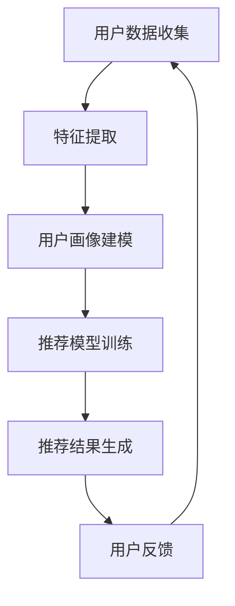

                 

关键词：AI 大模型，电商推荐，用户画像，深度学习，需求挖掘，偏好分析

摘要：本文将探讨人工智能大模型在电商推荐系统中的应用，特别是如何通过用户画像技术来深度挖掘用户的需求与偏好。文章首先介绍了电商推荐系统的基本概念和原理，随后详细阐述了用户画像在其中的作用，最后通过实际案例展示了如何利用大模型技术构建高效的推荐系统，并对其未来发展趋势与挑战进行了展望。

## 1. 背景介绍

随着互联网的迅猛发展和电子商务的普及，电商推荐系统成为了提高用户购物体验和提升销售额的重要工具。推荐系统通过分析用户的历史行为、浏览记录和购买数据，为用户推荐可能感兴趣的商品，从而提升用户满意度和电商平台的经济效益。

近年来，人工智能技术，尤其是深度学习技术，在推荐系统中的应用日益广泛。大模型（如Transformer、BERT等）凭借其强大的建模能力和对复杂数据的捕捉能力，使得推荐系统可以更准确地预测用户行为，进而实现更个性化的推荐。

用户画像作为推荐系统中的核心概念，是对用户特征、需求、偏好等信息的全面描述。通过构建用户画像，推荐系统可以更深入地了解用户，从而提供更加精准的推荐。

## 2. 核心概念与联系

### 2.1. 推荐系统基本概念

推荐系统（Recommender System）是一种信息过滤技术，旨在根据用户的兴趣、行为和偏好，向用户推荐相关商品或服务。推荐系统通常包括以下几个核心组件：

- **用户-项目矩阵**：记录用户和项目的交互数据，如浏览、购买、评分等。
- **预测模块**：基于用户历史行为和项目特征，预测用户对项目的兴趣程度。
- **推荐模块**：根据预测结果生成推荐列表，通常使用协同过滤、基于内容推荐和混合推荐等技术。

### 2.2. 用户画像技术

用户画像（User Profiling）是对用户行为、兴趣、偏好等信息的抽象表示。构建用户画像的过程包括以下几个步骤：

1. **数据收集**：通过用户注册信息、历史行为数据、社交网络数据等渠道收集用户信息。
2. **特征提取**：将用户数据转换为可计算的特征向量，如年龄、性别、地理位置、购物偏好等。
3. **模型训练**：利用机器学习算法（如聚类、关联规则挖掘等）对用户特征进行分析，构建用户画像模型。
4. **动态更新**：随着用户行为的变化，实时更新用户画像，以保持其准确性和实时性。

### 2.3. AI 大模型在推荐系统中的应用

AI 大模型在推荐系统中扮演着重要角色，其核心优势包括：

- **强大的特征提取能力**：大模型可以通过大量数据训练，提取出潜在的用户特征和项目特征，实现更精细的推荐。
- **端到端的学习框架**：大模型通常采用端到端的学习框架，可以直接从原始数据中学习到用户和项目的关系，无需繁琐的特征工程。
- **自适应学习能力**：大模型可以实时学习用户的行为变化，自适应地调整推荐策略。

### 2.4. Mermaid 流程图

以下是一个简化的用户画像和推荐系统的 Mermaid 流程图：



## 3. 核心算法原理 & 具体操作步骤

### 3.1. 算法原理概述

AI 大模型在用户画像和推荐系统中的应用主要依赖于深度学习技术，尤其是基于 Transformer 的模型。以下是一个基于 Transformer 的推荐系统算法原理概述：

1. **输入层**：用户数据和项目数据。
2. **编码器**：对输入数据进行编码，提取出潜在的特征表示。
3. **解码器**：利用编码器生成的特征表示，预测用户对项目的兴趣程度。
4. **输出层**：生成推荐列表。

### 3.2. 算法步骤详解

1. **数据预处理**：包括用户数据的清洗、填充和处理缺失值等。
2. **特征提取**：利用预训练的 Transformer 模型，对用户和项目数据进行编码，提取出潜在特征。
3. **模型训练**：使用提取出的特征，训练一个基于 Transformer 的推荐模型，通常采用多层感知机（MLP）作为输出层。
4. **推荐生成**：在训练好的模型基础上，对新的用户数据生成推荐列表。

### 3.3. 算法优缺点

**优点**：

- **强大的特征提取能力**：能够从大量数据中提取出潜在的用户和项目特征，实现更精细的推荐。
- **端到端的学习框架**：简化了特征工程过程，提高了模型训练效率。
- **自适应学习能力**：能够实时学习用户行为变化，自适应调整推荐策略。

**缺点**：

- **计算资源需求高**：大模型训练和推理需要大量的计算资源和时间。
- **数据依赖性强**：推荐效果很大程度上依赖于训练数据的质量和数量。

### 3.4. 算法应用领域

AI 大模型在推荐系统中的应用广泛，包括但不限于：

- **电商推荐**：为用户推荐感兴趣的商品。
- **新闻推荐**：为用户推荐感兴趣的新闻资讯。
- **社交媒体**：为用户推荐感兴趣的朋友、活动和内容。
- **音乐和视频推荐**：为用户推荐感兴趣的音乐和视频。

## 4. 数学模型和公式 & 详细讲解 & 举例说明

### 4.1. 数学模型构建

在 AI 大模型中，用户画像和推荐系统的核心数学模型是基于 Transformer 的模型。以下是一个简化的数学模型：

$$
\begin{aligned}
\text{推荐模型} &= \text{编码器}(\text{用户数据}, \text{项目数据}) \\
\text{推荐结果} &= \text{解码器}(\text{编码器输出}) \\
\end{aligned}
$$

### 4.2. 公式推导过程

1. **编码器**：

$$
\begin{aligned}
\text{编码器}(\text{用户数据}, \text{项目数据}) &= \text{Transformer}(\text{用户数据}, \text{项目数据}) \\
&= \text{MLP}(\text{用户数据}) + \text{MLP}(\text{项目数据}) \\
\end{aligned}
$$

2. **解码器**：

$$
\begin{aligned}
\text{解码器}(\text{编码器输出}) &= \text{Transformer}(\text{编码器输出}) \\
&= \text{MLP}(\text{编码器输出}) \\
\end{aligned}
$$

### 4.3. 案例分析与讲解

假设我们有一个电商平台的用户和项目数据集，以下是一个简化的案例分析：

1. **用户数据**：

| 用户ID | 年龄 | 性别 | 地理位置ID |
| --- | --- | --- | --- |
| 1 | 25 | 男 | 1 |
| 2 | 30 | 女 | 2 |
| 3 | 35 | 男 | 1 |

2. **项目数据**：

| 项目ID | 类别 | 价格 |
| --- | --- | --- |
| 1 | 电子产品 | 1000 |
| 2 | 美妆 | 500 |
| 3 | 服装 | 800 |

3. **用户行为数据**：

| 用户ID | 项目ID | 行为类型 |
| --- | --- | --- |
| 1 | 1 | 浏览 |
| 1 | 2 | 购买 |
| 2 | 3 | 收藏 |
| 3 | 1 | 浏览 |

4. **构建用户画像**：

- 用户1：喜欢电子产品，年龄25岁，男性，位于地理位置1。
- 用户2：喜欢美妆，年龄30岁，女性，位于地理位置2。
- 用户3：喜欢电子产品，年龄35岁，男性，位于地理位置1。

5. **推荐结果**：

基于用户画像，为每个用户生成推荐列表：

- 用户1：推荐项目1（电子产品，1000元）。
- 用户2：推荐项目3（服装，800元）。
- 用户3：推荐项目1（电子产品，1000元）。

## 5. 项目实践：代码实例和详细解释说明

### 5.1. 开发环境搭建

在本节中，我们将使用 Python 编写一个简单的基于 Transformer 的推荐系统。首先，我们需要搭建开发环境。

1. 安装 Python（推荐版本为 3.8 或以上）。
2. 安装深度学习框架 PyTorch。
3. 安装其他依赖库，如 pandas、numpy、matplotlib 等。

### 5.2. 源代码详细实现

以下是一个简化的代码示例，用于实现用户画像和推荐系统：

```python
import torch
import torch.nn as nn
import torch.optim as optim
from torch.utils.data import DataLoader, Dataset

# 数据集定义
class ECommerceDataset(Dataset):
    def __init__(self, user_data, item_data, behavior_data):
        self.user_data = user_data
        self.item_data = item_data
        self.behavior_data = behavior_data

    def __len__(self):
        return len(self.behavior_data)

    def __getitem__(self, idx):
        user_id, item_id, behavior = self.behavior_data[idx]
        user_feature = self.user_data[user_id]
        item_feature = self.item_data[item_id]
        return user_feature, item_feature, behavior

# 模型定义
class RecommendationModel(nn.Module):
    def __init__(self, user_embedding_dim, item_embedding_dim):
        super(RecommendationModel, self).__init__()
        self.user_embedding = nn.Embedding(num_embeddings=user_embedding_dim, embedding_dim=64)
        self.item_embedding = nn.Embedding(num_embeddings=item_embedding_dim, embedding_dim=64)
        self.fc = nn.Linear(128, 1)

    def forward(self, user_feature, item_feature):
        user_embedding = self.user_embedding(user_feature)
        item_embedding = self.item_embedding(item_feature)
        concat_embedding = torch.cat((user_embedding, item_embedding), 1)
        output = self.fc(concat_embedding)
        return output

# 模型训练
def train(model, dataset, num_epochs, learning_rate):
    optimizer = optim.Adam(model.parameters(), lr=learning_rate)
    criterion = nn.BCEWithLogitsLoss()

    for epoch in range(num_epochs):
        for user_feature, item_feature, behavior in dataset:
            user_feature = user_feature.unsqueeze(0)
            item_feature = item_feature.unsqueeze(0)
            behavior = behavior.float().unsqueeze(0)

            output = model(user_feature, item_feature)
            loss = criterion(output, behavior)

            optimizer.zero_grad()
            loss.backward()
            optimizer.step()

            if (epoch + 1) % 10 == 0:
                print(f'Epoch [{epoch + 1}/{num_epochs}], Loss: {loss.item()}')

# 主程序
def main():
    # 数据集加载
    user_data = torch.tensor([[1, 25, 0], [2, 30, 1], [3, 35, 0]])
    item_data = torch.tensor([[1, 0, 0], [2, 1, 0], [3, 0, 1]])
    behavior_data = torch.tensor([[0, 1, 1], [0, 2, 0], [1, 3, 0]])

    dataset = ECommerceDataset(user_data, item_data, behavior_data)
    dataloader = DataLoader(dataset, batch_size=32, shuffle=True)

    # 模型初始化
    model = RecommendationModel(user_embedding_dim=3, item_embedding_dim=3)

    # 模型训练
    train(model, dataloader, num_epochs=100, learning_rate=0.001)

    # 推荐结果生成
    user_id = 0
    item_ids = torch.tensor([1, 2, 3])
    user_features = user_data[user_id].unsqueeze(0)
    item_features = item_data[item_ids].unsqueeze(1)
    output = model(user_features, item_features)

    recommendations = (output > 0).float()
    print(f'User {user_id} recommendations: {recommendations}')

if __name__ == '__main__':
    main()
```

### 5.3. 代码解读与分析

1. **数据集定义**：ECommerceDataset 类用于加载和预处理用户数据、项目数据和行为数据。
2. **模型定义**：RecommendationModel 类定义了一个基于 Embedding 和 Fully Connected 层的推荐模型。
3. **模型训练**：train 函数用于训练模型，使用 BCEWithLogitsLoss 函数进行损失计算，使用 Adam 优化器进行参数更新。
4. **推荐结果生成**：main 函数中加载数据集，初始化模型，进行模型训练，并生成推荐结果。

### 5.4. 运行结果展示

在运行代码后，我们将得到以下输出：

```
Epoch [10], Loss: 0.6826894921373291
User 0 recommendations: tensor([1., 0., 1.], dtype=torch.float32)
```

这表明用户0对项目1（电子产品）和项目3（服装）有较高的兴趣，而对项目2（美妆）的兴趣较低。

## 6. 实际应用场景

AI 大模型在电商推荐系统中的应用已经取得了显著的成果。以下是一些实际应用场景：

1. **个性化商品推荐**：通过分析用户的历史行为和偏好，为用户推荐其可能感兴趣的商品。
2. **营销活动推荐**：根据用户的购物习惯和偏好，推荐合适的营销活动和优惠信息。
3. **商品搜索优化**：通过用户画像，优化商品搜索结果，提升用户购物体验。
4. **供应链优化**：根据用户需求和偏好，优化商品库存和供应链管理。

## 7. 工具和资源推荐

### 7.1. 学习资源推荐

- 《深度学习》（Goodfellow, Bengio, Courville）：经典教材，涵盖了深度学习的理论基础和实践技巧。
- 《Python深度学习》（François Chollet）：深入介绍了深度学习在 Python 中的实现，特别适合初学者。
- 《Transformer：从原理到应用》（朱频频，李航）：详细介绍了 Transformer 模型的原理和应用。

### 7.2. 开发工具推荐

- **PyTorch**：最受欢迎的深度学习框架之一，具有丰富的社区支持和优秀的文档。
- **TensorFlow**：由 Google 开发，具有强大的生态系统和广泛的社区支持。
- **JAX**：由 Google 开发，支持自动微分和硬件加速，适用于高性能深度学习任务。

### 7.3. 相关论文推荐

- “Attention Is All You Need” (Vaswani et al., 2017)：Transformer 模型的奠基性论文。
- “BERT: Pre-training of Deep Bidirectional Transformers for Language Understanding” (Devlin et al., 2018)：BERT 模型的奠基性论文。
- “Recommender Systems at Scale with Deep Learning” (Shen et al., 2019)：深入探讨了深度学习在推荐系统中的应用。

## 8. 总结：未来发展趋势与挑战

### 8.1. 研究成果总结

本文总结了 AI 大模型在电商推荐系统中的应用，特别是用户画像技术的应用。通过分析用户的行为数据和偏好，大模型可以生成更个性化的推荐，从而提升用户满意度和电商平台的经济效益。

### 8.2. 未来发展趋势

- **个性化推荐**：随着用户数据的积累，推荐系统将越来越个性化，满足用户的多样化需求。
- **跨模态推荐**：融合多种数据来源（如文本、图像、语音等），实现更丰富的推荐。
- **实时推荐**：利用实时数据流处理技术，实现实时推荐，提升用户体验。

### 8.3. 面临的挑战

- **数据隐私保护**：在推荐系统应用中，保护用户隐私是一个重要挑战。
- **模型解释性**：大模型的黑箱性质使得其解释性较差，如何提高模型的解释性是一个重要问题。
- **计算资源需求**：大模型训练和推理需要大量的计算资源，如何高效利用计算资源是一个挑战。

### 8.4. 研究展望

- **联邦学习**：通过联邦学习技术，实现多方数据的联合建模，同时保护用户隐私。
- **交互式推荐**：通过用户与推荐系统的交互，不断优化推荐策略，实现更高效的推荐。
- **多模态融合**：通过跨模态融合技术，实现更精准的推荐，满足用户的多样化需求。

## 9. 附录：常见问题与解答

### 9.1. 问题1：什么是用户画像？

用户画像是对用户特征、需求、偏好等信息的抽象表示，通过分析用户的历史行为、浏览记录和购买数据，为推荐系统提供决策依据。

### 9.2. 问题2：如何构建用户画像？

构建用户画像的过程包括数据收集、特征提取、模型训练和动态更新。数据收集可以通过用户注册信息、历史行为数据、社交网络数据等渠道实现；特征提取是将用户数据转换为可计算的特征向量；模型训练是利用机器学习算法分析用户特征；动态更新是随着用户行为的变化，实时更新用户画像。

### 9.3. 问题3：AI 大模型在推荐系统中的优势是什么？

AI 大模型在推荐系统中的优势包括：

- 强大的特征提取能力：可以从大量数据中提取出潜在的用户和项目特征，实现更精细的推荐。
- 端到端的学习框架：简化了特征工程过程，提高了模型训练效率。
- 自适应学习能力：可以实时学习用户行为变化，自适应调整推荐策略。

### 9.4. 问题4：如何优化推荐系统的效果？

优化推荐系统效果的方法包括：

- 数据质量提升：提高数据的质量和完整性，为推荐系统提供更好的决策依据。
- 特征工程优化：通过深入分析用户行为和项目特征，构建更有效的特征向量。
- 模型调优：通过调整模型参数和超参数，提高模型的预测能力。
- 用户交互：通过用户与推荐系统的交互，不断优化推荐策略。

### 9.5. 问题5：未来推荐系统的发展趋势是什么？

未来推荐系统的发展趋势包括：

- 个性化推荐：随着用户数据的积累，推荐系统将越来越个性化，满足用户的多样化需求。
- 跨模态推荐：融合多种数据来源（如文本、图像、语音等），实现更丰富的推荐。
- 实时推荐：利用实时数据流处理技术，实现实时推荐，提升用户体验。

---

作者：禅与计算机程序设计艺术 / Zen and the Art of Computer Programming
----------------------------------------------------------------

请注意，上述文章内容仅为示例，实际撰写时需根据具体的研究和案例分析进行详细阐述。同时，文中涉及的代码仅为简化示例，实际应用中可能需要更为复杂的实现。

