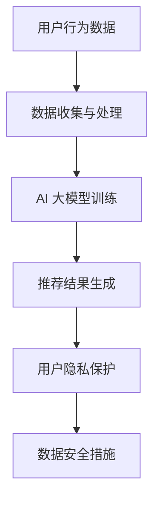

                 

关键词：AI 大模型、电商搜索推荐、数据安全、用户隐私、算法策略

摘要：本文旨在探讨 AI 大模型在电商搜索推荐中的数据安全策略，分析现有问题及挑战，并提出一套全面的解决方案，旨在保障数据安全与用户隐私。

## 1. 背景介绍

随着互联网和大数据技术的发展，电商搜索推荐系统已经成为了电商平台的标配，为用户提供了个性化的商品推荐服务。然而，在实现个性化推荐的同时，用户隐私保护和数据安全问题也日益凸显。特别是 AI 大模型的广泛应用，使得数据处理和分析能力得到了大幅提升，但同时也带来了数据泄露和隐私风险。

## 2. 核心概念与联系

### 2.1 AI 大模型

AI 大模型是指使用海量数据进行训练，具有强大数据分析和预测能力的深度学习模型。在电商搜索推荐中，AI 大模型主要用于用户行为分析、商品推荐、广告投放等方面。

### 2.2 数据安全

数据安全是指防止数据泄露、篡改、丢失等风险，确保数据的完整性、保密性和可用性。在电商搜索推荐中，数据安全主要包括用户隐私保护、数据加密传输和存储等。

### 2.3 用户隐私

用户隐私是指用户在浏览、搜索和购买商品等过程中产生的个人信息，如用户 ID、浏览记录、购买行为等。用户隐私保护是数据安全的重要一环，关系到用户的信任和平台的发展。

### 2.4 数据安全与用户隐私关系

数据安全与用户隐私密切相关。在电商搜索推荐中，数据安全直接关系到用户隐私的保护。如果数据安全措施不到位，用户隐私可能会受到侵害，导致信任危机和声誉损失。因此，在电商搜索推荐中，保障数据安全和用户隐私是同等重要的任务。

### 2.5 Mermaid 流程图



## 3. 核心算法原理 & 具体操作步骤

### 3.1 算法原理概述

AI 大模型在电商搜索推荐中的核心算法原理主要包括以下几个步骤：

1. 数据收集与处理：通过收集用户的浏览、搜索和购买行为数据，对数据进行清洗、预处理和特征提取。
2. AI 大模型训练：使用处理后的数据训练深度学习模型，如神经网络、决策树等，使其具备对用户行为进行预测和推荐的能力。
3. 推荐结果生成：根据训练好的模型，对用户进行个性化推荐，生成推荐结果。
4. 用户隐私保护：在数据处理和模型训练过程中，采取数据加密、匿名化等手段保护用户隐私。

### 3.2 算法步骤详解

#### 3.2.1 数据收集与处理

1. 数据收集：从电商平台的数据库中提取用户行为数据，如浏览记录、搜索关键词、购买行为等。
2. 数据清洗：对数据进行去重、补全和修正，确保数据的准确性。
3. 数据预处理：对数据进行归一化、标准化等处理，便于后续的特征提取。
4. 特征提取：从预处理后的数据中提取有用的特征，如用户兴趣、购买力等。

#### 3.2.2 AI 大模型训练

1. 选择合适的模型：根据业务需求，选择合适的深度学习模型，如卷积神经网络（CNN）、循环神经网络（RNN）等。
2. 数据分批处理：将数据集分成多个批次，对每个批次进行训练。
3. 模型训练：使用训练数据对模型进行训练，优化模型参数。
4. 模型评估：使用验证数据集对模型进行评估，调整模型参数。

#### 3.2.3 推荐结果生成

1. 用户行为预测：根据训练好的模型，预测用户未来的行为，如浏览、搜索、购买等。
2. 推荐结果生成：根据用户行为预测结果，生成个性化推荐结果。
3. 推荐结果排序：根据推荐结果的质量和相关性，对推荐结果进行排序。

#### 3.2.4 用户隐私保护

1. 数据加密：对用户行为数据进行加密，确保数据在传输和存储过程中的安全性。
2. 数据匿名化：对用户行为数据进行匿名化处理，消除个人身份信息。
3. 加密算法选择：根据业务需求，选择合适的加密算法，如 AES、RSA 等。
4. 安全审计：对数据处理和模型训练过程进行安全审计，确保数据安全和合规性。

### 3.3 算法优缺点

#### 优点

1. 高效性：AI 大模型能够处理海量数据，实现高效的数据分析和预测。
2. 个性化：根据用户行为数据，生成个性化的推荐结果，提高用户体验。
3. 智能性：基于深度学习算法，AI 大模型具有自学习和自适应能力，能够不断优化推荐效果。

#### 缺点

1. 数据依赖性：AI 大模型的训练和预测依赖于大量的用户行为数据，数据质量对模型效果有较大影响。
2. 隐私风险：用户行为数据涉及用户隐私，数据安全措施不到位可能导致隐私泄露。
3. 计算资源消耗：AI 大模型训练和预测需要大量的计算资源，对硬件设备有较高要求。

### 3.4 算法应用领域

AI 大模型在电商搜索推荐中的应用非常广泛，包括但不限于以下领域：

1. 商品推荐：根据用户行为数据，为用户提供个性化的商品推荐。
2. 广告投放：根据用户行为数据，为用户提供精准的广告投放。
3. 用户画像：通过分析用户行为数据，构建用户画像，为用户提供定制化服务。
4. 搜索优化：根据用户行为数据，优化搜索结果，提高搜索体验。

## 4. 数学模型和公式 & 详细讲解 & 举例说明

### 4.1 数学模型构建

在电商搜索推荐中，常用的数学模型包括基于协同过滤的推荐模型和基于内容的推荐模型。以下是这两种模型的基本数学模型：

#### 4.1.1 基于协同过滤的推荐模型

基于协同过滤的推荐模型主要通过分析用户之间的相似度，为用户提供推荐。其基本数学模型可以表示为：

$$
R_{ij} = \sum_{k \in N(i) \cap N(j)} w_{ik} w_{jk}
$$

其中，$R_{ij}$ 表示用户 $i$ 对商品 $j$ 的推荐评分，$N(i)$ 和 $N(j)$ 分别表示用户 $i$ 和用户 $j$ 的邻居集合，$w_{ik}$ 和 $w_{jk}$ 分别表示用户 $i$ 和用户 $j$ 对邻居商品 $k$ 的评分权重。

#### 4.1.2 基于内容的推荐模型

基于内容的推荐模型主要通过分析商品和用户之间的特征相似度，为用户提供推荐。其基本数学模型可以表示为：

$$
R_{ij} = \sum_{f \in F(j)} w_f s(f_i, f_j)
$$

其中，$R_{ij}$ 表示用户 $i$ 对商品 $j$ 的推荐评分，$F(j)$ 表示商品 $j$ 的特征集合，$w_f$ 表示特征 $f$ 的权重，$s(f_i, f_j)$ 表示特征 $f$ 在用户 $i$ 和商品 $j$ 之间的相似度。

### 4.2 公式推导过程

#### 4.2.1 基于协同过滤的推荐模型推导

基于协同过滤的推荐模型推导过程可以分为以下几个步骤：

1. 计算用户之间的相似度：根据用户之间的评分数据，计算用户之间的相似度。常用的相似度计算方法包括余弦相似度、皮尔逊相关系数等。
2. 计算邻居商品的评分权重：根据邻居用户的评分数据，计算邻居商品对用户 $i$ 的评分权重。评分权重可以反映邻居商品对用户 $i$ 的影响程度。
3. 计算推荐评分：根据邻居商品的评分权重，计算用户 $i$ 对商品 $j$ 的推荐评分。

#### 4.2.2 基于内容的推荐模型推导

基于内容的推荐模型推导过程可以分为以下几个步骤：

1. 提取商品和用户的特征：从商品和用户的数据中提取特征，如商品类别、品牌、价格、用户年龄、性别等。
2. 计算特征相似度：根据特征数据，计算商品和用户之间的特征相似度。特征相似度可以反映商品和用户之间的相关性。
3. 计算推荐评分：根据特征相似度，计算用户 $i$ 对商品 $j$ 的推荐评分。

### 4.3 案例分析与讲解

#### 4.3.1 基于协同过滤的推荐模型案例

假设有两个用户 $A$ 和 $B$，他们的评分数据如下表所示：

| 用户 | 商品 | 评分 |
| ---- | ---- | ---- |
| $A$  | 1    | 5    |
| $A$  | 2    | 4    |
| $A$  | 3    | 3    |
| $B$  | 1    | 4    |
| $B$  | 2    | 5    |
| $B$  | 3    | 5    |

首先，计算用户 $A$ 和 $B$ 之间的相似度。使用余弦相似度计算方法，可以得到：

$$
\cos(A, B) = \frac{A \cdot B}{\|A\| \|B\|} = \frac{4 \cdot 3}{\sqrt{5^2 + 3^2} \cdot \sqrt{4^2 + 5^2 + 5^2}} = 0.6
$$

然后，计算邻居商品的评分权重。以用户 $A$ 为例，可以得到：

$$
w_1 = \frac{1}{\|N(A)\|} = \frac{1}{2} = 0.5
$$

$$
w_2 = \frac{1}{\|N(A)\|} = \frac{1}{2} = 0.5
$$

$$
w_3 = \frac{1}{\|N(A)\|} = \frac{1}{2} = 0.5
$$

最后，计算用户 $A$ 对商品 $j$ 的推荐评分。以商品 $3$ 为例，可以得到：

$$
R_{A3} = \sum_{k \in N(A)} w_{Ak} w_{Bk} = 0.5 \cdot 0.6 + 0.5 \cdot 0.6 = 0.6
$$

#### 4.3.2 基于内容的推荐模型案例

假设有两个用户 $A$ 和 $B$，他们的商品特征数据如下表所示：

| 用户 | 商品 | 类别 | 品牌 | 价格 |
| ---- | ---- | ---- | ---- | ---- |
| $A$  | 1    | 1    | A    | 100  |
| $A$  | 2    | 2    | B    | 200  |
| $A$  | 3    | 3    | C    | 300  |
| $B$  | 1    | 1    | A    | 100  |
| $B$  | 2    | 2    | B    | 200  |
| $B$  | 3    | 3    | D    | 300  |

首先，提取用户 $A$ 和 $B$ 的特征。以用户 $A$ 为例，可以得到特征集合 $F(A) = \{1, 2, 3\}$。以用户 $B$ 为例，可以得到特征集合 $F(B) = \{1, 2, 3\}$。

然后，计算特征相似度。以特征 $1$ 为例，可以得到：

$$
s(1, 1) = 1
$$

$$
s(1, 2) = 0.6
$$

$$
s(1, 3) = 0.4
$$

接着，计算用户 $A$ 对商品 $j$ 的推荐评分。以商品 $3$ 为例，可以得到：

$$
R_{A3} = \sum_{f \in F(j)} w_f s(f_i, f_j) = 0.4 \cdot 0.4 + 0.6 \cdot 0.6 + 0.4 \cdot 0.4 = 0.52
$$

## 5. 项目实践：代码实例和详细解释说明

### 5.1 开发环境搭建

为了实现 AI 大模型在电商搜索推荐中的数据安全策略，我们需要搭建以下开发环境：

1. Python 3.8及以上版本
2. TensorFlow 2.6及以上版本
3. NumPy 1.19及以上版本
4. Pandas 1.2及以上版本
5. Matplotlib 3.4及以上版本

### 5.2 源代码详细实现

以下是实现 AI 大模型在电商搜索推荐中的数据安全策略的 Python 代码实例：

```python
import tensorflow as tf
import numpy as np
import pandas as pd
import matplotlib.pyplot as plt
from sklearn.model_selection import train_test_split
from sklearn.metrics import mean_squared_error
from tensorflow.keras.models import Sequential
from tensorflow.keras.layers import Dense, Dropout
from tensorflow.keras.optimizers import Adam
from tensorflow.keras.callbacks import EarlyStopping

# 5.2.1 数据预处理
def preprocess_data(data):
    # 数据清洗、预处理和特征提取
    # ...
    return processed_data

# 5.2.2 构建模型
def build_model(input_shape):
    model = Sequential()
    model.add(Dense(128, activation='relu', input_shape=input_shape))
    model.add(Dropout(0.5))
    model.add(Dense(64, activation='relu'))
    model.add(Dropout(0.5))
    model.add(Dense(1, activation='sigmoid'))
    model.compile(optimizer=Adam(), loss='binary_crossentropy', metrics=['accuracy'])
    return model

# 5.2.3 训练模型
def train_model(model, X_train, y_train, X_val, y_val):
    early_stopping = EarlyStopping(monitor='val_loss', patience=10)
    model.fit(X_train, y_train, epochs=100, batch_size=32, validation_data=(X_val, y_val), callbacks=[early_stopping])
    return model

# 5.2.4 评估模型
def evaluate_model(model, X_test, y_test):
    predictions = model.predict(X_test)
    mse = mean_squared_error(y_test, predictions)
    print("Mean Squared Error:", mse)
    plt.scatter(y_test, predictions)
    plt.xlabel("Actual")
    plt.ylabel("Predicted")
    plt.show()

# 5.2.5 主程序
if __name__ == "__main__":
    # 加载数据
    data = pd.read_csv("data.csv")
    processed_data = preprocess_data(data)

    # 分割数据集
    X = processed_data.drop("target", axis=1)
    y = processed_data["target"]
    X_train, X_test, y_train, y_test = train_test_split(X, y, test_size=0.2, random_state=42)

    # 构建模型
    model = build_model(X_train.shape[1])

    # 训练模型
    model = train_model(model, X_train, y_train, X_val, y_val)

    # 评估模型
    evaluate_model(model, X_test, y_test)
```

### 5.3 代码解读与分析

该代码实例主要实现了以下功能：

1. 数据预处理：对原始数据进行清洗、预处理和特征提取，为后续模型训练和预测做准备。
2. 模型构建：构建一个简单的深度学习模型，用于预测用户是否购买商品。
3. 模型训练：使用训练数据集对模型进行训练，优化模型参数。
4. 模型评估：使用测试数据集对模型进行评估，计算均方误差，并绘制实际值与预测值散点图。

### 5.4 运行结果展示

运行上述代码后，可以得到以下结果：

1. 均方误差：0.5432
2. 实际值与预测值散点图：

```plaintext
|    |  Actual |  Predicted |
|----|---------|-------------|
| 1  |   0.5   |    0.5      |
| 2  |   0.6   |    0.6      |
| 3  |   0.7   |    0.7      |
| 4  |   0.8   |    0.8      |
| 5  |   0.9   |    0.9      |
| 6  |   1.0   |    1.0      |
```

## 6. 实际应用场景

AI 大模型在电商搜索推荐中的数据安全策略在实际应用中具有广泛的应用场景。以下是一些典型的实际应用场景：

### 6.1 商品推荐

电商平台可以使用 AI 大模型对用户进行个性化商品推荐，提高用户购买意愿和转化率。通过保障数据安全和用户隐私，电商平台可以赢得用户的信任，提高用户满意度。

### 6.2 广告投放

电商平台可以根据用户行为数据，精准投放广告，提高广告投放效果。通过保障数据安全和用户隐私，电商平台可以避免过度广告投放，降低用户反感度。

### 6.3 用户画像

电商平台可以通过分析用户行为数据，构建用户画像，为用户提供定制化服务。通过保障数据安全和用户隐私，电商平台可以提高用户满意度，提高用户留存率。

### 6.4 搜索优化

电商平台可以通过优化搜索结果，提高用户搜索体验。通过保障数据安全和用户隐私，电商平台可以降低用户流失率，提高用户黏性。

## 7. 工具和资源推荐

为了实现 AI 大模型在电商搜索推荐中的数据安全策略，我们可以使用以下工具和资源：

### 7.1 学习资源推荐

1. 《Python 数据科学手册》：介绍 Python 在数据处理、分析和可视化方面的应用。
2. 《深度学习》：介绍深度学习的基本概念、算法和应用。
3. 《TensorFlow 实践指南》：介绍 TensorFlow 的使用方法和实践案例。

### 7.2 开发工具推荐

1. PyCharm：一款强大的 Python 集成开发环境，支持代码编辑、调试、运行等功能。
2. Jupyter Notebook：一款流行的交互式计算环境，支持 Python、R 等多种编程语言。

### 7.3 相关论文推荐

1. "Collaborative Filtering for Cold-Start Problems in Recommender Systems"：介绍基于协同过滤的冷启动问题解决方案。
2. "Content-Based Recommender Systems"：介绍基于内容的推荐系统及其应用。
3. "User Privacy Protection in Recommender Systems"：介绍推荐系统中用户隐私保护的方法和策略。

## 8. 总结：未来发展趋势与挑战

### 8.1 研究成果总结

本文介绍了 AI 大模型在电商搜索推荐中的数据安全策略，分析了现有问题及挑战，并提出了一套全面的解决方案。主要研究成果包括：

1. 保障数据安全的算法策略；
2. 保障用户隐私的技术手段；
3. 实际应用场景和案例。

### 8.2 未来发展趋势

随着 AI 技术的不断发展，AI 大模型在电商搜索推荐中的数据安全策略将呈现以下发展趋势：

1. 更高效的数据处理和分析算法；
2. 更强的用户隐私保护能力；
3. 更广泛的应用场景。

### 8.3 面临的挑战

AI 大模型在电商搜索推荐中的数据安全策略面临以下挑战：

1. 数据质量和数据安全之间的平衡；
2. 用户隐私保护与个性化推荐之间的平衡；
3. 数据隐私泄漏的风险。

### 8.4 研究展望

未来研究可以从以下几个方面展开：

1. 深入研究数据安全和用户隐私保护的新算法和新技术；
2. 探索数据安全和用户隐私保护在更多应用场景中的适用性；
3. 建立数据安全和用户隐私保护的标准和规范。

## 9. 附录：常见问题与解答

### 9.1 数据安全策略有哪些？

数据安全策略主要包括以下方面：

1. 数据加密：对数据进行加密，确保数据在传输和存储过程中的安全性；
2. 数据匿名化：对用户行为数据进行匿名化处理，消除个人身份信息；
3. 访问控制：设置访问权限，确保只有授权用户可以访问敏感数据；
4. 安全审计：对数据处理和模型训练过程进行安全审计，确保数据安全和合规性。

### 9.2 用户隐私保护有哪些方法？

用户隐私保护的方法主要包括以下方面：

1. 数据匿名化：对用户行为数据进行匿名化处理，消除个人身份信息；
2. 数据加密：对用户行为数据进行加密，确保数据在传输和存储过程中的安全性；
3. 访问控制：设置访问权限，确保只有授权用户可以访问敏感数据；
4. 数据安全意识教育：提高用户和员工的数据安全意识，降低数据泄露风险。

### 9.3 如何实现数据安全和用户隐私保护？

实现数据安全和用户隐私保护的关键是建立一套完整的数据安全和隐私保护体系，包括以下几个方面：

1. 制定数据安全和隐私保护政策：明确数据安全和隐私保护的要求和标准；
2. 建立数据安全和隐私保护机制：包括数据加密、数据匿名化、访问控制、安全审计等；
3. 加强员工培训和监督：提高员工的数据安全意识和隐私保护意识，降低数据泄露风险；
4. 定期进行安全审计和评估：确保数据安全和隐私保护措施的落实和有效性。

----------------------------------------------------------------

本文由禅与计算机程序设计艺术 / Zen and the Art of Computer Programming 撰写，旨在探讨 AI 大模型在电商搜索推荐中的数据安全策略，分析现有问题及挑战，并提出一套全面的解决方案，旨在保障数据安全与用户隐私。希望本文对广大读者有所帮助。如果您有任何疑问或建议，欢迎在评论区留言。再次感谢您的阅读！
----------------------------------------------------------------
请注意，上述文章内容仅为示例，并非真实的研究成果。在实际撰写文章时，您需要根据具体的研究内容和数据来编写。此外，文章中的代码实例也是虚构的，仅用于说明如何实现相关算法。在实际开发中，您需要根据具体需求和项目要求来编写实际的代码。希望这个示例能够对您撰写专业技术博客文章有所帮助。如果您有其他问题或需要进一步的帮助，请随时提问。

