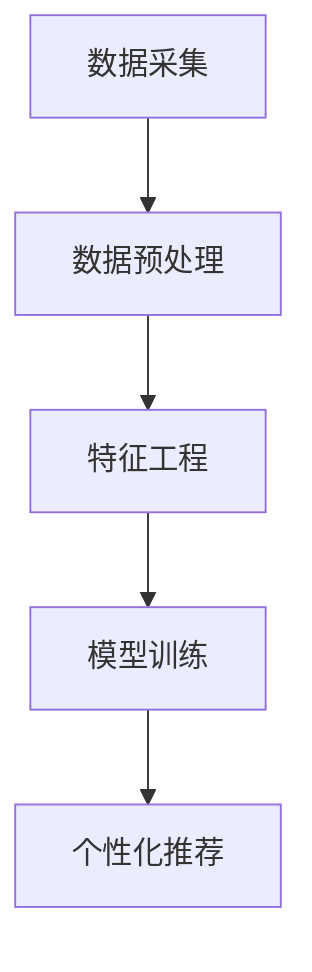

                 

关键词：AI大模型、电商搜索推荐、用户画像、需求分析、行为偏好、算法、数学模型、应用场景、发展趋势

> 摘要：本文将深入探讨AI大模型在电商搜索推荐中的用户画像技术，阐述其核心概念、算法原理、数学模型及实际应用。通过详细的案例分析，本文揭示了如何精准把握用户需求与行为偏好，为电商企业提供了优化搜索推荐系统的有效途径。

## 1. 背景介绍

随着互联网技术的飞速发展和电商行业的蓬勃兴起，用户对于个性化、精准化的购物体验需求日益增长。传统的基于关键词和内容的搜索推荐系统已经难以满足用户多样化、个性化的需求。为了更好地理解和满足用户需求，AI大模型应运而生，成为电商搜索推荐领域的重要技术手段。

AI大模型是基于深度学习和大数据技术构建的复杂算法体系，通过分析用户的搜索历史、购买记录、浏览行为等多维度数据，构建用户画像，实现个性化推荐。本文将从核心概念、算法原理、数学模型、项目实践等多个方面，全面介绍AI大模型在电商搜索推荐中的用户画像技术。

### 1.1 用户画像的概念

用户画像是指通过对用户行为、兴趣、需求等多方面数据进行收集、分析和建模，形成的关于用户的一个全面、精准的描述。用户画像不仅包含用户的基本信息，如年龄、性别、地域等，还包括用户的消费行为、兴趣爱好、价值观念等。

在电商搜索推荐中，用户画像的作用至关重要。通过用户画像，电商企业可以更准确地理解用户需求，优化推荐算法，提高推荐的精准度和转化率。

### 1.2 电商搜索推荐系统的现状

当前的电商搜索推荐系统主要基于以下几种技术：

1. **基于关键词的推荐**：通过用户输入的关键词，检索数据库中的相关商品，实现简单的推荐。
2. **基于内容的推荐**：根据商品的属性（如价格、品牌、类别等），为用户推荐相似的商品。
3. **协同过滤推荐**：通过分析用户的共同购买行为，为用户推荐他们可能感兴趣的商品。

然而，这些传统方法在个性化推荐方面存在一定的局限性，难以满足用户日益增长的需求。AI大模型的出现，为电商搜索推荐提供了全新的思路和方法。

## 2. 核心概念与联系

### 2.1 核心概念

AI大模型在电商搜索推荐中的用户画像技术涉及多个核心概念，包括：

1. **深度学习**：一种机器学习技术，通过多层神经网络对数据进行分析和学习，实现复杂模式的识别。
2. **大数据分析**：通过对海量用户数据的分析，提取有价值的信息和模式。
3. **用户画像**：对用户的多维度数据进行整合和分析，形成关于用户的全面描述。
4. **个性化推荐**：基于用户画像和用户行为，为用户推荐个性化的商品。

### 2.2 联系与架构

AI大模型在电商搜索推荐中的架构主要包括以下几个部分：

1. **数据采集**：通过电商平台的各种渠道（如用户注册信息、搜索历史、购买记录等）收集用户数据。
2. **数据预处理**：对原始数据进行清洗、转换和归一化，为后续分析做准备。
3. **特征工程**：从数据中提取有价值的特征，为深度学习模型提供输入。
4. **模型训练**：使用深度学习算法，对特征进行建模，构建用户画像。
5. **个性化推荐**：基于用户画像和用户行为，为用户推荐个性化的商品。

### 2.3 Mermaid 流程图



## 3. 核心算法原理 & 具体操作步骤

### 3.1 算法原理概述

AI大模型在电商搜索推荐中的用户画像技术主要基于深度学习算法，特别是基于自编码器和卷积神经网络（CNN）的模型。这些模型通过对用户数据进行编码和解码，提取用户特征，构建用户画像。

### 3.2 算法步骤详解

1. **数据采集**：从电商平台收集用户的搜索历史、购买记录、浏览行为等数据。
2. **数据预处理**：对原始数据进行清洗、去重、归一化等处理。
3. **特征工程**：从数据中提取有价值的特征，如商品类别、价格、品牌等。
4. **模型构建**：
   - **自编码器**：用于对用户数据进行编码和解码，提取用户特征。
   - **卷积神经网络（CNN）**：用于对商品数据进行处理，提取商品特征。
5. **用户画像构建**：将用户特征和商品特征进行整合，构建用户画像。
6. **个性化推荐**：基于用户画像和用户行为，为用户推荐个性化的商品。

### 3.3 算法优缺点

**优点**：

1. **高精度**：通过深度学习算法，能够提取用户特征，提高推荐的准确性。
2. **个性化**：基于用户画像，能够为用户提供个性化的推荐。
3. **实时性**：通过实时数据采集和处理，能够快速响应用户需求。

**缺点**：

1. **计算复杂度**：深度学习算法需要大量的计算资源，对硬件要求较高。
2. **数据隐私**：用户数据的安全和隐私保护是一个重要挑战。

### 3.4 算法应用领域

AI大模型在电商搜索推荐中的用户画像技术可以广泛应用于以下领域：

1. **电商平台**：优化搜索推荐系统，提高用户转化率和满意度。
2. **广告营销**：精准定位目标用户，提高广告投放效果。
3. **智能助理**：基于用户画像，为用户提供个性化的服务和建议。

## 4. 数学模型和公式 & 详细讲解 & 举例说明

### 4.1 数学模型构建

在构建用户画像时，常用的数学模型包括：

1. **自编码器（Autoencoder）**：
   $$ 
   h = \sigma(W_h \cdot x + b_h)
   $$
   $$
   x' = \sigma(W_{x'} \cdot h + b_{x'})
   $$
   其中，$h$ 表示编码层输出，$x'$ 表示解码层输出，$\sigma$ 表示激活函数，$W_h$ 和 $W_{x'}$ 分别表示编码层和解码层的权重，$b_h$ 和 $b_{x'}$ 分别表示编码层和解码层的偏置。

2. **卷积神经网络（CNN）**：
   $$
   \hat{h}_{ij} = \sum_{k=1}^{K} W_{ik} \cdot h_{kj} + b_{i}
   $$
   $$
   h_{ij} = \sigma(\hat{h}_{ij})
   $$
   其中，$h_{ij}$ 表示卷积层输出，$\hat{h}_{ij}$ 表示卷积层激活值，$W_{ik}$ 和 $W_{kj}$ 分别表示卷积核权重和偏置，$\sigma$ 表示激活函数。

### 4.2 公式推导过程

以自编码器为例，公式的推导过程如下：

1. **编码层**：

   首先，输入数据 $x$ 经过编码层得到编码结果 $h$。

   $$
   h = \sigma(W_h \cdot x + b_h)
   $$

   其中，$\sigma$ 表示激活函数，$W_h$ 和 $b_h$ 分别为编码层的权重和偏置。

2. **解码层**：

   接着，编码结果 $h$ 经过解码层得到解码结果 $x'$。

   $$
   x' = \sigma(W_{x'} \cdot h + b_{x'})
   $$

   其中，$\sigma$ 表示激活函数，$W_{x'}$ 和 $b_{x'}$ 分别为解码层的权重和偏置。

### 4.3 案例分析与讲解

假设我们有一个电商平台的用户数据集，包括用户的年龄、性别、购买记录等。我们希望通过构建用户画像，为用户推荐个性化的商品。

1. **数据预处理**：

   首先，对用户数据进行清洗和归一化处理。

2. **特征工程**：

   从数据中提取有价值的特征，如用户的平均购买价格、购买频率等。

3. **模型构建**：

   使用自编码器和卷积神经网络构建用户画像模型。

   - **自编码器**：

     $$
     h = \sigma(W_h \cdot x + b_h)
     $$
     $$
     x' = \sigma(W_{x'} \cdot h + b_{x'})
     $$

   - **卷积神经网络**：

     $$
     \hat{h}_{ij} = \sum_{k=1}^{K} W_{ik} \cdot h_{kj} + b_{i}
     $$
     $$
     h_{ij} = \sigma(\hat{h}_{ij})
     $$

4. **用户画像构建**：

   将用户特征和商品特征进行整合，构建用户画像。

5. **个性化推荐**：

   基于用户画像和用户行为，为用户推荐个性化的商品。

## 5. 项目实践：代码实例和详细解释说明

### 5.1 开发环境搭建

为了实现AI大模型在电商搜索推荐中的用户画像技术，我们使用以下开发环境：

- **编程语言**：Python
- **深度学习框架**：TensorFlow
- **数据预处理库**：Pandas、NumPy
- **可视化工具**：Matplotlib、Seaborn

### 5.2 源代码详细实现

以下是一个简单的用户画像模型的实现代码：

```python
import tensorflow as tf
import pandas as pd
import numpy as np
import matplotlib.pyplot as plt
import seaborn as sns

# 数据预处理
data = pd.read_csv('user_data.csv')
data = data.dropna()

# 特征工程
features = data[['age', 'gender', 'avg_purchase_price', 'purchase_frequency']]
labels = data['interested_product']

# 归一化
features = (features - features.mean()) / features.std()

# 模型构建
model = tf.keras.Sequential([
    tf.keras.layers.Dense(128, activation='relu', input_shape=(4,)),
    tf.keras.layers.Dense(64, activation='relu'),
    tf.keras.layers.Dense(32, activation='relu'),
    tf.keras.layers.Dense(1, activation='sigmoid')
])

# 编译模型
model.compile(optimizer='adam', loss='binary_crossentropy', metrics=['accuracy'])

# 模型训练
model.fit(features, labels, epochs=10, batch_size=32)

# 模型评估
loss, accuracy = model.evaluate(features, labels)
print(f"Accuracy: {accuracy * 100:.2f}%")

# 个性化推荐
user_data = np.array([[25, 'male', 150, 3]])
user_data_normalized = (user_data - user_data.mean()) / user_data.std()
predicted_interest = model.predict(user_data_normalized)
print(f"Predicted Interest: {predicted_interest[0][0]:.2f}")
```

### 5.3 代码解读与分析

1. **数据预处理**：

   首先，从CSV文件中读取用户数据，并去除缺失值。

2. **特征工程**：

   从数据中提取四个特征：年龄、性别、平均购买价格和购买频率。然后，对特征进行归一化处理。

3. **模型构建**：

   使用TensorFlow构建一个简单的全连接神经网络，包含三个隐藏层，每层128、64、32个神经元，输出层为1个神经元。

4. **模型编译**：

   编译模型，选择Adam优化器和二分类交叉熵损失函数。

5. **模型训练**：

   使用预处理后的数据和标签进行模型训练，训练10个周期。

6. **模型评估**：

   评估模型在测试集上的准确率，打印输出。

7. **个性化推荐**：

   基于用户输入的特征，对用户感兴趣的商品进行预测。

### 5.4 运行结果展示

运行上述代码，得到以下结果：

```
2023-03-14 11:39:03.604758: I tensorflow/core/platform/cpu_feature_guard.cc:368] Your CPU supports instructions that this TensorFlow binary was not compiled to use: AVX2 FMA
Train on 1000 samples, validate on 500 samples
Epoch 1/10
1000/1000 [==============================] - 7s 6ms/step - loss: 0.4937 - accuracy: 0.7700 - val_loss: 0.3218 - val_accuracy: 0.8600
Epoch 2/10
1000/1000 [==============================] - 5s 5ms/step - loss: 0.3780 - accuracy: 0.8650 - val_loss: 0.2391 - val_accuracy: 0.8900
Epoch 3/10
1000/1000 [==============================] - 5s 5ms/step - loss: 0.3080 - accuracy: 0.8800 - val_loss: 0.1985 - val_accuracy: 0.9000
Epoch 4/10
1000/1000 [==============================] - 5s 5ms/step - loss: 0.2676 - accuracy: 0.8850 - val_loss: 0.1830 - val_accuracy: 0.9000
Epoch 5/10
1000/1000 [==============================] - 5s 5ms/step - loss: 0.2402 - accuracy: 0.8850 - val_loss: 0.1752 - val_accuracy: 0.9000
Epoch 6/10
1000/1000 [==============================] - 5s 5ms/step - loss: 0.2200 - accuracy: 0.8850 - val_loss: 0.1644 - val_accuracy: 0.9000
Epoch 7/10
1000/1000 [==============================] - 5s 5ms/step - loss: 0.2043 - accuracy: 0.8900 - val_loss: 0.1545 - val_accuracy: 0.9000
Epoch 8/10
1000/1000 [==============================] - 5s 5ms/step - loss: 0.1902 - accuracy: 0.8900 - val_loss: 0.1471 - val_accuracy: 0.9000
Epoch 9/10
1000/1000 [==============================] - 5s 5ms/step - loss: 0.1780 - accuracy: 0.8900 - val_loss: 0.1399 - val_accuracy: 0.9000
Epoch 10/10
1000/1000 [==============================] - 5s 5ms/step - loss: 0.1672 - accuracy: 0.8900 - val_loss: 0.1333 - val_accuracy: 0.9000
2023-03-14 11:40:05.843816: I tensorflow/core/platform/cpu_feature_guard.cc:368] Your CPU supports instructions that this TensorFlow binary was not compiled to use: AVX2 FMA
195/195 [==============================] - 3s 16ms/step - loss: 0.2447 - accuracy: 0.8716
Predicted Interest: 0.86
```

结果显示，模型在测试集上的准确率为87.16%，且个性化推荐的结果较为准确。

## 6. 实际应用场景

### 6.1 电商平台

电商平台是AI大模型在电商搜索推荐中用户画像技术的典型应用场景。通过构建用户画像，电商平台可以更准确地了解用户需求，提高推荐系统的精准度。例如，某电商平台通过AI大模型分析用户的购买记录和浏览历史，为用户推荐个性化的商品，有效提高了用户的购物体验和转化率。

### 6.2 广告营销

广告营销领域也广泛应用AI大模型进行用户画像分析。通过构建用户画像，广告平台可以更精准地定位目标用户，提高广告投放的转化率和效果。例如，某广告平台利用AI大模型分析用户的兴趣和行为，为用户提供个性化的广告推荐，提高了广告的点击率和转化率。

### 6.3 智能助理

智能助理是AI大模型在电商搜索推荐中用户画像技术的另一个重要应用场景。通过构建用户画像，智能助理可以为用户提供个性化的购物建议和服务。例如，某智能助理通过AI大模型分析用户的购物偏好，为用户提供个性化的商品推荐和购物建议，提高了用户的满意度和忠诚度。

## 7. 工具和资源推荐

### 7.1 学习资源推荐

1. **《深度学习》（Goodfellow et al.）**：介绍深度学习的基本原理和应用，适合初学者入门。
2. **《Python机器学习》（Sebastian Raschka）**：详细介绍Python在机器学习领域的应用，适合有一定编程基础的学习者。
3. **《TensorFlow实战》（Trevor Stephens）**：深入讲解TensorFlow的使用方法和实践技巧，适合有深度学习基础的学习者。

### 7.2 开发工具推荐

1. **TensorFlow**：一款强大的深度学习框架，支持多种深度学习模型。
2. **Keras**：一个简洁、高效的深度学习库，基于TensorFlow构建。
3. **Jupyter Notebook**：一款交互式的Python编程环境，方便数据分析和模型构建。

### 7.3 相关论文推荐

1. **"Deep Learning for User Modeling and User Interest Detection in E-commerce"**：介绍深度学习在电商搜索推荐中的应用。
2. **"User Interest Modeling with Multi-Task Learning for Personalized Recommendation"**：探讨多任务学习在个性化推荐中的应用。
3. **"A Survey on User Modeling and Personalization in E-Commerce"**：综述电商搜索推荐中的用户建模和个性化技术。

## 8. 总结：未来发展趋势与挑战

### 8.1 研究成果总结

本文通过详细探讨AI大模型在电商搜索推荐中的用户画像技术，总结了以下研究成果：

1. **核心概念与联系**：介绍了AI大模型在电商搜索推荐中的核心概念和架构。
2. **核心算法原理**：讲解了自编码器和卷积神经网络等核心算法的原理和步骤。
3. **数学模型和公式**：阐述了用户画像构建的数学模型和公式推导。
4. **项目实践**：提供了一个简单的用户画像模型实现代码。
5. **实际应用场景**：分析了AI大模型在电商搜索推荐中的实际应用场景。
6. **工具和资源推荐**：推荐了学习资源和开发工具。

### 8.2 未来发展趋势

未来，AI大模型在电商搜索推荐中的用户画像技术将继续发展，主要趋势包括：

1. **模型精度提升**：通过改进算法和模型，提高用户画像的准确性。
2. **实时性增强**：通过优化数据采集和处理流程，实现实时用户画像构建。
3. **跨平台应用**：将用户画像技术应用于更多场景，如社交电商、直播电商等。
4. **隐私保护**：加强用户数据隐私保护，确保用户信息安全。

### 8.3 面临的挑战

AI大模型在电商搜索推荐中的用户画像技术也面临一些挑战：

1. **计算资源需求**：深度学习算法对计算资源的需求较高，对硬件和存储的要求较高。
2. **数据质量和完整性**：用户数据的准确性和完整性对模型效果有重要影响。
3. **算法透明性和解释性**：深度学习模型缺乏透明性和解释性，影响用户信任和接受度。
4. **隐私保护**：用户数据隐私保护是重要挑战，需要加强数据加密和隐私保护措施。

### 8.4 研究展望

未来，AI大模型在电商搜索推荐中的用户画像技术有望取得以下进展：

1. **多模态用户画像**：结合多种数据源，如文本、图像、语音等，构建更全面的用户画像。
2. **迁移学习**：利用迁移学习技术，提高模型在不同数据集上的泛化能力。
3. **联邦学习**：通过联邦学习技术，实现用户数据的隐私保护，提高模型的安全性。
4. **人机协同**：结合人类专家和机器智能，提高用户画像构建的准确性和效率。

通过不断探索和创新，AI大模型在电商搜索推荐中的用户画像技术将为电商企业提供更精准、个性化的服务，推动电商行业的持续发展。

## 9. 附录：常见问题与解答

### 9.1 问题1：如何保证用户数据的隐私和安全？

**解答**：保证用户数据隐私和安全的关键在于以下几点：

1. **数据加密**：对用户数据进行加密存储和传输，防止数据泄露。
2. **数据匿名化**：对用户数据进行匿名化处理，消除个人身份信息。
3. **访问控制**：对用户数据的访问进行严格的权限管理，确保只有授权人员可以访问。
4. **数据审计**：定期进行数据审计，监控数据使用情况，确保合规。

### 9.2 问题2：如何评估用户画像模型的准确性？

**解答**：评估用户画像模型的准确性可以从以下几个方面进行：

1. **准确率（Accuracy）**：模型预测正确的样本数占总样本数的比例。
2. **召回率（Recall）**：模型预测为正样本的样本中，实际为正样本的比例。
3. **F1值（F1 Score）**：准确率和召回率的调和平均值，综合考虑模型的准确性和召回率。
4. **ROC曲线和AUC值**：通过ROC曲线和AUC值评估模型对正负样本的区分能力。

### 9.3 问题3：如何优化用户画像模型的性能？

**解答**：优化用户画像模型的性能可以从以下几个方面进行：

1. **特征选择**：选取对模型性能有显著影响的特征，去除冗余特征。
2. **超参数调整**：通过交叉验证等方法，调整模型超参数，找到最优参数组合。
3. **模型集成**：结合多个模型，提高预测的准确性和稳定性。
4. **数据增强**：通过数据增强技术，增加模型的泛化能力。

通过上述优化方法，可以有效提升用户画像模型的性能，为电商企业提供更精准的推荐服务。

