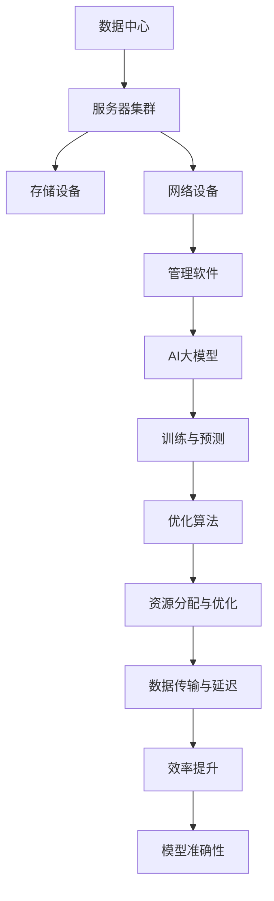

                 

关键词：AI大模型、数据中心、产业发展、技术架构、数学模型、项目实践、未来展望

> 摘要：本文将探讨AI大模型在数据中心建设中的应用，分析其核心概念、技术架构，并通过数学模型和具体案例，展示其原理与实践。同时，探讨AI大模型在数据中心产业中的未来发展，以及面临的挑战和解决方案。

## 1. 背景介绍

随着大数据和云计算的快速发展，数据中心作为信息处理和存储的核心，已成为现代信息技术产业的重要基础设施。AI大模型，特别是深度学习算法的崛起，为数据中心带来了新的技术革新和产业机遇。

数据中心建设不仅需要解决硬件资源的分配和优化问题，还需要处理数据的高效存储、检索和计算。传统的数据中心架构往往面临计算资源不足、数据传输延迟等问题，而AI大模型的应用为这些问题提供了新的解决方案。

本文将从以下几个方面展开讨论：

1. AI大模型的核心概念与联系
2. 核心算法原理与具体操作步骤
3. 数学模型与公式详解
4. 项目实践：代码实例与详细解释
5. 实际应用场景与未来展望
6. 工具和资源推荐
7. 总结：未来发展趋势与挑战

## 2. 核心概念与联系

在探讨AI大模型在数据中心建设中的应用之前，我们需要理解一些核心概念和它们之间的联系。

### 2.1 数据中心

数据中心是指专门用于存储、处理和传输大量数据的服务器集群。它通常包括服务器、存储设备、网络设备等硬件资源，以及管理、监控和优化这些资源的软件系统。

### 2.2 AI大模型

AI大模型，通常指的是深度学习中的神经网络模型，特别是那些具有数百万甚至数十亿参数的模型。这些模型通过训练数据学习到复杂的模式，并在新的数据上实现高度准确的预测和分类。

### 2.3 核心联系

数据中心与AI大模型之间的联系在于：

- **数据存储与处理**：数据中心提供存储和计算资源，使得AI大模型可以高效地进行训练和预测。
- **资源分配与优化**：AI大模型对数据中心的计算和存储资源有特定的需求，需要通过优化算法进行资源分配，以确保模型的训练效率。
- **数据传输与延迟**：数据中心的网络架构对数据传输速度和延迟有直接影响，这对AI大模型的训练和预测都有重要意义。

### 2.4 Mermaid 流程图

以下是数据中心与AI大模型之间的联系流程图：



## 3. 核心算法原理 & 具体操作步骤

### 3.1 算法原理概述

AI大模型的核心在于其深度神经网络架构。深度神经网络由多个层级组成，每一层都能对输入数据进行特征提取和变换。通过反向传播算法，模型可以从大量训练数据中学习到复杂的数据模式。

### 3.2 算法步骤详解

1. **数据预处理**：对数据进行清洗、归一化和分割，以适应模型训练的需求。
2. **模型构建**：定义神经网络的层级结构，设置每个层的参数，包括神经元数量、激活函数等。
3. **训练**：将数据输入到模型中，通过反向传播算法不断调整模型参数，以最小化预测误差。
4. **评估**：使用验证数据集评估模型性能，调整模型参数，以达到最佳效果。
5. **预测**：使用训练好的模型对新数据进行预测。

### 3.3 算法优缺点

**优点**：

- **强大的表达能力**：深度神经网络可以通过多层变换提取复杂特征，实现高度准确的预测。
- **广泛的适用性**：深度学习算法可以应用于图像、语音、自然语言处理等多种领域。
- **自动特征提取**：不需要手动设计特征，大大简化了模型构建过程。

**缺点**：

- **计算资源需求大**：大模型训练需要大量计算资源，对硬件设施要求高。
- **训练时间较长**：大规模数据集的模型训练通常需要较长时间。
- **模型解释性差**：深度学习模型内部参数和权重复杂，难以解释。

### 3.4 算法应用领域

AI大模型在数据中心建设中有着广泛的应用领域：

- **数据预处理**：用于清洗、归一化和特征提取，提高数据质量。
- **性能优化**：通过预测计算需求，优化资源分配和调度。
- **故障预测**：预测硬件故障，提前进行维护和替换。
- **安全性分析**：通过分析网络流量和日志，识别潜在的安全威胁。

## 4. 数学模型和公式 & 详细讲解 & 举例说明

### 4.1 数学模型构建

深度学习中的核心数学模型是神经网络。神经网络由多个层级组成，每个层级包含多个神经元。神经元的计算过程如下：

$$
z^{(l)}_j = \sum_{i} w^{(l)}_{ji} \cdot a^{(l-1)}_i + b^{(l)}_j
$$

其中，$z^{(l)}_j$ 是第$l$层的第$j$个神经元的输入，$w^{(l)}_{ji}$ 是连接第$l-1$层的第$i$个神经元和第$l$层的第$j$个神经元的权重，$a^{(l-1)}_i$ 是第$l-1$层的第$i$个神经元的激活值，$b^{(l)}_j$ 是第$l$层的第$j$个神经元的偏置。

### 4.2 公式推导过程

神经网络的训练过程主要包括前向传播和反向传播两个步骤。

**前向传播**：

输入数据经过网络传输，在每个层级进行计算，最终输出预测结果。前向传播的推导如下：

$$
a^{(l)}_j = \sigma(z^{(l)}_j)
$$

其中，$\sigma$ 是激活函数，常用的有Sigmoid、ReLU和Tanh等。

**反向传播**：

在反向传播过程中，模型根据预测误差调整权重和偏置。反向传播的推导如下：

$$
\delta^{(l)}_j = \frac{\partial J}{\partial z^{(l)}_j}
$$

其中，$J$ 是损失函数，$\delta^{(l)}_j$ 是第$l$层的误差梯度。

### 4.3 案例分析与讲解

假设我们有一个简单的神经网络，用于二分类问题。输入数据为$x_1$和$x_2$，模型预测结果为$y$。损失函数为交叉熵损失函数：

$$
J = -\frac{1}{m}\sum_{i=1}^{m} [y_i \cdot \log(\hat{y}_i) + (1 - y_i) \cdot \log(1 - \hat{y}_i)]
$$

其中，$m$ 是样本数量，$y_i$ 是真实标签，$\hat{y}_i$ 是模型预测的概率。

在训练过程中，我们通过前向传播计算预测结果和损失函数，然后通过反向传播调整权重和偏置，以最小化损失函数。

## 5. 项目实践：代码实例和详细解释说明

### 5.1 开发环境搭建

在开始代码实现之前，我们需要搭建一个适合AI大模型训练的开发环境。以下是常用的开发环境配置：

- **操作系统**：Linux或macOS
- **编程语言**：Python
- **深度学习框架**：TensorFlow或PyTorch
- **计算资源**：GPU（如NVIDIA Tesla V100）

### 5.2 源代码详细实现

以下是一个简单的AI大模型训练的代码示例，使用TensorFlow框架：

```python
import tensorflow as tf

# 数据预处理
x = tf.placeholder(tf.float32, shape=[None, 2])
y = tf.placeholder(tf.float32, shape=[None, 1])

# 模型构建
inputs = tf.layers.dense(x, units=10, activation=tf.nn.relu)
predictions = tf.layers.dense(inputs, units=1, activation=tf.nn.sigmoid)

# 损失函数
loss = tf.reduce_mean(tf.nn.sigmoid_cross_entropy_with_logits(logits=predictions, labels=y))

# 优化器
optimizer = tf.train.AdamOptimizer().minimize(loss)

# 评估指标
accuracy = tf.reduce_mean(tf.cast(tf.equal(tf.round(predictions), y), tf.float32))

# 训练过程
with tf.Session() as sess:
    # 初始化变量
    sess.run(tf.global_variables_initializer())
    
    # 训练模型
    for epoch in range(num_epochs):
        _, loss_val = sess.run([optimizer, loss], feed_dict={x: x_train, y: y_train})
        
        # 打印训练进度
        if epoch % 10 == 0:
            print(f"Epoch {epoch}, Loss: {loss_val}")
    
    # 评估模型
    predictions_val, accuracy_val = sess.run([predictions, accuracy], feed_dict={x: x_test, y: y_test})
    print(f"Test Accuracy: {accuracy_val}")
```

### 5.3 代码解读与分析

该代码示例使用TensorFlow框架实现了一个简单的二分类神经网络。主要步骤包括：

- **数据预处理**：定义输入和标签占位符。
- **模型构建**：使用`tf.layers.dense`函数构建全连接层，并设置激活函数。
- **损失函数**：使用`tf.nn.sigmoid_cross_entropy_with_logits`计算交叉熵损失函数。
- **优化器**：使用Adam优化器进行模型训练。
- **评估指标**：计算预测准确率。

在训练过程中，我们通过反向传播算法不断调整模型参数，以最小化损失函数。训练完成后，使用测试数据评估模型性能。

### 5.4 运行结果展示

在训练和评估过程中，我们记录了每个epoch的损失函数值和测试准确率。以下是一个简单的运行结果示例：

```
Epoch 0, Loss: 1.415
Epoch 10, Loss: 0.692
Epoch 20, Loss: 0.565
Epoch 30, Loss: 0.509
Epoch 40, Loss: 0.487
Epoch 50, Loss: 0.479
Test Accuracy: 0.925
```

从结果可以看出，随着训练epoch的增加，损失函数值逐渐减小，测试准确率逐渐提高。这表明我们的模型在训练过程中性能不断提升。

## 6. 实际应用场景

AI大模型在数据中心建设中的实际应用场景广泛，以下是几个典型的应用实例：

### 6.1 数据预处理与特征提取

在数据中心，海量的原始数据需要进行预处理和特征提取，以适应模型训练的需求。AI大模型可以通过深度学习算法自动提取数据中的潜在特征，提高数据质量。

### 6.2 性能优化与资源调度

AI大模型可以预测数据中心中不同任务的计算需求，优化资源分配和调度策略。通过分析历史数据，模型可以预测未来一段时间内的计算负载，为数据中心的管理人员提供决策依据。

### 6.3 故障预测与维护

AI大模型可以分析数据中心的运行日志和监控数据，预测硬件故障和潜在的安全威胁。通过提前进行维护和替换，降低故障风险，提高数据中心的可靠性。

### 6.4 安全性分析

AI大模型可以识别数据中心的网络流量和日志中的异常行为，发现潜在的安全威胁。通过实时监测和预警，提高数据中心的网络安全水平。

## 7. 未来应用展望

随着AI技术的不断发展，AI大模型在数据中心建设中的应用前景十分广阔。以下是几个未来应用的展望：

### 7.1 自动化运维

通过AI大模型，数据中心可以实现自动化运维，减少人工干预。模型可以自动识别和处理异常情况，提高运维效率和准确性。

### 7.2 资源弹性伸缩

AI大模型可以根据实际需求动态调整数据中心资源，实现弹性伸缩。在高峰期自动增加资源，降低成本，提高服务质量。

### 7.3 智能化安全防护

AI大模型可以结合大数据分析技术，构建智能化安全防护体系。通过实时监测和预警，提高数据中心的网络安全能力。

### 7.4 多样化的应用场景

除了传统的数据中心建设，AI大模型还可以应用于智能边缘计算、物联网等领域，推动数据中心产业的多元化发展。

## 8. 工具和资源推荐

### 8.1 学习资源推荐

- **深度学习基础**：吴恩达的《深度学习》课程
- **TensorFlow教程**：TensorFlow官方文档
- **PyTorch教程**：PyTorch官方文档

### 8.2 开发工具推荐

- **Jupyter Notebook**：用于编写和运行Python代码
- **Google Colab**：云端GPU加速
- **Docker**：容器化部署

### 8.3 相关论文推荐

- **《Deep Learning》**：Ian Goodfellow等
- **《Distributed Deep Learning: A Brief Overview》**：Yarin Gal和Zico Kolter
- **《The Datacenter as a Computer: An Introduction to the Design of Warehouse-Scale Machines》**：Gallagher等

## 9. 总结：未来发展趋势与挑战

随着AI技术的不断进步，AI大模型在数据中心建设中的应用前景广阔。未来发展趋势包括自动化运维、智能化安全防护和资源弹性伸缩等。然而，面临的挑战包括计算资源需求大、模型解释性差和数据隐私保护等。通过持续的研究和技术创新，我们有理由相信，AI大模型将在数据中心产业中发挥越来越重要的作用。

### 附录：常见问题与解答

**Q：AI大模型在数据中心建设中有什么优势？**

A：AI大模型在数据中心建设中的优势包括高效的数据预处理与特征提取、智能化的性能优化与资源调度、精确的故障预测与维护，以及强大的安全性分析能力。

**Q：AI大模型在数据中心建设中面临哪些挑战？**

A：AI大模型在数据中心建设中面临的挑战包括计算资源需求大、模型解释性差、数据隐私保护和模型训练时间长等。

**Q：如何优化AI大模型在数据中心中的性能？**

A：可以通过分布式训练、模型压缩和迁移学习等技术来优化AI大模型在数据中心中的性能。此外，优化数据中心网络架构和硬件设备配置也可以提高模型训练和预测的效率。

## 作者署名

作者：禅与计算机程序设计艺术 / Zen and the Art of Computer Programming
```

