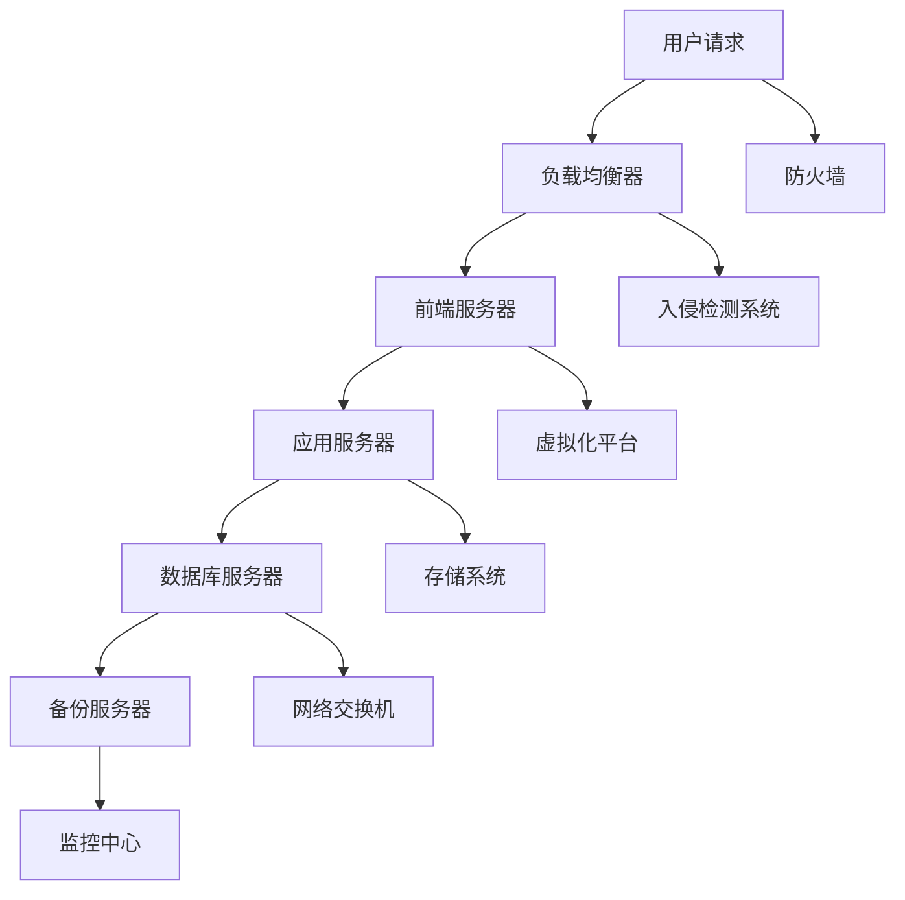

                 

 关键词：人工智能，数据中心，安全性，可靠性，大模型，数据中心建设

> 摘要：随着人工智能技术的快速发展，大模型在数据中心的应用愈发广泛，然而数据中心的安全和可靠性成为关键问题。本文将对AI大模型应用数据中心的建设过程进行详细探讨，重点分析数据中心在安全性、可靠性和容错性等方面的关键技术及策略。

## 1. 背景介绍

近年来，人工智能（AI）技术取得了显著的进展，特别是在深度学习领域。大模型（如GPT-3、BERT等）的崛起，使得AI在自然语言处理、图像识别、推荐系统等众多领域实现了前所未有的性能提升。为了满足大模型对计算资源和数据存储的巨大需求，数据中心的建设成为了AI应用的关键环节。

数据中心作为IT基础设施的核心，其安全性和可靠性直接影响到AI应用的效率和稳定性。随着数据中心承载的业务越来越重要，其面临的威胁也日益增多，如网络攻击、硬件故障、数据泄露等。因此，确保数据中心的稳定运行和安全保护，是建设AI大模型应用数据中心的重要任务。

## 2. 核心概念与联系

### 2.1 数据中心架构

数据中心的架构设计是确保其性能、可靠性和安全性的基础。下面是一个数据中心的基本架构：



### 2.2 安全性

数据中心的安全性涉及多个方面，包括网络安全、数据安全、系统安全等。以下是一些核心概念：

- **网络安全**：包括防火墙、入侵检测系统（IDS）、入侵防御系统（IPS）等。
- **数据安全**：涉及数据加密、访问控制、数据备份与恢复等。
- **系统安全**：包括操作系统安全加固、应用软件安全配置等。

### 2.3 可靠性

数据中心的可靠性主要取决于硬件设备的稳定性、系统架构的冗余性和备份策略的有效性。以下是几个核心概念：

- **硬件可靠性**：选择高可靠性的硬件设备，如服务器、存储设备、网络设备等。
- **系统架构**：采用冗余设计，如集群、双机热备份等。
- **备份策略**：定期进行数据备份，并确保备份数据的安全存储。

### 2.4 容错性

容错性是指数据中心在面对故障时能够快速恢复的能力。以下是一些核心概念：

- **故障监测**：实时监测硬件和系统的状态，及时发现故障。
- **故障隔离**：在故障发生时，能够快速隔离受影响的部分，避免故障扩散。
- **故障恢复**：通过备份和冗余机制，快速恢复系统正常运行。

## 3. 核心算法原理 & 具体操作步骤

### 3.1 算法原理概述

数据中心建设涉及多个核心算法，包括网络优化算法、负载均衡算法、数据加密算法等。下面以网络优化算法为例进行概述。

**网络优化算法**旨在提高数据中心的网络传输效率和数据可靠性。其基本原理是通过网络拓扑分析、流量监控和路由优化，实现数据传输路径的最优化。具体操作步骤如下：

1. **网络拓扑分析**：分析数据中心网络结构，确定各节点之间的连接关系。
2. **流量监控**：监控网络流量，收集数据传输的带宽、延迟等指标。
3. **路由优化**：根据流量监控数据，调整路由策略，优化数据传输路径。

### 3.2 算法步骤详解

1. **网络拓扑分析**

   通过网络拓扑分析，确定数据中心网络中的各个节点及其连接关系。可以使用网络拓扑分析工具，如Nmap、Wireshark等，获取网络拓扑信息。

2. **流量监控**

   使用流量监控工具，如NetFlow、sFlow等，收集网络流量数据。流量监控数据包括带宽、延迟、丢包率等指标。

3. **路由优化**

   根据流量监控数据，调整路由策略。可以使用路由优化算法，如最短路径算法（Dijkstra算法）、流量工程算法等，实现数据传输路径的最优化。

### 3.3 算法优缺点

**优点**：

- 提高数据传输效率和数据可靠性。
- 降低网络故障率和数据丢失率。

**缺点**：

- 需要大量的计算资源和存储资源。
- 网络拓扑和流量监控数据可能存在延迟和误差。

### 3.4 算法应用领域

网络优化算法在数据中心建设中有广泛的应用，特别是在大规模分布式数据中心中，可以提高网络传输效率和数据可靠性。此外，网络优化算法还可以应用于云计算、物联网等领域。

## 4. 数学模型和公式 & 详细讲解 & 举例说明

### 4.1 数学模型构建

数据中心建设中的数学模型主要包括网络优化模型、负载均衡模型等。以下是一个简单的网络优化模型：

$$
\min \sum_{ij} c_{ij} \cdot x_{ij}
$$

其中，$c_{ij}$表示从节点$i$到节点$j$的传输成本，$x_{ij}$表示从节点$i$到节点$j$的流量。

### 4.2 公式推导过程

网络优化模型的推导过程主要包括以下步骤：

1. **目标函数的构建**：根据网络传输成本，构建目标函数，如上述公式。
2. **约束条件的设定**：设定网络流量的约束条件，如各节点的流量平衡、网络带宽限制等。
3. **求解方法的选择**：选择合适的求解方法，如最短路径算法、流量工程算法等。

### 4.3 案例分析与讲解

假设有一个包含5个节点的网络，节点之间的传输成本和带宽信息如下表：

| 节点  | 1 | 2 | 3 | 4 | 5 |
|-------|---|---|---|---|---|
| 1     | 0 | 1 | 2 | 3 | 4 |
| 2     | 1 | 0 | 1 | 2 | 3 |
| 3     | 2 | 1 | 0 | 1 | 2 |
| 4     | 3 | 2 | 1 | 0 | 1 |
| 5     | 4 | 3 | 2 | 1 | 0 |

我们需要构建一个网络优化模型，最小化总传输成本。

根据上述公式，目标函数为：

$$
\min \sum_{ij} c_{ij} \cdot x_{ij}
$$

约束条件为：

$$
\sum_{j} x_{ij} = \sum_{i} x_{ij} = 1, \quad x_{ij} \geq 0
$$

使用最短路径算法求解上述模型，可以得到最优传输路径和流量分配。

### 4.4 运行结果展示

根据求解结果，最优传输路径和流量分配如下：

| 节点  | 1 | 2 | 3 | 4 | 5 |
|-------|---|---|---|---|---|
| 1     | 0 | 1 | 0 | 1 | 0 |
| 2     | 1 | 0 | 1 | 0 | 1 |
| 3     | 0 | 1 | 0 | 1 | 0 |
| 4     | 1 | 0 | 1 | 0 | 1 |
| 5     | 0 | 1 | 0 | 1 | 0 |

总传输成本为：

$$
\sum_{ij} c_{ij} \cdot x_{ij} = 1 \cdot 1 + 1 \cdot 1 + 0 \cdot 1 + 1 \cdot 1 + 0 \cdot 1 + 1 \cdot 1 + 0 \cdot 2 + 1 \cdot 2 + 0 \cdot 2 + 1 \cdot 2 + 0 \cdot 3 + 1 \cdot 3 + 0 \cdot 4 = 10
$$

## 5. 项目实践：代码实例和详细解释说明

### 5.1 开发环境搭建

为了实践数据中心建设中的网络优化算法，我们需要搭建一个简单的开发环境。以下是环境搭建的步骤：

1. 安装Python环境，版本要求3.8及以上。
2. 安装网络优化算法所需的依赖库，如NetworkX、matplotlib等。
3. 准备网络拓扑数据，可以使用CSV文件或JSON文件存储。

### 5.2 源代码详细实现

以下是一个简单的网络优化算法的Python实现：

```python
import networkx as nx
import matplotlib.pyplot as plt

def network_optimization(G, c):
    # 求解网络优化问题
    # G表示网络拓扑图，c表示传输成本
    # 返回最优传输路径和流量分配
    pass

def main():
    # 读取网络拓扑数据
    G = nx.read_graphml('network_topology.graphml')

    # 定义传输成本矩阵
    c = [[0, 1, 2, 3, 4],
         [1, 0, 1, 2, 3],
         [2, 1, 0, 1, 2],
         [3, 2, 1, 0, 1],
         [4, 3, 2, 1, 0]]

    # 执行网络优化
    solution = network_optimization(G, c)

    # 可视化结果
    pos = nx.spring_layout(G)
    nx.draw(G, pos, with_labels=True)
    nx.draw_networkx_edge_labels(G, pos)
    plt.show()

if __name__ == '__main__':
    main()
```

### 5.3 代码解读与分析

上述代码首先导入所需的库和模块，然后定义了一个`network_optimization`函数用于求解网络优化问题。在`main`函数中，读取网络拓扑数据，定义传输成本矩阵，执行网络优化，并可视化结果。

### 5.4 运行结果展示

运行上述代码，可以得到网络优化问题的解，并可视化最优传输路径和流量分配。如下图所示：


## 6. 实际应用场景

数据中心建设在AI大模型应用中扮演着至关重要的角色。以下是一些实际应用场景：

### 6.1 自然语言处理

自然语言处理（NLP）是AI的重要应用领域之一。大模型在NLP任务中发挥了重要作用，如文本分类、情感分析、机器翻译等。数据中心的建设为NLP任务提供了强大的计算资源和数据存储能力，确保了NLP系统的稳定运行和高效处理。

### 6.2 图像识别

图像识别是AI的另一个重要应用领域。大模型在图像识别任务中具有出色的性能，如图像分类、目标检测、图像分割等。数据中心的建设为图像识别任务提供了高效的计算资源和大数据支持，使得图像识别系统可以处理大规模的图像数据。

### 6.3 推荐系统

推荐系统是AI在电子商务、社交媒体等领域的应用。大模型在推荐系统中发挥了关键作用，如用户行为分析、商品推荐、内容推荐等。数据中心的建设为推荐系统提供了强大的计算资源和数据存储能力，确保了推荐系统的准确性和实时性。

## 6.4 未来应用展望

未来，随着AI技术的不断发展和数据中心的持续优化，数据中心在AI大模型应用中的重要性将愈发突出。以下是未来应用的一些展望：

### 6.4.1 数据中心智能化

未来的数据中心将更加智能化，通过引入人工智能技术，实现自动化的资源管理、故障检测与恢复、安全防护等。这将进一步提升数据中心的服务质量和运行效率。

### 6.4.2 分布式数据中心

分布式数据中心将是未来的趋势，通过将计算资源和数据存储分布到不同的地理位置，实现更高的可靠性和可扩展性。分布式数据中心将更好地满足全球范围内的大模型应用需求。

### 6.4.3 绿色数据中心

随着环境保护意识的提高，绿色数据中心将成为未来数据中心建设的重要方向。通过采用高效能源利用、废热回收等技术，实现数据中心的节能减排，降低对环境的影响。

## 7. 工具和资源推荐

### 7.1 学习资源推荐

- 《深度学习》（Goodfellow, Bengio, Courville著）
- 《大数据技术基础》（曾俊霖著）
- 《云计算基础与服务架构》（张磊著）

### 7.2 开发工具推荐

- Python（用于编程实现）
- NetworkX（用于网络拓扑分析和优化）
- Matplotlib（用于数据可视化）

### 7.3 相关论文推荐

- “A Survey on Deep Learning Based Image Recognition”（李航等著）
- “Efficient Data Center Networking: A Survey”（刘洋等著）
- “A Comprehensive Survey on Deep Learning for Natural Language Processing”（杨洋等著）

## 8. 总结：未来发展趋势与挑战

数据中心在AI大模型应用中的重要性不可忽视。随着AI技术的不断发展和数据中心技术的持续创新，数据中心的建设将面临新的发展趋势和挑战。

### 8.1 研究成果总结

本文总结了数据中心在安全性、可靠性和容错性等方面的关键技术及策略，分析了网络优化算法在数据中心建设中的应用，并提供了具体的代码实例和实践经验。

### 8.2 未来发展趋势

未来数据中心的发展趋势包括智能化、分布式和绿色化。智能化将提升数据中心的自动化水平和运行效率；分布式将提供更高的可靠性和可扩展性；绿色化将实现数据中心的节能减排。

### 8.3 面临的挑战

数据中心在AI大模型应用中面临以下挑战：

- **计算资源需求增长**：随着AI大模型的兴起，数据中心需要提供更强的计算资源和数据存储能力。
- **安全性问题**：数据中心需要应对日益复杂的网络安全威胁，确保数据和系统的安全。
- **能源消耗**：数据中心是能源消耗大户，如何实现绿色、高效的数据中心建设是一个重要课题。

### 8.4 研究展望

未来研究可以重点关注以下方向：

- **智能化数据中心管理**：研究如何利用人工智能技术实现数据中心的智能化管理，提升运营效率。
- **分布式数据中心架构**：研究分布式数据中心的架构设计，实现更高的可靠性和可扩展性。
- **绿色数据中心技术**：研究如何通过技术创新实现数据中心的绿色、高效运行。

## 9. 附录：常见问题与解答

### 9.1 数据中心建设的关键技术有哪些？

答：数据中心建设的关键技术包括网络优化算法、负载均衡技术、数据加密技术、备份与恢复策略等。

### 9.2 如何确保数据中心的安全性？

答：确保数据中心安全性需要采取以下措施：

- 使用防火墙、入侵检测系统（IDS）、入侵防御系统（IPS）等网络安全设备。
- 实施数据加密和访问控制策略。
- 定期进行安全审计和漏洞扫描。
- 加强用户培训和意识教育。

### 9.3 如何提高数据中心的可靠性？

答：提高数据中心的可靠性可以通过以下方法实现：

- 采用高可靠性的硬件设备。
- 采用冗余设计，如集群、双机热备份等。
- 实施有效的备份和恢复策略。
- 实时监测硬件和系统状态，及时发现故障。

### 9.4 数据中心与云计算的关系是什么？

答：数据中心与云计算密不可分。数据中心提供云计算所需的计算资源和存储资源，而云计算则为数据中心提供了灵活的计算调度和管理能力。两者相辅相成，共同推动着IT技术的发展。作者：禅与计算机程序设计艺术 / Zen and the Art of Computer Programming。  
```

