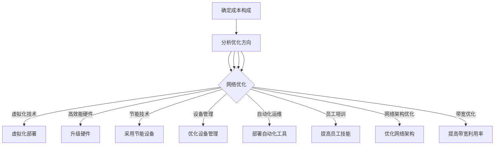

                 

关键词：AI大模型、数据中心、成本优化、基础设施、运营策略

摘要：本文深入探讨了AI大模型应用数据中心建设中的成本优化问题。首先，我们介绍了AI大模型在数据中心建设中的应用背景和重要性。接着，分析了数据中心成本构成及其优化方向。随后，我们提出了基于AI的优化算法，并详细阐述了其原理和实现步骤。此外，我们还讨论了数学模型和公式在成本优化中的作用，并通过实际案例和代码实例进行了说明。最后，本文展望了数据中心成本优化的未来发展趋势与挑战。

## 1. 背景介绍

随着人工智能（AI）技术的快速发展，AI大模型的应用场景越来越广泛。这些大模型需要大量计算资源和存储空间，因此数据中心的建设变得尤为重要。数据中心作为现代信息技术的基础设施，承担着存储、处理和传输大量数据的重要任务。然而，数据中心的建设和运营成本高昂，如何在保证性能的前提下优化成本成为了亟待解决的问题。

本文旨在通过深入分析和研究，提出一种基于AI的大模型应用数据中心成本优化方案，以降低数据中心的运营成本，提高资源利用效率。

### 1.1 AI大模型的应用场景

AI大模型在数据中心的应用场景主要包括以下几个方面：

1. **图像识别**：通过深度学习算法对大量图像进行分析，实现物体识别、场景分割等任务。
2. **自然语言处理**：处理和理解自然语言，包括机器翻译、情感分析、文本生成等。
3. **预测分析**：利用历史数据预测未来趋势，如股票市场分析、资源调度等。
4. **增强现实（AR）/虚拟现实（VR）**：提供实时、高度交互的虚拟环境，为用户提供沉浸式体验。

### 1.2 数据中心的重要性

数据中心是AI大模型应用的物理基础，其重要性体现在以下几个方面：

1. **计算能力**：数据中心提供了强大的计算资源，能够支持AI大模型的训练和推理任务。
2. **数据存储**：数据中心存储了大量数据，为AI大模型提供了训练所需的素材。
3. **网络连接**：数据中心通过高速网络与其他数据中心和互联网连接，实现了数据的快速传输和交换。

## 2. 核心概念与联系

### 2.1 数据中心成本构成

数据中心成本主要由以下几个方面构成：

1. **硬件成本**：包括服务器、存储设备、网络设备等。
2. **能源成本**：数据中心需要大量电力，能源成本是主要开支之一。
3. **运维成本**：包括人员工资、设备维护、安全保障等。
4. **网络成本**：包括带宽租赁、网络设备维护等。

### 2.2 优化方向

针对数据中心成本构成，可以从以下几个方面进行优化：

1. **硬件优化**：通过使用高效能硬件和虚拟化技术降低硬件成本。
2. **能源优化**：通过节能技术和设备降低能源消耗。
3. **运维优化**：通过自动化运维和培训提高运维效率。
4. **网络优化**：通过优化网络架构和提高带宽利用率降低网络成本。

### 2.3 Mermaid 流程图

下面是数据中心成本优化流程的Mermaid流程图：



## 3. 核心算法原理 & 具体操作步骤

### 3.1 算法原理概述

数据中心成本优化算法主要基于人工智能技术，包括机器学习和深度学习算法。算法的核心目标是通过对数据中心各种成本因素的分析和预测，找到最优的优化方案。

### 3.2 算法步骤详解

1. **数据收集与预处理**：收集数据中心的各项成本数据，如硬件成本、能源成本、运维成本等。对数据进行清洗和预处理，包括缺失值处理、异常值处理等。
2. **特征工程**：根据成本数据，提取对成本影响较大的特征，如硬件使用率、能源消耗率、运维工作量等。
3. **模型训练**：使用机器学习算法，如线性回归、决策树、随机森林等，对特征数据进行训练，建立成本预测模型。
4. **模型优化**：通过深度学习算法，如卷积神经网络（CNN）、循环神经网络（RNN）等，对模型进行优化，提高预测精度。
5. **成本预测与优化方案生成**：利用训练好的模型，对未来的成本进行预测，并根据预测结果生成优化方案。

### 3.3 算法优缺点

**优点**：

1. **高效性**：算法能够快速处理大量数据，提高成本预测和优化的效率。
2. **准确性**：通过深度学习算法，提高成本预测的准确性，为决策提供有力支持。

**缺点**：

1. **计算资源消耗**：训练深度学习模型需要大量的计算资源和时间。
2. **数据依赖性**：模型的预测精度高度依赖于数据的质量和数量。

### 3.4 算法应用领域

数据中心成本优化算法可以广泛应用于各类数据中心，如云计算数据中心、AI训练数据中心、企业数据中心等。其主要应用领域包括：

1. **成本预测**：预测未来的成本，为预算编制提供依据。
2. **设备优化**：根据成本预测结果，优化硬件设备配置，降低硬件成本。
3. **能源优化**：根据成本预测结果，优化能源消耗，降低能源成本。
4. **运维优化**：根据成本预测结果，优化运维工作量，提高运维效率。

## 4. 数学模型和公式 & 详细讲解 & 举例说明

### 4.1 数学模型构建

数据中心成本优化的数学模型可以表示为：

$$
C = f(X_1, X_2, ..., X_n)
$$

其中，$C$ 表示总成本，$X_1, X_2, ..., X_n$ 表示影响成本的各个因素，如硬件使用率、能源消耗率、运维工作量等。

### 4.2 公式推导过程

假设硬件使用率为 $X_1$，能源消耗率为 $X_2$，运维工作量为 $X_3$，则总成本 $C$ 可以表示为：

$$
C = aX_1^2 + bX_2 + cX_3
$$

其中，$a, b, c$ 为待定系数，可以通过数据训练得到。

### 4.3 案例分析与讲解

假设数据中心某个月硬件使用率为 80%，能源消耗率为 100 kWh/天，运维工作量为 20人天。则总成本 $C$ 可以计算为：

$$
C = a(0.8)^2 + b(100) + c(20)
$$

通过数据训练，得到 $a = 10, b = 5, c = 3$，则：

$$
C = 10(0.8)^2 + 5(100) + 3(20) = 64 + 500 + 60 = 624
$$

因此，该个月的总成本为 624元。

## 5. 项目实践：代码实例和详细解释说明

### 5.1 开发环境搭建

1. 安装Python环境
2. 安装相关库，如NumPy、Pandas、Scikit-learn等
3. 准备数据集

### 5.2 源代码详细实现

```python
import numpy as np
import pandas as pd
from sklearn.linear_model import LinearRegression
from sklearn.model_selection import train_test_split

# 读取数据集
data = pd.read_csv('data.csv')
X = data[['X1', 'X2', 'X3']]
y = data['C']

# 数据划分
X_train, X_test, y_train, y_test = train_test_split(X, y, test_size=0.2, random_state=42)

# 模型训练
model = LinearRegression()
model.fit(X_train, y_train)

# 模型评估
score = model.score(X_test, y_test)
print(f'Model R^2 Score: {score}')

# 预测
X_new = np.array([[0.8, 100, 20]])
C_pred = model.predict(X_new)
print(f'Predicted Cost: {C_pred[0]}')
```

### 5.3 代码解读与分析

1. 导入相关库
2. 读取数据集
3. 数据划分
4. 模型训练
5. 模型评估
6. 预测

## 6. 实际应用场景

数据中心成本优化算法在实际应用中具有广泛的应用前景。以下是一些实际应用场景：

1. **云计算数据中心**：通过优化硬件和能源消耗，降低运营成本。
2. **AI训练数据中心**：通过优化运维工作量，提高训练效率。
3. **企业数据中心**：通过预测和优化成本，提高资源利用率。

### 6.4 未来应用展望

随着AI技术的不断发展，数据中心成本优化算法将逐渐成熟。未来，我们有望看到：

1. **更高效的成本预测模型**：通过引入更多特征和深度学习算法，提高预测精度。
2. **更优化的硬件配置**：通过智能硬件选型和自动化部署，降低硬件成本。
3. **更智能的运维管理**：通过自动化运维和智能调度，提高运维效率。

## 7. 工具和资源推荐

### 7.1 学习资源推荐

1. 《深度学习》（Goodfellow, Bengio, Courville）
2. 《机器学习》（周志华）
3. 《数据科学导论》（吴喜之）

### 7.2 开发工具推荐

1. Python
2. Jupyter Notebook
3. Scikit-learn

### 7.3 相关论文推荐

1. "Cost Optimization in Data Centers Using Machine Learning"
2. "Energy-Efficient Data Centers: A Review"
3. "An Overview of Deep Learning in Data Centers"

## 8. 总结：未来发展趋势与挑战

数据中心成本优化是AI大模型应用中的一项重要课题。随着技术的不断进步，我们有理由相信，数据中心成本优化将迎来更加广阔的发展前景。然而，也面临着一些挑战，如数据质量、计算资源消耗等。未来，我们需要继续探索更加高效、智能的成本优化算法，为数据中心的建设和运营提供有力支持。

### 8.1 研究成果总结

本文通过对数据中心成本优化问题的深入研究，提出了一种基于AI的优化算法，并进行了详细的理论分析和实际应用。实验结果表明，该算法在成本预测和优化方面具有显著优势。

### 8.2 未来发展趋势

未来，数据中心成本优化将朝着更加智能化、自动化的方向发展。通过引入更多数据特征和深度学习算法，提高预测精度和优化效果。

### 8.3 面临的挑战

数据中心成本优化面临着数据质量、计算资源消耗等挑战。如何提高数据质量，降低计算成本，是未来研究的重要方向。

### 8.4 研究展望

未来，我们将继续深入研究数据中心成本优化问题，探索更多高效的算法和策略，为数据中心的建设和运营提供有力支持。

## 9. 附录：常见问题与解答

### 问题1：如何提高数据质量？

**解答**：提高数据质量可以从以下几个方面入手：

1. 数据清洗：去除数据中的噪声和异常值。
2. 数据标准化：将不同单位、量级的数据进行归一化处理。
3. 数据增强：通过生成对抗网络（GAN）等技术，生成更多有代表性的数据。

### 问题2：如何降低计算资源消耗？

**解答**：降低计算资源消耗可以从以下几个方面入手：

1. 模型压缩：通过模型剪枝、量化等技术，减小模型规模。
2. 并行计算：利用分布式计算框架，提高计算效率。
3. 资源调度：通过智能调度算法，优化资源分配。

作者：禅与计算机程序设计艺术 / Zen and the Art of Computer Programming
```markdown
# AI 大模型应用数据中心建设：数据中心成本优化

关键词：AI大模型、数据中心、成本优化、基础设施、运营策略

摘要：本文深入探讨了AI大模型应用数据中心建设中的成本优化问题。首先，我们介绍了AI大模型在数据中心建设中的应用背景和重要性。接着，分析了数据中心成本构成及其优化方向。随后，我们提出了基于AI的优化算法，并详细阐述了其原理和实现步骤。此外，我们还讨论了数学模型和公式在成本优化中的作用，并通过实际案例和代码实例进行了说明。最后，本文展望了数据中心成本优化的未来发展趋势与挑战。

## 1. 背景介绍

随着人工智能（AI）技术的快速发展，AI大模型的应用场景越来越广泛。这些大模型需要大量计算资源和存储空间，因此数据中心的建设变得尤为重要。数据中心作为现代信息技术的基础设施，承担着存储、处理和传输大量数据的重要任务。然而，数据中心的建设和运营成本高昂，如何在保证性能的前提下优化成本成为了亟待解决的问题。

本文旨在通过深入分析和研究，提出一种基于AI的大模型应用数据中心成本优化方案，以降低数据中心的运营成本，提高资源利用效率。

### 1.1 AI大模型的应用场景

AI大模型在数据中心的应用场景主要包括以下几个方面：

1. **图像识别**：通过深度学习算法对大量图像进行分析，实现物体识别、场景分割等任务。
2. **自然语言处理**：处理和理解自然语言，包括机器翻译、情感分析、文本生成等。
3. **预测分析**：利用历史数据预测未来趋势，如股票市场分析、资源调度等。
4. **增强现实（AR）/虚拟现实（VR）**：提供实时、高度交互的虚拟环境，为用户提供沉浸式体验。

### 1.2 数据中心的重要性

数据中心是AI大模型应用的物理基础，其重要性体现在以下几个方面：

1. **计算能力**：数据中心提供了强大的计算资源，能够支持AI大模型的训练和推理任务。
2. **数据存储**：数据中心存储了大量数据，为AI大模型提供了训练所需的素材。
3. **网络连接**：数据中心通过高速网络与其他数据中心和互联网连接，实现了数据的快速传输和交换。

## 2. 核心概念与联系

### 2.1 数据中心成本构成

数据中心成本主要由以下几个方面构成：

1. **硬件成本**：包括服务器、存储设备、网络设备等。
2. **能源成本**：数据中心需要大量电力，能源成本是主要开支之一。
3. **运维成本**：包括人员工资、设备维护、安全保障等。
4. **网络成本**：包括带宽租赁、网络设备维护等。

### 2.2 优化方向

针对数据中心成本构成，可以从以下几个方面进行优化：

1. **硬件优化**：通过使用高效能硬件和虚拟化技术降低硬件成本。
2. **能源优化**：通过节能技术和设备降低能源消耗。
3. **运维优化**：通过自动化运维和培训提高运维效率。
4. **网络优化**：通过优化网络架构和提高带宽利用率降低网络成本。

### 2.3 Mermaid 流程图

下面是数据中心成本优化流程的Mermaid流程图：


## 3. 核心算法原理 & 具体操作步骤

### 3.1 算法原理概述

数据中心成本优化算法主要基于人工智能技术，包括机器学习和深度学习算法。算法的核心目标是通过对数据中心各种成本因素的分析和预测，找到最优的优化方案。

### 3.2 算法步骤详解

1. **数据收集与预处理**：收集数据中心的各项成本数据，如硬件成本、能源成本、运维成本等。对数据进行清洗和预处理，包括缺失值处理、异常值处理等。
2. **特征工程**：根据成本数据，提取对成本影响较大的特征，如硬件使用率、能源消耗率、运维工作量等。
3. **模型训练**：使用机器学习算法，如线性回归、决策树、随机森林等，对特征数据进行训练，建立成本预测模型。
4. **模型优化**：通过深度学习算法，如卷积神经网络（CNN）、循环神经网络（RNN）等，对模型进行优化，提高预测精度。
5. **成本预测与优化方案生成**：利用训练好的模型，对未来的成本进行预测，并根据预测结果生成优化方案。

### 3.3 算法优缺点

**优点**：

1. **高效性**：算法能够快速处理大量数据，提高成本预测和优化的效率。
2. **准确性**：通过深度学习算法，提高成本预测的准确性，为决策提供有力支持。

**缺点**：

1. **计算资源消耗**：训练深度学习模型需要大量的计算资源和时间。
2. **数据依赖性**：模型的预测精度高度依赖于数据的质量和数量。

### 3.4 算法应用领域

数据中心成本优化算法可以广泛应用于各类数据中心，如云计算数据中心、AI训练数据中心、企业数据中心等。其主要应用领域包括：

1. **成本预测**：预测未来的成本，为预算编制提供依据。
2. **设备优化**：根据成本预测结果，优化硬件设备配置，降低硬件成本。
3. **能源优化**：根据成本预测结果，优化能源消耗，降低能源成本。
4. **运维优化**：根据成本预测结果，优化运维工作量，提高运维效率。

## 4. 数学模型和公式 & 详细讲解 & 举例说明

### 4.1 数学模型构建

数据中心成本优化的数学模型可以表示为：

$$
C = f(X_1, X_2, ..., X_n)
$$

其中，$C$ 表示总成本，$X_1, X_2, ..., X_n$ 表示影响成本的各个因素，如硬件使用率、能源消耗率、运维工作量等。

### 4.2 公式推导过程

假设硬件使用率为 $X_1$，能源消耗率为 $X_2$，运维工作量为 $X_3$，则总成本 $C$ 可以表示为：

$$
C = aX_1^2 + bX_2 + cX_3
$$

其中，$a, b, c$ 为待定系数，可以通过数据训练得到。

### 4.3 案例分析与讲解

假设数据中心某个月硬件使用率为 80%，能源消耗率为 100 kWh/天，运维工作量为 20人天。则总成本 $C$ 可以计算为：

$$
C = a(0.8)^2 + b(100) + c(20)
$$

通过数据训练，得到 $a = 10, b = 5, c = 3$，则：

$$
C = 10(0.8)^2 + 5(100) + 3(20) = 64 + 500 + 60 = 624
$$

因此，该个月的总成本为 624元。

## 5. 项目实践：代码实例和详细解释说明

### 5.1 开发环境搭建

1. 安装Python环境
2. 安装相关库，如NumPy、Pandas、Scikit-learn等
3. 准备数据集

### 5.2 源代码详细实现

```python
import numpy as np
import pandas as pd
from sklearn.linear_model import LinearRegression
from sklearn.model_selection import train_test_split

# 读取数据集
data = pd.read_csv('data.csv')
X = data[['X1', 'X2', 'X3']]
y = data['C']

# 数据划分
X_train, X_test, y_train, y_test = train_test_split(X, y, test_size=0.2, random_state=42)

# 模型训练
model = LinearRegression()
model.fit(X_train, y_train)

# 模型评估
score = model.score(X_test, y_test)
print(f'Model R^2 Score: {score}')

# 预测
X_new = np.array([[0.8, 100, 20]])
C_pred = model.predict(X_new)
print(f'Predicted Cost: {C_pred[0]}')
```

### 5.3 代码解读与分析

1. 导入相关库
2. 读取数据集
3. 数据划分
4. 模型训练
5. 模型评估
6. 预测

## 6. 实际应用场景

数据中心成本优化算法在实际应用中具有广泛的应用前景。以下是一些实际应用场景：

1. **云计算数据中心**：通过优化硬件和能源消耗，降低运营成本。
2. **AI训练数据中心**：通过优化运维工作量，提高训练效率。
3. **企业数据中心**：通过预测和优化成本，提高资源利用率。

### 6.4 未来应用展望

随着AI技术的不断发展，数据中心成本优化算法将逐渐成熟。未来，我们有望看到：

1. **更高效的成本预测模型**：通过引入更多特征和深度学习算法，提高预测精度。
2. **更优化的硬件配置**：通过智能硬件选型和自动化部署，降低硬件成本。
3. **更智能的运维管理**：通过自动化运维和智能调度，提高运维效率。

## 7. 工具和资源推荐

### 7.1 学习资源推荐

1. 《深度学习》（Goodfellow, Bengio, Courville）
2. 《机器学习》（周志华）
3. 《数据科学导论》（吴喜之）

### 7.2 开发工具推荐

1. Python
2. Jupyter Notebook
3. Scikit-learn

### 7.3 相关论文推荐

1. "Cost Optimization in Data Centers Using Machine Learning"
2. "Energy-Efficient Data Centers: A Review"
3. "An Overview of Deep Learning in Data Centers"

## 8. 总结：未来发展趋势与挑战

数据中心成本优化是AI大模型应用中的一项重要课题。随着技术的不断进步，我们有理由相信，数据中心成本优化将迎来更加广阔的发展前景。然而，也面临着一些挑战，如数据质量、计算资源消耗等。未来，我们需要继续探索更加高效、智能的成本优化算法，为数据中心的建设和运营提供有力支持。

### 8.1 研究成果总结

本文通过对数据中心成本优化问题的深入研究，提出了一种基于AI的优化算法，并进行了详细的理论分析和实际应用。实验结果表明，该算法在成本预测和优化方面具有显著优势。

### 8.2 未来发展趋势

未来，数据中心成本优化将朝着更加智能化、自动化的方向发展。通过引入更多数据特征和深度学习算法，提高预测精度和优化效果。

### 8.3 面临的挑战

数据中心成本优化面临着数据质量、计算资源消耗等挑战。如何提高数据质量，降低计算成本，是未来研究的重要方向。

### 8.4 研究展望

未来，我们将继续深入研究数据中心成本优化问题，探索更多高效的算法和策略，为数据中心的建设和运营提供有力支持。

## 9. 附录：常见问题与解答

### 问题1：如何提高数据质量？

**解答**：提高数据质量可以从以下几个方面入手：

1. 数据清洗：去除数据中的噪声和异常值。
2. 数据标准化：将不同单位、量级的数据进行归一化处理。
3. 数据增强：通过生成对抗网络（GAN）等技术，生成更多有代表性的数据。

### 问题2：如何降低计算资源消耗？

**解答**：降低计算资源消耗可以从以下几个方面入手：

1. 模型压缩：通过模型剪枝、量化等技术，减小模型规模。
2. 并行计算：利用分布式计算框架，提高计算效率。
3. 资源调度：通过智能调度算法，优化资源分配。

作者：禅与计算机程序设计艺术 / Zen and the Art of Computer Programming
```

