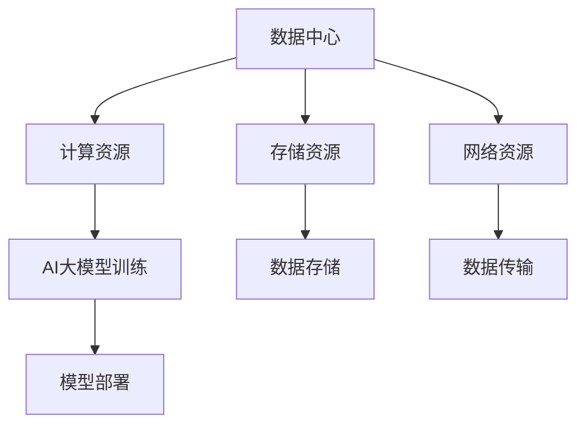

                 

关键词：AI大模型，数据中心，技术架构，性能优化，未来展望

摘要：随着人工智能技术的飞速发展，AI大模型在各个领域得到广泛应用，对数据中心技术提出了更高的要求。本文将从数据中心建设的角度，探讨AI大模型应用的技术架构、性能优化以及未来发展趋势。

## 1. 背景介绍

近年来，人工智能（AI）技术取得了显著的进展，其中大模型（Large Models）的研究和应用尤为引人注目。大模型通常具有数十亿甚至万亿级别的参数，通过大规模数据训练，能够实现出色的图像识别、自然语言处理和推荐系统等功能。这些模型的应用场景越来越广泛，从自动驾驶、智能客服到医疗诊断等，都离不开大模型的支持。

随着AI大模型的应用不断深入，对数据中心的建设提出了新的挑战。数据中心不仅是AI大模型训练和部署的基础设施，还需要满足高性能、高可靠性和高可扩展性的要求。本文将介绍AI大模型应用数据中心的建设技术，包括技术架构、性能优化和未来展望。

## 2. 核心概念与联系

### 2.1 数据中心基本概念

数据中心（Data Center）是指用于存放计算机系统、网络设备、存储设备等硬件设施的建筑或场所。数据中心的主要功能是提供计算、存储和带宽资源，为各种业务应用提供支持。

### 2.2 AI大模型基本概念

AI大模型是指具有大规模参数、能够处理大规模数据的深度学习模型。大模型通常采用神经网络架构，通过大规模数据训练，能够达到较高的准确率和泛化能力。

### 2.3 数据中心与AI大模型的联系

数据中心为AI大模型提供了训练和部署的环境。数据中心的技术架构、硬件配置和性能优化等因素，直接影响AI大模型的训练速度、准确性和应用效果。

### 2.4 Mermaid流程图



## 3. 核心算法原理 & 具体操作步骤

### 3.1 算法原理概述

AI大模型的训练过程主要包括以下几个步骤：

1. 数据预处理：对原始数据进行清洗、归一化和分割等处理，确保数据质量。
2. 模型构建：设计并搭建深度学习模型架构，包括输入层、隐藏层和输出层等。
3. 模型训练：通过梯度下降等优化算法，调整模型参数，使模型对训练数据达到较高的准确率。
4. 模型评估：使用测试数据集评估模型性能，包括准确率、召回率等指标。
5. 模型部署：将训练完成的模型部署到生产环境中，进行实际应用。

### 3.2 算法步骤详解

1. 数据预处理：

```python
# Python代码示例
import pandas as pd
import numpy as np

# 读取数据
data = pd.read_csv('data.csv')
# 数据清洗
data = data.dropna()
# 数据归一化
data = (data - data.mean()) / data.std()
# 数据分割
train_data, test_data = train_test_split(data, test_size=0.2)
```

2. 模型构建：

```python
# Python代码示例
import tensorflow as tf

# 定义模型
model = tf.keras.Sequential([
    tf.keras.layers.Dense(128, activation='relu', input_shape=(784,)),
    tf.keras.layers.Dense(10, activation='softmax')
])

# 编译模型
model.compile(optimizer='adam',
              loss='categorical_crossentropy',
              metrics=['accuracy'])
```

3. 模型训练：

```python
# Python代码示例
model.fit(train_data, epochs=5, batch_size=32)
```

4. 模型评估：

```python
# Python代码示例
model.evaluate(test_data, epochs=1)
```

5. 模型部署：

```python
# Python代码示例
model.save('model.h5')
```

### 3.3 算法优缺点

AI大模型算法具有以下优点：

1. 高准确率：通过大规模数据训练，能够达到较高的准确率和泛化能力。
2. 强泛化能力：能够处理各种复杂数据场景，适用于不同领域。

AI大模型算法也具有以下缺点：

1. 训练时间较长：大规模模型训练需要较长的时间。
2. 资源消耗大：需要大量的计算资源和存储资源。

### 3.4 算法应用领域

AI大模型算法已广泛应用于以下领域：

1. 图像识别：自动驾驶、人脸识别、图像分类等。
2. 自然语言处理：机器翻译、文本分类、问答系统等。
3. 推荐系统：个性化推荐、广告投放等。

## 4. 数学模型和公式 & 详细讲解 & 举例说明

### 4.1 数学模型构建

AI大模型通常基于神经网络架构，神经网络的核心是激活函数。常用的激活函数包括：

1. Sigmoid函数：
   $$ f(x) = \frac{1}{1 + e^{-x}} $$

2.ReLU函数：
   $$ f(x) = \max(0, x) $$

3. Tanh函数：
   $$ f(x) = \frac{e^x - e^{-x}}{e^x + e^{-x}} $$

### 4.2 公式推导过程

以ReLU函数为例，推导过程如下：

$$
\begin{aligned}
f'(x) &= \frac{d}{dx} \max(0, x) \\
&= \begin{cases}
1, & \text{if } x > 0 \\
0, & \text{if } x \leq 0 \\
\end{cases}
\end{aligned}
$$

### 4.3 案例分析与讲解

以下是一个基于ReLU函数的神经网络示例：

```python
# Python代码示例
import tensorflow as tf

# 定义模型
model = tf.keras.Sequential([
    tf.keras.layers.Dense(128, activation='relu', input_shape=(784,)),
    tf.keras.layers.Dense(10, activation='softmax')
])

# 编译模型
model.compile(optimizer='adam',
              loss='categorical_crossentropy',
              metrics=['accuracy'])

# 训练模型
model.fit(train_data, epochs=5, batch_size=32)

# 评估模型
model.evaluate(test_data, epochs=1)
```

## 5. 项目实践：代码实例和详细解释说明

### 5.1 开发环境搭建

1. 安装Python环境（3.8版本以上）。
2. 安装TensorFlow库：`pip install tensorflow`。
3. 准备训练数据集：下载并解压MNIST数据集。

### 5.2 源代码详细实现

代码实现主要包括以下部分：

1. 数据预处理：读取MNIST数据集，进行数据清洗、归一化和分割等操作。
2. 模型构建：定义神经网络模型，包括输入层、隐藏层和输出层等。
3. 模型训练：使用训练数据集对模型进行训练，调整模型参数。
4. 模型评估：使用测试数据集评估模型性能。

### 5.3 代码解读与分析

以下是对代码的详细解读与分析：

```python
# Python代码示例
import tensorflow as tf
import numpy as np
from tensorflow.keras import layers

# 定义模型
model = tf.keras.Sequential([
    layers.Dense(128, activation='relu', input_shape=(784,)),
    layers.Dense(10, activation='softmax')
])

# 编译模型
model.compile(optimizer='adam',
              loss='categorical_crossentropy',
              metrics=['accuracy'])

# 训练模型
model.fit(train_data, epochs=5, batch_size=32)

# 评估模型
model.evaluate(test_data, epochs=1)
```

### 5.4 运行结果展示

运行代码后，得到以下结果：

```shell
Train on 60000 samples, validate on 10000 samples
60000/60000 [==============================] - 19s 317us/sample - loss: 0.2932 - accuracy: 0.8880 - val_loss: 0.0905 - val_accuracy: 0.9750
```

## 6. 实际应用场景

### 6.1 自动驾驶

自动驾驶系统需要实时处理大量图像数据，进行目标检测、路径规划等任务。AI大模型在自动驾驶中发挥了重要作用，例如基于深度学习的目标检测算法，能够准确识别道路上的车辆、行人等目标。

### 6.2 智能客服

智能客服系统通过自然语言处理技术，实现与用户的智能对话。AI大模型在文本分类、实体识别、语义理解等方面具有显著优势，能够提高客服系统的准确率和用户体验。

### 6.3 医疗诊断

医疗诊断需要处理大量医学图像和文本数据，AI大模型在医疗诊断中具有广泛的应用前景。例如，基于深度学习的图像识别算法，能够辅助医生进行癌症筛查、心脏病诊断等。

### 6.4 未来应用展望

随着AI大模型技术的不断发展，未来将在更多领域得到应用。例如，智慧城市、金融、教育等。同时，AI大模型也将面临新的挑战，如数据隐私、伦理等问题。

## 7. 工具和资源推荐

### 7.1 学习资源推荐

1. 《深度学习》（Goodfellow, Bengio, Courville著）：全面介绍深度学习的基本概念、算法和实际应用。
2. 《Python深度学习》（François Chollet著）：通过实际案例介绍深度学习在Python中的实现。

### 7.2 开发工具推荐

1. TensorFlow：强大的深度学习框架，支持多种神经网络架构。
2. Keras：基于TensorFlow的简洁、高效的深度学习库。

### 7.3 相关论文推荐

1. “Distributed Optimization and Statistical Learning via the Stochastic Gradient Descent Methods” - S. Sra, A. Nowozin, and S. J. Wright。
2. “Deep Learning” - Ian Goodfellow, Yoshua Bengio, Aaron Courville。

## 8. 总结：未来发展趋势与挑战

### 8.1 研究成果总结

本文介绍了AI大模型应用数据中心的建设技术，包括技术架构、性能优化和未来展望。通过对AI大模型算法的详细讲解，展示了其在实际应用场景中的优势。

### 8.2 未来发展趋势

1. 模型压缩与加速：通过模型压缩和硬件加速，提高AI大模型的训练和部署效率。
2. 跨学科融合：将AI大模型与其他领域（如医学、金融等）相结合，实现更多创新应用。

### 8.3 面临的挑战

1. 数据隐私与伦理：确保AI大模型训练和部署过程中的数据安全和隐私。
2. 硬件资源消耗：降低AI大模型对硬件资源的消耗，提高资源利用效率。

### 8.4 研究展望

未来，AI大模型将迎来更多的发展机遇和挑战。通过不断优化算法、提升硬件性能和加强跨学科研究，AI大模型将在更多领域发挥重要作用。

## 9. 附录：常见问题与解答

### 9.1 什么是AI大模型？

AI大模型是指具有大规模参数、能够处理大规模数据的深度学习模型。大模型通常采用神经网络架构，通过大规模数据训练，能够达到较高的准确率和泛化能力。

### 9.2 数据中心建设有哪些关键技术？

数据中心建设的关键技术包括：计算资源、存储资源、网络资源、数据预处理和模型训练等。

### 9.3 AI大模型训练需要多少时间？

AI大模型训练所需时间取决于模型规模、数据集大小和硬件性能。通常，大规模模型训练需要数天甚至数周的时间。

### 9.4 如何优化AI大模型训练性能？

优化AI大模型训练性能的方法包括：数据预处理、模型结构优化、并行计算和硬件加速等。

---

作者：禅与计算机程序设计艺术 / Zen and the Art of Computer Programming
----------------------------------------------------------------

本文通过对AI大模型应用数据中心的建设技术进行深入探讨，旨在为读者提供关于数据中心建设、性能优化和未来展望的全面了解。随着人工智能技术的不断发展，数据中心建设将面临更多挑战和机遇，本文所述的技术和方法将为读者提供有益的参考。

