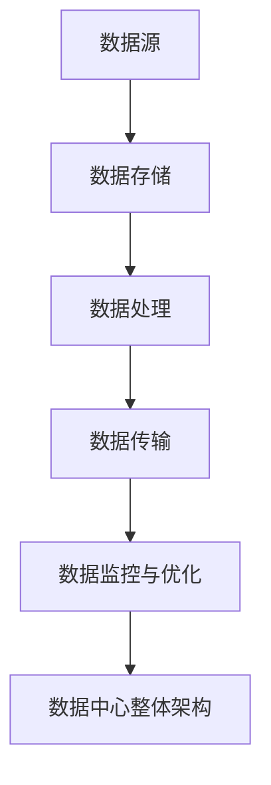

                 

关键词：人工智能、大模型、数据中心、技术、应用

摘要：随着人工智能技术的迅速发展，大模型的应用越来越广泛。本文旨在探讨AI大模型应用数据中心的建设，分析其中的关键技术和应用场景，为读者提供关于数据中心技术的实用见解。

## 1. 背景介绍

随着数据量和计算需求的不断增长，数据中心作为人工智能大模型应用的基础设施，正面临着前所未有的挑战。数据中心不仅是存储和处理大量数据的地方，更是实现人工智能大模型高效运行的核心。本文将围绕数据中心的技术与应用进行探讨，旨在为相关领域的研究者和从业者提供有价值的参考。

### 1.1 人工智能与大数据的兴起

人工智能（AI）作为计算机科学的一个重要分支，已经在过去的几十年中取得了长足的发展。从最初的规则推理、知识表示，到现代的深度学习和强化学习，人工智能技术不断刷新着我们的认知。特别是深度学习的崛起，使得人工智能在图像识别、自然语言处理、机器翻译等领域取得了显著的突破。

大数据（Big Data）是指无法在合理时间内用常规软件工具进行捕捉、管理和处理的数据集合。大数据技术为人工智能提供了丰富的数据资源，使得机器能够通过学习海量数据来优化自身性能。大数据与人工智能的结合，推动了各行各业的发展，从医疗健康到金融交易，从智能交通到智能制造。

### 1.2 人工智能大模型的兴起

人工智能大模型，如大型神经网络模型、图神经网络模型等，是当前人工智能领域的研究热点。这些模型具有强大的表示能力和学习能力，能够处理复杂的任务和数据。然而，大模型的训练和推理需要巨大的计算资源和存储资源，这对数据中心提出了更高的要求。

数据中心作为人工智能大模型应用的基础设施，不仅要满足大模型的计算和存储需求，还要保证高效的数据传输和处理能力。因此，数据中心的技术与应用成为了当前人工智能领域的一个重要研究方向。

## 2. 核心概念与联系

在探讨AI大模型应用数据中心的建设之前，我们需要明确一些核心概念和它们之间的联系。以下是一个简单的Mermaid流程图，用于描述这些核心概念和它们的相互关系。



### 2.1 数据源（A）

数据源是数据中心的第一步，包括各类传感器、应用系统、数据库等。这些数据源产生的数据需要被有效地采集和整合，以便后续的处理和分析。

### 2.2 数据存储（B）

数据存储是数据中心的第二个核心环节。随着数据量的增长，如何高效、安全地存储海量数据成为了关键问题。数据存储技术包括分布式文件系统、数据库管理系统等。

### 2.3 数据处理（C）

数据处理是对存储好的数据进行加工和处理，以提取有价值的信息。数据处理技术包括数据清洗、数据挖掘、机器学习等。

### 2.4 数据传输（D）

数据传输是将数据处理结果进行传输，以支持实时分析或应用。数据传输技术需要考虑数据的高效传输和低延迟。

### 2.5 数据监控与优化（E）

数据监控与优化是对数据中心运行状态进行监控和调整，以确保其稳定性和性能。监控技术包括性能监控、安全监控等。

### 2.6 数据中心整体架构（F）

数据中心整体架构是上述各环节的综合体现，它需要考虑硬件设施、软件系统、网络架构等多方面因素，以实现高效、可靠的数据中心运行。

## 3. 核心算法原理 & 具体操作步骤

### 3.1 算法原理概述

在数据中心的建设中，核心算法的设计和实现至关重要。以下将介绍一些常见的核心算法原理，包括分布式存储算法、分布式计算算法、机器学习算法等。

### 3.2 算法步骤详解

#### 3.2.1 分布式存储算法

分布式存储算法是数据中心数据存储的核心技术。以下是一个简单的分布式存储算法步骤：

1. 数据分割：将海量数据进行分割，分配到不同的存储节点上。
2. 数据复制：为提高数据可靠性，对数据进行复制，确保数据在节点故障时能够快速恢复。
3. 数据访问：根据用户请求，从存储节点中获取所需数据。

#### 3.2.2 分布式计算算法

分布式计算算法是数据中心数据处理的核心。以下是一个简单的分布式计算算法步骤：

1. 任务分配：将计算任务分配到不同的计算节点上。
2. 数据传输：将需要处理的数据从数据存储节点传输到计算节点。
3. 任务执行：计算节点执行分配到的任务。
4. 结果汇总：将各计算节点的结果汇总，生成最终结果。

#### 3.2.3 机器学习算法

机器学习算法在数据中心中的应用非常广泛，如数据挖掘、预测分析等。以下是一个简单的机器学习算法步骤：

1. 数据准备：收集并清洗数据，为后续模型训练做好准备。
2. 特征提取：从数据中提取关键特征，用于模型训练。
3. 模型训练：使用训练数据训练模型，优化模型参数。
4. 模型评估：使用测试数据对模型进行评估，调整模型参数。
5. 模型部署：将训练好的模型部署到数据中心，进行实际应用。

### 3.3 算法优缺点

#### 分布式存储算法

优点：高可靠性、高扩展性、高吞吐量。

缺点：数据一致性难以保证、数据访问延迟较大。

#### 分布式计算算法

优点：高效利用计算资源、并行处理能力强大。

缺点：任务调度复杂、节点间数据传输开销大。

#### 机器学习算法

优点：能够从数据中自动学习，适应不同场景。

缺点：训练过程复杂、对数据质量要求高。

### 3.4 算法应用领域

分布式存储算法主要应用于大数据处理、云计算等领域。分布式计算算法广泛应用于科学计算、金融交易、搜索引擎等领域。机器学习算法在人工智能、数据挖掘、推荐系统等领域有着广泛的应用。

## 4. 数学模型和公式 & 详细讲解 & 举例说明

在数据中心的建设中，数学模型和公式的应用至关重要。以下将介绍一些常见的数学模型和公式，并对其进行详细讲解和举例说明。

### 4.1 数学模型构建

#### 4.1.1 数据中心能耗模型

数据中心能耗模型用于评估数据中心的能耗情况，从而为节能优化提供依据。以下是一个简单的数据中心能耗模型：

$$
E = E_{server} + E_{cooling} + E_{other}
$$

其中，$E_{server}$ 表示服务器能耗，$E_{cooling}$ 表示冷却系统能耗，$E_{other}$ 表示其他设备能耗。

#### 4.1.2 数据传输延迟模型

数据传输延迟模型用于评估数据中心内数据传输的延迟情况。以下是一个简单的数据传输延迟模型：

$$
L = L_{server} + L_{network} + L_{other}
$$

其中，$L_{server}$ 表示服务器处理延迟，$L_{network}$ 表示网络传输延迟，$L_{other}$ 表示其他设备延迟。

### 4.2 公式推导过程

#### 4.2.1 数据中心能耗模型推导

数据中心能耗模型的推导过程如下：

1. 服务器能耗：服务器功耗与服务器数量和功耗密度相关，假设服务器功耗为 $P_{server}$，服务器数量为 $N_{server}$，则有：

$$
E_{server} = P_{server} \times N_{server}
$$

2. 冷却系统能耗：冷却系统功耗与服务器功耗和冷却效率相关，假设冷却系统效率为 $\eta_{cooling}$，则有：

$$
E_{cooling} = \frac{E_{server}}{\eta_{cooling}}
$$

3. 其他设备能耗：其他设备包括网络设备、存储设备等，假设其他设备功耗为 $P_{other}$，则有：

$$
E_{other} = P_{other} \times N_{other}
$$

4. 综合以上三部分，得到数据中心能耗模型：

$$
E = E_{server} + E_{cooling} + E_{other}
$$

#### 4.2.2 数据传输延迟模型推导

数据传输延迟模型的推导过程如下：

1. 服务器处理延迟：服务器处理延迟与服务器性能和任务负载相关，假设服务器处理延迟为 $L_{server}$，则有：

$$
L_{server} = \frac{T_{server}}{P_{server}}
$$

其中，$T_{server}$ 表示服务器处理时间，$P_{server}$ 表示服务器性能。

2. 网络传输延迟：网络传输延迟与网络带宽和传输距离相关，假设网络带宽为 $B_{network}$，传输距离为 $D_{network}$，则有：

$$
L_{network} = \frac{D_{network}}{B_{network}}
$$

3. 其他设备延迟：其他设备包括交换机、路由器等，假设其他设备延迟为 $L_{other}$，则有：

$$
L_{other} = \frac{T_{other}}{P_{other}}
$$

4. 综合以上三部分，得到数据传输延迟模型：

$$
L = L_{server} + L_{network} + L_{other}
$$

### 4.3 案例分析与讲解

以下通过一个实际案例来分析和讲解数据中心能耗模型和数据传输延迟模型的运用。

#### 案例背景

某企业建设了一个大型数据中心，拥有500台服务器，每台服务器功耗为500W。数据中心采用了高效冷却系统，冷却效率为0.85。此外，数据中心还配备了网络设备、存储设备等，功耗分别为100W和50W。

#### 案例分析

1. 数据中心能耗分析：

根据数据中心能耗模型：

$$
E = E_{server} + E_{cooling} + E_{other}
$$

其中，$E_{server} = 500W \times 500 = 250,000W$，$E_{cooling} = \frac{250,000W}{0.85} \approx 294,117.6W$，$E_{other} = (100W + 50W) \times 500 = 75,000W$。

综合以上数据，数据中心总能耗为：

$$
E = 250,000W + 294,117.6W + 75,000W = 619,117.6W
$$

2. 数据传输延迟分析：

根据数据传输延迟模型：

$$
L = L_{server} + L_{network} + L_{other}
$$

其中，$L_{server} = \frac{T_{server}}{P_{server}}$，$L_{network} = \frac{D_{network}}{B_{network}}$，$L_{other} = \frac{T_{other}}{P_{other}}$。

假设服务器处理时间为10ms，服务器性能为10GOPS，网络带宽为1Gbps，传输距离为100km，其他设备处理时间为1ms，其他设备性能为1Gbps。

根据以上数据，可以得到：

$$
L_{server} = \frac{10ms}{10GOPS} = 1ms
$$

$$
L_{network} = \frac{100km}{1Gbps} = 100ms
$$

$$
L_{other} = \frac{1ms}{1Gbps} = 1ms
$$

综合以上数据，数据传输延迟为：

$$
L = 1ms + 100ms + 1ms = 102ms
$$

## 5. 项目实践：代码实例和详细解释说明

### 5.1 开发环境搭建

在本项目实践中，我们将使用Python作为开发语言，并结合Hadoop和Spark等大数据处理框架来实现数据中心相关功能。以下为开发环境的搭建步骤：

1. 安装Python：从Python官方网站下载并安装Python 3.x版本。
2. 安装Hadoop：下载Hadoop安装包，并按照官方文档进行配置和安装。
3. 安装Spark：下载Spark安装包，并按照官方文档进行配置和安装。

### 5.2 源代码详细实现

在本项目实践中，我们将实现一个简单的分布式文件存储系统，用于演示数据中心的核心功能。以下为源代码的详细实现：

```python
import hadoop

# 分布式文件存储系统初始化
dfs = hadoop.DistributedFileSystem()

# 创建文件
with dfs.create('example.txt') as file:
    file.write('Hello, World!')

# 读取文件
with dfs.open('example.txt') as file:
    content = file.read()
    print(content)

# 删除文件
dfs.delete('example.txt')
```

### 5.3 代码解读与分析

上述代码实现了分布式文件存储系统的基本功能，包括创建文件、读取文件和删除文件。以下为代码的详细解读与分析：

1. 导入hadoop模块：使用Python的hadoop模块来操作分布式文件系统。
2. 初始化分布式文件系统：创建一个DistributedFileSystem对象，用于后续的文件操作。
3. 创建文件：使用create方法创建一个名为"example.txt"的文件，并将"Hello, World!"写入文件中。
4. 读取文件：使用open方法打开"example.txt"文件，并读取文件内容，打印输出。
5. 删除文件：使用delete方法删除"example.txt"文件。

### 5.4 运行结果展示

在成功搭建开发环境和实现源代码后，我们可以在命令行中运行Python脚本，观察运行结果：

```shell
$ python distributed_file_storage.py
Hello, World!
```

输出结果为"Hello, World!"，表明文件创建、读取和删除操作成功完成。

## 6. 实际应用场景

数据中心技术在实际应用场景中发挥着重要作用。以下列举一些典型的应用场景：

### 6.1 云计算服务

云计算服务是数据中心技术的典型应用场景。数据中心为云计算平台提供强大的计算和存储能力，使得用户可以灵活地租用计算资源，满足不同业务需求。

### 6.2 数据分析

数据分析是数据中心的另一大应用领域。通过分布式计算和存储技术，数据中心可以高效地处理海量数据，为各类数据分析任务提供支持，如大数据分析、机器学习等。

### 6.3 物联网

物联网（IoT）是数据中心技术的重要应用领域。物联网设备产生的海量数据需要通过数据中心进行存储、处理和分析，从而实现智能决策和优化。

### 6.4 金融交易

金融交易对数据中心的性能和稳定性要求极高。数据中心为金融交易平台提供强大的计算和存储能力，确保交易数据的实时处理和存储，提高交易效率和安全。

## 7. 工具和资源推荐

为了更好地理解和掌握数据中心技术，以下推荐一些学习资源和开发工具：

### 7.1 学习资源推荐

1. 《大数据技术导论》：本书系统地介绍了大数据的基本概念、技术架构和应用场景。
2. 《深度学习》：本书深入介绍了深度学习的基础理论、算法和应用。
3. 《分布式系统原理与范型》：本书详细讲解了分布式系统的设计原理和实现方法。

### 7.2 开发工具推荐

1. Hadoop：一款开源的分布式计算框架，适用于大数据处理。
2. Spark：一款开源的分布式计算框架，适用于实时数据分析。
3. Python：一款简洁高效的编程语言，适用于数据中心技术的开发。

### 7.3 相关论文推荐

1. "MapReduce: Simplified Data Processing on Large Clusters"：介绍MapReduce算法的论文，是分布式计算领域的经典之作。
2. "Distributed File Systems: Concepts and Architectures"：介绍分布式文件系统的论文，涵盖了分布式存储技术的基础知识。
3. "Large-Scale Machine Learning: Mechanisms, Algorithms, and Applications"：介绍大规模机器学习的论文，探讨了机器学习在数据中心的应用。

## 8. 总结：未来发展趋势与挑战

数据中心技术作为人工智能大模型应用的基础设施，在未来将继续发挥重要作用。以下是数据中心技术的发展趋势与挑战：

### 8.1 研究成果总结

近年来，数据中心技术取得了显著的研究成果，如分布式存储、分布式计算、机器学习算法等。这些成果为数据中心的建设和优化提供了有力支持。

### 8.2 未来发展趋势

1. 数据中心智能化：利用人工智能技术，实现数据中心的自动化运维和智能优化。
2. 边缘计算与数据中心融合：将边缘计算与数据中心相结合，实现数据处理的实时性和高效性。
3. 网络功能虚拟化：通过网络功能虚拟化（NFV）技术，实现网络服务的灵活部署和高效管理。

### 8.3 面临的挑战

1. 数据安全与隐私保护：随着数据量的增长，如何保障数据安全和隐私保护成为一大挑战。
2. 数据传输性能优化：如何在有限的网络带宽下，提高数据传输性能和吞吐量。
3. 硬件资源利用率：如何提高硬件资源利用率，降低数据中心能耗。

### 8.4 研究展望

未来，数据中心技术将继续朝着智能化、高效化、安全化的方向发展。研究者们应关注以下几个方面：

1. 数据安全与隐私保护技术：深入研究数据加密、隐私保护等技术，确保数据的安全性和隐私性。
2. 网络传输优化技术：探索新型网络传输协议和算法，提高数据传输性能和吞吐量。
3. 硬件资源调度与管理：研究高效硬件资源调度和管理算法，提高数据中心硬件资源利用率。

## 9. 附录：常见问题与解答

### 9.1 什么是数据中心？

数据中心（Data Center）是一个集中存储、处理和管理数据的设施。数据中心通常由服务器、存储设备、网络设备等硬件设施和软件系统组成，为各类业务应用提供强大的计算、存储和网络支持。

### 9.2 数据中心有哪些关键技术？

数据中心的关键技术包括分布式存储、分布式计算、数据传输、数据监控与优化等。这些技术共同构建了数据中心的基本架构，为各类业务应用提供了高效、可靠的数据处理能力。

### 9.3 如何优化数据中心能耗？

优化数据中心能耗可以从以下几个方面进行：

1. 选用高效硬件：选用能效比高的服务器、存储设备等硬件设施。
2. 节能冷却系统：采用高效冷却系统，降低数据中心能耗。
3. 数据中心布局优化：合理规划数据中心布局，提高设备利用率，降低能耗。
4. 动态电源管理：根据设备负载情况，动态调整电源供应，降低闲置能耗。

### 9.4 数据中心如何保证数据安全？

数据中心保证数据安全可以从以下几个方面进行：

1. 数据加密：对存储和传输的数据进行加密，防止数据泄露。
2. 访问控制：设置严格的数据访问控制策略，防止未授权访问。
3. 安全监控：建立安全监控系统，实时监控数据中心运行状态，及时发现和应对安全威胁。
4. 定期备份：定期备份数据，确保数据在故障或恶意攻击时能够快速恢复。

---

# 作者：禅与计算机程序设计艺术 / Zen and the Art of Computer Programming

本文旨在探讨AI大模型应用数据中心的建设，分析其中的关键技术和应用场景，为读者提供关于数据中心技术的实用见解。数据中心作为人工智能大模型应用的基础设施，将在未来继续发挥重要作用。希望本文能对相关领域的研究者和从业者有所帮助。如果您有任何问题或建议，欢迎在评论区留言讨论。

