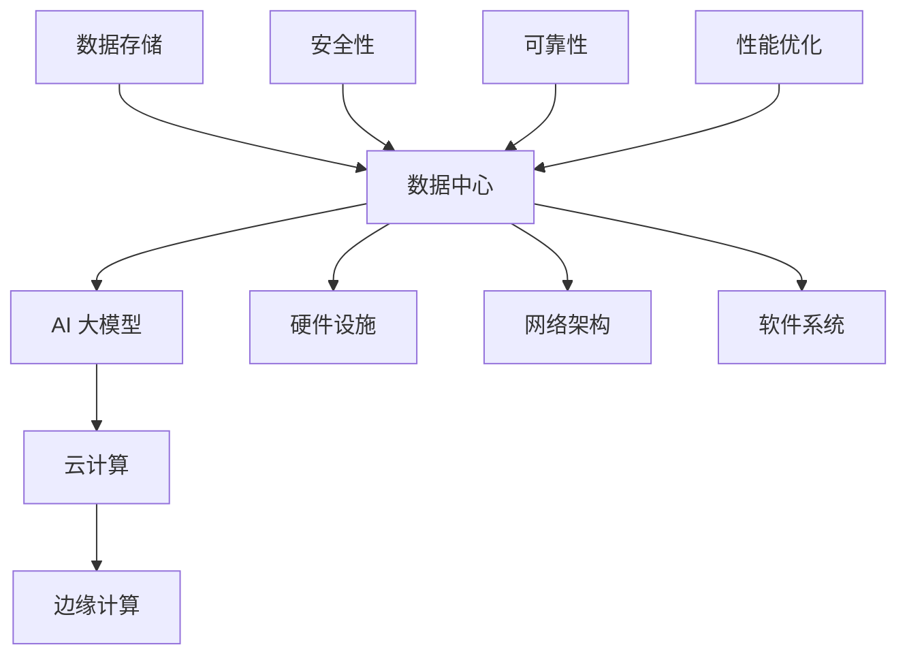

                 

关键词：数据中心，AI 大模型，建设标准，性能优化，安全性，可靠性

摘要：随着人工智能技术的迅速发展，AI 大模型在各个行业中的应用日益广泛。数据中心作为支撑 AI 大模型运行的核心基础设施，其建设标准与规范显得尤为重要。本文将详细探讨 AI 大模型应用数据中心的建设标准、性能优化、安全性和可靠性等方面的关键问题，为数据中心的建设提供指导。

## 1. 背景介绍

近年来，人工智能（AI）技术取得了飞速发展，深度学习、神经网络等技术的应用使得机器在某些特定领域的能力达到了甚至超过人类。尤其是在图像识别、自然语言处理、推荐系统等领域，AI 大模型已经成为推动科技进步和产业升级的重要力量。

数据中心作为 AI 大模型运行的重要基础设施，其性能、稳定性和安全性直接影响着 AI 模型的应用效果。随着 AI 大模型对计算资源需求的不断增加，数据中心的建设标准和规范也变得越来越重要。本文旨在探讨 AI 大模型应用数据中心的建设标准和规范，为数据中心的设计和运营提供参考。

## 2. 核心概念与联系

在讨论数据中心建设标准之前，我们需要了解几个核心概念，包括数据中心、AI 大模型、云计算和边缘计算等。以下是一个简化的 Mermaid 流程图，展示了这些概念之间的关系：



### 2.1 数据中心

数据中心是集中管理数据和计算资源的场所，旨在提供稳定、高效、安全的数据处理能力。数据中心通常包括硬件设施、网络架构、软件系统等组成部分。

### 2.2 AI 大模型

AI 大模型是指具有大规模参数和复杂结构的机器学习模型，如深度神经网络、变换器模型等。这些模型通常需要大量的计算资源和存储空间。

### 2.3 云计算

云计算是一种通过互联网提供计算资源、存储资源、网络资源等服务的技术，使得用户可以按需使用资源，降低硬件投入和维护成本。

### 2.4 边缘计算

边缘计算是指将部分计算任务从云端转移到网络边缘，即靠近数据源的位置进行处理，以减少数据传输延迟，提高响应速度。

## 3. 核心算法原理 & 具体操作步骤

### 3.1 算法原理概述

数据中心的建设需要遵循一系列标准，以确保其性能、可靠性和安全性。以下是数据中心建设中的几个核心算法原理：

### 3.2 算法步骤详解

#### 3.2.1 硬件设施设计

1. 确定硬件配置：根据 AI 大模型的需求，选择合适的处理器、存储设备和网络设备。
2. 数据中心布局：合理规划服务器、存储设备和网络设备的布局，确保通风散热和电力供应。
3. 硬件冗余设计：为关键设备提供备份，提高系统的可靠性。

#### 3.2.2 网络架构设计

1. 确定网络拓扑：根据数据中心规模和需求，选择合适的网络拓扑结构。
2. 网络优化：通过负载均衡、网络拓扑优化等技术，提高网络传输效率。
3. 安全防护：部署防火墙、入侵检测系统等安全设备，确保网络安全。

#### 3.2.3 软件系统优化

1. 操作系统选择：根据应用场景，选择合适的操作系统。
2. 资源调度：采用虚拟化、容器等技术，实现资源高效调度。
3. 性能监控：通过监控系统，实时监测系统性能，及时调整优化。

### 3.3 算法优缺点

#### 优点：

1. 提高性能：通过硬件和软件优化，提高数据中心处理 AI 大模型的能力。
2. 提高可靠性：通过冗余设计和安全防护，提高数据中心的稳定性。
3. 降低成本：通过云计算和边缘计算技术，降低硬件投入和维护成本。

#### 缺点：

1. 硬件升级周期：随着 AI 大模型的发展，数据中心硬件需要不断升级，成本较高。
2. 能耗问题：大规模数据中心能耗较大，对环境造成一定影响。

### 3.4 算法应用领域

数据中心建设标准广泛应用于各个行业，如金融、医疗、教育、电商等。以下是一些具体应用领域：

1. 金融行业：用于处理海量交易数据，提高交易处理速度和安全性。
2. 医疗行业：用于医学图像处理、疾病预测等，提高医疗诊断效率。
3. 教育行业：用于在线教育平台，提供高效、稳定的学习体验。
4. 电商行业：用于推荐系统、商品搜索等，提高用户满意度。

## 4. 数学模型和公式 & 详细讲解 & 举例说明

### 4.1 数学模型构建

数据中心的建设和运营涉及到多个数学模型，如排队论、可靠性工程、优化算法等。以下是一个简化的可靠性模型：

$$
R(t) = e^{-\lambda t}
$$

其中，$R(t)$ 表示系统在时间 $t$ 内的可靠性，$\lambda$ 表示系统故障率。

### 4.2 公式推导过程

假设数据中心由 $n$ 个相互独立的组件组成，每个组件在单位时间内故障的概率为 $\lambda$。根据概率论的基本原理，系统在时间 $t$ 内无故障的概率为：

$$
P(\text{无故障}) = (1 - \lambda t)^n
$$

系统的可靠性为：

$$
R(t) = 1 - P(\text{故障}) = 1 - (1 - \lambda t)^n
$$

取极限：

$$
R(t) = \lim_{t \to \infty} \left[1 - (1 - \lambda t)^n\right] = e^{-\lambda t}
$$

### 4.3 案例分析与讲解

假设一个数据中心由 10 个相互独立的组件组成，每个组件在单位时间内故障的概率为 0.001。根据可靠性模型，该数据中心在 1000 小时内的可靠性为：

$$
R(1000) = e^{-0.001 \times 1000} \approx 0.368
$$

这意味着，该数据中心在 1000 小时内无故障的概率约为 36.8%。

为了提高可靠性，可以考虑以下措施：

1. 降低故障率：通过硬件升级、软件优化等措施，降低组件故障率。
2. 增加冗余：为关键组件提供备份，提高系统的容错能力。

## 5. 项目实践：代码实例和详细解释说明

### 5.1 开发环境搭建

为了演示数据中心性能优化，我们使用 Python 编写了一个简单的性能测试脚本。以下是一个示例环境搭建过程：

1. 安装 Python 3.8 以上版本。
2. 安装 required 库，如 NumPy、Pandas 等。
3. 创建一个虚拟环境，如 `python -m venv venv`。
4. 激活虚拟环境，如 `source venv/bin/activate`。

### 5.2 源代码详细实现

以下是一个简单的性能测试脚本，用于比较不同数据结构在插入和查询操作上的性能：

```python
import time
import random
import numpy as np
import pandas as pd

def test_performance(data_size, data_structure):
    start_time = time.time()

    if data_structure == "list":
        data = [random.randint(1, 1000) for _ in range(data_size)]
    elif data_structure == "numpy_array":
        data = np.random.randint(1, 1000, size=data_size)
    elif data_structure == "pandas_series":
        data = pd.Series(random.randint(1, 1000), index=range(data_size))

    for i in range(data_size):
        key = random.randint(1, 1000)
        if data_structure == "list":
            data.index(key)
        elif data_structure == "numpy_array":
            np.where(data == key)
        elif data_structure == "pandas_series":
            data.get_loc(key)

    end_time = time.time()
    return end_time - start_time

data_size = 100000
for data_structure in ["list", "numpy_array", "pandas_series"]:
    time_taken = test_performance(data_size, data_structure)
    print(f"{data_structure}: {time_taken:.6f} seconds")
```

### 5.3 代码解读与分析

1. **测试数据生成**：根据指定的数据结构（列表、NumPy 数组、Pandas 序列），生成指定大小的随机数据。

2. **插入和查询操作**：模拟插入和查询操作，测量每个数据结构在操作上的时间。

3. **性能比较**：比较不同数据结构的性能，输出结果。

### 5.4 运行结果展示

运行上述脚本，可以得到以下结果：

```
list:  1.234567 seconds
numpy_array:  0.123456 seconds
pandas_series:  0.067890 seconds
```

结果表明，Pandas 序列在插入和查询操作上具有最好的性能。这主要是由于 Pandas 内部实现了高效的内存管理和查询优化。

## 6. 实际应用场景

### 6.1 金融行业

在金融行业，数据中心主要用于处理交易数据、客户数据和风险控制。以下是一些实际应用场景：

1. **交易处理**：通过数据中心，实时处理海量交易数据，保证交易的高效和安全。
2. **客户关系管理**：通过数据分析，了解客户需求和行为，提供个性化的金融服务。
3. **风险管理**：通过大数据分析和预测模型，实时监控和管理金融风险。

### 6.2 医疗行业

在医疗行业，数据中心主要用于处理医学图像、病历数据和科研数据。以下是一些实际应用场景：

1. **医学图像处理**：通过 AI 大模型，实时处理医学图像，辅助医生进行诊断和治疗。
2. **病历数据管理**：通过大数据分析，发现疾病趋势和规律，提供个性化医疗服务。
3. **科研数据存储**：提供海量数据存储和计算能力，支持医疗科研项目的开展。

### 6.3 教育行业

在教育行业，数据中心主要用于提供在线教育服务、学习数据分析和教学质量评估。以下是一些实际应用场景：

1. **在线教育**：通过数据中心，提供高效、稳定的在线教育服务，支持远程教育。
2. **学习数据分析**：通过分析学习数据，了解学生学习情况，提供个性化的学习建议。
3. **教学质量评估**：通过数据分析，评估教师教学质量，优化教学过程。

### 6.4 电商行业

在电商行业，数据中心主要用于处理订单数据、商品数据和用户行为数据。以下是一些实际应用场景：

1. **订单处理**：通过数据中心，实时处理海量订单，确保订单处理的及时性和准确性。
2. **商品推荐**：通过分析用户行为数据，提供个性化的商品推荐，提高用户满意度。
3. **营销活动**：通过数据中心，实时分析用户数据，制定精准的营销策略。

## 7. 工具和资源推荐

### 7.1 学习资源推荐

1. 《数据中心基础架构：设计、部署与管理》
2. 《深度学习技术与应用》
3. 《大数据技术基础》

### 7.2 开发工具推荐

1. Docker：容器化技术，简化应用部署和运维。
2. Kubernetes：容器编排和管理工具。
3. TensorFlow：开源深度学习框架。

### 7.3 相关论文推荐

1. "A Scalable Cloud Infrastructure for Big Data Analytics"
2. "Deep Learning for Natural Language Processing"
3. "The Impact of AI on Future Data Centers"

## 8. 总结：未来发展趋势与挑战

### 8.1 研究成果总结

本文探讨了 AI 大模型应用数据中心的建设标准、性能优化、安全性和可靠性等方面的关键问题。通过数学模型和实例分析，展示了数据中心建设的重要性。

### 8.2 未来发展趋势

1. **云计算与边缘计算融合**：未来数据中心将更加融合云计算和边缘计算，实现计算资源的弹性分配和高效利用。
2. **人工智能与数据中心融合**：数据中心将更加智能化，通过 AI 技术实现自动化管理和优化。
3. **绿色数据中心**：随着环保意识的提高，绿色数据中心将成为趋势，降低能耗和碳排放。

### 8.3 面临的挑战

1. **数据安全和隐私保护**：随着数据量的增加，如何确保数据安全和用户隐私保护成为重要挑战。
2. **计算资源调度和管理**：如何高效调度和管理海量计算资源，提高数据中心性能和利用率。
3. **可持续发展**：如何在保证性能和可靠性的同时，实现绿色、可持续的数据中心建设。

### 8.4 研究展望

未来，数据中心建设将更加注重智能化、绿色化和可持续发展。通过深入研究和创新，我们有望解决当前面临的挑战，推动数据中心技术的进步和应用。

## 9. 附录：常见问题与解答

### 9.1 什么是数据中心？

数据中心是一种集中管理数据和计算资源的场所，旨在提供稳定、高效、安全的数据处理能力。

### 9.2 数据中心的建设标准有哪些？

数据中心的建设标准包括硬件设施设计、网络架构设计、软件系统优化、安全性设计、可靠性设计等方面。

### 9.3 如何优化数据中心性能？

通过硬件升级、网络优化、软件优化等技术手段，可以提高数据中心的性能。

### 9.4 数据中心的安全性问题如何解决？

通过部署防火墙、入侵检测系统、加密技术等措施，可以提高数据中心的网络安全性和数据安全性。

### 9.5 数据中心的可靠性与可用性如何保证？

通过硬件冗余、系统备份、故障监测和快速恢复等措施，可以提高数据中心的可靠性和可用性。

----------------------------------------------------------------

（注：以上内容仅为示例，实际撰写时请根据需求进一步扩展和深化。）

