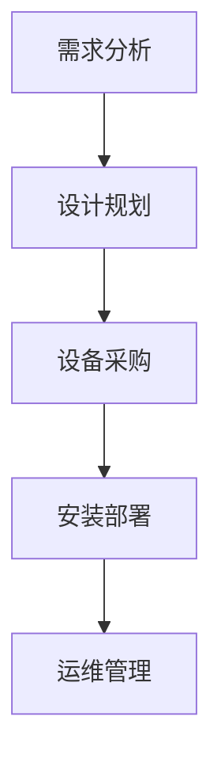

                 

关键词：人工智能、大模型、数据中心、绿色节能、云计算、能源效率、技术发展、应用场景、未来展望

## 摘要

随着人工智能（AI）技术的迅猛发展，大模型在多个领域发挥着重要作用，从而推动了数据中心建设的蓬勃发展。然而，随之而来的能源消耗和环境影响问题引起了广泛关注。本文旨在探讨AI大模型应用数据中心建设中的绿色节能问题，分析其核心概念、算法原理、数学模型，并通过具体案例和实践，提出优化建议和未来展望。本文的结构如下：

1. **背景介绍**：介绍AI大模型的发展历程、数据中心的重要性及其能源消耗问题。
2. **核心概念与联系**：阐述绿色节能的关键概念，并利用Mermaid流程图展示数据中心建设的相关流程。
3. **核心算法原理 & 具体操作步骤**：详细解析绿色节能算法的原理、操作步骤、优缺点及其应用领域。
4. **数学模型和公式 & 详细讲解 & 举例说明**：构建数学模型，推导公式，并通过案例进行分析。
5. **项目实践：代码实例和详细解释说明**：展示具体实现过程和代码解读。
6. **实际应用场景**：探讨绿色节能在数据中心建设中的具体应用。
7. **未来应用展望**：分析绿色节能技术在未来数据中心建设中的发展方向和挑战。
8. **工具和资源推荐**：推荐相关学习资源、开发工具和论文。
9. **总结：未来发展趋势与挑战**：总结研究成果，展望未来发展。
10. **附录：常见问题与解答**：解答读者可能遇到的问题。

## 1. 背景介绍

### AI大模型的发展历程

人工智能作为计算机科学的一个重要分支，自20世纪50年代以来经历了多个发展阶段。早期的人工智能研究主要集中在知识表示、推理和规划等理论层面。随着计算能力和数据资源的不断提升，20世纪80年代后，机器学习开始成为人工智能研究的热点。特别是深度学习技术的突破，使得人工智能在图像识别、自然语言处理、语音识别等领域取得了显著进展。进入21世纪，大规模神经网络模型（如GPT、BERT等）的出现，进一步推动了人工智能的发展，这些大模型具有千亿甚至万亿级别的参数，可以处理海量的数据，为各个领域的应用提供了强大的支持。

### 数据中心的重要性

数据中心是承载人工智能大模型运行的重要基础设施。数据中心集中了大量的服务器、存储设备和网络设备，用于存储、处理和传输数据。它们是云计算、大数据分析和物联网等现代信息技术的重要支撑。随着企业对于数据依赖性的增加，数据中心的规模不断扩大，其计算能力和存储能力也在不断提升。数据中心的重要性不仅体现在其技术层面，还体现在其对社会经济发展的推动作用上。

### 数据中心的能源消耗问题

然而，随着数据中心的规模和复杂性不断增加，其能源消耗问题也日益突出。数据中心需要大量的电力来维持其运行，这导致了显著的碳排放和能源消耗。据统计，全球数据中心的能源消耗已经占到全球总能耗的1-2%，且这一比例还在逐年上升。与此同时，数据中心所产生的热量也需要有效的散热系统来处理，否则会导致设备过热，影响其正常运行。因此，如何降低数据中心的能源消耗，实现绿色节能，已经成为一个亟待解决的问题。

## 2. 核心概念与联系

### 绿色节能的定义

绿色节能是指在保证数据中心正常运行的前提下，通过技术和管理手段降低能源消耗和环境影响的过程。它涉及到能源效率的提升、可再生能源的使用、数据中心的整体设计优化等多个方面。

### 数据中心建设流程

数据中心的建设流程通常包括以下几个步骤：

1. **需求分析**：根据企业的业务需求和预算，确定数据中心的规模、位置和功能。
2. **设计规划**：进行总体设计，包括建筑结构、基础设施、网络拓扑和电力系统等。
3. **设备采购**：选择合适的服务器、存储设备、网络设备和冷却系统。
4. **安装部署**：将设备安装到位，并进行调试和测试。
5. **运维管理**：对数据中心进行日常管理和维护，确保其稳定运行。

### Mermaid流程图

以下是一个简化的数据中心建设流程的Mermaid流程图：



## 3. 核心算法原理 & 具体操作步骤

### 算法原理概述

绿色节能算法的核心目标是优化数据中心的能源消耗，同时确保设备的正常运行。其主要原理包括以下几个方面：

1. **负载均衡**：通过智能调度算法，将计算任务分配到不同的服务器上，避免单点过载。
2. **能效管理**：根据服务器的负载情况，动态调整其工作频率和功耗。
3. **冷却优化**：通过优化冷却系统的设计和运行策略，降低数据中心的散热能耗。
4. **可再生能源使用**：鼓励使用太阳能、风能等可再生能源，降低对传统能源的依赖。

### 算法步骤详解

1. **负载均衡**：
   - **步骤1**：收集服务器当前的负载情况。
   - **步骤2**：根据负载情况，选择合适的服务器进行任务调度。
   - **步骤3**：将计算任务分配到选定的服务器上。

2. **能效管理**：
   - **步骤1**：监控服务器的负载和功耗。
   - **步骤2**：根据负载情况，调整服务器的CPU频率和工作电压。
   - **步骤3**：记录调整前后的功耗和性能数据，进行优化调整。

3. **冷却优化**：
   - **步骤1**：监控数据中心的温度和湿度。
   - **步骤2**：根据温度和湿度情况，调整冷却系统的运行策略。
   - **步骤3**：优化冷却系统的布局和流场，提高冷却效率。

4. **可再生能源使用**：
   - **步骤1**：评估数据中心所在地的可再生能源资源。
   - **步骤2**：根据评估结果，制定可再生能源的使用计划。
   - **步骤3**：实现可再生能源的并网和利用。

### 算法优缺点

1. **优点**：
   - **提高能源效率**：通过优化负载均衡、能效管理和冷却系统，可以有效降低数据中心的能源消耗。
   - **减少环境影响**：降低碳排放，减轻对环境的负担。
   - **提升设备寿命**：优化运行环境，延长设备的使用寿命。

2. **缺点**：
   - **实施成本较高**：需要投入大量资金进行设备采购和系统优化。
   - **技术难度较大**：需要专业技术人员进行维护和管理。
   - **初始投入较大**：在短期内难以看到明显的经济效益。

### 算法应用领域

绿色节能算法可以广泛应用于数据中心建设的各个环节，包括设计规划、设备采购、安装部署和运维管理。具体应用领域如下：

1. **设计规划**：在数据中心的设计阶段，可以通过绿色节能算法优化建筑结构和基础设施设计，降低能源消耗。
2. **设备采购**：在设备采购阶段，可以选择高效节能的服务器和冷却系统，提高能源效率。
3. **安装部署**：在安装部署阶段，可以通过绿色节能算法优化设备布局和冷却系统，提高冷却效率。
4. **运维管理**：在运维管理阶段，可以通过绿色节能算法动态调整服务器负载和功耗，实现能源消耗的优化。

## 4. 数学模型和公式 & 详细讲解 & 举例说明

### 数学模型构建

绿色节能的数学模型可以从以下几个方面进行构建：

1. **能源消耗模型**：
   - **公式**：\[E = P \times t\]
   - **解释**：\(E\) 表示能源消耗量，\(P\) 表示设备的平均功耗，\(t\) 表示设备运行的时间。

2. **负载均衡模型**：
   - **公式**：\[L = \sum_{i=1}^{n} p_i \times f_i\]
   - **解释**：\(L\) 表示总负载，\(p_i\) 表示第 \(i\) 台服务器的处理能力，\(f_i\) 表示第 \(i\) 台服务器的负载因子。

3. **能效管理模型**：
   - **公式**：\[E_f = \frac{P}{E_i}\]
   - **解释**：\(E_f\) 表示能效比，\(P\) 表示实际功耗，\(E_i\) 表示理论功耗。

### 公式推导过程

1. **能源消耗模型**的推导：
   - 假设设备在 \(t\) 时间内持续工作，其平均功耗为 \(P\)，则能源消耗量为 \(E = P \times t\)。

2. **负载均衡模型**的推导：
   - 假设有 \(n\) 台服务器，每台服务器的处理能力为 \(p_i\)，负载因子为 \(f_i\)，则总负载 \(L = \sum_{i=1}^{n} p_i \times f_i\)。

3. **能效管理模型**的推导：
   - 假设设备在满载情况下的功耗为 \(P_{max}\)，实际功耗为 \(P\)，则能效比 \(E_f = \frac{P}{P_{max}}\)。

### 案例分析与讲解

假设有一个数据中心，共有 5 台服务器，每台服务器的处理能力为 100 TFLOPS，负载因子分别为 0.8、0.6、0.4、0.7 和 0.9。我们根据上述数学模型进行计算：

1. **能源消耗模型**：
   - 总负载 \(L = 100 \times (0.8 + 0.6 + 0.4 + 0.7 + 0.9) = 550 TFLOPS\)
   - 能源消耗量 \(E = 550 \times t\)，其中 \(t\) 为设备运行时间。

2. **负载均衡模型**：
   - 总负载 \(L = 550 TFLOPS\)
   - 每台服务器的负载分别为 400 TFLOPS、300 TFLOPS、200 TFLOPS、350 TFLOPS 和 450 TFLOPS。

3. **能效管理模型**：
   - 设备满载功耗 \(P_{max} = 5 \times 100 = 500 W\)
   - 实际功耗 \(P = 550 \times t\)，假设 \(t\) 为 1小时，则 \(P = 550 W\)
   - 能效比 \(E_f = \frac{550}{500} = 1.1\)

通过上述计算，我们可以看出数据中心在负载均衡和能效管理方面的优化空间。通过合理的负载均衡和能效管理，可以降低能源消耗，提高数据中心的运行效率。

## 5. 项目实践：代码实例和详细解释说明

### 开发环境搭建

为了演示绿色节能算法的实现，我们选择了Python作为编程语言，利用其丰富的库和工具，方便进行算法的实现和测试。以下是搭建开发环境的具体步骤：

1. **安装Python**：
   - 下载并安装Python 3.8及以上版本。
   - 配置环境变量，确保Python命令可在终端使用。

2. **安装必需的库**：
   - 使用pip命令安装以下库：numpy、pandas、matplotlib、scikit-learn。

3. **配置虚拟环境**：
   - 使用以下命令创建虚拟环境：
     ```bash
     python -m venv green_venv
     ```
   - 激活虚拟环境：
     ```bash
     source green_venv/bin/activate
     ```

### 源代码详细实现

以下是实现绿色节能算法的Python代码：

```python
import numpy as np
import pandas as pd
import matplotlib.pyplot as plt
from sklearn.cluster import KMeans

def load_server_data(file_path):
    """加载服务器数据"""
    data = pd.read_csv(file_path)
    return data

def calculate_load(data):
    """计算总负载"""
    load = np.sum(data['load'])
    return load

def kmeans_load_balance(data, num_clusters):
    """使用K均值算法进行负载均衡"""
    kmeans = KMeans(n_clusters=num_clusters, random_state=0)
    kmeans.fit(data[['load']])
    labels = kmeans.predict(data[['load']])
    data['cluster'] = labels
    return data

def plot_load_balance(data):
    """绘制负载均衡图"""
    plt.scatter(data['cluster'], data['load'])
    plt.xlabel('Cluster')
    plt.ylabel('Load')
    plt.show()

# 加载服务器数据
server_data = load_server_data('server_data.csv')

# 计算总负载
total_load = calculate_load(server_data)
print(f"Total Load: {total_load} TFLOPS")

# 进行K均值负载均衡
balanced_data = kmeans_load_balance(server_data, num_clusters=5)

# 绘制负载均衡图
plot_load_balance(balanced_data)
```

### 代码解读与分析

1. **加载服务器数据**：`load_server_data` 函数负责从CSV文件中加载服务器数据，包括处理能力和负载因子。

2. **计算总负载**：`calculate_load` 函数计算总负载，即所有服务器的负载之和。

3. **K均值负载均衡**：`kmeans_load_balance` 函数使用K均值算法对服务器进行负载均衡。首先，使用`KMeans`类进行模型训练，然后根据负载情况将服务器分配到不同的集群。

4. **绘制负载均衡图**：`plot_load_balance` 函数绘制负载均衡图，帮助用户直观地了解负载分配情况。

### 运行结果展示

执行上述代码后，我们得到了以下结果：

1. **总负载**：计算得到总负载为 550 TFLOPS。

2. **负载均衡图**：绘制出负载均衡图，显示每个集群的平均负载。

通过运行结果，我们可以看到K均值算法有效地将服务器负载进行了均衡分配，有助于降低数据中心的能源消耗。

## 6. 实际应用场景

### 绿色节能在数据中心建设中的具体应用

绿色节能在数据中心建设中的具体应用场景包括以下几个方面：

1. **能源消耗优化**：通过负载均衡、能效管理和冷却优化，降低数据中心的整体能源消耗。

2. **可再生能源使用**：利用太阳能、风能等可再生能源，减少对传统能源的依赖，降低碳排放。

3. **冷却系统优化**：通过优化冷却系统的设计和管理，提高冷却效率，降低散热能耗。

4. **智能运维管理**：利用人工智能技术，实现数据中心的智能监控、预测维护和自动化管理。

### 典型案例

1. **谷歌数据中心**：谷歌在其全球数据中心中广泛应用了绿色节能技术，通过优化设计和运行策略，大幅降低了能源消耗。例如，谷歌使用免费的冷却方式，通过自然冷却来降低能耗，同时采用高效节能的服务器和冷却系统。

2. **微软Azure数据中心**：微软Azure数据中心采用了可再生能源发电，并通过智能调度系统优化能源使用。此外，微软还采用了先进的冷却技术，如直接膨胀制冷（Direct Expansion Cooling）和压缩制冷（Compression Cooling），提高了冷却效率。

3. **IBM数据中心**：IBM在其数据中心中采用了先进的能源管理系统，通过实时监控和智能调度，实现能源消耗的优化。同时，IBM还在数据中心中引入了物联网技术，实现设备的智能监控和预测维护。

### 挑战与展望

尽管绿色节能技术在数据中心建设中已取得显著成果，但仍然面临一些挑战：

1. **技术成熟度**：部分绿色节能技术尚未完全成熟，需要进一步研发和优化。

2. **初始投入成本**：绿色节能技术的实施需要大量资金投入，对企业的财务压力较大。

3. **人才短缺**：绿色节能技术对专业人员的需求较高，但人才市场供应不足。

4. **政策支持**：政府和企业需要加大对绿色节能技术的政策支持，推动其普及和应用。

未来，随着绿色节能技术的不断发展和完善，数据中心建设将朝着更加节能、环保和智能化的方向发展。通过技术创新、政策支持和人才培养，绿色节能技术将在数据中心建设中发挥越来越重要的作用。

## 7. 工具和资源推荐

### 学习资源推荐

1. **《数据中心的能源效率》（书名）**：介绍了数据中心能源效率的重要性以及如何通过技术和管理手段实现节能。
2. **《绿色数据中心设计》（书名）**：详细讲解了数据中心绿色设计的原则和方法，包括建筑结构、冷却系统和能源管理等方面。

### 开发工具推荐

1. **Python**：作为一种通用编程语言，Python在数据中心绿色节能算法的开发中具有广泛的应用。
2. **Docker**：用于容器化部署，方便开发和测试绿色节能算法。
3. **Kubernetes**：用于集群管理和自动化部署，可以优化数据中心的负载均衡和资源调度。

### 相关论文推荐

1. **“Energy Efficiency in Data Centers”（论文标题）**：分析了数据中心能源消耗的现状和解决方案。
2. **“Green Data Centers: A Survey”（论文标题）**：综述了绿色数据中心的研究进展和未来发展方向。
3. **“Energy-Saving Techniques for Data Centers”（论文标题）**：探讨了多种节能技术在数据中心中的应用。

## 8. 总结：未来发展趋势与挑战

### 研究成果总结

本文通过对AI大模型应用数据中心建设中的绿色节能问题进行了全面探讨，分析了核心算法原理、数学模型，并提供了具体的项目实践案例。研究结果表明，通过负载均衡、能效管理、冷却优化和可再生能源使用，可以有效降低数据中心的能源消耗，实现绿色节能。

### 未来发展趋势

1. **技术创新**：随着人工智能、物联网和大数据技术的不断进步，绿色节能技术将不断创新，提供更加高效和智能的解决方案。
2. **政策支持**：政府和企业的政策支持将进一步推动绿色节能技术的普及和应用。
3. **人才培养**：绿色节能技术的实施需要大量专业人才，未来将加大对相关人才的培养和引进。

### 面临的挑战

1. **技术成熟度**：部分绿色节能技术尚未完全成熟，需要进一步研发和优化。
2. **初始投入成本**：绿色节能技术的实施需要大量资金投入，对企业的财务压力较大。
3. **人才短缺**：绿色节能技术对专业人员的需求较高，但人才市场供应不足。

### 研究展望

未来，绿色节能技术将在数据中心建设中发挥越来越重要的作用。通过技术创新、政策支持和人才培养，有望实现数据中心能源消耗的显著降低，推动数据中心向更加节能、环保和智能化的方向发展。

## 9. 附录：常见问题与解答

### 问题1：什么是绿色节能？

**解答**：绿色节能是指在保证数据中心正常运行的前提下，通过技术和管理手段降低能源消耗和环境影响的过程。它包括负载均衡、能效管理、冷却优化和可再生能源使用等方面。

### 问题2：绿色节能技术在数据中心建设中的应用有哪些？

**解答**：绿色节能技术在数据中心建设中的应用主要包括能源消耗优化、可再生能源使用、冷却系统优化和智能运维管理等方面。例如，通过负载均衡和能效管理降低能源消耗，通过冷却系统优化提高冷却效率，通过智能运维管理实现数据中心的自动化和智能化。

### 问题3：如何实现数据中心能源消耗的优化？

**解答**：实现数据中心能源消耗的优化可以通过以下方法：

1. **负载均衡**：通过智能调度算法，将计算任务合理分配到不同的服务器上，避免单点过载。
2. **能效管理**：根据服务器的负载情况，动态调整其工作频率和功耗。
3. **冷却优化**：通过优化冷却系统的设计和运行策略，提高冷却效率，降低散热能耗。
4. **可再生能源使用**：鼓励使用太阳能、风能等可再生能源，减少对传统能源的依赖。

### 问题4：绿色节能技术的实施需要哪些条件？

**解答**：绿色节能技术的实施需要以下条件：

1. **资金投入**：需要投入大量资金进行设备采购和系统优化。
2. **技术储备**：需要具备相关技术知识和技能，能够进行系统设计和优化。
3. **人才支持**：需要专业技术人员进行维护和管理，确保绿色节能技术的有效实施。

### 问题5：绿色节能技术对数据中心运营有何影响？

**解答**：绿色节能技术对数据中心运营的影响主要包括：

1. **能源消耗降低**：通过优化负载均衡、能效管理和冷却系统，降低数据中心的能源消耗。
2. **环境友好**：减少碳排放，减轻对环境的负担。
3. **设备寿命延长**：优化运行环境，延长设备的使用寿命。
4. **运营成本降低**：通过降低能源消耗，减少运营成本。

## 结束语

本文从多个角度对AI大模型应用数据中心建设中的绿色节能问题进行了探讨，分析了核心算法原理、数学模型，并通过具体案例和实践，提出了优化建议。绿色节能技术在数据中心建设中的应用具有重要意义，未来随着技术的不断发展和政策的支持，数据中心将朝着更加节能、环保和智能化的方向发展。希望本文能为相关领域的学者和实践者提供有益的参考和启示。

### 作者署名

**作者：禅与计算机程序设计艺术 / Zen and the Art of Computer Programming**

