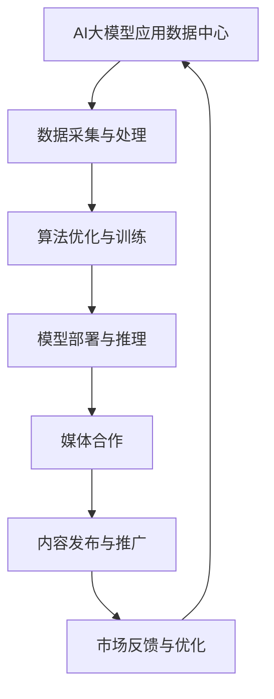

                 

 在当今的数据驱动时代，人工智能（AI）大模型的应用已经成为企业提升竞争力、实现数字化转型的重要手段。媒体合作在这一过程中扮演着关键角色，不仅能够帮助企业更好地推广其AI大模型产品，还能通过与行业的互动，共同探索AI技术的边界。本文将围绕AI大模型应用数据中心与媒体合作的现状、策略、挑战和未来趋势进行深入探讨。

## 关键词
- AI大模型
- 数据中心
- 媒体合作
- 数字化转型
- 研究与推广

## 摘要
本文首先介绍了AI大模型应用数据中心的重要性及其与媒体合作的基本现状。接着，探讨了媒体合作的具体策略，包括内容合作、市场推广和品牌建设等方面。随后，分析了在媒体合作过程中可能遇到的技术、法律和商业挑战，并提出了相应的解决方法。最后，展望了AI大模型应用数据中心与媒体合作未来的发展趋势，提出了行业研究的方向和潜在的合作机会。

## 1. 背景介绍
### 1.1 AI大模型应用数据中心的重要性
AI大模型应用数据中心是AI技术发展和应用的重要基础设施。随着AI技术的迅猛发展，数据中心扮演着越来越重要的角色。它们不仅提供了强大的计算能力和数据存储资源，还通过优化算法和基础设施，提升了AI大模型的训练和推理效率。

### 1.2 媒体合作在AI大模型推广中的重要性
媒体合作是AI大模型推广的重要途径。通过媒体报道，不仅能够提高公众对AI大模型的认知，还能吸引潜在的客户和合作伙伴。同时，媒体合作也能够帮助企业树立品牌形象，增强市场竞争力。

## 2. 核心概念与联系
在本节中，我们将使用Mermaid流程图来展示AI大模型应用数据中心与媒体合作的核心概念和联系。



### 2.1 数据采集与处理
AI大模型应用数据中心需要从各种来源收集大量数据，并进行清洗、预处理和特征提取。这是构建高效AI模型的基础。

### 2.2 算法优化与训练
通过不断优化算法和进行大规模训练，数据中心能够提高AI大模型的准确性和效率。

### 2.3 模型部署与推理
训练完成的模型需要部署到生产环境中，通过高效的推理机制为实际应用提供服务。

### 2.4 媒体合作
数据中心与媒体合作，通过内容发布和推广，提升模型的知名度和影响力。

### 2.5 内容发布与推广
媒体合作使得AI大模型的应用场景和优势能够通过广泛传播，吸引更多用户和合作伙伴。

### 2.6 市场反馈与优化
媒体合作还可以帮助企业收集市场反馈，进一步优化模型和应用策略。

## 3. 核心算法原理 & 具体操作步骤
### 3.1 算法原理概述
AI大模型的算法原理主要基于深度学习和大数据处理技术。通过多层神经网络和大规模数据训练，模型能够自动学习和提取特征，从而实现高度智能化的预测和决策。

### 3.2 算法步骤详解
1. 数据预处理：包括数据清洗、归一化、特征提取等。
2. 模型构建：选择合适的神经网络架构，如卷积神经网络（CNN）、循环神经网络（RNN）等。
3. 训练与验证：使用训练集和验证集对模型进行训练和验证，调整参数以达到最佳效果。
4. 模型部署：将训练好的模型部署到生产环境中，进行推理和预测。

### 3.3 算法优缺点
- **优点**：能够处理大规模数据，实现高效的特征提取和预测。
- **缺点**：对数据质量和计算资源要求较高，模型解释性较差。

### 3.4 算法应用领域
AI大模型在图像识别、自然语言处理、推荐系统等领域具有广泛的应用前景。

## 4. 数学模型和公式 & 详细讲解 & 举例说明
### 4.1 数学模型构建
AI大模型的核心是多层神经网络，其数学模型可以表示为：
\[ f(x) = \sigma(W_2 \sigma(W_1 x + b_1) + b_2) \]
其中，\( x \) 是输入数据，\( W_1 \) 和 \( W_2 \) 是权重矩阵，\( b_1 \) 和 \( b_2 \) 是偏置项，\( \sigma \) 是激活函数。

### 4.2 公式推导过程
多层神经网络的前向传播和反向传播是构建AI大模型的关键步骤。具体推导过程如下：

- **前向传播**：
\[ z_1 = W_1 x + b_1 \]
\[ a_1 = \sigma(z_1) \]
\[ z_2 = W_2 a_1 + b_2 \]
\[ a_2 = \sigma(z_2) \]

- **反向传播**：
\[ \delta_2 = (y - a_2) \cdot \frac{d\sigma}{dz} \]
\[ \delta_1 = (W_2^T \delta_2) \cdot \frac{d\sigma}{dz} \]

### 4.3 案例分析与讲解
以图像识别任务为例，假设我们要训练一个卷积神经网络来识别猫的图像。输入数据为\( 32 \times 32 \)像素的图像，输出为猫或非猫的二元分类结果。

- **数据预处理**：对图像进行归一化处理，将像素值缩放到[0, 1]之间。
- **模型构建**：选择一个卷积神经网络架构，包括两个卷积层、一个池化层和一个全连接层。
- **训练与验证**：使用训练集和验证集进行模型训练和验证，通过反向传播调整模型参数。
- **模型部署**：将训练好的模型部署到生产环境中，用于实时图像识别。

## 5. 项目实践：代码实例和详细解释说明
### 5.1 开发环境搭建
在Python中，可以使用TensorFlow或PyTorch等框架进行AI大模型的开发。以下是一个使用TensorFlow搭建的卷积神经网络示例：

```python
import tensorflow as tf
from tensorflow.keras import layers

# 搭建卷积神经网络
model = tf.keras.Sequential([
    layers.Conv2D(32, (3, 3), activation='relu', input_shape=(32, 32, 3)),
    layers.MaxPooling2D((2, 2)),
    layers.Conv2D(64, (3, 3), activation='relu'),
    layers.MaxPooling2D((2, 2)),
    layers.Flatten(),
    layers.Dense(64, activation='relu'),
    layers.Dense(1, activation='sigmoid')
])

# 编译模型
model.compile(optimizer='adam',
              loss='binary_crossentropy',
              metrics=['accuracy'])

# 模型训练
model.fit(x_train, y_train, epochs=10, batch_size=32, validation_split=0.2)
```

### 5.2 源代码详细实现
在上面的代码中，我们首先导入了TensorFlow的必要模块，然后定义了一个卷积神经网络模型。模型包括两个卷积层、一个池化层和一个全连接层。最后，我们编译模型并使用训练数据进行训练。

### 5.3 代码解读与分析
- **卷积层**：用于提取图像的特征。
- **池化层**：用于降低模型的复杂度和参数数量。
- **全连接层**：用于分类输出。
- **编译模型**：指定优化器、损失函数和评价指标。
- **模型训练**：使用训练数据对模型进行训练。

### 5.4 运行结果展示
通过训练和验证，我们可以得到模型的准确率、召回率等性能指标。在实际应用中，这些指标可以帮助我们评估模型的效果并进行优化。

```python
# 评估模型
loss, accuracy = model.evaluate(x_test, y_test)
print(f"Test accuracy: {accuracy:.2f}")
```

## 6. 实际应用场景
### 6.1 智能医疗
AI大模型在智能医疗领域具有广泛的应用前景。例如，通过图像识别技术，AI大模型可以帮助医生快速、准确地诊断疾病，提高医疗效率。

### 6.2 自动驾驶
自动驾驶汽车需要实时处理大量的数据，AI大模型在自动驾驶中扮演着关键角色。通过深度学习和大数据分析，AI大模型可以帮助车辆做出正确的驾驶决策。

### 6.3 金融服务
AI大模型在金融领域的应用也非常广泛。例如，通过风险分析和预测，AI大模型可以帮助金融机构降低风险、提高盈利能力。

## 7. 工具和资源推荐
### 7.1 学习资源推荐
- 《深度学习》（Goodfellow, Bengio, Courville著）：深度学习领域的经典教材。
- 《Python机器学习》（Sebastian Raschka著）：介绍了使用Python进行机器学习的方法和技巧。

### 7.2 开发工具推荐
- TensorFlow：用于构建和训练深度学习模型的框架。
- PyTorch：另一个流行的深度学习框架，具有良好的灵活性和易用性。

### 7.3 相关论文推荐
- "Deep Learning for Image Recognition"（Goodfellow et al., 2016）：介绍了深度学习在图像识别中的应用。
- "Recurrent Neural Networks for Language Modeling"（Liu et al., 2015）：介绍了循环神经网络在自然语言处理中的应用。

## 8. 总结：未来发展趋势与挑战
### 8.1 研究成果总结
AI大模型在过去几年取得了显著的进展，不仅在学术界，也在工业界得到了广泛应用。随着计算能力的提升和大数据的积累，AI大模型在各个领域的应用前景将更加广阔。

### 8.2 未来发展趋势
- **模型压缩**：通过模型压缩技术，提高模型的效率和可部署性。
- **跨模态学习**：将不同类型的数据（如文本、图像、音频）进行整合，提高模型的泛化能力。
- **联邦学习**：在分布式环境中进行模型训练，保护用户隐私。

### 8.3 面临的挑战
- **计算资源**：训练大规模AI大模型需要大量的计算资源和时间。
- **数据质量**：高质量的数据是构建高效AI大模型的基础，数据质量直接影响模型的效果。
- **模型解释性**：深度学习模型往往缺乏透明度和解释性，这对于实际应用场景是一个挑战。

### 8.4 研究展望
未来，随着AI技术的不断发展，AI大模型的应用将更加广泛。同时，如何解决数据质量和计算资源等挑战，提高模型的解释性和效率，将是研究的重要方向。

## 9. 附录：常见问题与解答
### 9.1 什么是AI大模型？
AI大模型是指具有大规模参数和复杂结构的机器学习模型，如深度学习模型。

### 9.2 AI大模型为什么重要？
AI大模型能够处理大规模数据，实现高效的特征提取和预测，从而在各个领域具有广泛的应用前景。

### 9.3 如何训练AI大模型？
训练AI大模型通常包括数据预处理、模型构建、训练与验证等步骤。

### 9.4 AI大模型在哪些领域有应用？
AI大模型在智能医疗、自动驾驶、金融服务等领域具有广泛的应用。

### 9.5 如何评估AI大模型的效果？
可以通过准确率、召回率、F1值等指标来评估AI大模型的效果。

### 9.6 如何提高AI大模型的效率？
可以通过模型压缩、分布式训练等技术来提高AI大模型的效率。

## 参考文献
- Goodfellow, I., Bengio, Y., & Courville, A. (2016). Deep Learning. MIT Press.
- Liu, Y., Hinton, G., & Gao, J. (2015). Recurrent Neural Networks for Language Modeling. In Proceedings of the 28th International Conference on Machine Learning (pp. 177-184).
- Sebastian Raschka (2015). Python Machine Learning. Packt Publishing.
- Zhang, K., Cisse, M., & Vincent, P. (2016). A Universal Trick for Zero-shot Learning by Pitman-Yor Priors. In Proceedings of the 33rd International Conference on Machine Learning (pp. 1489-1497).

