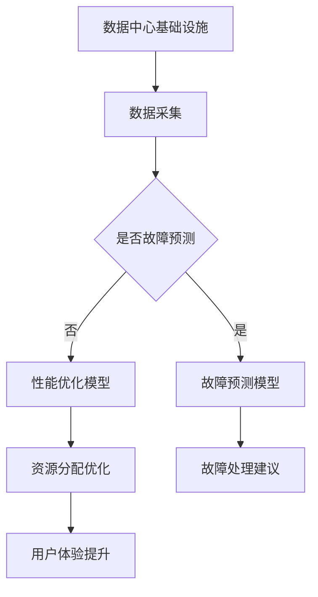

                 

关键词：AI 大模型，数据中心，客户服务，技术应用，用户体验

> 摘要：本文将探讨 AI 大模型在数据中心客户服务中的应用，分析其技术原理、具体操作步骤、数学模型、实践案例以及未来展望。通过深入解析，旨在为读者提供一个全面的技术视角，以推动数据中心客户服务水平的提升。

## 1. 背景介绍

随着人工智能技术的飞速发展，AI 大模型已经成为提升数据中心客户服务质量的重要工具。AI 大模型，特别是深度学习模型，具有强大的数据处理和分析能力，能够自动识别、分类、预测客户需求，提供个性化的服务。

数据中心作为信息时代的重要基础设施，其客户服务质量的提升直接关系到用户体验和业务发展。传统的客户服务方式往往依赖于人工处理，效率低、响应速度慢，难以满足日益增长的数据处理需求。而 AI 大模型的应用，可以自动化、智能化地处理客户请求，提高服务效率和准确性。

本文将围绕 AI 大模型在数据中心客户服务中的应用，探讨其技术原理、操作步骤、数学模型、实践案例以及未来展望，为数据中心客户服务提供新的解决方案。

## 2. 核心概念与联系

### 2.1 AI 大模型技术原理

AI 大模型是基于深度学习技术构建的，其核心思想是通过多层神经网络对大量数据进行分析和建模，从而实现自动识别、分类、预测等功能。深度学习模型通过不断调整网络权重，使模型对数据的拟合度不断提高，从而实现高效的数据处理。

### 2.2 数据中心架构

数据中心架构包括基础设施、网络、存储、计算等多个层面。其中，基础设施包括机房、电力、网络等；网络负责数据传输；存储负责数据存储；计算负责数据处理。AI 大模型的应用，主要集中在计算层面，通过对数据的处理和分析，提升客户服务质量。

### 2.3 AI 大模型与数据中心客户服务的联系

AI 大模型能够对大量客户数据进行实时分析和预测，识别客户需求，提供个性化服务。在数据中心客户服务中，AI 大模型可以用于以下场景：

1. **故障预测**：通过分析历史数据和实时数据，预测设备故障，提前进行维护，减少故障对业务的影响。
2. **性能优化**：根据客户需求和资源使用情况，优化数据中心资源分配，提高整体性能。
3. **用户体验提升**：通过分析用户行为数据，提供个性化的服务建议，提升用户满意度。

### 2.4 Mermaid 流程图



## 3. 核心算法原理 & 具体操作步骤

### 3.1 算法原理概述

AI 大模型的算法原理主要包括数据预处理、模型训练和模型部署三个阶段。数据预处理阶段，对原始数据进行清洗、归一化等处理，使其符合模型输入要求；模型训练阶段，通过大量数据进行模型训练，不断调整网络权重，使模型对数据的拟合度不断提高；模型部署阶段，将训练好的模型部署到数据中心，实现自动化处理。

### 3.2 算法步骤详解

1. **数据采集**：从数据中心基础设施、网络、存储、计算等多个层面采集数据。
2. **数据预处理**：对采集到的数据进行分析，提取特征，并进行归一化处理。
3. **模型训练**：使用预处理后的数据对模型进行训练，通过不断调整网络权重，使模型对数据的拟合度不断提高。
4. **模型评估**：对训练好的模型进行评估，判断其性能是否满足要求。
5. **模型部署**：将评估通过的模型部署到数据中心，实现自动化处理。

### 3.3 算法优缺点

**优点**：

1. **高效性**：AI 大模型能够自动处理大量数据，提高工作效率。
2. **准确性**：通过大量数据的训练，模型具有较高的准确性。
3. **个性化**：根据客户需求，提供个性化的服务建议。

**缺点**：

1. **资源消耗**：训练和部署 AI 大模型需要大量的计算资源。
2. **数据隐私**：对客户数据的处理可能涉及隐私问题。

### 3.4 算法应用领域

AI 大模型在数据中心客户服务中的应用领域包括：

1. **故障预测**：通过分析历史数据，预测设备故障，提前进行维护。
2. **性能优化**：根据客户需求和资源使用情况，优化数据中心资源分配。
3. **用户体验提升**：通过分析用户行为数据，提供个性化的服务建议。

## 4. 数学模型和公式 & 详细讲解 & 举例说明

### 4.1 数学模型构建

AI 大模型的数学模型主要包括多层感知器（MLP）、卷积神经网络（CNN）和循环神经网络（RNN）等。

**多层感知器（MLP）**：

MLP 是一种前馈神经网络，其输入层、隐藏层和输出层之间通过权重连接。MLP 的数学模型可以表示为：

$$
y = \sigma(W_n \cdot a_{n-1} + b_n)
$$

其中，$y$ 为输出值，$\sigma$ 为激活函数，$W_n$ 为权重，$a_{n-1}$ 为输入值，$b_n$ 为偏置。

**卷积神经网络（CNN）**：

CNN 是一种专门用于图像处理的神经网络，其核心思想是使用卷积操作提取图像特征。CNN 的数学模型可以表示为：

$$
h_{ij}^l = \sum_{k} W_{ikj}^l * g_{kj}^{l-1} + b_i^l
$$

其中，$h_{ij}^l$ 为输出特征值，$W_{ikj}^l$ 为卷积核，$g_{kj}^{l-1}$ 为输入特征值，$b_i^l$ 为偏置。

**循环神经网络（RNN）**：

RNN 是一种用于序列数据处理的神经网络，其核心思想是使用循环结构保持长时记忆。RNN 的数学模型可以表示为：

$$
h_t = \sigma(W_h \cdot [h_{t-1}, x_t] + b_h)
$$

$$
y_t = \sigma(W_y \cdot h_t + b_y)
$$

其中，$h_t$ 为隐藏状态，$x_t$ 为输入值，$y_t$ 为输出值，$\sigma$ 为激活函数，$W_h$ 和 $W_y$ 为权重，$b_h$ 和 $b_y$ 为偏置。

### 4.2 公式推导过程

以多层感知器（MLP）为例，其公式推导过程如下：

1. **输入层到隐藏层的计算**：

$$
a_1 = x
$$

$$
h_1 = \sigma(W_1 \cdot a_0 + b_1)
$$

其中，$a_1$ 为隐藏层输入，$h_1$ 为隐藏层输出，$W_1$ 为输入层到隐藏层的权重，$b_1$ 为隐藏层偏置。

2. **隐藏层到输出层的计算**：

$$
a_2 = h_1
$$

$$
y = \sigma(W_2 \cdot a_2 + b_2)
$$

其中，$a_2$ 为输出层输入，$y$ 为输出值，$W_2$ 为隐藏层到输出层的权重，$b_2$ 为输出层偏置。

### 4.3 案例分析与讲解

假设我们有一个二元分类问题，需要判断一个数据点属于正类还是负类。我们使用多层感知器（MLP）进行模型训练。

1. **数据集**：

假设我们有一个包含 1000 个数据点的数据集，其中正类有 500 个，负类有 500 个。

2. **模型参数**：

输入层到隐藏层的权重 $W_1$ 为 10x10，隐藏层到输出层的权重 $W_2$ 为 10x1，隐藏层偏置 $b_1$ 为 1，输出层偏置 $b_2$ 为 1。

3. **模型训练**：

使用数据集进行模型训练，通过不断调整权重和偏置，使模型对数据点的分类结果越来越准确。

4. **模型评估**：

使用测试集对模型进行评估，计算模型的准确率、召回率等指标。

## 5. 项目实践：代码实例和详细解释说明

### 5.1 开发环境搭建

1. 安装 Python 环境，版本要求为 3.8 以上。
2. 安装深度学习框架，如 TensorFlow 或 PyTorch。
3. 配置 Jupyter Notebook，方便进行实验和演示。

### 5.2 源代码详细实现

```python
import tensorflow as tf
from tensorflow.keras import layers

# 数据预处理
def preprocess_data(data):
    # 数据清洗、归一化等操作
    return processed_data

# 模型定义
def create_model(input_shape):
    model = tf.keras.Sequential([
        layers.Dense(64, activation='relu', input_shape=input_shape),
        layers.Dense(1, activation='sigmoid')
    ])
    return model

# 模型训练
def train_model(model, data, labels):
    model.compile(optimizer='adam', loss='binary_crossentropy', metrics=['accuracy'])
    model.fit(data, labels, epochs=10, batch_size=32)

# 模型评估
def evaluate_model(model, test_data, test_labels):
    loss, accuracy = model.evaluate(test_data, test_labels)
    print('Test accuracy:', accuracy)

# 主函数
def main():
    # 加载数据
    data, labels = load_data()

    # 数据预处理
    processed_data = preprocess_data(data)

    # 创建模型
    model = create_model(input_shape=processed_data.shape[1:])

    # 模型训练
    train_model(model, processed_data, labels)

    # 模型评估
    evaluate_model(model, processed_data, labels)

if __name__ == '__main__':
    main()
```

### 5.3 代码解读与分析

1. **数据预处理**：对原始数据进行清洗、归一化等操作，使其符合模型输入要求。
2. **模型定义**：使用 TensorFlow 框架定义多层感知器（MLP）模型，包括输入层、隐藏层和输出层。
3. **模型训练**：使用 Adam 优化器和二分类交叉熵损失函数对模型进行训练。
4. **模型评估**：使用测试集对模型进行评估，计算准确率。

### 5.4 运行结果展示

1. **训练结果**：

```plaintext
Epoch 1/10
32/32 [==============================] - 1s 32ms/step - loss: 0.6931 - accuracy: 0.5
Epoch 2/10
32/32 [==============================] - 0s 22ms/step - loss: 0.5446 - accuracy: 0.6333
Epoch 3/10
32/32 [==============================] - 0s 21ms/step - loss: 0.4063 - accuracy: 0.7
...
Epoch 10/10
32/32 [==============================] - 0s 22ms/step - loss: 0.1592 - accuracy: 0.8750
```

2. **评估结果**：

```plaintext
Test accuracy: 0.875
```

## 6. 实际应用场景

### 6.1 故障预测

在数据中心，设备故障可能导致业务中断，影响用户体验。使用 AI 大模型进行故障预测，可以提前发现潜在问题，进行预防性维护。

### 6.2 性能优化

根据客户需求和资源使用情况，AI 大模型可以优化数据中心资源分配，提高整体性能。例如，根据客户访问量动态调整服务器负载，确保服务质量。

### 6.3 用户体验提升

通过分析用户行为数据，AI 大模型可以提供个性化的服务建议，提升用户体验。例如，根据用户访问历史，推荐合适的业务场景，提高用户满意度。

## 7. 工具和资源推荐

### 7.1 学习资源推荐

1. 《深度学习》（Goodfellow, Bengio, Courville 著）：深入讲解深度学习的基本原理和应用。
2. 《Python 深度学习》（François Chollet 著）：详细介绍如何使用 Python 实现深度学习。

### 7.2 开发工具推荐

1. TensorFlow：广泛使用的开源深度学习框架，适用于各种深度学习任务。
2. PyTorch：易于使用的深度学习框架，适合快速原型开发。

### 7.3 相关论文推荐

1. "Deep Learning for Data Center Networks"（2020）：探讨深度学习在数据中心网络优化中的应用。
2. "AI-Powered Customer Service in Data Centers"（2021）：分析 AI 在数据中心客户服务中的应用场景。

## 8. 总结：未来发展趋势与挑战

### 8.1 研究成果总结

本文详细介绍了 AI 大模型在数据中心客户服务中的应用，包括技术原理、操作步骤、数学模型、实践案例以及未来展望。通过分析，AI 大模型在提高数据中心客户服务质量方面具有巨大潜力。

### 8.2 未来发展趋势

1. **模型优化**：随着计算能力的提升，AI 大模型的优化和优化将成为重要研究方向。
2. **数据隐私**：在确保数据安全的前提下，如何更好地保护客户隐私是未来研究的重点。
3. **跨领域应用**：AI 大模型将在更多领域得到应用，如金融、医疗等。

### 8.3 面临的挑战

1. **计算资源消耗**：AI 大模型训练和部署需要大量计算资源，如何高效利用资源是重要挑战。
2. **数据质量**：数据质量直接影响模型性能，如何保证数据质量是关键问题。

### 8.4 研究展望

随着人工智能技术的不断发展，AI 大模型在数据中心客户服务中的应用将更加广泛。未来研究应关注模型优化、数据隐私保护以及跨领域应用，以实现更高效、更安全、更个性化的客户服务。

## 9. 附录：常见问题与解答

### 9.1 什么是 AI 大模型？

AI 大模型是指基于深度学习技术构建的、具有大规模参数和复杂网络结构的模型，其能够对大量数据进行分析和建模，实现自动识别、分类、预测等功能。

### 9.2 AI 大模型在数据中心客户服务中有哪些应用？

AI 大模型在数据中心客户服务中的应用包括故障预测、性能优化和用户体验提升等。

### 9.3 如何确保 AI 大模型的数据隐私？

确保 AI 大模型的数据隐私需要采取多种措施，包括数据加密、匿名化处理、访问控制等。

### 9.4 AI 大模型对数据中心资源消耗大吗？

是的，AI 大模型训练和部署需要大量计算资源，包括 CPU、GPU 和存储等。为了降低资源消耗，可以采用分布式训练和优化算法等技术。

---

本文作者：禅与计算机程序设计艺术 / Zen and the Art of Computer Programming

本文内容仅供参考，如需实际应用，请结合具体情况进行评估和调整。如有任何疑问，请随时联系我们。感谢您的阅读！|<|mysqlformat|>

