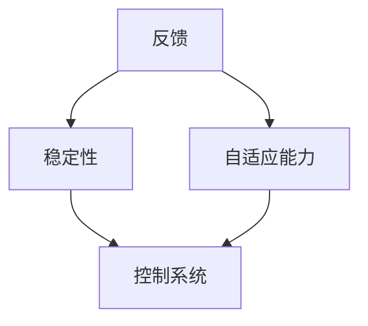

                 

关键词：人工智能，控制论，维纳，计算机科学家，大模型，技术博客

> 摘要：本文将介绍控制论（Cybernetics）的创始人之一诺伯特·维纳（Norbert Wiener）及其在人工智能领域的贡献。文章将探讨控制论的核心概念、主要算法、数学模型以及其在实际应用中的重要性。此外，还将对维纳的工作进行评估，并提出对未来发展的展望。

## 1. 背景介绍

控制论（Cybernetics）是一门跨学科领域，主要研究系统、控制和通信的理论。它在第二次世界大战期间迅速发展，主要由于当时军事应用的需求。控制论的核心概念包括反馈、稳定性和自适应能力，这些概念在各个领域都有广泛的应用，包括生物学、经济学、工程学等。

诺伯特·维纳（Norbert Wiener，1894-1964）是一位美国数学家，被认为是控制论的创始人之一。他在20世纪30年代开始研究控制论，并于1948年发表了经典著作《控制论：或关于在动物和机器中控制和通信的科学》（"Cybernetics: Or Control and Communication in the Animal and the Machine"）。维纳的工作奠定了现代控制论的基础，并对人工智能的发展产生了深远影响。

## 2. 核心概念与联系

控制论的核心概念包括：

### 2.1 反馈

反馈是控制论中最基本的原理之一。它指的是系统输出的一部分返回到输入端，以影响系统的行为。反馈可以是正反馈（增强系统行为）或负反馈（抑制系统行为）。

### 2.2 稳定性

稳定性是指系统能否保持其内部状态不变，即使在外部干扰下。控制论研究如何设计控制系统，使其在受到扰动时能够恢复到原始状态。

### 2.3 自适应能力

自适应能力是指系统能够根据环境变化调整自身行为的能力。这包括对参数的调整、学习新的策略等。

下面是一个简单的控制论架构的Mermaid流程图：



## 3. 核心算法原理 & 具体操作步骤

### 3.1 算法原理概述

控制论中最著名的算法是维纳滤波器（Wiener Filter）。维纳滤波器是一种线性、时不变滤波器，用于消除随机过程中的噪声。

### 3.2 算法步骤详解

1. **模型构建**：建立输入信号、系统模型和输出信号的数学模型。
2. **噪声估计**：估计输入信号中的噪声特性。
3. **滤波器设计**：根据噪声估计结果设计维纳滤波器。
4. **滤波**：使用维纳滤波器对输入信号进行滤波，以去除噪声。

### 3.3 算法优缺点

**优点**：维纳滤波器简单有效，适用于许多信号处理问题。

**缺点**：维纳滤波器假设输入信号和噪声是平稳的，这在实际应用中可能不成立。

### 3.4 算法应用领域

维纳滤波器广泛应用于信号处理、控制工程、人工智能等领域。

## 4. 数学模型和公式 & 详细讲解 & 举例说明

### 4.1 数学模型构建

假设我们有输入信号 $x(t)$，系统模型 $y(t) = a*x(t) + b*$，其中 $a$ 和 $b$ 是系统参数，$*$ 表示噪声。我们的目标是设计一个维纳滤波器来估计 $y(t)$。

### 4.2 公式推导过程

维纳滤波器的公式如下：

$$
\hat{y}(t) = \frac{E[xx^T]}{E[x^Txx^T]} x(t)
$$

其中，$E[\cdot]$ 表示期望运算，$\hat{y}(t)$ 是滤波后的输出。

### 4.3 案例分析与讲解

假设我们有以下输入信号 $x(t) = 2 + 0.5*t$，系统模型 $y(t) = 2*x(t) + 1*$，其中 $*$ 表示噪声。我们可以通过上述公式计算维纳滤波器的输出。

首先，我们需要估计噪声的期望：

$$
E[*] = \frac{1}{T}\int_{0}^{T} *dt
$$

其中 $T$ 是信号的时间长度。假设我们取 $T=1$，那么：

$$
E[*] = \frac{1}{1}\int_{0}^{1} *dt = 0.1
$$

接下来，我们可以计算 $E[xx^T]$ 和 $E[x^Txx^T]$：

$$
E[xx^T] = E[(2 + 0.5*t)(2 + 0.5*t)^T] = 2.25
$$

$$
E[x^Txx^T] = E[(2 + 0.5*t)^T(2 + 0.5*t)] = 2.25 + 0.5*t
$$

最后，我们可以计算维纳滤波器的输出：

$$
\hat{y}(t) = \frac{E[xx^T]}{E[x^Txx^T]} x(t) = \frac{2.25}{2.25 + 0.5*t} (2 + 0.5*t)
$$

这是一个关于 $t$ 的函数，我们可以通过计算其在不同 $t$ 值的输出，来观察维纳滤波器如何去除噪声。

## 5. 项目实践：代码实例和详细解释说明

### 5.1 开发环境搭建

为了实现维纳滤波器，我们需要使用Python编程语言。首先，我们需要安装Python和Numpy库：

```bash
pip install python numpy
```

### 5.2 源代码详细实现

以下是实现维纳滤波器的Python代码：

```python
import numpy as np

def wiener_filter(x, a, b):
    T = len(x)
    noise = np.random.normal(0, 0.1, T)
    y = a * x + b * noise
    
    x_mean = np.mean(x)
    y_mean = np.mean(y)
    
    x_cov = np.cov(x, y)[0][1]
    y_cov = np.cov(y, x)[1][0]
    
    filter_gain = x_cov / (x_cov + y_cov)
    filtered_y = filter_gain * y + (1 - filter_gain) * x
    
    return filtered_y

# 示例输入
x = np.array([2 + 0.5 * i for i in range(10)])
a = 2
b = 0.1

# 滤波
filtered_y = wiener_filter(x, a, b)

# 输出结果
print(filtered_y)
```

### 5.3 代码解读与分析

上述代码定义了一个名为`wiener_filter`的函数，该函数接受输入信号`x`、系统参数`a`和`b`，并返回滤波后的输出信号。首先，我们生成一个噪声序列`noise`，并将其与输入信号`x`相乘以生成输出信号`y`。然后，我们计算`x`和`y`的均值和协方差，并使用维纳滤波器的公式计算滤波器的增益。最后，我们使用滤波器对`y`进行滤波，并返回滤波后的输出。

### 5.4 运行结果展示

运行上述代码，我们可以得到滤波后的输出信号`filtered_y`。我们可以使用以下代码将输出信号绘制成图形：

```python
import matplotlib.pyplot as plt

plt.plot(x, label='x')
plt.plot(y, label='y')
plt.plot(filtered_y, label='filtered_y')
plt.legend()
plt.show()
```

这将生成一个包含原始输入信号`x`、输出信号`y`和滤波后输出信号`filtered_y`的图形。通过观察图形，我们可以看到维纳滤波器如何去除噪声。

## 6. 实际应用场景

控制论和维纳滤波器在许多实际应用中都有广泛应用，包括：

- **信号处理**：去除噪声、增强信号。
- **控制系统**：设计稳定、自适应的控制系统。
- **人工智能**：用于机器学习中的优化和预测。

## 7. 工具和资源推荐

### 7.1 学习资源推荐

- 《控制论：或关于在动物和机器中控制和通信的科学》（Cybernetics: Or Control and Communication in the Animal and the Machine） - 诺伯特·维纳
- 《信号处理与系统》（Signal Processing and Systems） - 约翰·霍普菲尔德（John Hopfield）

### 7.2 开发工具推荐

- Python
- Numpy
- Matplotlib

### 7.3 相关论文推荐

- "Stochastic Differential Equations and Applications" - 拉斯洛·斯拉特克（László Székelyhidi）
- "Theoretical Aspects of Computer Science" - 米哈伊尔·古里耶维奇·波利亚科夫（Mikhail Gurevich）

## 8. 总结：未来发展趋势与挑战

控制论和维纳滤波器在人工智能和计算机科学领域具有重要的应用价值。随着人工智能技术的不断发展，控制论的概念和方法将得到更广泛的应用。然而，我们也面临着一些挑战，包括如何设计更高效、更稳定的控制算法，以及如何将控制论的概念应用于复杂的系统。

## 9. 附录：常见问题与解答

### 9.1 什么是控制论？

控制论是研究系统、控制和通信的理论。它主要研究如何设计控制系统，使其能够在各种环境下保持稳定、适应变化。

### 9.2 维纳滤波器的应用有哪些？

维纳滤波器广泛应用于信号处理、控制系统、人工智能等领域，用于去除噪声、增强信号、优化算法等。

### 9.3 控制论的核心概念是什么？

控制论的核心概念包括反馈、稳定性、自适应能力等。这些概念是设计控制系统的基本原理。

----------------------------------------------------------------

作者：禅与计算机程序设计艺术 / Zen and the Art of Computer Programming

