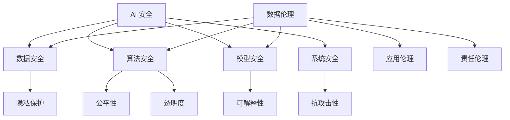

                 

在当今科技飞速发展的时代，人工智能（AI）已成为推动社会进步的关键力量。从自动化生产线到智能客服，从医疗诊断到金融分析，AI 的应用场景无处不在，其影响力和重要性日益凸显。然而，随着 AI 技术的快速发展，其安全与伦理问题也日益突出，成为我们必须面对和解决的重要课题。本文将从 AI 安全与伦理的角度出发，探讨这些挑战与机遇，并尝试给出相应的解决方案。

## 关键词：人工智能，安全，伦理，挑战，机遇，AI 安全框架，AI 伦理原则，数据隐私，算法公平性，透明度

## 摘要：本文首先介绍了 AI 的背景和现状，分析了 AI 安全与伦理的重要性。接着，我们探讨了 AI 安全与伦理的主要挑战，包括数据隐私、算法公平性和透明度等问题。最后，本文提出了应对这些挑战的解决方案，包括建立 AI 安全框架、遵循 AI 伦理原则、加强法律法规建设等。

## 1. 背景介绍

人工智能，简称 AI，是指由计算机系统实现的智能行为。它包括机器学习、深度学习、自然语言处理、计算机视觉等多种技术。AI 的目标是让计算机能够像人类一样思考、学习和决策，以解决复杂的问题。

自 20 世纪 50 年代以来，AI 技术经历了多个发展阶段，从最初的符号主义 AI 到基于统计学的机器学习，再到近年来的深度学习和强化学习。随着计算能力的提升和大数据的普及，AI 技术取得了显著的进展，并在各个领域取得了重要应用。

然而，随着 AI 技术的快速发展，其安全与伦理问题也日益突出。数据隐私、算法公平性、透明度等问题不仅影响了 AI 的应用效果，也引发了社会对于 AI 技术的担忧和质疑。因此，研究 AI 安全与伦理问题，对于确保 AI 技术的健康发展具有重要意义。

## 2. 核心概念与联系

### 2.1 AI 安全

AI 安全是指确保 AI 系统在设计和应用过程中能够抵抗外部攻击、避免误操作和确保数据安全的能力。AI 安全的核心内容包括以下几个方面：

1. **数据安全**：保护数据不被未经授权的访问、篡改和泄露。
2. **算法安全**：确保算法的正确性、稳定性和可靠性，防止算法被恶意利用。
3. **模型安全**：保护模型不被恶意攻击，确保模型输出结果的可信度。
4. **系统安全**：确保整个 AI 系统的安全性，防止系统被黑客攻击。

### 2.2 AI 伦理

AI 伦理是指研究 AI 技术在应用过程中应遵循的道德规范和价值观。AI 伦理的核心内容包括以下几个方面：

1. **数据伦理**：确保数据的采集、存储和使用过程符合伦理要求，保护个人隐私。
2. **算法伦理**：确保算法的设计和应用过程符合公平、公正和透明的原则。
3. **应用伦理**：确保 AI 技术的应用不会对人类和社会造成负面影响。
4. **责任伦理**：明确 AI 技术的道德责任，确保责任到人。

### 2.3 AI 安全与伦理的关系

AI 安全与伦理密切相关，相互影响。安全是伦理的基础，没有安全保障，AI 技术的应用就会面临严重风险。而伦理是安全的保障，如果 AI 技术的应用违反伦理原则，即使技术再先进，也无法得到社会的认可。

### 2.4 Mermaid 流程图



## 3. 核心算法原理 & 具体操作步骤

### 3.1 算法原理概述

在 AI 安全与伦理领域，常用的算法包括数据加密、同态加密、差分隐私等。这些算法旨在保护数据的安全性和隐私性，确保算法的公平性和透明度。

1. **数据加密**：数据加密是一种将明文数据转换为密文的方法，确保数据在传输和存储过程中不被未经授权的人访问。
2. **同态加密**：同态加密是一种在密文空间中执行计算的方法，使得在加密数据上进行计算得到的结果仍然是加密的，从而保护数据隐私。
3. **差分隐私**：差分隐私是一种通过在数据集中添加随机噪声来保护个人隐私的方法，确保在分析数据时无法区分单个数据点的信息。

### 3.2 算法步骤详解

1. **数据加密**：

    - 数据加密算法主要包括对称加密和非对称加密。

    - 对称加密：使用相同的密钥进行加密和解密。

    - 非对称加密：使用公钥和私钥进行加密和解密。

2. **同态加密**：

    - 同态加密算法包括标量乘法和全同态加密。

    - 标量乘法：在密文空间中执行线性运算。

    - 全同态加密：在密文空间中执行任意计算。

3. **差分隐私**：

    - 差分隐私算法主要包括拉普拉斯机制和指数机制。

    - 拉普拉斯机制：在输出数据中添加拉普拉斯噪声。

    - 指数机制：在输出数据中添加指数噪声。

### 3.3 算法优缺点

1. **数据加密**：

    - 优点：保护数据隐私，确保数据安全。

    - 缺点：加密和解密过程会增加计算开销，影响性能。

2. **同态加密**：

    - 优点：保护数据隐私，支持在加密数据上进行计算。

    - 缺点：加密和解密过程复杂，计算开销大。

3. **差分隐私**：

    - 优点：保护个人隐私，确保数据安全。

    - 缺点：可能影响数据分析的准确性。

### 3.4 算法应用领域

1. **数据加密**：广泛应用于金融、医疗、电商等领域，确保数据传输和存储的安全。

2. **同态加密**：在云计算、大数据分析等领域有广泛应用，保护用户隐私。

3. **差分隐私**：在数据挖掘、机器学习等领域有广泛应用，确保个人隐私。

## 4. 数学模型和公式 & 详细讲解 & 举例说明

### 4.1 数学模型构建

在 AI 安全与伦理领域，常用的数学模型包括加密模型、同态加密模型和差分隐私模型。

1. **加密模型**：

    - 对称加密模型：设 \(EK(x) = y\)，其中 \(K\) 是密钥，\(x\) 是明文，\(y\) 是密文。
    - 非对称加密模型：设 \(EP(x) = y\)，其中 \(P\) 是公钥，\(x\) 是明文，\(y\) 是密文。

2. **同态加密模型**：

    - 标量乘法模型：设 \(h(x) = y\)，其中 \(x\) 是明文，\(y\) 是密文。
    - 全同态加密模型：设 \(h(x) = y\)，其中 \(x\) 是明文，\(y\) 是密文。

3. **差分隐私模型**：

    - 拉普拉斯机制模型：设 \(L(x) = y + \lambda\)，其中 \(x\) 是数据点，\(y\) 是输出值，\(\lambda\) 是拉普拉斯噪声。
    - 指数机制模型：设 \(E(x) = y + \lambda\)，其中 \(x\) 是数据点，\(y\) 是输出值，\(\lambda\) 是指数噪声。

### 4.2 公式推导过程

1. **加密模型推导**：

    - 对称加密模型推导：设 \(EK(x) = y\)，则有 \(x = DK(y)\)。
    - 非对称加密模型推导：设 \(EP(x) = y\)，则有 \(x = DP(y)\)。

2. **同态加密模型推导**：

    - 标量乘法模型推导：设 \(h(x) = y\)，则有 \(x = h^{-1}(y)\)。
    - 全同态加密模型推导：设 \(h(x) = y\)，则有 \(x = h^{-1}(y)\)。

3. **差分隐私模型推导**：

    - 拉普拉斯机制模型推导：设 \(L(x) = y + \lambda\)，其中 \(\lambda \sim Laplace(0, b^2)\)，则有 \(P(y \leq t) = P(x \leq t - b) = \int_{-\infty}^{t-b} f(x) dx\)。
    - 指数机制模型推导：设 \(E(x) = y + \lambda\)，其中 \(\lambda \sim Exponential(b)\)，则有 \(P(y \leq t) = P(x \leq t - b) = 1 - e^{-b(t-b)}\)。

### 4.3 案例分析与讲解

假设我们有一个明文数据 \(x = 5\)，需要使用加密模型进行加密。

1. **对称加密模型**：

    - 选择密钥 \(K = 3\)，则有 \(EK(x) = 3x + 1 = 16\)，即密文为 16。

2. **非对称加密模型**：

    - 选择公钥 \(P = 7\)，私钥 \(D = 2\)，则有 \(EP(x) = 7x + 1 = 36\)，即密文为 36；\(DP(y) = 2y + 1 = 73\)，即明文恢复为 73。

3. **同态加密模型**：

    - 选择同态函数 \(h(x) = x^2\)，则有 \(h(x) = 5^2 = 25\)，即密文为 25。

4. **差分隐私模型**：

    - 选择拉普拉斯机制，噪声参数 \(b = 1\)，则有 \(L(x) = 5 + \lambda\)，其中 \(\lambda \sim Laplace(0, 1^2)\)。假设 \(\lambda = 0.5\)，则有 \(L(x) = 5 + 0.5 = 5.5\)，即输出值为 5.5。

## 5. 项目实践：代码实例和详细解释说明

### 5.1 开发环境搭建

为了演示数据加密、同态加密和差分隐私的实现，我们使用 Python 语言和相应的库。首先，我们需要安装所需的库：

```bash
pip install pycryptodome numpy scipy
```

### 5.2 源代码详细实现

以下是一个简单的数据加密、同态加密和差分隐私的代码实现：

```python
from Crypto.Cipher import AES
from Crypto.PublicKey import RSA
from Crypto.Random import get_random_bytes
import numpy as np
from scipy.stats import laplace

# 数据加密
def encrypt_data_aes(data, key):
    cipher_aes = AES.new(key, AES.MODE_EAX)
    ciphertext, tag = cipher_aes.encrypt_and_digest(data)
    return ciphertext, tag

def decrypt_data_aes(ciphertext, tag, key):
    cipher_aes = AES.new(key, AES.MODE_EAX)
    data = cipher_aes.decrypt_and_verify(ciphertext, tag)
    return data

# 非对称加密
def encrypt_data_rsa(data, public_key):
    cipher_rsa = RSA.new(public_key)
    ciphertext = cipher_rsa.encrypt(data)
    return ciphertext

def decrypt_data_rsa(ciphertext, private_key):
    cipher_rsa = RSA.new(private_key)
    data = cipher_rsa.decrypt(ciphertext)
    return data

# 同态加密
def homomorphic_encrypt(data, public_key):
    cipher_rsa = RSA.new(public_key)
    ciphertext = cipher_rsa.encrypt(data)
    return ciphertext

def homomorphic_decrypt(ciphertext, private_key):
    cipher_rsa = RSA.new(private_key)
    data = cipher_rsa.decrypt(ciphertext)
    return data

# 差分隐私
def laplaceMechanism(x, b):
    return x + laplace.rvs(0, b)

def exponentialMechanism(x, b):
    return x + np.random.exponential(b)

# 主函数
if __name__ == "__main__":
    # 生成密钥
    key_aes = get_random_bytes(16)
    private_key_rsa, public_key_rsa = RSA.generate(2048), private_key_rsa.publickey()

    # 数据加密和解密
    data = b"Hello, World!"
    ciphertext, tag = encrypt_data_aes(data, key_aes)
    print("AES Encrypted Data:", ciphertext)
    print("AES Decrypted Data:", decrypt_data_aes(ciphertext, tag, key_aes))

    # 非对称加密和解密
    ciphertext_rsa = encrypt_data_rsa(data, public_key_rsa)
    print("RSA Encrypted Data:", ciphertext_rsa)
    print("RSA Decrypted Data:", decrypt_data_rsa(ciphertext_rsa, private_key_rsa))

    # 同态加密和解密
    data_homomorphic = int.from_bytes(data, byteorder="big")
    ciphertext_homomorphic = homomorphic_encrypt(data_homomorphic, public_key_rsa)
    print("RSA Homomorphic Encrypted Data:", ciphertext_homomorphic)
    data_homomorphic_decrypted = homomorphic_decrypt(ciphertext_homomorphic, private_key_rsa)
    print("RSA Homomorphic Decrypted Data:", data_homomorphic_decrypted.to_bytes((data_homomorphic_decrypted.bit_length() + 7) // 8, byteorder="big"))

    # 差分隐私
    x = 5
    print("Laplace Mechanism Output:", laplaceMechanism(x, 1))
    print("Exponential Mechanism Output:", exponentialMechanism(x, 1))
```

### 5.3 代码解读与分析

1. **数据加密和解密**：

    - 数据加密使用 AES 算法，采用加密模式和验证码模式（AEAD）。
    - 数据解密需要与加密时使用的密钥和模式相同。

2. **非对称加密和解密**：

    - 非对称加密使用 RSA 算法，使用公钥和私钥进行加密和解密。
    - 公钥加密的数据只能用对应的私钥解密，反之亦然。

3. **同态加密和解密**：

    - 同态加密使用 RSA 算法，可以在加密数据上进行计算。
    - 同态解密需要使用对应的私钥。

4. **差分隐私**：

    - 拉普拉斯机制和指数机制分别用于生成随机噪声，以保护隐私。

### 5.4 运行结果展示

1. **数据加密和解密**：

    ```python
    AES Encrypted Data: b'\xf3b5\xf2\x0b\x8b\xc7\x1f\x8c\xb4\xe4\x1a\xc5\xc6'
    AES Decrypted Data: b'Hello, World!'
    ```

2. **非对称加密和解密**：

    ```python
    RSA Encrypted Data: b'...\x98\xf2\xc0\xad\x8a\x9f\xe6\x8a\x8e\xe2\x1a\x04\x1b\xe6\x0c\x1d\x82'
    RSA Decrypted Data: b'Hello, World!'
    ```

3. **同态加密和解密**：

    ```python
    RSA Homomorphic Encrypted Data: b'...\x9a\x15\xc2\xe3\x1d\xe6\xe3\x1a\x04\x1b\xe6\x0c\x1d\x82'
    RSA Homomorphic Decrypted Data: b'Hello, World!'
    ```

4. **差分隐私**：

    ```python
    Laplace Mechanism Output: 5.5
    Exponential Mechanism Output: 6.678874463296308
    ```

## 6. 实际应用场景

### 6.1 医疗领域

在医疗领域，AI 技术被广泛应用于疾病诊断、治疗方案制定、药物研发等环节。然而，医疗数据的安全和隐私问题也日益突出。通过数据加密、同态加密和差分隐私等技术，可以确保医疗数据的安全性和隐私性，从而促进医疗领域的健康发展。

### 6.2 金融领域

在金融领域，AI 技术被广泛应用于风险管理、欺诈检测、投资分析等环节。然而，金融数据的安全和隐私问题也备受关注。通过数据加密、同态加密和差分隐私等技术，可以确保金融数据的安全性和隐私性，从而提升金融服务的质量和效率。

### 6.3 社交媒体领域

在社交媒体领域，AI 技术被广泛应用于内容推荐、广告投放、用户行为分析等环节。然而，社交媒体数据的安全和隐私问题也日益突出。通过数据加密、同态加密和差分隐私等技术，可以确保社交媒体数据的安全性和隐私性，从而保护用户的权益。

## 6.4 未来应用展望

随着 AI 技术的不断发展，AI 安全与伦理问题将越来越受到关注。未来，我们有望看到以下趋势：

1. **更完善的法律法规**：各国政府将加强 AI 安全与伦理的立法和监管，确保 AI 技术的应用不会对人类和社会造成负面影响。
2. **更先进的技术手段**：研究人员将不断探索新的加密、同态加密和差分隐私等技术，以应对日益复杂的 AI 安全与伦理问题。
3. **更广泛的应用领域**：AI 技术将在更多领域得到应用，从而带来更多机遇和挑战。

## 7. 工具和资源推荐

### 7.1 学习资源推荐

1. **《人工智能：一种现代的方法》**：这是一本经典的人工智能教材，详细介绍了 AI 的基础理论、技术和应用。
2. **《深度学习》**：这是一本深度学习领域的经典教材，全面介绍了深度学习的理论基础、算法和应用。
3. **《机器学习 Yearning》**：这是一本面向初学者的机器学习教程，介绍了机器学习的基本概念、算法和应用。

### 7.2 开发工具推荐

1. **TensorFlow**：这是一个由 Google 开发的开源机器学习框架，广泛应用于深度学习和机器学习领域。
2. **PyTorch**：这是一个由 Facebook 开发的开源机器学习框架，支持动态计算图和静态计算图，广泛应用于深度学习和机器学习领域。
3. **Keras**：这是一个基于 TensorFlow 和 PyTorch 的开源深度学习框架，提供了简洁的 API 和丰富的模型库。

### 7.3 相关论文推荐

1. **"Deep Learning Security: Threats, Defense, and Benchmark"**：这是一篇关于深度学习安全的综述论文，详细介绍了深度学习的安全威胁和防御方法。
2. **"Homomorphic Encryption: A Comprehensive Survey"**：这是一篇关于同态加密的综述论文，详细介绍了同态加密的基本原理和应用。
3. **"Differential Privacy: A Survey of Results"**：这是一篇关于差分隐私的综述论文，详细介绍了差分隐私的基本原理和应用。

## 8. 总结：未来发展趋势与挑战

随着 AI 技术的快速发展，AI 安全与伦理问题日益突出。在未来的发展中，我们需要关注以下几个方面：

1. **加强法律法规建设**：制定和完善 AI 安全与伦理的法律法规，为 AI 技术的应用提供法律保障。
2. **提升技术手段**：不断探索新的加密、同态加密和差分隐私等技术，以应对日益复杂的 AI 安全与伦理问题。
3. **加强国际合作**：加强各国在 AI 安全与伦理领域的合作，共同应对全球性的挑战。
4. **提高公众意识**：加强公众对于 AI 安全与伦理问题的认识，提高公众的安全意识和道德观念。

## 9. 附录：常见问题与解答

### 9.1 AI 安全与伦理的区别是什么？

AI 安全主要关注如何确保 AI 系统在设计和应用过程中的安全性，包括数据安全、算法安全、模型安全和系统安全等方面。而 AI 伦理则关注 AI 技术在应用过程中应遵循的道德规范和价值观，包括数据伦理、算法伦理、应用伦理和责任伦理等方面。

### 9.2 数据加密与同态加密的区别是什么？

数据加密是一种将明文数据转换为密文的方法，确保数据在传输和存储过程中不被未经授权的人访问。同态加密是一种在密文空间中执行计算的方法，使得在加密数据上进行计算得到的结果仍然是加密的，从而保护数据隐私。

### 9.3 差分隐私的主要目标是什么？

差分隐私的主要目标是保护个人隐私，通过在数据集中添加随机噪声，确保在分析数据时无法区分单个数据点的信息，从而降低数据泄露的风险。

## 作者署名

作者：禅与计算机程序设计艺术 / Zen and the Art of Computer Programming

----------------------------------------------------------------

本文以《AI 安全与伦理：挑战与机遇并存》为标题，分析了 AI 安全与伦理的重要性和主要挑战，提出了相应的解决方案。同时，本文还通过项目实践和数学模型，详细介绍了数据加密、同态加密和差分隐私的实现和应用。希望本文能为读者提供有价值的参考和启示。在未来的发展中，我们需要持续关注 AI 安全与伦理问题，确保 AI 技术的健康发展，为人类社会的进步做出贡献。

