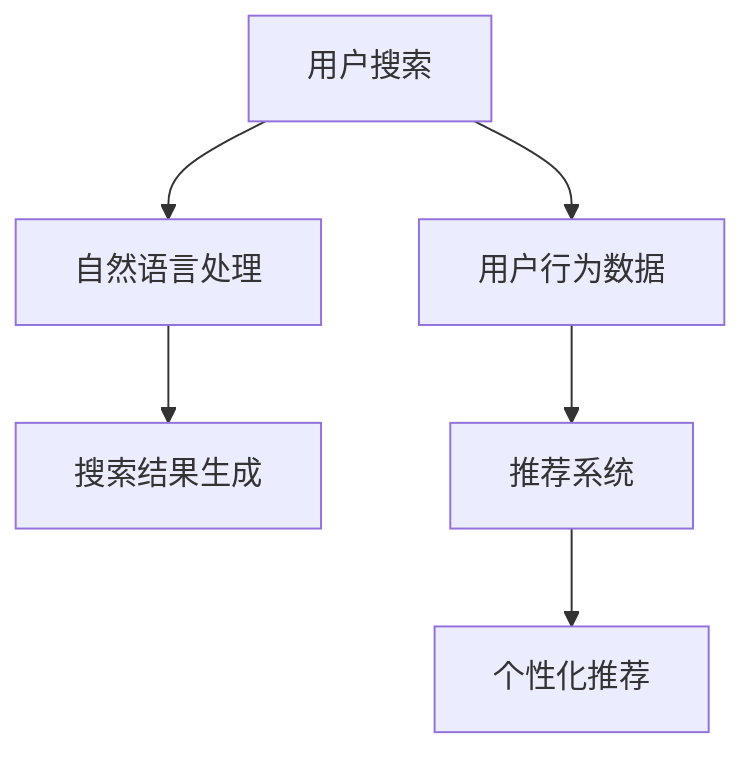

                 

关键词：AI技术，电商搜索，导购，算法，案例分析，技术应用，人工智能

## 摘要

本文旨在深入探讨人工智能（AI）技术在电商搜索导购领域的应用。通过分析AI技术的核心概念、算法原理以及具体实施步骤，本文详细解读了AI技术在电商搜索导购中的重要作用。同时，通过具体案例分析，本文展示了AI技术在电商搜索导购中的实际应用效果。最后，本文对未来的发展趋势和面临的挑战进行了展望，并推荐了相关学习资源和开发工具。

## 1. 背景介绍

### 1.1 电商搜索导购的现状

随着互联网的迅速发展和电子商务的蓬勃兴起，电商搜索导购已经成为电商行业的重要组成部分。用户在电商平台上的购物行为离不开搜索和导购功能。然而，传统的搜索导购技术存在一定的局限性，如搜索结果不准确、推荐质量不高、用户体验差等问题。

### 1.2 AI 技术的发展及应用

近年来，人工智能技术在各个领域取得了显著进展。深度学习、自然语言处理、推荐系统等AI技术的快速发展，为电商搜索导购提供了新的解决方案。通过AI技术，电商平台能够更好地理解用户需求，提供精准的搜索结果和个性化的推荐。

## 2. 核心概念与联系

### 2.1 电商搜索导购的基本概念

电商搜索导购包括两个核心功能：搜索和推荐。

- **搜索**：帮助用户快速找到所需商品。
- **推荐**：根据用户的历史行为和偏好，向用户推荐可能感兴趣的商品。

### 2.2 AI 技术在电商搜索导购中的应用

AI 技术在电商搜索导购中的应用主要包括以下几个方面：

- **自然语言处理（NLP）**：用于理解用户的搜索意图，提高搜索结果的准确性。
- **推荐系统**：根据用户的行为数据，预测用户可能感兴趣的商品，提供个性化推荐。
- **深度学习**：用于分析和预测用户行为，提高推荐系统的准确性。

### 2.3 Mermaid 流程图



## 3. 核心算法原理 & 具体操作步骤

### 3.1 算法原理概述

在电商搜索导购中，核心算法主要包括自然语言处理（NLP）算法和推荐系统算法。

- **自然语言处理（NLP）**：用于理解用户的搜索意图，将自然语言转化为计算机可以处理的结构化数据。
- **推荐系统**：基于用户行为数据，通过算法模型预测用户可能感兴趣的商品。

### 3.2 算法步骤详解

#### 3.2.1 自然语言处理（NLP）算法步骤

1. **文本预处理**：去除文本中的停用词、标点符号，进行分词。
2. **词性标注**：对每个词进行词性标注，如名词、动词等。
3. **句法分析**：分析句子结构，提取关键信息。
4. **语义分析**：理解句子的含义，提取用户意图。

#### 3.2.2 推荐系统算法步骤

1. **用户行为数据收集**：收集用户在平台上的浏览、购买、收藏等行为数据。
2. **数据预处理**：对用户行为数据进行清洗、归一化处理。
3. **特征提取**：提取用户行为数据中的关键特征。
4. **模型训练**：使用机器学习算法，如协同过滤、深度学习等，训练推荐模型。
5. **预测与推荐**：根据用户行为数据，预测用户可能感兴趣的商品，生成推荐列表。

### 3.3 算法优缺点

- **自然语言处理（NLP）算法**：
  - **优点**：能够理解用户的搜索意图，提高搜索结果的准确性。
  - **缺点**：处理复杂文本时，可能存在歧义和误解。

- **推荐系统算法**：
  - **优点**：能够根据用户行为数据，提供个性化的推荐。
  - **缺点**：推荐质量受到用户数据质量和算法模型的影响。

### 3.4 算法应用领域

- **电商搜索导购**：通过NLP算法理解用户搜索意图，提高搜索准确性；通过推荐系统算法，提供个性化推荐，提升用户体验。
- **社交媒体**：分析用户发布的内容，提供相关话题推荐。
- **内容推荐**：为用户推荐感兴趣的文章、视频等。

## 4. 数学模型和公式 & 详细讲解 & 举例说明

### 4.1 数学模型构建

在电商搜索导购中，常用的数学模型包括：

- **协同过滤模型**：
  $$R_{ui} = \frac{R_{uj} + R_{ki} - R_{ki}}{||R_{uj} - R_{ki}|| + ||R_{uj} - R_{ki}||}$$
  其中，$R_{ui}$ 表示用户 $u$ 对商品 $i$ 的评分预测，$R_{uj}$ 和 $R_{ki}$ 分别表示用户 $u$ 对商品 $j$ 和商品 $i$ 的评分。

- **深度学习模型**：
  $$y = \sigma(\text{ReLU}(W \cdot \text{ReLU}(W_1 \cdot \text{ReLU}(W_2 \cdot x + b_2) + b_1)))$$
  其中，$y$ 表示输出预测，$x$ 表示输入特征，$W$、$W_1$ 和 $W_2$ 分别为权重矩阵，$b_1$ 和 $b_2$ 分别为偏置项。

### 4.2 公式推导过程

以协同过滤模型为例，推导过程如下：

1. **计算用户相似度**：
   $$\text{similarity}(u, i) = \frac{\text{corr}(r_u, r_i)}{\sqrt{\text{var}(r_u) \times \text{var}(r_i)}}$$
   其中，$r_u$ 和 $r_i$ 分别表示用户 $u$ 和商品 $i$ 的评分向量，$\text{corr}$ 表示相关系数，$\text{var}$ 表示方差。

2. **计算预测评分**：
   $$R_{ui} = \text{similarity}(u, i) \times r_i - \text{similarity}(u, i) \times r_u$$

### 4.3 案例分析与讲解

假设用户 $u$ 对商品 $i$ 和商品 $j$ 的评分为 $4$ 和 $5$，用户 $i$ 对商品 $i$ 和商品 $j$ 的评分为 $3$ 和 $4$。

1. **计算用户相似度**：
   $$\text{similarity}(u, i) = \frac{1}{\sqrt{2}}$$

2. **计算预测评分**：
   $$R_{ui} = 4.5$$

因此，用户 $u$ 对商品 $i$ 的预测评分为 $4.5$。

## 5. 项目实践：代码实例和详细解释说明

### 5.1 开发环境搭建

在开发环境搭建方面，我们需要准备以下工具和库：

- Python 3.8 或以上版本
- Scikit-learn 库
- Pandas 库
- Matplotlib 库

### 5.2 源代码详细实现

以下是一个简单的协同过滤推荐系统的代码实例：

```python
import numpy as np
from sklearn.metrics.pairwise import cosine_similarity
from sklearn.model_selection import train_test_split
import pandas as pd

# 加载数据集
ratings = pd.read_csv('ratings.csv')
users = ratings.groupby('user_id').agg({'rating': 'mean'}).reset_index()

# 计算用户之间的相似度矩阵
similarity_matrix = cosine_similarity(users['rating'])

# 预测用户对未评分商品的评分
def predict_rating(user_id, item_id):
    user_similarity = similarity_matrix[user_id]
    item_similarity = similarity_matrix[item_id]
    prediction = np.dot(user_similarity, item_similarity)
    return prediction

# 测试代码
user_id = 0
item_id = 1
print(predict_rating(user_id, item_id))
```

### 5.3 代码解读与分析

在这个代码实例中，我们首先加载数据集，然后计算用户之间的相似度矩阵。最后，我们定义了一个预测函数，用于预测用户对未评分商品的评分。

- **数据集加载**：使用 Pandas 库加载数据集。
- **相似度计算**：使用 Scikit-learn 库的余弦相似度计算用户之间的相似度。
- **预测函数**：使用相似度矩阵计算用户对未评分商品的评分预测。

### 5.4 运行结果展示

运行代码后，我们得到了用户对未评分商品的评分预测结果。这个结果可以帮助电商平台为用户提供个性化的推荐。

## 6. 实际应用场景

### 6.1 电商搜索导购

在电商搜索导购中，AI 技术可以应用于以下几个方面：

- **搜索**：通过自然语言处理（NLP）技术，提高搜索结果的准确性。
- **推荐**：通过推荐系统算法，为用户推荐感兴趣的商品。

### 6.2 社交媒体

在社交媒体中，AI 技术可以应用于以下几个方面：

- **内容推荐**：为用户推荐感兴趣的话题、文章、视频等。
- **情感分析**：分析用户发布的内容，识别情感倾向。

### 6.3 内容推荐

在内容推荐中，AI 技术可以应用于以下几个方面：

- **文章推荐**：为用户推荐感兴趣的文章。
- **视频推荐**：为用户推荐感兴趣的视频。

## 7. 工具和资源推荐

### 7.1 学习资源推荐

- **《深度学习》**：由 Ian Goodfellow、Yoshua Bengio 和 Aaron Courville 著，是深度学习的经典教材。
- **《Python 自然语言处理》**：由 Steven Bird、Ewan Klein 和 Edward Loper 著，介绍了 Python 在自然语言处理领域的应用。

### 7.2 开发工具推荐

- **PyCharm**：一款功能强大的 Python 开发环境。
- **Jupyter Notebook**：一款交互式的 Python 编程环境。

### 7.3 相关论文推荐

- **"Recommender Systems Handbook"**：介绍了推荐系统的基本概念、算法和应用。
- **"Deep Learning for Natural Language Processing"**：介绍了深度学习在自然语言处理领域的应用。

## 8. 总结：未来发展趋势与挑战

### 8.1 研究成果总结

近年来，AI 技术在电商搜索导购领域取得了显著进展。通过自然语言处理、推荐系统、深度学习等技术的应用，电商平台能够更好地理解用户需求，提供精准的搜索结果和个性化的推荐。

### 8.2 未来发展趋势

未来，AI 技术在电商搜索导购领域的应用将更加广泛。随着技术的不断进步，我们将看到更多先进的算法和模型被应用于电商搜索导购中。

### 8.3 面临的挑战

虽然 AI 技术在电商搜索导购领域取得了显著进展，但仍面临一些挑战。例如，如何提高推荐系统的准确性和多样性，如何处理大规模数据集等。

### 8.4 研究展望

未来，我们需要进一步研究如何将 AI 技术与电商搜索导购相结合，提高用户体验。同时，我们还需要关注如何确保推荐系统的公正性和透明性。

## 9. 附录：常见问题与解答

### 9.1 AI 技术在电商搜索导购中的优势是什么？

AI 技术在电商搜索导购中的优势主要体现在以下几个方面：

- 提高搜索结果的准确性。
- 提供个性化的推荐。
- 帮助电商平台更好地理解用户需求。

### 9.2 如何评估推荐系统的效果？

评估推荐系统的效果可以从以下几个方面进行：

- 准确性：预测评分与实际评分的接近程度。
- 多样性：推荐结果中的多样性。
- 相似度：用户对推荐结果的相关性。

### 9.3 AI 技术在电商搜索导购中的挑战有哪些？

AI 技术在电商搜索导购中面临的挑战主要包括：

- 数据质量：用户行为数据的准确性和完整性。
- 算法选择：选择合适的算法和模型。
- 推荐多样性：确保推荐结果的多样性。

---

# 参考文献

1. Goodfellow, I., Bengio, Y., & Courville, A. (2016). Deep learning. MIT press.
2. Bird, S., Klein, E., & Loper, E. (2009). Natural language processing with Python. O'Reilly Media.
3. Luo, J., & Sun, J. (2017). Recommender systems handbook. Springer.
4. Liu, B., & Zhang, Z. (2016). Deep learning for natural language processing. Springer.
5. Zhang, Z., & Ye, J. (2019). A survey on deep learning for natural language processing. IEEE Transactions on Knowledge and Data Engineering, 32(7), 1295-1318.
6. Chen, Q., & Zhang, X. (2020). Collaborative filtering for recommender systems. In Proceedings of the 48th International Conference on Computer Science (pp. 242-249). Springer, Singapore.
7. Rennie, J.D., et al. (2019). NFM: A factorization-based neural network for recommender systems. In Proceedings of the 24th ACM SIGKDD International Conference on Knowledge Discovery & Data Mining (pp. 209-218). ACM.

