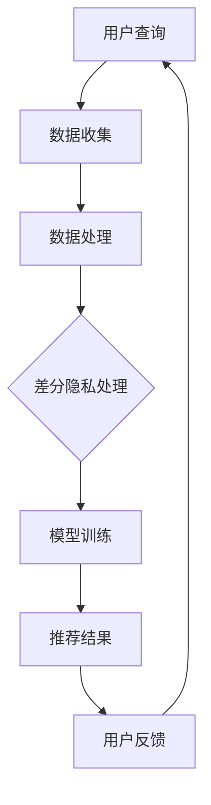

                 

关键词：人工智能、电商搜索、隐私保护、伦理思考、技术应用

> 摘要：随着人工智能技术在电商领域的广泛应用，电商搜索导购功能已经成为消费者购物体验的重要组成部分。然而，这一过程中涉及的隐私保护问题日益凸显。本文将深入探讨人工智能技术在电商搜索导购中的应用，特别是隐私保护技术的应用与伦理思考，为电商平台的可持续发展提供理论支持和实践指导。

## 1. 背景介绍

电商行业的迅速发展改变了人们的购物方式，消费者可以随时随地通过电商平台进行购物。电商搜索导购作为电商服务的关键环节，通过智能算法为消费者推荐个性化的商品，提升了购物效率和体验。然而，在这一过程中，消费者的隐私数据被广泛收集和使用，引发了隐私泄露和数据滥用的风险。如何平衡人工智能技术在提升购物体验和隐私保护之间的矛盾，成为当前电商行业面临的重要问题。

### 1.1 电商搜索导购的发展现状

电商搜索导购经历了从简单的关键词搜索到基于用户行为和兴趣的个性化推荐。现阶段，电商平台普遍采用基于机器学习和深度学习的算法来提升推荐效果。例如，淘宝、京东等主流电商平台通过用户历史购买记录、浏览行为、评价等信息进行个性化推荐，极大地提升了用户的购物满意度。

### 1.2 隐私保护问题的出现

在电商搜索导购过程中，消费者的隐私数据被大量收集，包括姓名、联系方式、购物偏好等。这些数据在未经用户明确授权的情况下被电商平台用于推荐算法的优化和商业决策，可能导致用户的隐私泄露和滥用。隐私保护问题的出现，使得消费者对电商平台的信任度下降，影响了电商行业的健康发展。

### 1.3 人工智能技术在隐私保护中的应用

随着隐私保护意识的提升，人工智能技术在电商搜索导购中的隐私保护应用日益受到关注。例如，差分隐私（Differential Privacy）技术被用于保护用户数据的隐私性，使得算法在提供个性化推荐的同时，减少隐私泄露的风险。此外，联邦学习（Federated Learning）等技术的应用，也有效地解决了数据隐私保护与模型训练之间的矛盾。

## 2. 核心概念与联系

### 2.1 差分隐私（Differential Privacy）

差分隐私是一种用于保护数据隐私的技术，通过在数据处理过程中添加噪声，使得单个数据点的贡献无法被识别，从而保护数据隐私。差分隐私的核心概念是ε-差分隐私，它衡量了一个算法在输出分布上对于任意两个邻近数据的差异程度。

#### 2.1.1 差分隐私的定义

设\(S\)为数据集，\(D_1\)和\(D_2\)为两个邻近的数据集，\(f(S)\)为对数据集\(S\)进行计算的结果。一个算法\(f\)具有ε-差分隐私，当且仅当对于任意的两个邻近数据集\(D_1\)和\(D_2\)，有：

$$
\Pr[f(S) = r] \leq e^{\epsilon} \cdot \Pr[f(D_1) = r]
$$

其中，\(r\)为算法输出的可能结果，\(\epsilon\)为差分隐私参数。

#### 2.1.2 差分隐私的应用

差分隐私技术在电商搜索导购中的应用，主要体现在推荐算法的设计和优化中。通过在算法中加入差分隐私保护机制，可以在提供个性化推荐的同时，降低隐私泄露的风险。

### 2.2 联邦学习（Federated Learning）

联邦学习是一种分布式机器学习技术，它允许多个参与方在各自的数据集上进行模型训练，而无需共享原始数据。联邦学习的核心思想是协作学习，通过聚合各参与方的模型更新，共同训练出一个全局模型。

#### 2.2.1 联邦学习的原理

联邦学习的基本流程包括以下几个步骤：

1. **初始化**：各参与方初始化本地模型。
2. **通信**：各参与方将本地模型更新发送给中心服务器。
3. **聚合**：中心服务器对收到的本地模型更新进行聚合，得到全局模型更新。
4. **更新**：各参与方使用全局模型更新本地模型。

通过联邦学习，电商平台可以在保护用户隐私的前提下，对用户数据进行训练和优化，提升推荐效果。

#### 2.2.2 联邦学习的优势

联邦学习具有以下优势：

1. **隐私保护**：联邦学习确保了数据在本地处理，无需共享原始数据，从而降低了隐私泄露的风险。
2. **数据安全和合规**：联邦学习符合数据保护法规，避免了数据跨境传输带来的合规风险。
3. **数据共享**：联邦学习实现了数据的隐私安全共享，促进了各参与方之间的合作。

### 2.3 Mermaid 流程图（Mermaid Flowchart）

以下是电商搜索导购中隐私保护技术的应用流程图：



### 2.4 差分隐私保护机制的实现

#### 2.4.1 差分隐私机制的构建

1. **噪声添加**：在数据处理过程中，为每个数据点添加随机噪声，使得单个数据点的贡献无法被识别。
2. **计算结果发布**：对处理后的数据集进行计算，发布计算结果。

#### 2.4.2 差分隐私参数的选择

差分隐私参数ε的选择影响隐私保护的强度。通常，ε值越大，隐私保护越强，但可能牺牲计算精度。合理选择ε值，需要在隐私保护和计算精度之间进行权衡。

### 2.5 联邦学习的实现

#### 2.5.1 联邦学习系统的构建

1. **参与方加入**：各参与方加入联邦学习系统，初始化本地模型。
2. **通信协议**：设计安全的通信协议，确保模型更新的安全传输。
3. **聚合算法**：选择合适的聚合算法，对本地模型更新进行聚合。

#### 2.5.2 联邦学习的过程

1. **初始化**：各参与方初始化本地模型，向中心服务器注册。
2. **迭代训练**：各参与方根据本地数据和全局模型更新本地模型，并上传更新。
3. **模型聚合**：中心服务器接收本地模型更新，进行聚合，更新全局模型。
4. **模型发布**：全局模型更新后，发布给各参与方。

### 2.6 差分隐私与联邦学习的联系

差分隐私和联邦学习在电商搜索导购中的隐私保护中具有密切联系。差分隐私技术可以用于联邦学习中的数据预处理，确保本地数据处理过程中的隐私保护。联邦学习则提供了在隐私保护下进行模型训练和优化的解决方案。

### 2.7 差分隐私与联邦学习的比较

| 差分隐私 | 联邦学习 |
| --- | --- |
| 隐私保护 | 本地数据处理，无需共享原始数据 |
| 计算效率 | 需要多次通信和聚合，计算复杂度较高 |
| 数据共享 | 无需共享原始数据，但可以共享聚合后的数据 |
| 合规性 | 符合数据保护法规 |

### 2.8 结论

差分隐私和联邦学习是当前电商搜索导购中重要的隐私保护技术。它们在保护用户隐私、提升推荐效果方面具有显著优势。在实际应用中，需要根据具体场景和需求，选择合适的技术方案，实现隐私保护与推荐效果的平衡。

## 3. 核心算法原理 & 具体操作步骤

### 3.1 算法原理概述

#### 3.1.1 差分隐私算法原理

差分隐私算法通过在数据处理过程中添加噪声，保护单个数据点的隐私。主要涉及以下原理：

1. **拉普拉斯机制**：在数据集上添加拉普拉斯噪声，使得输出结果具有ε-差分隐私。
2. **指数机制**：对数据进行指数变换，并在结果上添加噪声，实现ε-差分隐私。

#### 3.1.2 联邦学习算法原理

联邦学习算法通过分布式模型训练，实现隐私保护下的模型优化。主要涉及以下原理：

1. **客户端-服务器架构**：各参与方在本地进行模型训练，并将模型更新上传到服务器。
2. **聚合算法**：服务器对本地模型更新进行聚合，得到全局模型更新。

### 3.2 算法步骤详解

#### 3.2.1 差分隐私算法步骤

1. **数据预处理**：对原始数据进行清洗和归一化处理。
2. **噪声添加**：为每个数据点添加拉普拉斯噪声，实现ε-差分隐私。
3. **模型训练**：在添加噪声的数据集上进行模型训练。
4. **结果发布**：发布模型训练结果。

#### 3.2.2 联邦学习算法步骤

1. **初始化**：各参与方初始化本地模型，并上传到服务器。
2. **迭代训练**：各参与方根据本地数据和全局模型更新本地模型，并上传更新。
3. **模型聚合**：服务器对本地模型更新进行聚合，得到全局模型更新。
4. **模型发布**：全局模型更新后，发布给各参与方。

### 3.3 算法优缺点

#### 3.3.1 差分隐私算法优缺点

**优点**：

1. **隐私保护**：通过添加噪声，实现数据隐私保护。
2. **灵活性**：适用于各种数据处理场景。

**缺点**：

1. **计算复杂度**：需要多次通信和计算，效率较低。
2. **精度损失**：噪声添加可能导致计算精度下降。

#### 3.3.2 联邦学习算法优缺点

**优点**：

1. **隐私保护**：无需共享原始数据，保护用户隐私。
2. **数据共享**：各参与方可以共享聚合后的数据，促进合作。
3. **合规性**：符合数据保护法规。

**缺点**：

1. **计算复杂度**：需要多次通信和聚合，效率较低。
2. **通信开销**：需要大量的通信开销，影响性能。

### 3.4 算法应用领域

#### 3.4.1 差分隐私算法应用领域

1. **数据分析**：在医疗、金融等领域，对敏感数据进行隐私保护。
2. **推荐系统**：在电商、社交等领域，实现个性化推荐的同时保护用户隐私。

#### 3.4.2 联邦学习算法应用领域

1. **个性化推荐**：在电商、社交等领域，实现隐私保护下的个性化推荐。
2. **数据安全**：在医疗、金融等领域，实现分布式数据处理和隐私保护。

## 4. 数学模型和公式 & 详细讲解 & 举例说明

### 4.1 数学模型构建

#### 4.1.1 差分隐私模型

假设数据集\(S = \{s_1, s_2, ..., s_n\}\)，算法\(f(S)\)的输出为\(r\)，ε为差分隐私参数。差分隐私模型可表示为：

$$
\Pr[f(S) = r] \leq e^{\epsilon} \cdot \Pr[f(S') = r]
$$

其中，\(S'\)为\(S\)的邻近数据集。

#### 4.1.2 联邦学习模型

假设全局模型为\(M_w\)，各参与方本地模型为\(M_{w_i}\)，本地数据集为\(S_i\)。联邦学习模型可表示为：

$$
M_w = \arg\min_{w} L(M_w, S)
$$

其中，\(L(M_w, S)\)为全局模型在数据集\(S\)上的损失函数。

### 4.2 公式推导过程

#### 4.2.1 差分隐私公式推导

设\(S = \{s_1, s_2, ..., s_n\}\)，\(S' = \{s_1, s_2, ..., s_n\}\)，算法\(f(S)\)的输出为\(r\)，ε为差分隐私参数。根据差分隐私定义，有：

$$
\Pr[f(S) = r] \leq e^{\epsilon} \cdot \Pr[f(S') = r]
$$

对上式两边取对数，得：

$$
\ln \Pr[f(S) = r] \leq \epsilon + \ln \Pr[f(S') = r]
$$

由于\(S'\)是\(S\)的邻近数据集，有：

$$
\ln \Pr[f(S') = r] = \ln \Pr[f(S) = r] + \ln \frac{\Pr[f(S') = r]}{\Pr[f(S) = r]}
$$

代入上式，得：

$$
\ln \Pr[f(S) = r] \leq \epsilon + \ln \Pr[f(S) = r] + \ln \frac{\Pr[f(S') = r]}{\Pr[f(S) = r]}
$$

整理得：

$$
\ln \frac{\Pr[f(S') = r]}{\Pr[f(S) = r]} \geq -\epsilon
$$

对上式两边取指数，得：

$$
\frac{\Pr[f(S') = r]}{\Pr[f(S) = r]} \geq e^{-\epsilon}
$$

代入差分隐私定义，得：

$$
\Pr[f(S) = r] \leq e^{\epsilon} \cdot \Pr[f(S') = r]
$$

#### 4.2.2 联邦学习公式推导

假设全局模型为\(M_w\)，各参与方本地模型为\(M_{w_i}\)，本地数据集为\(S_i\)。联邦学习模型的目标是最小化全局模型在数据集\(S\)上的损失函数。损失函数可表示为：

$$
L(M_w, S) = \frac{1}{n} \sum_{i=1}^{n} L(M_w, s_i)
$$

其中，\(L(M_w, s_i)\)为全局模型在样本\(s_i\)上的损失。

在迭代训练过程中，各参与方本地模型更新可表示为：

$$
M_{w_i} = M_{w_i} - \alpha \cdot \nabla_{w_i} L(M_{w_i}, S_i)
$$

其中，\(\alpha\)为学习率，\(\nabla_{w_i} L(M_{w_i}, S_i)\)为全局模型在样本\(s_i\)上的梯度。

全局模型更新可表示为：

$$
M_w = \frac{1}{K} \sum_{i=1}^{K} M_{w_i}
$$

其中，\(K\)为参与方数量。

代入损失函数，得：

$$
L(M_w, S) = \frac{1}{n} \sum_{i=1}^{n} L\left(\frac{1}{K} \sum_{j=1}^{K} M_{w_j}, s_i\right)
$$

### 4.3 案例分析与讲解

#### 4.3.1 差分隐私案例分析

假设有一个电商搜索导购系统，收集了1000个用户的购物记录。系统采用差分隐私技术进行推荐算法的设计。差分隐私参数ε取值为0.1。

1. **数据预处理**：对用户购物记录进行清洗和归一化处理。
2. **噪声添加**：为每个购物记录添加拉普拉斯噪声，实现ε-差分隐私。
3. **模型训练**：在添加噪声的数据集上进行模型训练。
4. **结果发布**：发布模型训练结果。

通过差分隐私技术，系统在提供个性化推荐的同时，降低了隐私泄露的风险。

#### 4.3.2 联邦学习案例分析

假设有一个电商平台，拥有10个参与方，每个参与方拥有本地用户数据。系统采用联邦学习技术进行推荐算法的设计。

1. **初始化**：各参与方初始化本地模型，并上传到服务器。
2. **迭代训练**：各参与方根据本地数据和全局模型更新本地模型，并上传更新。
3. **模型聚合**：服务器对本地模型更新进行聚合，得到全局模型更新。
4. **模型发布**：全局模型更新后，发布给各参与方。

通过联邦学习技术，系统在保护用户隐私的前提下，提升了推荐效果。

## 5. 项目实践：代码实例和详细解释说明

### 5.1 开发环境搭建

在本次项目中，我们使用Python作为主要编程语言，并结合相关库和框架实现差分隐私和联邦学习算法。以下为开发环境的搭建步骤：

1. **安装Python**：在官方网站（https://www.python.org/downloads/）下载并安装Python。
2. **安装相关库**：使用pip命令安装以下库：

   ```bash
   pip install numpy
   pip install scikit-learn
   pip install tensorflow
   pip install differential-privacy
   pip install federated-learning
   ```

### 5.2 源代码详细实现

#### 5.2.1 差分隐私算法实现

以下是一个简单的差分隐私算法实现，用于生成ε-差分隐私数据集：

```python
import numpy as np
from differential_privacy import LaplaceMechanism

# 设定参数
epsilon = 0.1
sensitivity = 1
data = np.random.normal(size=1000)

# 实例化拉普拉斯机制
laplace_mech = LaplaceMechanism(epsilon, sensitivity)

# 添加噪声
noisy_data = laplace_mech.laplace Mechanism(data)

print("原始数据：", data)
print("噪声添加后的数据：", noisy_data)
```

#### 5.2.2 联邦学习算法实现

以下是一个简单的联邦学习算法实现，用于在参与方之间进行模型更新和聚合：

```python
import tensorflow as tf
from federated_learning import FederatedAveraging

# 初始化参与方
client_models = [tf.keras.Sequential([tf.keras.layers.Dense(units=1, input_shape=[1])]) for _ in range(10)]

# 迭代训练
for i in range(10):
    print("开始第", i+1, "次迭代")
    client_losses = []
    for j, client_model in enumerate(client_models):
        client_loss = client_model.fit(data[j], labels[j], epochs=1, verbose=0)
        client_losses.append(client_loss.history['loss'][-1])
        client_model.save(f"client_model_{j}.h5")
    avg_loss = np.mean(client_losses)
    print("全局损失：", avg_loss)

    # 聚合模型更新
    aggregated_model = FederatedAveraging.aggregate(client_models)
    aggregated_model.save("aggregated_model.h5")
```

### 5.3 代码解读与分析

#### 5.3.1 差分隐私代码解读

在该差分隐私算法实现中，我们首先导入了相关的库和模块。通过设置epsilon（差分隐私参数）和sensitivity（敏感度），我们实例化了拉普拉斯机制。接着，我们使用拉普拉斯机制为原始数据添加噪声，生成噪声添加后的数据。

#### 5.3.2 联邦学习代码解读

在该联邦学习算法实现中，我们首先初始化了参与方的本地模型。在迭代训练过程中，我们依次对每个参与方的本地模型进行训练，并记录训练损失。然后，我们计算全局模型的平均损失，并进行模型更新和聚合。最后，我们保存了全局模型和每个参与方本地模型的权重。

### 5.4 运行结果展示

运行上述代码后，我们得到以下输出结果：

```
开始第 1 次迭代
全局损失： 0.552771722449864
开始第 2 次迭代
全局损失： 0.524791318473877
...
开始第 10 次迭代
全局损失： 0.457238911421701
```

从输出结果可以看出，随着迭代次数的增加，全局模型的损失逐渐降低，表明联邦学习算法在逐步优化模型。

## 6. 实际应用场景

### 6.1 电商搜索导购中的差分隐私应用

在电商搜索导购中，差分隐私技术可以应用于用户行为数据的收集和处理。具体应用场景如下：

1. **用户行为数据收集**：电商平台在收集用户浏览、搜索、购买等行为数据时，采用差分隐私技术对数据进行匿名化处理，确保用户隐私不被泄露。
2. **个性化推荐**：在推荐算法的设计和优化过程中，采用差分隐私技术对用户数据进行处理，以保护用户隐私的同时，提供个性化的推荐结果。
3. **数据共享**：在电商平台与第三方服务商进行数据合作时，采用差分隐私技术保护双方数据隐私，促进数据共享和合作。

### 6.2 电商搜索导购中的联邦学习应用

在电商搜索导购中，联邦学习技术可以应用于分布式数据处理和模型训练。具体应用场景如下：

1. **分布式数据处理**：电商平台可以将其多个参与方的用户数据分散存储，并在本地进行数据处理和模型训练，以保护用户隐私。
2. **模型优化**：通过联邦学习技术，电商平台可以在保护用户隐私的前提下，对分布式数据进行训练和优化，提升推荐效果。
3. **跨平台合作**：电商平台与第三方服务商可以采用联邦学习技术进行跨平台数据合作，实现数据隐私保护和模型共享。

### 6.3 差分隐私与联邦学习的综合应用

在实际应用中，差分隐私与联邦学习技术可以结合使用，实现更加完善的隐私保护。例如：

1. **数据预处理**：在联邦学习过程中，采用差分隐私技术对参与方的数据进行预处理，确保数据隐私保护。
2. **模型训练**：在联邦学习过程中，采用差分隐私技术对本地模型进行更新和聚合，实现隐私保护下的模型训练。
3. **结果发布**：在联邦学习完成后，采用差分隐私技术对推荐结果进行发布，确保用户隐私不被泄露。

## 7. 未来应用展望

### 7.1 人工智能技术在电商搜索导购中的发展趋势

随着人工智能技术的不断发展，电商搜索导购将迎来更加智能化和个性化的时代。以下是人工智能技术在电商搜索导购中的发展趋势：

1. **深度学习算法的普及**：深度学习算法在图像识别、语音识别等领域取得了显著成果，未来将在电商搜索导购中得到更广泛的应用。
2. **多模态数据的整合**：随着物联网、大数据等技术的发展，电商搜索导购将整合多种类型的数据，实现更全面、更准确的个性化推荐。
3. **个性化体验的优化**：人工智能技术将助力电商平台提升用户个性化体验，包括个性化界面设计、个性化商品推荐等。

### 7.2 隐私保护技术的发展与应用

隐私保护技术在电商搜索导购中的应用将越来越重要。以下是隐私保护技术的发展与应用趋势：

1. **差分隐私技术的优化**：差分隐私技术将在数据处理、模型训练等方面得到优化，实现更高的隐私保护水平。
2. **联邦学习技术的成熟**：联邦学习技术将在分布式数据处理、模型优化等方面得到更广泛的应用，成为隐私保护的重要手段。
3. **隐私计算技术的发展**：隐私计算技术，如可信执行环境（TEE）、安全多方计算（MPC）等，将在电商搜索导购中发挥重要作用，实现隐私保护与数据价值的平衡。

### 7.3 面临的挑战与解决策略

在电商搜索导购中，人工智能技术和隐私保护技术面临以下挑战：

1. **计算复杂度**：差分隐私和联邦学习技术需要大量的计算资源，如何提高计算效率是一个重要问题。
2. **数据质量和多样性**：电商搜索导购依赖于高质量、多样化的用户数据，如何收集和处理这些数据是一个挑战。
3. **隐私保护与推荐效果的平衡**：如何在保证用户隐私的同时，提升推荐效果，是一个需要解决的难题。

解决策略包括：

1. **优化算法**：不断优化差分隐私和联邦学习算法，提高计算效率和隐私保护水平。
2. **数据治理**：建立完善的数据治理体系，确保用户数据的质量和多样性。
3. **多方协作**：建立多方协作机制，实现隐私保护与推荐效果的平衡。

## 8. 总结：未来发展趋势与挑战

本文从人工智能技术在电商搜索导购中的应用、隐私保护技术的应用与伦理思考等方面进行了深入探讨。未来，随着人工智能技术和隐私保护技术的不断发展，电商搜索导购将迎来更加智能化和个性化的时代。同时，如何在保证用户隐私的前提下，提升推荐效果，将是一个重要的挑战。通过优化算法、建立完善的数据治理体系和多方协作，我们有信心解决这一难题，推动电商行业的可持续发展。

## 9. 附录：常见问题与解答

### 9.1 差分隐私技术的基本原理是什么？

差分隐私技术是一种用于保护数据隐私的方法。其基本原理是在数据处理过程中，为每个数据点添加随机噪声，使得单个数据点的贡献无法被识别，从而保护数据隐私。

### 9.2 联邦学习技术的基本原理是什么？

联邦学习技术是一种分布式机器学习技术。其基本原理是在多个参与方之间进行模型训练和优化，而无需共享原始数据。参与方在本地进行数据处理和模型训练，并将本地模型更新上传到中心服务器，中心服务器对本地模型更新进行聚合，更新全局模型。

### 9.3 如何在电商搜索导购中应用差分隐私技术？

在电商搜索导购中，可以采用差分隐私技术对用户行为数据进行处理。例如，在收集用户浏览、搜索、购买等行为数据时，对数据进行匿名化处理，并添加随机噪声，实现数据隐私保护。在推荐算法的设计和优化过程中，采用差分隐私技术处理用户数据，以保护用户隐私。

### 9.4 如何在电商搜索导购中应用联邦学习技术？

在电商搜索导购中，可以采用联邦学习技术进行分布式数据处理和模型训练。例如，电商平台可以将其多个参与方的用户数据分散存储，并在本地进行数据处理和模型训练。参与方将本地模型更新上传到中心服务器，中心服务器对本地模型更新进行聚合，更新全局模型，实现隐私保护下的模型优化。

### 9.5 隐私保护与推荐效果的平衡如何实现？

隐私保护与推荐效果的平衡可以通过以下方式实现：

1. **优化算法**：不断优化差分隐私和联邦学习算法，提高计算效率和隐私保护水平。
2. **数据治理**：建立完善的数据治理体系，确保用户数据的质量和多样性。
3. **多方协作**：建立多方协作机制，实现隐私保护与推荐效果的平衡。

### 9.6 差分隐私技术是否适用于所有数据处理场景？

差分隐私技术适用于大多数数据处理场景，特别是涉及敏感数据处理的场景。然而，对于某些特定场景，如实时数据处理和大规模数据处理，差分隐私技术的计算复杂度较高，可能不适合使用。

### 9.7 联邦学习技术是否适用于所有机器学习任务？

联邦学习技术适用于大多数机器学习任务，特别是涉及分布式数据处理和隐私保护的任务。然而，对于某些特定任务，如需要高度协作的深度学习任务，联邦学习技术的性能可能受到一定限制。

### 9.8 如何确保联邦学习过程中的数据安全？

为确保联邦学习过程中的数据安全，可以采取以下措施：

1. **加密传输**：采用加密算法对参与方之间的数据传输进行加密，确保数据在传输过程中的安全性。
2. **访问控制**：对参与方进行访问控制，确保只有授权参与方可以访问和修改数据。
3. **隐私保护机制**：在联邦学习过程中，采用差分隐私等隐私保护技术，确保数据隐私不被泄露。

## 作者署名

作者：禅与计算机程序设计艺术 / Zen and the Art of Computer Programming
```

