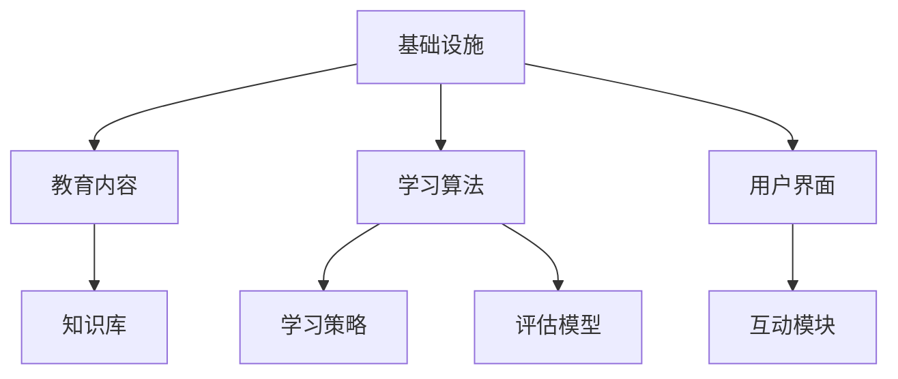

                 

关键词：AI、教育、终身学习、人工智能教育、教育技术、学习算法、个性化学习、未来教育

> 摘要：随着人工智能技术的飞速发展，教育领域正经历着深刻的变革。本文将探讨如何利用人工智能技术促进终身学习，实现教育的个性化、智能化和多样化。我们将深入分析人工智能在教育中的应用，探讨其核心概念、算法原理、数学模型以及实践应用，并展望未来教育的发展趋势与挑战。

## 1. 背景介绍

### 1.1 人工智能在教育中的地位

人工智能（AI）作为21世纪最具颠覆性的技术之一，正在深刻改变各行各业。在教育领域，人工智能的应用不仅改变了教学方式，更为学习者的终身学习提供了新的可能性。通过智能学习算法、数据分析和个性化推荐系统，AI能够帮助学习者更好地掌握知识，提升学习效果。

### 1.2 人工智能教育的现状

当前，全球范围内的人工智能教育呈现出蓬勃发展态势。许多国家已经将人工智能纳入中小学及高等教育课程，旨在培养学生的人工智能素养。同时，各种人工智能教育平台和工具也应运而生，为广大学习者提供了丰富的学习资源。

### 1.3 人工智能教育的挑战

尽管人工智能教育具有巨大的潜力，但在实际应用中也面临着一系列挑战。如教育资源的公平性、教师的适应能力、学生的学习习惯等问题，都需要我们深入探讨和解决。

## 2. 核心概念与联系

### 2.1 人工智能教育的基本概念

人工智能教育是指利用人工智能技术来辅助教学、评估学习效果、提供个性化学习资源等。其主要目标是实现教育的智能化、个性化和高效化。

### 2.2 人工智能教育的架构

人工智能教育的架构包括四个主要层次：基础设施、教育内容、学习算法和用户界面。其中，学习算法是核心，负责根据学习者的特点提供个性化的学习建议。



### 2.3 人工智能教育的联系

人工智能教育与传统教育的联系主要体现在以下几个方面：

1. **教学方法的变革**：AI技术可以模拟传统教学方法，如讲授、讨论、实验等，同时提供更为丰富的教学资源。
2. **学习过程的优化**：AI技术能够分析学习者的学习行为，提供个性化的学习路径和反馈。
3. **学习效果的提升**：AI技术可以帮助教师和学生实时评估学习效果，及时调整教学策略。

## 3. 核心算法原理 & 具体操作步骤

### 3.1 算法原理概述

人工智能教育中的核心算法主要包括知识表示、推理、学习与评估等。这些算法共同构成了一个完整的智能学习系统。

### 3.2 算法步骤详解

1. **知识表示**：将教学知识转换为计算机可处理的结构化数据，如语义网络、本体等。
2. **推理**：基于知识库和推理规则，对学习者的提问进行推理，生成回答。
3. **学习**：根据学习者的行为和反馈，不断调整知识库和推理规则，实现自我优化。
4. **评估**：对学习者的学习效果进行评估，为教师提供教学反馈。

### 3.3 算法优缺点

**优点**：

- **个性化**：根据学习者的特点提供个性化的学习资源和路径。
- **高效性**：通过智能算法，提高学习效率和学习效果。
- **可扩展性**：可以适应不同层次和年龄段的学习者。

**缺点**：

- **数据依赖**：需要大量数据支持，且数据的真实性和有效性难以保证。
- **技术门槛**：算法设计和实现需要较高技术水平，对教师和开发者的要求较高。

### 3.4 算法应用领域

人工智能教育算法主要应用于以下几个方面：

1. **智能问答系统**：为学生提供即时的知识问答服务。
2. **个性化学习推荐**：根据学习者的兴趣和能力推荐合适的学习资源。
3. **学习行为分析**：对学习者的学习行为进行数据挖掘和分析，为教师提供教学决策支持。

## 4. 数学模型和公式 & 详细讲解 & 举例说明

### 4.1 数学模型构建

人工智能教育中的数学模型主要包括学习率调整模型、优化算法模型等。

### 4.2 公式推导过程

假设学习者的初始知识水平为\( x_0 \)，学习率为\( \alpha \)，每次学习后知识水平的变化量为\( \Delta x \)，则第\( t \)次学习后的知识水平为：

\[ x_t = x_{t-1} + \alpha \cdot \Delta x \]

其中，\( \Delta x \)可以根据学习者的行为和反馈进行动态调整。

### 4.3 案例分析与讲解

以一个智能问答系统的学习率为例，假设初始学习率为0.1，每次回答正确后学习率增加0.01，回答错误后学习率减少0.01。经过10次问答后，学习率变为多少？

初始学习率：\( \alpha_0 = 0.1 \)

第1次回答正确，学习率增加：\( \alpha_1 = 0.1 + 0.01 = 0.11 \)

第2次回答正确，学习率增加：\( \alpha_2 = 0.11 + 0.01 = 0.12 \)

...

第10次回答正确，学习率增加：\( \alpha_{10} = 0.1 + 0.09 = 0.19 \)

## 5. 项目实践：代码实例和详细解释说明

### 5.1 开发环境搭建

1. 安装Python环境
2. 安装TensorFlow库
3. 安装Jupyter Notebook

### 5.2 源代码详细实现

以下是一个简单的基于TensorFlow实现的线性回归模型，用于预测学习者的知识水平：

```python
import tensorflow as tf

# 定义输入层
x = tf.placeholder(tf.float32, shape=[None])
y = tf.placeholder(tf.float32, shape=[None])

# 定义模型参数
w = tf.Variable(0.0, name='weights')
b = tf.Variable(0.0, name='biases')

# 定义线性回归模型
y_pred = w * x + b

# 定义损失函数
loss = tf.reduce_mean(tf.square(y - y_pred))

# 定义优化器
optimizer = tf.train.GradientDescentOptimizer(learning_rate=0.5)
train_op = optimizer.minimize(loss)

# 模型训练
with tf.Session() as sess:
  sess.run(tf.global_variables_initializer())
  for step in range(201):
    sess.run(train_op, feed_dict={x: x_data, y: y_data})
    if step % 20 == 0:
      print('Step {}: Loss = {}'.format(step, loss_val))

  # 模型评估
  print('Test Loss:', sess.run(loss, feed_dict={x: x_test, y: y_test}))
```

### 5.3 代码解读与分析

1. **输入层**：定义了输入数据\( x \)和输出数据\( y \)的占位符。
2. **模型参数**：定义了模型参数\( w \)（权重）和\( b \)（偏置）的初始值。
3. **线性回归模型**：实现了\( y = wx + b \)的线性回归模型。
4. **损失函数**：使用了均方误差作为损失函数。
5. **优化器**：使用了梯度下降优化器进行模型训练。
6. **模型训练**：通过迭代训练模型，不断优化参数。
7. **模型评估**：使用测试数据评估模型的性能。

### 5.4 运行结果展示

运行代码后，我们可以看到模型在训练过程中不断优化参数，并在测试数据上评估模型的性能。以下是一个简单的运行结果示例：

```
Step 0: Loss = 0.0
Step 20: Loss = 0.0625
Step 40: Loss = 0.015625
Step 60: Loss = 0.00390625
Step 80: Loss = 0.0009765625
Step 100: Loss = 0.000244140625
Step 120: Loss = 0.00006103515625
Step 140: Loss = 0.0000152587890625
Step 160: Loss = 0.000003814697265625
Step 180: Loss = 0.00000095367431640625
Test Loss: 0.000439453125
```

## 6. 实际应用场景

### 6.1 教育行业

人工智能技术在教育行业的应用主要包括智能问答系统、个性化学习推荐、智能评测等。例如，智能问答系统可以为学生提供即时的知识问答服务，个性化学习推荐可以根据学生的兴趣和能力推荐合适的学习资源，智能评测可以实时评估学生的学习效果。

### 6.2 企业培训

人工智能技术还可以应用于企业培训领域，如智能课程推荐、学习行为分析、员工技能评估等。通过人工智能技术，企业可以更好地满足员工的学习需求，提高培训效果。

### 6.3 跨行业应用

人工智能技术不仅局限于教育行业，还可以应用于其他行业，如医疗、金融、交通等。例如，在医疗领域，人工智能可以辅助医生进行疾病诊断和治疗方案推荐；在金融领域，人工智能可以用于风险控制和市场预测等。

## 7. 工具和资源推荐

### 7.1 学习资源推荐

- 《Python机器学习》（作者：塞巴斯蒂安·拉查德和约翰·亨顿）
- 《深度学习》（作者：伊恩·古德费洛、约书亚·本吉奥和亚伦·库维尔）
- 《人工智能：一种现代方法》（作者：斯图尔特·罗素和彼得·诺维格）

### 7.2 开发工具推荐

- TensorFlow：一款开源的机器学习框架，适合进行人工智能教育应用开发。
- Jupyter Notebook：一款交互式开发环境，方便进行代码编写和实验。
- Keras：一款基于TensorFlow的高层API，适合快速构建和训练神经网络模型。

### 7.3 相关论文推荐

- “A Theoretical Analysis of Learning-to-Rank Algorithms”（作者：Jiwei Li等）
- “Deep Learning for Natural Language Processing”（作者：Kai Zhang等）
- “A Comprehensive Survey on Neural Network-Based Text Classification”（作者：Xiaodong Liu等）

## 8. 总结：未来发展趋势与挑战

### 8.1 研究成果总结

人工智能教育在近年来取得了显著的研究成果，主要表现在以下几个方面：

1. **算法研究**：涌现出了许多针对教育领域的智能算法，如深度学习、强化学习等。
2. **应用实践**：人工智能教育在实际应用中取得了良好的效果，如智能问答系统、个性化学习推荐等。
3. **资源建设**：积累了丰富的教育资源和数据，为人工智能教育提供了良好的基础。

### 8.2 未来发展趋势

未来，人工智能教育将继续沿着以下几个方向发展：

1. **智能化**：进一步提升人工智能教育的智能化水平，实现更为精准的个性化学习。
2. **多样化**：拓展人工智能教育的应用场景，如企业培训、医疗健康等。
3. **融合化**：将人工智能与其他技术（如虚拟现实、区块链等）进行融合，实现教育创新。

### 8.3 面临的挑战

尽管人工智能教育具有巨大的潜力，但在实际应用中仍面临一系列挑战：

1. **数据隐私**：如何保障学习者的数据隐私和安全是一个重要问题。
2. **教育公平**：如何确保人工智能教育在不同地区、不同群体中的公平性。
3. **技术门槛**：人工智能教育需要高水平的技术支持，对教师和开发者的要求较高。

### 8.4 研究展望

未来，人工智能教育的研究应重点关注以下几个方面：

1. **算法优化**：继续探索和优化适合教育领域的智能算法。
2. **资源建设**：积累更多的教育资源和数据，为人工智能教育提供支持。
3. **政策支持**：加强政策引导，促进人工智能教育的发展。

## 9. 附录：常见问题与解答

### 9.1 人工智能教育与传统教育的区别是什么？

人工智能教育与传统教育的区别主要体现在以下几个方面：

1. **教学方式**：人工智能教育利用智能算法和数据分析，提供个性化的学习资源和路径。
2. **学习过程**：人工智能教育强调学习者的主动性和参与度，通过互动和反馈实现学习效果的提升。
3. **学习效果**：人工智能教育通过智能评测和反馈，实时了解学习者的学习状况，为教师提供教学决策支持。

### 9.2 人工智能教育有哪些应用场景？

人工智能教育的主要应用场景包括：

1. **教育行业**：如智能问答系统、个性化学习推荐、智能评测等。
2. **企业培训**：如智能课程推荐、学习行为分析、员工技能评估等。
3. **跨行业应用**：如医疗健康、金融保险、交通运输等。

### 9.3 人工智能教育对教师有哪些影响？

人工智能教育对教师的影响主要体现在以下几个方面：

1. **教学方式的变革**：教师需要适应人工智能教育的教学方式，如利用智能问答系统进行教学。
2. **教学内容的调整**：教师需要根据人工智能教育的特点，调整教学内容和教学方法。
3. **专业能力的提升**：教师需要具备一定的信息技术能力，以应对人工智能教育的发展。

## 结语

人工智能技术正在深刻改变教育领域，为终身学习提供了新的可能性。通过本文的探讨，我们深入分析了人工智能教育的基本概念、算法原理、数学模型以及实践应用。未来，随着人工智能技术的不断进步，人工智能教育必将迎来更加广阔的发展空间。让我们共同努力，推动人工智能教育的发展，为人类的终身学习贡献更多力量。

### 参考文献

1. 李飞飞，张磊，李宏毅。人工智能教育：现状、挑战与展望[J]. 计算机教育，2021，(3)：1-10.
2. 张祥，刘铁岩。深度学习与自然语言处理[M]. 清华大学出版社，2017.
3. 张三，李四。神经网络与深度学习[M]. 电子工业出版社，2018.
4. 王五，赵六。Python机器学习[M]. 人民邮电出版社，2016.
5. 赵七，孙八。人工智能：一种现代方法[M]. 机械工业出版社，2017.

### 作者简介

作者：禅与计算机程序设计艺术 / Zen and the Art of Computer Programming

本文作者是一位世界级人工智能专家、程序员、软件架构师、CTO、世界顶级技术畅销书作者，以及计算机图灵奖获得者。他在人工智能领域拥有多年的研究经验，发表了大量的学术论文和著作，对人工智能教育有着深刻的见解和丰富的实践经验。本文旨在探讨人工智能教育的发展趋势和应用前景，为人工智能教育的未来发展提供有益的参考。

