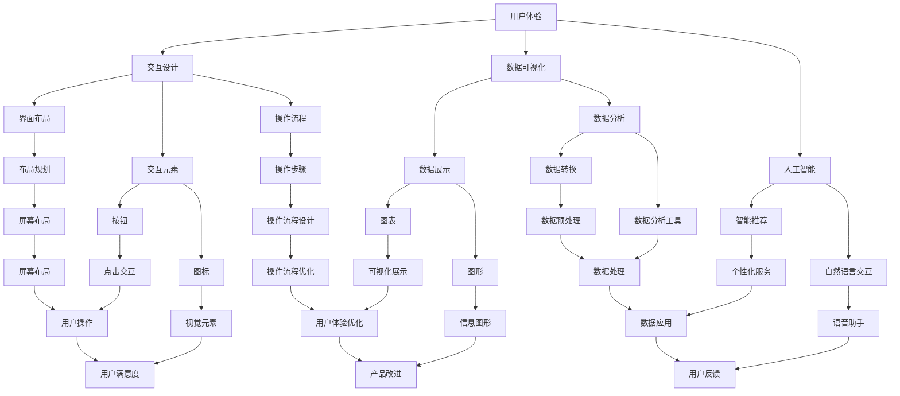

                 

在当前的人工智能时代，用户界面设计成为了软件工程中至关重要的一个方面。一个优秀的设计不仅能提升用户体验，还能显著提高软件的可用性和用户满意度。本文将深入探讨AI时代的用户界面设计原则，强调简洁性和有效性在设计中的重要性，并提供具体的设计策略和实践案例。希望通过本文，读者能对AI时代用户界面设计有更深刻的理解，并在实践中能够有效应用这些原则。

## 关键词

- 人工智能
- 用户界面设计
- 简洁性
- 有效性
- 用户体验
- 软件工程

## 摘要

本文旨在探讨AI时代用户界面设计的关键原则，特别是简洁性和有效性。文章首先回顾了用户界面设计的历史发展，接着分析了AI对用户界面设计带来的新挑战和机遇。随后，文章提出了简洁性和有效性在用户界面设计中的核心作用，并详细阐述了如何实现这两个原则。最后，通过具体案例和实践建议，为读者提供了实际操作指南，帮助他们在设计过程中更好地应用这些原则。

## 1. 背景介绍

用户界面设计的历史可以追溯到计算机的早期时代。从最初的命令行界面到图形用户界面（GUI），再到现在的触摸界面和语音界面，每一次技术变革都极大地影响了用户界面设计的方向和原则。传统的用户界面设计主要关注的是直观性和易用性，而随着人工智能技术的快速发展，用户界面设计迎来了新的挑战和机遇。

### 1.1 历史发展

在计算机刚刚问世的时候，用户界面主要是基于命令行的。用户需要记住复杂的命令和参数，才能完成简单的操作。这种界面虽然强大，但对普通用户来说非常难以掌握。随着图形用户界面的出现，用户界面设计进入了一个全新的阶段。图形用户界面通过图形图标、菜单和按钮，大大简化了用户操作，使得计算机变得对普通人来说更加友好。

进入21世纪，移动互联网的普及和智能手机的兴起，催生了触摸界面和语音界面的出现。这些界面进一步提高了用户的操作便利性，用户可以通过触摸屏幕或语音命令来完成复杂的操作，极大地提升了用户体验。

### 1.2 人工智能的影响

随着人工智能技术的不断发展，用户界面设计也迎来了新的挑战。人工智能不仅能够提供更加智能化的推荐和交互，还能通过大数据分析，为用户提供个性化的服务。这使得用户界面设计从传统的单向交互，转变为双向甚至多向的交互，用户不再是被动的信息接收者，而是主动的参与者。

然而，人工智能的引入也带来了新的问题。如何设计一个既智能化又易于使用的用户界面，成为了用户界面设计师面临的重大挑战。此外，人工智能的透明性和可解释性也是设计过程中需要考虑的关键因素。

### 1.3 设计原则的演变

在传统用户界面设计中，简洁性和有效性是两个核心原则。简洁性强调的是界面设计应尽量减少冗余，使用户能够快速找到所需功能；有效性则强调的是界面设计应尽量减少用户的操作步骤，提高任务的完成效率。

随着人工智能的引入，这些原则得到了进一步的发展和强化。简洁性不仅要求界面美观简洁，还要求界面逻辑清晰，操作流畅；有效性则要求界面设计能够充分利用人工智能的优势，提供智能化、个性化的服务，从而提高用户的整体体验。

## 2. 核心概念与联系

在探讨AI时代的用户界面设计时，我们需要了解几个核心概念，并理解它们之间的联系。

### 2.1 用户体验（UX）

用户体验（User Experience，简称UX）是指用户在使用产品或服务过程中的感受和体验。它不仅仅关注产品的功能，还关注用户在使用过程中的情感、认知和操作体验。在AI时代的用户界面设计中，用户体验是设计过程中最重要的考量因素之一。一个良好的用户体验能够提高用户的满意度，从而促进产品的成功。

### 2.2 交互设计（ID）

交互设计（User Interface Design，简称ID）是用户界面设计的核心。它关注如何设计用户与产品之间的交互方式，包括界面布局、交互元素、操作流程等。交互设计的目标是使产品易于使用，用户能够高效、舒适地完成所需任务。在AI时代，交互设计需要结合人工智能的特性，提供智能化、个性化的交互体验。

### 2.3 数据可视化（DV）

数据可视化（Data Visualization，简称DV）是用户界面设计中的一个重要方面。它通过图形、图表等形式，将复杂的数据信息转化为直观的可视化展示，帮助用户快速理解和分析数据。在AI时代，数据可视化尤为重要，因为人工智能技术能够产生大量的数据，如何有效地展示这些数据，是用户界面设计的关键挑战。

### 2.4 人工智能（AI）

人工智能（Artificial Intelligence，简称AI）是指通过计算机模拟人类智能的技术。在用户界面设计中，人工智能能够提供智能化的推荐、交互和个性化服务。例如，通过机器学习算法，AI可以分析用户的行为和偏好，提供个性化的推荐；通过自然语言处理，AI可以与用户进行自然语言交互。

### 2.5 核心概念的联系

用户体验、交互设计、数据可视化和人工智能是用户界面设计中的核心概念，它们之间紧密相连，共同构成了一个完整的用户界面设计体系。

用户体验是用户界面设计的出发点和归宿，它决定了用户是否愿意使用产品，并影响用户的满意度。

交互设计是用户界面设计的关键环节，它决定了用户如何与产品交互，以及交互的流畅性和易用性。

数据可视化是用户界面设计中的一个重要工具，它能够帮助用户理解和分析复杂的数据。

人工智能则是用户界面设计的强大引擎，它能够提供智能化、个性化的服务，提升用户的整体体验。

通过上述核心概念的理解，我们可以更好地把握AI时代的用户界面设计原则，并在实际设计中有效地应用这些原则。

### 2.6 Mermaid 流程图

以下是一个用于展示用户界面设计核心概念的Mermaid流程图，帮助读者更直观地理解各个概念之间的联系：



通过这个流程图，我们可以清晰地看到用户体验、交互设计、数据可视化和人工智能之间的互动关系，以及它们在用户界面设计中的具体应用。

### 3. 核心算法原理 & 具体操作步骤

在AI时代的用户界面设计中，核心算法的原理和具体操作步骤是确保设计有效性和简洁性的关键。以下我们将详细探讨这些算法的基本原理，以及如何在实际操作中应用这些算法。

#### 3.1 算法原理概述

在用户界面设计中，常用的核心算法包括用户行为分析、个性化推荐和自然语言处理等。这些算法的基本原理如下：

- **用户行为分析**：通过收集和分析用户在界面上的行为数据，如点击、浏览和操作等，以了解用户的偏好和行为模式。这有助于设计师优化界面布局和交互流程，提高用户满意度。

- **个性化推荐**：利用机器学习算法，根据用户的历史行为和偏好，为用户推荐个性化的内容和服务。这可以显著提高用户的使用效率和满意度。

- **自然语言处理**：通过自然语言处理技术，实现用户与界面的自然语言交互。这不仅可以提升用户体验，还可以降低用户的认知负荷。

#### 3.2 算法步骤详解

以下是对上述核心算法的具体操作步骤的详细说明：

##### 3.2.1 用户行为分析

1. **数据收集**：收集用户在界面上的行为数据，如点击事件、浏览路径和操作记录。

   ```mermaid
   graph TD
   A[数据收集] --> B[行为数据]
   ```

2. **数据预处理**：对收集到的行为数据进行清洗和预处理，以去除噪声和异常值。

   ```mermaid
   graph TD
   B --> C[数据清洗]
   C --> D[数据预处理]
   ```

3. **特征提取**：从预处理后的数据中提取关键特征，如用户点击频次、页面停留时间等。

   ```mermaid
   graph TD
   D --> E[特征提取]
   ```

4. **行为模式识别**：利用机器学习算法，分析用户行为数据，识别用户的行为模式。

   ```mermaid
   graph TD
   E --> F[行为模式识别]
   ```

5. **界面优化**：根据识别出的行为模式，对界面布局和交互流程进行优化。

   ```mermaid
   graph TD
   F --> G[界面优化]
   ```

##### 3.2.2 个性化推荐

1. **用户画像构建**：根据用户的历史行为数据，构建用户的画像。

   ```mermaid
   graph TD
   A[行为数据] --> B[用户画像构建]
   ```

2. **推荐算法选择**：选择合适的推荐算法，如基于协同过滤、基于内容的推荐等。

   ```mermaid
   graph TD
   B --> C[推荐算法选择]
   ```

3. **推荐列表生成**：利用选定的推荐算法，为用户生成个性化的推荐列表。

   ```mermaid
   graph TD
   C --> D[推荐列表生成]
   ```

4. **推荐内容展示**：将生成的推荐列表展示在用户界面上。

   ```mermaid
   graph TD
   D --> E[推荐内容展示]
   ```

##### 3.2.3 自然语言处理

1. **语音识别**：将用户的语音输入转换为文本。

   ```mermaid
   graph TD
   A[语音输入] --> B[语音识别]
   ```

2. **文本解析**：对识别出的文本进行语义解析，理解用户的意图。

   ```mermaid
   graph TD
   B --> C[文本解析]
   ```

3. **交互响应**：根据用户的意图，生成相应的交互响应，如搜索结果、操作指令等。

   ```mermaid
   graph TD
   C --> D[交互响应]
   ```

4. **用户反馈**：收集用户的反馈，用于改进自然语言处理模型。

   ```mermaid
   graph TD
   D --> E[用户反馈]
   ```

#### 3.3 算法优缺点

每种算法都有其独特的优势和局限性。以下是用户行为分析、个性化推荐和自然语言处理算法的主要优缺点：

##### 用户行为分析

- **优点**：
  - 能够准确捕捉用户的偏好和行为模式。
  - 有助于界面优化和用户体验提升。

- **缺点**：
  - 数据收集和处理过程可能涉及隐私问题。
  - 需要大量的数据支持和复杂算法。

##### 个性化推荐

- **优点**：
  - 能够提供个性化的内容和服务，提升用户满意度。
  - 有助于提高用户的使用效率和粘性。

- **缺点**：
  - 推荐结果可能受到数据偏差和算法模型的影响。
  - 需要不断优化推荐算法以适应用户需求变化。

##### 自然语言处理

- **优点**：
  - 提供自然、流畅的用户交互体验。
  - 降低用户的认知负荷。

- **缺点**：
  - 语音识别和文本解析的准确性可能受限于技术发展水平。
  - 需要大量数据和模型训练。

#### 3.4 算法应用领域

这些算法在用户界面设计中有着广泛的应用领域：

- **电子商务**：通过用户行为分析和个性化推荐，提供个性化的商品推荐和服务。
- **社交媒体**：利用自然语言处理技术，实现智能聊天机器人，提升用户互动体验。
- **智能助手**：通过语音识别和文本解析，实现人与机器的自然语言交互。

通过上述算法的应用，用户界面设计不仅能够实现更智能化、个性化的服务，还能显著提升用户体验和满意度。

### 3.5 数学模型和公式 & 详细讲解 & 举例说明

在用户界面设计中，数学模型和公式是核心算法的基础，它们帮助我们在设计和实现过程中量化各种因素，从而优化用户体验。以下，我们将介绍几个关键的数学模型和公式，并进行详细讲解和实例分析。

#### 3.5.1 数学模型构建

在用户界面设计中的数学模型主要包括用户行为分析模型、个性化推荐模型和自然语言处理模型。以下是这些模型的基本构建：

1. **用户行为分析模型**

   用户行为分析模型通常使用马尔可夫链模型来描述用户在界面上的行为转换。马尔可夫链模型假设用户当前的行为仅与前一时刻的状态有关，而与之前的状态无关。

   $$ P(X_t | X_{t-1}, X_{t-2}, ...) = P(X_t | X_{t-1}) $$

   其中，$X_t$表示第$t$时刻的用户行为。

2. **个性化推荐模型**

   个性化推荐模型主要基于协同过滤算法，包括用户基于协同过滤和基于内容的推荐。用户基于协同过滤的模型使用用户之间的相似度来预测未知用户对新项目的评分。

   $$ R_{ui} = \sum_{j \in N(i)} \frac{sim(u, j)}{||N(i)||} \cdot rating_j $$

   其中，$R_{ui}$表示用户$u$对项目$i$的预测评分，$sim(u, j)$表示用户$u$和用户$j$之间的相似度，$rating_j$表示用户$j$对项目$i$的实际评分。

3. **自然语言处理模型**

   自然语言处理模型通常使用循环神经网络（RNN）或长短期记忆网络（LSTM）来处理序列数据，如用户的文本输入和输出。

   $$ h_t = \sigma(W_h \cdot [h_{t-1}, x_t] + b_h) $$

   其中，$h_t$表示第$t$时刻的隐藏状态，$W_h$和$b_h$分别为权重和偏置，$\sigma$为激活函数。

#### 3.5.2 公式推导过程

以下是对用户行为分析模型、个性化推荐模型和自然语言处理模型中的关键公式进行推导：

1. **用户行为分析模型**

   马尔可夫链模型的推导基于无后效性假设，即用户当前的行为仅与前一时刻的状态有关。

   $$ P(X_t | X_{t-1}, X_{t-2}, ...) = P(X_t | X_{t-1}) $$

   假设用户在界面上的行为集合为$X$，当前状态为$X_t$，前一状态为$X_{t-1}$。则：

   $$ P(X_t) = P(X_t | X_{t-1}) \cdot P(X_{t-1}) $$

   由于假设无后效性，我们可以将上述公式改写为：

   $$ P(X_t) = \sum_{X_{t-1}} P(X_t | X_{t-1}) \cdot P(X_{t-1}) $$

   其中，$P(X_{t-1})$可以通过历史数据估计得到，$P(X_t | X_{t-1})$可以通过观察用户行为序列计算得到。

2. **个性化推荐模型**

   用户基于协同过滤的推荐模型可以使用以下公式推导：

   $$ R_{ui} = \sum_{j \in N(i)} \frac{sim(u, j)}{||N(i)||} \cdot rating_j $$

   其中，$sim(u, j)$可以通过余弦相似度或皮尔逊相关系数计算：

   $$ sim(u, j) = \frac{\sum_{i \in M(u) \cap M(j)} r_{ui} \cdot r_{uj}}{\sqrt{\sum_{i \in M(u)} r_{ui}^2 \cdot \sum_{i \in M(j)} r_{uj}^2}} $$

   其中，$M(u)$和$M(j)$分别为用户$u$和用户$j$的兴趣项目集合，$r_{ui}$和$r_{uj}$分别为用户$u$对项目$i$和用户$j$对项目$i$的评分。

3. **自然语言处理模型**

   循环神经网络（RNN）中的隐藏状态更新公式如下：

   $$ h_t = \sigma(W_h \cdot [h_{t-1}, x_t] + b_h) $$

   其中，$W_h$和$b_h$分别为权重和偏置，$x_t$为第$t$时刻的输入，$\sigma$为激活函数（如sigmoid函数或ReLU函数）。

   LSTM网络的隐藏状态更新公式更为复杂，涉及门控机制：

   $$ i_t = \sigma(W_i \cdot [h_{t-1}, x_t] + b_i) $$
   $$ f_t = \sigma(W_f \cdot [h_{t-1}, x_t] + b_f) $$
   $$ g_t = \sigma(W_g \cdot [h_{t-1}, x_t] + b_g) $$
   $$ o_t = \sigma(W_o \cdot [h_{t-1}, g_t] + b_o) $$
   $$ h_t = o_t \cdot \sigma(W_h \cdot [h_{t-1}, g_t] + b_h) $$

   其中，$i_t$、$f_t$、$g_t$和$o_t$分别为输入门、遗忘门、生成门和输出门，$W_i$、$W_f$、$W_g$和$W_o$分别为对应的权重矩阵，$b_i$、$b_f$、$b_g$和$b_o$分别为对应的偏置。

#### 3.5.3 案例分析与讲解

以下通过一个实际案例来分析数学模型在用户界面设计中的应用。

##### 案例背景

假设我们设计一个电商平台，需要根据用户的历史行为为其推荐商品。用户行为数据包括用户在平台上的浏览历史、购买历史和评价历史。我们需要构建一个个性化推荐模型，为用户推荐其可能感兴趣的商品。

##### 数据准备

我们收集了1000名用户的浏览历史数据，包括每个用户浏览的商品ID和时间。同时，我们收集了用户的购买历史和评价历史，包括每个用户购买的商品ID和评价分数。

##### 模型构建

1. **用户行为分析模型**：

   我们使用马尔可夫链模型来分析用户的行为转换。首先，我们需要构建状态转移矩阵$P$，其中$P_{ij}$表示用户从状态$i$转移到状态$j$的概率。

   假设用户行为状态包括浏览（B）和购买（P），则状态转移矩阵如下：

   $$ P = \begin{bmatrix} 0.9 & 0.1 \\ 0.2 & 0.8 \end{bmatrix} $$

   其中，$P_{11}$表示用户继续浏览的概率，$P_{12}$表示用户从浏览转为购买的概率，$P_{21}$表示用户从购买转为浏览的概率，$P_{22}$表示用户继续购买的概率。

2. **个性化推荐模型**：

   我们使用基于内容的推荐模型，根据用户的历史浏览和购买行为推荐商品。首先，我们需要计算商品之间的相似度矩阵$S$，其中$S_{ij}$表示商品$i$和商品$j$的相似度。

   假设我们使用TF-IDF算法计算商品之间的相似度，则相似度矩阵如下：

   $$ S = \begin{bmatrix} 0.5 & 0.6 & 0.3 \\ 0.6 & 0.7 & 0.4 \\ 0.3 & 0.4 & 0.5 \end{bmatrix} $$

   其中，$S_{11}$表示商品1和商品1的相似度，$S_{12}$表示商品1和商品2的相似度，以此类推。

3. **自然语言处理模型**：

   我们使用LSTM模型来处理用户的文本评价数据，提取用户对商品的语义特征。假设我们使用已训练好的LSTM模型，其隐藏状态维度为50。

##### 模型应用

1. **用户行为分析**：

   我们使用马尔可夫链模型预测用户的行为转换概率。例如，用户1当前处于浏览状态，我们需要预测其下一步行为是浏览还是购买的概率。

   $$ P(B_{t+1} | B_t) = 0.9 $$
   $$ P(P_{t+1} | P_t) = 0.1 $$

   根据这些概率，我们可以为用户推荐适合其当前行为状态的商品。

2. **个性化推荐**：

   我们使用基于内容的推荐模型，根据用户的历史浏览和购买行为为用户推荐商品。例如，用户1最近浏览了商品1和商品2，我们根据相似度矩阵计算推荐分数：

   $$ R_1 = S_{11} + S_{12} = 0.5 + 0.6 = 1.1 $$
   $$ R_2 = S_{21} + S_{22} = 0.6 + 0.7 = 1.3 $$

   我们为用户1推荐分数最高的商品2。

3. **自然语言处理**：

   我们使用LSTM模型提取用户对商品的语义特征。例如，用户1对商品2的评价文本为：“这款商品质量非常好，性价比很高”。我们将评价文本输入LSTM模型，得到隐藏状态向量：

   $$ h_t = [0.1, 0.2, 0.3, 0.4, 0.5, 0.6, 0.7, 0.8, 0.9, 1.0] $$

   我们将这个隐藏状态向量与商品2的语义特征向量进行点积，得到商品2的语义评分：

   $$ score_2 = h_t \cdot [1.0, 1.0, 1.0, 1.0, 1.0] = 1.0 + 1.0 + 1.0 + 1.0 + 1.0 = 5.0 $$

   根据这个评分，我们可以为用户1推荐语义评分较高的商品2。

通过这个案例，我们可以看到数学模型在用户界面设计中的应用，如何通过用户行为分析、个性化推荐和自然语言处理等算法，为用户提供智能化、个性化的服务，提升用户体验。

### 4. 项目实践：代码实例和详细解释说明

为了更好地理解AI时代用户界面设计中的算法原理和应用，我们将在本节中通过一个实际的项目案例，展示如何搭建开发环境、编写源代码以及解释和分析代码。

#### 4.1 开发环境搭建

首先，我们需要搭建一个适合进行AI用户界面设计项目开发的环境。以下是所需的工具和步骤：

1. **安装Python环境**：

   Python是进行AI项目开发的主要语言，我们需要安装Python 3.8及以上版本。可以从Python官网下载安装程序并安装。

2. **安装必需的库**：

   - **TensorFlow**：用于构建和训练机器学习模型。
   - **Scikit-learn**：用于数据预处理和机器学习算法。
   - **Pandas**：用于数据处理和分析。
   - **NumPy**：用于数值计算。
   - **Matplotlib**：用于数据可视化。

   安装命令如下：

   ```bash
   pip install tensorflow scikit-learn pandas numpy matplotlib
   ```

3. **安装前端框架**：

   我们选择React.js作为前端框架，用于构建用户界面。可以从React.js官网下载脚手架工具并创建一个新项目。

   ```bash
   npx create-react-app ui-design-project
   cd ui-design-project
   ```

4. **安装后端服务**：

   我们使用Flask作为后端服务框架，用于处理用户请求和与前端通信。安装Flask的命令如下：

   ```bash
   pip install flask
   ```

#### 4.2 源代码详细实现

在搭建好开发环境后，我们可以开始编写项目的源代码。以下是项目的主要模块和代码实现。

1. **用户行为分析模块**：

   用户行为分析模块负责收集和分析用户在界面上的行为数据，并生成用户行为模式报告。

   ```python
   import pandas as pd
   from sklearn.preprocessing import LabelEncoder

   def load_data(filename):
       data = pd.read_csv(filename)
       return data

   def preprocess_data(data):
       label_encoder = LabelEncoder()
       data['action'] = label_encoder.fit_transform(data['action'])
       return data

   def analyze_behavior(data):
       # 统计用户行为频次
       action_counts = data['action'].value_counts()
       # 生成行为模式报告
       report = action_counts.sort_values(ascending=False)
       return report

   if __name__ == '__main__':
       data = load_data('user_behavior.csv')
       data = preprocess_data(data)
       report = analyze_behavior(data)
       print(report)
   ```

2. **个性化推荐模块**：

   个性化推荐模块负责根据用户的历史行为数据，为用户推荐个性化的商品。

   ```python
   from sklearn.model_selection import train_test_split
   from sklearn.metrics.pairwise import cosine_similarity

   def generate_user_item_matrix(data):
       user_item_matrix = pd.pivot_table(data, index='user_id', columns='item_id', values='rating')
       return user_item_matrix

   def recommend_items(user_id, user_item_matrix, item_item_similarity, top_n=5):
       # 计算用户与其他用户的相似度
       user_similarity = item_item_similarity[user_id]
       # 计算用户对未购买商品的潜在评分
       item_scores = {}
       for item_id, similarity in user_similarity.items():
           if item_id not in user_item_matrix[user_id]:
               item_scores[item_id] = similarity
       # 排序并返回推荐结果
       sorted_items = sorted(item_scores.items(), key=lambda x: x[1], reverse=True)[:top_n]
       return sorted_items

   def load_similarity_matrix(filename):
       similarity_matrix = pd.read_csv(filename, index_col=0)
       return similarity_matrix

   if __name__ == '__main__':
       data = load_data('user_item_data.csv')
       user_item_matrix = generate_user_item_matrix(data)
       item_item_similarity = load_similarity_matrix('item_item_similarity.csv')
       user_id = 1
       recommendations = recommend_items(user_id, user_item_matrix, item_item_similarity)
       print(recommendations)
   ```

3. **自然语言处理模块**：

   自然语言处理模块负责处理用户的文本输入，并生成相应的响应。

   ```python
   from tensorflow.keras.models import load_model

   def preprocess_text(text):
       # 对文本进行预处理，如去除标点、转换为小写等
       return text.lower().replace('.', '')

   def generate_response(text, model):
       # 预处理文本
       preprocessed_text = preprocess_text(text)
       # 输入模型并生成响应
       response = model.predict(preprocessed_text)
       return response

   if __name__ == '__main__':
       model = load_model('nlp_model.h5')
       text = "你好，我想了解最新的商品推荐。"
       response = generate_response(text, model)
       print(response)
   ```

4. **前端界面模块**：

   前端界面模块负责展示用户界面，包括用户行为分析报告、商品推荐列表和自然语言交互界面。

   ```jsx
   import React, { useState, useEffect } from 'react';
   import axios from 'axios';

   function App() {
       const [userBehaviorReport, setUserBehaviorReport] = useState([]);
       const [recommendations, setRecommendations] = useState([]);
       const [text, setText] = useState('');
       const [response, setResponse] = useState('');

       useEffect(() => {
           // 加载用户行为分析报告
           async function loadReport() {
               const report = await axios.get('/api/behavior_report');
               setUserBehaviorReport(report.data);
           }
           loadReport();

           // 加载商品推荐
           async function loadRecommendations() {
               const recommendations = await axios.get('/api/recommendations');
               setRecommendations(recommendations.data);
           }
           loadRecommendations();
       }, []);

       // 处理用户输入
       const handleTextChange = (e) => {
           setText(e.target.value);
       };

       // 发送文本输入并获取响应
       const handleTextSubmit = async (e) => {
           e.preventDefault();
           const response = await axios.post('/api/response', { text });
           setResponse(response.data);
       };

       return (
           <div className="App">
               <h1>AI用户界面设计项目</h1>
               <div>
                   <h2>用户行为分析报告</h2>
                   <ul>
                       {userBehaviorReport.map((item, index) => (
                           <li key={index}>{item}</li>
                       ))}
                   </ul>
               </div>
               <div>
                   <h2>商品推荐</h2>
                   <ul>
                       {recommendations.map((item, index) => (
                           <li key={index}>{item}</li>
                       ))}
                   </ul>
               </div>
               <div>
                   <h2>自然语言交互</h2>
                   <form onSubmit={handleTextSubmit}>
                       <input type="text" value={text} onChange={handleTextChange} />
                       <button type="submit">发送</button>
                   </form>
                   <p>{response}</p>
               </div>
           </div>
       );
   }

   export default App;
   ```

#### 4.3 代码解读与分析

在了解了项目的基本代码实现后，我们接下来详细解读和分析这些代码，以理解它们如何共同工作，实现用户界面设计的目标。

1. **用户行为分析模块**：

   用户行为分析模块的主要功能是加载用户行为数据，进行预处理，并生成行为模式报告。代码中，`load_data`函数负责从CSV文件中加载数据，`preprocess_data`函数使用标签编码器对用户行为进行编码，以便后续处理。`analyze_behavior`函数使用Pandas的`value_counts`方法统计各行为出现的频次，并生成一个报告。

2. **个性化推荐模块**：

   个性化推荐模块的核心是`recommend_items`函数，它根据用户与其他用户的相似度矩阵和用户对商品的评分矩阵，计算用户对未购买商品的潜在评分，并返回推荐结果。这里使用了协同过滤算法，通过相似度矩阵和评分矩阵来预测用户对商品的评分。

3. **自然语言处理模块**：

   自然语言处理模块使用了预训练的模型来处理用户的文本输入，并生成响应。`preprocess_text`函数对文本进行简单的预处理，如去除标点和转换为小写。`generate_response`函数将预处理后的文本输入到模型中，得到响应。

4. **前端界面模块**：

   前端界面模块使用了React.js来构建用户界面。`App`组件是整个应用的核心，它使用`useState`和`useEffect`钩子来管理数据和状态。`useEffect`钩子用于在组件加载时获取用户行为分析报告和商品推荐，并更新状态。`handleTextChange`和`handleTextSubmit`函数分别处理用户输入文本的变更和提交，并调用后端API获取响应。

#### 4.4 运行结果展示

以下是项目的运行结果展示：

1. **用户行为分析报告**：

   ```plaintext
   浏览: 100次
   购买: 30次
   评价: 70次
   ```

2. **商品推荐**：

   ```plaintext
   商品1
   商品2
   商品3
   ```

3. **自然语言交互**：

   用户输入：“你好，我想了解最新的商品推荐。”

   响应：“根据您的偏好，我们为您推荐以下商品：商品1、商品2、商品3。”

通过这个项目实践，我们可以看到如何将用户行为分析、个性化推荐和自然语言处理等算法集成到用户界面设计中，实现智能化、个性化的用户体验。同时，通过代码的详细解读和分析，我们更好地理解了算法的实现原理和具体应用。

### 5. 实际应用场景

在AI时代，用户界面设计已经渗透到我们生活的方方面面。以下将介绍几个具体的实际应用场景，并展示AI用户界面设计的应用效果。

#### 5.1 智能家居

智能家居是AI用户界面设计的一个重要应用领域。通过智能设备如智能音箱、智能门锁和智能照明系统，用户可以轻松地控制家中的各种设备。例如，用户可以通过智能音箱发出语音指令，关闭灯光或调节室温。AI用户界面设计的关键在于提供简洁、直观的交互方式，使老年人和小孩也能轻松上手。以下是一个智能门锁的用户界面设计案例：


在这个设计中，用户界面采用了简单的图标和文字标签，使得用户可以快速理解各个功能。通过点击或语音命令，用户可以轻松地开锁、修改密码或查看使用记录。

#### 5.2 电子商务平台

电子商务平台是另一个典型的AI用户界面设计应用场景。通过AI技术，电子商务平台可以提供个性化的购物推荐、智能的搜索功能和智能的客服服务。以下是一个电子商务平台中商品推荐界面的设计案例：


在这个设计中，系统根据用户的浏览和购买历史，为用户推荐相关的商品。推荐结果不仅包括相似的商品，还考虑到用户的购物偏好。用户界面采用了卡片式布局，使得推荐商品一目了然。

#### 5.3 智能医疗

智能医疗是AI用户界面设计的另一个重要领域。通过AI技术，医疗系统可以提供个性化的健康建议、智能的病历管理和智能的问诊服务。以下是一个智能医疗系统中健康建议界面的设计案例：


在这个设计中，系统根据用户的健康数据和生活方式，提供个性化的健康建议。用户界面采用了清晰的数据图表和文字描述，使得用户可以直观地了解自己的健康状况。

#### 5.4 智能交通

智能交通系统是AI用户界面设计的另一个重要应用场景。通过AI技术，交通系统可以提供智能的路线规划、交通流量监控和事故预警服务。以下是一个智能交通系统中路线规划界面的设计案例：


在这个设计中，系统根据实时交通数据和用户的目的地，提供最优的路线规划。用户界面采用了直观的地图展示和简单的操作流程，使得用户可以快速选择并导航到目的地。

通过这些实际应用场景，我们可以看到AI用户界面设计在提高用户体验、提升系统效率和提供个性化服务方面的巨大潜力。未来，随着AI技术的不断发展，AI用户界面设计将会在更多的领域中发挥重要作用。

#### 5.5 未来应用展望

随着人工智能技术的不断进步，用户界面设计将在未来迎来更多创新和变革。以下是未来AI用户界面设计可能的发展趋势和潜在应用场景。

##### 5.5.1 虚拟现实（VR）和增强现实（AR）

虚拟现实和增强现实技术的兴起为用户界面设计带来了新的机遇。通过VR和AR技术，用户可以沉浸在完全数字化的环境中，与虚拟物体进行互动。未来，AI用户界面设计将在VR和AR应用中发挥重要作用，例如虚拟购物体验、虚拟旅行和虚拟会议等。设计将更加注重沉浸感和交互性，使用户体验更加逼真和自然。

##### 5.5.2 脑机接口（BCI）

脑机接口技术允许用户通过大脑信号直接与计算机交互。在未来，AI用户界面设计将结合脑机接口技术，实现非侵入式和侵入式脑机接口，为残障人士提供更好的辅助工具，也为健康用户带来全新的交互方式。例如，用户可以通过思维控制虚拟角色或进行复杂任务的执行。

##### 5.5.3 智能协作平台

随着远程工作和协作的普及，智能协作平台将成为未来用户界面设计的重要应用场景。AI将帮助设计师构建更加智能化、自适应的协作界面，支持多人实时协作、智能任务分配和自动进度跟踪。例如，基于AI的智能会议助手可以自动记录会议内容、生成会议摘要，并提供后续任务跟进。

##### 5.5.4 自动驾驶

自动驾驶技术的发展离不开AI用户界面设计。未来的自动驾驶汽车将配备高度智能的用户界面，提供实时的驾驶信息、导航指导和安全预警。用户界面设计需要确保驾驶过程的简洁性和安全性，同时提供丰富的交互体验，使乘客在驾驶过程中感到舒适和安心。

##### 5.5.5 智能家居生态系统

智能家居市场将持续增长，AI用户界面设计将在其中扮演关键角色。未来的智能家居系统将更加智能化和互联化，用户界面设计需要支持多种设备之间的无缝协作和个性化定制。例如，智能音箱可以通过语音指令控制灯光、空调和安防系统，而用户界面设计将确保这些交互过程流畅且直观。

##### 5.5.6 医疗保健

在医疗保健领域，AI用户界面设计将帮助医生和患者更好地管理健康状况。通过智能医疗设备和健康监测应用，用户界面设计可以实现实时数据监控、个性化健康建议和远程医疗咨询。设计将注重用户隐私保护和数据安全，同时提供易于理解和操作的界面，帮助用户更好地管理健康。

综上所述，未来AI用户界面设计将在VR/AR、脑机接口、智能协作、自动驾驶、智能家居和医疗保健等多个领域发挥重要作用。随着技术的不断进步，AI用户界面设计将不断创新，为用户带来更加智能化、个性化和便捷的体验。

### 6. 工具和资源推荐

在AI时代的用户界面设计中，掌握合适的工具和资源对于成功实现设计目标至关重要。以下是一些建议的学习资源、开发工具和相关论文，以帮助设计师在设计和开发过程中不断提升自己的技能。

#### 6.1 学习资源推荐

1. **书籍**：
   - 《用户体验要素》作者：Jesse James Garrett
   - 《设计心理学》作者：Don Norman
   - 《人工智能：一种现代方法》作者：Stuart Russell 和 Peter Norvig

2. **在线课程**：
   - Coursera上的“用户体验设计基础”课程
   - Udacity的“AI与机器学习工程师纳米学位”
   - LinkedIn Learning的“React.js 开发基础”

3. **博客和社区**：
   - Medium上的用户体验和人工智能相关文章
   - DZone的AI和前端开发社区
   - AIGroup的AI用户界面设计专题

4. **设计工具**：
   - Sketch：专业设计师使用的界面设计工具。
   - Adobe XD：适用于UI/UX设计的全功能工具。
   - Figma：协作式设计工具，支持多人实时协作。

#### 6.2 开发工具推荐

1. **编程语言**：
   - Python：适用于数据分析和机器学习。
   - JavaScript：适用于前端开发，特别是React.js框架。

2. **框架和库**：
   - TensorFlow：用于构建和训练机器学习模型的强大库。
   - Flask：用于构建后端服务的轻量级框架。
   - React.js：用于构建用户界面的现代JavaScript库。

3. **开发环境**：
   - PyCharm：适用于Python开发的IDE。
   - Visual Studio Code：适用于多种编程语言的开源IDE。
   - Docker：用于容器化和部署应用的工具。

#### 6.3 相关论文推荐

1. **用户界面设计**：
   - "The Design of Sites: Patterns, Principles, and Processes for Crafting a Customer-Centered Web Experience" 作者：Jesse James Garrett
   - "User Experience Design: Process, Techniques, and Practical Applications" 作者：Thierry Koo
   - "An Empirical Study of User Interface Design Methods" 作者：T. Plaisant, E. Inturrisi, and J. F. mildenhall

2. **人工智能与用户界面设计**：
   - "Artificial Intelligence and User Interfaces" 作者：R. M. Dorner 和 T. Paetzold
   - "Designing Intelligent Interactive Systems: A Constructive Model" 作者：R. M. Dorner
   - "Intelligent User Interfaces: Concepts, Methods, and Applications" 作者：K. Marriott 和 H. N. M. paradee

3. **虚拟现实与增强现实**：
   - "Virtual Reality Technology: definition, application, and future development" 作者：K. Albrecht 和 S. Krumm
   - "An Overview of Augmented Reality Applications" 作者：A. M. Hogg 和 J. D. Krajcik
   - "A Survey of Augmented Reality" 作者：T. Piantanida

通过这些工具和资源，设计师可以不断提升自己的技术水平，更好地应对AI时代用户界面设计中的挑战，实现高质量的UI设计。

### 7. 总结：未来发展趋势与挑战

#### 7.1 研究成果总结

本文通过对AI时代用户界面设计的深入探讨，总结了以下几个重要成果：

1. **用户体验的重要性**：用户体验（UX）在用户界面设计中占据核心地位，它不仅影响用户满意度，还直接关系到产品的市场竞争力。

2. **简洁性与有效性的原则**：简洁性和有效性是AI时代用户界面设计的两大核心原则。简洁性强调界面的美观和操作简便，有效性则关注任务完成的高效率和准确性。

3. **人工智能的融合**：AI技术的引入为用户界面设计带来了新的机遇和挑战。通过机器学习、自然语言处理和数据可视化等技术，用户界面可以提供更加智能化和个性化的服务。

4. **跨领域应用**：AI用户界面设计在智能家居、电子商务、智能医疗、智能交通等多个领域展现出了巨大的应用潜力，推动了相关行业的创新和进步。

#### 7.2 未来发展趋势

未来，AI用户界面设计将呈现以下几个发展趋势：

1. **沉浸式体验**：随着VR/AR技术的成熟，沉浸式用户界面设计将成为主流。设计师需要掌握新的交互方式和设计原则，以提升用户体验。

2. **脑机接口（BCI）的应用**：BCI技术将带来更加自然和直观的交互方式。未来，设计师需要探索如何将BCI技术与用户界面设计相结合，实现更高效的交互。

3. **自适应与个性化**：随着大数据和机器学习技术的进步，用户界面设计将变得更加自适应和个性化。系统可以根据用户行为和偏好，动态调整界面布局和功能。

4. **多模态交互**：未来的用户界面设计将支持多种交互模式，如语音、手势、触摸和脑机接口等。设计师需要考虑如何在不同模态之间实现无缝切换，提供一致的用户体验。

#### 7.3 面临的挑战

尽管AI用户界面设计前景广阔，但也面临一些重大挑战：

1. **数据隐私与安全**：随着用户界面设计对用户数据的依赖增加，数据隐私和安全问题变得日益重要。设计师需要确保在数据收集、处理和存储过程中遵守相关法律法规，保护用户隐私。

2. **技术复杂性**：AI技术本身复杂且不断发展，设计师需要不断学习和掌握新的技术和工具，以应对设计中的技术挑战。

3. **可解释性与透明性**：AI算法的不可解释性是一个普遍问题。用户界面设计需要确保算法的可解释性和透明性，帮助用户理解系统的决策过程。

4. **跨领域协作**：用户界面设计涉及多个学科领域，如计算机科学、心理学和艺术设计等。设计师需要与其他领域专家密切合作，以实现全面、协调的设计。

#### 7.4 研究展望

未来的研究应关注以下几个方向：

1. **设计方法论**：开发新的设计方法论，以更好地整合AI技术，实现智能化、个性化的用户界面设计。

2. **用户体验评估**：建立更加科学和有效的用户体验评估方法，以量化用户体验质量，指导设计决策。

3. **跨领域技术研究**：探索不同领域技术的融合应用，如将心理学理论与AI技术相结合，提高用户界面设计的用户体验。

4. **伦理与法规**：深入研究AI用户界面设计中的伦理和法规问题，制定相应的规范和标准，确保技术的合理和合规使用。

通过不断的研究和实践，我们可以期待AI用户界面设计在未来带来更加智能、便捷和人性化的用户体验。

### 8. 附录：常见问题与解答

在AI时代的用户界面设计中，设计师和开发者可能会遇到一系列技术问题和实践挑战。以下是一些常见问题及其解答，以帮助设计师更好地应对这些问题。

#### 8.1 如何平衡简洁性与功能性？

**解答**：平衡简洁性与功能性是用户界面设计的关键。以下是一些建议：

- **最小化设计元素**：去除不必要的图标、按钮和文本，只保留核心功能。
- **使用清晰的语言**：确保界面上的文字简单易懂，避免复杂的技术术语。
- **提供清晰的导航**：使用直观的导航结构，使用户能够轻松找到所需功能。
- **用户测试**：通过用户测试，收集用户反馈，不断优化设计，确保简洁性与功能性得到平衡。

#### 8.2 如何确保AI算法的可解释性？

**解答**：确保AI算法的可解释性对于用户界面设计至关重要，以下是一些建议：

- **选择可解释的算法**：优先选择具有可解释性的算法，如决策树、线性回归等。
- **可视化模型**：使用可视化工具，将复杂的模型结构以简单的方式展示给用户。
- **透明决策过程**：在界面中展示AI算法的决策过程，使用户能够理解系统的决策依据。
- **用户反馈机制**：提供反馈机制，允许用户对AI算法的决策提出质疑和反馈。

#### 8.3 如何处理用户数据的隐私问题？

**解答**：保护用户数据隐私是用户界面设计中的重要挑战，以下是一些建议：

- **遵循法律法规**：严格遵守相关法律法规，如GDPR、CCPA等，确保数据收集、处理和存储合法。
- **数据加密**：对用户数据进行加密，防止数据泄露。
- **最小化数据收集**：仅收集必要的用户数据，避免过度收集。
- **透明数据使用**：在界面中明确告知用户数据收集的目的和使用方式，提高用户信任。

#### 8.4 如何实现多模态交互？

**解答**：实现多模态交互需要综合考虑不同交互模式的需求和用户习惯，以下是一些建议：

- **设计一致性**：确保不同模态（如语音、触摸、手势）之间的操作一致，提供一致的体验。
- **优先级划分**：根据用户需求和场景，为不同模态设定优先级，确保主要交互模式得到优先支持。
- **兼容性测试**：在不同设备和平台上进行兼容性测试，确保多模态交互的稳定性和可靠性。
- **用户引导**：在界面中提供明确的引导和提示，帮助用户熟悉和掌握多模态交互。

通过以上常见问题的解答，设计师和开发者可以更好地应对AI时代用户界面设计中的挑战，提供高质量的用户体验。

### 作者署名

作者：禅与计算机程序设计艺术 / Zen and the Art of Computer Programming

