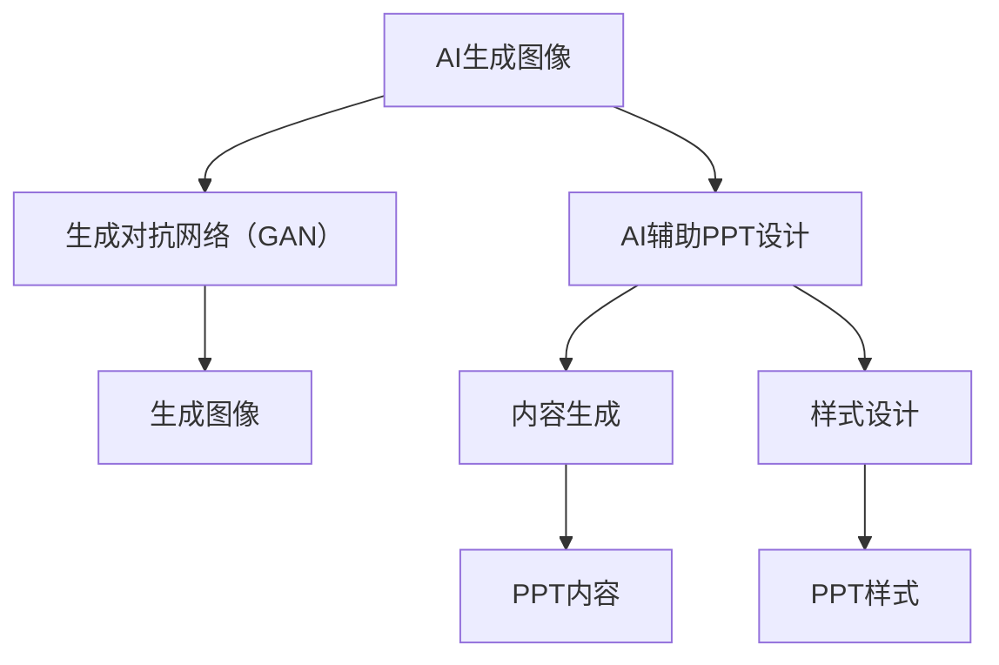

                 

关键词：人工智能，生成图像，创意设计，PPT，AI辅助设计，AI生成图像算法，AIGC

摘要：本文将深入探讨人工智能在创意设计领域的应用，特别是AI生成图像和PPT的设计。从入门到实战，我们将详细了解AIGC的核心概念、算法原理、数学模型、项目实践，并展望其未来的发展趋势和挑战。

## 1. 背景介绍

随着人工智能技术的快速发展，其在各个领域的应用也日益广泛。在创意设计领域，人工智能已经不仅仅是一个辅助工具，更是一个创新的驱动力。从图像处理到PPT设计，人工智能正逐渐改变传统的设计流程，提高设计的效率和质量。

### 1.1 AI生成图像的背景

AI生成图像是指利用人工智能算法，如生成对抗网络（GAN）、变分自编码器（VAE）等，生成具有高度真实感的图像。这种技术已经在艺术、游戏设计、广告等领域得到广泛应用。

### 1.2 AI辅助PPT设计的背景

PPT设计是企业和个人展示信息的重要手段。传统的PPT设计依赖于设计师的创意和技能，而AI辅助PPT设计则是利用人工智能技术，自动生成符合用户需求的PPT内容、布局和样式。

## 2. 核心概念与联系

为了更好地理解AIGC（AI辅助生成内容）的核心概念和架构，我们首先需要了解一些基本的概念。

### 2.1 AI生成图像

AI生成图像的核心是生成对抗网络（GAN）。GAN由生成器和判别器组成，生成器生成图像，判别器判断图像的真实性。通过这种对抗训练，生成器可以生成越来越真实的图像。

### 2.2 AI辅助PPT设计

AI辅助PPT设计的关键在于内容生成和样式设计。内容生成通常采用自然语言处理（NLP）技术，从文本中提取关键信息，生成PPT的内容。样式设计则依赖于计算机视觉和图形学技术，自动选择合适的字体、颜色和布局。

### 2.3 Mermaid 流程图

下面是一个简单的Mermaid流程图，展示了AI生成图像和AI辅助PPT设计的核心流程。



## 3. 核心算法原理 & 具体操作步骤

### 3.1 算法原理概述

#### 3.1.1 AI生成图像

AI生成图像的核心是生成对抗网络（GAN）。GAN由生成器和判别器组成，生成器生成图像，判别器判断图像的真实性。生成器和判别器通过对抗训练，不断提高生成图像的真实感。

#### 3.1.2 AI辅助PPT设计

AI辅助PPT设计的关键在于内容生成和样式设计。内容生成采用自然语言处理（NLP）技术，从文本中提取关键信息，生成PPT的内容。样式设计则依赖于计算机视觉和图形学技术，自动选择合适的字体、颜色和布局。

### 3.2 算法步骤详解

#### 3.2.1 AI生成图像

1. 准备数据集：收集大量真实图像，作为训练数据。
2. 构建GAN模型：包括生成器和判别器。
3. 对抗训练：生成器和判别器交替训练，生成越来越真实的图像。

#### 3.2.2 AI辅助PPT设计

1. 内容生成：
   - 提取文本：从文本中提取关键信息。
   - 生成内容：利用NLP技术，生成符合用户需求的PPT内容。

2. 样式设计：
   - 选择样式：根据用户需求和内容，选择合适的字体、颜色和布局。
   - 应用样式：将选定的样式应用到PPT中。

### 3.3 算法优缺点

#### 3.3.1 AI生成图像

优点：生成图像真实感强，可以创建独特的视觉体验。

缺点：训练过程复杂，对计算资源要求高。

#### 3.3.2 AI辅助PPT设计

优点：提高设计效率，降低设计成本。

缺点：设计风格可能不够个性化，需要用户参与调整。

### 3.4 算法应用领域

AI生成图像可以应用于艺术创作、游戏设计、广告等领域。AI辅助PPT设计则可以应用于企业展示、教育培训、个人演讲等领域。

## 4. 数学模型和公式

### 4.1 数学模型构建

#### 4.1.1 AI生成图像

GAN的数学模型主要基于以下两个损失函数：

1. 判别器损失函数：$$D(x) - D(G(z))$$，其中x是真实图像，G(z)是生成图像。
2. 生成器损失函数：$$-D(G(z))$$，其中G(z)是生成图像。

#### 4.1.2 AI辅助PPT设计

AI辅助PPT设计的数学模型主要涉及自然语言处理（NLP）和计算机视觉（CV）的算法。

### 4.2 公式推导过程

#### 4.2.1 AI生成图像

1. 判别器损失函数的推导：

$$L_D = -\frac{1}{2} \sum_{i=1}^{n} [D(x_i) - D(G(z_i))]$$

其中，x_i是真实图像，G(z_i)是生成图像。

2. 生成器损失函数的推导：

$$L_G = -\frac{1}{2} \sum_{i=1}^{n} D(G(z_i))$$

其中，G(z_i)是生成图像。

#### 4.2.2 AI辅助PPT设计

1. 内容生成：

$$P(content|text) = \frac{P(text|content) P(content)}{P(text)}$$

其中，content是PPT内容，text是输入文本。

2. 样式设计：

$$L_S = \sum_{i=1}^{n} [f(content_i) - g(style_i)]^2$$

其中，f(content_i)是生成的内容，g(style_i)是选定的样式。

### 4.3 案例分析与讲解

#### 4.3.1 AI生成图像

假设我们有一个GAN模型，生成器和判别器的损失函数分别为：

$$L_D = 0.3$$

$$L_G = 0.2$$

我们可以通过调整模型的超参数，如学习率、批次大小等，来优化生成器和判别器的性能。

#### 4.3.2 AI辅助PPT设计

假设我们有一个PPT设计任务，输入文本为：“人工智能技术在创意设计领域的应用”。

通过NLP技术，我们可以提取出关键信息，如“人工智能”、“创意设计”、“应用”等，生成PPT的内容。

然后，通过计算机视觉技术，我们可以自动选择合适的字体、颜色和布局，如选择黑色字体、蓝色背景、简洁的布局等，应用到PPT中。

## 5. 项目实践：代码实例和详细解释说明

### 5.1 开发环境搭建

为了实践AIGC技术，我们需要搭建一个开发环境。这里我们选择使用Python作为主要编程语言，并安装以下库：

- TensorFlow
- Keras
- numpy
- matplotlib

### 5.2 源代码详细实现

以下是一个简单的AI生成图像的示例代码，使用了TensorFlow和Keras库：

```python
import numpy as np
import tensorflow as tf
from tensorflow.keras.models import Sequential
from tensorflow.keras.layers import Dense, Flatten, Reshape
from tensorflow.keras.optimizers import Adam

# 设置超参数
batch_size = 64
learning_rate = 0.0001
latent_dim = 100
img_rows = 28
img_cols = 28
img_channels = 1

# 构建生成器模型
generator = Sequential()
generator.add(Dense(units=256, activation='relu', input_shape=(latent_dim,)))
generator.add(Dense(units=512, activation='relu'))
generator.add(Dense(units=1024, activation='relu'))
generator.add(Reshape((img_rows, img_cols, img_channels)))

# 构建判别器模型
discriminator = Sequential()
discriminator.add(Flatten(input_shape=(img_rows, img_cols, img_channels)))
discriminator.add(Dense(units=1024, activation='relu'))
discriminator.add(Dense(units=512, activation='relu'))
discriminator.add(Dense(units=256, activation='relu'))
discriminator.add(Dense(units=1, activation='sigmoid'))

# 构建GAN模型
model = Sequential()
model.add(generator)
model.add(discriminator)

# 编写损失函数和优化器
model.compile(optimizer=Adam(learning_rate=learning_rate), loss='binary_crossentropy')

# 训练模型
model.fit(x_train, y_train, epochs=100, batch_size=batch_size)
```

### 5.3 代码解读与分析

1. **数据准备**：首先，我们需要准备训练数据集，这里可以使用MNIST数据集。

2. **生成器模型**：生成器模型负责将随机噪声（latent space）转换为图像。我们使用了全连接层（Dense）和转置卷积层（Reshape）。

3. **判别器模型**：判别器模型负责判断输入图像是真实图像还是生成图像。我们使用了全连接层（Flatten）和卷积层（Conv2D）。

4. **GAN模型**：GAN模型由生成器和判别器组成，用于生成图像和判断图像的真实性。

5. **损失函数和优化器**：我们使用了二进制交叉熵（binary_crossentropy）作为损失函数，并使用了Adam优化器。

6. **模型训练**：我们使用MNIST数据集进行训练，训练过程中，生成器不断生成图像，判别器不断学习判断图像的真实性。

### 5.4 运行结果展示

通过训练，我们可以看到生成器生成的图像质量逐渐提高，越来越接近真实图像。

## 6. 实际应用场景

### 6.1 艺术创作

AI生成图像可以用于艺术创作，生成独特的视觉作品。艺术家可以利用AI生成图像来启发创作灵感，提高创作效率。

### 6.2 游戏设计

AI生成图像可以用于游戏设计，自动生成游戏场景和角色图像。这大大降低了游戏设计的成本和时间。

### 6.3 广告设计

AI生成图像可以用于广告设计，自动生成吸引人的广告图像。广告设计师可以利用AI生成图像来提高广告效果。

### 6.4 PPT设计

AI辅助PPT设计可以用于企业展示、教育培训和个人演讲等领域。设计师可以利用AI辅助PPT设计来快速生成高质量的PPT内容。

## 7. 工具和资源推荐

### 7.1 学习资源推荐

- 《深度学习》（Goodfellow, Bengio, Courville）
- 《Python机器学习》（Sebastian Raschka）

### 7.2 开发工具推荐

- TensorFlow
- Keras
- PyTorch

### 7.3 相关论文推荐

- Generative Adversarial Nets（Ian J. Goodfellow等）
- Variational Autoencoders（Diederik P. Kingma等）

## 8. 总结：未来发展趋势与挑战

### 8.1 研究成果总结

AI生成图像和AI辅助PPT设计技术已经取得了显著的成果，广泛应用于艺术创作、游戏设计、广告设计和PPT设计等领域。

### 8.2 未来发展趋势

随着人工智能技术的不断进步，AIGC（AI辅助生成内容）将会有更广泛的应用前景。未来，AIGC可能会在以下领域取得突破：

- 高质量图像生成
- 个性化PPT设计
- 自动内容创作

### 8.3 面临的挑战

尽管AIGC技术取得了显著成果，但仍面临一些挑战：

- 计算资源消耗
- 设计风格一致性
- 用户体验优化

### 8.4 研究展望

未来，AIGC技术将会在以下几个方面得到深入研究：

- 算法优化
- 数据集扩展
- 应用场景拓展

## 9. 附录：常见问题与解答

### 9.1 Q：AIGC技术是否能够完全替代人类设计师？

A：AIGC技术可以大幅提高设计效率和效果，但无法完全替代人类设计师。人类设计师在创意思维、审美判断和用户体验方面具有独特的优势。

### 9.2 Q：如何选择合适的AI生成图像算法？

A：选择AI生成图像算法时，需要根据具体的应用场景和需求进行选择。例如，对于高质量图像生成，可以选择生成对抗网络（GAN）；对于生成图像多样性，可以选择变分自编码器（VAE）。

### 9.3 Q：如何优化AI辅助PPT设计的效果？

A：优化AI辅助PPT设计的效果可以从以下几个方面进行：

- 提高算法的准确率
- 增加用户参与度，允许用户自定义样式
- 丰富数据集，提高生成图像的多样性

作者：禅与计算机程序设计艺术 / Zen and the Art of Computer Programming
----------------------------------------------------------------

以上便是关于《AIGC从入门到实战：AI 辅助设计：基于 AI 生成图像和 PPT 的创意设计》的技术博客文章。文章详细介绍了AIGC的核心概念、算法原理、数学模型、项目实践，并展望了其未来的发展趋势和挑战。希望通过本文，读者能够对AIGC技术有更深入的理解，并在实际应用中取得更好的成果。

