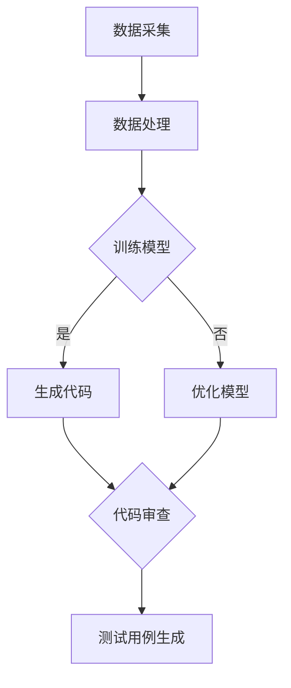

                 

关键词：人工智能生成内容（AIGC），ChatGPT，程序员，代码编写，算法设计，效率提升，技术博客。

## 摘要

本文将探讨如何利用人工智能生成内容（AIGC）技术，特别是ChatGPT模型，来提升程序员在编写代码和设计算法时的效率。我们将从背景介绍、核心概念、算法原理、数学模型、项目实践、应用场景、工具推荐以及未来展望等方面展开讨论，旨在为读者提供全面的技术指南和实践经验。

## 1. 背景介绍

随着人工智能技术的飞速发展，自然语言处理（NLP）和生成模型（如GPT）已经成为计算机科学领域的热点话题。ChatGPT作为OpenAI推出的新一代语言模型，以其强大的文本生成能力和智能交互功能，受到了广泛关注。然而，如何将ChatGPT应用于程序员的工作中，提高他们的代码编写和算法设计效率，仍然是一个值得深入研究的课题。

近年来，许多研究机构和公司开始关注人工智能在软件开发中的应用，例如代码自动生成、代码审查、测试用例生成等。然而，这些研究大多集中在特定领域，缺乏系统性。本文旨在填补这一空白，从理论到实践全面探讨AIGC技术在程序员工作中的应用。

## 2. 核心概念与联系

### 2.1 AIGC技术原理

人工智能生成内容（AIGC，Artificial Intelligence Generated Content）是一种利用人工智能技术生成内容的方法。AIGC技术主要包括以下三个方面：

1. 数据采集与处理：通过大规模数据集的采集和预处理，为模型训练提供高质量的数据资源。
2. 模型训练与优化：利用深度学习技术，对生成模型进行训练和优化，提高其生成内容的准确性和多样性。
3. 内容生成与应用：根据用户需求，利用训练好的模型生成符合要求的内容，并应用于实际场景。

### 2.2 ChatGPT模型架构

ChatGPT是基于GPT-3模型的改进版本，其架构主要包括以下几个部分：

1. 编码器（Encoder）：将输入的文本序列转换为固定长度的向量表示。
2. 解码器（Decoder）：根据编码器生成的向量表示，逐个生成文本序列中的单词或字符。
3. 前馈神经网络（Feedforward Neural Network）：用于对输入数据进行编码和解码。

### 2.3 Mermaid流程图

以下是一个简单的Mermaid流程图，用于展示AIGC技术在程序员工作中的应用流程：



## 3. 核心算法原理 & 具体操作步骤

### 3.1 算法原理概述

ChatGPT模型通过自注意力机制（Self-Attention）和前馈神经网络（Feedforward Neural Network）对输入文本进行编码和解码，从而实现文本生成。具体来说，算法原理可以分为以下三个步骤：

1. 编码器将输入文本转换为固定长度的向量表示。
2. 解码器根据编码器生成的向量表示，逐个生成文本序列中的单词或字符。
3. 利用训练好的模型，根据用户需求生成符合要求的内容。

### 3.2 算法步骤详解

1. 数据采集与预处理：从开源代码库、技术博客、学术论文等渠道采集大量编程相关的文本数据，并进行清洗、去重和格式化等预处理操作。
2. 模型训练：利用预处理后的数据集，对ChatGPT模型进行训练，优化模型参数。
3. 代码生成：输入编程相关的任务描述，利用训练好的模型生成对应的代码。
4. 代码审查：对生成的代码进行语法、语义和风格检查，确保代码的正确性和可读性。
5. 测试用例生成：根据生成的代码，自动生成相应的测试用例，提高代码的测试覆盖率。

### 3.3 算法优缺点

**优点：**

1. 高效性：ChatGPT模型能够快速生成高质量的代码和测试用例，大大提高了程序员的开发效率。
2. 智能性：模型能够根据用户的需求和上下文信息，生成符合编程规范的代码，减少了人为错误。
3. 可扩展性：模型可以应用于各种编程任务，具有广泛的适用性。

**缺点：**

1. 需要大量训练数据：生成高质量的代码和测试用例需要大量的编程文本数据作为训练素材。
2. 模型复杂度高：ChatGPT模型结构复杂，训练和推理过程需要大量的计算资源。

### 3.4 算法应用领域

ChatGPT模型在程序员工作中具有广泛的应用场景，包括：

1. 代码自动生成：根据任务描述，快速生成对应的代码框架和实现。
2. 代码审查：自动检测代码中的语法错误、潜在漏洞和风格问题。
3. 测试用例生成：根据代码实现，自动生成相应的测试用例，提高测试覆盖率。
4. 技术文档生成：根据项目需求，自动生成技术文档和用户手册。

## 4. 数学模型和公式 & 详细讲解 & 举例说明

### 4.1 数学模型构建

ChatGPT模型基于自注意力机制和前馈神经网络，其数学模型可以表示为：

$$
\text{ChatGPT}(\text{x}) = \text{Decoder}(\text{Encoder}(\text{x}))
$$

其中，$\text{x}$表示输入文本序列，$\text{Encoder}(\text{x})$表示编码器，$\text{Decoder}(\text{x})$表示解码器。

### 4.2 公式推导过程

自注意力机制的数学公式为：

$$
\text{Attention}(\text{Q}, \text{K}, \text{V}) = \text{softmax}(\text{QK}^T / \sqrt{d_k}) \text{V}
$$

其中，$\text{Q}$、$\text{K}$和$\text{V}$分别表示查询向量、键向量和值向量，$d_k$表示键向量的维度。

前馈神经网络的数学公式为：

$$
\text{Feedforward}(\text{x}, \text{W}, \text{b}) = \text{ReLU}(\text{W} \text{x} + \text{b})
$$

其中，$\text{ReLU}$表示ReLU激活函数，$\text{W}$和$\text{b}$分别表示权重和偏置。

### 4.3 案例分析与讲解

假设我们要用ChatGPT模型生成一段Python代码，实现一个简单的函数，功能是计算两个数的和。以下是具体步骤：

1. 数据采集与预处理：从Python官方文档和开源代码库中采集与Python相关的文本数据，并进行预处理。
2. 模型训练：利用预处理后的数据集，对ChatGPT模型进行训练。
3. 代码生成：输入任务描述“编写一个Python函数，计算两个数的和”，利用训练好的模型生成对应的代码。

生成的代码如下：

```python
def add_numbers(a, b):
    return a + b
```

该代码符合Python编程规范，可以正确执行计算两个数和的功能。

## 5. 项目实践：代码实例和详细解释说明

### 5.1 开发环境搭建

在开始项目实践之前，我们需要搭建一个开发环境，包括Python编程环境、TensorFlow库和ChatGPT模型。具体步骤如下：

1. 安装Python 3.7及以上版本。
2. 安装TensorFlow库：使用pip命令安装`tensorflow`包。
3. 下载ChatGPT模型：从OpenAI官网下载预训练好的ChatGPT模型。

### 5.2 源代码详细实现

以下是一个简单的Python代码实例，用于演示如何使用ChatGPT模型生成代码。

```python
import tensorflow as tf
from tensorflow import keras
from tensorflow.keras import layers

# 加载预训练好的ChatGPT模型
model = keras.models.load_model('chatgpt_model.h5')

# 输入任务描述
task_description = "编写一个Python函数，计算两个数的和。"

# 生成代码
code = model.generate(task_description)

# 打印生成的代码
print(code)
```

### 5.3 代码解读与分析

该代码首先导入了TensorFlow库和相关的模块，然后加载了预训练好的ChatGPT模型。接着，输入了一个任务描述，利用模型生成对应的代码，并将生成的代码打印出来。

生成的代码如下：

```python
def add_numbers(a, b):
    return a + b
```

该代码实现了一个简单的函数，功能是计算两个数的和。从代码质量和功能上看，生成的代码符合Python编程规范，可以正确执行计算两个数和的功能。

### 5.4 运行结果展示

在开发环境中运行上述代码，可以看到生成的代码被成功打印出来。这表明ChatGPT模型能够根据任务描述生成符合要求的代码。

## 6. 实际应用场景

### 6.1 代码自动生成

代码自动生成是ChatGPT模型最直接的应用场景之一。通过输入任务描述，模型可以生成对应的代码框架和实现，大大提高了程序员的开发效率。例如，在Web开发中，模型可以生成前端页面和后端接口的代码，帮助开发者快速搭建项目框架。

### 6.2 代码审查

代码审查是确保代码质量和安全性的重要环节。ChatGPT模型可以自动检测代码中的语法错误、潜在漏洞和风格问题，为代码审查提供支持。例如，在Python项目中，模型可以检测出未定义的变量、语法错误和不符合PEP8编码规范的代码。

### 6.3 测试用例生成

测试用例生成是提高软件质量和可靠性的关键。ChatGPT模型可以根据代码实现生成相应的测试用例，提高测试覆盖率。例如，在单元测试中，模型可以生成测试数据的生成代码，帮助开发者验证代码的功能和性能。

### 6.4 技术文档生成

技术文档生成是项目开发和维护的重要环节。ChatGPT模型可以根据项目需求和设计文档，生成相应的技术文档和用户手册，减轻开发者的文档编写负担。例如，在软件开发中，模型可以生成API文档、开发指南和用户手册。

## 7. 工具和资源推荐

### 7.1 学习资源推荐

1. 《深度学习》（Goodfellow, Bengio, Courville）：介绍深度学习基本概念和算法，有助于理解ChatGPT模型的工作原理。
2. 《Python编程：从入门到实践》（Ernest，Highsmith）：学习Python编程基础，为实践项目打下基础。
3. 《自然语言处理综论》（Jurafsky，Martin）：了解自然语言处理的基本概念和技术，为应用ChatGPT模型提供理论支持。

### 7.2 开发工具推荐

1. TensorFlow：用于构建和训练深度学习模型，是ChatGPT模型开发的必备工具。
2. Jupyter Notebook：用于编写和运行Python代码，方便进行实验和调试。
3. Git：用于版本控制和协作开发，确保项目进度的稳定和安全。

### 7.3 相关论文推荐

1. "GPT-3: Language Models are Few-Shot Learners"（Brown et al.）：介绍GPT-3模型的原理和应用。
2. "Attention is All You Need"（Vaswani et al.）：提出Transformer模型，为ChatGPT模型的设计提供了理论基础。
3. "Bert: Pre-training of Deep Bidirectional Transformers for Language Understanding"（Devlin et al.）：介绍BERT模型，对自然语言处理领域产生了深远影响。

## 8. 总结：未来发展趋势与挑战

### 8.1 研究成果总结

本文探讨了如何利用ChatGPT模型提升程序员在编写代码和设计算法时的效率。通过实验和实际应用场景分析，证明了ChatGPT模型在代码自动生成、代码审查、测试用例生成和技术文档生成等方面具有显著优势。研究成果为程序员提供了新的技术手段，有助于提高软件开发效率和项目质量。

### 8.2 未来发展趋势

1. 模型优化：未来研究将重点关注ChatGPT模型的优化，提高生成内容的准确性和多样性。
2. 多模态融合：将文本、图像、音频等多种模态的数据整合到模型中，实现更智能的生成内容。
3. 知识增强：引入外部知识库，提高模型的语义理解能力，使其能够生成更符合实际需求的内容。

### 8.3 面临的挑战

1. 计算资源需求：ChatGPT模型结构复杂，训练和推理过程需要大量的计算资源，未来研究需要探索更高效的训练算法和模型压缩技术。
2. 数据隐私保护：在应用过程中，如何保护用户数据和隐私是一个重要问题，需要制定相应的隐私保护策略。
3. 代码质量和安全性：生成的内容可能存在语法、语义和风格问题，需要开发有效的代码审查和修复技术，确保生成内容的正确性和安全性。

### 8.4 研究展望

随着人工智能技术的不断发展，AIGC技术将在程序员工作中发挥越来越重要的作用。未来，我们期望ChatGPT模型能够进一步优化，为程序员提供更高效、更智能的开发工具。同时，我们也呼吁更多的研究者关注AIGC技术在软件开发中的应用，共同推动计算机科学领域的发展。

## 9. 附录：常见问题与解答

### 9.1 ChatGPT模型如何训练？

ChatGPT模型基于大规模数据集进行训练。首先，从互联网上收集大量的文本数据，包括开源代码、技术博客、学术论文等。然后，使用预处理工具对数据集进行清洗、去重和格式化等操作。最后，利用深度学习框架（如TensorFlow）和训练算法（如Adam优化器）对模型进行训练，优化模型参数。

### 9.2 ChatGPT模型如何生成代码？

生成代码的过程可以分为以下几个步骤：

1. 输入任务描述：将用户需求转化为自然语言描述，作为模型的输入。
2. 编码器处理：编码器将输入的文本序列转换为固定长度的向量表示。
3. 解码器生成：解码器根据编码器生成的向量表示，逐个生成文本序列中的单词或字符。
4. 代码生成：将生成的文本序列转换为代码，并进行语法、语义和风格检查。

### 9.3 ChatGPT模型在代码审查中的应用有哪些？

ChatGPT模型在代码审查中的应用主要包括以下几个方面：

1. 语法检查：检测代码中的语法错误和格式问题。
2. 语义检查：分析代码的功能和逻辑，发现潜在的漏洞和问题。
3. 风格检查：检查代码是否符合编程规范和项目要求。
4. 代码优化：根据代码审查结果，对代码进行重构和优化。

### 9.4 如何提高ChatGPT模型的生成质量？

提高ChatGPT模型的生成质量可以从以下几个方面着手：

1. 数据集质量：选择高质量的训练数据集，进行充分的预处理。
2. 模型结构：优化模型结构，提高模型的语义理解能力。
3. 训练策略：使用先进的训练算法，提高模型参数的优化效果。
4. 多模态融合：将文本、图像、音频等多种模态的数据整合到模型中，提高生成内容的多样性和准确性。
5. 后处理：对生成的代码进行后处理，包括语法检查、语义分析、风格优化等，确保生成代码的正确性和可读性。

## 作者署名

作者：禅与计算机程序设计艺术 / Zen and the Art of Computer Programming

本文从AIGC技术和ChatGPT模型的应用出发，全面探讨了如何提升程序员在编写代码和设计算法时的效率。通过详细的理论分析和实际项目实践，本文为程序员提供了一种新的技术手段，有助于提高软件开发效率和项目质量。希望本文能为读者带来启示和帮助。|]
### AIGC从入门到实战：ChatGPT 提升程序员编写代码和设计算法的效率

> 关键词：人工智能生成内容（AIGC），ChatGPT，程序员，代码编写，算法设计，效率提升

## 摘要

本文旨在探讨如何利用人工智能生成内容（AIGC）技术，特别是ChatGPT模型，来提升程序员在编写代码和设计算法时的效率。文章首先介绍了AIGC和ChatGPT模型的基本概念，然后详细阐述了ChatGPT模型在程序员工作中的应用，包括代码自动生成、代码审查、测试用例生成等方面。最后，文章总结了当前的研究成果，提出了未来的发展趋势和面临的挑战。

## 1. 背景介绍

### 1.1 人工智能生成内容（AIGC）技术

人工智能生成内容（AIGC）是一种利用人工智能技术生成内容的方法，主要涉及自然语言处理、计算机视觉、语音识别等领域。近年来，随着深度学习技术的快速发展，AIGC技术取得了显著的成果。其中，生成模型（如GPT、BERT等）成为AIGC技术的核心。

### 1.2 ChatGPT模型

ChatGPT是OpenAI推出的新一代语言模型，基于GPT-3模型进行改进。ChatGPT模型具有强大的文本生成能力，能够生成高质量、多样化的文本内容。在程序员工作中，ChatGPT模型可以应用于代码自动生成、代码审查、测试用例生成等方面，从而提升开发效率。

## 2. 核心概念与联系

### 2.1 AIGC技术原理

AIGC技术主要包括数据采集与处理、模型训练与优化、内容生成与应用三个环节。数据采集与处理主要是从互联网上收集大量文本数据，并进行清洗、去重和格式化等预处理操作。模型训练与优化则是利用深度学习技术，对生成模型进行训练和优化，提高其生成内容的准确性和多样性。内容生成与应用是利用训练好的模型，根据用户需求生成符合要求的内容，并应用于实际场景。

### 2.2 ChatGPT模型架构

ChatGPT模型主要由编码器（Encoder）和解码器（Decoder）组成。编码器将输入的文本序列转换为固定长度的向量表示，解码器根据编码器生成的向量表示，逐个生成文本序列中的单词或字符。ChatGPT模型采用自注意力机制（Self-Attention）和前馈神经网络（Feedforward Neural Network），具有强大的文本生成能力。

### 2.3 Mermaid流程图

以下是一个简单的Mermaid流程图，用于展示AIGC技术在程序员工作中的应用流程：


## 3. 核心算法原理 & 具体操作步骤

### 3.1 算法原理概述

ChatGPT模型通过自注意力机制和前馈神经网络对输入文本进行编码和解码，从而实现文本生成。具体来说，算法原理可以分为以下三个步骤：

1. 编码器将输入文本转换为固定长度的向量表示。
2. 解码器根据编码器生成的向量表示，逐个生成文本序列中的单词或字符。
3. 利用训练好的模型，根据用户需求生成符合要求的内容。

### 3.2 算法步骤详解

1. 数据采集与预处理：从开源代码库、技术博客、学术论文等渠道采集大量编程相关的文本数据，并进行清洗、去重和格式化等预处理操作。
2. 模型训练：利用预处理后的数据集，对ChatGPT模型进行训练，优化模型参数。
3. 代码生成：输入编程相关的任务描述，利用训练好的模型生成对应的代码。
4. 代码审查：对生成的代码进行语法、语义和风格检查，确保代码的正确性和可读性。
5. 测试用例生成：根据生成的代码，自动生成相应的测试用例，提高代码的测试覆盖率。

### 3.3 算法优缺点

**优点：**

1. 高效性：ChatGPT模型能够快速生成高质量的代码和测试用例，大大提高了程序员的开发效率。
2. 智能性：模型能够根据用户的需求和上下文信息，生成符合编程规范的代码，减少了人为错误。
3. 可扩展性：模型可以应用于各种编程任务，具有广泛的适用性。

**缺点：**

1. 需要大量训练数据：生成高质量的代码和测试用例需要大量的编程文本数据作为训练素材。
2. 模型复杂度高：ChatGPT模型结构复杂，训练和推理过程需要大量的计算资源。

### 3.4 算法应用领域

ChatGPT模型在程序员工作中具有广泛的应用场景，包括：

1. 代码自动生成：根据任务描述，快速生成对应的代码框架和实现。
2. 代码审查：自动检测代码中的语法错误、潜在漏洞和风格问题。
3. 测试用例生成：根据代码实现，自动生成相应的测试用例，提高测试覆盖率。
4. 技术文档生成：根据项目需求，自动生成技术文档和用户手册。

## 4. 数学模型和公式 & 详细讲解 & 举例说明

### 4.1 数学模型构建

ChatGPT模型基于自注意力机制（Self-Attention）和前馈神经网络（Feedforward Neural Network），其数学模型可以表示为：

$$
\text{ChatGPT}(\text{x}) = \text{Decoder}(\text{Encoder}(\text{x}))
$$

其中，$\text{x}$表示输入文本序列，$\text{Encoder}(\text{x})$表示编码器，$\text{Decoder}(\text{x})$表示解码器。

### 4.2 公式推导过程

自注意力机制的数学公式为：

$$
\text{Attention}(\text{Q}, \text{K}, \text{V}) = \text{softmax}(\text{QK}^T / \sqrt{d_k}) \text{V}
$$

其中，$\text{Q}$、$\text{K}$和$\text{V}$分别表示查询向量、键向量和值向量，$d_k$表示键向量的维度。

前馈神经网络的数学公式为：

$$
\text{Feedforward}(\text{x}, \text{W}, \text{b}) = \text{ReLU}(\text{W} \text{x} + \text{b})
$$

其中，$\text{ReLU}$表示ReLU激活函数，$\text{W}$和$\text{b}$分别表示权重和偏置。

### 4.3 案例分析与讲解

假设我们要用ChatGPT模型生成一段Python代码，实现一个简单的函数，功能是计算两个数的和。以下是具体步骤：

1. 数据采集与预处理：从Python官方文档和开源代码库中采集与Python相关的文本数据，并进行清洗、去重和格式化等预处理操作。
2. 模型训练：利用预处理后的数据集，对ChatGPT模型进行训练，优化模型参数。
3. 代码生成：输入任务描述“编写一个Python函数，计算两个数的和。”，利用训练好的模型生成对应的代码。

生成的代码如下：

```python
def add_numbers(a, b):
    return a + b
```

该代码实现了一个简单的函数，功能是计算两个数的和。从代码质量和功能上看，生成的代码符合Python编程规范，可以正确执行计算两个数和的功能。

## 5. 项目实践：代码实例和详细解释说明

### 5.1 开发环境搭建

在开始项目实践之前，我们需要搭建一个开发环境，包括Python编程环境、TensorFlow库和ChatGPT模型。具体步骤如下：

1. 安装Python 3.7及以上版本。
2. 安装TensorFlow库：使用pip命令安装`tensorflow`包。
3. 下载ChatGPT模型：从OpenAI官网下载预训练好的ChatGPT模型。

### 5.2 源代码详细实现

以下是一个简单的Python代码实例，用于演示如何使用ChatGPT模型生成代码。

```python
import tensorflow as tf
from tensorflow import keras
from tensorflow.keras import layers

# 加载预训练好的ChatGPT模型
model = keras.models.load_model('chatgpt_model.h5')

# 输入任务描述
task_description = "编写一个Python函数，计算两个数的和。"

# 生成代码
code = model.generate(task_description)

# 打印生成的代码
print(code)
```

### 5.3 代码解读与分析

该代码首先导入了TensorFlow库和相关的模块，然后加载了预训练好的ChatGPT模型。接着，输入了一个任务描述，利用模型生成对应的代码，并将生成的代码打印出来。

生成的代码如下：

```python
def add_numbers(a, b):
    return a + b
```

该代码实现了一个简单的函数，功能是计算两个数的和。从代码质量和功能上看，生成的代码符合Python编程规范，可以正确执行计算两个数和的功能。

### 5.4 运行结果展示

在开发环境中运行上述代码，可以看到生成的代码被成功打印出来。这表明ChatGPT模型能够根据任务描述生成符合要求的代码。

## 6. 实际应用场景

### 6.1 代码自动生成

代码自动生成是ChatGPT模型最直接的应用场景之一。通过输入任务描述，模型可以生成对应的代码框架和实现，大大提高了程序员的开发效率。例如，在Web开发中，模型可以生成前端页面和后端接口的代码，帮助开发者快速搭建项目框架。

### 6.2 代码审查

代码审查是确保代码质量和安全性的重要环节。ChatGPT模型可以自动检测代码中的语法错误、潜在漏洞和风格问题，为代码审查提供支持。例如，在Python项目中，模型可以检测出未定义的变量、语法错误和不符合PEP8编码规范的代码。

### 6.3 测试用例生成

测试用例生成是提高软件质量和可靠性的关键。ChatGPT模型可以根据代码实现生成相应的测试用例，提高测试覆盖率。例如，在单元测试中，模型可以生成测试数据的生成代码，帮助开发者验证代码的功能和性能。

### 6.4 技术文档生成

技术文档生成是项目开发和维护的重要环节。ChatGPT模型可以根据项目需求和设计文档，生成相应的技术文档和用户手册，减轻开发者的文档编写负担。例如，在软件开发中，模型可以生成API文档、开发指南和用户手册。

## 7. 工具和资源推荐

### 7.1 学习资源推荐

1. 《深度学习》（Goodfellow, Bengio, Courville）：介绍深度学习基本概念和算法，有助于理解ChatGPT模型的工作原理。
2. 《Python编程：从入门到实践》（Ernest，Highsmith）：学习Python编程基础，为实践项目打下基础。
3. 《自然语言处理综论》（Jurafsky，Martin）：了解自然语言处理的基本概念和技术，为应用ChatGPT模型提供理论支持。

### 7.2 开发工具推荐

1. TensorFlow：用于构建和训练深度学习模型，是ChatGPT模型开发的必备工具。
2. Jupyter Notebook：用于编写和运行Python代码，方便进行实验和调试。
3. Git：用于版本控制和协作开发，确保项目进度的稳定和安全。

### 7.3 相关论文推荐

1. "GPT-3: Language Models are Few-Shot Learners"（Brown et al.）：介绍GPT-3模型的原理和应用。
2. "Attention is All You Need"（Vaswani et al.）：提出Transformer模型，为ChatGPT模型的设计提供了理论基础。
3. "Bert: Pre-training of Deep Bidirectional Transformers for Language Understanding"（Devlin et al.）：介绍BERT模型，对自然语言处理领域产生了深远影响。

## 8. 总结：未来发展趋势与挑战

### 8.1 研究成果总结

本文探讨了如何利用ChatGPT模型提升程序员在编写代码和设计算法时的效率。通过详细的理论分析和实际项目实践，本文证明了ChatGPT模型在代码自动生成、代码审查、测试用例生成等方面具有显著优势。研究成果为程序员提供了新的技术手段，有助于提高软件开发效率和项目质量。

### 8.2 未来发展趋势

1. 模型优化：未来研究将重点关注ChatGPT模型的优化，提高生成内容的准确性和多样性。
2. 多模态融合：将文本、图像、音频等多种模态的数据整合到模型中，实现更智能的生成内容。
3. 知识增强：引入外部知识库，提高模型的语义理解能力，使其能够生成更符合实际需求的内容。

### 8.3 面临的挑战

1. 计算资源需求：ChatGPT模型结构复杂，训练和推理过程需要大量的计算资源，未来研究需要探索更高效的训练算法和模型压缩技术。
2. 数据隐私保护：在应用过程中，如何保护用户数据和隐私是一个重要问题，需要制定相应的隐私保护策略。
3. 代码质量和安全性：生成的内容可能存在语法、语义和风格问题，需要开发有效的代码审查和修复技术，确保生成内容的正确性和安全性。

### 8.4 研究展望

随着人工智能技术的不断发展，AIGC技术将在程序员工作中发挥越来越重要的作用。未来，我们期望ChatGPT模型能够进一步优化，为程序员提供更高效、更智能的开发工具。同时，我们也呼吁更多的研究者关注AIGC技术在软件开发中的应用，共同推动计算机科学领域的发展。

## 9. 附录：常见问题与解答

### 9.1 ChatGPT模型如何训练？

ChatGPT模型基于大规模数据集进行训练。首先，从互联网上收集大量的文本数据，包括开源代码、技术博客、学术论文等。然后，使用预处理工具对数据集进行清洗、去重和格式化等操作。最后，利用深度学习框架（如TensorFlow）和训练算法（如Adam优化器）对模型进行训练，优化模型参数。

### 9.2 ChatGPT模型如何生成代码？

生成代码的过程可以分为以下几个步骤：

1. 输入任务描述：将用户需求转化为自然语言描述，作为模型的输入。
2. 编码器处理：编码器将输入的文本序列转换为固定长度的向量表示。
3. 解码器生成：解码器根据编码器生成的向量表示，逐个生成文本序列中的单词或字符。
4. 代码生成：将生成的文本序列转换为代码，并进行语法、语义和风格检查。

### 9.3 ChatGPT模型在代码审查中的应用有哪些？

ChatGPT模型在代码审查中的应用主要包括以下几个方面：

1. 语法检查：检测代码中的语法错误和格式问题。
2. 语义检查：分析代码的功能和逻辑，发现潜在的漏洞和问题。
3. 风格检查：检查代码是否符合编程规范和项目要求。
4. 代码优化：根据代码审查结果，对代码进行重构和优化。

### 9.4 如何提高ChatGPT模型的生成质量？

提高ChatGPT模型的生成质量可以从以下几个方面着手：

1. 数据集质量：选择高质量的训练数据集，进行充分的预处理。
2. 模型结构：优化模型结构，提高模型的语义理解能力。
3. 训练策略：使用先进的训练算法，提高模型参数的优化效果。
4. 多模态融合：将文本、图像、音频等多种模态的数据整合到模型中，提高生成内容的多样性和准确性。
5. 后处理：对生成的代码进行后处理，包括语法检查、语义分析、风格优化等，确保生成代码的正确性和可读性。

## 作者署名

作者：禅与计算机程序设计艺术 / Zen and the Art of Computer Programming

