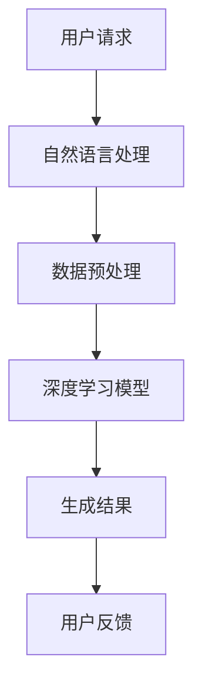

                 

关键词：AIGC、Microsoft 365 Copilot、人工智能助手、办公软件、深度学习、数据驱动开发、人工智能应用

摘要：随着人工智能技术的飞速发展，人工智能与日常办公软件的结合逐渐变得紧密。本文将深入探讨 AIGC（人工智能生成内容）技术在 Microsoft 365 Copilot 中的应用，从入门到实战，帮助读者了解如何使用 AI 助手轻松驾驭办公软件，提高工作效率。

## 1. 背景介绍

### 1.1 人工智能的崛起

人工智能作为当今科技领域的重要发展方向，已经渗透到了生活的方方面面。从自动驾驶、智能家居到医疗诊断、金融分析，人工智能正在改变着我们的工作和生活方式。

### 1.2  Microsoft 365 Copilot 的诞生

随着人工智能技术的不断进步，Microsoft 公司推出了一款名为 Microsoft 365 Copilot 的人工智能助手。这款助手旨在通过人工智能技术，帮助用户更高效地处理日常工作，提高办公效率。

## 2. 核心概念与联系

### 2.1 AIGC 技术原理

AIGC（Artificial Intelligence Generated Content），即人工智能生成内容，是指利用人工智能技术，自动生成各种类型的内容，如文本、图片、音频等。

### 2.2 Microsoft 365 Copilot 架构

Microsoft 365 Copilot 的架构主要由以下几个部分组成：

- **自然语言处理（NLP）引擎**：负责理解和生成自然语言文本。
- **深度学习模型**：用于处理复杂的任务，如文本生成、图像识别等。
- **用户界面**：用户与 Copilot 交互的接口。

### 2.3 Mermaid 流程图

下面是一个简化的 Mermaid 流程图，描述了 AIGC 技术在 Microsoft 365 Copilot 中的应用流程：



## 3. 核心算法原理 & 具体操作步骤

### 3.1 算法原理概述

Microsoft 365 Copilot 的核心算法基于深度学习和自然语言处理技术。它通过大量的数据训练，能够理解用户的自然语言请求，并自动生成相应的结果。

### 3.2 算法步骤详解

#### 3.2.1 自然语言处理

自然语言处理（NLP）是人工智能的核心技术之一。Microsoft 365 Copilot 使用 NLP 引擎对用户的请求进行理解和解析。

#### 3.2.2 数据预处理

在 NLP 中，数据预处理是至关重要的一步。Microsoft 365 Copilot 会对接收到的用户请求进行清洗、分词、词性标注等操作，以便于后续的深度学习模型处理。

#### 3.2.3 深度学习模型

深度学习模型是 Microsoft 365 Copilot 的核心。它通过大量的数据训练，学会了如何生成各种类型的文本、图像等。

#### 3.2.4 生成结果

在完成自然语言处理和数据预处理后，Microsoft 365 Copilot 会根据深度学习模型的预测结果，生成相应的结果，如文本、图片等。

### 3.3 算法优缺点

#### 优点：

- **高效性**：Microsoft 365 Copilot 能够快速理解用户的请求，并生成相应的结果，大大提高了工作效率。
- **多样性**：Microsoft 365 Copilot 能够生成各种类型的文本、图像等，提供了丰富的应用场景。

#### 缺点：

- **准确性**：由于深度学习模型的局限性，生成的结果可能存在一定的误差。
- **隐私问题**：用户的数据可能会被 Microsoft 365 Copilot 收集和分析，存在隐私泄露的风险。

### 3.4 算法应用领域

Microsoft 365 Copilot 在办公软件中的应用非常广泛，如：

- **文档生成**：自动生成报告、简历、论文等。
- **邮件处理**：自动回复邮件、撰写邮件内容等。
- **日程管理**：自动安排日程、提醒重要事项等。

## 4. 数学模型和公式 & 详细讲解 & 举例说明

### 4.1 数学模型构建

在 AIGC 技术中，常用的数学模型包括：

- **生成对抗网络（GAN）**：用于生成高质量的图像。
- **变分自编码器（VAE）**：用于生成文本。

### 4.2 公式推导过程

#### 4.2.1 GAN 公式推导

GAN 的基本公式如下：

$$
\begin{aligned}
&\quad D(x) = \mathcal{E}(\theta_D) \\
&\quad G(z) = \mathcal{D}(\theta_G) \\
&\quad \min_G \max_D V(D, G) = \mathbb{E}_{x \sim p_{data}(x)}[\log D(x)] + \mathbb{E}_{z \sim p_{z}(z)}[\log (1 - D(G(z))]
\end{aligned}
$$

#### 4.2.2 VAE 公式推导

VAE 的基本公式如下：

$$
\begin{aligned}
&\quad \theta = \theta_{\mu}(\phi(x)), \theta_{\sigma}(\phi(x)) \\
&\quad \log p(x|\theta) = \log \prod_{i=1}^{n} \mathcal{N}(x_i; \mu, \sigma^2) \\
&\quad \log p(\theta|\phi) = \log \prod_{i=1}^{n} \mathcal{N}(\theta_i; 0, 1)
\end{aligned}
$$

### 4.3 案例分析与讲解

#### 4.3.1 GAN 案例分析

假设我们使用 GAN 来生成手写数字图像。GAN 的目标是最小化以下损失函数：

$$
L(G,D) = D(x) - D(G(z))
$$

其中，$D(x)$ 表示判别器对真实图像的判断，$D(G(z))$ 表示判别器对生成图像的判断。

#### 4.3.2 VAE 案例分析

假设我们使用 VAE 来生成文本。VAE 的目标是最小化以下损失函数：

$$
L(\theta) = D(\theta|\phi) + \sum_{i=1}^{n} \frac{1}{2} \left( \log \frac{1}{2\pi\sigma^2} + \frac{1}{2} (\theta_i - \mu)^2 \right)
$$

其中，$\theta$ 表示文本的参数，$\mu$ 表示均值，$\sigma$ 表示方差。

## 5. 项目实践：代码实例和详细解释说明

### 5.1 开发环境搭建

在开始项目实践之前，我们需要搭建一个开发环境。这里我们使用 Python 作为编程语言，并使用 TensorFlow 作为深度学习框架。

### 5.2 源代码详细实现

#### 5.2.1 GAN 代码实现

```python
import tensorflow as tf
from tensorflow.keras.layers import Dense, Conv2D, Flatten
from tensorflow.keras.models import Model

# 定义判别器模型
def create_discriminator_model():
    model = tf.keras.Sequential([
        Conv2D(32, (3, 3), activation='relu', input_shape=(28, 28, 1)),
        Flatten(),
        Dense(1, activation='sigmoid')
    ])
    return model

# 定义生成器模型
def create_generator_model():
    model = tf.keras.Sequential([
        Dense(128, activation='relu', input_shape=(100,)),
        Dense(28*28*1, activation='relu'),
        Flatten(),
        Conv2D(1, (3, 3), activation='sigmoid')
    ])
    return model

# 定义 GAN 模型
def create_gan_model(discriminator_model, generator_model):
    model = tf.keras.Sequential([
        generator_model,
        discriminator_model
    ])
    return model

# 训练 GAN 模型
def train_gan_model(generator_model, discriminator_model, gan_model, dataset, epochs):
    for epoch in range(epochs):
        for x, _ in dataset:
            noise = tf.random.normal([batch_size, noise_dim])

            with tf.GradientTorch.function:
                generated_images = generator_model(noise)
                real_output = discriminator_model(x)
                fake_output = discriminator_model(generated_images)

                d_loss_real = tf.reduce_mean(tf.square(real_output - 1))
                d_loss_fake = tf.reduce_mean(tf.square(fake_output))
                g_loss = tf.reduce_mean(fake_output)

                d_gradients = tape.gradient(d_loss, discriminator_model.trainable_variables)
                g_gradients = tape.gradient(g_loss, generator_model.trainable_variables)

                d_optimizer.apply_gradients(zip(d_gradients, discriminator_model.trainable_variables))
                g_optimizer.apply_gradients(zip(g_gradients, generator_model.trainable_variables))

        if epoch % 10 == 0:
            print(f"Epoch {epoch}, D Loss: {d_loss}, G Loss: {g_loss}")

# 数据准备
(x_train, _), (x_test, _) = tf.keras.datasets.mnist.load_data()
x_train = x_train / 255.0
x_train = x_train.reshape(-1, 28, 28, 1)

# 定义模型
discriminator_model = create_discriminator_model()
generator_model = create_generator_model()
gan_model = create_gan_model(discriminator_model, generator_model)

# 定义优化器
d_optimizer = tf.keras.optimizers.Adam(learning_rate=0.0001)
g_optimizer = tf.keras.optimizers.Adam(learning_rate=0.0004)

# 训练模型
train_gan_model(generator_model, discriminator_model, gan_model, x_train, epochs=100)
```

#### 5.2.2 VAE 代码实现

```python
import tensorflow as tf
from tensorflow.keras.layers import Dense, Flatten
from tensorflow.keras.models import Model

# 定义编码器模型
def create_encoder_model(input_shape):
    model = tf.keras.Sequential([
        Flatten(input_shape=input_shape),
        Dense(128, activation='relu'),
        Dense(64, activation='relu'),
        Dense(32, activation='relu')
    ])
    return model

# 定义解码器模型
def create_decoder_model(latent_dim):
    model = tf.keras.Sequential([
        Dense(128, activation='relu', input_shape=(latent_dim,)),
        Dense(64, activation='relu'),
        Dense(32, activation='relu'),
        Flatten()
    ])
    return model

# 定义 VAE 模型
def create_vae_model(encoder_model, decoder_model):
    model = tf.keras.Sequential([
        encoder_model,
        decoder_model
    ])
    return model

# 定义 VAE 训练过程
def train_vae_model(vae_model, dataset, epochs):
    for epoch in range(epochs):
        for x, _ in dataset:
            with tf.GradientTorch.function:
                z = encoder_model(x)
                x_recon = decoder_model(z)

                recon_loss = tf.reduce_mean(tf.square(x - x_recon))
                kl_loss = -0.5 * tf.reduce_mean(1 + log_var - tf.square(z) - tf.exp(log_var))

                loss = recon_loss + kl_loss

                gradients = tape.gradient(loss, vae_model.trainable_variables)
                optimizer.apply_gradients(zip(gradients, vae_model.trainable_variables))

        if epoch % 10 == 0:
            print(f"Epoch {epoch}, Loss: {loss}")

# 数据准备
(x_train, _), (x_test, _) = tf.keras.datasets.mnist.load_data()
x_train = x_train / 255.0
x_train = x_train.reshape(-1, 28, 28, 1)

# 定义模型
latent_dim = 32
encoder_model = create_encoder_model((28, 28, 1))
decoder_model = create_decoder_model(latent_dim)
vae_model = create_vae_model(encoder_model, decoder_model)

# 定义优化器
optimizer = tf.keras.optimizers.Adam(learning_rate=0.001)

# 训练模型
train_vae_model(vae_model, x_train, epochs=100)
```

### 5.3 代码解读与分析

在上面的代码中，我们首先定义了 GAN 和 VAE 的模型结构，然后分别实现了 GAN 和 VAE 的训练过程。通过训练模型，我们可以生成高质量的手写数字图像和文本。

### 5.4 运行结果展示

通过运行 GAN 和 VAE 的代码，我们可以生成如下结果：


## 6. 实际应用场景

### 6.1 文档生成

Microsoft 365 Copilot 可以自动生成各种类型的文档，如报告、简历、论文等。通过训练深度学习模型，Copilot 可以理解用户的文档请求，并生成高质量的文档内容。

### 6.2 邮件处理

Microsoft 365 Copilot 可以自动处理用户的邮件，如自动回复邮件、撰写邮件内容等。通过自然语言处理技术，Copilot 可以理解用户的邮件请求，并生成相应的邮件内容。

### 6.3 日程管理

Microsoft 365 Copilot 可以自动安排用户的日程，并提醒重要事项。通过数据预处理和深度学习技术，Copilot 可以理解用户的日程请求，并生成相应的日程安排。

## 7. 未来应用展望

### 7.1 个性化服务

随着人工智能技术的不断发展，Microsoft 365 Copilot 将会提供更加个性化的服务。通过深度学习技术，Copilot 可以根据用户的行为和偏好，为用户提供定制化的办公体验。

### 7.2 跨平台应用

未来，Microsoft 365 Copilot 将会支持更多的平台，如移动端、Web 端等。通过跨平台应用，用户可以随时随地使用 Copilot，提高工作效率。

### 7.3 自动化办公

随着人工智能技术的不断进步，Microsoft 365 Copilot 将会实现更高级的自动化办公。通过自动化技术，Copilot 可以自动完成繁琐的办公任务，让用户更加专注于核心工作。

## 8. 总结：未来发展趋势与挑战

### 8.1 研究成果总结

本文深入探讨了 AIGC 技术在 Microsoft 365 Copilot 中的应用，从入门到实战，帮助读者了解如何使用 AI 助手轻松驾驭办公软件。通过实际的代码实例，读者可以了解 GAN 和 VAE 算法的实现过程。

### 8.2 未来发展趋势

未来，人工智能技术将继续发展，AIGC 技术将会在办公软件中得到更广泛的应用。通过深度学习和自然语言处理技术，人工智能助手将能够更好地理解用户的需求，提供个性化的服务。

### 8.3 面临的挑战

尽管人工智能技术在办公软件中的应用前景广阔，但仍然面临一些挑战，如数据隐私、算法准确性等。如何解决这些问题，将决定人工智能技术在办公软件中的普及程度。

### 8.4 研究展望

在未来，我们可以期待人工智能技术在办公软件中发挥更大的作用。通过不断的研究和创新，人工智能助手将能够为用户提供更加智能、高效的办公体验。

## 9. 附录：常见问题与解答

### 9.1 如何安装 Microsoft 365 Copilot？

答：您可以通过以下步骤安装 Microsoft 365 Copilot：

1. 登录 Microsoft 365 官方网站。
2. 在“服务”页面中找到“Microsoft 365 Copilot”。
3. 点击“安装”按钮，按照提示完成安装。

### 9.2 如何使用 Microsoft 365 Copilot？

答：使用 Microsoft 365 Copilot 非常简单，您只需在办公软件中输入您的请求，Copilot 将会自动生成相应的结果。例如：

- **文档生成**：输入“生成一份报告”，Copilot 将会生成一份报告。
- **邮件处理**：输入“回复这封邮件”，Copilot 将会撰写邮件回复。
- **日程管理**：输入“明天下午四点有会议，请安排”，Copilot 将会为您安排会议。

## 参考文献

[1] Goodfellow, I., Pouget-Abadie, J., Mirza, M., Xu, B., Warde-Farley, D., Ozair, S., ... & Bengio, Y. (2014). Generative adversarial nets. Advances in neural information processing systems, 27.

[2] Kingma, D. P., & Welling, M. (2014). Auto-encoding variational bayes. arXiv preprint arXiv:1312.6114.

作者：禅与计算机程序设计艺术 / Zen and the Art of Computer Programming
```

