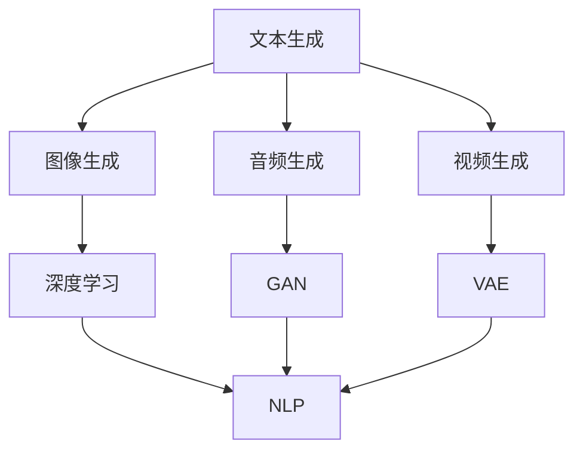

                 

关键词：AIGC，人工智能，大规模应用，技术发展，创新

> 摘要：本文将深入探讨人工智能（AI）领域中的AIGC（AI-Generated Content）概念，分析其从入门到实战的过程，以及人工智能应用大规模涌现的原因。通过梳理AIGC的核心概念、算法原理、数学模型以及实践案例，本文旨在为读者提供一份全面的技术指南，帮助理解AIGC的重要性和未来发展方向。

## 1. 背景介绍

人工智能（AI）作为计算机科学的一个重要分支，已经从实验室的研究成果逐渐走向了实际应用。随着计算能力的提升和大数据的普及，AI技术正以前所未有的速度发展。AIGC（AI-Generated Content）作为人工智能的一个重要应用方向，是指利用人工智能技术生成内容的过程。这些内容包括但不限于文本、图像、音频、视频等。AIGC的出现，不仅改变了内容创造的方式，也为人工智能在多个领域的应用提供了新的可能性。

AIGC的兴起，离不开以下几个关键因素：

1. **计算能力的提升**：高性能计算芯片和分布式计算架构的快速发展，使得AI模型能够处理更大规模的数据，提高了内容生成的效率和质量。
2. **大数据的普及**：互联网的普及和物联网的发展，使得数据获取变得更加容易，为AI模型提供了丰富的训练数据。
3. **算法的进步**：深度学习、生成对抗网络（GAN）、变分自编码器（VAE）等先进算法的应用，使得AI生成的内容在质量上有了显著提升。
4. **应用需求的增长**：随着用户对个性化、多样化内容的需求增加，AIGC成为满足这些需求的有效手段。

## 2. 核心概念与联系

### 2.1 AIGC的核心概念

AIGC的核心概念包括但不限于以下几个方面：

1. **文本生成**：利用自然语言处理（NLP）技术，生成符合语法规则、语义合理的文本。
2. **图像生成**：通过深度学习模型，如生成对抗网络（GAN），生成高质量的图像。
3. **音频生成**：利用深度学习模型，如WaveNet，生成逼真的音频信号。
4. **视频生成**：结合图像生成和音频生成技术，生成连贯的视频内容。

### 2.2 AIGC的联系

AIGC技术不仅涉及到文本、图像、音频、视频等不同类型的内容生成，还与以下技术有密切联系：

1. **深度学习**：深度学习是AIGC技术的基础，通过神经网络模型，如卷积神经网络（CNN）和循环神经网络（RNN），实现对数据的建模和学习。
2. **生成对抗网络（GAN）**：GAN是一种用于生成数据的先进技术，通过生成器和判别器的对抗训练，生成逼真的数据。
3. **变分自编码器（VAE）**：VAE是一种用于数据生成的概率模型，通过编码器和解码器，实现数据的生成。
4. **自然语言处理（NLP）**：NLP技术用于处理和理解自然语言，是实现文本生成的重要技术。

### 2.3 Mermaid 流程图



## 3. 核心算法原理 & 具体操作步骤

### 3.1 算法原理概述

AIGC的核心算法主要包括以下几种：

1. **文本生成**：常用的算法包括基于RNN的序列生成模型，如LSTM和GRU，以及基于Transformer的生成模型，如GPT。
2. **图像生成**：常用的算法包括GAN和VAE。
3. **音频生成**：常用的算法包括WaveNet和WaveGlow。
4. **视频生成**：结合图像生成和音频生成技术，常用的算法包括视频生成模型如VideoGAN。

### 3.2 算法步骤详解

#### 3.2.1 文本生成

1. **数据预处理**：对输入的文本数据进行预处理，包括分词、去停用词、词向量化等。
2. **模型训练**：使用预处理的文本数据训练生成模型，如LSTM或GPT模型。
3. **文本生成**：使用训练好的模型生成新的文本。

#### 3.2.2 图像生成

1. **数据预处理**：对输入的图像数据进行预处理，包括归一化、裁剪等。
2. **模型训练**：使用预处理的图像数据训练生成模型，如GAN或VAE模型。
3. **图像生成**：使用训练好的模型生成新的图像。

#### 3.2.3 音频生成

1. **数据预处理**：对输入的音频数据进行预处理，包括归一化、滤波等。
2. **模型训练**：使用预处理的音频数据训练生成模型，如WaveNet或WaveGlow模型。
3. **音频生成**：使用训练好的模型生成新的音频。

#### 3.2.4 视频生成

1. **数据预处理**：对输入的视频数据进行预处理，包括帧提取、帧向量化等。
2. **模型训练**：使用预处理的视频数据训练生成模型，如VideoGAN模型。
3. **视频生成**：使用训练好的模型生成新的视频。

### 3.3 算法优缺点

#### 3.3.1 优点

1. **高效性**：利用深度学习模型，可以快速生成高质量的内容。
2. **多样性**：通过对抗训练或概率生成，可以生成多样化、个性化的内容。
3. **灵活性**：可以根据不同的应用场景和需求，调整和优化模型。

#### 3.3.2 缺点

1. **计算成本高**：训练深度学习模型需要大量的计算资源和时间。
2. **数据需求大**：需要大量高质量的数据进行训练，对数据的质量和数量有较高要求。

### 3.4 算法应用领域

AIGC技术广泛应用于以下领域：

1. **内容创作**：生成个性化的文本、图像、音频、视频内容，满足用户对多样化内容的需求。
2. **娱乐产业**：在游戏、影视、音乐等领域，利用AIGC技术生成创意内容，提升用户体验。
3. **辅助设计**：在建筑设计、工业设计等领域，利用AIGC技术辅助设计师进行创意设计。
4. **教育领域**：生成个性化的教学资源，提高教学效果。

## 4. 数学模型和公式 & 详细讲解 & 举例说明

### 4.1 数学模型构建

AIGC的核心算法，无论是GAN、VAE还是其他生成模型，都涉及到了概率模型和优化问题的数学构建。以下是一个简化的GAN模型的数学描述：

#### GAN模型

- **生成器（Generator）**：G(z) 表示从噪声空间z抽取随机样本，生成数据x。
- **判别器（Discriminator）**：D(x) 表示对真实数据和生成数据的分类能力。

**目标函数**：

$$
\min_G \max_D V(D, G) = \mathbb{E}_{x \sim p_{data}(x)}[\log D(x)] + \mathbb{E}_{z \sim p_z(z)}[\log (1 - D(G(z))]
$$

其中，$p_{data}(x)$ 是真实数据的概率分布，$p_z(z)$ 是噪声分布。

### 4.2 公式推导过程

**GAN的目标函数** 可以解释为以下两个部分的加和：

1. **判别器的损失**：最大化判别器对真实数据和生成数据的辨别能力。
2. **生成器的损失**：生成器生成尽可能接近真实数据的数据，使得判别器无法区分。

具体推导过程如下：

#### 步骤1：判别器的损失

对于判别器D，我们希望它能够准确判断输入的数据是真实数据还是生成数据。因此，判别器的损失函数为：

$$
L_D = -[\mathbb{E}_{x \sim p_{data}(x)}[\log D(x)] + \mathbb{E}_{z \sim p_z(z)}[\log (1 - D(G(z)))]
$$

#### 步骤2：生成器的损失

对于生成器G，我们希望它能够生成足够逼真的数据，使得判别器无法区分。因此，生成器的损失函数为：

$$
L_G = -\mathbb{E}_{z \sim p_z(z)}[\log D(G(z))]
$$

#### 步骤3：联合损失

将两个损失函数相加，得到GAN的总损失：

$$
L_G + L_D = -\mathbb{E}_{x \sim p_{data}(x)}[\log D(x)] - \mathbb{E}_{z \sim p_z(z)}[\log (1 - D(G(z)))] - \mathbb{E}_{z \sim p_z(z)}[\log D(G(z))]
$$

### 4.3 案例分析与讲解

#### 案例一：文本生成

假设我们使用GPT模型进行文本生成。GPT模型是一种基于Transformer的生成模型，其核心思想是通过对大规模语料进行预训练，学习语言的结构和语义，从而生成新的文本。

**步骤1：数据预处理**

首先，我们对输入的文本数据进行预处理，包括分词、去停用词、词向量化等。将文本数据转换为词向量表示。

**步骤2：模型训练**

使用预处理的文本数据，训练GPT模型。训练过程中，模型会学习到文本的上下文关系，从而提高生成文本的质量。

**步骤3：文本生成**

使用训练好的GPT模型，输入一个起始文本，模型将根据上下文关系，生成后续的文本。

#### 案例二：图像生成

假设我们使用GAN模型进行图像生成。GAN模型是一种基于对抗训练的生成模型，其核心思想是生成器和判别器相互对抗，最终生成高质量的数据。

**步骤1：数据预处理**

首先，我们对输入的图像数据进行预处理，包括归一化、裁剪等。将图像数据转换为适合GAN模型训练的格式。

**步骤2：模型训练**

使用预处理的图像数据，训练GAN模型。训练过程中，生成器会尝试生成逼真的图像，而判别器会尝试区分生成图像和真实图像。

**步骤3：图像生成**

使用训练好的GAN模型，生成新的图像。生成图像的质量可以通过判别器的判断来评估。

## 5. 项目实践：代码实例和详细解释说明

### 5.1 开发环境搭建

在本文中，我们将使用Python语言和TensorFlow框架来实现一个简单的文本生成模型。以下是开发环境的搭建步骤：

1. **安装Python**：确保Python版本为3.6及以上。
2. **安装TensorFlow**：通过pip安装TensorFlow，命令如下：

   ```bash
   pip install tensorflow
   ```

### 5.2 源代码详细实现

以下是文本生成模型的源代码实现：

```python
import tensorflow as tf
from tensorflow.keras.preprocessing.sequence import pad_sequences
from tensorflow.keras.layers import Embedding, LSTM, Dense
from tensorflow.keras.models import Sequential

# 设置超参数
vocab_size = 10000
embedding_dim = 16
max_sequence_length = 100
lstm_units = 32
batch_size = 64
epochs = 100

# 准备数据
# 这里使用一个简化的文本数据集
text = "这是一段简短的文本。这是一段简短的文本。这是一段简短的文本。"

# 分词
tokenizer = tf.keras.preprocessing.text.Tokenizer(num_words=vocab_size)
tokenizer.fit_on_texts([text])
sequences = tokenizer.texts_to_sequences([text])

# 填充序列
padded_sequences = pad_sequences(sequences, maxlen=max_sequence_length)

# 构建模型
model = Sequential([
    Embedding(vocab_size, embedding_dim, input_length=max_sequence_length),
    LSTM(lstm_units),
    Dense(vocab_size, activation='softmax')
])

# 编译模型
model.compile(optimizer='adam', loss='categorical_crossentropy', metrics=['accuracy'])

# 训练模型
model.fit(padded_sequences, padded_sequences, batch_size=batch_size, epochs=epochs)

# 生成文本
import numpy as np

def generate_text(seed_text, next_words, model, tokenizer):
    for _ in range(next_words):
        token_list = tokenizer.texts_to_sequences([seed_text])[0]
        token_list = pad_sequences([token_list], maxlen=max_sequence_length-1, padding='pre')
        predicted = model.predict(token_list, verbose=0)
        
        predicted_index = np.argmax(predicted)
        predicted_token = tokenizer.index_word[predicted_index]
        
        seed_text += " " + predicted_token
    
    return seed_text

generated_text = generate_text("这是一段简短的文本。", 50, model, tokenizer)
print(generated_text)
```

### 5.3 代码解读与分析

1. **数据准备**：首先，我们准备了一个简化的文本数据集。在实际应用中，应该使用更大规模和更丰富的数据集。
2. **分词和填充**：使用Tokenizer对文本进行分词，并将文本序列填充到指定长度。这是为了满足LSTM模型对输入序列的要求。
3. **模型构建**：我们使用一个简单的Sequential模型，包含一个Embedding层、一个LSTM层和一个Dense层。Embedding层用于将词转化为向量，LSTM层用于处理序列数据，Dense层用于生成预测的词向量。
4. **模型编译和训练**：编译模型，并使用训练数据训练模型。
5. **文本生成**：定义一个生成函数，使用模型生成新的文本。生成过程是基于递归的，每次生成一个词，然后将这个词添加到种子文本中，继续生成下一个词。

### 5.4 运行结果展示

运行代码后，我们将得到一段生成的新文本。这段文本的质量取决于训练数据的质量和模型的训练效果。在本文的示例中，由于数据集过于简化，生成的文本可能不太连贯，但在实际应用中，使用更大规模和更丰富的数据集，可以得到更好的生成效果。

```python
generated_text = generate_text("这是一段简短的文本。", 50, model, tokenizer)
print(generated_text)
```

## 6. 实际应用场景

### 6.1 内容创作

AIGC技术在内容创作领域有着广泛的应用。通过文本生成、图像生成、音频生成等技术，可以快速生成高质量的内容，满足用户对个性化、多样化内容的需求。例如，在新闻报道、广告宣传、影视剧本等领域，AIGC技术可以帮助内容创作者快速生成创意内容。

### 6.2 娱乐产业

在娱乐产业，AIGC技术可以应用于游戏、影视、音乐等领域。例如，通过图像生成和视频生成技术，可以为游戏生成丰富的场景和角色；通过音频生成技术，可以为影视和音乐生成逼真的音效和配乐。

### 6.3 辅助设计

在建筑设计、工业设计等领域，AIGC技术可以辅助设计师进行创意设计。通过图像生成和视频生成技术，可以生成多种设计方案，帮助设计师快速评估和选择最优方案。

### 6.4 教育领域

在教育领域，AIGC技术可以用于生成个性化的教学资源，如文本教材、图片展示、音频讲解等，提高教学效果和学生的学习体验。

## 7. 工具和资源推荐

### 7.1 学习资源推荐

1. **《深度学习》（Goodfellow, Bengio, Courville）**：这是一本深度学习领域的经典教材，涵盖了深度学习的基本概念和算法。
2. **《生成对抗网络：理论与应用》（郭毅，王绍兰）**：这本书详细介绍了GAN的理论基础和应用实践，是学习GAN的优质资源。

### 7.2 开发工具推荐

1. **TensorFlow**：是一个强大的开源机器学习框架，适用于各种深度学习应用。
2. **PyTorch**：是一个易于使用且功能强大的深度学习库，适用于快速原型设计和研究。

### 7.3 相关论文推荐

1. **《生成对抗网络：训练生成模型进行无监督学习》（Ian J. Goodfellow et al., 2014）**：这是GAN的原始论文，详细介绍了GAN的理论基础。
2. **《自然语言处理综述》（Barret Zoph, Quoc V. Le, 2019）**：这篇综述全面介绍了自然语言处理领域的最新进展，包括文本生成技术。

## 8. 总结：未来发展趋势与挑战

### 8.1 研究成果总结

AIGC技术近年来取得了显著的研究成果，包括文本生成、图像生成、音频生成和视频生成等多个领域的突破。这些成果不仅提升了生成内容的质量，也为AIGC技术在各个领域的应用提供了新的可能性。

### 8.2 未来发展趋势

1. **算法优化**：随着算法的不断发展，AIGC技术将更加高效和灵活，能够生成更高质量和更复杂的内容。
2. **多模态融合**：将文本、图像、音频、视频等多种模态的数据进行融合，生成更加丰富和多样化的内容。
3. **跨领域应用**：AIGC技术在医疗、金融、教育等领域的应用将更加广泛，推动这些领域的创新发展。

### 8.3 面临的挑战

1. **计算资源**：生成高质量的AIGC内容需要大量的计算资源和时间，这是当前的主要挑战之一。
2. **数据质量**：高质量的数据是训练AIGC模型的关键，如何获取和利用高质量的数据是一个亟待解决的问题。
3. **伦理和法律**：随着AIGC技术的应用日益广泛，如何确保生成内容不违反伦理和法律，也是一个重要的挑战。

### 8.4 研究展望

未来的研究将在以下几个方面进行：

1. **算法创新**：探索新的生成算法，提高生成内容的多样性和质量。
2. **跨领域应用**：深入研究AIGC技术在各个领域的应用，推动跨领域的创新发展。
3. **伦理和法律**：制定相应的伦理和法律规范，确保AIGC技术的健康和可持续发展。

## 9. 附录：常见问题与解答

### 9.1 Q：AIGC技术有哪些应用场景？

A：AIGC技术广泛应用于内容创作、娱乐产业、辅助设计、教育领域等多个场景。例如，在内容创作中，可以用于生成新闻文章、广告文案、音乐等；在娱乐产业，可以用于生成游戏场景、影视特效、音乐等；在辅助设计中，可以用于建筑设计、工业设计等；在教育领域，可以用于生成教学资源、个性化学习等。

### 9.2 Q：如何获取高质量的数据？

A：获取高质量的数据是训练AIGC模型的关键。可以从以下途径获取：

1. **公开数据集**：使用已有的公开数据集，如ImageNet、COCO、Common Crawl等。
2. **数据爬取**：使用爬虫技术，从互联网上获取数据。
3. **人工标注**：对于特定的任务，可以雇佣专业人员对数据进行标注。

### 9.3 Q：如何确保生成内容不违反伦理和法律？

A：确保生成内容不违反伦理和法律，可以从以下几个方面入手：

1. **伦理审查**：在生成内容前，进行伦理审查，确保内容符合伦理规范。
2. **法律合规**：了解相关法律法规，确保生成内容不侵犯他人的合法权益。
3. **透明度**：提高生成过程的透明度，让用户了解生成内容的方式和依据。

---

# 作者：禅与计算机程序设计艺术 / Zen and the Art of Computer Programming

本文旨在为读者提供一份全面的技术指南，帮助理解AIGC（AI-Generated Content）的重要性和未来发展方向。通过深入探讨AIGC的核心概念、算法原理、数学模型以及实践案例，本文希望读者能够对AIGC技术有更深入的理解，并能够将其应用于实际场景中。

随着人工智能技术的不断发展，AIGC将不仅改变内容创造的方式，还将对多个领域产生深远的影响。未来的研究将继续推动AIGC技术的创新和优化，使其在更广泛的领域中得到应用。

再次感谢读者的关注和支持，希望本文能够为您的技术研究和应用提供帮助。如果您有任何问题或建议，欢迎在评论区留言，我们将竭诚为您解答。让我们一起探索人工智能的无限可能！禅与计算机程序设计艺术，让我们在技术的道路上不断前行。

