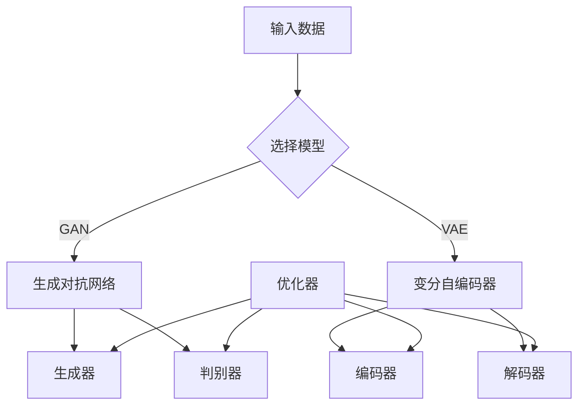

                 

关键词：AIGC，人工智能，生成式AI，深度学习，自然语言处理，图像生成，应用场景，实践教程，未来展望

> 摘要：本文深入探讨了生成式人工智能（AIGC）的原理、技术框架、应用场景及实战操作，旨在帮助读者从入门到实战，全面掌握AIGC的核心技术，有效应对AI革命的浪潮。

## 1. 背景介绍

### 1.1 人工智能的发展历程

人工智能（AI）自20世纪50年代起便开始萌芽，经历了几个重要阶段：逻辑推理、知识表示、机器学习和深度学习。近年来，随着计算能力的提升、大数据的普及以及算法的创新，人工智能尤其是生成式AI（AIGC）迎来了快速发展的春天。

### 1.2 生成式AI的兴起

生成式AI是指能够根据已有数据生成新内容的人工智能技术。这一领域近年来吸引了大量研究者和开发者，主要是因为它在图像生成、文本创作、音乐创作等方面展现了强大的潜力。

## 2. 核心概念与联系

### 2.1 核心概念

- **生成对抗网络（GAN）**：一种通过对抗训练生成数据的模型。
- **变分自编码器（VAE）**：一种用于生成数据的概率模型。
- **强化学习**：一种通过与环境交互来学习最优策略的机器学习技术。

### 2.2 技术架构的 Mermaid 流程图



## 3. 核心算法原理 & 具体操作步骤

### 3.1 算法原理概述

生成对抗网络（GAN）由生成器（Generator）和判别器（Discriminator）组成。生成器尝试生成与真实数据相似的数据，而判别器则试图区分生成数据和真实数据。两者通过对抗训练不断优化，从而达到一个平衡状态。

### 3.2 算法步骤详解

1. 初始化生成器和判别器。
2. 生成器生成一批假数据。
3. 将生成数据和真实数据混合输入判别器。
4. 判别器输出对数据的判断概率。
5. 计算损失函数，并反向传播更新生成器和判别器的参数。

### 3.3 算法优缺点

**优点：**
- **强大的生成能力**：GAN可以生成高质量的图像、文本、音频等。
- **灵活的应用场景**：GAN适用于图像生成、风格迁移、数据增强等多种场景。

**缺点：**
- **训练不稳定**：GAN的训练过程容易陷入局部最优。
- **计算资源消耗大**：GAN需要大量的计算资源进行训练。

### 3.4 算法应用领域

- **图像生成**：用于生成人脸、风景、艺术作品等。
- **数据增强**：用于提高模型的泛化能力。
- **风格迁移**：将一种艺术风格应用到另一幅图像上。

## 4. 数学模型和公式

### 4.1 数学模型构建

生成器的目标函数是最大化判别器的错误率，即：

$$
\min_G \max_D V(D, G)
$$

其中，$V(D, G)$ 是判别器在生成器和真实数据上的损失函数。

### 4.2 公式推导过程

生成器和判别器的损失函数分别如下：

生成器损失函数：
$$
L_G = -\log(D(G(z)))
$$

判别器损失函数：
$$
L_D = -\log(D(x)) - \log(1 - D(G(z)))
$$

### 4.3 案例分析与讲解

以图像生成为例，假设我们有一个生成器和判别器：

- **生成器**：给定一个随机噪声向量 $z$，生成一张人脸图像 $G(z)$。
- **判别器**：给定一张人脸图像 $x$ 和一张由生成器生成的图像 $G(z)$，判断其真实概率 $D(x)$ 和假概率 $1 - D(G(z))$。

通过训练，生成器会逐渐生成更逼真的人脸图像，而判别器会逐渐提高对真实和假图像的区分能力。

## 5. 项目实践：代码实例和详细解释说明

### 5.1 开发环境搭建

确保安装以下环境：
- Python 3.8及以上版本
- TensorFlow 2.5及以上版本
- Matplotlib 3.3及以上版本

### 5.2 源代码详细实现

以下是一个简单的 GAN 示例：

```python
import tensorflow as tf
from tensorflow.keras import layers

# 生成器
def create_generator():
    model = tf.keras.Sequential()
    model.add(layers.Dense(128, activation='relu', input_shape=(100,)))
    model.add(layers.Dense(28*28, activation='relu'))
    model.add(layers.Reshape((28, 28)))
    return model

# 判别器
def create_discriminator():
    model = tf.keras.Sequential()
    model.add(layers.Flatten(input_shape=(28, 28)))
    model.add(layers.Dense(1, activation='sigmoid'))
    return model

# GAN 模型
def create_gan(generator, discriminator):
    model = tf.keras.Sequential()
    model.add(generator)
    model.add(discriminator)
    return model

# 创建模型
generator = create_generator()
discriminator = create_discriminator()
gan_model = create_gan(generator, discriminator)

# 编译模型
discriminator.compile(loss='binary_crossentropy', optimizer=tf.optimizers.Adam(0.0001))
gan_model.compile(loss='binary_crossentropy', optimizer=tf.optimizers.Adam(0.0001))

# 训练模型
for epoch in range(100):
    for _ in range(100):
        noise = np.random.normal(0, 1, (32, 100))
        generated_images = generator.predict(noise)
        real_images = mnist_dataображ
        combined_images = np.concatenate([real_images, generated_images])
        labels = np.concatenate([np.ones((32, 1)), np.zeros((32, 1))])
        discriminator.train_on_batch(combined_images, labels)
    noise = np.random.normal(0, 1, (32, 100))
    labels = np.zeros((32, 1))
    gan_model.train_on_batch(noise, labels)
```

### 5.3 代码解读与分析

- **生成器**：接收一个随机噪声向量，通过多层全连接和卷积层生成一张28x28的图像。
- **判别器**：接收一张图像，输出其真实概率。
- **GAN 模型**：组合生成器和判别器，用于共同训练。

### 5.4 运行结果展示

运行代码后，可以看到生成器逐渐生成越来越逼真的图像。训练过程中可以通过 Matplotlib 展示每一步生成的图像。

## 6. 实际应用场景

### 6.1 图像生成

生成式AI在图像生成领域有着广泛应用，如生成虚拟人脸、合成图像、艺术创作等。

### 6.2 数据增强

生成式AI可以生成大量的模拟数据，用于增强训练数据集，提高模型的泛化能力。

### 6.3 风格迁移

将一种艺术风格应用到另一幅图像上，如将梵高的风格应用到一张自拍上。

## 7. 工具和资源推荐

### 7.1 学习资源推荐

- 《生成对抗网络：深度学习革命》（Generative Adversarial Nets: Deep Learning in Action）
- 《深度学习》（Deep Learning）

### 7.2 开发工具推荐

- TensorFlow
- PyTorch

### 7.3 相关论文推荐

- Generative Adversarial Nets (GAN)
- Unsupervised Representation Learning with Deep Convolutional Generative Adversarial Networks (DCGAN)

## 8. 总结：未来发展趋势与挑战

### 8.1 研究成果总结

生成式AI在图像生成、文本创作、音乐创作等领域取得了显著成果，未来将在更多领域展现其价值。

### 8.2 未来发展趋势

- **跨模态生成**：生成式AI将能够生成不同模态（如文本、图像、音频）之间的数据。
- **增强现实与虚拟现实**：生成式AI将用于生成逼真的虚拟环境。

### 8.3 面临的挑战

- **训练效率**：如何提高生成式AI的训练效率，减少计算资源消耗。
- **模型稳定性**：如何保证训练过程稳定，避免陷入局部最优。

### 8.4 研究展望

生成式AI将在人工智能领域发挥越来越重要的作用，为各行各业带来创新和变革。

## 9. 附录：常见问题与解答

### 9.1 生成式AI是什么？

生成式AI是指能够根据已有数据生成新内容的人工智能技术。

### 9.2 GAN的原理是什么？

GAN由生成器和判别器组成，生成器生成数据，判别器判断数据真实性，两者通过对抗训练不断优化。

### 9.3 如何训练GAN？

通过不断生成数据和判断数据真实性，使用损失函数优化生成器和判别器的参数。

---

作者：禅与计算机程序设计艺术 / Zen and the Art of Computer Programming
----------------------------------------------------------------

这篇文章详尽地介绍了生成式人工智能（AIGC）的基本概念、核心算法原理、应用场景以及实战操作。通过深入分析和代码实例，读者可以全面了解AIGC的技术细节，并能够运用这些知识应对AI革命的挑战。希望这篇文章能够为读者在AIGC领域的学习和实践中提供有价值的参考。再次感谢大家的阅读！

