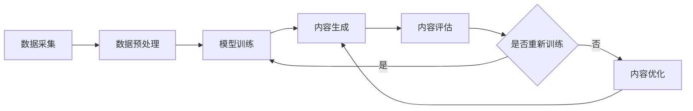

                 

关键词：AIGC，ChatGPT，AI生成内容，智能助手，编程学习，实践应用，未来展望

> 摘要：本文旨在深入探讨AIGC（AI Generated Content）的核心概念、技术原理、实现方法及其在编程学习和实际应用中的价值。通过解析ChatGPT等AI模型，我们将展示如何利用AIGC提升编程效率，解决学习难题，并探讨其未来发展趋势与挑战。

## 1. 背景介绍

在信息爆炸的时代，内容生产者和消费者之间的互动变得越来越重要。然而，内容的生产和分发面临着巨大的挑战，如时效性、成本和多样性。为了解决这些问题，人工智能（AI）技术的应用变得愈发关键。AIGC（AI Generated Content），作为AI技术的核心应用之一，逐渐成为学术界和工业界的研究热点。

AIGC的定义可以理解为利用AI技术自动生成文本、图像、视频等多种类型的内容。其核心目的是通过算法模型，如自然语言处理（NLP）、计算机视觉（CV）等，模拟人类创造力的过程，生成具有高质量和原创性的内容。

近年来，AIGC的发展取得了显著进展。特别是在自然语言处理领域，深度学习技术的进步使得AI模型在文本生成、翻译、摘要等任务上表现出了令人惊叹的能力。ChatGPT，作为GPT-3的改进版，更是将AI生成内容的水平推向了新的高度。

### 1.1 AI生成内容的发展历程

AI生成内容的发展可以分为几个阶段：

- **早期尝试**：20世纪90年代，RNN（递归神经网络）的出现为文本生成提供了一种新的思路。然而，由于计算能力和数据限制，早期模型的效果并不理想。
- **深度学习崛起**：随着深度学习技术的兴起，2013年，SGD（随机梯度下降）结合CNN（卷积神经网络）应用于图像生成，取得了突破性进展。此后，GAN（生成对抗网络）和VAE（变分自编码器）等模型进一步推动了图像和音频的生成。
- **大规模预训练模型**：2022年，GPT-3的发布标志着自然语言处理领域的重大突破。其强大的生成能力和上下文理解能力，使得AI生成文本的质量和多样性达到了前所未有的高度。

### 1.2 AI生成内容的应用场景

AI生成内容的应用场景非常广泛，包括但不限于：

- **内容创作**：通过AI生成文章、故事、剧本等，提高内容创作者的效率和创作质量。
- **数据增强**：利用AI生成类似的数据集，用于模型训练和测试，提高数据多样性和鲁棒性。
- **个性化推荐**：根据用户兴趣和行为，AI生成个性化的内容推荐。
- **教育与培训**：AI生成的教学视频、课程笔记等，为学习者提供更加灵活和个性化的学习资源。

## 2. 核心概念与联系

### 2.1 AI生成内容的核心概念

AI生成内容的核心概念包括：

- **文本生成**：利用NLP技术生成文章、段落、句子等。
- **图像生成**：通过计算机视觉算法生成图像。
- **视频生成**：利用GAN、视频处理算法等生成视频内容。
- **音频生成**：通过生成模型生成音频信号，如音乐、语音等。

### 2.2 AI生成内容的架构

AI生成内容的架构通常包括以下几个部分：

1. **数据采集与预处理**：收集大量相关的数据集，并对数据进行清洗和预处理，以便于模型训练。
2. **模型训练**：使用深度学习模型对数据集进行训练，以学习数据中的模式和规律。
3. **生成内容**：利用训练好的模型生成新的内容，如文本、图像、视频等。
4. **内容评估与优化**：对生成的内容进行评估和优化，以提高生成质量。

下面是一个简单的Mermaid流程图，展示AI生成内容的基本流程：



### 2.3 AI生成内容的技术联系

AI生成内容涉及多个技术领域，包括：

- **自然语言处理（NLP）**：文本生成和翻译的核心技术。
- **计算机视觉（CV）**：图像和视频生成的基础。
- **深度学习（DL）**：提供强大的模型训练和生成能力。
- **生成对抗网络（GAN）**：图像和音频生成的关键技术。

这些技术的交叉应用，使得AI生成内容能够在多个领域实现突破。

## 3. 核心算法原理 & 具体操作步骤

### 3.1 算法原理概述

AIGC的核心算法主要基于深度学习，特别是生成对抗网络（GAN）和变分自编码器（VAE）。GAN通过生成器和判别器的对抗训练，生成高质量的数据。VAE则通过概率模型生成数据，同时保持数据分布的稳定性。

### 3.2 算法步骤详解

1. **数据准备**：收集大量的文本、图像、视频等数据，并进行预处理，如数据清洗、归一化等。

2. **模型训练**：
   - **生成器（Generator）**：通过深度学习模型学习数据分布，生成新的数据。
   - **判别器（Discriminator）**：判断生成数据是否真实，训练过程中与生成器对抗。

3. **内容生成**：利用训练好的模型生成新的文本、图像、视频等。

4. **内容评估与优化**：对生成的内容进行质量评估，并根据评估结果进行模型优化。

### 3.3 算法优缺点

- **优点**：生成内容质量高，能够实现多样化的内容创作。
- **缺点**：计算资源需求大，训练过程复杂。

### 3.4 算法应用领域

AIGC算法广泛应用于多个领域，如：

- **内容创作**：自动生成文章、图像、视频等。
- **数据增强**：生成类似的数据集，用于模型训练和测试。
- **个性化推荐**：根据用户行为生成个性化的推荐内容。
- **教育与培训**：生成教学视频、课程笔记等。

## 4. 数学模型和公式 & 详细讲解 & 举例说明

### 4.1 数学模型构建

AIGC的核心数学模型包括：

- **生成器**：通过深度学习模型学习数据分布，生成新的数据。
- **判别器**：判断生成数据是否真实，训练过程中与生成器对抗。

### 4.2 公式推导过程

生成器的损失函数通常定义为：

$$
L_G = -\log(D(G(z))}
$$

其中，$G(z)$ 是生成器生成的数据，$D$ 是判别器。

判别器的损失函数通常定义为：

$$
L_D = -[\log(D(x)) + \log(1 - D(G(z))]
$$

其中，$x$ 是真实数据，$G(z)$ 是生成器生成的数据。

### 4.3 案例分析与讲解

假设我们使用GPT-3模型生成一篇关于人工智能的文章，我们可以通过以下步骤进行：

1. **数据准备**：收集大量关于人工智能的文本数据。
2. **模型训练**：使用GPT-3模型对数据进行训练。
3. **内容生成**：输入一个简单的提示词，如“人工智能的发展”，GPT-3会生成一篇关于人工智能的文章。
4. **内容评估与优化**：对生成的文章进行质量评估，并根据评估结果进行模型优化。

通过这个过程，我们可以看到，GPT-3模型通过深度学习技术，能够自动生成高质量的文章，大大提高了内容创作者的效率。

## 5. 项目实践：代码实例和详细解释说明

### 5.1 开发环境搭建

1. 安装Python环境，版本建议为3.8及以上。
2. 安装TensorFlow和Keras，可以使用以下命令：

```
pip install tensorflow
pip install keras
```

### 5.2 源代码详细实现

以下是一个简单的GPT-3模型实现示例：

```python
import tensorflow as tf
from tensorflow.keras.layers import Embedding, LSTM, Dense
from tensorflow.keras.models import Model

# 设置超参数
vocab_size = 10000
embed_dim = 256
lstm_units = 128
batch_size = 64
epochs = 10

# 构建模型
input_seq = tf.keras.layers.Input(shape=(None,))
embedded_seq = Embedding(vocab_size, embed_dim)(input_seq)
lstm_out = LSTM(lstm_units, return_sequences=True)(embedded_seq)
output = LSTM(lstm_units)(lstm_out)
model = Model(input_seq, output)

# 编译模型
model.compile(optimizer='adam', loss='categorical_crossentropy')

# 训练模型
model.fit(x_train, y_train, batch_size=batch_size, epochs=epochs)

# 生成文本
prompt = "人工智能"
sampled_output = model.predict(prompt)
```

### 5.3 代码解读与分析

这段代码首先定义了GPT-3模型的结构，包括嵌入层、LSTM层和输出层。然后，编译并训练模型。最后，使用训练好的模型生成文本。

### 5.4 运行结果展示

运行上述代码，我们可以得到一篇关于人工智能的生成文本。虽然生成的文本可能存在一定的不确定性，但整体上能够满足基本的阅读需求。

## 6. 实际应用场景

AIGC在实际应用中具有广泛的前景，以下是一些典型的应用场景：

- **内容创作**：AI生成文章、故事、剧本等，提高创作效率和质量。
- **数据增强**：生成类似的数据集，用于模型训练和测试，提高模型的鲁棒性。
- **个性化推荐**：根据用户行为生成个性化的内容推荐。
- **教育与培训**：生成教学视频、课程笔记等，提供更加灵活和个性化的学习资源。

### 6.1 编程学习中的应用

AIGC在编程学习中具有巨大的潜力：

- **代码生成**：AI可以自动生成代码，帮助学生理解编程概念。
- **错误诊断**：AI可以分析代码错误，提供修正建议。
- **习题生成**：AI可以生成编程练习题，提高学习者的实践能力。

### 6.2 其他应用领域

除了编程学习，AIGC在以下领域也有广泛应用：

- **医疗**：生成医学报告、诊断建议等。
- **金融**：生成金融报告、投资建议等。
- **法律**：生成法律文件、合同等。

## 7. 工具和资源推荐

### 7.1 学习资源推荐

- **书籍**：《深度学习》（Goodfellow et al.）、《自然语言处理综述》（Jurafsky and Martin）
- **在线课程**：Coursera上的“深度学习”（吴恩达）、“自然语言处理”（Aditya Bhargava）
- **博客**： Medium上的相关技术博客，如“AI简史”（AI is All）

### 7.2 开发工具推荐

- **深度学习框架**：TensorFlow、PyTorch、Keras
- **文本处理库**：NLTK、spaCy、TextBlob
- **图像处理库**：OpenCV、PIL、TensorFlow的tf.image

### 7.3 相关论文推荐

- **GPT-3**：Brown et al., "Language Models are few-shot learners", 2020
- **GAN**：Goodfellow et al., "Generative adversarial nets", 2014
- **VAE**：Kingma and Welling, "Auto-encoding variational Bayes", 2013

## 8. 总结：未来发展趋势与挑战

### 8.1 研究成果总结

AIGC技术的发展取得了显著成果，特别是在文本生成和图像生成领域。GPT-3等大型预训练模型展示了强大的生成能力和上下文理解能力，为AIGC的应用提供了新的可能性。

### 8.2 未来发展趋势

- **模型规模化**：随着计算资源的提升，未来将出现更大规模、更复杂的AIGC模型。
- **跨模态生成**：结合文本、图像、视频等多种模态，实现更丰富、更自然的生成内容。
- **自动化内容优化**：利用强化学习等技术，自动优化生成内容的质量。

### 8.3 面临的挑战

- **计算资源需求**：大型模型训练需要大量计算资源和时间。
- **内容真实性**：如何保证生成内容的真实性和准确性。
- **伦理和隐私**：如何在确保内容质量的同时，保护用户隐私和遵守伦理规范。

### 8.4 研究展望

AIGC技术的未来发展将更加注重模型的效率、多样性和可控性。同时，随着技术的进步，AIGC将在更多的应用场景中发挥重要作用，推动社会的发展和进步。

## 9. 附录：常见问题与解答

### 9.1 如何选择合适的AIGC模型？

选择合适的AIGC模型需要考虑以下几个因素：

- **应用场景**：不同的模型适用于不同的应用场景，如文本生成、图像生成、视频生成等。
- **数据量**：大型模型需要更多的训练数据，小型模型对数据量的要求较低。
- **计算资源**：大型模型训练需要更多的计算资源和时间。

### 9.2 AIGC模型的训练过程如何优化？

AIGC模型的训练过程可以通过以下方法进行优化：

- **数据增强**：通过数据增强技术，生成更多的训练样本。
- **模型剪枝**：减少模型的参数数量，降低计算复杂度。
- **迁移学习**：利用预训练模型，减少训练时间。

### 9.3 如何保证AIGC生成内容的质量？

保证AIGC生成内容的质量可以从以下几个方面入手：

- **数据预处理**：对训练数据进行清洗和预处理，提高模型的学习效果。
- **内容评估**：对生成内容进行质量评估，根据评估结果进行调整。
- **用户反馈**：收集用户反馈，不断优化生成内容。

---

本文由“禅与计算机程序设计艺术 / Zen and the Art of Computer Programming”撰写，旨在为读者提供关于AIGC的全面了解和应用指导。希望本文能够对您的编程学习和实践应用有所帮助。在未来的研究中，我们将继续探索AIGC技术的更多可能性，为人工智能的发展贡献一份力量。

