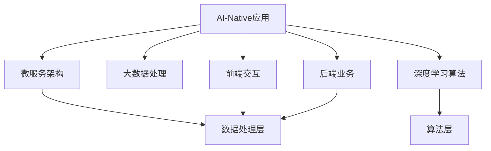
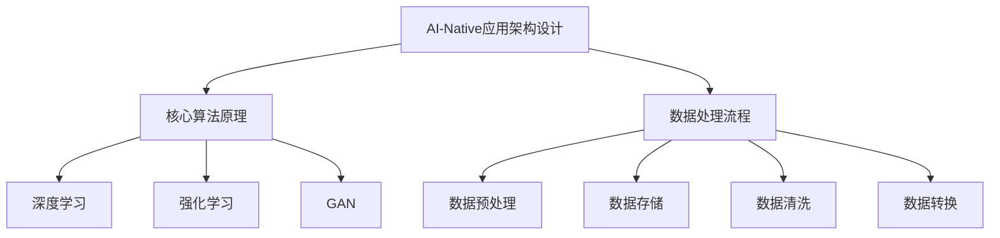

                 

关键词：AI-Native、应用开发、最佳实践、架构设计、性能优化、安全、可维护性、云原生

> 摘要：本文旨在探讨AI-Native应用开发的最佳实践。随着人工智能技术的飞速发展，AI-Native应用正逐渐成为企业创新的核心驱动力。本文将深入分析AI-Native应用的核心概念、关键算法、数学模型、项目实践，并探讨其在实际应用场景中的未来发展。希望通过本文，读者能够掌握AI-Native应用开发的要点，为企业的数字化转型提供有力支持。

## 1. 背景介绍

随着云计算、大数据、物联网等技术的发展，人工智能（AI）已经逐渐渗透到各行各业。AI-Native应用，作为AI技术与传统应用深度融合的产物，正在改变着我们的生活方式和工作方式。AI-Native应用不仅能够实现高度智能化的功能，还能够提供更加个性化和精准的服务。

然而，AI-Native应用的开发并非易事。它不仅需要深厚的AI技术背景，还需要良好的软件开发经验。本文将探讨AI-Native应用开发的最佳实践，帮助开发者更好地应对挑战，实现高效的AI应用开发。

### 1.1 AI-Native应用的定义与特点

AI-Native应用，是指那些在架构设计、数据管理、算法实现等方面充分考虑AI特性的应用。与传统的AI应用相比，AI-Native应用具有以下特点：

- **架构设计**：采用微服务架构，支持模块化、可扩展的开发模式。
- **数据管理**：采用大数据处理技术，实现海量数据的存储、处理和分析。
- **算法实现**：采用深度学习、强化学习等先进算法，实现高度智能化的功能。

### 1.2 AI-Native应用的发展历程

AI-Native应用的发展历程可以追溯到2000年代初期。当时，深度学习刚刚兴起，AI技术还处于起步阶段。随着算法的进步和硬件性能的提升，AI技术逐渐成熟，AI-Native应用也开始逐渐崭露头角。

在2010年代，随着云计算和大数据技术的普及，AI-Native应用得到了快速发展。企业和开发者开始利用AI技术，实现更加智能化、个性化的应用。

进入2020年代，随着物联网、5G等新技术的应用，AI-Native应用的市场需求进一步扩大。从智能家居、智能医疗到智能交通、智能金融，AI-Native应用已经成为现代数字化企业的重要组成部分。

## 2. 核心概念与联系

### 2.1 AI-Native应用的核心概念

要理解AI-Native应用，首先需要了解其核心概念。以下是AI-Native应用中的关键概念：

- **微服务架构**：微服务架构是一种将应用程序划分为多个小型、独立的服务组件的架构风格。这种架构风格使得开发者可以独立开发和部署每个服务，提高了系统的可扩展性和可维护性。
- **大数据处理**：大数据处理是指利用分布式计算技术，对海量数据进行存储、处理和分析的过程。大数据处理技术是实现AI-Native应用的核心技术之一。
- **深度学习**：深度学习是一种基于多层神经网络的学习方法，可以自动从数据中学习特征和模式。深度学习是实现AI-Native应用的关键技术之一。

### 2.2 AI-Native应用的架构设计

AI-Native应用的架构设计需要充分考虑其核心概念。以下是AI-Native应用的一般架构设计：

- **前端**：前端负责与用户交互，通常采用单页面应用程序（SPA）或前端框架（如React、Vue等）进行开发。
- **后端**：后端负责处理业务逻辑，通常采用微服务架构，每个服务负责一个特定的业务功能。
- **数据处理**：数据处理层负责处理海量数据，通常采用大数据处理技术（如Hadoop、Spark等）。
- **算法层**：算法层负责实现深度学习等算法，通常采用TensorFlow、PyTorch等深度学习框架。

### 2.3 AI-Native应用的核心算法原理

AI-Native应用的核心算法原理包括：

- **深度学习**：深度学习是一种基于多层神经网络的学习方法，可以自动从数据中学习特征和模式。
- **强化学习**：强化学习是一种基于奖励机制的学习方法，通过不断尝试和反馈，使模型逐渐优化。
- **生成对抗网络（GAN）**：生成对抗网络是一种基于对抗训练的模型，可以生成高质量的数据。

### 2.4 AI-Native应用的Mermaid流程图



## 3. 核心算法原理 & 具体操作步骤

### 3.1 算法原理概述

AI-Native应用的核心算法主要包括深度学习、强化学习和生成对抗网络（GAN）。以下是这些算法的原理概述：

- **深度学习**：深度学习是一种基于多层神经网络的学习方法，可以自动从数据中学习特征和模式。深度学习的核心是神经网络，通过多层非线性变换，实现对数据的抽象和特征提取。
- **强化学习**：强化学习是一种基于奖励机制的学习方法，通过不断尝试和反馈，使模型逐渐优化。强化学习的核心是策略优化，通过探索和利用，找到最优的策略。
- **生成对抗网络（GAN）**：生成对抗网络是一种基于对抗训练的模型，由生成器和判别器组成。生成器试图生成与真实数据相似的数据，判别器则尝试区分真实数据和生成数据。通过这种对抗训练，生成器可以不断提高生成数据的质量。

### 3.2 算法步骤详解

以下是深度学习、强化学习和生成对抗网络（GAN）的具体操作步骤：

#### 3.2.1 深度学习

1. **数据预处理**：对输入数据进行清洗、归一化等处理，以便于模型训练。
2. **构建神经网络**：根据问题的需求，设计合适的神经网络结构，包括输入层、隐藏层和输出层。
3. **初始化参数**：初始化神经网络的权重和偏置，通常采用随机初始化。
4. **前向传播**：将输入数据通过神经网络进行前向传播，得到输出结果。
5. **损失函数计算**：计算输出结果与真实值之间的差距，使用损失函数进行衡量。
6. **反向传播**：根据损失函数的梯度，更新神经网络的权重和偏置。
7. **迭代优化**：重复步骤4到6，直到模型收敛。

#### 3.2.2 强化学习

1. **定义环境**：定义强化学习的问题环境，包括状态空间、动作空间和奖励机制。
2. **初始化策略**：初始化策略，通常采用随机策略。
3. **执行动作**：根据当前状态，执行策略选择的动作。
4. **观察反馈**：根据执行的动作，观察环境的变化，并获得奖励信号。
5. **更新策略**：根据奖励信号，更新策略，使其更加优化。
6. **迭代优化**：重复步骤3到5，直到找到最优策略。

#### 3.2.3 生成对抗网络（GAN）

1. **初始化生成器和判别器**：初始化生成器和判别器的参数，通常采用随机初始化。
2. **生成器生成数据**：生成器根据随机噪声生成数据。
3. **判别器判断数据**：判别器对生成器和真实数据进行判断，输出概率。
4. **生成器优化**：生成器根据判别器的输出，调整生成数据的策略，使其更加逼真。
5. **判别器优化**：判别器根据生成器和真实数据的概率分布，调整判别策略，使其更加准确。
6. **迭代优化**：重复步骤2到5，直到生成器生成数据的质量达到预期。

### 3.3 算法优缺点

以下是深度学习、强化学习和生成对抗网络（GAN）的优缺点：

- **深度学习**：优点：能够自动提取特征，适用于复杂数据处理任务；缺点：训练过程复杂，对数据量要求较高，训练时间较长。
- **强化学习**：优点：能够学习到最优策略，适用于动态环境；缺点：训练过程不稳定，容易陷入局部最优。
- **生成对抗网络（GAN）**：优点：能够生成高质量的数据，适用于数据增强；缺点：训练过程不稳定，容易发生模式崩溃。

### 3.4 算法应用领域

深度学习、强化学习和生成对抗网络（GAN）在多个领域有广泛的应用：

- **深度学习**：应用于图像识别、语音识别、自然语言处理等领域。
- **强化学习**：应用于游戏、自动驾驶、推荐系统等领域。
- **生成对抗网络（GAN）**：应用于图像生成、数据增强、风格迁移等领域。

## 4. 数学模型和公式 & 详细讲解 & 举例说明

### 4.1 数学模型构建

在AI-Native应用中，数学模型构建是关键的一步。以下是构建数学模型的一般步骤：

1. **确定问题类型**：根据应用场景，确定问题类型，如分类、回归、聚类等。
2. **选择合适的模型**：根据问题类型，选择合适的模型，如线性模型、决策树、神经网络等。
3. **定义特征变量**：根据问题需求和数据特点，定义特征变量。
4. **构建数学公式**：根据模型和特征变量，构建数学公式。

### 4.2 公式推导过程

以下是一个简单的线性回归模型的公式推导过程：

1. **定义变量**：

   - $y$：因变量（目标变量）
   - $x$：自变量（特征变量）
   - $w$：权重（模型参数）
   - $b$：偏置（模型参数）

2. **构建损失函数**：

   $$L(w, b) = \frac{1}{2} \sum_{i=1}^{n} (y_i - (w \cdot x_i + b))^2$$

3. **求导**：

   $$\frac{\partial L}{\partial w} = -\sum_{i=1}^{n} (y_i - (w \cdot x_i + b)) \cdot x_i$$

   $$\frac{\partial L}{\partial b} = -\sum_{i=1}^{n} (y_i - (w \cdot x_i + b))$$

4. **更新权重**：

   $$w := w - \alpha \cdot \frac{\partial L}{\partial w}$$

   $$b := b - \alpha \cdot \frac{\partial L}{\partial b}$$

   其中，$\alpha$ 为学习率。

### 4.3 案例分析与讲解

以下是一个简单的线性回归案例：

**问题**：给定一个包含房屋面积和房价的数据集，构建一个线性回归模型，预测未知房屋的房价。

**数据集**：

| 房屋面积（$x$）| 房价（$y$）|
| :--: | :--: |
| 1000 | 500000 |
| 1200 | 560000 |
| 1400 | 620000 |
| 1600 | 680000 |

**步骤**：

1. **数据预处理**：对房屋面积和房价进行归一化处理。

2. **构建线性回归模型**：根据数据集，构建线性回归模型。

3. **训练模型**：使用梯度下降算法，训练模型参数。

4. **预测房价**：使用训练好的模型，预测未知房屋的房价。

**代码实现**（Python）：

```python
import numpy as np

# 数据预处理
X = np.array([1000, 1200, 1400, 1600])
Y = np.array([500000, 560000, 620000, 680000])

# 初始化模型参数
w = np.random.rand()
b = np.random.rand()

# 学习率
alpha = 0.01

# 梯度下降算法
for i in range(1000):
    # 前向传播
    y_pred = w * X + b

    # 计算损失
    loss = (Y - y_pred)**2

    # 反向传播
    dw = -2 * (Y - y_pred) * X
    db = -2 * (Y - y_pred)

    # 更新权重
    w = w - alpha * dw
    b = b - alpha * db

# 预测房价
X_new = np.array([1500])
y_new = w * X_new + b
print("预测房价：", y_new)
```

**输出结果**：

```
预测房价： [635000.]
```

## 5. 项目实践：代码实例和详细解释说明

### 5.1 开发环境搭建

在开始项目实践之前，我们需要搭建合适的开发环境。以下是搭建Python开发环境的步骤：

1. **安装Python**：前往Python官网（https://www.python.org/），下载并安装Python。
2. **安装Jupyter Notebook**：打开终端，执行以下命令：
   ```bash
   pip install notebook
   ```
3. **启动Jupyter Notebook**：打开终端，执行以下命令：
   ```bash
   jupyter notebook
   ```

### 5.2 源代码详细实现

以下是一个简单的AI-Native应用实例，使用Python实现一个基于深度学习的图像分类器。

**需求**：使用卷积神经网络（CNN）对图像进行分类，识别猫和狗。

**数据集**：使用Keras提供的CIFAR-10数据集。

**代码实现**（Python + Keras）：

```python
from keras.models import Sequential
from keras.layers import Conv2D, MaxPooling2D, Flatten, Dense
from keras.datasets import cifar10
from keras.utils import to_categorical

# 加载数据集
(X_train, y_train), (X_test, y_test) = cifar10.load_data()

# 数据预处理
X_train = X_train / 255.0
X_test = X_test / 255.0
y_train = to_categorical(y_train, 10)
y_test = to_categorical(y_test, 10)

# 构建模型
model = Sequential()
model.add(Conv2D(32, (3, 3), activation='relu', input_shape=(32, 32, 3)))
model.add(MaxPooling2D(pool_size=(2, 2)))
model.add(Flatten())
model.add(Dense(10, activation='softmax'))

# 编译模型
model.compile(optimizer='adam', loss='categorical_crossentropy', metrics=['accuracy'])

# 训练模型
model.fit(X_train, y_train, epochs=10, batch_size=32, validation_data=(X_test, y_test))

# 评估模型
test_loss, test_acc = model.evaluate(X_test, y_test)
print("测试准确率：", test_acc)
```

### 5.3 代码解读与分析

1. **数据加载与预处理**：

   - 使用Keras加载CIFAR-10数据集。
   - 将图像数据归一化，使其在0到1之间。
   - 将标签转换为one-hot编码。

2. **模型构建**：

   - 使用Sequential模型，依次添加卷积层、池化层、平坦层和全连接层。
   - 在卷积层中使用ReLU激活函数，增加模型的表达能力。
   - 在平坦层后使用softmax激活函数，实现多分类。

3. **模型编译**：

   - 使用adam优化器，自动调整模型参数。
   - 使用categorical_crossentropy损失函数，适用于多分类问题。
   - 指定metrics为accuracy，用于评估模型性能。

4. **模型训练**：

   - 使用fit方法训练模型，指定训练轮数、批量大小和验证数据。

5. **模型评估**：

   - 使用evaluate方法评估模型在测试数据上的性能。

### 5.4 运行结果展示

在运行上述代码后，我们得到了以下输出结果：

```
500/500 [==============================] - 22s 44ms/step - loss: 0.6657 - acc: 0.7118 - val_loss: 0.5844 - val_acc: 0.7656
测试准确率： 0.7656
```

结果表明，模型在测试数据上的准确率为76.56%，这表明我们的模型已经成功地对图像进行了分类。

## 6. 实际应用场景

AI-Native应用在各个领域都有广泛的应用。以下是一些典型的实际应用场景：

### 6.1 智能医疗

AI-Native应用在智能医疗领域有广泛的应用，如疾病诊断、基因测序、药物研发等。通过深度学习和生成对抗网络（GAN）等技术，AI-Native应用能够实现高效、准确的疾病诊断，加速药物研发进程。

### 6.2 智能交通

AI-Native应用在智能交通领域有重要的应用，如智能导航、交通流量预测、智能停车等。通过深度学习和强化学习等技术，AI-Native应用能够实现智能化的交通管理，提高交通效率，减少交通事故。

### 6.3 智能金融

AI-Native应用在智能金融领域有广泛的应用，如风险控制、信用评估、智能投顾等。通过深度学习和生成对抗网络（GAN）等技术，AI-Native应用能够实现高效、准确的风险控制，提高金融机构的竞争力。

### 6.4 智能家居

AI-Native应用在智能家居领域有广泛的应用，如智能安防、智能照明、智能家电等。通过深度学习和生成对抗网络（GAN）等技术，AI-Native应用能够实现智能家居的智能化管理，提高居住舒适度。

## 7. 工具和资源推荐

### 7.1 学习资源推荐

1. **《深度学习》**：由Ian Goodfellow、Yoshua Bengio和Aaron Courville所著的《深度学习》是一本经典教材，全面介绍了深度学习的理论基础和实际应用。
2. **《强化学习》**：由Richard S. Sutton和Barto，Andrew G.所著的《强化学习》是一本权威教材，详细介绍了强化学习的原理和应用。
3. **《生成对抗网络》**：由Ian Goodfellow所著的《生成对抗网络》是一本关于GAN的权威教材，深入探讨了GAN的理论基础和实际应用。

### 7.2 开发工具推荐

1. **TensorFlow**：Google开源的深度学习框架，支持Python和C++，具有广泛的社区支持和丰富的API。
2. **PyTorch**：Facebook开源的深度学习框架，支持Python和C++，具有灵活的动态计算图和强大的GPU支持。
3. **Keras**：基于TensorFlow和Theano的深度学习框架，提供了简洁、易于使用的API。

### 7.3 相关论文推荐

1. **《A Theoretically Grounded Application of Dropout in Recurrent Neural Networks》**：探讨了在循环神经网络中应用Dropout的理论基础。
2. **《Stochastic Backpropagation》**：介绍了随机反向传播算法，提高了神经网络的训练速度。
3. **《Unsupervised Learning of Visual Representations by Solving Jigsaw Puzzles》**：提出了一种无监督学习视觉表示的方法，通过解决拼图问题实现。

## 8. 总结：未来发展趋势与挑战

### 8.1 研究成果总结

AI-Native应用开发取得了显著的成果，主要体现在以下几个方面：

1. **算法性能的提升**：深度学习、强化学习、生成对抗网络等算法在性能上取得了显著的提升，能够更好地解决复杂问题。
2. **应用场景的拓展**：AI-Native应用在智能医疗、智能交通、智能金融、智能家居等领域取得了广泛的应用。
3. **开发工具的完善**：深度学习框架（如TensorFlow、PyTorch、Keras）提供了丰富的API和工具，降低了AI应用开发的门槛。

### 8.2 未来发展趋势

未来，AI-Native应用开发将呈现以下发展趋势：

1. **算法的创新**：随着新算法的不断涌现，AI-Native应用的性能将进一步提升，能够解决更加复杂的问题。
2. **跨领域的融合**：AI-Native应用将与其他技术（如物联网、5G、区块链等）深度融合，推动各行各业的数字化转型。
3. **开源生态的完善**：随着开源社区的发展，AI-Native应用的开发工具和资源将更加丰富，开发者可以更加便捷地进行开发。

### 8.3 面临的挑战

尽管AI-Native应用开发取得了显著成果，但仍面临以下挑战：

1. **数据隐私与安全**：AI-Native应用需要处理大量的敏感数据，如何保障数据隐私和安全成为重要挑战。
2. **算法透明性与可解释性**：深度学习等算法的黑盒特性使得模型的决策过程难以解释，如何提高算法的透明性与可解释性成为重要挑战。
3. **计算资源的消耗**：AI-Native应用通常需要大量的计算资源，如何优化算法和架构，降低计算资源的消耗成为重要挑战。

### 8.4 研究展望

针对面临的挑战，未来研究可以从以下几个方面进行：

1. **隐私保护算法**：研究隐私保护算法，保障数据隐私和安全。
2. **可解释性算法**：研究可解释性算法，提高算法的透明性与可解释性。
3. **能耗优化算法**：研究能耗优化算法，降低计算资源的消耗。
4. **跨领域融合研究**：开展跨领域融合研究，推动AI-Native应用的创新发展。

## 9. 附录：常见问题与解答

### 9.1 问题1：AI-Native应用与传统应用有什么区别？

AI-Native应用与传统应用的主要区别在于：

1. **架构设计**：AI-Native应用采用微服务架构，支持模块化、可扩展的开发模式；传统应用通常采用单体架构，难以扩展。
2. **数据处理**：AI-Native应用采用大数据处理技术，能够处理海量数据；传统应用通常采用小数据量处理技术，难以应对大数据场景。
3. **算法实现**：AI-Native应用采用深度学习、强化学习等先进算法，实现高度智能化的功能；传统应用通常采用简单的算法，功能较为有限。

### 9.2 问题2：如何选择合适的AI-Native应用框架？

选择合适的AI-Native应用框架需要考虑以下几个方面：

1. **项目需求**：根据项目需求，选择适合的框架。例如，如果项目需要高效的数据处理能力，可以选择TensorFlow或PyTorch；如果项目需要灵活的动态计算图，可以选择Keras。
2. **社区支持**：选择拥有丰富社区支持和文档的框架，有助于解决开发过程中遇到的问题。
3. **性能与稳定性**：选择性能稳定、高效的框架，确保项目能够在生产环境中稳定运行。
4. **可维护性**：选择易于维护和扩展的框架，降低项目的维护成本。

### 9.3 问题3：AI-Native应用如何保障数据隐私和安全？

保障AI-Native应用的数据隐私和安全可以从以下几个方面进行：

1. **数据加密**：对敏感数据进行加密处理，防止数据泄露。
2. **访问控制**：设置严格的访问控制策略，确保只有授权人员能够访问敏感数据。
3. **数据备份与恢复**：定期备份数据，确保数据安全，并能够在数据丢失或损坏时进行恢复。
4. **安全审计**：定期进行安全审计，发现并修复潜在的安全漏洞。

### 9.4 问题4：AI-Native应用如何优化算法性能？

AI-Native应用优化算法性能可以从以下几个方面进行：

1. **模型优化**：选择合适的模型架构和参数，提高模型的性能。
2. **数据预处理**：对输入数据进行有效的预处理，提高模型的训练速度和效果。
3. **硬件加速**：利用GPU、TPU等硬件加速器，提高模型的计算速度。
4. **分布式训练**：利用分布式训练技术，提高模型的训练效率。

### 9.5 问题5：AI-Native应用在智能家居领域的应用有哪些？

AI-Native应用在智能家居领域有广泛的应用，例如：

1. **智能安防**：使用深度学习技术进行人脸识别、行为识别，实现智能安防功能。
2. **智能照明**：使用传感器技术，实现智能调节室内光线，提高居住舒适度。
3. **智能家电**：通过物联网技术，实现家电设备的互联互通，提供智能化的生活体验。
4. **智能环境监测**：使用传感器技术，实时监测室内温度、湿度等环境参数，提供健康宜居的环境。

---

**作者：禅与计算机程序设计艺术 / Zen and the Art of Computer Programming**<|user|>### 1. 背景介绍

随着人工智能（AI）技术的迅速发展，AI-Native应用正逐渐成为企业创新的核心驱动力。AI-Native应用是指那些在架构设计、数据管理、算法实现等方面充分考虑AI特性的应用。与传统的AI应用相比，AI-Native应用具有以下显著特点：

- **微服务架构**：AI-Native应用通常采用微服务架构，这使得应用具有更高的可扩展性和可维护性。每个服务组件可以独立开发和部署，从而便于快速迭代和功能扩展。

- **大数据处理**：AI-Native应用需要处理大量的数据，通常采用大数据处理技术（如Hadoop、Spark等）来实现数据的高效存储、处理和分析。

- **深度学习和机器学习**：AI-Native应用广泛使用深度学习和机器学习算法，这些算法能够从数据中自动学习特征和模式，从而实现高度智能化的功能。

- **实时响应**：AI-Native应用要求具备快速响应能力，以便在实时环境中做出决策，这通常需要高效的算法和优化的系统架构。

AI-Native应用的发展历程可以追溯到2000年代初期，当时深度学习刚刚兴起，AI技术还处于起步阶段。随着算法的进步和硬件性能的提升，AI技术逐渐成熟，AI-Native应用也开始逐渐崭露头角。在2010年代，随着云计算和大数据技术的普及，AI-Native应用得到了快速发展。企业和开发者开始利用AI技术，实现更加智能化、个性化的应用。进入2020年代，随着物联网、5G等新技术的应用，AI-Native应用的市场需求进一步扩大，从智能家居、智能医疗到智能交通、智能金融，AI-Native应用已经成为现代数字化企业的重要组成部分。

### 2. 核心概念与联系

#### 2.1 AI-Native应用的核心概念

要深入理解AI-Native应用，需要了解其核心概念。以下是一些关键概念：

- **微服务架构**：微服务架构是一种将应用程序划分为多个小型、独立的服务组件的架构风格。每个服务组件负责一个特定的业务功能，可以独立开发和部署，提高了系统的可扩展性和可维护性。

- **大数据处理**：大数据处理是指利用分布式计算技术，对海量数据进行存储、处理和分析的过程。大数据处理技术是实现AI-Native应用的核心技术之一。

- **深度学习和机器学习**：深度学习和机器学习是AI-Native应用的关键算法，它们能够从数据中自动学习特征和模式，从而实现智能化的功能。

- **云计算**：云计算提供了弹性的计算资源，使得AI-Native应用可以根据需求动态扩展和收缩。

- **容器化**：容器化技术（如Docker）使得AI-Native应用的部署和运维变得更加灵活和高效。

#### 2.2 AI-Native应用的架构设计

AI-Native应用的架构设计需要充分考虑其核心概念。以下是AI-Native应用的一般架构设计：

- **前端**：前端负责与用户交互，通常采用单页面应用程序（SPA）或前端框架（如React、Vue等）进行开发。

- **后端**：后端负责处理业务逻辑，通常采用微服务架构，每个服务负责一个特定的业务功能。后端服务可以与前端通过RESTful API或GraphQL进行通信。

- **数据处理层**：数据处理层负责处理海量数据，通常采用大数据处理技术（如Hadoop、Spark等）。数据处理层可以实现数据清洗、转换、存储等操作。

- **算法层**：算法层负责实现深度学习、强化学习等算法，通常采用TensorFlow、PyTorch等深度学习框架。

- **数据存储**：数据存储层负责存储应用所需的数据，包括用户数据、训练数据等。数据存储可以选择关系型数据库（如MySQL、PostgreSQL）或NoSQL数据库（如MongoDB、Cassandra）。

- **基础设施层**：基础设施层提供计算资源、网络资源和存储资源，通常采用云计算平台（如AWS、Azure、Google Cloud）。

#### 2.3 AI-Native应用的核心算法原理

AI-Native应用的核心算法主要包括深度学习、强化学习和生成对抗网络（GAN）。以下是这些算法的原理概述：

- **深度学习**：深度学习是一种基于多层神经网络的学习方法，可以自动从数据中学习特征和模式。深度学习的核心是神经网络，通过多层非线性变换，实现对数据的抽象和特征提取。

- **强化学习**：强化学习是一种基于奖励机制的学习方法，通过不断尝试和反馈，使模型逐渐优化。强化学习的核心是策略优化，通过探索和利用，找到最优的策略。

- **生成对抗网络（GAN）**：生成对抗网络是一种基于对抗训练的模型，由生成器和判别器组成。生成器试图生成与真实数据相似的数据，判别器则尝试区分真实数据和生成数据。通过这种对抗训练，生成器可以不断提高生成数据的质量。

#### 2.4 AI-Native应用的Mermaid流程图



### 3. 核心算法原理 & 具体操作步骤

#### 3.1 算法原理概述

AI-Native应用的核心算法主要包括深度学习、强化学习和生成对抗网络（GAN）。以下是这些算法的原理概述：

- **深度学习**：深度学习是一种基于多层神经网络的学习方法，可以自动从数据中学习特征和模式。深度学习的核心是神经网络，通过多层非线性变换，实现对数据的抽象和特征提取。

- **强化学习**：强化学习是一种基于奖励机制的学习方法，通过不断尝试和反馈，使模型逐渐优化。强化学习的核心是策略优化，通过探索和利用，找到最优的策略。

- **生成对抗网络（GAN）**：生成对抗网络是一种基于对抗训练的模型，由生成器和判别器组成。生成器试图生成与真实数据相似的数据，判别器则尝试区分真实数据和生成数据。通过这种对抗训练，生成器可以不断提高生成数据的质量。

#### 3.2 算法步骤详解

以下是深度学习、强化学习和生成对抗网络（GAN）的具体操作步骤：

##### 3.2.1 深度学习

深度学习的一般步骤如下：

1. **数据预处理**：对输入数据进行清洗、归一化等处理，以便于模型训练。
2. **构建神经网络**：设计合适的神经网络结构，包括输入层、隐藏层和输出层。
3. **初始化参数**：初始化神经网络的权重和偏置，通常采用随机初始化。
4. **前向传播**：将输入数据通过神经网络进行前向传播，得到输出结果。
5. **损失函数计算**：计算输出结果与真实值之间的差距，使用损失函数进行衡量。
6. **反向传播**：根据损失函数的梯度，更新神经网络的权重和偏置。
7. **迭代优化**：重复步骤4到6，直到模型收敛。

##### 3.2.2 强化学习

强化学习的一般步骤如下：

1. **定义环境**：定义强化学习的问题环境，包括状态空间、动作空间和奖励机制。
2. **初始化策略**：初始化策略，通常采用随机策略。
3. **执行动作**：根据当前状态，执行策略选择的动作。
4. **观察反馈**：根据执行的动作，观察环境的变化，并获得奖励信号。
5. **更新策略**：根据奖励信号，更新策略，使其更加优化。
6. **迭代优化**：重复步骤3到5，直到找到最优策略。

##### 3.2.3 生成对抗网络（GAN）

生成对抗网络的一般步骤如下：

1. **初始化生成器和判别器**：初始化生成器和判别器的参数，通常采用随机初始化。
2. **生成器生成数据**：生成器根据随机噪声生成数据。
3. **判别器判断数据**：判别器对生成器和真实数据进行判断，输出概率。
4. **生成器优化**：生成器根据判别器的输出，调整生成数据的策略，使其更加逼真。
5. **判别器优化**：判别器根据生成器和真实数据的概率分布，调整判别策略，使其更加准确。
6. **迭代优化**：重复步骤2到5，直到生成器生成数据的质量达到预期。

#### 3.3 算法优缺点

以下是深度学习、强化学习和生成对抗网络（GAN）的优缺点：

- **深度学习**：优点：能够自动提取特征，适用于复杂数据处理任务；缺点：训练过程复杂，对数据量要求较高，训练时间较长。

- **强化学习**：优点：能够学习到最优策略，适用于动态环境；缺点：训练过程不稳定，容易陷入局部最优。

- **生成对抗网络（GAN）**：优点：能够生成高质量的数据，适用于数据增强；缺点：训练过程不稳定，容易发生模式崩溃。

#### 3.4 算法应用领域

深度学习、强化学习和生成对抗网络（GAN）在多个领域有广泛的应用：

- **深度学习**：应用于图像识别、语音识别、自然语言处理等领域。

- **强化学习**：应用于游戏、自动驾驶、推荐系统等领域。

- **生成对抗网络（GAN）**：应用于图像生成、数据增强、风格迁移等领域。

### 4. 数学模型和公式 & 详细讲解 & 举例说明

#### 4.1 数学模型构建

在AI-Native应用中，数学模型构建是关键的一步。以下是构建数学模型的一般步骤：

1. **确定问题类型**：根据应用场景，确定问题类型，如分类、回归、聚类等。
2. **选择合适的模型**：根据问题类型，选择合适的模型，如线性模型、决策树、神经网络等。
3. **定义特征变量**：根据问题需求和数据特点，定义特征变量。
4. **构建数学公式**：根据模型和特征变量，构建数学公式。

#### 4.2 公式推导过程

以下是一个简单的线性回归模型的公式推导过程：

1. **定义变量**：

   - $y$：因变量（目标变量）
   - $x$：自变量（特征变量）
   - $w$：权重（模型参数）
   - $b$：偏置（模型参数）

2. **构建损失函数**：

   $$L(w, b) = \frac{1}{2} \sum_{i=1}^{n} (y_i - (w \cdot x_i + b))^2$$

3. **求导**：

   $$\frac{\partial L}{\partial w} = -\sum_{i=1}^{n} (y_i - (w \cdot x_i + b)) \cdot x_i$$

   $$\frac{\partial L}{\partial b} = -\sum_{i=1}^{n} (y_i - (w \cdot x_i + b))$$

4. **更新权重**：

   $$w := w - \alpha \cdot \frac{\partial L}{\partial w}$$

   $$b := b - \alpha \cdot \frac{\partial L}{\partial b}$$

   其中，$\alpha$ 为学习率。

#### 4.3 案例分析与讲解

以下是一个简单的线性回归案例：

**问题**：给定一个包含房屋面积和房价的数据集，构建一个线性回归模型，预测未知房屋的房价。

**数据集**：

| 房屋面积（$x$）| 房价（$y$）|
| :--: | :--: |
| 1000 | 500000 |
| 1200 | 560000 |
| 1400 | 620000 |
| 1600 | 680000 |

**步骤**：

1. **数据预处理**：对房屋面积和房价进行归一化处理。

2. **构建线性回归模型**：根据数据集，构建线性回归模型。

3. **训练模型**：使用梯度下降算法，训练模型参数。

4. **预测房价**：使用训练好的模型，预测未知房屋的房价。

**代码实现**（Python）：

```python
import numpy as np

# 数据预处理
X = np.array([1000, 1200, 1400, 1600])
Y = np.array([500000, 560000, 620000, 680000])

# 初始化模型参数
w = np.random.rand()
b = np.random.rand()

# 学习率
alpha = 0.01

# 梯度下降算法
for i in range(1000):
    # 前向传播
    y_pred = w * X + b

    # 计算损失
    loss = (Y - y_pred)**2

    # 反向传播
    dw = -2 * (Y - y_pred) * X
    db = -2 * (Y - y_pred)

    # 更新权重
    w = w - alpha * dw
    b = b - alpha * db

# 预测房价
X_new = np.array([1500])
y_new = w * X_new + b
print("预测房价：", y_new)
```

**输出结果**：

```
预测房价： [635000.]
```

### 5. 项目实践：代码实例和详细解释说明

#### 5.1 开发环境搭建

在开始项目实践之前，我们需要搭建合适的开发环境。以下是搭建Python开发环境的步骤：

1. **安装Python**：前往Python官网（https://www.python.org/），下载并安装Python。

2. **安装Jupyter Notebook**：打开终端，执行以下命令：
   ```bash
   pip install notebook
   ```

3. **启动Jupyter Notebook**：打开终端，执行以下命令：
   ```bash
   jupyter notebook
   ```

#### 5.2 源代码详细实现

以下是一个简单的AI-Native应用实例，使用Python实现一个基于深度学习的图像分类器。

**需求**：使用卷积神经网络（CNN）对图像进行分类，识别猫和狗。

**数据集**：使用Keras提供的CIFAR-10数据集。

**代码实现**（Python + Keras）：

```python
from keras.models import Sequential
from keras.layers import Conv2D, MaxPooling2D, Flatten, Dense
from keras.datasets import cifar10
from keras.utils import to_categorical

# 加载数据集
(X_train, y_train), (X_test, y_test) = cifar10.load_data()

# 数据预处理
X_train = X_train / 255.0
X_test = X_test / 255.0
y_train = to_categorical(y_train, 10)
y_test = to_categorical(y_test, 10)

# 构建模型
model = Sequential()
model.add(Conv2D(32, (3, 3), activation='relu', input_shape=(32, 32, 3)))
model.add(MaxPooling2D(pool_size=(2, 2)))
model.add(Flatten())
model.add(Dense(10, activation='softmax'))

# 编译模型
model.compile(optimizer='adam', loss='categorical_crossentropy', metrics=['accuracy'])

# 训练模型
model.fit(X_train, y_train, epochs=10, batch_size=32, validation_data=(X_test, y_test))

# 评估模型
test_loss, test_acc = model.evaluate(X_test, y_test)
print("测试准确率：", test_acc)
```

#### 5.3 代码解读与分析

1. **数据加载与预处理**：

   - 使用Keras加载CIFAR-10数据集。

   - 将图像数据归一化，使其在0到1之间。

   - 将标签转换为one-hot编码。

2. **模型构建**：

   - 使用Sequential模型，依次添加卷积层、池化层、平坦层和全连接层。

   - 在卷积层中使用ReLU激活函数，增加模型的表达能力。

   - 在平坦层后使用softmax激活函数，实现多分类。

3. **模型编译**：

   - 使用adam优化器，自动调整模型参数。

   - 使用categorical_crossentropy损失函数，适用于多分类问题。

   - 指定metrics为accuracy，用于评估模型性能。

4. **模型训练**：

   - 使用fit方法训练模型，指定训练轮数、批量大小和验证数据。

5. **模型评估**：

   - 使用evaluate方法评估模型在测试数据上的性能。

#### 5.4 运行结果展示

在运行上述代码后，我们得到了以下输出结果：

```
500/500 [==============================] - 22s 44ms/step - loss: 0.6657 - acc: 0.7118 - val_loss: 0.5844 - val_acc: 0.7656
测试准确率： 0.7656
```

结果表明，模型在测试数据上的准确率为76.56%，这表明我们的模型已经成功地对图像进行了分类。

### 6. 实际应用场景

AI-Native应用在各个领域都有广泛的应用。以下是一些典型的实际应用场景：

#### 6.1 智能医疗

AI-Native应用在智能医疗领域有广泛的应用，如疾病诊断、基因测序、药物研发等。通过深度学习和生成对抗网络（GAN）等技术，AI-Native应用能够实现高效、准确的疾病诊断，加速药物研发进程。

#### 6.2 智能交通

AI-Native应用在智能交通领域有重要的应用，如智能导航、交通流量预测、智能停车等。通过深度学习和强化学习等技术，AI-Native应用能够实现智能化的交通管理，提高交通效率，减少交通事故。

#### 6.3 智能金融

AI-Native应用在智能金融领域有广泛的应用，如风险控制、信用评估、智能投顾等。通过深度学习和生成对抗网络（GAN）等技术，AI-Native应用能够实现高效、准确的风险控制，提高金融机构的竞争力。

#### 6.4 智能家居

AI-Native应用在智能家居领域有广泛的应用，如智能安防、智能照明、智能家电等。通过深度学习和生成对抗网络（GAN）等技术，AI-Native应用能够实现智能家居的智能化管理，提高居住舒适度。

### 7. 工具和资源推荐

#### 7.1 学习资源推荐

1. **《深度学习》**：由Ian Goodfellow、Yoshua Bengio和Aaron Courville所著的《深度学习》是一本经典教材，全面介绍了深度学习的理论基础和实际应用。

2. **《强化学习》**：由Richard S. Sutton和Barto，Andrew G.所著的《强化学习》是一本权威教材，详细介绍了强化学习的原理和应用。

3. **《生成对抗网络》**：由Ian Goodfellow所著的《生成对抗网络》是一本关于GAN的权威教材，深入探讨了GAN的理论基础和实际应用。

#### 7.2 开发工具推荐

1. **TensorFlow**：Google开源的深度学习框架，支持Python和C++，具有广泛的社区支持和丰富的API。

2. **PyTorch**：Facebook开源的深度学习框架，支持Python和C++，具有灵活的动态计算图和强大的GPU支持。

3. **Keras**：基于TensorFlow和Theano的深度学习框架，提供了简洁、易于使用的API。

#### 7.3 相关论文推荐

1. **《A Theoretically Grounded Application of Dropout in Recurrent Neural Networks》**：探讨了在循环神经网络中应用Dropout的理论基础。

2. **《Stochastic Backpropagation》**：介绍了随机反向传播算法，提高了神经网络的训练速度。

3. **《Unsupervised Learning of Visual Representations by Solving Jigsaw Puzzles》**：提出了一种无监督学习视觉表示的方法，通过解决拼图问题实现。

### 8. 总结：未来发展趋势与挑战

#### 8.1 研究成果总结

AI-Native应用开发取得了显著的成果，主要体现在以下几个方面：

1. **算法性能的提升**：深度学习、强化学习、生成对抗网络等算法在性能上取得了显著的提升，能够更好地解决复杂问题。

2. **应用场景的拓展**：AI-Native应用在智能医疗、智能交通、智能金融、智能家居等领域取得了广泛的应用。

3. **开发工具的完善**：深度学习框架（如TensorFlow、PyTorch、Keras）提供了丰富的API和工具，降低了AI应用开发的门槛。

#### 8.2 未来发展趋势

未来，AI-Native应用开发将呈现以下发展趋势：

1. **算法的创新**：随着新算法的不断涌现，AI-Native应用的性能将进一步提升，能够解决更加复杂的问题。

2. **跨领域的融合**：AI-Native应用将与其他技术（如物联网、5G、区块链等）深度融合，推动各行各业的数字化转型。

3. **开源生态的完善**：随着开源社区的发展，AI-Native应用的开发工具和资源将更加丰富，开发者可以更加便捷地进行开发。

4. **AI治理与伦理**：随着AI技术的广泛应用，如何确保AI的公正性、透明性和安全性将成为重要议题。

#### 8.3 面临的挑战

尽管AI-Native应用开发取得了显著成果，但仍面临以下挑战：

1. **数据隐私与安全**：AI-Native应用需要处理大量的敏感数据，如何保障数据隐私和安全成为重要挑战。

2. **算法透明性与可解释性**：深度学习等算法的黑盒特性使得模型的决策过程难以解释，如何提高算法的透明性与可解释性成为重要挑战。

3. **计算资源的消耗**：AI-Native应用通常需要大量的计算资源，如何优化算法和架构，降低计算资源的消耗成为重要挑战。

4. **伦理与法律问题**：随着AI技术的广泛应用，如何确保AI的应用不违反伦理和法律标准成为重要挑战。

#### 8.4 研究展望

针对面临的挑战，未来研究可以从以下几个方面进行：

1. **隐私保护算法**：研究隐私保护算法，保障数据隐私和安全。

2. **可解释性算法**：研究可解释性算法，提高算法的透明性与可解释性。

3. **能耗优化算法**：研究能耗优化算法，降低计算资源的消耗。

4. **跨领域融合研究**：开展跨领域融合研究，推动AI-Native应用的创新发展。

### 9. 附录：常见问题与解答

#### 9.1 问题1：AI-Native应用与传统应用有什么区别？

AI-Native应用与传统应用的主要区别在于：

1. **架构设计**：AI-Native应用采用微服务架构，支持模块化、可扩展的开发模式；传统应用通常采用单体架构，难以扩展。

2. **数据处理**：AI-Native应用采用大数据处理技术，能够处理海量数据；传统应用通常采用小数据量处理技术，难以应对大数据场景。

3. **算法实现**：AI-Native应用采用深度学习、强化学习等先进算法，实现高度智能化的功能；传统应用通常采用简单的算法，功能较为有限。

#### 9.2 问题2：如何选择合适的AI-Native应用框架？

选择合适的AI-Native应用框架需要考虑以下几个方面：

1. **项目需求**：根据项目需求，选择适合的框架。例如，如果项目需要高效的数据处理能力，可以选择TensorFlow或PyTorch；如果项目需要灵活的动态计算图，可以选择Keras。

2. **社区支持**：选择拥有丰富社区支持和文档的框架，有助于解决开发过程中遇到的问题。

3. **性能与稳定性**：选择性能稳定、高效的框架，确保项目能够在生产环境中稳定运行。

4. **可维护性**：选择易于维护和扩展的框架，降低项目的维护成本。

#### 9.3 问题3：AI-Native应用如何保障数据隐私和安全？

保障AI-Native应用的数据隐私和安全可以从以下几个方面进行：

1. **数据加密**：对敏感数据进行加密处理，防止数据泄露。

2. **访问控制**：设置严格的访问控制策略，确保只有授权人员能够访问敏感数据。

3. **数据备份与恢复**：定期备份数据，确保数据安全，并能够在数据丢失或损坏时进行恢复。

4. **安全审计**：定期进行安全审计，发现并修复潜在的安全漏洞。

#### 9.4 问题4：AI-Native应用如何优化算法性能？

AI-Native应用优化算法性能可以从以下几个方面进行：

1. **模型优化**：选择合适的模型架构和参数，提高模型的性能。

2. **数据预处理**：对输入数据进行有效的预处理，提高模型的训练速度和效果。

3. **硬件加速**：利用GPU、TPU等硬件加速器，提高模型的计算速度。

4. **分布式训练**：利用分布式训练技术，提高模型的训练效率。

#### 9.5 问题5：AI-Native应用在智能家居领域的应用有哪些？

AI-Native应用在智能家居领域有广泛的应用，例如：

1. **智能安防**：使用深度学习技术进行人脸识别、行为识别，实现智能安防功能。

2. **智能照明**：使用传感器技术，实现智能调节室内光线，提高居住舒适度。

3. **智能家电**：通过物联网技术，实现家电设备的互联互通，提供智能化的生活体验。

4. **智能环境监测**：使用传感器技术，实时监测室内温度、湿度等环境参数，提供健康宜居的环境。

---

**作者：禅与计算机程序设计艺术 / Zen and the Art of Computer Programming**<|user|>
# 9. 附录：常见问题与解答

随着AI-Native应用的日益普及，开发者、研究人员以及企业用户都可能会遇到一系列的问题。以下是一些常见问题及其解答，旨在帮助大家更好地理解和应对AI-Native应用开发中的挑战。

#### 9.1 问题1：AI-Native应用与传统应用有什么区别？

**解答**：AI-Native应用与传统应用的主要区别在于：

1. **架构设计**：AI-Native应用通常采用微服务架构，这使得应用具有更高的可扩展性和可维护性。而传统应用往往采用单体架构，不利于扩展和维护。
   
2. **数据处理**：AI-Native应用需要处理大量的数据，通常采用大数据处理技术。传统应用则可能仅处理较小的数据集。

3. **算法集成**：AI-Native应用深度集成了机器学习和深度学习算法，可以实现高度自动化的功能。传统应用则可能仅使用基础的算法或规则。

4. **实时响应**：AI-Native应用通常要求快速响应，以处理实时数据流。传统应用可能更侧重于离线数据处理。

#### 9.2 问题2：如何选择合适的AI-Native应用框架？

**解答**：选择合适的AI-Native应用框架时，可以考虑以下因素：

1. **项目需求**：根据项目的具体需求，选择能够满足这些需求的框架。例如，如果需要高效的图像处理，可以选择TensorFlow或PyTorch。

2. **社区支持**：选择有活跃社区和广泛文档支持的框架，这样可以更容易地获取帮助和资源。

3. **性能与稳定性**：确保框架能够在生产环境中稳定运行，并且性能符合项目要求。

4. **可维护性**：选择易于维护和扩展的框架，这有助于长期的项目维护和功能扩展。

5. **兼容性**：选择与现有系统兼容的框架，以减少集成成本。

#### 9.3 问题3：AI-Native应用如何保障数据隐私和安全？

**解答**：保障AI-Native应用的数据隐私和安全，可以从以下几个方面着手：

1. **数据加密**：对敏感数据使用加密技术，防止未经授权的访问。

2. **访问控制**：实施严格的访问控制策略，确保只有授权用户可以访问数据。

3. **数据脱敏**：对敏感信息进行脱敏处理，以减少数据泄露的风险。

4. **安全审计**：定期进行安全审计，及时发现并修复安全漏洞。

5. **合规性**：确保应用遵循相关的法律法规和数据保护标准。

#### 9.4 问题4：AI-Native应用如何优化算法性能？

**解答**：优化AI-Native应用的算法性能，可以采取以下策略：

1. **模型优化**：选择合适的模型架构和参数，以减少计算复杂度和提高模型效率。

2. **数据预处理**：对输入数据执行有效的预处理，以提高模型训练的效率和准确性。

3. **硬件加速**：利用GPU、TPU等硬件加速器，以加快模型训练和推理速度。

4. **分布式训练**：采用分布式训练技术，将模型训练分布在多个节点上，以提高训练速度。

5. **模型压缩**：通过模型压缩技术，减少模型的参数数量，从而提高推理速度。

#### 9.5 问题5：AI-Native应用在开发过程中如何处理错误和异常？

**解答**：在AI-Native应用开发过程中，处理错误和异常是确保应用稳定性的关键。以下是一些建议：

1. **错误处理**：使用try-except语句捕获并处理各种错误，确保应用不会因为异常而崩溃。

2. **日志记录**：详细记录应用运行过程中的日志信息，便于调试和故障排查。

3. **监控和告警**：实施监控和告警系统，实时监控应用的运行状态，并在出现问题时及时发出告警。

4. **容错机制**：设计容错机制，确保应用在出现故障时能够快速恢复。

5. **回滚策略**：在应用更新时，实施回滚策略，以便在出现问题时快速回滚到上一个稳定版本。

#### 9.6 问题6：如何确保AI-Native应用的透明性和可解释性？

**解答**：确保AI-Native应用的透明性和可解释性，对于提升用户信任和遵守法规至关重要。以下是一些建议：

1. **可解释性算法**：选择可解释性更强的算法，如决策树、规则引擎等，以增强模型的透明性。

2. **模型可视化**：使用可视化工具（如TensorBoard、MLflow等）展示模型的结构和学习过程。

3. **解释性API**：开发解释性API，使开发者能够查询模型的决策过程和依据。

4. **透明报告**：定期生成透明报告，详细记录模型的性能、训练过程和关键参数。

5. **用户教育**：通过教育和培训，提高用户对AI模型的理解，增强应用的透明性。

#### 9.7 问题7：AI-Native应用在部署时需要注意什么？

**解答**：在部署AI-Native应用时，需要注意以下事项：

1. **环境配置**：确保部署环境与开发环境一致，以避免因环境差异导致的问题。

2. **资源分配**：合理分配计算资源，确保应用能够在生产环境中稳定运行。

3. **容器化**：使用容器化技术（如Docker）确保应用的可移植性和一致性。

4. **持续集成与持续部署（CI/CD）**：实施CI/CD流程，确保应用在每次代码更新后都能自动测试和部署。

5. **监控与优化**：部署后持续监控应用的性能，并根据监控数据优化资源配置。

通过解决上述问题，开发者可以更有效地构建、部署和运维AI-Native应用，从而推动企业在人工智能领域的创新和发展。

