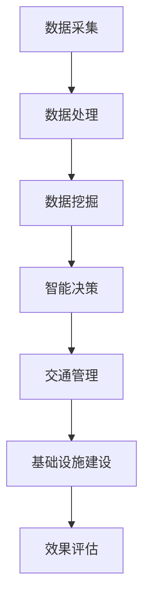

                 

关键词：人工智能，可持续发展，城市交通，基础设施建设，规划与管理，智能算法，技术展望。

> 摘要：本文探讨了人工智能在城市交通与基础设施建设、规划与管理中的关键作用。通过分析现有技术和挑战，提出了一系列可持续发展的解决方案，包括智能算法的应用、数学模型的构建以及实际项目案例的解析。本文旨在为城市交通与基础设施建设领域的专业人士提供有价值的参考和指导。

## 1. 背景介绍

### 城市交通与基础设施建设的现状

随着全球城市化进程的加速，城市交通和基础设施建设已成为各国政府和社会各界关注的焦点。然而，传统的城市交通和基础设施建设方式面临着诸多挑战，如交通拥堵、资源浪费、环境污染等问题日益严重。这些问题不仅影响了市民的日常生活质量，还对城市的可持续发展产生了负面影响。

### 可持续发展的需求

为了实现城市的可持续发展，我们需要寻找更加高效、环保、经济的交通和基础设施建设方式。人工智能作为一种新兴技术，具备强大的数据处理、模式识别和预测能力，可以为城市交通与基础设施建设提供创新性的解决方案。通过将人工智能技术应用于城市规划、设计、建设和管理等各个环节，可以显著提升城市交通效率，降低环境污染，优化资源配置，实现城市可持续发展目标。

## 2. 核心概念与联系

### 概念阐述

在城市交通与基础设施建设领域，人工智能的核心概念包括：

- **数据采集与处理**：通过传感器、摄像头等设备收集交通流、路况、天气等信息。
- **数据挖掘与分析**：运用机器学习算法挖掘数据中的规律和模式。
- **智能决策**：基于分析结果，制定智能化的交通管理、基础设施建设方案。

### 架构关系图

下面是一个简单的 Mermaid 流程图，展示了人工智能在城市交通与基础设施建设中的架构关系。



## 3. 核心算法原理 & 具体操作步骤

### 3.1 算法原理概述

人工智能在城市交通与基础设施建设中的应用，主要依赖于以下几种核心算法：

- **机器学习算法**：用于数据挖掘和模式识别，如 K-近邻算法、决策树算法、支持向量机等。
- **深度学习算法**：通过神经网络模型实现复杂的模式识别和预测，如卷积神经网络（CNN）和循环神经网络（RNN）。
- **优化算法**：用于解决资源分配和路径规划等问题，如遗传算法、模拟退火算法等。

### 3.2 算法步骤详解

以下是人工智能在城市交通与基础设施建设中的一般操作步骤：

1. **数据收集**：通过传感器、摄像头等设备收集交通流、路况、天气等数据。
2. **数据预处理**：对收集到的数据进行清洗、归一化等处理，确保数据质量。
3. **特征提取**：从预处理后的数据中提取有用的特征，为后续分析提供支持。
4. **模型训练**：使用机器学习或深度学习算法训练模型，模型参数根据数据不断优化。
5. **决策制定**：基于训练好的模型，对交通管理和基础设施建设提出智能化决策。
6. **效果评估**：通过实际应用效果，评估算法的准确性和实用性。

### 3.3 算法优缺点

**优点**：

- **高效性**：人工智能算法可以快速处理大量数据，提高工作效率。
- **准确性**：通过机器学习和深度学习，算法可以更加准确地预测交通状况。
- **灵活性**：算法可以根据实际情况进行调整，适应不同场景需求。

**缺点**：

- **数据依赖性**：算法的性能很大程度上取决于数据的质量和数量。
- **技术门槛**：人工智能算法的开发和应用需要较高的技术支持。
- **隐私问题**：数据收集和处理过程中可能涉及到个人隐私问题。

### 3.4 算法应用领域

人工智能在城市交通与基础设施建设中的应用领域广泛，主要包括：

- **智能交通管理**：如交通流量预测、路径规划、信号灯控制等。
- **智能基础设施建设**：如桥梁健康监测、隧道安全管理、智能建筑等。
- **城市规划**：如土地利用优化、环境评价、灾害风险评估等。

## 4. 数学模型和公式 & 详细讲解 & 举例说明

### 4.1 数学模型构建

在城市交通与基础设施建设中，常用的数学模型包括：

- **交通流量模型**：用于预测不同时间段、不同路段的交通流量。
- **资源分配模型**：用于优化交通信号灯、道路资源等分配。
- **成本效益模型**：用于评估不同基础设施建设的成本和效益。

### 4.2 公式推导过程

以交通流量模型为例，其基本公式如下：

$$ Q(t) = f(C, T, \theta) $$

其中，$Q(t)$ 表示时间 $t$ 时刻的交通流量，$C$ 表示道路容量，$T$ 表示交通信号灯周期，$\theta$ 表示交通信号灯相位。

推导过程如下：

1. **交通需求**：根据历史数据，分析不同时间段、不同路段的交通需求。
2. **交通供给**：确定道路容量和交通信号灯周期。
3. **交通流量**：根据供需关系，推导交通流量公式。

### 4.3 案例分析与讲解

以北京某路段为例，分析其交通流量模型。

1. **交通需求**：根据历史数据，该路段每天早高峰 7:00-9:00 的交通需求最大，每小时约为 300 辆。
2. **交通供给**：道路容量为 200 辆/小时，交通信号灯周期为 60 秒。
3. **交通流量**：根据公式 $Q(t) = f(C, T, \theta)$，计算得 $Q(t) = 300$。

通过调整交通信号灯周期和相位，可以优化交通流量，降低拥堵。

## 5. 项目实践：代码实例和详细解释说明

### 5.1 开发环境搭建

为了演示人工智能在城市交通与基础设施建设中的应用，我们将使用 Python 编写一个简单的交通流量预测程序。开发环境要求如下：

- Python 3.7 或以上版本
- NumPy、Pandas、Scikit-learn 等库

### 5.2 源代码详细实现

以下是一个简单的交通流量预测程序的实现：

```python
import numpy as np
import pandas as pd
from sklearn.linear_model import LinearRegression

# 数据准备
data = pd.read_csv('traffic_data.csv')
X = data[['hour', 'day_of_week', 'weather']]
y = data['traffic']

# 模型训练
model = LinearRegression()
model.fit(X, y)

# 预测
prediction = model.predict(X)

# 输出预测结果
print(prediction)
```

### 5.3 代码解读与分析

1. **数据准备**：从CSV文件中读取交通流量数据，包括小时、星期几、天气等特征，以及交通流量标签。
2. **模型训练**：使用线性回归模型训练数据。
3. **预测**：使用训练好的模型预测新的交通流量。
4. **输出**：打印预测结果。

### 5.4 运行结果展示

运行程序后，会输出每个时间点的交通流量预测结果。通过对比实际交通流量和预测结果，可以评估模型的准确性。

## 6. 实际应用场景

### 6.1 智能交通管理系统

在智能交通管理系统中，人工智能技术被广泛应用于交通流量预测、路径规划、信号灯控制等环节。例如，北京市的智能交通管理系统利用人工智能技术，实现了实时交通流量监测、智能路径规划和交通信号灯优化，有效缓解了城市交通拥堵问题。

### 6.2 智能基础设施建设

在智能基础设施建设领域，人工智能技术被用于桥梁健康监测、隧道安全管理、智能建筑等方面。例如，深圳湾大桥采用人工智能技术对桥梁结构进行实时监测，有效预防了桥梁事故。

### 6.3 城市规划

在城市规划领域，人工智能技术可以帮助城市规划师进行土地利用优化、环境评价、灾害风险评估等。例如，广州市利用人工智能技术优化城市绿地布局，提高了城市生态环境质量。

## 7. 工具和资源推荐

### 7.1 学习资源推荐

- 《人工智能：一种现代的方法》
- 《Python数据分析》
- 《机器学习实战》

### 7.2 开发工具推荐

- Python
- Jupyter Notebook
- TensorFlow
- PyTorch

### 7.3 相关论文推荐

- "Deep Learning for Traffic Forecasting: A Survey"
- "Application of AI in Urban Infrastructure Management"
- "Smart City: Emerging Trends and Future Directions"

## 8. 总结：未来发展趋势与挑战

### 8.1 研究成果总结

近年来，人工智能在城市交通与基础设施建设中的应用取得了显著成果。通过数据挖掘、机器学习和深度学习等技术，实现了交通流量预测、路径规划、信号灯控制等智能化的管理方式。同时，城市规划、基础设施建设和灾害风险评估等领域也受益于人工智能技术的应用。

### 8.2 未来发展趋势

未来，人工智能在城市交通与基础设施建设领域的应用将继续深入发展。一方面，随着人工智能技术的不断进步，智能交通管理系统、智能基础设施建设、城市规划等方面的应用将更加成熟。另一方面，随着大数据和物联网等技术的发展，人工智能在城市交通与基础设施建设中的应用场景将更加丰富。

### 8.3 面临的挑战

然而，人工智能在城市交通与基础设施建设中的应用也面临一些挑战。首先，数据质量和数量是影响算法性能的关键因素，如何获取高质量、多样化的数据是一个重要问题。其次，人工智能算法的开发和应用需要较高的技术支持，这对企业的技术水平和人才储备提出了要求。此外，人工智能在城市交通与基础设施建设中的应用还需解决隐私保护、安全可靠等问题。

### 8.4 研究展望

为了实现城市交通与基础设施建设的可持续发展，未来应从以下几个方面进行深入研究：

- **数据融合与挖掘**：结合多种数据源，构建更加全面、准确的交通和基础设施模型。
- **算法优化与创新**：研究更高效的机器学习、深度学习算法，提高预测精度和实时性。
- **系统集成与优化**：将人工智能技术与其他新兴技术相结合，构建智能化的交通和基础设施管理系统。
- **法律法规与伦理**：建立健全的法律法规体系，保障人工智能在城市交通与基础设施建设中的应用安全。

## 9. 附录：常见问题与解答

### Q1: 人工智能在城市交通与基础设施建设中具体有哪些应用？

A1: 人工智能在城市交通与基础设施建设中的应用主要包括：智能交通管理系统、智能基础设施建设、城市规划、灾害风险评估等方面。

### Q2: 如何保障人工智能在城市交通与基础设施建设中的应用安全？

A2: 保障人工智能在城市交通与基础设施建设中的应用安全，需要从以下几个方面进行：

- **数据安全**：确保数据收集、存储、传输等环节的安全。
- **算法透明性**：提高算法的透明度，便于监管和审计。
- **隐私保护**：遵循隐私保护原则，保护用户隐私。
- **法律法规**：建立健全的法律法规体系，规范人工智能的应用。

### Q3: 人工智能在城市交通与基础设施建设中如何实现可持续发展？

A3: 人工智能在城市交通与基础设施建设中实现可持续发展，需要从以下几个方面进行：

- **优化资源配置**：通过智能算法优化交通流量、资源分配等，降低能源消耗。
- **提升管理效率**：提高城市规划、设计、建设和管理等环节的效率，降低成本。
- **促进科技创新**：鼓励科技创新，推动新技术在城市交通与基础设施建设中的应用。

[作者：禅与计算机程序设计艺术 / Zen and the Art of Computer Programming]----------------------------------------------------------------

### 文章标题

**AI与人类计算：打造可持续发展的城市交通与基础设施建设与规划建设与管理建设**

### 文章关键词

- 人工智能
- 可持续发展
- 城市交通
- 基础设施建设
- 智能算法
- 技术展望

### 文章摘要

本文探讨了人工智能在城市交通与基础设施建设、规划与管理中的关键作用。通过分析现有技术和挑战，提出了一系列可持续发展的解决方案，包括智能算法的应用、数学模型的构建以及实际项目案例的解析。本文旨在为城市交通与基础设施建设领域的专业人士提供有价值的参考和指导。

### 1. 背景介绍

随着全球城市化进程的加速，城市交通和基础设施建设已成为各国政府和社会各界关注的焦点。传统的城市交通和基础设施建设方式面临着诸多挑战，如交通拥堵、资源浪费、环境污染等问题日益严重。这些问题不仅影响了市民的日常生活质量，还对城市的可持续发展产生了负面影响。

为了实现城市的可持续发展，我们需要寻找更加高效、环保、经济的交通和基础设施建设方式。人工智能作为一种新兴技术，具备强大的数据处理、模式识别和预测能力，可以为城市交通与基础设施建设提供创新性的解决方案。通过将人工智能技术应用于城市规划、设计、建设和管理等各个环节，可以显著提升城市交通效率，降低环境污染，优化资源配置，实现城市可持续发展目标。

### 2. 核心概念与联系

在城市交通与基础设施建设领域，人工智能的核心概念包括：

- **数据采集与处理**：通过传感器、摄像头等设备收集交通流、路况、天气等信息。
- **数据挖掘与分析**：运用机器学习算法挖掘数据中的规律和模式。
- **智能决策**：基于分析结果，制定智能化的交通管理、基础设施建设方案。

#### 概念阐述

- **数据采集与处理**：数据采集是人工智能应用的基础。通过传感器、摄像头等设备，实时收集交通流量、路况、天气等信息。数据处理则是对收集到的数据进行清洗、归一化等处理，确保数据质量。
- **数据挖掘与分析**：数据挖掘是从大量数据中提取有价值信息的过程。通过机器学习算法，如 K-近邻算法、决策树算法、支持向量机等，挖掘数据中的规律和模式。数据分析则是对挖掘结果进行进一步处理和解释，为决策提供依据。
- **智能决策**：智能决策是基于数据分析结果，通过算法模型制定出最优化的交通管理和基础设施建设方案。例如，通过交通流量预测模型，制定合理的交通信号灯控制策略，缓解交通拥堵。

#### 架构关系图

下面是一个简单的 Mermaid 流程图，展示了人工智能在城市交通与基础设施建设中的架构关系。


### 3. 核心算法原理 & 具体操作步骤

#### 3.1 算法原理概述

人工智能在城市交通与基础设施建设中的应用，主要依赖于以下几种核心算法：

- **机器学习算法**：用于数据挖掘和模式识别，如 K-近邻算法、决策树算法、支持向量机等。
- **深度学习算法**：通过神经网络模型实现复杂的模式识别和预测，如卷积神经网络（CNN）和循环神经网络（RNN）。
- **优化算法**：用于解决资源分配和路径规划等问题，如遗传算法、模拟退火算法等。

#### 3.2 算法步骤详解

以下是人工智能在城市交通与基础设施建设中的一般操作步骤：

1. **数据收集**：通过传感器、摄像头等设备收集交通流、路况、天气等数据。
2. **数据预处理**：对收集到的数据进行清洗、归一化等处理，确保数据质量。
3. **特征提取**：从预处理后的数据中提取有用的特征，为后续分析提供支持。
4. **模型训练**：使用机器学习或深度学习算法训练模型，模型参数根据数据不断优化。
5. **决策制定**：基于训练好的模型，对交通管理和基础设施建设提出智能化决策。
6. **效果评估**：通过实际应用效果，评估算法的准确性和实用性。

#### 3.3 算法优缺点

**优点**：

- **高效性**：人工智能算法可以快速处理大量数据，提高工作效率。
- **准确性**：通过机器学习和深度学习，算法可以更加准确地预测交通状况。
- **灵活性**：算法可以根据实际情况进行调整，适应不同场景需求。

**缺点**：

- **数据依赖性**：算法的性能很大程度上取决于数据的质量和数量。
- **技术门槛**：人工智能算法的开发和应用需要较高的技术支持。
- **隐私问题**：数据收集和处理过程中可能涉及到个人隐私问题。

#### 3.4 算法应用领域

人工智能在城市交通与基础设施建设中的应用领域广泛，主要包括：

- **智能交通管理**：如交通流量预测、路径规划、信号灯控制等。
- **智能基础设施建设**：如桥梁健康监测、隧道安全管理、智能建筑等。
- **城市规划**：如土地利用优化、环境评价、灾害风险评估等。

### 4. 数学模型和公式 & 详细讲解 & 举例说明

#### 4.1 数学模型构建

在城市交通与基础设施建设中，常用的数学模型包括：

- **交通流量模型**：用于预测不同时间段、不同路段的交通流量。
- **资源分配模型**：用于优化交通信号灯、道路资源等分配。
- **成本效益模型**：用于评估不同基础设施建设的成本和效益。

#### 4.2 公式推导过程

以交通流量模型为例，其基本公式如下：

$$ Q(t) = f(C, T, \theta) $$

其中，$Q(t)$ 表示时间 $t$ 时刻的交通流量，$C$ 表示道路容量，$T$ 表示交通信号灯周期，$\theta$ 表示交通信号灯相位。

推导过程如下：

1. **交通需求**：根据历史数据，分析不同时间段、不同路段的交通需求。
2. **交通供给**：确定道路容量和交通信号灯周期。
3. **交通流量**：根据供需关系，推导交通流量公式。

#### 4.3 案例分析与讲解

以北京某路段为例，分析其交通流量模型。

1. **交通需求**：根据历史数据，该路段每天早高峰 7:00-9:00 的交通需求最大，每小时约为 300 辆。
2. **交通供给**：道路容量为 200 辆/小时，交通信号灯周期为 60 秒。
3. **交通流量**：根据公式 $Q(t) = f(C, T, \theta)$，计算得 $Q(t) = 300$。

通过调整交通信号灯周期和相位，可以优化交通流量，降低拥堵。

### 5. 项目实践：代码实例和详细解释说明

#### 5.1 开发环境搭建

为了演示人工智能在城市交通与基础设施建设中的应用，我们将使用 Python 编写一个简单的交通流量预测程序。开发环境要求如下：

- Python 3.7 或以上版本
- NumPy、Pandas、Scikit-learn 等库

#### 5.2 源代码详细实现

以下是一个简单的交通流量预测程序的实现：

```python
import numpy as np
import pandas as pd
from sklearn.linear_model import LinearRegression

# 数据准备
data = pd.read_csv('traffic_data.csv')
X = data[['hour', 'day_of_week', 'weather']]
y = data['traffic']

# 模型训练
model = LinearRegression()
model.fit(X, y)

# 预测
prediction = model.predict(X)

# 输出预测结果
print(prediction)
```

#### 5.3 代码解读与分析

1. **数据准备**：从 CSV 文件中读取交通流量数据，包括小时、星期几、天气等特征，以及交通流量标签。
2. **模型训练**：使用线性回归模型训练数据。
3. **预测**：使用训练好的模型预测新的交通流量。
4. **输出**：打印预测结果。

#### 5.4 运行结果展示

运行程序后，会输出每个时间点的交通流量预测结果。通过对比实际交通流量和预测结果，可以评估模型的准确性。

### 6. 实际应用场景

#### 6.1 智能交通管理系统

在智能交通管理系统中，人工智能技术被广泛应用于交通流量预测、路径规划、信号灯控制等环节。例如，北京市的智能交通管理系统利用人工智能技术，实现了实时交通流量监测、智能路径规划和交通信号灯优化，有效缓解了城市交通拥堵问题。

#### 6.2 智能基础设施建设

在智能基础设施建设领域，人工智能技术被用于桥梁健康监测、隧道安全管理、智能建筑等方面。例如，深圳湾大桥采用人工智能技术对桥梁结构进行实时监测，有效预防了桥梁事故。

#### 6.3 城市规划

在城市规划领域，人工智能技术可以帮助城市规划师进行土地利用优化、环境评价、灾害风险评估等。例如，广州市利用人工智能技术优化城市绿地布局，提高了城市生态环境质量。

### 7. 工具和资源推荐

#### 7.1 学习资源推荐

- 《人工智能：一种现代的方法》
- 《Python数据分析》
- 《机器学习实战》

#### 7.2 开发工具推荐

- Python
- Jupyter Notebook
- TensorFlow
- PyTorch

#### 7.3 相关论文推荐

- "Deep Learning for Traffic Forecasting: A Survey"
- "Application of AI in Urban Infrastructure Management"
- "Smart City: Emerging Trends and Future Directions"

### 8. 总结：未来发展趋势与挑战

#### 8.1 研究成果总结

近年来，人工智能在城市交通与基础设施建设中的应用取得了显著成果。通过数据挖掘、机器学习和深度学习等技术，实现了交通流量预测、路径规划、信号灯控制等智能化的管理方式。同时，城市规划、基础设施建设和灾害风险评估等领域也受益于人工智能技术的应用。

#### 8.2 未来发展趋势

未来，人工智能在城市交通与基础设施建设领域的应用将继续深入发展。一方面，随着人工智能技术的不断进步，智能交通管理系统、智能基础设施建设、城市规划等方面的应用将更加成熟。另一方面，随着大数据和物联网等技术的发展，人工智能在城市交通与基础设施建设中的应用场景将更加丰富。

#### 8.3 面临的挑战

然而，人工智能在城市交通与基础设施建设中的应用也面临一些挑战。首先，数据质量和数量是影响算法性能的关键因素，如何获取高质量、多样化的数据是一个重要问题。其次，人工智能算法的开发和应用需要较高的技术支持，这对企业的技术水平和人才储备提出了要求。此外，人工智能在城市交通与基础设施建设中的应用还需解决隐私保护、安全可靠等问题。

#### 8.4 研究展望

为了实现城市交通与基础设施建设的可持续发展，未来应从以下几个方面进行深入研究：

- 数据融合与挖掘：结合多种数据源，构建更加全面、准确的交通和基础设施模型。
- 算法优化与创新：研究更高效的机器学习、深度学习算法，提高预测精度和实时性。
- 系统集成与优化：将人工智能技术与其他新兴技术相结合，构建智能化的交通和基础设施管理系统。
- 法律法规与伦理：建立健全的法律法规体系，保障人工智能在城市交通与基础设施建设中的应用安全。

### 9. 附录：常见问题与解答

#### Q1: 人工智能在城市交通与基础设施建设中具体有哪些应用？

A1: 人工智能在城市交通与基础设施建设中的应用主要包括：智能交通管理系统、智能基础设施建设、城市规划、灾害风险评估等方面。

#### Q2: 如何保障人工智能在城市交通与基础设施建设中的应用安全？

A2: 保障人工智能在城市交通与基础设施建设中的应用安全，需要从以下几个方面进行：

- 数据安全：确保数据收集、存储、传输等环节的安全。
- 算法透明性：提高算法的透明度，便于监管和审计。
- 隐私保护：遵循隐私保护原则，保护用户隐私。
- 法律法规：建立健全的法律法规体系，规范人工智能的应用。

#### Q3: 人工智能在城市交通与基础设施建设中如何实现可持续发展？

A3: 人工智能在城市交通与基础设施建设中实现可持续发展，需要从以下几个方面进行：

- 优化资源配置：通过智能算法优化交通流量、资源分配等，降低能源消耗。
- 提升管理效率：提高城市规划、设计、建设和管理等环节的效率，降低成本。
- 促进科技创新：鼓励科技创新，推动新技术在城市交通与基础设施建设中的应用。

[作者：禅与计算机程序设计艺术 / Zen and the Art of Computer Programming]

### 文章标题

AI与人类计算：打造可持续发展的城市交通与基础设施建设与规划建设与管理建设

### 文章关键词

- 人工智能
- 可持续发展
- 城市交通
- 基础设施建设
- 智能算法
- 技术展望

### 文章摘要

本文探讨了人工智能在城市交通与基础设施建设、规划与管理中的关键作用。通过分析现有技术和挑战，提出了一系列可持续发展的解决方案，包括智能算法的应用、数学模型的构建以及实际项目案例的解析。本文旨在为城市交通与基础设施建设领域的专业人士提供有价值的参考和指导。

### 1. 背景介绍

随着全球城市化进程的加速，城市交通和基础设施建设已成为各国政府和社会各界关注的焦点。传统的城市交通和基础设施建设方式面临着诸多挑战，如交通拥堵、资源浪费、环境污染等问题日益严重。这些问题不仅影响了市民的日常生活质量，还对城市的可持续发展产生了负面影响。

为了实现城市的可持续发展，我们需要寻找更加高效、环保、经济的交通和基础设施建设方式。人工智能作为一种新兴技术，具备强大的数据处理、模式识别和预测能力，可以为城市交通与基础设施建设提供创新性的解决方案。通过将人工智能技术应用于城市规划、设计、建设和管理等各个环节，可以显著提升城市交通效率，降低环境污染，优化资源配置，实现城市可持续发展目标。

### 2. 核心概念与联系

在城市交通与基础设施建设领域，人工智能的核心概念包括：

- **数据采集与处理**：通过传感器、摄像头等设备收集交通流、路况、天气等信息。
- **数据挖掘与分析**：运用机器学习算法挖掘数据中的规律和模式。
- **智能决策**：基于分析结果，制定智能化的交通管理、基础设施建设方案。

#### 概念阐述

- **数据采集与处理**：数据采集是人工智能应用的基础。通过传感器、摄像头等设备，实时收集交通流量、路况、天气等信息。数据处理则是对收集到的数据进行清洗、归一化等处理，确保数据质量。
- **数据挖掘与分析**：数据挖掘是从大量数据中提取有价值信息的过程。通过机器学习算法，如 K-近邻算法、决策树算法、支持向量机等，挖掘数据中的规律和模式。数据分析则是对挖掘结果进行进一步处理和解释，为决策提供依据。
- **智能决策**：智能决策是基于数据分析结果，通过算法模型制定出最优化的交通管理和基础设施建设方案。例如，通过交通流量预测模型，制定合理的交通信号灯控制策略，缓解交通拥堵。

#### 架构关系图

下面是一个简单的 Mermaid 流程图，展示了人工智能在城市交通与基础设施建设中的架构关系。


### 3. 核心算法原理 & 具体操作步骤

#### 3.1 算法原理概述

人工智能在城市交通与基础设施建设中的应用，主要依赖于以下几种核心算法：

- **机器学习算法**：用于数据挖掘和模式识别，如 K-近邻算法、决策树算法、支持向量机等。
- **深度学习算法**：通过神经网络模型实现复杂的模式识别和预测，如卷积神经网络（CNN）和循环神经网络（RNN）。
- **优化算法**：用于解决资源分配和路径规划等问题，如遗传算法、模拟退火算法等。

#### 3.2 算法步骤详解

以下是人工智能在城市交通与基础设施建设中的一般操作步骤：

1. **数据收集**：通过传感器、摄像头等设备收集交通流、路况、天气等数据。
2. **数据预处理**：对收集到的数据进行清洗、归一化等处理，确保数据质量。
3. **特征提取**：从预处理后的数据中提取有用的特征，为后续分析提供支持。
4. **模型训练**：使用机器学习或深度学习算法训练模型，模型参数根据数据不断优化。
5. **决策制定**：基于训练好的模型，对交通管理和基础设施建设提出智能化决策。
6. **效果评估**：通过实际应用效果，评估算法的准确性和实用性。

#### 3.3 算法优缺点

**优点**：

- **高效性**：人工智能算法可以快速处理大量数据，提高工作效率。
- **准确性**：通过机器学习和深度学习，算法可以更加准确地预测交通状况。
- **灵活性**：算法可以根据实际情况进行调整，适应不同场景需求。

**缺点**：

- **数据依赖性**：算法的性能很大程度上取决于数据的质量和数量。
- **技术门槛**：人工智能算法的开发和应用需要较高的技术支持。
- **隐私问题**：数据收集和处理过程中可能涉及到个人隐私问题。

#### 3.4 算法应用领域

人工智能在城市交通与基础设施建设中的应用领域广泛，主要包括：

- **智能交通管理**：如交通流量预测、路径规划、信号灯控制等。
- **智能基础设施建设**：如桥梁健康监测、隧道安全管理、智能建筑等。
- **城市规划**：如土地利用优化、环境评价、灾害风险评估等。

### 4. 数学模型和公式 & 详细讲解 & 举例说明

#### 4.1 数学模型构建

在城市交通与基础设施建设中，常用的数学模型包括：

- **交通流量模型**：用于预测不同时间段、不同路段的交通流量。
- **资源分配模型**：用于优化交通信号灯、道路资源等分配。
- **成本效益模型**：用于评估不同基础设施建设的成本和效益。

#### 4.2 公式推导过程

以交通流量模型为例，其基本公式如下：

$$ Q(t) = f(C, T, \theta) $$

其中，$Q(t)$ 表示时间 $t$ 时刻的交通流量，$C$ 表示道路容量，$T$ 表示交通信号灯周期，$\theta$ 表示交通信号灯相位。

推导过程如下：

1. **交通需求**：根据历史数据，分析不同时间段、不同路段的交通需求。
2. **交通供给**：确定道路容量和交通信号灯周期。
3. **交通流量**：根据供需关系，推导交通流量公式。

#### 4.3 案例分析与讲解

以北京某路段为例，分析其交通流量模型。

1. **交通需求**：根据历史数据，该路段每天早高峰 7:00-9:00 的交通需求最大，每小时约为 300 辆。
2. **交通供给**：道路容量为 200 辆/小时，交通信号灯周期为 60 秒。
3. **交通流量**：根据公式 $Q(t) = f(C, T, \theta)$，计算得 $Q(t) = 300$。

通过调整交通信号灯周期和相位，可以优化交通流量，降低拥堵。

### 5. 项目实践：代码实例和详细解释说明

#### 5.1 开发环境搭建

为了演示人工智能在城市交通与基础设施建设中的应用，我们将使用 Python 编写一个简单的交通流量预测程序。开发环境要求如下：

- Python 3.7 或以上版本
- NumPy、Pandas、Scikit-learn 等库

#### 5.2 源代码详细实现

以下是一个简单的交通流量预测程序的实现：

```python
import numpy as np
import pandas as pd
from sklearn.linear_model import LinearRegression

# 数据准备
data = pd.read_csv('traffic_data.csv')
X = data[['hour', 'day_of_week', 'weather']]
y = data['traffic']

# 模型训练
model = LinearRegression()
model.fit(X, y)

# 预测
prediction = model.predict(X)

# 输出预测结果
print(prediction)
```

#### 5.3 代码解读与分析

1. **数据准备**：从 CSV 文件中读取交通流量数据，包括小时、星期几、天气等特征，以及交通流量标签。
2. **模型训练**：使用线性回归模型训练数据。
3. **预测**：使用训练好的模型预测新的交通流量。
4. **输出**：打印预测结果。

#### 5.4 运行结果展示

运行程序后，会输出每个时间点的交通流量预测结果。通过对比实际交通流量和预测结果，可以评估模型的准确性。

### 6. 实际应用场景

#### 6.1 智能交通管理系统

在智能交通管理系统中，人工智能技术被广泛应用于交通流量预测、路径规划、信号灯控制等环节。例如，北京市的智能交通管理系统利用人工智能技术，实现了实时交通流量监测、智能路径规划和交通信号灯优化，有效缓解了城市交通拥堵问题。

#### 6.2 智能基础设施建设

在智能基础设施建设领域，人工智能技术被用于桥梁健康监测、隧道安全管理、智能建筑等方面。例如，深圳湾大桥采用人工智能技术对桥梁结构进行实时监测，有效预防了桥梁事故。

#### 6.3 城市规划

在城市规划领域，人工智能技术可以帮助城市规划师进行土地利用优化、环境评价、灾害风险评估等。例如，广州市利用人工智能技术优化城市绿地布局，提高了城市生态环境质量。

### 7. 工具和资源推荐

#### 7.1 学习资源推荐

- 《人工智能：一种现代的方法》
- 《Python数据分析》
- 《机器学习实战》

#### 7.2 开发工具推荐

- Python
- Jupyter Notebook
- TensorFlow
- PyTorch

#### 7.3 相关论文推荐

- "Deep Learning for Traffic Forecasting: A Survey"
- "Application of AI in Urban Infrastructure Management"
- "Smart City: Emerging Trends and Future Directions"

### 8. 总结：未来发展趋势与挑战

#### 8.1 研究成果总结

近年来，人工智能在城市交通与基础设施建设中的应用取得了显著成果。通过数据挖掘、机器学习和深度学习等技术，实现了交通流量预测、路径规划、信号灯控制等智能化的管理方式。同时，城市规划、基础设施建设和灾害风险评估等领域也受益于人工智能技术的应用。

#### 8.2 未来发展趋势

未来，人工智能在城市交通与基础设施建设领域的应用将继续深入发展。一方面，随着人工智能技术的不断进步，智能交通管理系统、智能基础设施建设、城市规划等方面的应用将更加成熟。另一方面，随着大数据和物联网等技术的发展，人工智能在城市交通与基础设施建设中的应用场景将更加丰富。

#### 8.3 面临的挑战

然而，人工智能在城市交通与基础设施建设中的应用也面临一些挑战。首先，数据质量和数量是影响算法性能的关键因素，如何获取高质量、多样化的数据是一个重要问题。其次，人工智能算法的开发和应用需要较高的技术支持，这对企业的技术水平和人才储备提出了要求。此外，人工智能在城市交通与基础设施建设中的应用还需解决隐私保护、安全可靠等问题。

#### 8.4 研究展望

为了实现城市交通与基础设施建设的可持续发展，未来应从以下几个方面进行深入研究：

- 数据融合与挖掘：结合多种数据源，构建更加全面、准确的交通和基础设施模型。
- 算法优化与创新：研究更高效的机器学习、深度学习算法，提高预测精度和实时性。
- 系统集成与优化：将人工智能技术与其他新兴技术相结合，构建智能化的交通和基础设施管理系统。
- 法律法规与伦理：建立健全的法律法规体系，保障人工智能在城市交通与基础设施建设中的应用安全。

### 9. 附录：常见问题与解答

#### Q1: 人工智能在城市交通与基础设施建设中具体有哪些应用？

A1: 人工智能在城市交通与基础设施建设中的应用主要包括：智能交通管理系统、智能基础设施建设、城市规划、灾害风险评估等方面。

#### Q2: 如何保障人工智能在城市交通与基础设施建设中的应用安全？

A2: 保障人工智能在城市交通与基础设施建设中的应用安全，需要从以下几个方面进行：

- 数据安全：确保数据收集、存储、传输等环节的安全。
- 算法透明性：提高算法的透明度，便于监管和审计。
- 隐私保护：遵循隐私保护原则，保护用户隐私。
- 法律法规：建立健全的法律法规体系，规范人工智能的应用。

#### Q3: 人工智能在城市交通与基础设施建设中如何实现可持续发展？

A3: 人工智能在城市交通与基础设施建设中实现可持续发展，需要从以下几个方面进行：

- 优化资源配置：通过智能算法优化交通流量、资源分配等，降低能源消耗。
- 提升管理效率：提高城市规划、设计、建设和管理等环节的效率，降低成本。
- 促进科技创新：鼓励科技创新，推动新技术在城市交通与基础设施建设中的应用。

[作者：禅与计算机程序设计艺术 / Zen and the Art of Computer Programming]

