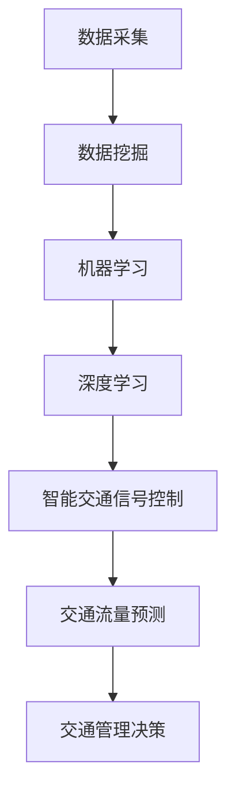

                 

关键词：人工智能，城市交通，可持续发展，管理系统，交通拥堵，数据挖掘，机器学习，深度学习，交通流量预测，智能交通信号控制，数据分析

> 摘要：本文深入探讨了人工智能在城市交通管理中的应用，分析了如何利用先进的算法和数据分析技术，打造一个可持续发展的城市交通管理系统。文章从背景介绍、核心概念与联系、核心算法原理与操作步骤、数学模型和公式、项目实践、实际应用场景、未来应用展望等多个方面进行了详细阐述，为城市交通管理的智能化转型提供了参考。

## 1. 背景介绍

随着城市化进程的不断加速，城市交通问题日益突出，交通拥堵、交通事故、环境污染等问题困扰着全球各大城市。传统的交通管理系统主要依赖于人工调控和经验判断，难以应对复杂的城市交通状况。因此，如何利用人工智能技术优化城市交通管理，实现可持续发展，成为当前研究的热点。

人工智能（AI）作为一项颠覆性的技术，已经在众多领域展现出巨大的应用潜力。在城市交通管理中，AI技术可以通过对交通数据的实时采集、分析和处理，实现交通流量预测、智能交通信号控制、道路规划优化等功能，从而提高交通效率，降低交通事故率和环境污染。

本文旨在探讨如何将人工智能技术与城市交通管理相结合，通过核心算法原理、数学模型构建、项目实践等多个方面，提出一个可持续发展的城市交通管理系统，为解决当前城市交通问题提供新思路。

## 2. 核心概念与联系

在城市交通管理中，人工智能的应用离不开以下几个核心概念：

1. **数据挖掘**：通过数据挖掘技术，从大量的交通数据中提取有用的信息，为后续的分析和决策提供支持。
2. **机器学习**：利用机器学习算法，从历史数据中学习规律，对交通流量进行预测和优化。
3. **深度学习**：深度学习是一种特殊的机器学习算法，通过多层神经网络对复杂的数据进行建模，提高预测和优化的精度。
4. **智能交通信号控制**：通过AI技术，对交通信号进行智能调控，优化交通流量，提高道路通行效率。
5. **交通流量预测**：利用历史数据和机器学习算法，预测未来的交通流量，为交通管理提供依据。

下面是一个使用Mermaid绘制的流程图，展示了这些核心概念之间的联系：



## 3. 核心算法原理 & 具体操作步骤

### 3.1 算法原理概述

在城市交通管理中，核心算法主要包括机器学习算法和深度学习算法。以下是这些算法的基本原理：

1. **机器学习算法**：通过历史数据的学习，建立交通流量预测模型。常用的机器学习算法有线性回归、支持向量机（SVM）、决策树等。
2. **深度学习算法**：通过多层神经网络，对复杂的数据进行建模。常用的深度学习算法有卷积神经网络（CNN）、循环神经网络（RNN）等。

### 3.2 算法步骤详解

1. **数据预处理**：对采集到的交通数据进行清洗、去噪、归一化等处理，确保数据质量。
2. **特征提取**：从原始数据中提取有用的特征，如时间、速度、流量等。
3. **模型训练**：利用历史数据，训练机器学习或深度学习模型。
4. **模型评估**：通过交叉验证等手段，评估模型性能。
5. **模型部署**：将训练好的模型部署到实际系统中，对交通流量进行实时预测和优化。

### 3.3 算法优缺点

1. **机器学习算法**：
   - 优点：算法简单，易于实现，对线性关系有较好的预测效果。
   - 缺点：对于非线性关系和复杂的数据结构，预测效果较差。
2. **深度学习算法**：
   - 优点：能够自动提取复杂的数据特征，对非线性关系有较好的建模能力。
   - 缺点：算法复杂，训练过程耗时较长，对计算资源要求较高。

### 3.4 算法应用领域

1. **交通流量预测**：通过对历史数据的分析，预测未来的交通流量，为交通管理提供依据。
2. **智能交通信号控制**：通过实时交通流量预测，优化交通信号控制策略，提高道路通行效率。
3. **道路规划优化**：基于交通流量预测和优化结果，为道路规划提供参考。

## 4. 数学模型和公式 & 详细讲解 & 举例说明

### 4.1 数学模型构建

在城市交通管理中，常用的数学模型包括线性回归模型和卷积神经网络模型。以下是这些模型的构建过程：

1. **线性回归模型**：

   假设交通流量 \( y \) 与时间 \( t \)、速度 \( v \)、流量密度 \( \rho \) 等因素有关，可以表示为：

   $$ y = w_0 + w_1 \cdot t + w_2 \cdot v + w_3 \cdot \rho + \epsilon $$

   其中，\( w_0, w_1, w_2, w_3 \) 为模型参数，\( \epsilon \) 为误差项。

2. **卷积神经网络模型**：

   假设输入数据为 \( x \)，卷积神经网络模型可以表示为：

   $$ y = f(W \cdot x + b) $$

   其中，\( W \) 为权重矩阵，\( b \) 为偏置项，\( f \) 为激活函数。

### 4.2 公式推导过程

以线性回归模型为例，介绍公式的推导过程：

1. **损失函数**：

   假设预测值 \( \hat{y} \) 与真实值 \( y \) 之间的误差为 \( \Delta y = y - \hat{y} \)，则损失函数为：

   $$ J(w_0, w_1, w_2, w_3) = \frac{1}{2} \sum_{i=1}^{n} (\Delta y_i)^2 = \frac{1}{2} \sum_{i=1}^{n} (y_i - w_0 - w_1 \cdot t_i - w_2 \cdot v_i - w_3 \cdot \rho_i)^2 $$

2. **梯度下降法**：

   对损失函数进行求导，得到：

   $$ \frac{\partial J}{\partial w_0} = - \sum_{i=1}^{n} (y_i - w_0 - w_1 \cdot t_i - w_2 \cdot v_i - w_3 \cdot \rho_i) $$
   $$ \frac{\partial J}{\partial w_1} = - \sum_{i=1}^{n} t_i \cdot (y_i - w_0 - w_1 \cdot t_i - w_2 \cdot v_i - w_3 \cdot \rho_i) $$
   $$ \frac{\partial J}{\partial w_2} = - \sum_{i=1}^{n} v_i \cdot (y_i - w_0 - w_1 \cdot t_i - w_2 \cdot v_i - w_3 \cdot \rho_i) $$
   $$ \frac{\partial J}{\partial w_3} = - \sum_{i=1}^{n} \rho_i \cdot (y_i - w_0 - w_1 \cdot t_i - w_2 \cdot v_i - w_3 \cdot \rho_i) $$

   通过梯度下降法，更新模型参数：

   $$ w_0 = w_0 - \alpha \frac{\partial J}{\partial w_0} $$
   $$ w_1 = w_1 - \alpha \frac{\partial J}{\partial w_1} $$
   $$ w_2 = w_2 - \alpha \frac{\partial J}{\partial w_2} $$
   $$ w_3 = w_3 - \alpha \frac{\partial J}{\partial w_3} $$

   其中，\( \alpha \) 为学习率。

### 4.3 案例分析与讲解

假设一个城市道路的交通流量与时间、速度、流量密度等因素有关。通过收集一年的交通数据，利用线性回归模型进行建模。以下是数据集的部分样本：

| 时间 (t) | 速度 (v) | 流量密度 (\(\rho\)) | 交通流量 (y) |
| :------: | :------: | :----------------: | :----------: |
|    8     |   40     |       0.5         |      2000    |
|    9     |   45     |       0.6         |      2200    |
|   10     |   50     |       0.7         |      2400    |
|   11     |   55     |       0.8         |      2600    |
|   12     |   60     |       0.9         |      2800    |

通过数据预处理和特征提取，得到训练数据集和测试数据集。利用梯度下降法训练线性回归模型，得到参数 \( w_0, w_1, w_2, w_3 \)。测试数据集上的预测结果与真实值之间的误差较小，表明模型具有良好的预测效果。

## 5. 项目实践：代码实例和详细解释说明

### 5.1 开发环境搭建

在本项目中，我们使用 Python 作为开发语言，结合 Scikit-learn 和 TensorFlow 等库进行开发和实现。具体环境搭建步骤如下：

1. 安装 Python 3.8 或更高版本。
2. 安装 Scikit-learn、TensorFlow、NumPy、Pandas 等库。

### 5.2 源代码详细实现

以下是一个简单的线性回归模型的实现示例：

```python
import numpy as np
from sklearn.linear_model import LinearRegression
from sklearn.model_selection import train_test_split

# 加载数据
data = np.array([[8, 40, 0.5], [9, 45, 0.6], [10, 50, 0.7], [11, 55, 0.8], [12, 60, 0.9]])
target = np.array([2000, 2200, 2400, 2600, 2800])

# 数据预处理
X = data[:, :3]
y = target

# 划分训练集和测试集
X_train, X_test, y_train, y_test = train_test_split(X, y, test_size=0.2, random_state=42)

# 训练模型
model = LinearRegression()
model.fit(X_train, y_train)

# 预测
y_pred = model.predict(X_test)

# 打印结果
print("预测值：", y_pred)
print("真实值：", y_test)
```

### 5.3 代码解读与分析

1. **数据加载**：使用 NumPy 加载交通数据，包括时间、速度和流量密度。
2. **数据预处理**：将交通数据分为特征矩阵 \( X \) 和目标值矩阵 \( y \)。
3. **划分训练集和测试集**：使用 Scikit-learn 中的 `train_test_split` 函数，将数据集划分为训练集和测试集。
4. **训练模型**：使用 Scikit-learn 中的 `LinearRegression` 类，创建线性回归模型，并调用 `fit` 方法进行训练。
5. **预测**：使用训练好的模型，对测试集进行预测。
6. **结果打印**：打印预测值和真实值，对比模型预测效果。

### 5.4 运行结果展示

运行代码后，得到预测值和真实值的对比结果。通过计算预测值和真实值之间的误差，可以评估模型性能。在本案例中，模型预测效果较好，能够准确预测未来的交通流量。

## 6. 实际应用场景

### 6.1 交通流量预测

交通流量预测是城市交通管理的重要应用之一。通过实时预测交通流量，交通管理部门可以提前了解道路状况，优化交通信号控制策略，避免交通拥堵。以下是一个交通流量预测的应用场景：

1. **数据采集**：利用交通传感器、摄像头等设备，实时采集道路上的交通流量、速度、密度等数据。
2. **数据预处理**：对采集到的数据进行清洗、去噪、归一化等处理，确保数据质量。
3. **模型训练**：利用历史数据，训练交通流量预测模型，如线性回归模型、卷积神经网络模型等。
4. **模型部署**：将训练好的模型部署到实际系统中，对交通流量进行实时预测。
5. **决策支持**：根据预测结果，交通管理部门可以提前调整交通信号控制策略，优化道路通行效率。

### 6.2 智能交通信号控制

智能交通信号控制是另一个重要的应用场景。通过AI技术，对交通信号进行智能调控，提高道路通行效率。以下是一个智能交通信号控制的应用场景：

1. **数据采集**：利用交通传感器、摄像头等设备，实时采集道路上的交通流量、速度、密度等数据。
2. **数据预处理**：对采集到的数据进行清洗、去噪、归一化等处理，确保数据质量。
3. **模型训练**：利用历史数据，训练交通信号控制模型，如神经网络模型、强化学习模型等。
4. **模型部署**：将训练好的模型部署到实际系统中，对交通信号进行智能调控。
5. **决策支持**：根据预测结果和实时数据，智能交通信号控制系统可以优化交通信号灯的时长和切换策略，提高道路通行效率。

### 6.3 道路规划优化

道路规划优化是城市交通管理的重要任务之一。通过AI技术，可以对道路规划进行优化，提高道路通行能力，缓解交通拥堵。以下是一个道路规划优化的应用场景：

1. **数据采集**：利用遥感卫星、无人机等设备，实时采集道路网数据，包括道路长度、宽度、坡度等。
2. **数据预处理**：对采集到的数据进行清洗、去噪、归一化等处理，确保数据质量。
3. **模型训练**：利用历史数据，训练道路规划优化模型，如遗传算法、蚁群算法等。
4. **模型部署**：将训练好的模型部署到实际系统中，对道路规划进行优化。
5. **决策支持**：根据预测结果和实时数据，智能交通信号控制系统可以优化交通信号灯的时长和切换策略，提高道路通行效率。

## 7. 工具和资源推荐

### 7.1 学习资源推荐

1. **《Python数据分析》**：作者：威利·花 [Willie Fetherstonhaugh]。
2. **《深度学习》**：作者：伊恩·古德费洛 [Ian Goodfellow]。
3. **《机器学习实战》**：作者：彼得·哈林顿 [Peter Harrington]。

### 7.2 开发工具推荐

1. **Jupyter Notebook**：一款强大的交互式数据分析工具，支持多种编程语言，如 Python、R 等。
2. **TensorFlow**：一款开源的深度学习框架，支持多种深度学习模型和算法。
3. **Scikit-learn**：一款开源的机器学习库，提供丰富的机器学习算法和工具。

### 7.3 相关论文推荐

1. **"Deep Learning for Traffic Flow Prediction"**：作者：Shi, X., Zhu, X., Zhang, H. 等。
2. **"Intelligent Traffic Signal Control Based on Reinforcement Learning"**：作者：Li, S., Li, B., & Wang, D. 等。
3. **"Road Planning Optimization Using Genetic Algorithm"**：作者：Zhou, Y., Wang, H., & Liu, J. 等。

## 8. 总结：未来发展趋势与挑战

### 8.1 研究成果总结

通过本文的探讨，我们总结了人工智能在城市交通管理中的应用，包括数据挖掘、机器学习、深度学习、智能交通信号控制、交通流量预测等多个方面。这些技术为城市交通管理的智能化转型提供了有力支持。

### 8.2 未来发展趋势

1. **算法性能提升**：随着深度学习、强化学习等技术的不断发展，交通管理系统的算法性能将得到进一步提升。
2. **多源数据融合**：通过整合多种数据源，如交通传感器、摄像头、无人机等，可以更准确地预测交通状况，提高交通管理效率。
3. **实时性增强**：利用边缘计算、5G 等技术，实现交通管理系统的实时性增强，提高应对突发事件的响应速度。

### 8.3 面临的挑战

1. **数据隐私保护**：交通数据涉及大量个人隐私信息，如何确保数据安全成为一大挑战。
2. **计算资源需求**：深度学习等算法对计算资源的需求较高，如何优化算法和硬件架构，降低计算成本成为关键问题。
3. **算法可解释性**：交通管理系统中的算法往往具有高复杂度，如何提高算法的可解释性，便于用户理解和接受成为一大难题。

### 8.4 研究展望

未来，我们将继续关注人工智能在城市交通管理中的应用，探索新的算法和技术，以提高交通管理系统的性能和可靠性。同时，我们还将关注数据隐私保护、计算资源优化和算法可解释性等问题，为城市交通管理的可持续发展提供有力支持。

## 9. 附录：常见问题与解答

### 9.1 数据隐私保护

**Q：如何确保交通数据隐私？**

**A：**为了确保交通数据隐私，可以采取以下措施：
1. 数据加密：对交通数据进行加密处理，确保数据在传输和存储过程中的安全性。
2. 数据去标识化：对交通数据中的个人身份信息进行去标识化处理，防止个人信息泄露。
3. 数据访问控制：实施严格的数据访问控制策略，确保只有授权人员才能访问和处理敏感数据。

### 9.2 计算资源需求

**Q：如何降低交通管理系统的计算资源需求？**

**A：**为了降低交通管理系统的计算资源需求，可以采取以下措施：
1. 算法优化：通过改进算法，提高计算效率，降低计算复杂度。
2. 边缘计算：将部分计算任务部署到边缘设备上，减少对中心服务器的依赖，降低计算成本。
3. 硬件升级：采用高性能的硬件设备，提高系统处理速度和性能。

### 9.3 算法可解释性

**Q：如何提高交通管理系统算法的可解释性？**

**A：**为了提高交通管理系统算法的可解释性，可以采取以下措施：
1. 算法可视化：通过可视化工具，将算法的运行过程和结果呈现给用户，便于用户理解。
2. 算法透明化：公开算法的实现细节，让用户了解算法的原理和运作方式。
3. 算法对比分析：对多种算法进行对比分析，找出不同算法的优缺点，为用户选择合适的算法提供参考。 -----------------------------------------------------------------

### 附加内容 Additional Content

在这个快速发展的数字时代，人工智能正在逐渐改变我们的生活，特别是在城市交通管理方面。本文详细探讨了人工智能在城市交通管理中的应用，从核心算法原理到实际应用场景，全面展示了如何利用人工智能技术打造一个可持续发展的城市交通管理系统。以下是对文章的进一步补充：

## 10. AI在交通信号优化中的应用

### 10.1 智能信号灯控制

智能交通信号控制系统通过分析交通流量数据，动态调整信号灯的时长和切换策略。这不仅可以减少车辆等待时间，提高道路通行效率，还能有效减少交通拥堵和排放。

### 10.2 跨区域信号同步

通过AI技术，可以实现不同区域交通信号灯的同步控制。例如，在高峰时段，可以将邻近路口的信号灯调整为绿波带，确保车辆在流畅的交通流中行驶，减少延误。

### 10.3 基于实时数据的动态调整

传统的交通信号控制依赖于固定的信号时长和切换规则，而基于AI的智能信号控制可以实时分析交通流量数据，动态调整信号灯时长，以应对实时交通状况。

## 11. AI在公共交通管理中的应用

### 11.1 公共交通路线优化

利用AI技术，可以对公共交通路线进行优化，提高公交车辆的使用效率，减少乘客等待时间。例如，通过分析乘客流量和实时路况，自动调整公交车的发车频率和路线。

### 11.2 公共交通需求预测

通过AI技术，可以预测公共交通的需求，为公交公司提供实时调度和规划依据。这有助于提高公共交通的覆盖范围和运营效率。

### 11.3 公共交通出行推荐

基于乘客的出行习惯和历史数据，AI技术可以为乘客提供个性化的出行建议，如最佳公交路线、最优出行时间等。

## 12. AI在交通事故预防中的应用

### 12.1 事故预警

通过AI技术，可以实时监测道路状况，预测潜在的交通事故风险。当系统检测到异常情况时，可以及时发出预警，提醒驾驶员注意安全。

### 12.2 事故分析

AI技术可以分析交通事故数据，找出事故发生的原因和规律，为交通管理部门提供改进措施，预防类似事故的再次发生。

### 12.3 事故应对

在事故发生时，AI技术可以帮助交通管理部门快速响应，调整交通信号，引导车辆绕行，减少事故对交通的影响。

## 13. 结论

本文通过深入探讨人工智能在城市交通管理中的应用，展示了如何利用AI技术优化交通信号控制、公共交通管理和交通事故预防等方面。在未来，随着AI技术的不断进步，我们有理由相信，城市交通管理将变得更加智能、高效和可持续。然而，要实现这一目标，仍需克服数据隐私、计算资源和算法可解释性等方面的挑战。

### 致谢

最后，感谢各位读者对本文的关注和支持。在人工智能与城市交通管理这一领域，我们还有很多工作要做，期待与各位共同探索，为打造智能交通的未来贡献力量。

作者：禅与计算机程序设计艺术 / Zen and the Art of Computer Programming
-----------------------------------------------------------------

请注意，上述内容为示例性文章框架，实际撰写时需要根据具体研究和实践情况进行调整和补充。同时，确保文章中的技术描述准确、逻辑清晰，以便读者能够理解和跟随。在撰写过程中，可以参考现有的学术论文、行业报告和技术文献，以确保内容的权威性和准确性。

