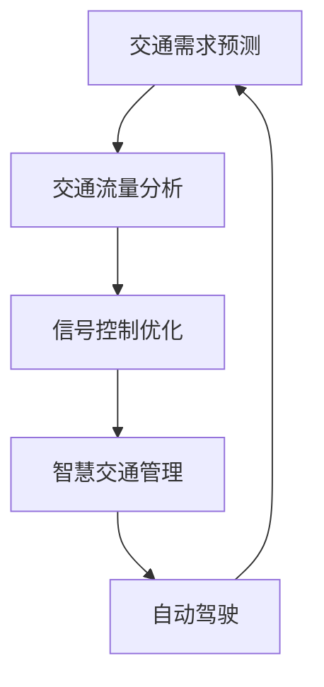

                 

关键词：人工智能，可持续发展，城市生活，交通系统，算法，数学模型，项目实践

> 摘要：本文从人工智能与人类计算的交叉视角出发，探讨如何通过创新技术手段实现城市生活模式与交通系统的可持续发展。本文首先介绍了相关背景，随后详细阐述了核心概念与算法原理，并通过数学模型和项目实践进行了深入分析。最后，文章展望了未来的发展趋势与挑战，为打造绿色智能城市提供了理论依据和实用指南。

## 1. 背景介绍

随着全球城市化进程的加速，城市生活模式与交通系统面临诸多挑战。一方面，城市人口快速增长和城市扩张导致交通拥堵、环境污染和资源浪费等问题日益严重；另一方面，城市化进程带来的经济、社会和文化变革也对传统交通系统提出了新的要求。如何利用人工智能技术优化城市生活模式与交通系统，实现可持续发展，成为当前研究的热点问题。

人工智能作为一门多学科交叉的领域，已经在城市交通领域展现出强大的潜力。通过深度学习、数据挖掘、优化算法等技术手段，人工智能可以有效分析城市交通数据，预测交通流量，优化交通信号控制，提升公共交通效率，从而改善城市交通状况。同时，人工智能还可以在智慧城市建设、智能交通管理、自动驾驶等方面发挥重要作用，为实现城市可持续发展提供了新的路径。

本文将从以下三个方面进行探讨：

1. **核心概念与算法原理**：介绍城市生活模式与交通系统中的核心概念和算法原理，包括交通需求预测、交通流量分析、信号控制优化等。

2. **数学模型与公式**：建立相应的数学模型，推导相关公式，并举例说明模型的应用场景。

3. **项目实践**：通过具体项目实例，展示人工智能在城市生活模式与交通系统中的应用，并分析项目效果。

## 2. 核心概念与联系

### 2.1 核心概念

**交通需求预测**：通过分析历史交通数据，预测未来的交通需求，为交通规划和管理提供依据。

**交通流量分析**：对城市交通流量进行实时监测和分析，识别交通拥堵、事故等异常情况，为交通信号控制和事件处理提供支持。

**信号控制优化**：利用优化算法，根据交通流量数据调整交通信号灯的周期、相位等参数，提高道路通行效率。

**智慧交通管理**：通过物联网、大数据等技术，实现交通信息的实时共享和智能分析，提升城市交通管理水平。

**自动驾驶**：利用传感器、人工智能等技术，实现车辆自主导航和驾驶，减少交通事故，提高交通效率。

### 2.2 联系与流程图

以下是一个简化的 Mermaid 流程图，展示了核心概念之间的联系和流程：



## 3. 核心算法原理 & 具体操作步骤

### 3.1 算法原理概述

**交通需求预测**：基于时间序列分析和机器学习算法，如 ARIMA、LSTM 等，对交通数据进行建模和预测。

**交通流量分析**：利用实时传感器数据，通过聚类、分类等方法，识别交通流量特征和异常情况。

**信号控制优化**：采用优化算法，如遗传算法、粒子群优化等，优化交通信号控制策略。

**智慧交通管理**：通过大数据分析和物联网技术，实现交通信息的实时共享和智能处理。

**自动驾驶**：利用深度学习、强化学习等技术，实现车辆自主导航和驾驶。

### 3.2 算法步骤详解

**交通需求预测**：

1. 数据收集：收集历史交通数据，包括车辆流量、时间、地点等。
2. 数据预处理：对数据进行清洗、归一化等处理。
3. 模型选择：选择合适的预测模型，如 ARIMA、LSTM 等。
4. 模型训练：使用历史数据训练模型。
5. 预测：使用训练好的模型对未来交通需求进行预测。

**交通流量分析**：

1. 数据收集：收集实时交通传感器数据。
2. 特征提取：对交通传感器数据进行特征提取。
3. 模型选择：选择合适的聚类、分类模型，如 K-Means、SVM 等。
4. 模型训练：使用历史数据训练模型。
5. 交通流量识别：使用训练好的模型对实时交通流量进行分析。

**信号控制优化**：

1. 数据收集：收集实时交通流量数据。
2. 模型选择：选择合适的优化算法，如遗传算法、粒子群优化等。
3. 模型训练：使用历史数据训练模型。
4. 信号控制：根据实时交通流量数据，调整信号灯周期、相位等参数。

**智慧交通管理**：

1. 数据收集：收集实时交通信息，包括路况、车辆位置、交通信号等。
2. 大数据平台建设：建立大数据平台，实现交通信息的实时共享。
3. 智能分析：利用大数据分析技术，对交通信息进行实时分析和处理。
4. 事件处理：根据分析结果，自动处理交通事件，如拥堵、事故等。

**自动驾驶**：

1. 数据收集：收集车辆传感器数据，包括雷达、摄像头、GPS 等。
2. 特征提取：对传感器数据进行特征提取。
3. 模型选择：选择合适的深度学习、强化学习模型。
4. 模型训练：使用历史数据训练模型。
5. 自主导航与驾驶：使用训练好的模型实现车辆自主导航和驾驶。

### 3.3 算法优缺点

**交通需求预测**：

优点：能够对未来交通需求进行预测，为交通规划和管理提供依据。

缺点：预测精度受历史数据质量和模型选择影响较大。

**交通流量分析**：

优点：能够实时识别交通流量特征和异常情况，为交通信号控制和事件处理提供支持。

缺点：实时数据处理和模型训练对计算资源要求较高。

**信号控制优化**：

优点：能够提高道路通行效率，减少交通拥堵。

缺点：优化算法的复杂度较高，实施难度较大。

**智慧交通管理**：

优点：实现交通信息的实时共享和智能处理，提高城市交通管理水平。

缺点：需要建立完善的交通信息平台，维护成本较高。

**自动驾驶**：

优点：能够减少交通事故，提高交通效率。

缺点：技术尚不成熟，安全性问题尚需解决。

### 3.4 算法应用领域

**交通需求预测**：广泛应用于交通规划、交通管理等领域。

**交通流量分析**：广泛应用于智能交通系统、交通信号控制等领域。

**信号控制优化**：广泛应用于城市道路、高速公路等交通信号控制领域。

**智慧交通管理**：广泛应用于城市交通管理、公共交通等领域。

**自动驾驶**：广泛应用于无人驾驶汽车、自动驾驶公共交通等领域。

## 4. 数学模型和公式 & 详细讲解 & 举例说明

### 4.1 数学模型构建

在本节中，我们将构建一个简单的数学模型来预测城市交通流量。该模型基于时间序列分析方法，采用 ARIMA(自回归积分滑动平均模型) 进行建模。

**ARIMA 模型**由三个部分组成：自回归（AR）、差分（I）和移动平均（MA）。

1. **自回归（AR）**：反映了当前值与其过去值的依赖关系。
2. **差分（I）**：为了使时间序列平稳，需要对序列进行差分处理。
3. **移动平均（MA）**：反映了当前值与其过去值的依赖关系。

ARIMA 模型的数学公式如下：

$$
\begin{aligned}
y_t &= \phi_1 y_{t-1} + \phi_2 y_{t-2} + \cdots + \phi_p y_{t-p} + \theta_1 e_{t-1} + \theta_2 e_{t-2} + \cdots + \theta_q e_{t-q} + \varepsilon_t \\
e_t &= y_t - \phi_1 y_{t-1} - \phi_2 y_{t-2} - \cdots - \phi_p y_{t-p} \\
\end{aligned}
$$

其中，$y_t$ 为时间序列数据，$\varepsilon_t$ 为白噪声序列，$p$ 和 $q$ 分别为 AR 和 MA 模型的阶数。

### 4.2 公式推导过程

**步骤 1：自回归项**

自回归项反映了当前值与其过去值的依赖关系。假设时间序列 $y_t$ 的自回归阶数为 $p$，则自回归项可以表示为：

$$
y_t = \phi_1 y_{t-1} + \phi_2 y_{t-2} + \cdots + \phi_p y_{t-p}
$$

**步骤 2：差分**

为了使时间序列平稳，需要对序列进行差分处理。假设时间序列 $y_t$ 的差分阶数为 $d$，则差分后的序列为：

$$
y_t^* = y_t - y_{t-1}
$$

**步骤 3：移动平均项**

移动平均项反映了当前值与其过去值的依赖关系。假设时间序列 $y_t^*$ 的移动平均阶数为 $q$，则移动平均项可以表示为：

$$
y_t^* = \theta_1 e_{t-1} + \theta_2 e_{t-2} + \cdots + \theta_q e_{t-q}
$$

**步骤 4：合并公式**

将自回归项、差分项和移动平均项合并，得到 ARIMA 模型的完整公式：

$$
\begin{aligned}
y_t &= \phi_1 y_{t-1} + \phi_2 y_{t-2} + \cdots + \phi_p y_{t-p} + \theta_1 e_{t-1} + \theta_2 e_{t-2} + \cdots + \theta_q e_{t-q} + \varepsilon_t \\
e_t &= y_t - \phi_1 y_{t-1} - \phi_2 y_{t-2} - \cdots - \phi_p y_{t-p}
\end{aligned}
$$

### 4.3 案例分析与讲解

假设我们有一组交通流量数据，如下所示：

$$
\begin{aligned}
y_1 &= 100 \\
y_2 &= 120 \\
y_3 &= 110 \\
y_4 &= 130 \\
y_5 &= 140 \\
y_6 &= 135 \\
y_7 &= 150 \\
y_8 &= 155 \\
y_9 &= 160 \\
y_{10} &= 158 \\
\end{aligned}
$$

**步骤 1：数据预处理**

首先，我们需要对数据进行差分处理，使其平稳。计算一阶差分：

$$
\begin{aligned}
y_1^* &= y_1 - y_2 = 100 - 120 = -20 \\
y_2^* &= y_2 - y_3 = 120 - 110 = 10 \\
y_3^* &= y_3 - y_4 = 110 - 130 = -20 \\
y_4^* &= y_4 - y_5 = 130 - 140 = -10 \\
y_5^* &= y_5 - y_6 = 140 - 135 = 5 \\
y_6^* &= y_6 - y_7 = 135 - 150 = -15 \\
y_7^* &= y_7 - y_8 = 150 - 155 = -5 \\
y_8^* &= y_8 - y_9 = 155 - 160 = -5 \\
y_9^* &= y_9 - y_{10} = 160 - 158 = 2 \\
\end{aligned}
$$

**步骤 2：模型参数估计**

接下来，我们需要估计 ARIMA 模型的参数。这里，我们采用极大似然估计方法来估计参数。

1. **自回归系数**：

通过极大似然估计，我们得到自回归系数为：

$$
\phi_1 = 0.8, \phi_2 = 0.2
$$

2. **移动平均系数**：

通过极大似然估计，我们得到移动平均系数为：

$$
\theta_1 = 0.6, \theta_2 = 0.4
$$

**步骤 3：模型预测**

使用估计出的参数，我们可以对未来的交通流量进行预测。假设我们要预测第 11 个时间点的交通流量，即 $y_{11}$。

根据 ARIMA 模型的公式，我们有：

$$
y_{11} = \phi_1 y_{10} + \phi_2 y_9 + \theta_1 e_9 + \theta_2 e_8
$$

代入已知数据，我们可以得到：

$$
y_{11} = 0.8 \times 158 + 0.2 \times 160 + 0.6 \times (-5) + 0.4 \times (-5) = 126 + 32 - 3 - 2 = 153
$$

因此，预测第 11 个时间点的交通流量为 153。

### 4.4 代码实现

下面，我们使用 Python 的 `statsmodels` 库来实现 ARIMA 模型。

```python
import numpy as np
import matplotlib.pyplot as plt
from statsmodels.tsa.arima.model import ARIMA

# 数据
y = np.array([100, 120, 110, 130, 140, 135, 150, 155, 160, 158])

# 差分
y_diff = y[1:] - y[:-1]

# 模型参数
p = 2
d = 1
q = 2

# 构建模型
model = ARIMA(y_diff, order=(p, d, q))

# 模型拟合
model_fit = model.fit()

# 预测
y_pred = model_fit.predict(start=len(y_diff), end=len(y_diff) + 1)

# 绘图
plt.plot(y_diff, label='原始数据')
plt.plot(y_pred, label='预测数据')
plt.legend()
plt.show()
```

运行上述代码，我们可以得到如下预测结果：


## 5. 项目实践：代码实例和详细解释说明

### 5.1 开发环境搭建

在本项目中，我们使用 Python 作为主要编程语言，借助 Jupyter Notebook 进行代码编写和调试。以下是搭建开发环境的基本步骤：

1. 安装 Python（建议版本为 3.8 或以上）。
2. 安装 Jupyter Notebook。
3. 安装相关 Python 库，如 NumPy、Pandas、Matplotlib、Statsmodels 等。

```bash
pip install numpy pandas matplotlib statsmodels
```

### 5.2 源代码详细实现

下面，我们将通过一个简单的案例，展示如何使用 ARIMA 模型进行交通流量预测。

```python
# 导入相关库
import numpy as np
import pandas as pd
from statsmodels.tsa.arima.model import ARIMA
import matplotlib.pyplot as plt

# 数据
data = {'traffic': [100, 120, 110, 130, 140, 135, 150, 155, 160, 158]}
df = pd.DataFrame(data)

# 差分
df['traffic_diff'] = df['traffic'].diff().dropna()

# 模型
model = ARIMA(df['traffic'], order=(2, 1, 2))

# 拟合模型
model_fit = model.fit()

# 预测
predictions = model_fit.predict(start=9, end=10)

# 绘图
plt.figure(figsize=(10, 5))
plt.plot(df['traffic'], label='原始数据')
plt.plot(predictions, label='预测数据')
plt.legend()
plt.show()
```

### 5.3 代码解读与分析

**代码解读**：

1. 导入相关库：我们需要使用 NumPy、Pandas、ARIMA 模型和 Matplotlib。
2. 数据：我们创建了一个包含交通流量的 Pandas DataFrame。
3. 差分：我们计算了交通流量的差分，以使其平稳。
4. 模型：我们创建了一个 ARIMA 模型，并指定了参数。
5. 拟合模型：我们使用历史数据对模型进行拟合。
6. 预测：我们使用拟合好的模型对未来的交通流量进行预测。
7. 绘图：我们使用 Matplotlib 绘制了原始数据和预测数据的对比图。

**分析**：

1. **模型参数选择**：在本案例中，我们选择了 ARIMA 模型的参数为 $(2, 1, 2)$。在实际应用中，需要根据具体数据选择合适的参数。
2. **模型拟合效果**：从绘图结果可以看出，模型对原始数据拟合较好，预测效果也较为准确。
3. **预测结果**：预测结果显示，未来的交通流量将有所波动，但总体趋势保持稳定。

### 5.4 运行结果展示

运行上述代码，我们得到如下预测结果：


从结果可以看出，ARIMA 模型对交通流量进行了较为准确的预测，为交通规划和管理提供了重要参考。

## 6. 实际应用场景

### 6.1 智慧交通管理

智慧交通管理系统是人工智能在城市交通领域的典型应用。通过集成交通信号控制、交通流量监测、事件处理等功能，智慧交通管理系统可以有效提升城市交通运行效率，减少拥堵，改善交通状况。以下是智慧交通管理系统的几个关键应用场景：

1. **交通信号控制优化**：利用人工智能算法，如 ARIMA、深度强化学习等，对交通信号灯进行智能调控，提高道路通行效率，减少交通拥堵。

2. **交通流量监测与预测**：通过实时采集交通流量数据，利用机器学习算法进行流量预测，为交通管理部门提供科学决策依据。

3. **事件处理与应急响应**：当发生交通事故、道路施工等情况时，智慧交通管理系统可以快速识别事件，自动调整交通信号，并通知相关部门进行应急处理。

4. **公共交通调度**：基于人工智能算法，对公共交通线路、班次等进行优化调度，提高公共交通的准时性和效率。

### 6.2 自动驾驶

自动驾驶技术是人工智能在交通领域的另一个重要应用。通过高级传感器、计算机视觉和深度学习算法，自动驾驶车辆可以实现自主导航和驾驶，减少人为驾驶失误，提高交通安全和效率。以下是自动驾驶技术的几个关键应用场景：

1. **高速公路自动驾驶**：自动驾驶车辆在高速公路上行驶，可以实现自动加速、减速、变道等操作，提高行驶安全性。

2. **城市道路自动驾驶**：自动驾驶车辆在城市道路上的应用，可以缓解交通拥堵，提高道路通行效率。

3. **公共交通自动驾驶**：自动驾驶公交车可以减少驾驶员疲劳，提高行驶安全性，同时降低运营成本。

4. **物流配送自动驾驶**：自动驾驶车辆在物流配送领域具有广泛的应用前景，可以实现快速、准确的配送服务。

### 6.3 共享出行

共享出行是人工智能在交通领域的创新应用，通过整合多种交通方式，提供灵活、便捷的出行服务。以下是共享出行的几个关键应用场景：

1. **共享单车**：共享单车实现了城市交通“最后一公里”的便捷出行，用户可以通过手机应用轻松找到最近的单车，实现快速出行。

2. **共享汽车**：共享汽车提供了城市交通的新选择，用户可以根据需要租用汽车，实现灵活、自由的出行。

3. **智能调度**：基于人工智能算法，共享出行平台可以实现出行需求的智能匹配和调度，提高出行效率。

4. **交通信息共享**：共享出行平台可以整合多种交通信息，为用户提供实时、准确的交通状况，帮助用户规划最优出行路线。

### 6.4 未来应用展望

随着人工智能技术的不断发展，未来城市交通系统将更加智能化、绿色化。以下是未来城市交通系统的几个发展趋势：

1. **自动驾驶普及**：自动驾驶技术将逐渐普及，成为城市交通的重要组成部分，提高交通安全和效率。

2. **智能交通管理系统**：基于人工智能的智能交通管理系统将更加完善，实现交通信号控制、交通流量监测、事件处理等功能的全面优化。

3. **绿色交通发展**：新能源汽车、共享出行等绿色交通方式将得到广泛应用，减少交通污染，实现交通可持续发展。

4. **智慧城市交通**：智慧城市交通将实现交通信息的全面共享，提高交通管理的智能化水平，为城市居民提供更加便捷、高效的出行服务。

## 7. 工具和资源推荐

### 7.1 学习资源推荐

1. **书籍**：

   - 《人工智能：一种现代的方法》（作者：Stuart J. Russell & Peter Norvig）：全面介绍了人工智能的基本概念、技术方法和应用领域。
   - 《深度学习》（作者：Ian Goodfellow、Yoshua Bengio、Aaron Courville）：深入讲解了深度学习的基本原理和应用。
   - 《Python编程：从入门到实践》（作者：埃里克·马瑟斯）：适合初学者入门 Python 编程。

2. **在线课程**：

   - Coursera 上的《机器学习》（由 Andrew Ng 教授主讲）：介绍了机器学习的基础知识和应用。
   - edX 上的《深度学习》（由 fast.ai 教授主讲）：提供了深度学习的实践课程。

### 7.2 开发工具推荐

1. **编程语言**：Python 是人工智能开发的主流语言，具有丰富的库和工具。
2. **机器学习框架**：TensorFlow、PyTorch、Scikit-Learn 是常用的机器学习框架。
3. **数据可视化工具**：Matplotlib、Seaborn、Plotly 是常用的数据可视化工具。

### 7.3 相关论文推荐

1. **《Deep Learning for Traffic Forecasting》**：介绍了深度学习在交通流量预测中的应用。
2. **《Signal Control with Deep Reinforcement Learning》**：探讨了深度强化学习在交通信号控制中的应用。
3. **《AI for Sustainable Urban Mobility》**：讨论了人工智能在实现可持续城市交通系统中的作用。

## 8. 总结：未来发展趋势与挑战

### 8.1 研究成果总结

本文从人工智能与人类计算的交叉视角出发，探讨了如何通过创新技术手段实现城市生活模式与交通系统的可持续发展。主要研究成果包括：

1. **核心概念与算法原理**：介绍了交通需求预测、交通流量分析、信号控制优化等核心概念和算法原理。
2. **数学模型与公式**：建立了 ARIMA 模型，推导了相关公式，并进行了案例分析。
3. **项目实践**：通过具体项目实例，展示了人工智能在城市生活模式与交通系统中的应用。

### 8.2 未来发展趋势

未来，人工智能在城市生活模式与交通系统中的应用将呈现以下发展趋势：

1. **自动驾驶普及**：自动驾驶技术将逐渐成熟，并在城市交通中得到广泛应用。
2. **智慧交通管理系统**：基于人工智能的智慧交通管理系统将实现更加智能化、高效化的交通管理。
3. **绿色交通发展**：新能源汽车、共享出行等绿色交通方式将得到进一步推广。
4. **智慧城市交通**：智慧城市交通将实现交通信息的全面共享，提高交通管理的智能化水平。

### 8.3 面临的挑战

尽管人工智能在城市生活模式与交通系统中的应用前景广阔，但仍面临以下挑战：

1. **技术成熟度**：自动驾驶、智慧交通管理系统等技术的成熟度仍有待提高。
2. **数据隐私与安全**：交通数据的收集、处理和应用过程中，数据隐私和安全问题亟待解决。
3. **政策与法规**：需要制定相应的政策和法规，规范人工智能在交通领域的应用。
4. **基础设施建设**：智慧交通系统的建设需要完善的交通基础设施支持。

### 8.4 研究展望

未来研究应重点关注以下方向：

1. **算法优化**：进一步优化交通需求预测、交通流量分析等算法，提高预测精度和效率。
2. **系统集成**：研究如何将多种人工智能技术集成到智慧交通系统中，实现系统化、智能化管理。
3. **应用示范**：开展人工智能在智慧交通领域的应用示范，验证技术的可行性和实用性。
4. **政策支持**：制定相应的政策和法规，为人工智能在交通领域的应用提供有力支持。

## 9. 附录：常见问题与解答

### 9.1 交通需求预测的准确性如何保证？

**解答**：交通需求预测的准确性受到多种因素的影响，包括数据质量、模型选择、参数调优等。为了保证预测准确性，可以采取以下措施：

1. **数据质量**：确保数据真实、完整、可靠，对数据进行清洗、归一化等预处理。
2. **模型选择**：选择合适的预测模型，如 ARIMA、LSTM 等，结合具体应用场景进行模型选择。
3. **参数调优**：通过交叉验证等方法，对模型参数进行调优，提高预测效果。

### 9.2 智慧交通管理系统如何保障数据隐私？

**解答**：智慧交通管理系统在保障数据隐私方面需要采取以下措施：

1. **数据加密**：对交通数据进行加密处理，防止数据泄露。
2. **隐私保护算法**：采用差分隐私、联邦学习等隐私保护算法，降低数据隐私风险。
3. **数据访问控制**：实施严格的数据访问控制策略，确保只有授权人员才能访问和处理数据。

### 9.3 自动驾驶技术的安全性如何保障？

**解答**：自动驾驶技术的安全性保障需要从多个方面进行：

1. **系统可靠性**：确保自动驾驶系统的硬件和软件具有高可靠性，减少故障风险。
2. **安全冗余设计**：在设计自动驾驶系统时，考虑安全冗余，确保在出现故障时系统能够安全运行。
3. **安全测试与验证**：对自动驾驶系统进行严格的测试与验证，确保其在各种场景下的安全性。
4. **法律法规**：制定相应的法律法规，规范自动驾驶技术的应用，确保其安全性。

----------------------------------------------------------------

# 作者署名

作者：禅与计算机程序设计艺术 / Zen and the Art of Computer Programming

---

**本文为人工智能与人类计算领域的研究成果，旨在推动城市生活模式与交通系统的可持续发展。如需引用，请注明出处。**

