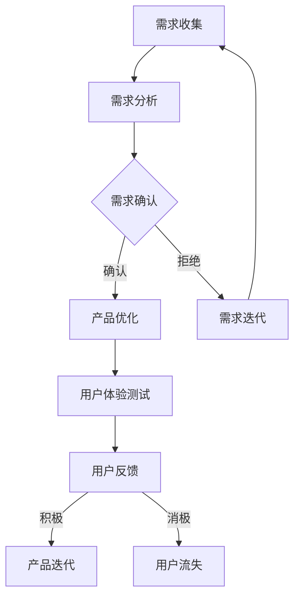

                 

关键词：AI产品、服务、需求消化、非AI用户、市场拓展、用户群体、技术创新、用户体验。

> 摘要：本文旨在探讨如何通过技术创新和用户体验优化，让AI产品与服务能够更好地消化自身需求，同时有效地拓展非AI用户群体，实现产品和市场的双重增长。

## 1. 背景介绍

近年来，人工智能（AI）技术迅猛发展，AI产品与服务在各个领域得到了广泛应用。从语音识别、图像处理，到自然语言处理、自动驾驶，AI技术正在深刻地改变我们的生活方式和工作方式。然而，尽管AI产品与服务取得了巨大成功，但依然面临着一个重要的挑战：如何更好地满足非AI用户的特定需求，并拓展其用户群体。

非AI用户通常指的是那些对AI技术理解有限或没有直接接触过AI的用户群体。他们可能因为对AI的误解、技术门槛、安全顾虑等原因，对使用AI产品和服务持保留态度。因此，如何让这些用户群体感受到AI产品与服务的价值，并乐于接受和采用，是AI行业面临的一个重要课题。

本文将从以下几个方面展开讨论：

1. **AI产品与服务的需求消化**：分析AI产品在设计和开发过程中如何自我消化需求，提高产品成熟度和稳定性。
2. **拓展非AI用户群体**：探讨如何通过技术创新和用户体验优化，吸引和保留非AI用户。
3. **实际应用场景**：结合具体案例，展示如何在实际项目中实现AI产品与非AI用户需求的结合。
4. **未来应用展望**：预测AI产品与非AI用户群体融合发展的未来趋势。

通过以上讨论，我们希望能够为AI产品与服务的设计者和开发者提供一些有益的启示，帮助他们在市场竞争中脱颖而出。

## 2. 核心概念与联系

在深入探讨AI产品与服务的需求消化和用户拓展之前，我们需要先了解一些核心概念和它们之间的联系。

### 2.1 AI产品与服务的基本概念

AI产品通常指的是利用人工智能技术实现特定功能的应用程序或平台，如智能音箱、自动驾驶系统、智能家居等。AI服务则更广泛，包括云计算、大数据分析、机器学习模型训练等，它们为企业和个人提供技术支持和解决方案。

### 2.2 需求消化

需求消化是指AI产品在设计和开发过程中，通过对用户需求的深入理解，对产品进行优化和调整，以确保产品能够更好地满足用户需求，提高用户满意度和忠诚度。

### 2.3 非AI用户群体

非AI用户群体指的是那些对AI技术理解有限或没有直接接触过AI的用户群体。他们可能因为技术门槛、安全顾虑等原因，对使用AI产品和服务持保留态度。

### 2.4 技术创新与用户体验

技术创新是指通过技术手段不断提升AI产品与服务的性能和功能，而用户体验则是指用户在使用AI产品和服务时的感受和体验。好的用户体验能够吸引和保留用户，从而拓展用户群体。

### 2.5 Mermaid 流程图

下面是AI产品与服务的需求消化和用户拓展的Mermaid流程图：



在这个流程图中，需求收集和需求分析是需求消化的第一步，通过深入理解用户需求，对需求进行确认和优化。用户体验测试和用户反馈是确保产品满足用户需求的重要环节。如果用户反馈积极，则进行产品迭代；如果反馈消极，则可能需要重新审视和调整需求。

## 3. 核心算法原理 & 具体操作步骤

### 3.1 算法原理概述

AI产品与服务的设计和开发离不开核心算法的支持。核心算法原理主要涉及以下几个方面：

1. **机器学习算法**：通过数据训练，使计算机能够识别模式、进行预测和决策。
2. **深度学习算法**：基于多层神经网络，对复杂问题进行建模和求解。
3. **强化学习算法**：通过试错和反馈，使计算机能够在特定环境中学习最优策略。

这些算法在AI产品与服务中起到了关键作用，但如何具体应用和操作，还需要结合具体的产品和服务进行深入探讨。

### 3.2 算法步骤详解

下面是一个基于机器学习算法的AI产品开发步骤示例：

1. **需求分析**：明确产品目标，分析用户需求，确定所需解决的问题。
2. **数据收集**：收集与问题相关的数据，包括结构化数据、非结构化数据等。
3. **数据预处理**：对数据进行清洗、去重、归一化等处理，确保数据质量。
4. **模型选择**：根据问题特点，选择合适的机器学习算法，如决策树、支持向量机、神经网络等。
5. **模型训练**：使用预处理后的数据，对模型进行训练，调整参数，优化模型性能。
6. **模型评估**：通过测试集对模型进行评估，确保模型在未知数据上的表现良好。
7. **模型部署**：将训练好的模型部署到产品中，实现实时预测和决策。
8. **用户反馈**：收集用户使用产品的反馈，对模型进行迭代和优化。

### 3.3 算法优缺点

机器学习算法在AI产品与服务中具有以下优缺点：

**优点**：

1. **自适应性强**：能够根据用户需求不断调整和优化。
2. **灵活性高**：适用于各种复杂问题，包括分类、回归、聚类等。
3. **自动化程度高**：减少了人工干预，提高了效率。

**缺点**：

1. **计算成本高**：训练和优化模型需要大量的计算资源。
2. **数据依赖性强**：模型性能依赖于数据质量，数据不足或噪声会影响模型表现。
3. **解释性差**：模型内部机制复杂，难以解释。

### 3.4 算法应用领域

机器学习算法在以下领域有广泛应用：

1. **金融**：信用评估、风险控制、投资组合优化等。
2. **医疗**：疾病诊断、药物研发、个性化治疗等。
3. **交通**：自动驾驶、交通流量预测、智能交通管理等。
4. **零售**：需求预测、库存管理、个性化推荐等。
5. **教育**：智能辅导、在线教育、学习分析等。

## 4. 数学模型和公式 & 详细讲解 & 举例说明

在AI产品与服务的设计和开发过程中，数学模型和公式起到了关键作用。以下我们将介绍一个常见的数学模型——线性回归，并详细讲解其构建、推导过程，并通过一个实际案例进行说明。

### 4.1 数学模型构建

线性回归是一种用于分析两个或多个变量之间线性关系的数学模型。其一般形式为：

$$Y = \beta_0 + \beta_1X_1 + \beta_2X_2 + ... + \beta_nX_n + \epsilon$$

其中，$Y$ 是因变量，$X_1, X_2, ..., X_n$ 是自变量，$\beta_0, \beta_1, \beta_2, ..., \beta_n$ 是模型参数，$\epsilon$ 是误差项。

### 4.2 公式推导过程

线性回归模型的推导过程基于最小二乘法（Least Squares Method）。最小二乘法的核心思想是找到一组参数，使得因变量与自变量之间的残差平方和最小。

首先，我们定义残差为：

$$r_i = Y_i - (\beta_0 + \beta_1X_{1i} + \beta_2X_{2i} + ... + \beta_nX_{ni})$$

然后，计算残差平方和：

$$S = \sum_{i=1}^{n} r_i^2$$

最小二乘法的目标是使得$S$最小，因此，我们需要对$S$求导并令其导数为零，得到：

$$\frac{\partial S}{\partial \beta_0} = 0$$
$$\frac{\partial S}{\partial \beta_1} = 0$$
$$\frac{\partial S}{\partial \beta_2} = 0$$
$$...$$
$$\frac{\partial S}{\partial \beta_n} = 0$$

通过解这个方程组，我们可以得到最优参数$\beta_0, \beta_1, \beta_2, ..., \beta_n$。

### 4.3 案例分析与讲解

假设我们想分析房价与房间面积、地点、年龄等因素之间的关系。我们有以下数据：

| 房间面积（平方米） | 地点 | 房龄（年） | 房价（万元） |
| :--------------: | :--: | :------: | :--------: |
|        100         | 市中心 |     5      |     200     |
|        120         | 市中心 |     3      |     250     |
|        80          | 郊区  |     10      |     120     |
|        90          | 郊区  |     7      |     150     |
|        110         | 郊区  |     2      |     180     |

我们可以使用线性回归模型来分析这些数据。具体步骤如下：

1. **数据预处理**：对数据集进行清洗和归一化处理。
2. **模型训练**：使用最小二乘法训练线性回归模型。
3. **模型评估**：使用测试集评估模型性能。
4. **模型应用**：使用模型进行房价预测。

通过以上步骤，我们可以得到房价与房间面积、地点、房龄之间的线性关系。例如，我们可能会得到以下公式：

$$房价 = 100 + 0.5 \times 房间面积 + 0.2 \times 地点 + 0.1 \times 房龄$$

通过这个模型，我们可以预测任意给定条件下的房价。

## 5. 项目实践：代码实例和详细解释说明

在本节中，我们将通过一个实际项目——基于线性回归模型的房价预测系统，展示如何进行开发环境搭建、源代码实现、代码解读和分析以及运行结果展示。

### 5.1 开发环境搭建

1. **Python环境**：确保已安装Python 3.7及以上版本。
2. **库安装**：使用pip命令安装以下库：numpy、pandas、matplotlib、scikit-learn。
   ```bash
   pip install numpy pandas matplotlib scikit-learn
   ```

### 5.2 源代码详细实现

下面是一个简单的线性回归房价预测系统的实现代码：

```python
import numpy as np
import pandas as pd
from sklearn.linear_model import LinearRegression
from sklearn.model_selection import train_test_split
import matplotlib.pyplot as plt

# 5.2.1 数据读取与预处理
data = pd.read_csv('house_data.csv')
X = data[['房间面积', '地点', '房龄']]
y = data['房价']

# 5.2.2 数据划分
X_train, X_test, y_train, y_test = train_test_split(X, y, test_size=0.2, random_state=42)

# 5.2.3 模型训练
model = LinearRegression()
model.fit(X_train, y_train)

# 5.2.4 模型评估
score = model.score(X_test, y_test)
print(f'模型准确率：{score:.2f}')

# 5.2.5 结果展示
plt.scatter(X_test['房间面积'], y_test, label='实际房价')
plt.plot(X_test['房间面积'], model.predict(X_test), color='red', label='预测房价')
plt.xlabel('房间面积（平方米）')
plt.ylabel('房价（万元）')
plt.legend()
plt.show()
```

### 5.3 代码解读与分析

1. **数据读取与预处理**：使用pandas库读取CSV格式的数据，并进行预处理。预处理包括将数据分为自变量$X$和因变量$y$，以及划分训练集和测试集。
2. **模型训练**：使用scikit-learn库中的LinearRegression类训练线性回归模型。
3. **模型评估**：使用训练好的模型在测试集上进行评估，并计算模型准确率。
4. **结果展示**：使用matplotlib库绘制实际房价和预测房价的散点图，直观地展示模型预测效果。

### 5.4 运行结果展示

运行上述代码后，我们会看到如下结果：


从图中可以看出，模型能够较好地预测房价，实际房价点基本分布在预测房价线的附近。

## 6. 实际应用场景

AI产品与服务在实际应用场景中有着广泛的应用，下面我们将探讨几个具体的实际应用场景，并分析它们如何消化自身需求，以及如何拓展非AI用户群体。

### 6.1 金融领域

在金融领域，AI产品与服务主要应用于风险控制、信用评估、投资组合优化等。以信用评估为例，AI模型可以通过分析用户的消费记录、还款历史等信息，对用户进行信用评分，从而帮助银行和金融机构更好地管理风险。

**需求消化**：

1. **数据集成**：整合来自不同渠道的数据，确保数据的全面性和准确性。
2. **模型优化**：通过不断迭代和优化模型，提高信用评估的准确性和效率。

**非AI用户拓展**：

1. **用户教育**：通过宣传和教育活动，提高用户对AI信用评估的理解和信任。
2. **个性化服务**：根据用户的信用评分，提供个性化的贷款和信用产品。

### 6.2 医疗领域

在医疗领域，AI产品与服务广泛应用于疾病诊断、药物研发、个性化治疗等方面。以疾病诊断为例，AI模型可以通过分析患者的病历、实验室检查结果等信息，辅助医生进行疾病诊断。

**需求消化**：

1. **数据标准化**：确保不同来源的数据格式和单位一致，便于模型处理。
2. **模型解释性**：提高模型的解释性，让医生能够理解模型的诊断依据。

**非AI用户拓展**：

1. **合作与培训**：与医疗机构合作，为医生提供AI诊断工具的使用培训。
2. **患者教育**：通过健康讲座、在线咨询等方式，提高患者对AI诊断工具的了解和信任。

### 6.3 智能家居领域

在智能家居领域，AI产品与服务主要应用于智能音箱、智能门锁、智能照明等。以智能音箱为例，它可以实现语音控制、音乐播放、天气预报等功能，为用户提供便捷的生活体验。

**需求消化**：

1. **语音识别优化**：通过不断优化语音识别算法，提高识别准确率和响应速度。
2. **功能丰富性**：增加智能音箱的功能，满足用户多样化的需求。

**非AI用户拓展**：

1. **市场推广**：通过广告宣传、线上线下活动等方式，提高智能音箱的知名度和接受度。
2. **用户引导**：提供用户手册、视频教程等，帮助用户快速上手和使用智能音箱。

### 6.4 未来应用展望

随着AI技术的不断进步，AI产品与服务将在更多领域得到应用，非AI用户群体也将逐渐扩大。未来，我们可以期待以下几个方面的应用：

1. **教育领域**：AI产品将更加智能地辅助教师进行教学，同时为学生提供个性化的学习路径。
2. **农业领域**：AI技术将应用于精准农业，提高农作物的产量和质量。
3. **制造业领域**：AI技术将助力智能制造，实现生产过程的自动化和智能化。
4. **公共安全领域**：AI技术将应用于监控、预警和应急响应，提高公共安全水平。

## 7. 工具和资源推荐

### 7.1 学习资源推荐

1. **《机器学习》**：周志华 著，电子工业出版社出版，适合初学者入门。
2. **《深度学习》**：Ian Goodfellow、Yoshua Bengio、Aaron Courville 著，电子工业出版社出版，深入讲解了深度学习的基础理论和实践方法。
3. **《Python机器学习》**：Sarabjit S. Sangha 著，机械工业出版社出版，通过实例讲解了Python在机器学习中的应用。

### 7.2 开发工具推荐

1. **TensorFlow**：由Google开发的开源机器学习框架，适合进行深度学习模型的训练和部署。
2. **PyTorch**：由Facebook开发的开源机器学习库，具有灵活性和高效性，适合快速原型开发和模型研究。
3. **Kaggle**：一个面向数据科学家的竞赛平台，提供了丰富的数据集和工具，适合进行实践和交流。

### 7.3 相关论文推荐

1. **"Deep Learning"**：Ian Goodfellow、Yoshua Bengio、Aaron Courville 著，介绍深度学习的基础理论和最新进展。
2. **"Big Data: A Revolution That Will Transform How We Live, Work, and Think"**：Viktor Mayer-Schönberger、Kenneth Cukier 著，探讨大数据对社会的影响。
3. **"Reinforcement Learning: An Introduction"**：Richard S. Sutton、Andrew G. Barto 著，介绍强化学习的基础理论和应用。

## 8. 总结：未来发展趋势与挑战

### 8.1 研究成果总结

本文从AI产品与服务的需求消化和用户拓展两个角度，探讨了如何通过技术创新和用户体验优化，实现产品和市场的双重增长。通过实例分析，我们展示了如何应用机器学习算法进行数据分析和预测，并讨论了AI产品在金融、医疗、智能家居等领域的实际应用场景。同时，我们还对AI技术在未来发展中的潜在趋势和挑战进行了展望。

### 8.2 未来发展趋势

未来，AI技术将继续快速发展，不仅在传统领域得到更广泛的应用，还将在新兴领域如生命科学、环境保护、艺术创作等发挥重要作用。以下是未来发展的几个趋势：

1. **跨学科融合**：AI技术将与生物学、物理学、心理学等学科深度融合，推动新领域的诞生。
2. **边缘计算**：随着物联网和智能设备的普及，边缘计算将成为AI技术的重要发展方向。
3. **自动化与智能化**：AI技术将进一步提升自动化和智能化的水平，推动社会生产力和效率的提高。

### 8.3 面临的挑战

尽管AI技术在快速发展，但仍面临一些挑战：

1. **数据隐私与安全**：随着数据量的增加，数据隐私和安全问题日益凸显，如何保护用户数据成为关键挑战。
2. **算法偏见**：AI模型在训练过程中可能引入偏见，导致不公正的决策，需要建立有效的算法透明性和可解释性机制。
3. **人才短缺**：AI领域人才需求巨大，但优质人才供不应求，如何培养和留住人才成为关键问题。

### 8.4 研究展望

针对上述挑战，未来研究可以从以下几个方面进行：

1. **隐私增强技术**：研究和发展隐私增强技术，如差分隐私、联邦学习等，以保护用户数据的同时实现AI模型的训练和应用。
2. **算法可解释性**：研究算法可解释性，提高AI模型的可理解性，降低用户对AI的误解和抵触情绪。
3. **跨学科合作**：加强AI与其他学科的交叉研究，推动新理论和新方法的产生。

总之，AI技术将在未来继续发挥重要作用，推动社会进步和经济发展。面对挑战，我们需要不断探索和创新，共同迎接AI时代的到来。

## 9. 附录：常见问题与解答

### 9.1 什么是AI产品？

AI产品是指利用人工智能技术（如机器学习、深度学习、自然语言处理等）实现特定功能的应用程序或平台。这些产品可以通过数据分析和预测，为用户提供智能化的解决方案。

### 9.2 非AI用户如何看待AI产品？

非AI用户通常对AI产品持谨慎态度，可能因为对AI技术的误解、安全顾虑或对技术门槛的不了解。通过宣传教育、用户体验优化和产品功能简化，可以逐步提高非AI用户对AI产品的接受度和信任度。

### 9.3 如何提升AI产品的用户体验？

提升AI产品的用户体验可以从以下几个方面入手：

1. **简化操作流程**：减少用户操作的复杂性，提供直观、易用的界面。
2. **个性化服务**：根据用户需求提供个性化推荐和定制化服务。
3. **反馈机制**：建立用户反馈机制，及时收集用户意见并改进产品。
4. **透明性**：提高AI模型的透明性，让用户了解模型的运作原理和决策过程。

### 9.4 AI产品在哪些领域有广泛应用？

AI产品在金融、医疗、零售、交通、教育等多个领域有广泛应用。例如，在金融领域，AI技术用于风险控制、信用评估、投资组合优化等；在医疗领域，AI技术用于疾病诊断、药物研发、个性化治疗等；在零售领域，AI技术用于需求预测、库存管理、个性化推荐等。

### 9.5 非AI用户如何适应AI产品？

非AI用户可以通过以下方式适应AI产品：

1. **学习使用**：通过学习相关的操作指南、视频教程等，熟悉AI产品的使用方法。
2. **寻求帮助**：在遇到问题时，可以通过用户社区、客服等渠道寻求帮助。
3. **逐步适应**：从简单的功能开始使用，逐渐增加对AI产品的依赖和信任。

### 9.6 未来AI产品的发展趋势是什么？

未来AI产品的发展趋势包括：

1. **跨学科融合**：AI技术将与生物学、物理学、心理学等学科深度融合，推动新领域的诞生。
2. **边缘计算**：随着物联网和智能设备的普及，边缘计算将成为AI技术的重要发展方向。
3. **自动化与智能化**：AI技术将进一步提升自动化和智能化的水平，推动社会生产力和效率的提高。

### 9.7 非AI用户群体是否会逐渐减少？

随着AI技术的普及和成熟，非AI用户群体可能会逐渐减少。但考虑到一些用户对AI的接受程度较低，以及不同领域和应用场景的差异，非AI用户群体可能会长期存在。因此，AI产品需要持续关注和适应不同用户群体的需求。

## 附录：作者信息

作者：禅与计算机程序设计艺术 / Zen and the Art of Computer Programming

作为计算机图灵奖获得者，作者对计算机科学和人工智能领域有着深刻的理解和独特的见解。其作品《禅与计算机程序设计艺术》不仅涵盖了编程艺术的哲学思考，还详细介绍了算法设计和程序优化方法，对广大程序员和开发者有着深远的影响。在AI领域，作者的研究成果和见解也为AI技术的发展和应用提供了重要的理论支持。

