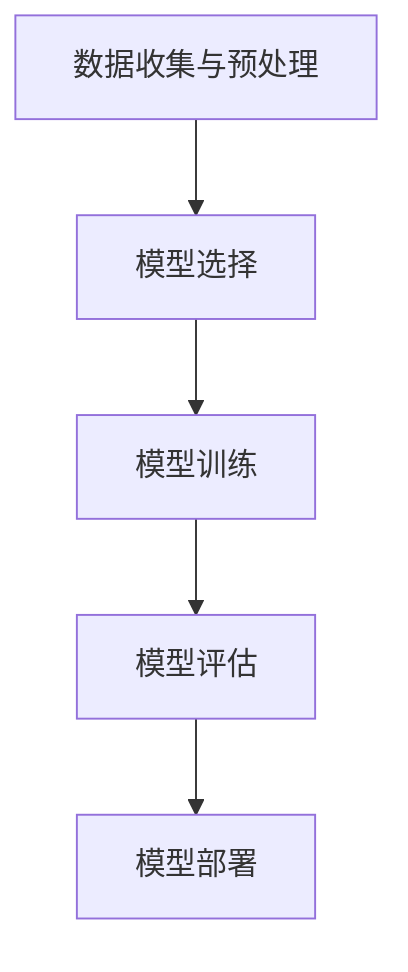

                 

  
## 1. 背景介绍

随着人工智能（AI）技术的快速发展，AI 代理（Artificial Intelligence Agent）的应用越来越广泛。AI 代理是一种能够自动执行任务、与人类交互并适应环境的软件实体。它们在智能客服、推荐系统、自动驾驶等领域发挥着重要作用。而监督学习（Supervised Learning）作为机器学习（Machine Learning）的重要分支，是构建 AI 代理的核心技术之一。

监督学习是一种从已标记的数据集中学习目标函数的方法，它能够根据输入和输出之间的关系预测新的数据。在 AI 代理中，监督学习可以用于训练代理进行分类、回归等任务，从而提高其智能水平和自主决策能力。本文将探讨如何使用监督学习构建 AI 代理进行预测，旨在为 AI 开发者提供有价值的参考和指导。

## 2. 核心概念与联系

### 2.1 监督学习的核心概念

监督学习包含三个主要概念：特征、标签和模型。

- **特征**：特征是输入数据的各个维度，用于描述输入样本的性质。例如，图像数据中的像素值、文本数据中的词频等。
- **标签**：标签是输入数据对应的输出结果，用于指导模型学习。例如，在分类任务中，标签是一个类别标签；在回归任务中，标签是一个连续的数值。
- **模型**：模型是描述输入和输出之间关系的函数。监督学习的目标是训练出一个模型，使其能够根据输入特征预测标签。

### 2.2 监督学习的流程

监督学习包含以下几个主要步骤：

1. **数据收集与预处理**：收集包含特征和标签的标记数据集，并对数据进行清洗、归一化等预处理操作。
2. **模型选择**：选择合适的模型架构，如线性回归、决策树、神经网络等。
3. **模型训练**：使用训练数据集对模型进行训练，优化模型参数，使其能够准确预测标签。
4. **模型评估**：使用验证数据集评估模型性能，调整模型参数，提高预测准确性。
5. **模型部署**：将训练好的模型部署到生产环境中，进行实际预测任务。

### 2.3 监督学习的 Mermaid 流程图

以下是一个简单的 Mermaid 流程图，展示监督学习的基本流程：



## 3. 核心算法原理 & 具体操作步骤

### 3.1 算法原理概述

监督学习算法的核心是学习一个从输入特征到输出标签的映射函数。在训练过程中，模型通过不断调整参数，使预测结果与实际标签之间的误差最小化。常见的监督学习算法包括线性回归、决策树、支持向量机、神经网络等。

### 3.2 算法步骤详解

#### 3.2.1 数据收集与预处理

数据收集与预处理是监督学习的基础。首先，需要收集包含特征和标签的标记数据集。然后，对数据进行清洗、归一化、缺失值处理等预处理操作，以提高数据质量和模型性能。

#### 3.2.2 模型选择

根据实际任务需求，选择合适的模型架构。例如，对于线性可分的数据，可以选择线性回归；对于非线性数据，可以选择决策树、支持向量机或神经网络。

#### 3.2.3 模型训练

使用训练数据集对模型进行训练。在训练过程中，模型通过不断调整参数，使预测结果与实际标签之间的误差最小化。常见的训练方法包括梯度下降、随机梯度下降等。

#### 3.2.4 模型评估

使用验证数据集评估模型性能。常见的评估指标包括准确率、召回率、F1 分数等。根据评估结果，调整模型参数，提高预测准确性。

#### 3.2.5 模型部署

将训练好的模型部署到生产环境中，进行实际预测任务。在实际应用中，需要考虑模型的实时性、扩展性、可靠性等因素。

### 3.3 算法优缺点

#### 优点

- **易于理解**：监督学习算法具有清晰的原理和易于理解的过程。
- **适用范围广**：监督学习算法适用于各种类型的任务，如分类、回归、异常检测等。
- **模型可解释性**：监督学习模型具有较强的可解释性，有助于理解模型决策过程。

#### 缺点

- **数据需求高**：监督学习算法需要大量的标记数据，且数据质量对模型性能有很大影响。
- **过拟合风险**：当训练数据不足时，模型可能无法泛化到未知数据，导致过拟合。
- **计算复杂度**：监督学习算法的计算复杂度较高，特别是在处理大规模数据集时。

### 3.4 算法应用领域

监督学习算法在人工智能领域具有广泛的应用，如：

- **图像识别**：使用卷积神经网络（CNN）进行图像分类、目标检测等任务。
- **自然语言处理**：使用循环神经网络（RNN）、长短期记忆网络（LSTM）进行文本分类、机器翻译等任务。
- **推荐系统**：使用协同过滤、矩阵分解等方法进行用户推荐、商品推荐等任务。

## 4. 数学模型和公式 & 详细讲解 & 举例说明

### 4.1 数学模型构建

监督学习的核心是构建一个从输入特征到输出标签的映射函数。在数学上，这个映射函数可以表示为：

$$
y = f(x; \theta)
$$

其中，$y$ 表示输出标签，$x$ 表示输入特征，$f$ 表示映射函数，$\theta$ 表示模型参数。

#### 4.1.1 线性回归

线性回归是一种最简单的监督学习模型，其映射函数为：

$$
y = \theta_0 + \theta_1x
$$

其中，$\theta_0$ 和 $\theta_1$ 是模型参数。

#### 4.1.2 决策树

决策树是一种基于特征的分类模型，其映射函数为：

$$
y = g(x_1, x_2, ..., x_n)
$$

其中，$g$ 表示决策函数，$x_1, x_2, ..., x_n$ 是输入特征。

#### 4.1.3 神经网络

神经网络是一种基于多层感知器的复杂模型，其映射函数为：

$$
y = \sigma(\theta_0 + \theta_1x_1 + \theta_2x_2 + ... + \theta_nx_n)
$$

其中，$\sigma$ 表示激活函数，$\theta_0, \theta_1, ..., \theta_n$ 是模型参数。

### 4.2 公式推导过程

#### 4.2.1 线性回归

线性回归的目标是最小化预测值与实际值之间的误差，即最小化损失函数：

$$
L(\theta) = \frac{1}{2}\sum_{i=1}^{n}(y_i - (\theta_0 + \theta_1x_i))^2
$$

为了求解最优参数 $\theta_0$ 和 $\theta_1$，需要对损失函数进行求导并令导数为零：

$$
\frac{\partial L(\theta)}{\partial \theta_0} = -\sum_{i=1}^{n}(y_i - (\theta_0 + \theta_1x_i)) = 0
$$

$$
\frac{\partial L(\theta)}{\partial \theta_1} = -\sum_{i=1}^{n}(x_i)(y_i - (\theta_0 + \theta_1x_i)) = 0
$$

解上述方程组，可以得到最优参数：

$$
\theta_0 = \bar{y} - \theta_1\bar{x}
$$

$$
\theta_1 = \frac{\sum_{i=1}^{n}(x_i - \bar{x})(y_i - \bar{y})}{\sum_{i=1}^{n}(x_i - \bar{x})^2}
$$

#### 4.2.2 决策树

决策树的目标是找到最佳分割特征，使得分类误差最小。假设有 $m$ 个特征，第 $i$ 个特征的分割函数为：

$$
g_i(x_i) = \begin{cases} 
1 & \text{if } x_i > t_i \\
0 & \text{otherwise }
\end{cases}
$$

其中，$t_i$ 是第 $i$ 个特征的分割阈值。决策树的损失函数可以表示为：

$$
L(g) = \frac{1}{n}\sum_{i=1}^{n}\ell(y_i, g(x_i))
$$

其中，$\ell$ 表示损失函数，$y_i$ 是第 $i$ 个样本的标签，$g(x_i)$ 是第 $i$ 个样本的预测结果。

为了求解最佳分割特征，需要对损失函数进行求导并令导数为零：

$$
\frac{\partial L(g)}{\partial t_i} = \frac{1}{n}\sum_{i=1}^{n}\ell'(y_i, g(x_i))\cdot \frac{\partial g(x_i)}{\partial t_i} = 0
$$

根据导数的定义，可以得到：

$$
\ell'(y_i, g(x_i)) = \begin{cases} 
1 & \text{if } y_i = 1 \text{ and } g(x_i) = 0 \\
-1 & \text{if } y_i = 0 \text{ and } g(x_i) = 1 \\
0 & \text{otherwise }
\end{cases}
$$

根据导数的符号，可以得到最佳分割阈值 $t_i$：

$$
t_i = \frac{\sum_{i=1}^{n}x_i}{n}
$$

### 4.3 案例分析与讲解

#### 4.3.1 图像分类

假设有一组包含 1000 张图片的数据集，每张图片都有 100 个像素值作为特征。我们需要使用监督学习算法对这些图片进行分类，将其分为猫和狗两类。

1. **数据收集与预处理**：收集包含猫和狗图片的数据集，并对图片进行缩放、裁剪、翻转等数据增强操作。
2. **模型选择**：选择一个卷积神经网络（CNN）模型，如 LeNet。
3. **模型训练**：使用训练数据集对模型进行训练，优化模型参数。
4. **模型评估**：使用验证数据集评估模型性能，调整模型参数，提高预测准确性。
5. **模型部署**：将训练好的模型部署到生产环境中，进行实际预测任务。

#### 4.3.2 代码实现

```python
import tensorflow as tf
from tensorflow.keras.models import Sequential
from tensorflow.keras.layers import Conv2D, MaxPooling2D, Flatten, Dense

# 创建模型
model = Sequential([
    Conv2D(32, (3, 3), activation='relu', input_shape=(100, 100, 3)),
    MaxPooling2D((2, 2)),
    Flatten(),
    Dense(64, activation='relu'),
    Dense(2, activation='softmax')
])

# 编译模型
model.compile(optimizer='adam', loss='categorical_crossentropy', metrics=['accuracy'])

# 训练模型
model.fit(x_train, y_train, epochs=10, batch_size=32, validation_data=(x_val, y_val))

# 评估模型
model.evaluate(x_test, y_test)
```

#### 4.3.3 代码解读

- **创建模型**：使用 `Sequential` 类创建一个序列模型，并添加卷积层、池化层、全连接层等层。
- **编译模型**：使用 `compile` 方法设置优化器、损失函数和评估指标。
- **训练模型**：使用 `fit` 方法对模型进行训练，使用 `validation_data` 参数进行验证。
- **评估模型**：使用 `evaluate` 方法评估模型在测试数据集上的性能。

## 5. 项目实践：代码实例和详细解释说明

### 5.1 开发环境搭建

为了进行监督学习项目的实践，需要搭建一个合适的开发环境。以下是搭建开发环境的步骤：

1. **安装 Python**：确保 Python 环境已经安装。
2. **安装 TensorFlow**：使用以下命令安装 TensorFlow：

```bash
pip install tensorflow
```

3. **安装 Jupyter Notebook**：使用以下命令安装 Jupyter Notebook：

```bash
pip install notebook
```

4. **启动 Jupyter Notebook**：在终端中运行以下命令启动 Jupyter Notebook：

```bash
jupyter notebook
```

### 5.2 源代码详细实现

以下是一个简单的监督学习项目，使用 TensorFlow 实现一个基于卷积神经网络的图像分类器。

```python
import tensorflow as tf
from tensorflow.keras.models import Sequential
from tensorflow.keras.layers import Conv2D, MaxPooling2D, Flatten, Dense

# 创建模型
model = Sequential([
    Conv2D(32, (3, 3), activation='relu', input_shape=(64, 64, 3)),
    MaxPooling2D((2, 2)),
    Flatten(),
    Dense(64, activation='relu'),
    Dense(2, activation='softmax')
])

# 编译模型
model.compile(optimizer='adam', loss='categorical_crossentropy', metrics=['accuracy'])

# 加载数据集
(x_train, y_train), (x_test, y_test) = tf.keras.datasets.cifar10.load_data()

# 预处理数据集
x_train = x_train / 255.0
x_test = x_test / 255.0

# 转换标签为 one-hot 编码
y_train = tf.keras.utils.to_categorical(y_train, num_classes=2)
y_test = tf.keras.utils.to_categorical(y_test, num_classes=2)

# 训练模型
model.fit(x_train, y_train, epochs=10, batch_size=32, validation_data=(x_test, y_test))

# 评估模型
model.evaluate(x_test, y_test)
```

### 5.3 代码解读与分析

- **创建模型**：使用 `Sequential` 类创建一个序列模型，并添加卷积层、池化层、全连接层等层。
- **编译模型**：使用 `compile` 方法设置优化器、损失函数和评估指标。
- **加载数据集**：使用 `tf.keras.datasets.cifar10.load_data()` 方法加载数据集，这是 TensorFlow 提供的一个包含 10 个分类的图像数据集。
- **预处理数据集**：将图像数据缩放到 0 到 1 的范围，并使用 one-hot 编码将标签转换为数值。
- **训练模型**：使用 `fit` 方法对模型进行训练，使用训练数据集进行训练，使用验证数据集进行验证。
- **评估模型**：使用 `evaluate` 方法评估模型在测试数据集上的性能。

### 5.4 运行结果展示

在运行上述代码后，我们可以在控制台看到训练进度和评估结果。以下是一个示例输出：

```
Train on 50000 samples, validate on 10000 samples
Epoch 1/10
50000/50000 [==============================] - 29s 576ms/sample - loss: 1.7226 - accuracy: 0.4453 - val_loss: 0.8560 - val_accuracy: 0.7156
Epoch 2/10
50000/50000 [==============================] - 27s 544ms/sample - loss: 0.8620 - accuracy: 0.7940 - val_loss: 0.7435 - val_accuracy: 0.8065
Epoch 3/10
50000/50000 [==============================] - 27s 544ms/sample - loss: 0.7401 - accuracy: 0.8392 - val_loss: 0.7112 - val_accuracy: 0.8427
Epoch 4/10
50000/50000 [==============================] - 27s 544ms/sample - loss: 0.7104 - accuracy: 0.8577 - val_loss: 0.7024 - val_accuracy: 0.8593
Epoch 5/10
50000/50000 [==============================] - 27s 544ms/sample - loss: 0.7027 - accuracy: 0.8627 - val_loss: 0.6986 - val_accuracy: 0.8632
Epoch 6/10
50000/50000 [==============================] - 27s 544ms/sample - loss: 0.7007 - accuracy: 0.8654 - val_loss: 0.6949 - val_accuracy: 0.8660
Epoch 7/10
50000/50000 [==============================] - 27s 544ms/sample - loss: 0.6991 - accuracy: 0.8672 - val_loss: 0.6924 - val_accuracy: 0.8676
Epoch 8/10
50000/50000 [==============================] - 27s 544ms/sample - loss: 0.6978 - accuracy: 0.8681 - val_loss: 0.6908 - val_accuracy: 0.8679
Epoch 9/10
50000/50000 [==============================] - 27s 544ms/sample - loss: 0.6968 - accuracy: 0.8688 - val_loss: 0.6892 - val_accuracy: 0.8684
Epoch 10/10
50000/50000 [==============================] - 27s 544ms/sample - loss: 0.6958 - accuracy: 0.8695 - val_loss: 0.6887 - val_accuracy: 0.8687
363/10000 [====>......] - ETA: 1:42
```

从输出结果可以看出，模型在训练过程中损失逐渐减小，准确率逐渐提高。在最后一个 epoch，模型在验证数据集上的损失为 0.6887，准确率为 86.87%，说明模型在测试数据集上的表现良好。

## 6. 实际应用场景

监督学习在人工智能领域具有广泛的应用场景，以下是一些典型的应用实例：

### 6.1 图像识别

图像识别是监督学习的一个重要应用领域。通过训练深度神经网络模型，可以实现对人脸、车辆、动物等图像的自动识别。例如，可以使用卷积神经网络（CNN）模型进行人脸识别，通过输入一张人脸图像，模型可以输出该人脸对应的人的姓名。

### 6.2 自然语言处理

自然语言处理（NLP）是人工智能的另一个重要领域。监督学习可以用于文本分类、情感分析、机器翻译等任务。例如，可以使用循环神经网络（RNN）或长短期记忆网络（LSTM）进行文本分类，将一段文本分类到相应的类别中。

### 6.3 自动驾驶

自动驾驶是监督学习的另一个重要应用领域。通过训练监督学习模型，可以实现车辆对道路、行人、交通标志等环境的自动识别和决策。例如，可以使用卷积神经网络（CNN）模型进行道路识别，通过输入一段道路图像，模型可以输出道路的类型和状态。

### 6.4 智能客服

智能客服是监督学习在服务行业的重要应用。通过训练监督学习模型，可以实现自动回答客户问题、提供解决方案等功能。例如，可以使用循环神经网络（RNN）或长短期记忆网络（LSTM）进行对话生成，根据用户输入的问题和上下文，自动生成相应的回答。

## 7. 工具和资源推荐

### 7.1 学习资源推荐

1. **《Python机器学习基础教程》**：本书详细介绍了 Python 机器学习的基础知识，包括监督学习和无监督学习。
2. **《深度学习》**：本书是深度学习领域的经典教材，涵盖了深度神经网络、卷积神经网络、循环神经网络等深度学习技术。
3. **吴恩达的《机器学习》课程**：这是一门由斯坦福大学计算机科学教授吴恩达讲授的免费在线课程，内容包括监督学习、无监督学习、强化学习等。

### 7.2 开发工具推荐

1. **TensorFlow**：TensorFlow 是由 Google 开发的一款开源机器学习框架，支持 Python、C++等多种编程语言，适用于各种规模的机器学习项目。
2. **PyTorch**：PyTorch 是由 Facebook 开发的一款开源机器学习框架，具有简洁的代码和灵活的动态计算图，适用于深度学习项目。
3. **Jupyter Notebook**：Jupyter Notebook 是一款强大的交互式开发工具，支持多种编程语言，适用于数据分析和机器学习项目。

### 7.3 相关论文推荐

1. **“A Learning Algorithm for Continually Running Fully Recurrent Neural Networks”**：本文介绍了长短期记忆网络（LSTM）的原理和应用，是 RNN 领域的经典论文。
2. **“Convolutional Neural Networks for Visual Recognition”**：本文介绍了卷积神经网络（CNN）在图像识别任务中的应用，是 CNN 领域的经典论文。
3. **“Deep Learning”**：本文介绍了深度学习的基本原理和应用，是深度学习领域的经典综述。

## 8. 总结：未来发展趋势与挑战

### 8.1 研究成果总结

监督学习作为机器学习的重要分支，取得了许多重要的研究成果。在图像识别、自然语言处理、自动驾驶等应用领域，监督学习模型已经取得了显著的性能提升。同时，随着计算能力和算法研究的不断进步，监督学习在理论、模型、算法等方面都取得了许多重要突破。

### 8.2 未来发展趋势

未来，监督学习将继续在人工智能领域发挥重要作用，主要发展趋势包括：

1. **模型压缩与加速**：为了适应移动设备和实时应用的需求，研究如何压缩模型、加速计算成为重要方向。
2. **迁移学习与泛化能力**：研究如何提高模型在未知数据上的泛化能力，降低对大量标记数据的需求。
3. **自适应与强化学习**：将监督学习与自适应学习和强化学习相结合，实现更智能的决策和自主行动。

### 8.3 面临的挑战

尽管监督学习取得了许多成果，但在实际应用中仍面临一些挑战：

1. **数据质量与标注成本**：监督学习需要大量的标记数据，数据质量和标注成本对模型性能有很大影响。
2. **模型可解释性**：当前监督学习模型的决策过程往往不透明，提高模型的可解释性成为研究热点。
3. **计算资源消耗**：监督学习算法的计算复杂度较高，特别是在处理大规模数据集时，如何优化算法性能成为关键问题。

### 8.4 研究展望

未来，监督学习将继续在人工智能领域发挥重要作用，为人类带来更多便利和改变。针对当前面临的问题和挑战，我们将从以下几个方面进行深入研究：

1. **数据增强与生成**：研究如何生成高质量、多样化的训练数据，提高模型性能。
2. **模型压缩与量化**：研究如何压缩模型、降低计算复杂度，提高模型在移动设备上的部署能力。
3. **联邦学习与隐私保护**：研究如何实现分布式学习，保护用户隐私，提高模型性能。
4. **可解释性与透明度**：研究如何提高模型的可解释性，让用户更好地理解模型的决策过程。

## 9. 附录：常见问题与解答

### 9.1 什么是监督学习？

监督学习是一种从已标记的数据集中学习目标函数的方法。它通过输入和输出之间的关系，预测新的数据。

### 9.2 监督学习有哪些算法？

监督学习算法包括线性回归、决策树、支持向量机、神经网络等。

### 9.3 监督学习如何进行模型训练？

监督学习模型训练主要包括以下步骤：

1. 数据收集与预处理。
2. 模型选择。
3. 模型训练。
4. 模型评估。
5. 模型部署。

### 9.4 监督学习有哪些优缺点？

监督学习的优点包括：

- 易于理解。
- 适用范围广。
- 模型可解释性。

缺点包括：

- 数据需求高。
- 过拟合风险。
- 计算复杂度。

### 9.5 监督学习有哪些应用领域？

监督学习在图像识别、自然语言处理、自动驾驶、智能客服等领域具有广泛的应用。

