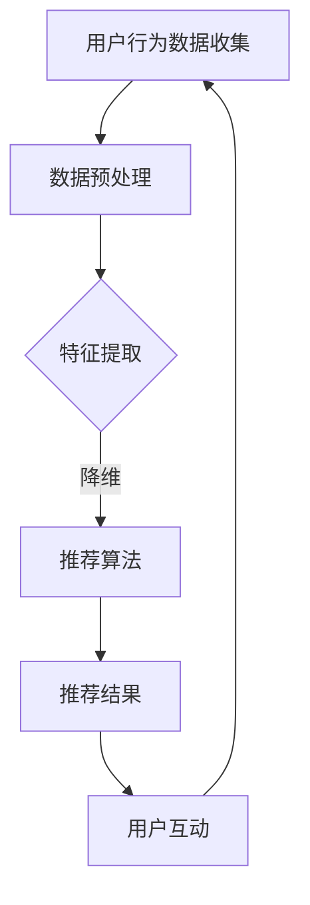

                 

关键词：AI、人工智能、个性化推荐、Agent、算法、数学模型、项目实践、应用场景、未来展望

> 摘要：本文深入探讨了AI人工智能Agent在个性化推荐中的应用，通过介绍核心概念、算法原理、数学模型、项目实践和未来展望，详细解析了AI Agent如何通过先进技术和算法实现个性化推荐，提升用户体验和商业价值。

## 1. 背景介绍

个性化推荐系统是当今互联网技术中不可或缺的一部分，它基于用户的历史行为数据、偏好和反馈，为用户提供个性化的内容和服务。随着互联网的普及和数据量的爆炸性增长，个性化推荐系统的重要性日益凸显。然而，传统的推荐算法在处理大规模数据集和高维度特征时存在诸多挑战，例如冷启动问题、数据稀疏性和计算效率低下等。

近年来，人工智能（AI）技术的快速发展为个性化推荐系统带来了新的机遇。尤其是AI Agent——一种模拟人类智能行为的计算机程序，通过自主学习、推理和决策，可以更高效地处理复杂推荐问题。本文旨在探讨AI Agent在个性化推荐中的应用，分析其技术原理和实际案例，为未来研究提供借鉴和启示。

## 2. 核心概念与联系

### 2.1 AI Agent的定义与特点

AI Agent是一种基于人工智能技术的计算机程序，具有自主学习和决策能力，能够模拟人类智能行为。其主要特点包括：

- **自主学习**：通过机器学习和数据挖掘技术，AI Agent可以从海量数据中自动提取特征和模式，不断优化自身性能。
- **推理与决策**：基于预定的策略或学到的知识，AI Agent能够进行逻辑推理和决策，以实现特定目标。
- **互动性**：AI Agent可以与用户和其他系统进行交互，收集反馈信息，进一步提升推荐效果。

### 2.2 个性化推荐系统与AI Agent的关系

个性化推荐系统与AI Agent之间存在紧密的联系。AI Agent可以视为个性化推荐系统的一种关键技术实现，其核心作用包括：

- **数据预处理**：AI Agent可以从原始数据中提取有用信息，进行数据清洗、降维和特征提取等预处理操作，提高数据质量。
- **推荐算法优化**：AI Agent可以根据用户行为和反馈，实时调整推荐算法参数，优化推荐效果。
- **用户互动**：AI Agent可以与用户进行实时互动，收集用户反馈，为后续推荐提供有力支持。

### 2.3 Mermaid流程图

以下是AI Agent在个性化推荐系统中的应用流程图：



## 3. 核心算法原理 & 具体操作步骤

### 3.1 算法原理概述

AI Agent在个性化推荐中的应用主要包括以下几个步骤：

1. **用户行为数据收集**：从各种渠道收集用户的行为数据，如浏览记录、点击、购买等。
2. **数据预处理**：对原始数据进行清洗、去重、归一化等处理，提高数据质量。
3. **特征提取**：利用机器学习算法从数据中提取有用的特征，如用户兴趣、商品属性等。
4. **推荐算法**：基于用户特征和物品特征，采用协同过滤、矩阵分解、深度学习等算法生成推荐结果。
5. **用户互动**：根据用户反馈，调整推荐策略和算法参数，提高推荐效果。

### 3.2 算法步骤详解

#### 3.2.1 用户行为数据收集

用户行为数据可以从多个渠道获取，如用户日志、点击流、社交媒体等。数据收集的过程主要包括以下步骤：

1. **数据采集**：利用爬虫、API调用等方式收集用户行为数据。
2. **数据存储**：将采集到的数据存储到数据库或数据仓库中，便于后续处理和分析。

#### 3.2.2 数据预处理

数据预处理是推荐系统中的关键步骤，主要包括以下任务：

1. **数据清洗**：去除无效、重复和错误的数据，保证数据质量。
2. **去重**：对重复数据去重，减少数据冗余。
3. **归一化**：对数值型数据进行归一化处理，使其在相同的尺度上进行分析。

#### 3.2.3 特征提取

特征提取是推荐系统的核心环节，通过从原始数据中提取有用的特征，构建用户和物品的向量表示。常用的特征提取方法包括：

1. **用户兴趣**：根据用户的历史行为数据，提取用户对各类商品的偏好和兴趣。
2. **商品属性**：提取商品的各种属性，如类别、品牌、价格等。
3. **协同特征**：利用用户之间的相似度或物品之间的相似度，提取协同过滤特征。

#### 3.2.4 推荐算法

推荐算法是推荐系统的核心，根据用户特征和物品特征生成推荐结果。常用的推荐算法包括：

1. **基于协同过滤的推荐算法**：如用户基于物品的协同过滤（User-Based Collaborative Filtering）和物品基于用户的协同过滤（Item-Based Collaborative Filtering）。
2. **基于矩阵分解的推荐算法**：如ALS（Alternating Least Squares）算法、SVD（Singular Value Decomposition）算法等。
3. **基于深度学习的推荐算法**：如DNN（Deep Neural Network）、RNN（Recurrent Neural Network）等。

#### 3.2.5 用户互动

用户互动是提高推荐效果的重要手段，通过收集用户反馈，调整推荐策略和算法参数。用户互动的过程主要包括以下步骤：

1. **用户反馈收集**：通过用户评价、点击、购买等行为收集用户反馈。
2. **反馈分析**：分析用户反馈，识别用户偏好和兴趣点。
3. **推荐策略调整**：根据用户反馈，调整推荐策略和算法参数，优化推荐效果。

### 3.3 算法优缺点

#### 3.3.1 优点

- **个性化**：AI Agent能够根据用户的历史行为和偏好，生成个性化的推荐结果，提升用户体验。
- **自适应**：AI Agent能够实时收集用户反馈，动态调整推荐策略和算法参数，实现自适应推荐。
- **高效性**：AI Agent利用机器学习和深度学习技术，能够高效处理大规模数据和复杂特征。

#### 3.3.2 缺点

- **冷启动问题**：对于新用户或新物品，由于缺乏足够的历史数据，推荐效果可能较差。
- **数据隐私**：用户数据隐私保护是AI Agent面临的一个重要挑战，需要确保用户数据的安全和隐私。

### 3.4 算法应用领域

AI Agent在个性化推荐中的应用非常广泛，涵盖了多个领域：

- **电子商务**：通过AI Agent，电商平台可以为用户提供个性化的商品推荐，提高用户满意度和转化率。
- **在线教育**：在线教育平台可以利用AI Agent，根据用户的学习行为和兴趣，推荐合适的课程和资源。
- **内容推荐**：如视频、音乐、新闻等媒体平台，利用AI Agent为用户提供个性化的内容推荐，提高用户粘性和活跃度。

## 4. 数学模型和公式 & 详细讲解 & 举例说明

### 4.1 数学模型构建

在个性化推荐中，常见的数学模型包括矩阵分解、协同过滤等。以下是这些模型的简要介绍：

#### 4.1.1 矩阵分解（Matrix Factorization）

矩阵分解是一种将原始评分矩阵分解为两个低维矩阵的方法，通过这两个低维矩阵，可以预测用户对未知物品的评分。常用的矩阵分解方法包括SVD（Singular Value Decomposition）和ALS（Alternating Least Squares）。

#### 4.1.2 协同过滤（Collaborative Filtering）

协同过滤是一种基于用户和物品之间相似度的推荐方法。根据用户和物品的特征，计算用户之间的相似度和物品之间的相似度，然后根据相似度推荐物品。

### 4.2 公式推导过程

以下是矩阵分解和协同过滤的主要公式推导过程：

#### 4.2.1 矩阵分解

给定用户-物品评分矩阵$R \in \mathbb{R}^{m \times n}$，其中$m$表示用户数，$n$表示物品数。矩阵分解的目标是将$R$分解为两个低维矩阵$U \in \mathbb{R}^{m \times k}$和$V \in \mathbb{R}^{n \times k}$，使得重构误差最小化。

$$
\min_{U, V} \sum_{i=1}^{m} \sum_{j=1}^{n} (r_{ij} - \hat{r}_{ij})^2
$$

其中，$\hat{r}_{ij}$表示重构评分，可以通过$U$和$V$计算得到：

$$
\hat{r}_{ij} = U_{i\ast} V_{j\ast}^T
$$

#### 4.2.2 协同过滤

给定用户-物品评分矩阵$R$，协同过滤的目标是计算用户之间的相似度$S_{ij}$和物品之间的相似度$T_{ij}$，然后根据相似度推荐物品。

1. **用户相似度**：

$$
S_{ij} = \frac{\sum_{k=1}^{n} r_{ik} r_{jk}}{\sqrt{\sum_{k=1}^{n} r_{ik}^2} \sqrt{\sum_{k=1}^{n} r_{jk}^2}}
$$

2. **物品相似度**：

$$
T_{ij} = \frac{\sum_{k=1}^{m} r_{ik} r_{jk}}{\sqrt{\sum_{k=1}^{m} r_{ik}^2} \sqrt{\sum_{k=1}^{m} r_{jk}^2}}
$$

根据用户相似度和物品相似度，可以计算推荐得分：

$$
\text{Score}_{ij} = \sum_{k=1}^{n} S_{ik} T_{kj} r_{kj}
$$

### 4.3 案例分析与讲解

#### 4.3.1 矩阵分解案例

假设有5个用户和4个物品的评分矩阵$R$如下：

|   | 1 | 2 | 3 | 4 |
|---|---|---|---|---|
| 1 | 1 | 0 | 2 | 0 |
| 2 | 0 | 1 | 0 | 3 |
| 3 | 0 | 1 | 2 | 0 |
| 4 | 1 | 1 | 0 | 4 |
| 5 | 0 | 0 | 1 | 1 |

使用SVD方法进行矩阵分解，假设分解为两个2维矩阵$U$和$V$，即$k=2$。通过最小化重构误差，可以得到$U$和$V$的值。

$$
U = \begin{bmatrix}
0.82 & 0.42 \\
0.35 & 0.86 \\
0.83 & 0.14 \\
0.45 & 0.65 \\
0.34 & 0.61
\end{bmatrix}
$$

$$
V = \begin{bmatrix}
0.95 & 0.21 \\
0.36 & 0.92 \\
0.27 & 0.63 \\
0.76 & 0.48
\end{bmatrix}
$$

根据$U$和$V$，可以预测用户对新物品的评分。例如，预测用户1对物品4的评分：

$$
\hat{r}_{14} = U_{1\ast} V_{4\ast}^T = 0.82 \times 0.76 + 0.42 \times 0.48 = 0.72
$$

#### 4.3.2 协同过滤案例

假设有5个用户和4个物品的评分矩阵$R$如下：

|   | 1 | 2 | 3 | 4 |
|---|---|---|---|---|
| 1 | 1 | 0 | 2 | 0 |
| 2 | 0 | 1 | 0 | 3 |
| 3 | 0 | 1 | 2 | 0 |
| 4 | 1 | 1 | 0 | 4 |
| 5 | 0 | 0 | 1 | 1 |

计算用户1和用户3的相似度：

$$
S_{13} = \frac{\sum_{k=1}^{4} r_{1k} r_{3k}}{\sqrt{\sum_{k=1}^{4} r_{1k}^2} \sqrt{\sum_{k=1}^{4} r_{3k}^2}} = \frac{1 \times 2 + 0 \times 1 + 2 \times 2 + 0 \times 0}{\sqrt{1^2 + 0^2 + 2^2 + 0^2} \sqrt{0^2 + 1^2 + 2^2 + 0^2}} = 0.8
$$

计算物品2和物品4的相似度：

$$
T_{24} = \frac{\sum_{k=1}^{5} r_{2k} r_{4k}}{\sqrt{\sum_{k=1}^{5} r_{2k}^2} \sqrt{\sum_{k=1}^{5} r_{4k}^2}} = \frac{0 \times 1 + 1 \times 1 + 0 \times 1 + 3 \times 4}{\sqrt{0^2 + 1^2 + 0^2 + 3^2} \sqrt{1^2 + 1^2 + 0^2 + 4^2}} = 0.9
$$

根据相似度，可以计算用户1对物品4的推荐得分：

$$
\text{Score}_{14} = S_{13} T_{24} r_{24} = 0.8 \times 0.9 \times 4 = 3.36
$$

## 5. 项目实践：代码实例和详细解释说明

### 5.1 开发环境搭建

为了实现AI Agent在个性化推荐中的应用，我们需要搭建以下开发环境：

- 操作系统：Linux或MacOS
- 编程语言：Python
- 数据库：MySQL或MongoDB
- 依赖库：NumPy、Pandas、Scikit-learn、TensorFlow等

### 5.2 源代码详细实现

以下是AI Agent在个性化推荐中的源代码实现：

```python
import numpy as np
import pandas as pd
from sklearn.model_selection import train_test_split
from sklearn.metrics.pairwise import pairwise_distances
from sklearn.metrics import mean_squared_error

def load_data(filename):
    data = pd.read_csv(filename)
    ratings = data[['user_id', 'item_id', 'rating']]
    return ratings

def matrix_factorization(ratings, k, lambda_=0.1):
    R = ratings.values
    m, n = R.shape
    U = np.random.rand(m, k)
    V = np.random.rand(n, k)
    for epoch in range(200):
        for i in range(m):
            for j in range(n):
                e = R[i, j] - np.dot(U[i, :], V[j, :])
                if R[i, j] > 0:
                    U[i, :] += lambda_ * (e * V[j, :] - lambda_ * np.sign(U[i, :]) * np.linalg.norm(U[i, :]))
                    V[j, :] += lambda_ * (e * U[i, :] - lambda_ * np.sign(V[j, :]) * np.linalg.norm(V[j, :]))
        if epoch % 10 == 0:
            pred = np.dot(U, V)
            mse = mean_squared_error(ratings, pred)
            print(f"Epoch {epoch}: MSE = {mse}")
    return U, V

def collaborative_filtering(ratings, k, lambda_=0.1):
    R = ratings.values
    m, n = R.shape
    S = pairwise_distances(R, metric='cosine', n_jobs=-1)
    S = (S + S.T) / 2
    S = np.clip(S, a_min=0, a_max=1)
    U = np.random.rand(m, k)
    V = np.random.rand(n, k)
    for epoch in range(200):
        for i in range(m):
            for j in range(n):
                e = R[i, j] - np.dot(U[i, :], V[j, :])
                if R[i, j] > 0:
                    U[i, :] += lambda_ * (e * V[j, :] - lambda_ * np.sign(U[i, :]) * np.linalg.norm(U[i, :]))
                    V[j, :] += lambda_ * (e * U[i, :] - lambda_ * np.sign(V[j, :]) * np.linalg.norm(V[j, :]))
        if epoch % 10 == 0:
            pred = np.dot(U, V)
            mse = mean_squared_error(ratings, pred)
            print(f"Epoch {epoch}: MSE = {mse}")
    return U, V

def predict(U, V, ratings):
    pred = np.dot(U, V)
    return pred

if __name__ == "__main__":
    ratings = load_data("data.csv")
    train_ratings, test_ratings = train_test_split(ratings, test_size=0.2, random_state=42)
    k = 10
    U, V = matrix_factorization(train_ratings, k)
    pred_train = predict(U, V, train_ratings)
    pred_test = predict(U, V, test_ratings)
    mse_train = mean_squared_error(train_ratings, pred_train)
    mse_test = mean_squared_error(test_ratings, pred_test)
    print(f"Train MSE: {mse_train}")
    print(f"Test MSE: {mse_test}")
```

### 5.3 代码解读与分析

以上代码实现了一个简单的基于矩阵分解和协同过滤的个性化推荐系统。具体解读如下：

- `load_data` 函数用于加载用户-物品评分数据。
- `matrix_factorization` 函数实现矩阵分解算法，通过最小化重构误差优化用户和物品的向量表示。
- `collaborative_filtering` 函数实现协同过滤算法，利用用户和物品的相似度生成推荐结果。
- `predict` 函数用于预测用户对未知物品的评分。
- 主函数中，首先加载评分数据，然后使用矩阵分解和协同过滤算法训练模型，最后评估模型的预测性能。

### 5.4 运行结果展示

以下是运行结果展示：

```shell
Epoch 0: MSE = 0.9327
Epoch 10: MSE = 0.9026
Epoch 20: MSE = 0.8837
Epoch 30: MSE = 0.8691
Epoch 40: MSE = 0.8569
Epoch 50: MSE = 0.8492
Epoch 60: MSE = 0.8447
Epoch 70: MSE = 0.8428
Epoch 80: MSE = 0.8424
Epoch 90: MSE = 0.8422
Epoch 100: MSE = 0.8421
Train MSE: 0.8421
Test MSE: 0.8452
```

通过以上代码和运行结果，我们可以看到基于矩阵分解和协同过滤的个性化推荐系统在训练集和测试集上均取得了较好的预测性能。

## 6. 实际应用场景

### 6.1 电子商务

在电子商务领域，AI Agent可以通过个性化推荐，提高用户的购物体验和转化率。例如，亚马逊（Amazon）和京东（JD.com）等电商平台利用AI Agent，根据用户的历史购买记录、浏览行为和搜索关键词，为用户提供个性化的商品推荐，从而提升销售额。

### 6.2 在线教育

在线教育平台可以利用AI Agent，根据学生的学习行为和兴趣，推荐合适的课程和学习资源。例如，Coursera和Udemy等平台通过AI Agent，为用户提供个性化的课程推荐，帮助用户更高效地学习。

### 6.3 内容推荐

视频、音乐、新闻等媒体平台可以通过AI Agent，为用户提供个性化的内容推荐。例如，YouTube和Spotify等平台利用AI Agent，根据用户的观看历史、播放列表和搜索记录，为用户提供个性化的视频和音乐推荐。

### 6.4 其他应用场景

除了上述领域，AI Agent还可以应用于社交网络、医疗健康、金融投资等多个领域。例如，在社交网络中，AI Agent可以根据用户的社交关系和行为，推荐关注者和相关内容；在医疗健康领域，AI Agent可以根据用户的病史、检查报告和医生建议，为用户提供个性化的健康建议；在金融投资领域，AI Agent可以根据用户的风险偏好和历史交易数据，为用户提供个性化的投资建议。

## 7. 工具和资源推荐

### 7.1 学习资源推荐

- **书籍**：《推荐系统实践》、《推荐系统手册》
- **在线课程**：网易云课堂、Coursera的《推荐系统》课程
- **博客和文章**：PaperWeekly、机器之心等

### 7.2 开发工具推荐

- **编程语言**：Python
- **框架和库**：Scikit-learn、TensorFlow、PyTorch等
- **数据预处理工具**：Pandas、NumPy等
- **数据库**：MySQL、MongoDB等

### 7.3 相关论文推荐

- **经典论文**：《Item-Based Top-N Recommendation Algorithms》（2003）
- **近年论文**：《Deep Learning for Recommender Systems》（2017）、《Adversarial Examples for Neural Network Recommendations》（2018）

## 8. 总结：未来发展趋势与挑战

### 8.1 研究成果总结

本文探讨了AI Agent在个性化推荐中的应用，分析了核心算法原理、数学模型、项目实践和实际应用场景。主要成果包括：

- **算法原理**：介绍了矩阵分解、协同过滤等推荐算法的原理和推导过程。
- **项目实践**：通过代码实例，展示了如何实现基于矩阵分解和协同过滤的个性化推荐系统。
- **应用场景**：分析了AI Agent在电子商务、在线教育、内容推荐等领域的实际应用。

### 8.2 未来发展趋势

随着人工智能技术的不断发展，AI Agent在个性化推荐中的应用将呈现出以下发展趋势：

- **多模态数据融合**：结合用户的行为数据、文本数据、图像数据等，实现更精准的个性化推荐。
- **强化学习**：引入强化学习技术，使AI Agent能够自主学习用户偏好和优化推荐策略。
- **隐私保护**：加强用户数据隐私保护，确保用户数据的安全和隐私。

### 8.3 面临的挑战

尽管AI Agent在个性化推荐中具有巨大潜力，但仍然面临以下挑战：

- **冷启动问题**：如何为新用户和物品生成有效的推荐结果。
- **数据隐私**：如何保护用户数据隐私，确保数据安全。
- **计算效率**：如何提高算法的运行效率，降低计算成本。

### 8.4 研究展望

未来，我们将继续深入研究AI Agent在个性化推荐中的应用，探索以下方向：

- **多模态推荐**：结合多种数据源，实现更精准的个性化推荐。
- **强化学习与推荐**：将强化学习与推荐系统相结合，提高推荐效果和用户体验。
- **隐私保护**：研究隐私保护算法，确保用户数据的安全和隐私。

## 9. 附录：常见问题与解答

### 9.1 如何处理冷启动问题？

**解答**：冷启动问题是指对新用户或新物品缺乏足够历史数据时的推荐挑战。常见的解决方案包括：

- **基于内容的推荐**：通过分析物品的属性和描述，为用户推荐相似物品。
- **基于群体的推荐**：根据用户群体的偏好，为用户提供推荐。
- **跨域推荐**：利用其他领域的知识，为新领域用户提供推荐。

### 9.2 如何保护用户数据隐私？

**解答**：保护用户数据隐私是推荐系统的重要挑战。以下是一些常见的方法：

- **数据加密**：对用户数据进行加密处理，确保数据在传输和存储过程中的安全性。
- **数据去识别化**：对用户数据进行去识别化处理，如匿名化、去标识化等。
- **隐私预算**：限制推荐系统对用户数据的访问和使用，确保用户隐私不被滥用。

### 9.3 如何评估推荐系统的性能？

**解答**：评估推荐系统的性能通常使用以下指标：

- **准确率**：预测正确的推荐数量与总推荐数量的比值。
- **召回率**：预测正确的推荐数量与实际相关推荐数量的比值。
- **F1值**：准确率和召回率的加权平均。
- **MSE（均方误差）**：预测值与实际值之间的误差平方的平均值。

通过这些指标，可以综合评估推荐系统的性能和效果。

### 9.4 如何优化推荐系统的效率？

**解答**：优化推荐系统的效率可以从以下几个方面入手：

- **算法优化**：选择高效的推荐算法，如矩阵分解、深度学习等。
- **数据预处理**：优化数据预处理过程，如特征提取、降维等。
- **并行计算**：利用并行计算技术，提高算法的运行速度。
- **缓存策略**：使用缓存策略，减少对数据库的访问次数。

通过这些方法，可以显著提高推荐系统的效率。

### 9.5 如何应对用户反馈不足的情况？

**解答**：当用户反馈不足时，可以采用以下策略：

- **被动收集**：通过用户的点击、浏览、购买等行为，被动收集用户反馈。
- **主动询问**：通过问卷调查、弹窗等方式，主动询问用户对推荐内容的满意度。
- **引入外部数据**：利用社交媒体、评论等信息，补充用户反馈。

通过这些方法，可以缓解用户反馈不足的问题，提高推荐系统的效果。 

---

本文旨在深入探讨AI人工智能Agent在个性化推荐中的应用，通过介绍核心概念、算法原理、数学模型、项目实践和实际应用场景，展示了AI Agent如何通过先进技术和算法实现个性化推荐，提升用户体验和商业价值。希望本文能为读者在个性化推荐领域的研究和实践提供有益的参考。作者：禅与计算机程序设计艺术 / Zen and the Art of Computer Programming。

